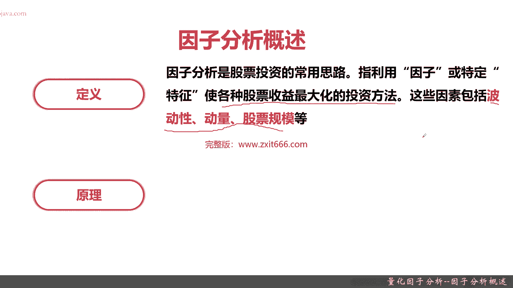
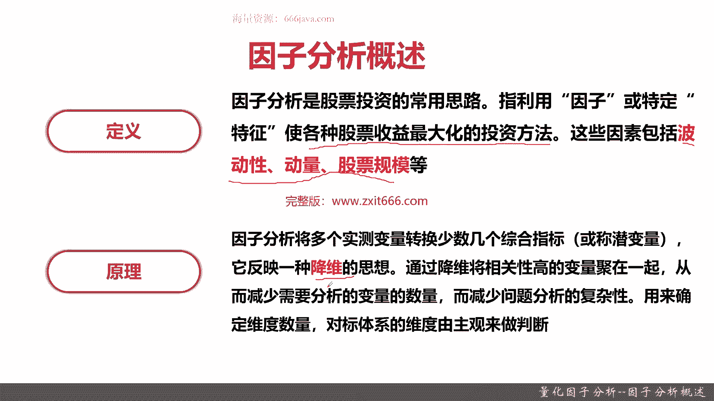
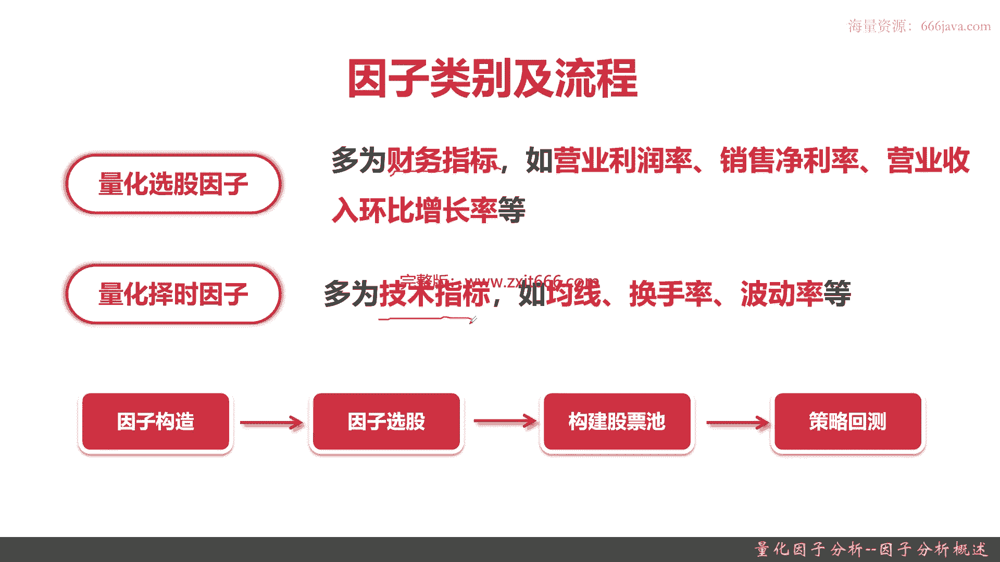
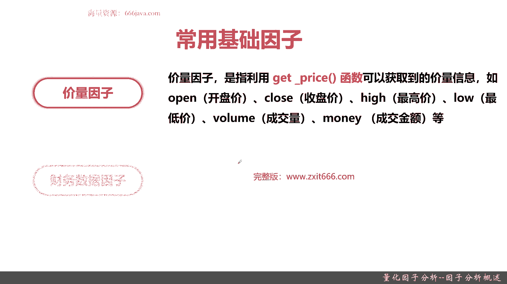
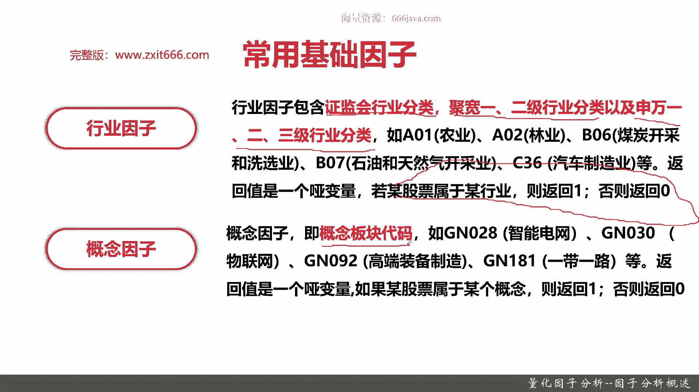
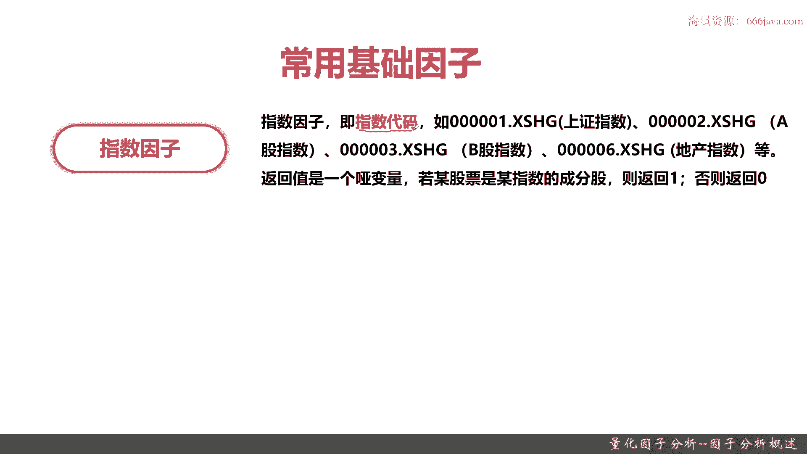
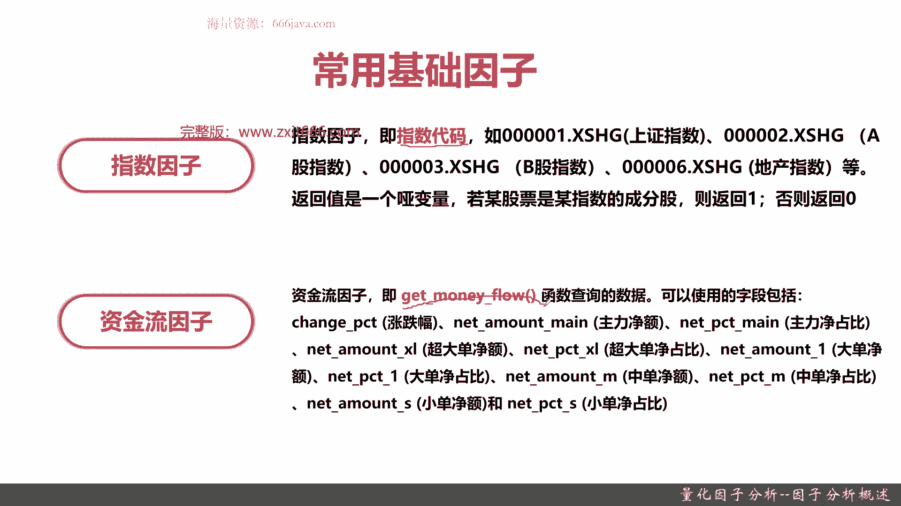
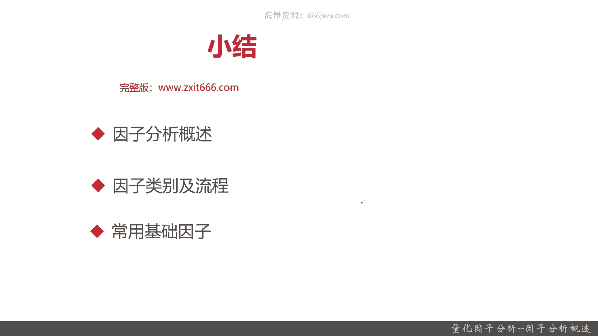

# 基于Python的股票分析与量化交易入门到实践 - P52：12.1 Python量化交易--因子分析_量化因子分析--因子分析概述 - 纸飞机旅行家 - BV1rESFYeEuA

大家好，我是米提亚，在上一章呢我给大家介绍了量化策略的回测，那么这一章呢我将给大家介绍，量化策略非常重要的一个组成部分，因此分析，那么这一节呢我将向大家介绍一下，因子分析的概述。

本节我们将从以下三个部分，给大家介绍一下因子分析的概述，首先老样子啊，那第一个肯定是因子分析整体的概述，那包括因子分析定义呀，然后还有一些因子分析的基本原理好，那么接下来呢是因子分析的类别。

也就是它分类和它一些具体的流程，最后就是一些常用的基础类的因子好，那么接下来呢我给大家介绍一下，因子分析的概述，首先是因子分析的定义啊，什么是因子分析，因子分析呢，他就是股票投资的常用思路，指的是利用。

因此这里是因此也有可能呢，用那个机器学习一些的方法，叫特征或者是指标，使各种股票收益最大化的投资方法，就通过因此或者特定指标或者特定特征，使股票收益最大化，那就叫因此分析这些因素，可能包括波动性，动量。

股票规模等等，这是因子分析的定义啊，那因子分析具体的原理。

其实因子分析是一个统计学的那个范畴，那具体原理呢就是一个降维的思想，那因此分析呢和现在比较火热的深度学习，恰好不一样，他希望把影响股价变化的那么多种可能的因素，缩减为特定的几种。

那主要是把相关性高的变量聚在一起，找到这些特征指标，减少呢那个需要分析的复杂度，那这样呢可以更合理的，或者更容易的去预测股价，以上呢就是因子分析的概述，下面呢给大家介绍一下因子分析它有哪。

有哪些因子的种类。

和它一些基本的因子分析的具体流程，因此分析呢它有两个类别，那分别呢之前我们给大家用了两章的内容介绍，同学们可以想起来吧，一个是量化选股因子，一个是量化择时的因子，那量化选股这类因素呢它有个特点。

多为财务类的指标，比方说营业的利润率啊，销售净利率啊，呃营收环比增长率啊等等等等等，之前量化选股因子呢我们给大家介绍了不少，那这一点呢就不再展开给大家回呃，回顾了，同学们自己可以去回到上一章节。

就是量化学选股内场去看一看，还有一个呢是量化择时的因子，那量化择时因子呢主要是一些技术指标，比如说均线啊，换手率啊，波动率啊，然后KDG啊，MACD啊，ma啊，然后或者是其他的一些各种指标。

我们在量化择时那一章呢也给大家介绍了不少，这两大类也是股票常用的名词，一般来说呢实际的的策略呢都是相对比较复杂，就是选股加择时可能因此是同时用的，那因此分析常见的流程是什么，主要是以下四步，第一步进行。

因此构造化或者叫咱们进行选择，因此那因此有那么多种，有那么多种指标，我们自己呢因为主要是应用，不需要去研发那些刺激的因子，当然了，等到同学们超过现在的水平，对股价，股市或者量化策略有自己独特理解。

可以自己尝试着去构造一些因子，自己去创造创新一些，因此接着呢根据你选定的因子进行选股，其实就是通过引因子筛选股票，那你筛选了股票，自然就构建了一个股票池，构建了股票时，那你的策略量化策略。

就只要根据你的因子去判断买入和卖出的信号，然后就可以进行相应的交易，就像我们上一章给大家介绍MACD策略一样，那最后呢又回到了策略回撤，策略回撤完，必然你会发现，通过我们之前策略回测发现的那些指标。

必然会发现你的量化策略里面，或者你的因子有哪些需要去优化的，你可能又会去优化它，直到你满意为止，那这个就是因子分析的常见的流程，那么接下来呢给大家介绍一下，常用的基础的音色。

这种情况就不仅仅就是局限于上面两大类了，这块主要是给大家介绍，去宽量化平台可以常用的一些基础因素，有以下六点，首先是价量，因此，价量，因此通过聚化量化平台其实就是get price。

这个函数主要有开盘价，收盘价，最高价，最低价，成交量，成交金额等等等等等等，我们在之前的那个数据获取的那一章呢，给大家详细介绍了，get price可以获得到什么样的参数好，再一个呢是财务数据类，因此。

财务数据因子指的是当日可以看到的，最新的单季财务指标，一般来说是季度更新，因为股票规定的其实主要是A股规定的，上市公司，至少是季度计披露，那半年和年报呢也得必须披露，那更细的频率呢。

比如说月和周呢就没有它披露的必要了，财务类数据的因子呢一般有p e ratio呃，Turn over ratio，比如说就是呃也就是动态市盈率啊，换手率啊，市净率啊，股票的总市值啊。

然后股票流通持势等等等等等。

然后接下来两类呢分别是行业因子和概念因子，那行业因子概念，因此还有我们再给大家要介绍的指数因子呢，可能同学们有印象的话，或许我我们给之前给大家专门介绍了，股票的分类，那首先呢是股票的行业。

行业呢一般包括证监会的行业分类巨宽，自己的一二级分类，还有申外123级会，这个呢同学们呢可以再回到第一章，股票交易的基础知识里面去看一看，那他呢这个就是这三个行业，因此概念。

因此还有下面给大家介绍的指数因子呢，它都是个哑变量，也就是说他不会告诉你这个股票是哪个行业，他只会告诉你这个股票对于这个行业来说，他是零还是1OK啊，这个同学们记住啊，这就是行业，因此然后呢是概念。

因此概念其实就是概念板块的意思，那在这个区块链化平台上，把概念板块代码给抽象出来，那其实不光是区块量化平台啊，其他的一些量化平台都有一些概念板块，其实就是把它一个编码，常见的的呢比如说有智能电网啊。

物联网啊，高端装备制造啊，一带一路啊，像现在比较热的那那个ChatGPT，还有武器等等，那这个概念因子呢它也是个压变量，如果这个股票属于某个概念返回一。

否则是零，最后两个常用的基数因子呢，一个是指数因子，还有一个呢是资金流因子，那么先介绍指数因子，指数因子其实是参考上面给大家说到的，行业因子，还有概念因子，它呢也是个哑变量，它指的呢就是指数代码。

也就是说它的表征的意义，就是这个股票是不是这个指数的成份股，那如果是他就返回一，如果否就返回零。

那最后一个呢是资金流，因此了资金流因子呢就是get money flow，英文翻译过来就是获取资金流信息，那它有的字段呢，比如说说涨跌幅，比如说主力净额，比如说主力的净占比，比如说超大单净额。

超大单净占比，大单净额，大单净占比，中单净额，中单进占比，小单净额和小单进占比等等等等等等，这个资金流流呢的因子呢，呃一般来说其实反映了股价，还有对于这个庄家或者主力，他的一个变化的情况。

那比如说庄家他比较强，那他的走势是什么，通过资金流占比，资金流这个因子就可以反映出来，以上呢就是本节的全部内容。

那么下面呢进入本章小结，本章呢从三个部分给大家介绍了因此的概述，首先是因子分析的定义，那因此分析呢就是股票投资的常用思路，它指的是利用因此或者特定的特征，或者是特定指标，去使我们各种股票投资策略。

收益呢最大化的投资方法，这些因素可以是波动性，可以是动量，可以是股票规模，那甚至可以是这个资金流向等等等等等，那呃因子分析的关键原理呢，其实就是要找到特定的或者少数几个综合指标，然后呢把它进行降维。

也就是说通过把相关性高的变量聚在一起，从而呢减少需要分析的维度，这样呢就可以减少分析的复杂性，那我们的预测呢就更容易，这个因子构建呢有经验的，也有一些统计的方法，这个因子分析的原理。

恰恰和现在比较热的那个深度学习，它是相反的，深度学习是越复杂越好，那个维度越高越好，而因子分析呢就是要把它抽象剥离，那么下面呢是因子类别和流程，那因子的类别我们主要是两大类别，一个是量化选股的因子。

一个是量化择时的因子，我们分别在前面几章给大家介绍过了，那量化选股因子呢基本上基本上都是财务指标，比如说营额，营业利润率啊，销售净利率啊，营收的环比增长，营收同比增长等等。

量化择时因子呢基本上多为技术指标，比如说均线ma m AC DK d j换手率，波动率等等等等等等，那因子的流程呢也是一般四步，首先构造因子，接着呢因此选股，那因此选完股呢。

其实你就可以构造属于你自己的股票史了，最后呢其实就是运用你的策略进行策略回测好，那么后面呢是最后一部分，给大家介绍了六种常用的基础因子，分别是价量，因此财务数据，因此还有行业，因此概念。

因此指数因子和资金流，因此其中下列因子呢就指的是get price函数，可以获取的那个价量信息，比方说收盘价，开盘价，最高价，最低价，成交量，成交金额等等，那财务数据的因子呢就是指的是呃上市公司。

它可以看到的最新的单季的财务指标，比如说动态市盈率，换手率，市净率等等，那行业因此概念因此还有一个指数，因此呢其实都是一些亚变量，它都是表征我这支股票是不是属于这个行业，是不是属于这个概念板块。

或者是属是不是属于这个指数，它是这个它是不是这个指数的成分股等等，那行业呢呃包括证监会行业分类，还有申外123级分行业分类，还有区块他自己的一二级的行业分类，概念呢就是概念板块。

这个呢呃具体的有哪些板块，同学们可以有兴趣可以去查一下，区宽API的数据字典，指数因子呢其实就是常用的有哪些指数，比如说上证指数啊，沪深300，中证五零啊等等等等等，最后一个是资金流，因此资金流。

因此呢就是指的是get money floor这个函数，它主要是表征这个时候这个股价在这些天里面，资金的整体的流向，比如说涨跌幅，比如说主力净额，比如说超大量占比或者是超大单净额。

或者是小单金额等等等等，好以上呢就是本节的全部内容，我是米切尔，大家下期再见。

