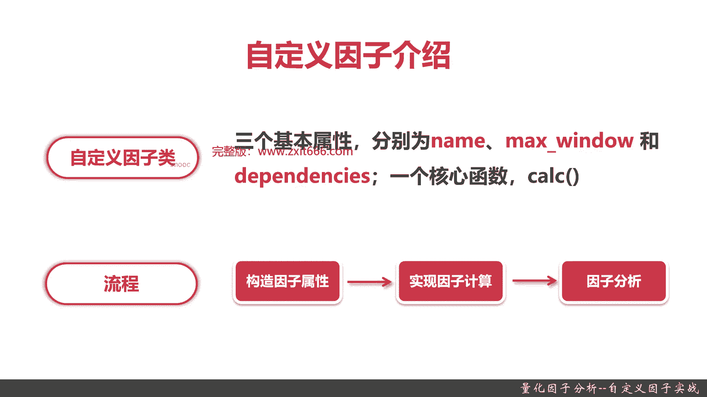
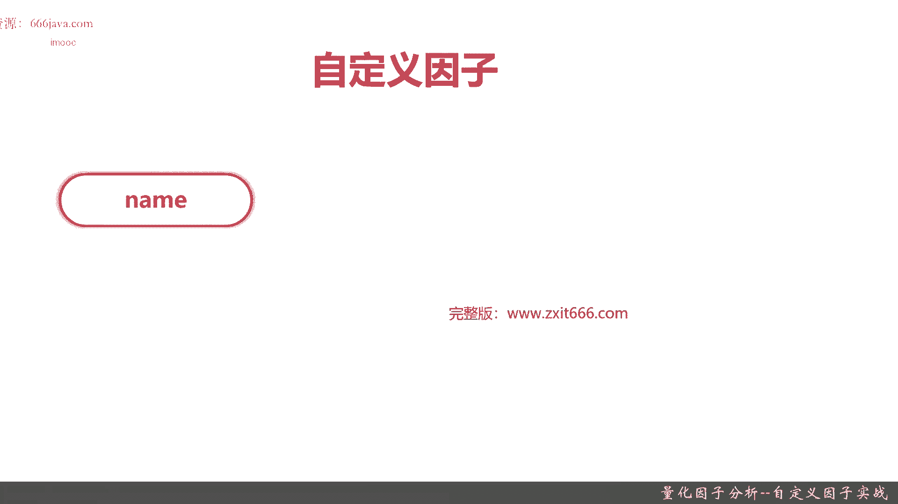
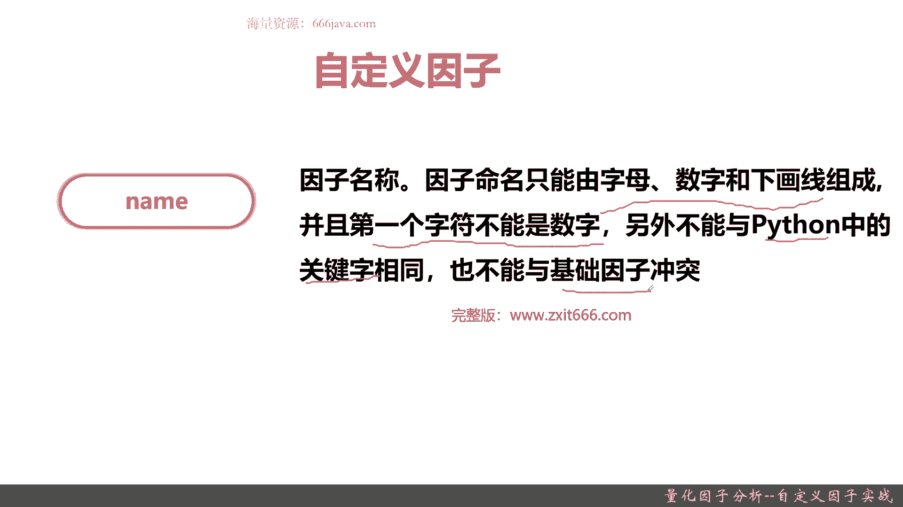
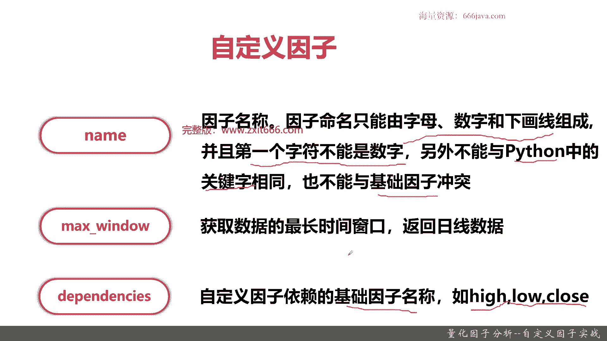
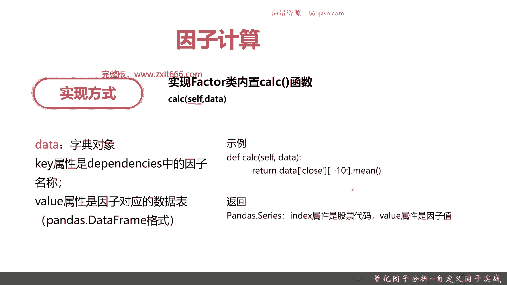
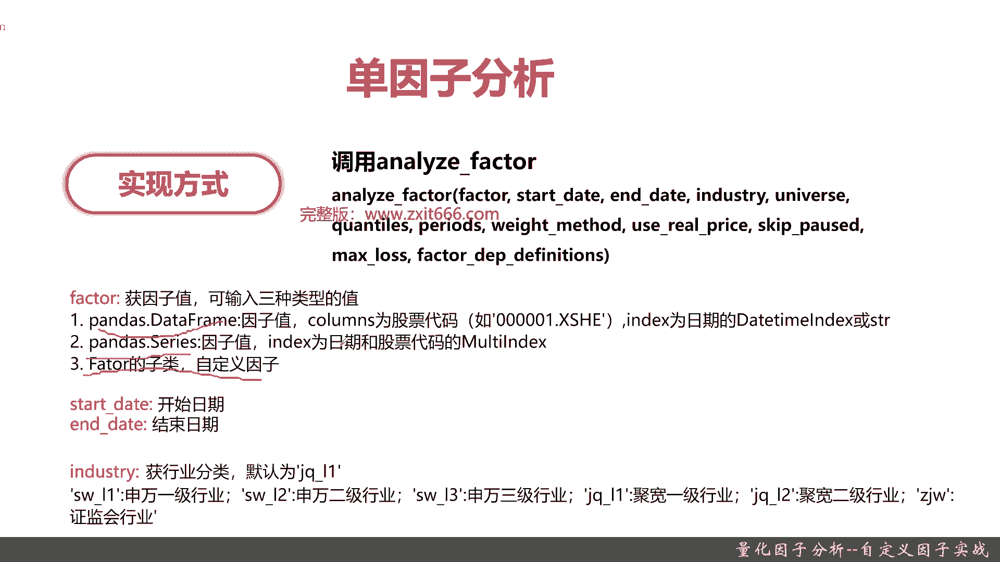
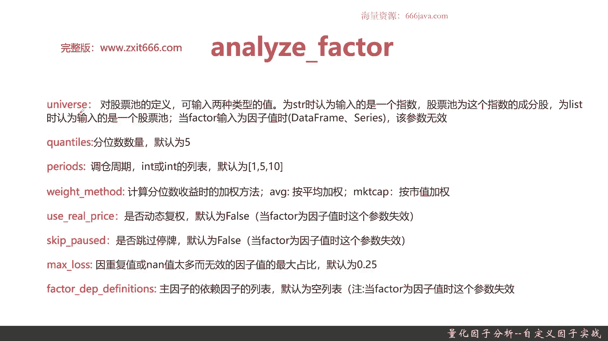
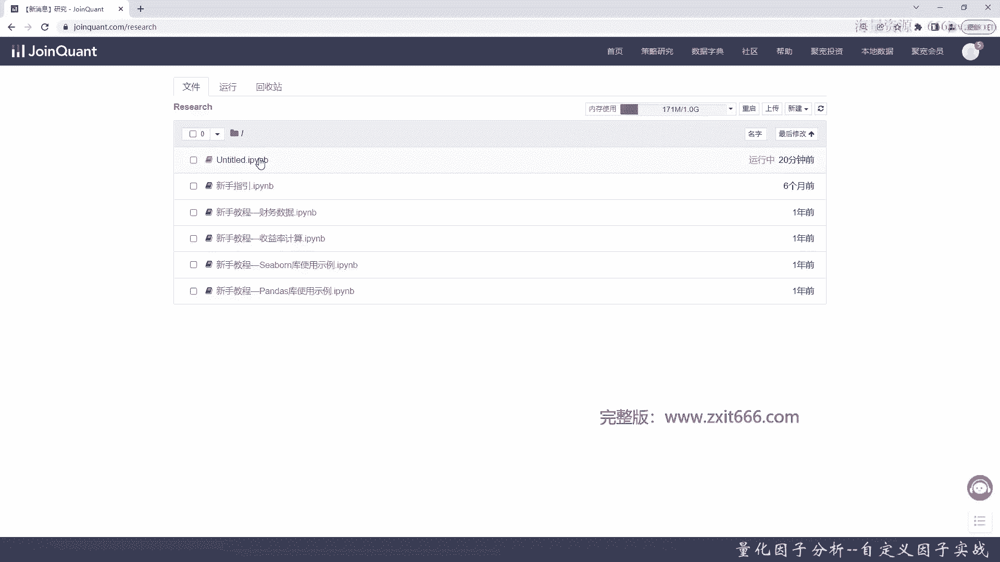
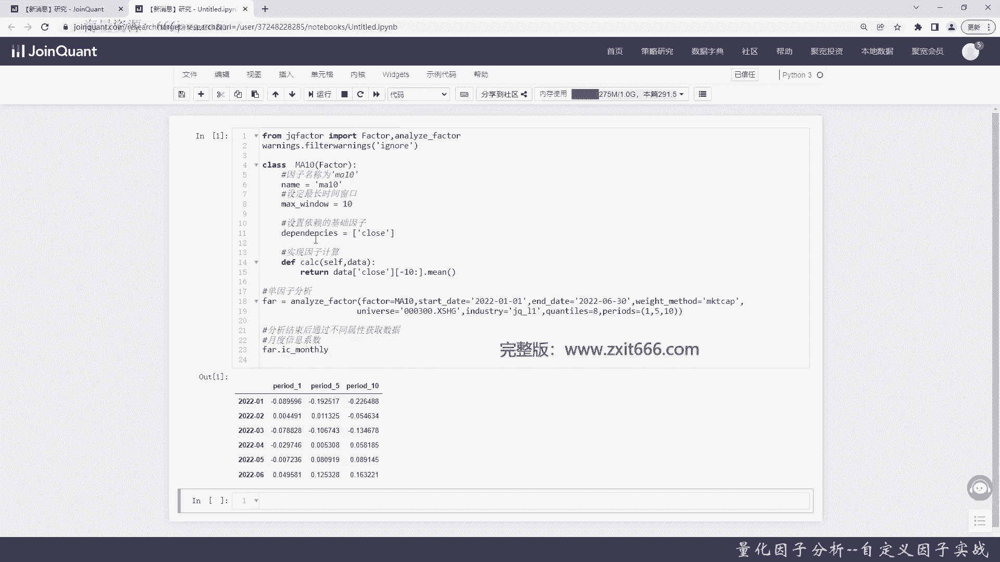
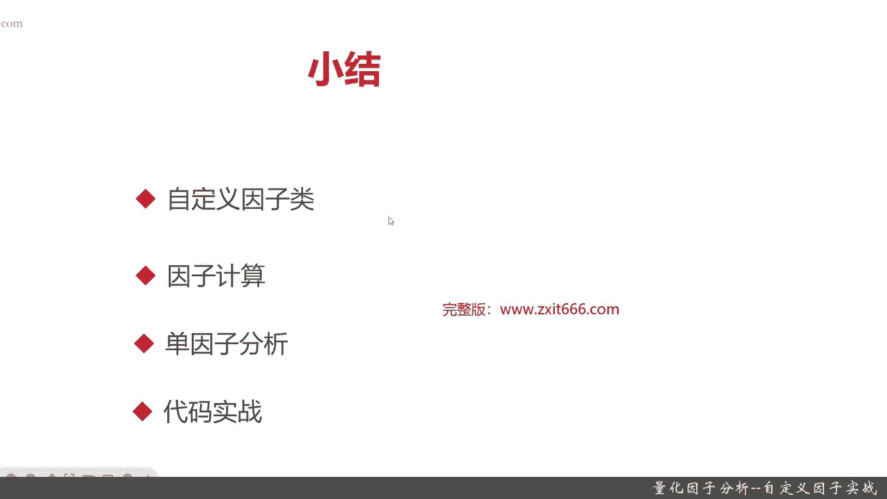

# 基于Python的股票分析与量化交易入门到实践 - P53：12.2 Python量化交易--因子分析_量化因子分析--自定义因子实战 - 纸飞机旅行家 - BV1rESFYeEuA

大家好，我是米田，在上一节呢我向大家介绍了因子分析的概述，那么这一节呢我将给大家介绍一下，自定义因子以及自定义因子的实战。

本节我们将从以下四个方面，给大家介绍一下自定义因子的实战，首先我们给大家介绍一下自定义因子，接着给大家介绍一下自定义因子当中，比较重要的一个步骤，因子计算，然后我给大家介绍一下你自定义因子。

既然已经构造和完成了，那如何对自定义因子进行分析，那最后是我们的代码实战部分，好我们首先给大家介绍一下自定义因子，首先给大家介绍一下自定义因子的类，它呢分由额，分别由三个基本属性和一个核心函数构成。

这三个基本属性呢分别为name max window，还有dependencies，然后核心函数呢就是call，我们又要用自定义子进行分析，那看看它有哪些流程呢，由以下三个流程构成。

首先我们要构造自定义因子的属性，也就是上上面提到的name max window dependence c，然后实现因此计算，那就是这个call这个函数，最后我们要进行因子分析。

那因子分析呢有一个常用的因子分析的，那个函数，就是我我们在本节会给大家介绍的，单因子分析好。

接下来我们给大家介绍一下，自定义因子类的三个基本属性，首先是name name，也就是这个自定义因子的名称。

那记住这个名称，它只能由字母和数字和下划线构成，同时第一个字符不能是数字，然后它不能与Python的关键词相同，因为它是Python的程序，然后同时也不能与基础因子。

比如说我们之前提到的那个财务类因子啊，还有以技术指标啊，这些因子不能与他们这些命名，OK这是它的限制好，接下来是一个max window。

那max window顾名思义呢，它其实就是获取数据的最长的时间窗口，一般来说它就是一个日线数据，比如说你max windo是十，那就是10日线，最后是一个dependencies。

但是debate是什么意思呢，其实就是我们自定义因子依赖的基础因子名称，比如说最高价，最低价，收盘价等等，当然了一些其他的基础因子，那我们也可以也可以利用，好自定义因子，基本呢我给大家介绍完了。

接下来给大家介绍一下自定义因子的内置函数。

首先给大家介绍了的就是靠这个函数，它有两个基本的参数，Self，就是你这个自定义，它是个它是一个类的内置函数嘛，所以他肯定要根据self self，也就是说name啊，max window啊。

还有dependencies，重点是name和dependence，它在内部都已经是帮你实现调用了，然后你允许传入一个data，好那么这个data它是什么样的类型呢，它是个自研类型。

key属性是dependencies的因子名称，value是define呃，是这个，因此对应的数据表也就是个df data data frame格式，那下面给大家看一下例子，比如像这样。

我们就可以以close10天命好，就是说我们最近十天的那个收盘价，然后取平均值，这是一种靠的计算方法，当然你不仅仅它可以有这种实现，它还有其他的多种的实现方式，那它返回的是什么呢。

返回的是一个pandas的series，那index呢就是属性属性，index就是股票代码，然后value呢是因子的值就直接返回返回给你了，这个就是一个因子的计算结果，那自定义因子构成了。

然后它的因子是怎么计算的，它的内部指标是怎么算的，我们也知道了，那么那怎么用呢，那就要用到因子分析了，那我们本节呢给大家介绍一下单原子分析。

那实践方式很容易啊，就是一个a nice factor，只要同学们就是调用这个annice factor，然后把里面的常用的这些参数给生成，它就可以进行单因子分析了，它的参数初步看下，其实很多。

你看factor start date，End date industry，Quantulies，然后periods weight method，Use real price，Skip past。

Max loss factor，deep definitions等等，这个非常多，接下来我给大家介绍，也详细介绍一下这些参数，首先给大家介绍这四个参数，一个是factor，一个是start date。

一个是ANIMDATE和industry，factor呢就是说单因子分析的这个函数呢，它不仅仅可以调用我们的自定义因子，你可以看到它有三种，一种是那个pandas的data frame。

一种是一种是pandas的series，这两种呢都是传的因子值，那传的因子值呢，结果可能就是入参的数据格式有点不同，那我们在本节呢，主要用的是我们已经自己实现的factor，子类的因子。

那其实只要最终调用的话，只要实现我们的factor，接下来在代码实践当中能给大家展示一下，通用英文件理解怎么调用的，那如果同学们要用的不是自定义的那个factor。

那无论你是用data frame还是要serious，那你要根据他的那个入参，比如说你data frame要传一个就是嗯，columns是股票代码，然后index为日期的一个就是那个吃霸。

如果你传的是series，那OK那其实相对来说就比较简单，但是日期因为你要返回时间序列嘛，股票代码这些都是必穿的，你构造起来可能觉得同学们会觉得，这样起来比较复杂，所以一般常用的像这个函数。

常用的其实就是传用一个自定义因子就可以了，那是比较容易的，然后start date和end date呢这个呃不用怎么解释了，就是开始和结束日期，然后再一个是the industry。

industry呢其实就是行业分类，那默认呢是聚宽的一起，那他一共支持那个，之前就是我们给大家介绍股票的这些分子，大家都都支持，比如说申万的123期，巨宽的两期，还有一个证监会这六种行业分析他都支持。

然后再接下来呢，我们给大家详细的再强调了一下其他的的参数。

呃universe这个函数是什么意思呢，它就是一个股票池，那你既然是个因子嘛，你肯定要跟你的股票，你的标的有关系，那它有两种类型的值，一种呢如果是string，那你就是一个呃，它输入的其实就是一个指数。

就是比如说你输入沪深300，那你这个股票池就是沪深300里面的成成份股，它就会自动帮你去把这个成分股，加到你的股票池里面，那如果是个list的呢，那就是你需要输入这个list里面的，这些股票的代码。

那这些凡是在你这个list里面的股票，他都会认为是你的股票池，那当前面那个重要的factor这个参数，它入参如果是data frame或者series呢，这个参数就没有意义了。

只有当自定义函数的时候才有意义，下一个呢是QUONIZE，是分位数的数量，再接一个呢是PARIS调仓周期，默认呢是以为一五十，这调仓是什么意思呢，就是你要把你的整个你的仓位。

你要买和卖一般多长时间变动一次，他是周期性的变动，那这个就是调仓，然后是wet method，他这个是主要你因此来计算收益的加权方法，它有两种加权，一种是呢就是呃平均加权，不考虑任何的任何的其他参数。

也就比如说你你有十只股票，这十只股票就是计算加权方式呢，就是直接除以十，但如果你选那个按市值加权，那他就是按照每只股票的市值的大小进行加权，这其实是一种计算的方法，这个方法可能更偏向于投资研究了。

那个一般像我们这样可能不会用到那么精细，当然了，他对于具体的你的因子的收益计算回测，其实都是有受影响的，因为你计算收益的方法不同，那你计算的值就不同嘛对吧，再一个是usreal path。

就是否是那个动态复权，然后默认呢呃是false，再一个是skip pass，是否通过平台默认也是false，再后面的是max loss，这个指的是呢，也是一种一种叫那个入参。

或者是一种叫调参的一种方法吧，他就比如说当我们有太多的重复值，或者是N值的时候，那这个因子值的最大占比，就是说哪些因子，我们可以到时候可以抛弃或者被平滑掉，这个占比呢是0。25。

最后一个呢是FEDEPTH的definitions，就是主因子的，因为依赖因子为列表，然后呢默认为那个就是空列表，一般来说这个参数用的不是特别多，接下来呢我们就进入coding实战环节。

给大家讲解了这么多函数和定义方式，我们先来就是给大家进行一下科学实战。

然后大家看一下究竟是怎么去用好，这一次呢，我们给大家介绍的那个扣型实战呢，跟之前不一样了，我们之前都是这种策略方式，其实这些自定义因子呢更多的是在研究里面，所以我们要进入研究环节。

那我们之前给大家已经建好了，这个研究环境的结果，可以看到，我们就用这个研究的呃例子给大家用一下。

点击一下好，它就加载了研究环境了，那研究环境镜呢其实它本质上距宽，这个研究环境镜就是用的是JUBEAT呃，用JUBEAT呢，其实跟那个拍下面的可能运行方式不一样。

但很多其他同学们可能在在做一些数据分析啊，或者数据挖掘的时候，可能都会用过，没有用过也没有关系，我们这一节呢给大家一边写代码，一边使用一下好，我们首先做一下声明。

那这个JUPITER这个呢有个稍微比较方便的，就是呃同学们如果在那写代码的时候呢，你按table它其实是可以有些联想的，就像我刚刚有几个代码，比如说那他就会有提示，这个提示呢比之前距宽的那个策略的环境。

能更好一点，更方便一点，然后我们把一些warning的结果呢给去掉，好我们现在呢就把我们这个自定义因子的类的，那个import给写完了，那么接下来呢我们来写一个实际的函数，先先先声明自定义那个因子类啊。

那我们必须声明它，所以要我们必须要加载继承那个factory，所以我们这样写，嗯我们这里把个注释写的吧，我们这叫ma10吧对吧，然后，设定，好，因为是MH吗，最长时间窗口应该是十。

就是max window，然后我们要设置，依赖的咋设，那我们这次呢就以嗯，收盘价作为基础，因此，好我们要实现因子计算了，那要传两个入参self，它是自带的，所以就不需要，那这个逻辑其实是比较简单的。

10日均线嘛，这个实现起来就比较容易好，这个也实现完了，那我们剩下的呢这个自定义的到这为止，这个ma这个自定义的因子，就非常简单的给大家实现了一下，让大家了解一下它有哪些基本的属性。

和那个内部的内饰的构造的函数好，那我们这个，简单的自定义因子类就建好了，那我们下面要进行单因子分析，好先构架下变量，到时候可以用起来，然后我们直接按M来，然后start，然后是end date。

然后是计算加权的方法，我们就按市值吧，再接着是股票池，我们就以沪深300的成分股，然后我们按照区宽那个一级分来进行分类，Quantilize，我们就八吧，然后调仓周期，好因此分析结束了。

然后我们要把因子分析结果给大家呈现一下，后面结束给大家详细介绍一下，怎么去查看因子分析后的结果，这个好像他就不认识了，好我们简简单的这个自定义，因此这个类和它调用的一些因子分析的结果，就成了。

我们先来看看运行结果，可以看到从2022年1月2号，3号四号五号六号那阅读的信息系数，还是包括收益之类的情况，就在这里后面给大家详细去分析一下。

好以上呢就是本节的全部内容，下面呢进入本章详解，本章主要通过四个部分，给大家介绍了那个自定义因子，还有自定义因子的实战，那首先给大家介绍了自定义因子类，那自定义因子类呢。

其实它就是继承了区块内置的factor这个类，那是对他的一种那个继承，并且实现它有基本的三个属性，分别是name max window，还有一个DEPENDENCES，还有一个核心函数call。

那name呢就是因子的那个名称，那它不能和Python的关键字一样，它也不能和基础属性，就是去看自己的基础因子一样，然后呢他支持字母下划线和数字，当然了要符合命名的话，它也它也不能第一个字符不能是数字。

然后max windows，就是我们这个因子获取数据的最长时间窗口，一般都是一些日线，日线数据，然后DEPENDENCIENCE呢，它就是你基础你依赖的那些基础因子，一般是high嗯，就是最高价。

最低价收盘价，那在我们本科例子里面呢，我们就以收盘价为主，那自定义因子呢它分三个步骤，首先前面两步其实都是实设计，并且定义并且实现自定义因子的这个类，那第一步呢是构造因子的基础属性。

第二步呢是实现因子的计算，再一步呢就是因子的分析了，那么接下来呢我们给大家介绍了怎么去实现，因此计算其实就是实现，effect里面的这个内置的函数，Calculation。

其实就是CLLC他在允许多传一个data，这个data呢，就是我们自己在这个自定义因子类里面的那个，DEPENDENCES的因子的名称，然后呢他的value就是因此对应的数据表，接下来呢就是那个。

单因子分析了，再下一步，单因子分析呢其实就是调用一下analysis factor，那它这个函数相对比较复杂，支持factor start date and date industry。

然后universe qualize，然后paris uwaiter message use real price，Skip past max loss fedeep definitions。

那同学们需要记住的是以下几个参数，首先factor，factor呢其实呃有三种类型在我们本钱里面呢，或者整个本章，因为我们都是自定义思嘛，你去记住factor，只要把我们自己实现的那个自定义。

此类传进去就OK了，然后start date和end date呢，这都是你因此调用和分析的回测的实际的周期，这个就不解释了，然后industry那是你这个行业的分类，默认呢是距宽L1，它支持六种。

一种是距巨宽的一二级分类，申万的123级分类和证监会的行业分类，再一个呢非常重要的参数是universe，universe就是我们这个因此对股票池的定义，如果我们factor这个参数定义的。

不是像我们这样传的自定义因子，那这个universe就失效了，那universe呢支持两种模式，一种呢它是支持那个string，那string一般传的就是一个指数，就像我们这个例子里面。

他传的就是沪深300指数，那自动的系统，自动就会把沪深300的指数成分股，作为我们股票池，还有一种呢是传一个list的，同学们可以自己去，在后面的实验里可以额使用一下。

意思就是你的股票的create code掉进去就行了，然后后面几个参数比较重要的一个是weight，Method，其实就是计算收益的方法，我们这次呢使用的是按市值加权。

然后比较常用的是QUANTILIZE，还有一个period，一个是那个分位数的数量，还有一个是调仓周期，那至于最后几个参数，比如说use real price。

sky post max loss和factor de dependence，然后factor dependencies的那个definition呢，这几个参数用的不多，我们在我们的实战里面。

其实也没有给大家用用到，最后呢是在代码实战环节，代码实战环节呢，在整个这一章自定义因子或者因子分析呢，由于它跟策略其实是不一样的，它更偏向于一种研究，那后面一些实现和结果呢。

在研究里面我们建议是在研究环境，就像我们之前给大家的例子一样，希望同学们不要用策略环境，因为很多策略环境里面呢，只能看到文字输出或者字符输出，它的回测结果看不到图表，这些还是希望同学们在用研究环境来实。

进行实验好，以上就是本节的全部内容，我是米tea。

大家下次再见。