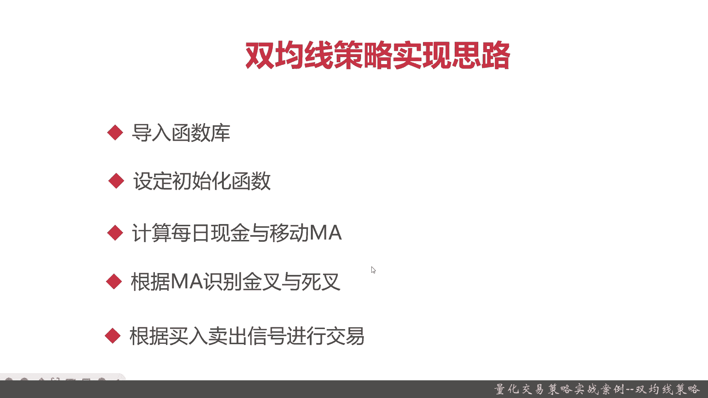
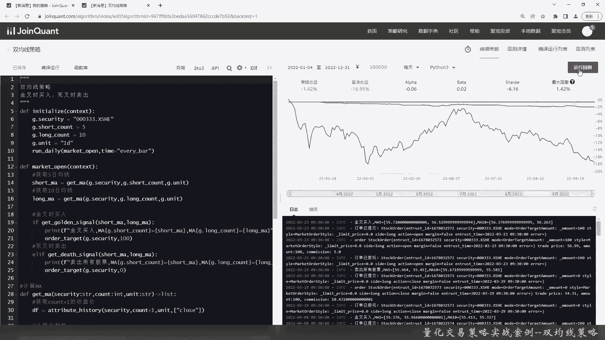
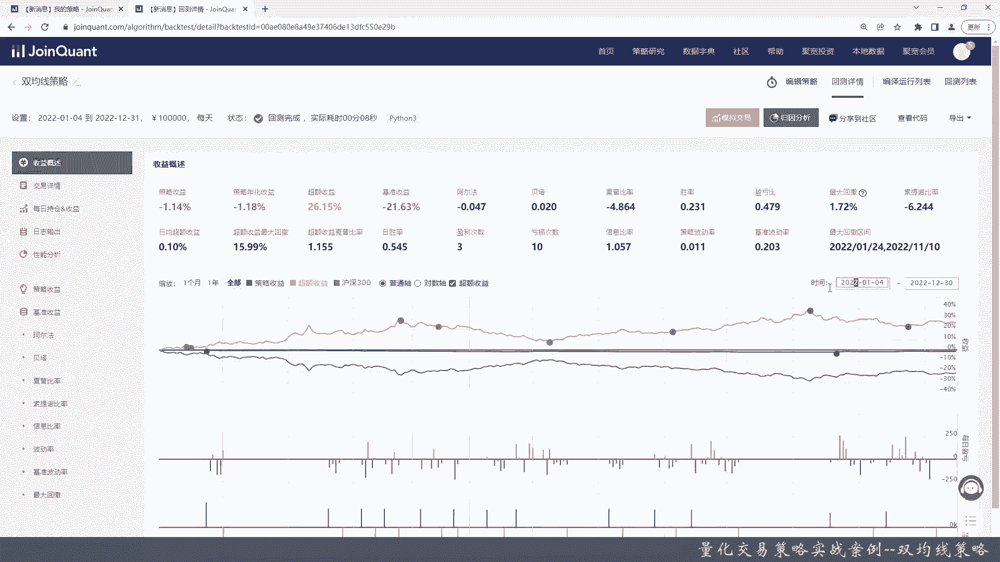
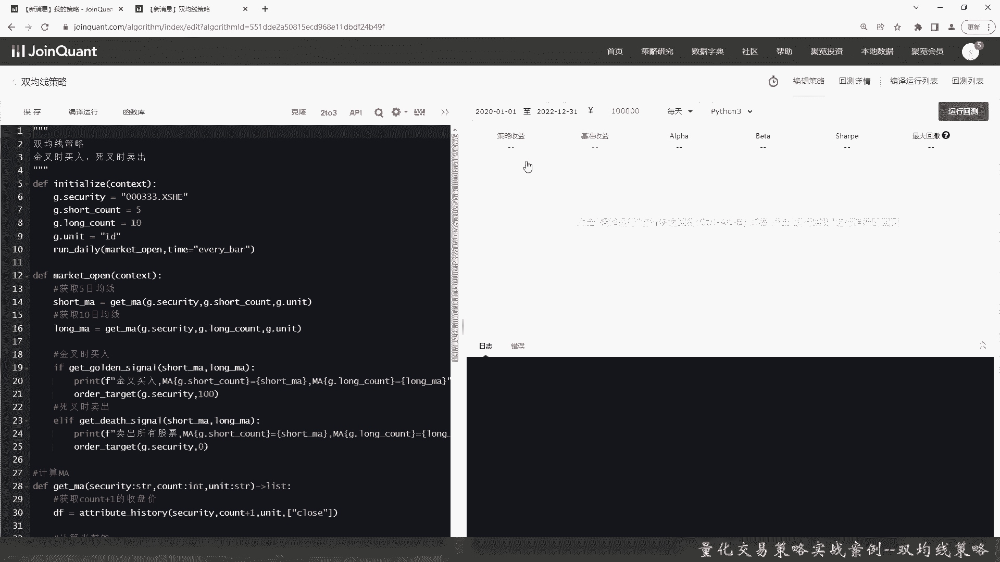

# 基于Python的股票分析与量化交易入门到实践 - P56：13.1 Python量化交易策略实战案例_量化交易策略实战案例--双均线策略 - 纸飞机旅行家 - BV1rESFYeEuA

大家好，我是米田，在上一章呢我向大家介绍了量化因子分析，那么本章呢我们就会给大家介绍，量化交易策略的实战，那本章的量化交易策略实战内容呢，就是综合我们之前给大家介绍的，各个量化交易的知识点。

比方说回测啊，量化交易策略的编写呀，基本面啊，选股啊，择时啊等等，那作为量化交易策略实战的第一节内容，我们选择双均线策略给大家进行讲解好，那么接下来我们将进入本节的实战内容。

本节呢我们将从以下三个方面给大家介绍，双均线策略，首先我们给大家简单介绍一下，什么是双均线策略，然后他的具体的识别买卖信号的方式是什么，接着呢给大家介绍一下如何去实现双均线策略。

那最后还是老样子进入代码实战环节好的，那么接下来呢我们将给大家介绍一下，双均线策略好，首先呢给大家介绍一下商均线策略的定义，双均线策略指的就是两条不同周期的均线，Ma，一般是有一条短周期移动均线和。

长周期移动均线，那通过判别这两条移动均线的相对大小，来研判买进和卖出的时机，OK那这块还比较抽象啊，那接下来给大家看一个，双均线策略的实际的内容，以上这幅图就是我们之前运用之前的知识。

用个matt pp lab，把一只股票的5日均线和10日均线，做了一段时间的画图，那么接下来呢给大家看看时间，以上呢就是这支股票5日和10日均线的图，给大家注意有两个点。

关键是5日均线和10日均线交叉部分，首先在这个点，那5日均线向上进行交叉，10日均线也上了，但是他是5日均线向上进行突破，突破了10日均线，那在这里呢类似于MCC，这个只不过是双金线的，这也叫警察。

还有一个地方呢，是这里是5日均线向下和10日均线交汇的地方，这里呢我们叫死叉，那这里呢就是卖出的信号，金叉就是买入，死叉就是卖出，这类似于MACD，双均线策略对于买卖的信号的识别的方法。

就是首先5日均线向上突破10日均线，OK这个就是金叉，就是买入，那5日均线向下突破10日均线，那就是死叉，那就需要卖出好的，这个就是双均线策略的基本介绍，好，接下来我们给大家介绍一下。

双均线策略的实现思路，首先跟类似于ma，那他需要导入函数库，接着设定初始化函数，然后计算每日现金和移动ma，根据ma的具体的结果识别金叉与死叉，最后根据买卖信号进行交易。

好的那以上呢就是双均线策略的简单介绍，还有一些它识别思路的具体内容。

那么接下来我们进入coding实战环节好，那么接下来呢进入coding实战环节，我们新建了一个双经验策略的编辑的脚本，那在这一块呢，它和量化因子的分析不太一样，我们不是要用那个研究策略。

我们要用直接的策略编写，也就是说我们不用JU比特来编程了，我们直接用策略的编译回测这个环境好，首先我们把注释写一下，好还是以老样子，我们要先定义初始化函数，我们定义G全局变量，我们去选美帝集团吧。

好定义一些基本参数，然后我们定义均线的计算，单位间隔一般是按一天来算，好我们再把run di c定义好，好初始化就做好了，那么接下来我们定义market open，首先要获取5日均线，五入精确的算法。

同学们应该很熟悉了，所以我就不在这里展开了，直接给大家写出来，我们先定义一个get ma这个函数就是算均线的，那这个时候刚刚定义的short cut就有效了，这种呢其实我们就抽象了一个函数。

那10日均线和5日均线类似代码，我们就不用写很多遍了，这种呢编程的方式，有的同学可能了解，它和我们之前的函数式编程不一样，他做了一定的抽象，有点也类似于再抽象一点，就可能要面向对象了，当然了。

现在还不够足够的对象化，足够抽象，现在只是给大家展示一下，好5日均线和10日今天好了，然后金叉买入，我们这里做了一个判断，这个函数也是预先定义的，后面都得实现这个函数。

get order signal呢就是判断金差的，把一些debug信息打出来，这是另外一种format方式，好我们把sht ma和la都打印出来，这样方便我们后续在debug的时候进行调试，好下单。

好我们按照org target来进行下载，好这是死叉，这应该写注释吧，那我这里就不敲了，我直接把它给复制过来，我们也用order target来卖出，好接下来我们定义一下get ma这个函数。

当然这个其实声明也还OK啊，这种Python的写法，什么是收盘价呢，就是attribute history，这个同学们，你感兴趣可以去复习一下之前的课程，然后我们要计算ma了，还记得吗。

MN用rolling点min就可以出来，当然了，区块量化平台呢，它也会提供这种类似的函数的封装，不过呢就看同学们自己了，我们呢先还是给大家打一下底层的策划，给师实现出来，让同学们后面对这块熟悉了。

那其实就没必要再从头再实现一遍，我们要有一个上一次的PRIMA，作为一个信号类比的结果，我们用个list返回，就像刚刚声明的，然后要实现我们的获取金叉和死叉的函数，我用过波认返回，那这样就比较简单了。

直接return就行，那其实就是一个判断的表达式，好这就是一个交汇金叉的算法，其实就是一个判断的信号，那接下来同学们应该是知道了，就是判断是否死叉了，那类似的也是，好也直接return一下就行了。

那基本上那个双均线策略的代码，就简单给大家实现了一下，然后我们看一下时间，那回归的时间呢我们要选一下，应该是8月29号吧，美帝集团那个时间还是有束缚性，当然了，后面我们会给大家多演示演示。

到9月底看一看，好我们编译运行一下，好我们这把双均线策略呢给大家写完了，大概代码就是这样，我们给大家编译运行一下，可以看到在去年8月，就是22年的8月29号，到22年9月30号，这段时间呢。

我们是明显的好于沪深300这个基准的收益的，虽然我们也亏了，亏了不多0。08%吧，也就是万分之八，但是沪深300，其实你看这段时间跌的还是很明显的，那这就是具体值。

其实那段时间刚刚我们在我们的ma这里面，那就有两个可以买卖的点，那么我们再把时间放在给他看一下，那阿尔法呢其实就是负0003，这段时间夏普其实没有最大回撤挺好，0。39非常稳定，基本上不怎么亏。

然后我们把时间放的稍微久一点，我们就看半年的，可以看到这段时间呢，总体来说我们还是比那个策略好，因为去年的行情其实那半年不是特别好，可以看到总体呢我们的收益是-4。2，最大回撤还是很好的。

下普时还是负率，也不是特别高，如果下普是正的，其实是有意义的，阿尔法呢0。06那个贝塔0。02好，那我们再把时间放长点，看看去年一整年的时候，然后运行一下整体的回测，1月1日其实没有非交易日啊。

我们看一下运行一下去年一年整体的回测。

好那么我们这个呢就把去年一年的给运行完了，可以看到去年一年，其实我们这个策略呢是亏了百分之一点几，但是呢我们超额收益很高，为什么，因为按照我们这个策略，去年一年基准亏了21%，我们这策略只亏了1%。

那超过收益就高很多了，阿尔法呢总体还稍微有点略亏，贝塔这个系数风险，我们风险一点都不高，夏普还是负的，没什么可比的意义，胜率0。230，就是大多数我们都是不亏钱的，然后最大回撤1。2，一索停破六。

这也没什么意义，日均超额，那个超额收益的最大回撤稍微有点高了，10%几，它会下不比，那我们可以再把时间调多一点，我看最近3年的话。

这个是去年一年的，我们先给他看最近3年的结果，一般来说三到5年是一个周期嘛。

这需要回测一回，好可以看到如果是最近3年呢，其实尤其是在从2020年的6月，一直到2022年的3月11号，也就是这两年，基本上其实我们的策略是跑步一基准，但是在最近这几个月。

就是从2022年6月1号开始，其实我们就是可以跑赢基准了，那超额收益也是一个大的深V，然后走上去这个策略均线出来，在这段时间是3年非常的平稳，对于美帝这支股票来说，当然你可能换其他不同的股票。

结果不一样，那感兴趣的同学们可以自己去试一下，那总体来说那个均线策略呢，它适合比较稳定的判断，就是收益也比较稳定，那你说亏吧，他也不会亏多少，因为在大盘总归是亏的时候，你如果不不做亏，你就是赚的对吧。

OK我们看看交易详情，这是这3年每天的下单的情况，好我们简单看一下，每次因为周持买买100股，那如果我们把强项调成1000股，其实是不是又是不一样对吧，那每日的收益，因为我每次只买卖100股。

也就是只买一手，那如果我们买十首呢，100首呢对吧好，然后看一下那个策略收益，基准收益基准这段时间还是比较动荡的，但总体来说基准还是最终在那个22年，基准总体亏的还是比较多的，但是20年二一年那个时候。

整个大盘都是涨了很多，最多最多已经3700点了，夏普夏普索提诺啊，信息啊基本都是负的，其实意义不大，波动率我们这个策略是非常非常好的，看普遍的都是1~3个点，甚至最低的时候连一个点都没有。

这个是非常好的证明我们的波动率，这个最大回撤是非常稳定的，没有什么风险，可以看到这段时间，基准都有20%起的波动，最大回撤我们明显也是比基准好的好，以上呢就是给大家带来双金星的全部内容。

下面进入本章小结，本章呢我们给大家介绍了双均线策略，那首先我们给大家简单介绍一下，双亲均线策略的定义，那双均线策略其实就是两条不同的移动均线，那一般是短周期的移动倾斜和，长周期的运动均线。

在我们本次的实际实战里面的，我们分别选用M5和M10，那通过M5和M10的交叉，来判断买进和卖出的时机，当5日均线向上突破10日均线的时候呢，就是金叉可以买入，当5日均线向下突破10日均线是死叉。

需要卖出，那后面呢我们给大家介绍了，双均线策略的实现的思路，那它实现思路啊跟MACD这个量化交易策略的类似，首先也是导入函数库，然后设定初始化函数，因为我们这个用了默认的区块函数。

在我们这个学期时间不多，所以导入函数库和设定初始化函数都比较简单，接着我们计算了现金和移动MA，其实ma呢，其实就是我们自己实现了5日和10日的MA，那接下来呢我们要去通过ma识别金叉和死叉。

那最后就是进行交易，那这点类似于MACD，最后是代码实战环节，本章代码实战环节呢，我们在实际实践里面，对于那个现金的控制实现的稍微少一点，我们主要是用用的是买卖美帝这支股票，每次只买卖一手来进行控制的。

那可以从大家最后的那个核测的可以看出，双均线策略在最近这3年它的优势是什么，优势就是非常稳定，那他的劣势其实就是他也不怎么赚钱，他自己可以看到，按照那个22年的8月29号。

到22年9月30号的这将近一个月的时间，那我们的亏的是非常少，只有0。0几，基本上不怎么亏，这段时间呢对于我们的那个相对的基准，他亏的挺多，亏了20%多，那如果把时间再搁长，搁到2022年的1月1号。

到2022年的年底，那这段时间呢我们也只亏了百分之一点几，但是这段时间整个基准亏的非常多，亏了20%几，最后我们也给大家演示了，通过装机线策略进行回测3年的结果，3年结果呢可以看到。

就是20年和21年这段时间，那整个大盘都在上涨，那双均线性也其实不是特别好，那基本上没怎么收益，但是大盘那个时候已经涨了20%起，最多时候将近涨了30%，但是过了就是到了2022年以后。

那就可以看到大盘的那个基准，那就持续的下跌，这个时候双均线策略它的优势就出来了，双均线策略它其实最大的好处，它就是非常的稳定，波动率非常小，这样会保证带来最大回撤少，但是呢他的劣势就是收益不高。

是真的不高，好，以上呢就是本节的全部内容。

那我是米田，大家下期再见。