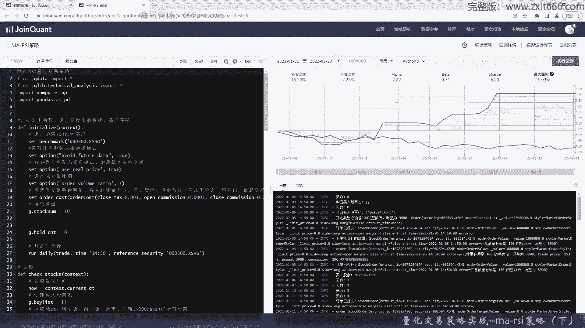
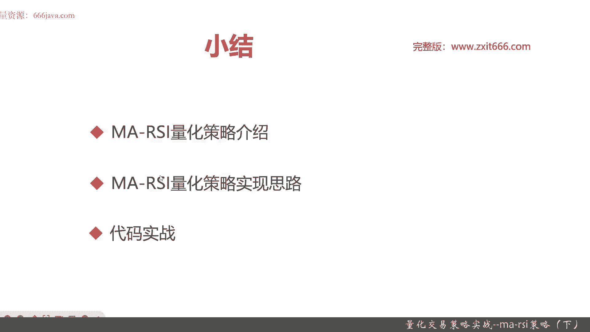

# 基于Python的股票分析与量化交易入门到实践 - P59：13.4 Python量化交易策略实战案例_量化交易策略实战--MA-RSI策略（下） - 纸飞机旅行家 - BV1rESFYeEuA

好，然后上面是ISI，然后ISI呢我们选的是十，我们还是先把这个逻辑打给大家吧，收盘价其实就是K线了，高于ma200，然后再来一个i s a true判断的逻辑，还是先也把这些逻辑告诉大家。

我们的阈值写写成30吧，小于25吧，当然二十二十五三十，这些都可以，同学们用回测实验来实现，获取股标识，所以他们两个条件必须都满足，才能是买入信号，也就是股票池的型号。

我们之前定义的BILIST就有用了，然后我们要根据我们之前设定的持仓的范围，如果已经到了，我们就不再加了，那我们就退出循环好了，那这个减持过程就好了，那就是这个时候就知道今日买些哪些股票，有可能没有。

用加号也行，好那么呢这个选股的这个函数就写好了，那么接下来我们要实现trade，首先我们把那个交易天数给打印出来，这个呢不仅仅是交易，也有可能也是持仓天数，十张股票就用coding list来。

Port fli，这个呢我们就不直接打了，用之前写的代码，只不过这个变量不一样了，只看持仓的现价，然后进行交易了，首先，如果这个股票没有持仓，我们就买入它，然后把现金计算一下，我们用均分的方式来购买。

就比如说我要买五只股票，那我现在假设全仓要买的话，那就是每股股票都是一样的目标金额，当然最终买了手术可能不一样啊，我们通过order value来实现这个功能，然后这个时候过了一天了，他吃饭又多了一天。

卖出策略包括，时长超过11天，然后火车，大于40，下跌超过5%，首先判断他的持仓天数吧，我们这个阈值就是11，当然同学们有兴趣可以把它看成十啊五啊，结果都是OK的，S10我就不写了，也是用直接复制粘贴。

然后我们现在要这个时候卖，就要用现价来卖了，然后算花费的钱，那我们cos呢就用买入价就均价来，然后再判断另外一些条件，首先判断ISA4是不是大于40，或者呢跌了超过5%，这里少个all，当然了。

同学们有兴趣的可以去调这个下跌浴池，这这个时候触发了就直接清仓，然后呢判断时间适当，时间超过了一个量级，超过11天我们就卖了，这里还是给大家同学们写下注释吧，这样同学们不了解干什么。

这个时候要把持仓时间重新清空，然后到了以后呢，不光是卖了，还要买，再做一轮，这把这里直接就不敲了，然后如果都不占，那就报错，好我们来检查一下结果，这个相对之前的策略呢又复杂了一点，同学们感兴趣。

同学同学们可以自己一边debug，然后一边调试，然后来试试，我们看看运行结果好，我们基本上就已经开发完了，然后大家检查检查一下，然后就开始运行了，这个策略呢他还是对于回测要求还是比较高的，它有点复杂。

所以我们就只默认选两个月的时间进行回测，感兴趣的同学们可以自己去那个多调时间，或者去更新一下进行回测，然后呢他可能会运行的时间稍微有点久，好，那从2022年1月1号，到202年2月28号呢。

就可以看到同一秒，这两个月里面他的策略收益是16%，那基准这个时候是亏了7。28%，那夏普比非常高，阿尔法贝塔贝塔稍微有点高，风险稍微那个最大回撤只有5%点，还是不错的，那可以看到我们这些买入的股票呢。

这些具体记录都在这里呃，我们这个策略用单，它胜在就是像之前同告诉同学们的，它胜在交易次数非常少，就是要稳定，然后呢是要这样呢就可以获得稳定收益，当然了，这只是这两个月运行值，不代表我们这个策略。

每个月都可以有这么高的收益，感兴趣同学们可能可以自己回测一下，多点时多点上，比如说刻度一年两年3年四年五年都可以，那以上就是我们给大家介绍的，MASI的全部策略。

下面已进入本章小结，好下面呢进入本章小结，本章呢主要是给大家介绍了ma rsi这个策略，首先给大家整体介绍了这个量化策略，那这个策略呢主要是用来做MAI，SA这两个常见指标。

其中ma一般用的是MA200，ISA用的是十，ma呢主要是可以用来做它的长线的，那个趋势的研判，然后RSA呢主要是看短线的强弱，那通过这两个指标的综合运用呢，可以选出上升趋势的超卖个股。

同时缩小就可以缩小选股范围了，用一些简单非常简单的卖出和止损策略，就能达到稳定的收益，那选股范围呢目前我们选的是大市值，就是市值大于500亿的个股，那排除了s st啊，科创板那个创业板退市。

还有新次新股等等，同时呢按照净利润环比增长率降序排序，然后买卖信号呢是当它的收盘价，也就是K线在ma200的均线上方，同时ISA是小于25，那小于30，小于20都可以，我们现在只选的是25。

然后买入股票，那卖出股票呢ISI10都必须大于40了，还有两个判断，它主要是为了做风控，一个是持有股票的第多少天，默认在我们这个策略里面选的是11天，那感兴趣的同学可以选择20天啊，十天啊等等。

这看你具体是感兴趣，是那个短线中线还是长线，然后呢个股下跌如果超过5%，这也是个阈值，那有你根据你的短线中线长线容忍度是不一样，比如说你短线，你可以可能只能容忍1%或者，2%的下限。

那中线呢可能是3%到五，长线的可能是更高，这看具体看同学们个人当然了，一天之内，因为我们把科创板和创业板给排除掉，所以不会超过10%，5%，其实是一个相对适中的那个阈值，那达到这些预展剧情进行那个卖出。

然后呢是给大家介绍了一下，这个校内消化策略的实现思思路，首先呢是导入函数库，设定初始化函数，第二个呢你要过滤无效股票，然后根据MAISI的指标买出进行的那个选股，然后最后是根据交易信号进行交易。

同时支持刚才说的一个是持仓天数，还有一个是下跌一个阈值，目前我们可以选择5%作为阈值，然后支持，这样就可以支持风控了，那最后一步呢，我们给大家进行了代码的这个实战，那这个还呃这个策略呢。

其实它判断东西还是比较多的，由于我们是全市场，除了剔除的那些股票以外，全市场股票都要进行这些判断，那回测的时间相对较长，所以呢我们就选择了一两个月进行回测时间，那最后回收的结果呢，同学们也看了。

他交易的次数相对较少，然后呢胜率相对来讲较高，也就是说它是属于那个不见兔子不撒鹰类型，以上呢就是本节的全部内容，我是米tea，大家下期再见。

