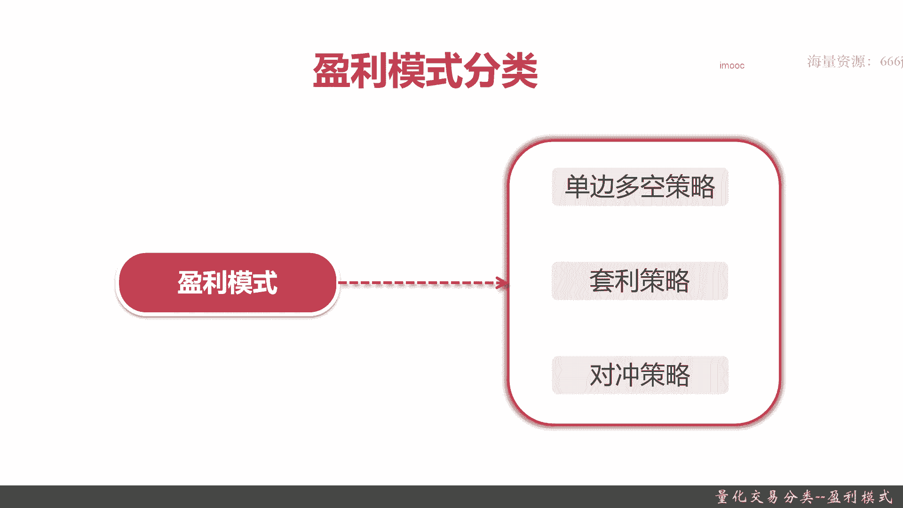
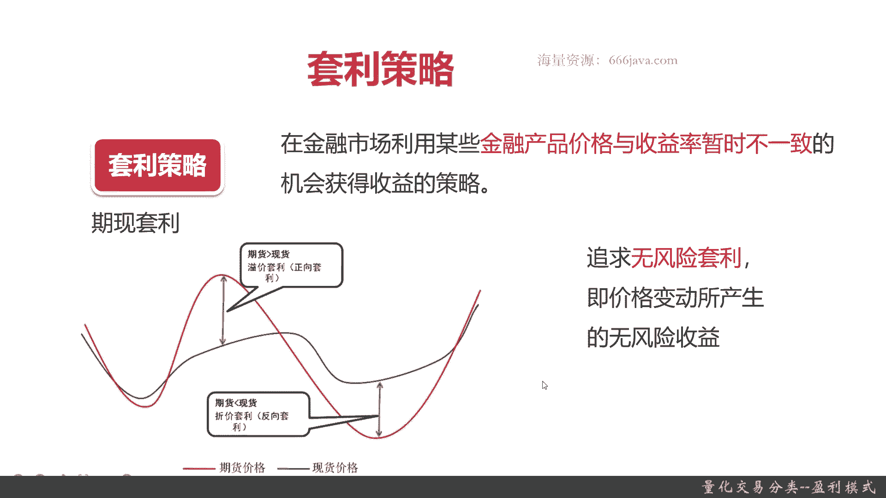
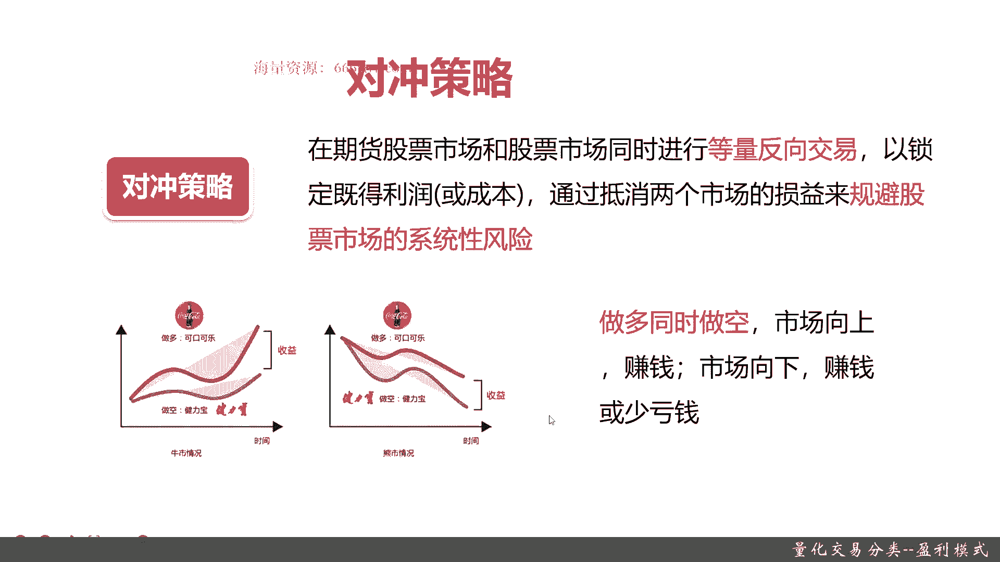

# 基于Python的股票分析与量化交易入门到实践 - P6：2.5 初识量化交易-必知的量化交易基础_量化交易分类--盈利模式 - 纸飞机旅行家 - BV1rESFYeEuA

大家好，我是米提亚，在上一节呢我向大家介绍了量化交易分类，根据交易产品的类别来进行分类，他们下属有哪些量化交易策略，那么这一节呢我将向大家介绍，根据盈利模式来划分量化交易的一些具体策略。

本节呢首先我们会详细给大家介绍盈利模式，这个分类下有哪些量化交易策略，接着呢，我会给大家把这些各个量化交易策略进行展开，然后呢告诉大家详细的定义，以及每个量化交易策略究竟是靠啥赚钱的好。

那么下面呢让我们来给他看一看盈利模式，这个分类具体的情况，首先呢你可以大家可以看到盈利模式，这个分类具体有三种量化交易策略，第一种是单边多空多，就是看涨空就是看跌，单边多空，顾名思义。

其实是根据股票的涨和跌来进行盈利的，然后套利策略呢就是它不仅仅局限于股票，它可以支持其他很多种的投资标的，比如说债券，比如说期货等等等等，他追求的是一种无风险套利对冲策略，这是对冲，是一种金融的术语。

然后具体呢这个对冲的概念，我们会在本节里面讲到这个对冲策略的时候，我会给你简单大家详细介绍。

让大家了解对冲是什么啥，然后对冲策略怎么去灌铅好，下面呢我将和大家介绍单边做空策略，单边通用策略其实很简单，低价就是低价买进，然后呢是低点买入，高点抛，就是主要是要等到股价开始进行。

单边下跌的时候才进行卖出来，我们下面给大家举一个具体的例子，可以看到这张图大家应该是之前看到了，就上证指数啊，可以看到上证指数这里有各个波峰和波谷，有上涨，有下跌，对于单边多空策略来说。

它其实就是实时的去跟进，这个具体的价格的涨跌幅，在单边上涨的时候买进，下跌的时候卖出，我给大家详细举几个例子，这些是我给大家画出的，红色是涨的，就是买入的适合买入的一些手段，绿色是那个卖出的时候。

只要是你买进的价比卖出的低，你就可以获取盈利了，所以呢单边多空策略在盈利模式很好理解，就是通过单边买入或单边卖出实现盈利，非常好理解啊，顾名思义，下一个呢是套利策略。

套利套业主要是根据金融产品价格与收益率，暂时不一致的机会获得收益，它其实是什么呢，就是因为金融产品的价格它会出现波动，然后呢，有的时候他会和我们的那个收益率，会产生非常大的偏差。

下面就是我给大家举个具体例子就可以知道了，我们以一个期限套利，就是期货和现货之间的价差来举例子，蓝色的线就是现货价格，可以看到相对来说它是波动不是那么的夸张，或者是比较平滑，而红色的就是现额期货价格。

期货价格它永远是反映着现货价，但是总有可能时候由于随着趋势的变化，你看期货和现货之间它是有非常大的价差的，比如说期货的正向价格，现货涨，期货也涨，但是呢期货的上涨幅度超出了现货，再给一个平衡点。

然后当它的趋势超过的时候，然后越来越高越来越高，在波峰的时候，它就会形成你的那个正向套利的最大值，这是正向套利关注的，还有一种呢是做空，当期货价格跌跌跌远大于现货价格的时候，那就是反向套利。

这也就是一个趋势，也是可以做的，其实类似于也是有做空，但是它是反向套利，所以呢套利策略的总结来说就是追求无缝线，套利不仅仅局限于期限套利，套利策略它可以用来期货和现货，可以用来期权。

可以用来债券等等等等，甚至汇率这些市场都可以，他总体来说他追求的是无风险套利，而且无风险套利的机会不是一直有的，在不同的品种，不同时间段都有不同的无风险套利的条件，所以套利策略其实更多的是一种。

捕捉这个无风险套利的机会，是一个需要一个敏锐度的好。

下面呢我们给大家介绍一下对冲策略，首先在给大家进行对冲策略的时候，先给大家介绍一下什么是对冲，这是对冲的定义啊，它对冲策略其实大家核心看就是一种投资，关键是要同在投资时候同时进行两笔行情相关，方向相反。

数量相当，盈亏相抵的交易，什么意思呢，就是你去买了，然后呢你可能也卖，当然啦你是买和卖两笔类似的行情相关，就是说它有正相关或者负相关，就是A1般涨B也涨，A跌B也跌，或者是反向相关，然后方向相反。

一个买一个卖数量相当，基本上一比一了，你不要一个买100手，一个只买一手，这样一个只卖一手，这是不对的，盈亏相比什么意思呢，就是A和B你做的这两笔操作，总是有一个赚一个亏，但是呢你只要总体无论是A亏。

B赚或者B亏A赚，只要总的盈利够大就可以，这个比较金融学的学术术语，那我们来给大家举个例子，我们就以吃美食来举例，带来两个结果，第一个味道好嗯，大家都很开心，第二个呢他带来一个负反馈，发胖嗯。

能理解吧对吧，那为了抵消这个发胖，我们要做什么呢，我们要运动，因为运动会减肥，那发矿运动一减好，这就第二了，所以这两步我们要同时进行，又吃美食又运动，那结果就是什么呢，只有味道好，那我们就很满足。

所以这个从这点来去理解，这其实就是一种对冲，这两个动作，吃美食和运动其实对，都是对我们个人的投资，那如果这两个投资动作同时进行，最终我们获得的收益是什么呢，是未道好，我们把发放这个亏。

其实就是对我们投资的负收益给抛弃掉了，O大家可以理解要同时进行数量相当，而且方向要相反，为什么说他们俩其他品相关呢，你吃的美食越多，运动量也就越大，你吃的少运动量也就少对吧，这个很好理解好。

下面我们给大家介绍一下对冲策略，最终策略是什么意思呢，就是说在期货，股票市场和股票市场同时进行等量反向交易，记住啊，期货股票市场常见的和股票市场，这两个是正相关的。

已锁定既得利润或成本抵消两个市场的损益，规避股票市场的系统风险性，什么意思呢，用通俗的话说就是一个买一个卖同时进行，然后呢总体你只要营收大于营收，两两相相减得证OK就行了，我们举个经典的例子。

这个呢是之前华尔街在健力宝上市的，就是90年代二两，相应的时候常见的就是一个经典案例啊，华尔街的那个就是劳拉有巨头们，那个时候一直是在做托运时，一直在做多，可口可乐，一直在做空建立房，那当牛市情况时候。

可以看到可口可乐涨了多，健力宝做空就是一直在卖，你做空其实是亏的，做多是赚的，做多可口可乐，那就比做空健力宝收益大，以此在这个位置你的正收益就OK，那在熊市的情况呢，你还是做空健力宝，因为它跌。

借力宝跌的狠，那你做空其实就赚的更多，但是呢你这时候做多可口可乐，他也是跌的，只不过它跌的没那么多，因为可口可乐他的下跌趋势，它比健力宝的市场销售量大，它下跌的少，它更加稳健嘛，而健力宝它跌的多。

正因为跌的多，所以你做空在熊市的时候收益更大，总体来说也是赚的，OK这就是对冲策略，记住这两个是强相关的，可口可乐和健力宝，股票和期货股票期货股票就是健力宝，而那个股票就是可口可乐，涨的时候。

因为可口可乐它涨的多嘛，所以他就抵消了做空建立板带来的亏损，而且远大于你做空建立宝带来的亏损，而熊市的时候，你做空建利宝是赚钱的，但是做多可口可乐是亏的，只不过可口可乐亏的少，做空建立板他赚的多。

所以他是也是正向的，所以对冲策略是怎么盈利的呢，其实就是做多同时做空市场向下才能保证赚钱，市场向上它也能保证就无论市场上和下，它都能赚钱，这就是对冲策略，对冲策略是一个非常常见的，非常常见的金融策略。

在我们现在都有很多的应用好。

下面来进行一下本章小结，盈利模式，按照盈利模式分量化交易策，具体有三种策略，分别是什么呢，就是单边多空策略，还有套利策略，还有对冲策略，其中呢那个单边做空，就是根据股票的单边上涨和单边下跌。

来进行赚钱的，而那个套利策略呢专注一种无风险套利，什么意思呢，就是说随着价格和价格趋势的变化，它总会有出现价格在不同的时间段，收益率会有这个不匹配的，它总会有非常大的下差。

而对冲模式是金融里面非常经典的一个，量化交易策略，他就是同时做多也同时做空，只不过这是要两笔行情相关，然后呢数量相当，然后呢能最终保证你的盈亏是正盈亏，9克经典的例子，大家可以想象一下。

就是同时做空可口可乐和做空健力宝，在牛市时候也赚钱，在熊市时候也赚钱，好了，今天的课程就到这里了，感谢大家的收看，我是米tea。

