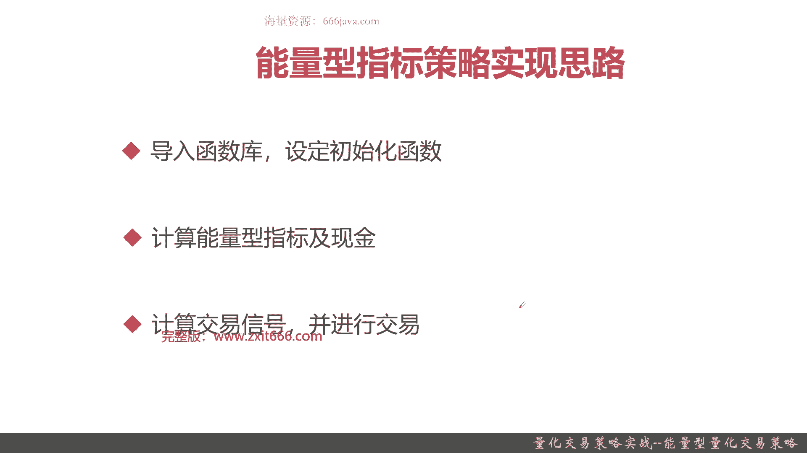
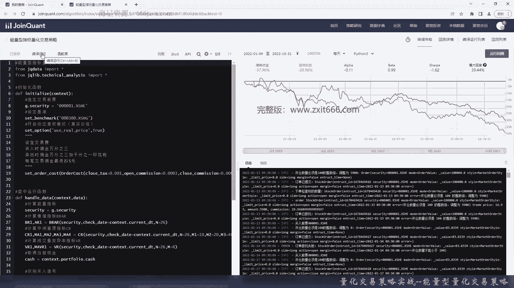
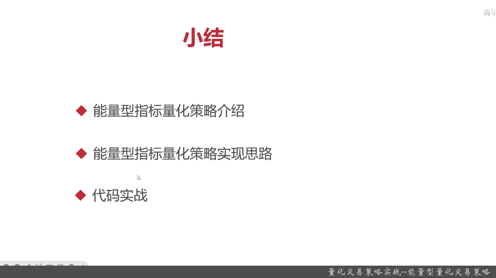

# 基于Python的股票分析与量化交易入门到实践 - P60：13.5 Python量化交易策略实战案例_量化交易策略实战--能量型量化交易策略 - 纸飞机旅行家 - BV1rESFYeEuA

大家好，我是MIKA，在上一节呢，我给大家介绍，如何综合运用ma和ISI这两个技术指标，进行量化交易策略，那么这一节呢我们将延续上一节的思路，也是综合应用一些技术指标，那这一节呢我们主要给大家介绍一下。

如何综合运用能量型指标实现量化交易策略，本节呢我们将从以下三个方面给大家介绍一下，能量型指标的量化交易策略，首先我们给大家统一介绍一下，都用了哪些能量型指标，然后呢这些能量型指标简单的基本原理是啥。

接着呢我们给大家介绍一下，如何通过这些能量型指标进行量化的买卖，信号的识别，再接着呢我们会给大家简单的介绍一下，能量型指标的量化策略的实现思路，最后进入代码实战环节，好，下面呢我们给大家简单介绍一下。

能量型指标的策略，首先我们给大家介绍一下，在这一节能量型指标策略会用到的指标，它主要包括情绪指标BRAR，中间意愿指标C2，还有成交量变异率VR，那么本节呢我们给大家介绍的呢，相对来说比较简单一点。

详细的算法和那个推导，这些我们就不给大家详细的介绍了，首先呢给大家介绍一下情绪指标A2B2，这两个指标呢一般是连用的，他们主要是通过反映市场的买卖人气，来判断整体的市场能量，那么接着呢是CR指标。

CR指标呢又名中间医院指标，那它呢主和A2，B2指标有非常多的相似的地方，但是呢他有个也有它自己独特的地方，就比如说他认为中间价是股市，最具有代表性的价格，那么从这个理论基础。

那就设计并且实现出了CR指标，最后一个呢是成交量变异率V2，这个指标之前可能应该给大家介绍过，它呢主要是反映了成交量的强弱，主要作用是以成交量的角度测量股价的热度，也是从侧面反映出整体市场的冷热情况。

那么这些这三大类指标情绪指标，中间意愿指标和成交量变异率指标，的基本原理就给大家介绍的呢，那么下面呢我们给大家看一下，综合这几个指标的买卖信号判断，首先当A2小于100，B2小于100。

同且BR小小于A2，并且C2和V2也都小于100时，这是作为一个股票的买入信号，接着当A2和B2都大于150，CR和VR也大于150的时候，就可以卖出股票了，那么这一个浴池是通过各种投研人员综合研究。

最后得出来的结果，那么记住，这个是能量型指标策略的一个买卖信号，接下来我们给大家介绍一下，如何编写能量性指标的量化交易策略，那也是主要是三步，首先还是导入函数库，设定初始化函数。

接着计算所有的能量型指标，还有你目前的仓位，现金，最后根据计算出的能量型指标，那计算出交易信号，并且根据你的现金头寸进行交易，好，以上呢就是一个非常大致的能量型指标策略。

实现思路，下面呢我们进入coding实战环节好，那么接下来呢我们进入coding实战环节了，首先把一些注释给写好，给大家方便了解，首先我们导入函数库，接着我们导入技术分析库，好，这里有个拼写错误。

我们改一下，好我们接着初始化，还是initialize，这次呢我们就不涉及到选股了，那我们就选定那个一个交易股票，我们就以平安为主呃，平安银行为准，当然了，同学们如果有兴趣，也可以把选股啊策略结合一下。

我们的能量型指标策略，说不定会有更好的效果，好我们还是暂定以平安银行作为交易股票，下一步设定基准，那我们就以沪深300，然后我们开启动态复权，就是以真实价格进行交易，然后我们设定股票交易费，这样吧。

我们把它，还是一样的，买入时佣金万三，卖出时佣金，加1‰手续费花1‰，印花税，美女是最低扣五元，这个呢就是，Word cost，首先是close，One3，交易费最低五元，我们检查下这括号对不对。

OK是对的好，那我们就是这个就设定好了，然后呢，到目前为止初始化函数就好了，我们这次不要用run daily，我们用handle data，Hello，ta是什么，盘中运行函数。

这个之前应该给大家介绍过，如果想不起的同学们可以自己回去翻翻课程，首先我们计算能量指标，那第一步呢肯定要把security给获取，第二步呢我们要把各种的能量指标分出来，先计算情绪指标。

这块呢我们因为这些都是直接在用巨宽的技术，分析的那个包，那我们在此呢各种指标的方式，我们直接就调用一个函数，我们就直接运运行了，然后呢，同学们感兴趣的可以自己去看区块的API文档。

去看一看这个指标的具体算法，还有它的一些参数，在此呢我们就不详细给大家解释了，好我们以当前时间作为每次的时间戳，货N取26，接着计算中间医院指标CR，这一样也是在用基础分析类，那时间还是当前。

这些配置呢都是这些指标常用的配置，我们最后计算VR，后面呢我们要获取当前现金了，因为指这些能量型指标都获取了，好识别加in信号，先是识别买入信号，那买入信号是啥呢，弱当前有余额肯定首先你得有资金头寸嘛。

否则你拿什么钱买了，那首先A2要小于100，BR也是小于100，并且呢B2小于A2，C2也小于100，VR也小于100，那其实就是一个判断表达式了，这个时候那就买入股票了。

那就用order value来买入股票，同时我们日志记录，这次我们用dollar s，做一个通配符给大家看一下，接下来我们要识别卖出信号，并且进行交易，那什么是卖出信号呢，我，们就不一个个敲了。

所以A2首先要大于150，B2也要大于150，然后，CR和VR都要大于150，这个时候还要记住，并且可以交易，有资金头寸，当然了，你的那个持仓也得有，你只有有持仓了，就是你有只有有资金投错了，你才能买。

有持仓你才能卖，所以这些你都要一起考虑的，这应该是判断了l if，Close able，可用持仓，这个时候我们就全部卖出，这个时候呢同学们应该想到用什么，对了，用org target就可以全部卖出了。

最后记录日志，我们一样简单的，好，那么我们这个能量型指标的量化交易策略呢，就写好了，这个能量测量其实也不复杂，所以呢我们简单给大家运行一下，看看它的具体结果，好可以看到他现在运行回测了。

我们目前选的时间呢是从2022年的呃，7月1号一直运行到2022年的10月3，11号，大概呢是一个季度多一点，就是四个月的时间，可以看到呢总体的结论，这个能量现在这段时间里其实可以看到。

其实跟基准沪深300，在平安上其实表现的差不多，当然这段时间基准也不太好啊，那我们换个时间段运行一下，看一下，比如说我们假设把它从1月4号到10月1号，可以看到吗，反而表现更差了，那么这个说明什么呢。

说明一个道理，其实单单的只用能量型指标用作择时，对于一个股票如果不结合选股的话，可能还不一定比沪深三三百的收益好。

那么本节的基本内容就到全部内容就到这里了，那么我们下面进入本章小结，好下面呢本进入本章小结，那么本章呢，我们主要给大家介绍的是，能量型指标的量化交易策略，那能量型指标的量化交易策略。

它究竟涉及了哪些能量型指标呢，它主要涉及以下三大类能量型指标，一种是人气医院指标，那就是常见的BRAR，那么它们主要是通过反映市场买卖人气，来看到那个买卖者的愿望的程度，那另外一个呢是中间意愿指标CR。

那它呢主要是通过股票的中间价，来反映整体的市场意愿，那最后一个呢是成交量变异率指标，这个指标的设计特点呢和其他不太一样，和其他两个不太一样，它是通过成交量的角度测量股价的热度。

OK那这三种指标呢它们的原理也就是那些了，交易信号呢分别是当A2小于100，B2也小于100，且VR小于A2，CI和VR都小于100的时候呢，就可以买入股，当然了，这些和你的账户里的资金头寸是有关系的。

如果账户里没有钱，那你什么都买不了，那么卖出信号呢是AARBRCR和VR，这四种指标全部大于150就可以抛了，当然了呃有些书上说要大于300，要大于400，或者是大于多少这一块。

在这四个指标综合判断来说，阈值一个是选100，一个选150就OK了，那么接下来呢我们给大家讲了一下，能量型指标的量化策略的实现思路也是一样的，导入函数库设定初始化指标。

然后呢就可以分别去计算能量型指标和现金，那根据能量型指标现金以后呢，我们就可以进行交易时信号的识别，并且进行交易，那么最后呢我们进行代码实战，本章节呢我们为了给大家介绍能量型，强化交易指标。

我们选定了一些相对简单的实现方式，我们没有给大家用一些round daily啊，包括一些盘前和盘后的处理，我们都没有给大家用，我们只用了handle data，然后呢代码上呢为了快捷简单快捷方便呢。

我们直接调用的距宽的技术分析的包，这几种指标呢都是可以调用里面的API，来进行实现的，具体的API调用方式我们就不在这里展开，感兴趣的同学可以自己去，课后去翻一翻相关的技术文档。

那么最后呢我们给大家回测了一下，这一年的能量型量化交易指标的前效果，在平安银行上，其实来说它表现的跟沪深300没有，甚至还没有沪深300好，那么这可以说明单单只用能量型交易指标呢。

这个策略像现在的时点来说，可能并不是一个很好的收益的情况，好我是那个以上就是本节的全部内容。

我是米切尔，大家下期再见。