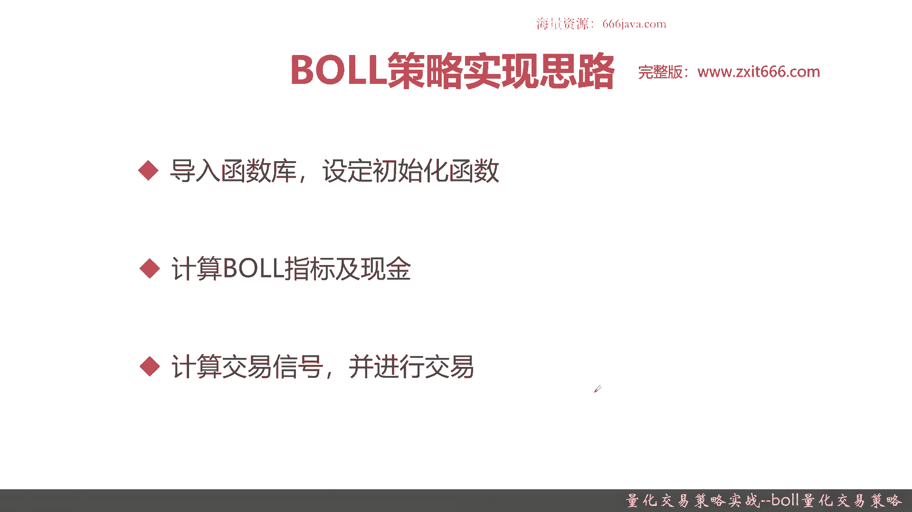
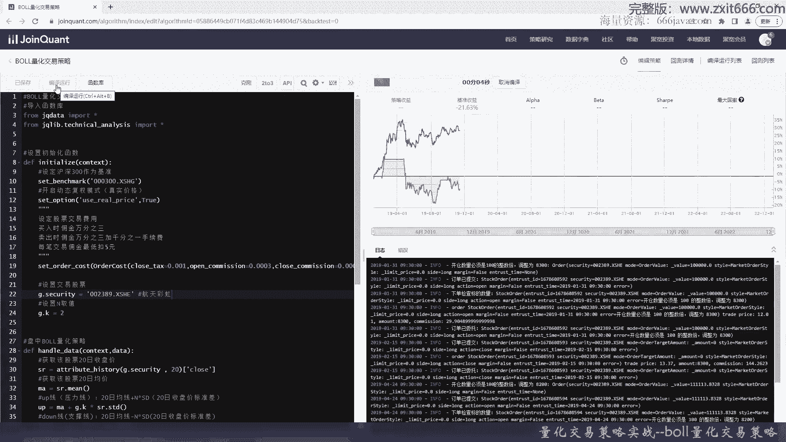
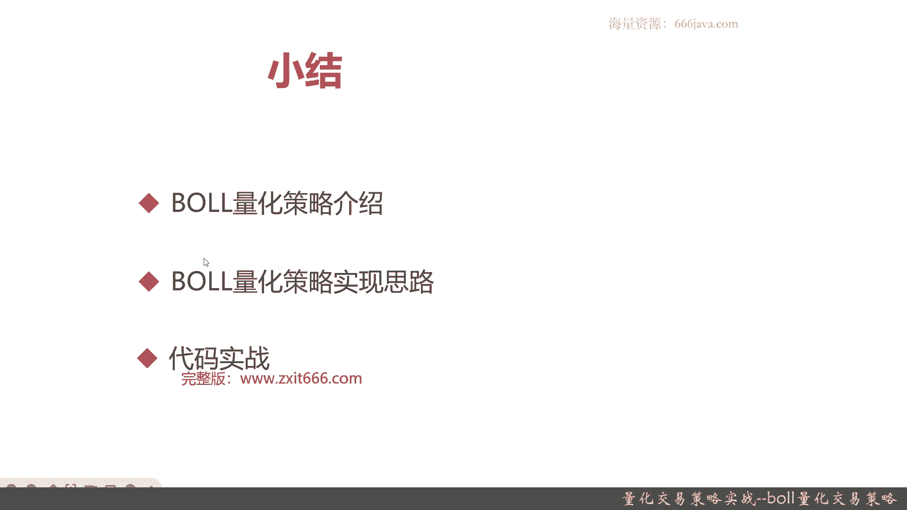

# 基于Python的股票分析与量化交易入门到实践 - P61：13.6 Python量化交易策略实战案例_量化交易策略实战--BOLL量化交易策略 - 纸飞机旅行家 - BV1rESFYeEuA

大家好，我是meta，在上一节呢，我给大家介绍了能量型指标的量化交易策略，能量型指标量化交易策略，它是综合运用了多个能量性指标，进行的量化交易策略，那么这一节呢我给大家介介绍，基于布林带的量化交易策略。

本节我们将从以下三个部分给大家介绍，布林量化交易策略，首先老样子我们给大家介嗯，整体介绍一下布林量化交易策略，接着呢，我们给大家介绍布林量化交策略的实现思路，最后呢是coding代码实战部分好。

那么接下来呢我们先给大家整整体介绍，介绍一下布林量化策略，这个布林量化策略呢是基于技术分析里面，非常重要的一个工具布林带而设计并且实现的，那么首先呢我们给大家回顾一下布林指标。

布林指标呢它一共有四条线组成，注意是四条，那分别是上轨线，中轨线，下轨线和价格线，那其中呢上轨线和下轨线呢，又分别称为压力线和支撑线，在我们这里的基本的介绍呢，其实上轨线up就是数值连线。

这块呢这个简单的定义大家看一看就行了，大家记住，上轨线up和下轨线down是布林带的一个范围，那之前的公式呢我们应该也给你介绍过了，这块我们就算法就不再重新复述了，注意一般来说技术的实战里面。

无论是投资者还是量化策略的开发人员，只要了解了布林指标的原理，和怎么去运用它就可以了，其实对它的算法呢，其实并不要花太多时间来深究，那么呢下面这是两幅图给大家回顾一下，左边这幅图是一个主升的布林带的图。

可以看到，无论是上轨线还是中轨线还是下轨线，都在往上升，右边的这幅图是主降的布林带，从这也可以看出，其实布林带它也是一个趋势的分析好，那么接下来呢我们给大家介绍一下，布林量化策略的策略原理和。

买卖信号是怎么识别的，首先是策略的原理，那当股价穿越最外面的压力线或者支撑线时，表示卖点或者买点出现，也就是说如果股价穿越了压力线，OK那就是卖点出现了，如果股价穿过了支撑线，那就是买点出现了，当然了。

布林带其实它不仅仅只有这一个作用，它还有一种场景的是，股价沿着压力线或支撑线上升，当然了，支撑线是下降，那可能这个时候没有穿越，但是回头突破了第二条线，那也是卖点和买点，好的。

这是两种常见的运用布林带进行择时的方法，或者说是场景，那么接下来呢给大家介绍一下，布林量化策略的买卖信号，那如果收盘价穿越布林的压力线则买入，如果收盘价穿越布林的支撑线则卖出，那有些同学会问了。

这个策略原理，其实还有另外一个场景，就比如说股价，它只是沿着压力线或者支撑线，进行上升或下上市，但他虽然并未穿越，然后回头又突破了，这种情况怎么办，在常见的量化交易策略的判断信号里面。

我们目前来说一般只是考虑第一种情况，这样的实现比较容易，实际上比较容易，同时胜率他其实也也挺高的，所以我们就选择实现第一种情况就好了，OK那么接下来呢我们给大家介绍一下，如何去实现布林量化交易策略。

首先还是老样子导入函数库，设定初始化函数，接着计算布林的指标，这个时候要把压力线，支撑线，中线这些该算的都算出来，还有你的仓位现金，仓位现金主要是为了买卖而服务的，最后你需要计算交易信号，并且进行交易。

那么以上呢就是本节课程的课件的这些部分。

那么接下来呢我们进入coding实战环节好，那么我这里呢已经把波音量化教学策略呢，给大家开了一个新的策略，那么接下来呢我们进入coding实战环节，首先导入函数库，那他需要导入技术分析库。

接着设定初始化函数，首先设定沪深300作为基准，然后我们开启动态复权，也就是用真实价格进行交易，然后我们设定股票的交易费用，然后最低呢是得扣五块钱，好这个呢就是set order cost，就有些策略。

其实同学们如果有自己去玩一下量化，可以看到量化交易策略这一块，他们可能会表现很好，尤其是那些日内的短线的或者是高频的，但是呢这种情况同学们要仔细去看代码，注意就是他们有没有把交易费用给。

按照真实情况可以实现，因为有没有交易费用，那对于你最终的利润在高频来说，影响的是非常多的，当然了，如果你是每日只交易一次，这种短中线的进行交易，其实还好，好交易费用写好了，我们设置股票交界，当然了。

像这个布林带这个量化交易策略，也可以自己去实现选股的策略，在此呢我们这股票池的选股策略，我们就不展开，同学们感兴趣，同学们可以自己去做做实验，我们这次就选择最近其实有一点点火的，航空类的股票。

好我们这次就选定一个比较火的航天类的股票，给大家看一看，好像是02389吧，对这只股票，然后看看给大家看一下效果，这个呢是股票特性，也就是布林带的N的值，暂定呢为二，当然了，同学们可以自己去做实验。

选择更好的，然后我们接下来就要实现盘中的布林策略了，好我们先获取20日的收盘价，接着呢获取20日均价，然后计算支撑线，也就是up线，那这个公式就是布林带压力线的算法，那这个SD呢其他要N乘以SD。

其实就是一个放大系数，那个中线其实就是均线，也就是说up线呢就是20人的均线，也就是中线向上偏移两个标准差，好然后求档线，也就是支撑线，那其实呢它的算法其实类似于压力线，ma呢减去GK，也就是两个。

也就是N乘以两个，也就是也就是两个标准差，好像没有自动提示吗，OK自动提示好了，好那么我们刚才到这步为止呢，基本上布林带就算完了，下一步呢我们要获取现金，然后把开盘首先获取开盘价格，然后获取现金。

那context点portfolio，点available，cash就是现金，然后我们要通过我们现在账户的持仓，来判断他的交易信号，好现在就判断，先先把买入和卖出的交易效给大家。

首先我们判断呃如何去考虑买入的信号，也就跌破支撑线了，并且呢我们持仓没有，好这个就是买入的信号，持仓mm就是context点portfolio，点positions，这个时候既然买入。

那我们就考虑全仓能买入，好然后呢是卖出的信号，当然了嗯，我们这里的卖出暂时不考虑风控好吧，也就是超过了压力线，并且我们有持仓就全全仓清掉，好这个时候还是ALTARGET，那这句话是什么意思呢。

就是说我们遇到了交易信号，这种卖出的时候，我们就考虑全仓全部抛售好，那么以上呢就是这个代码部分，我们来看一看，来进行一下保存一下，看看检查一下有没有问题，然后我们来运行一下回测，看看结果是怎么样的。

这里给大家注释一下吧，这支股票叫航天彩虹，当然了，我们的这个只是一个做实验的结果，并不构成任何的投资建议，那有的同学肯定会会问了，为什么呢，有的公司有的人会进行code，首先搞金融这块里面。

他不会去这点，我要跟大家强调，在正规的搞金融的这个领域里面，绝对不会给大家去推荐任何一只股票，或者说基金的，包括债券期货，也是最多是跟他跟大家去分析现在的宏观情况，比如说哪个行业比较热，哪个板块比较热。

但绝对不会给大家推荐股票的，因为首先你这样想，如果你股票赚了，那算谁的，亏了没有算谁的，所以这块在业内领市，是绝对不会给大家推荐股票的，好那我们来进行一下编译运行，好那可以看到通过这个策略。

这段时间好像还不如我们的那个基准，我们把时间再拉长一点，调一调看看结果，6月，换到12月31号，好那在下半年来说，其实可以看到我们这明显好于基准了，那我们可以再去挑，感兴趣的同学可以再去看一看。

回撤不一样，比如说我们算最近似从19年吧，19年1月1号到2022年10月三年，一般来说一个宏观周期是三到5年，我们看一下这个宏观周期怎么样。

好可以看到19年的4月到12月，基本上是不怎么转的，一直到20年的这个时候，拐点是在这里，大概是20年的2月份开始，逐步的优于了整体的基准，那如果按照我们这个基准，从19年开始，1月1号持有到现在。

那其实你们可以看到我们的整体的这个策略，收益还是可以的，3年收益的60%，也就是说年化有百分之将近20%的收益，可以看出，基本上可以跑赢大多数的市面上的公募基金，但肯定比你理财好好。

那我们来看一下整体的运行回测，好可以看到我们这个策略呢，嗯年化收益最终占12%左右，超额收益挺高的，有24%，这段时间呢这3年基准其实大盘不怎么好，当然了，这个沪深300最终还有28%的收益。

那阿尔法0。077其实不算高，贝塔0。43其实算很高了，风险比较高，可以看到有不停的最大回撤，就比如说在这一段从2021年的到啊，2022年的1月份，1月初一直到2022年的4月26号。

也就是说自四个月时间内，基本上跌去了将近70%，那最大回撤我们这个46%也很高了，然后夏普比0。382其实还可以，那个胜率0。545，也就是说我们的这个策略假设交易1000次。

那我们有545次都是挣钱的，最大回撤46%，高了，索提诺比例0。476，还可以，日均超额0。04，其实一般超额最大收益，最大回撤40。5%，也算是比较高的，风险也比较高。

因为我们这个策略呢其实它就属于高风险，高风险才能带来相对的高投入，当然了，咱们是在历史的时候，是对历史数据进行回测，假设你是一个量化交易的一个策略人员，一个作者，如果走了这段时间，你又能保证这段时间。

你还能继续的持有这只股票，并且继续的持有这个策略吗，这个不一定，然后盈利次数六，亏损次数五，其实稍微总体还是稍微有点赚点钱的，策略波动率0。269，其实算高了，基准波动率呢0。204。

这段时间基准也挺高的好，那我们看看其他的交易详情，那一开始其实是赚钱的吧，09年的时候，09年9月的时候还是亏的，后面就开始逐步去赚了，最多的是一次交易可以有3万多的盈余。

而最多一次是在2020年的2月4号，那一下子就可以赚了4万9000，这个挺还是挺赚的，那这是手续费，好我们接下来看看美股的每日的持仓收益啊，这个是每日的持仓，大家自己感兴趣的同学自己可以去试试就行了。

看一看策略收益，整体来说其实这个策略是载着最好的区间，应该是在2022年的5月到7月嗯，哦在下面220222020年的12月，甚至有0。86的收益，这是非常非常高了，86%的收益呢。

嗯但是后面其实就逐步的回撤了，因为市场是变化的那段时间，大家如果有印象的话，其实整体基金市场国家有一轮放水，然后基金其实涨了基金正常一些好的基金的话，可以有20%左右的收益，甚至大盘也有20%。

最高大盘涨了3700点吧，但后面就直接去回落了，回落了3000点，甚至还有是你3000年保卫战对吧，然后这是基准的收益，基准收益最高的时候37%对，也是那差不多那段时间了哦，在2021年的3月。

那个时候是最高的，那现在其实还是在一个震荡阶段，还没有一个具体的牛市或者熊市的表征印象，那好接下来是阿尔法，然后是贝塔，夏普夏普最好有四点几的，很不错，但现在的回归，OK索提诺好。

其他的呢我们在最后再给大家看一下，最大回撤，最小的时候应该是有零，然后12位的呢是在0。07左右，那最高的时候40。4几，这个时候到现在为止都是挺高的，好，那么接下来呢就进入本章小结了。

好接下来我们进入本章小结，首先呢我们给大家进行了布林带量化策略，这个boo l波尔，你直接念叫波尔，实际上它是一个布林的缩写，这个又叫常见的那个指标里面一个叫布林带，他的量化策略呢是基于布林带这个技术。

工系工具来的，类似于K线图啊那个之类的，布林带这个指指标呢一共有四条线组成，上线中线，下线和下线价格线，其中中线呢就是我们的股价的近N日的均线，一般呢取20日，当然了，你可以根据你的实际的那个情况。

你取得更多，比如说60，那你就更长线一点，你如果是做短线，那你可能近5日等等，这个都是根据你实际的情况来自己调整的，然后呢上限和下限分别是压力线和支撑线，那一般来说它是有一个N倍的标准差。

其实就是均线的N倍的标准差，具体N我们默认是取二，当然同学们有的时候经过实验，觉得可能取1。5，2。5，这个最好，或者你用机器学习的实习算法来进行调仓，对大量的股票进行一些设计一下最大的胜率。

这都是可以的，但是我们现在呢在这个阶段，我们不介绍这些复杂的算法，同学们记住上限就是压力线，那下线就是支撑线，那还有一些呢是股价的价格线，用来去判断我们的趋势的，那在我们实际情况下。

同学们其实投资里无论是开发和投资，都不需要对这个布林带怎么去计算，非常的去了解，大概记住一下就行了，重点是要知道这个布林带指标的原理，还有它怎么去运用，那关键我们是应用，然后布林指标这个策略的原理呢。

就是，当股价穿越最外面的压力线或者支撑线的时候，那就可以看出他是卖点或者买点道理，那如果是人看呢，其实还可以发现第二个趋势，就是当股价沿着压力线上升或者下降时，虽然股价并没有穿越过该压力线和支撑线。

而是回头突破第二天的线，那就是相应的卖点或者卖点这一块呢，第二种情况我们就不展开了，因为我们在实现布林的那个量化交易策略，一般选用第一种情况，因为这个买卖信号最好判断。

也就是说当收盘价穿越布林的压力线时候，就是一个买入的信号，当收盘价穿越布林的支撑线的时候，就是卖出的信号，那么接下来的呢就是我们给大家介绍并设计了，布林量化策略的实现思路，首先还是导入函数库。

设定初始化函数，接着根据刚才给大家介绍的公式计算布林指标，也就是上限下限啊，当然首先要算中线，然后还有你的持仓现金，这个是非常重要，这决定你怎么能不能交易啊，然后最后根据供应贷的策略的买卖信号。

计算交易信号，并且进行交易，最后呢是代码实战的环节，我们呢这次给大家选了一个跟之前不一样，之前我们都是拿平安银行或者浦发银行，这些带头，这次呢我们给大家选了一个，最近相对来说比较热门的板块。

那个军工的航天板块的一只股票平台上，首先我们还是要说一下免责声明的，我们这里不构成任何的投资建议，那为什么呢，因为在金融这个领域里面，大忌是给人直接推荐股票的，要么是坑你的，要么是这个投资人是傻。

要么这个应该是这么说，切记是给大家直接推荐股票的，那在此我给大家是讲一下原因是什么，一般给你推荐，要么是想骗你钱的，要么呢他自己就傻，可能会把你带坑里，所以同学们千万不要去，直接去相信那些卖软件的。

卖炒股大师，那其实都是想骗你钱的，那还有这些人呢，自己才有的人自己不了解这些原理，因为市场风险瞬息万变嘛，你明明知道你这里可能是赚钱，但是你有可能就是卖不出去或者买不进来，这都有可能。

所以切记不要只给大家直接推荐股票，那我们这块只是做实验，可以看到我们的这个最终的策略的结果呢，一开始在只是回测半年，那可能还没有基准好，但是放的时间稍微长一点，用3年的周期来说。

我们最终是有60%的收益，从19年1月1日到十二二年的12月3日，这说明什么呢，说明其实量化这里还是要考虑中长线的，当然了，也有同学们说我要实现高频，那是短线策略，那在我之前的这些介绍的策略。

它并不是一个短线策略，然后切记一点，无论怎么样，你量化一定要以真实的，尽量真实的交易费用来考虑，因为越是高频，它产生的交易费用越高，它会把你的利润都吸走的好，以上呢就是本节的全部内容，那到本节为止。

关于技术指标相关的一些策略呢，我们就给大家介绍完了，我是米切尔。

大家下期再见。