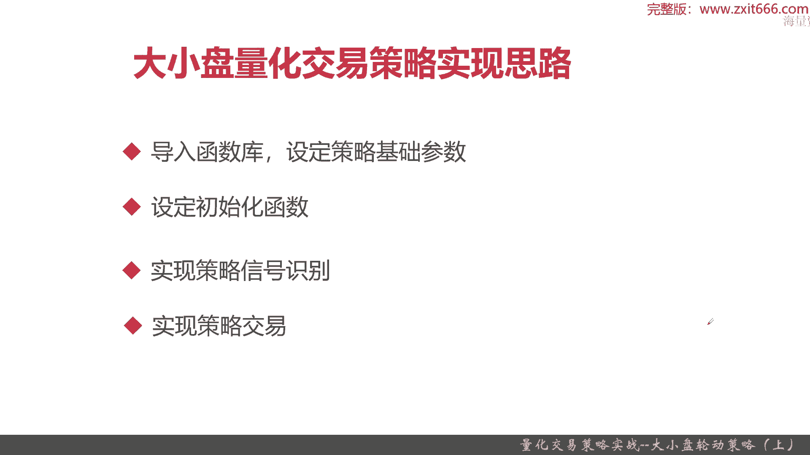
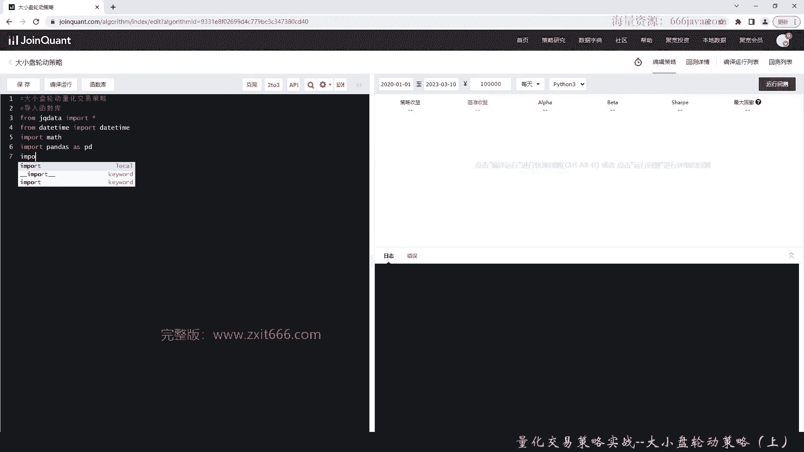

# 基于Python的股票分析与量化交易入门到实践 - P65：13.10 Python量化交易策略实战案例_量化交易策略实战--大小盘轮动策略（上） - 纸飞机旅行家 - BV1rESFYeEuA

大家好，我是米TIA，在上一节呢，我向大家介绍了低估值量化交易策略，那么这一节呢我将向大家介绍大小盘轮动策略，本节我将从以下三个方面给大家介绍，大小盘轮动量化交易策略，首先给大家介绍这个策略的原理。

它的指标是如何构建的，还有它的指标算法是什么，然后呢如何通过这些指标去应用判断，并且识别策略信号，那么接着呢，我们会给大家介绍一下这个策略的实现思路，最后还是老样子是coding实战环节好。

那么接下来呢我将先向大家介绍一下，大小盘轮动这个策略，首先我们给大家介绍一下这个策略的原理，大小盘轮动，这个策略呢是来自于一个国泰君安，在2021年11月10号的一分著名的研报。

叫风格轮动下的基金组合策略，那么之前我给大家介绍了基于技术指标类的呃，量化交易策略，还有基于一些呃新闻或者宏观政策类的，量化到交易策略，还有一些经验，比如说之前说的低估值，那这一次呢我给大家介绍一下。

我们量化交易策略的一个来源呢，就是行业内著名的研报，那这份研报呢，感兴趣的同学们可以自己去看一下，他本来主要是为了去给大家分析和设计，一个基金相关的一个策略，那么经过我们大家的那个。

应该说是策略爱好者们自己去研究，发现他的这个策略呢，也是适用于A股的股票交易，这份报告，他的主体的思想就是说他要去研究整个大盘上，他的一些风格是如何去变化的，说白了就是大盘有的时候是大盘股相对较强势。

那你买大盘股，那你可能投资大盘股就比较收益比较高，那过段时间呢有可能小盘股，那收益比较高，那就是小盘策略可能比较明显，那还有段时间呢，可能是大盘在震荡或者是中盘股。

那就是说大盘和小盘策略呢基本上没什么变化，所以为了把这个大盘的风格轮动进行量化，这份报告呢提出了一个非常有意思的思想，相对强弱指标rs这个指标呢是这份报告的核心，国泰君安的研究员呢。

通过构建这个相对强弱指标，继续观察整个大盘的风格，还有它的变化，从而可以达到研判大盘在未来的一段周期，它究竟是那个大盘的倾向还是小盘倾向这一块，整个研报，他的目标就是通过嗯构建一个相对强弱指标。

来预测整个市场的风格走势，它究竟是大盘的还是小盘的，总结来说就是这样，感兴趣的同学们可以自己去下面去看一看，这份研报写的还是比较好的，那么接下来呢我们把这份那个研报里面。

比较重要的几个思想给大家介绍一下，首先给大家介绍一下i is指标的构建，那它有个非常核心的风格的代表参数，那是什么呢，一个是大盘风格的代表沪深300，一个是小盘风格，代表创业板指数。

如果同学们看了原报就会发现，其实嗯在原先的这篇研报下，大盘风格代表确实是沪深300，但是小盘的风格代表在我们这里，策略里面改成了创业板指数，这是为什么呢，首先这份研报是2011年写的。

那个时候呢只有中证500，那个时候创业板指数还没有，然后随着时间的推移，在这十几年来，那个中证500这个指数，相代表的一些股票的市值发生了不少变化，现在已经十多万亿了，呃好像我没记错的。

可能是11万亿左右，沪深三盘呢，大盘一这个代表的风格，这个是倒是一直没变，沪深300代表表的那些成份股，总市值已经加起来有40多万亿了，那明显他是大盘吗，小盘这里风格呢是最近几年才上的一个创业板。

那创业板呢代表的市值呢确实是那个小盘，他好像也不到10万亿，好像只有78万亿的左右，所以拿这两个指数作为一个市场，整体的大盘风格和小盘风格的对比，OK这是S指标构建的一个基础参照。

那么接下来呢给大家介绍一下IS指标的算法，这个算法呢同学们看一下数学原理，我就不做推导，它其实简单就是把那个沪深300的超额收益，和创业板的超额收益呢做一个对比，其实就是取对数，然后如果这个值大于零。

那OK那就认为这是现在是大盘的策略，这个值小于零，那就是小盘的策略，那么接下来呢给大家介绍一下这个指标的判断，就像我刚刚说的，rs指标大于零，说明大盘风格强势，S指标小于零说明小盘风格强势。

那么接下来呢再给大家说一下，这个指标，如何去通过RIS指标值去研判整个市场的风格，那这一块呢就要用到一个，数学上常用的一个模型了，其实就是那个正弦滤波，首先在研报里面，他的思想是这样的。

把S指标通过一个时间序列，形成一个连续的曲线，那形成连续的曲线以后呢，他们观察或者拟合，把它构成了一个正弦的滤波，那对正弦滤波其实就是一个趋势了，进行一阶导数求导和二阶导数求导。

那一阶导数呢就说明整个i is指标的趋势，那它是涨还是跌，二阶导数就在一阶的时候再求个导，其实就是说这个趋势的速度是如何的，那在此之上再进行一层推导和定义，那一阶导数大于零的时候，说明整个S是上涨的。

整个S是上涨的，其实就说明它是一个大盘的趋势，而且就是S值越大嘛，说明大盘趋势越明显，那如果一阶导数小于零，那就说明S是小盘趋势，那S是小盘趋势的话，小于零越小的话，说明整个市场风格越偏向于小盘股。

那再加上二阶导数呢，他就是可以综合判断，它，是可以知道整个大盘是加速上涨还是加速下跌，或者是减速上涨或者减速下跌等等，这样呢其实它就等于有一个四象限的作用，在这个指标应用之上，我们已经可以判断了。

整个大盘的风格和未来的趋势，那我们对于我们这个量化交易策略有什么用呢，OK我们要找到若干个，可以代表或者抓住大小盘轮动的策略的标的，来进行投资，这样的话，我们才会把对于整个市场大小盘轮动的预测。

转成我们投资的胜率，这块要确定投资标的，那这个投资标的是什么呢，也是两个，一个是大盘的投资标的，就是沪深300的ETF，小盘的投资标的是创业板的ETF，同学们可能不太理解，我给大家简单介绍一下。

为什么是这样的，首先我们大盘的那个风格参照，是沪深300的一财富，这个同学们刚才已经给他们介绍了，那为什么三本沪深300ETF呢，首先ETF其实是一种特殊的基金，它本质上是基金。

然后呢它是我们为数不多的，可以直接通过我们个人的投资者，去投资各种指数的一个基金，用ETF其实就是场内基金，它场内基金的投资方式和额股票是一致的，他可以按照一个那个交易日，可以按时买入和卖出。

然后呢他也可以一天买入多次，不像同学们如果是买基金的话，他只要走申购和赎回流程，申购和赎回流程呢一般都有的，有的是T加一日，有的是T加2日，反正总之呢到账的时间，总之他不能在那个大盘进行交易的时候。

进行投资，ETF背后一般都是一些很重要的指数股，或者是市场股，他们的那个投资他们就相当于投资了这个指数，所以根据这一点说，正好这个市面上是有了沪深300的ETF和创业板，小盘的一份。

正好就可以代表沪深300指数，还有创业板这个指数的投资标的，这个报告是在国泰君安的，这个研报是在2011年写的，那个时候呢国内的ETF还是没有的，ETF也是最近几年才有的，这是正好给我们设计。

并且实现这个量化交易策略呢，起到一个很好的作用，如果在当时没有这样类似的投资，这些ETF的机会呢，我们可能就要去购买沪深300或者创业板指数，这些成分股，可能初始资金就比较多了。

你比如说假设沪深300里面有茅台，你想茅台投一手得多少钱，几10万肯定是需要的，而用了沪深300ETF，其实呃我们一块钱两块钱就可以买一股，那个100股的话也才100多块钱，对。

那么接下来呢再给大家看一下这个大盘额轮动，这个策略的一个具象化，这张图呢是来至于国泰君安的这个研报，我就直接截下来给大家理解一下，为什么是说这里四象限，其实大盘呢整体来说是一个变化趋势。

如果同学们能能达到整个市场，股票市场主要是A股市场，在最近10年甚至15年，20年的一个整体的那个呃指数的一些变化，那通过刚才所说的，通过S那个指标，把他的时间曲线全部连起来以后。

你们就会发现其实是大盘市场是以年的周期，一般可能是三到5年这个周期进行一个轮转的，有的时候大盘占优，它加速上行，有的时候它呢到了张数上行的时候呢，绞盘占有它会减速下行，那慢慢慢慢会到一个均衡态。

然后呢如果这个策略压策略还在往下走，那他就会走到小盘继续占优，那可能就是完全加速下行，到小盘继续占用了，但是当小盘占用到一定时间以后，慢慢慢慢又会变成上行状态，最后又变成到了一个均衡状态。

最后到了大概率像我这里都已经给标记大，大家标记出来了，贝塔一就是我们的滤波，它的一阶导数，贝塔二其实就是二阶导数，通过这个我们就可以判断出，这个时候大盘究竟什么状态。

实际上呢其实对我们投资有用的就三个状态，一个是大盘占用状态，一个是小盘啊，转用的还有一个是均衡状态好，那么根据这个四个象限呢，我们据此设计呢，整个大小盘量化交易策略的信号识别。

那么接下来呢我给大家介绍一下，大小盘量化交易策略的信号识别，首先我们要判断整个大盘的趋势，那它到底是属于当前到底属于大盘趋势，还是属于小盘趋势，那假设当前属于大盘趋势，那我们要判断啊，他是加速上涨的吗。

如果整个现在的整个市场的风格是大盘，上额趋势，且他是加速上涨，那么这个时候我们就有一个交易的信号了，我们需要全仓持有大盘的ETF，这个逻辑很好理解啊，如果这个时候只是大盘趋势，但是呢它并不是加速上涨。

甚至呢有可能是减速下跌，或者说是加速下跌呢，那我们就要换一种策略了，这个时候我们就要把大小盘的ETF各持一派，这样呢就是认为它是均衡态，以上是整个那个市场是大盘趋势的情况。

那我们这市场假设是小盘的趋势的情况呢，我们要判断这市场是不是在加速，还在加速下跌的，因为rs大于零就是大盘群和，如果是X小于零，就是小盘情况，那我们判断是什么呢，如果他是现在是小盘情况。

且是加速线下跌的情况，那我们应该处理处理，Ok，那我们这个时候是不是，就应该认为它是小盘的趋势，那我们应该全仓小盘ETF对吧好，那如果现在它是小盘的趋势，并且呢它并不是在加速下跌。

它甚至有可能一个是减速下跌，甚至有可能他是在那个上涨的情况，那他又是不是又是均势，那我们来看看分别看一下，在这两种情况下，我们应该怎么去持仓，如果我们现在的市场是小盘趋势。

但是呢它并不是在加速下跌的时候，那这个时候呢，我们还是认为整个市场它处于一个均衡态，所以呢我们大小盘的ETF各持一半，那么最后呢如果现在已经是了小盘的风格，那同时整个市场它的二阶导数还在显示。

在加速下跌呢，那我们就认为这个时候市场就属于小盘策略，那我们就应该全仓我们小盘的EPF，OK整个这个信号识别呢，它的原理其实就是通过i is正弦曲线的，一阶和二阶导数的当前的是大于零还是小于零。

这个状态值来去判断它究竟是属于大小盘，这个量化交易四象限的哪一个象限，那我们关心的分别是大盘占优的情况，还是小盘占用的情况，还是一个均衡态，那如果，大盘占优，我们最终其实我们的交易策略就只有一个全仓。

大盘ETF，那如果是小盘占优的情况，那我们就应该是全仓小盘ETF，那如果现在是个均衡态，未来说不准他到底是大盘还是小盘，这个时候呢我们就可以大小盘ETF各持仓一半，然后静观其变，当然了。

有的同学也也会说了，那你为什么不清空仓位呢，那这是一个机会成本吧对吧，那么呢，以上就是整个大小盘，量化交易策略的基本的介绍，那么下面呢我们给大家介绍一下，如何去实现这个量化交易策略。

实现这个量化调成性策略呢，还是和我们其他一些策略，其实实践起来总体思路是差不多的，首先导入函数库这个词呢，要设定策略的基础参数了，因为大小盘调换条因特有，他要有一些那个基本的风格参数。

还有一些基础的ETF，还要把IS求出来，然后并免IOS呢那个让它正弦力波化，并且对这个正弦滤波呢进行求一阶和二阶导数，所以呢这些基础的参数是要有的，接着呢设定初始化的函数，然后呢是呃实现策略信号的识别。

最后呢实现策略交易好，以上呢就是我们本章的这个课程的基础部分了，那么下面呢进入coding实战环节。

好老样子，我们还是先把那个这个代号盘，轮动策略的这个demo给大家，函数给大家搭建好了，下面呢我们进入编码实战，首先我们写一下注释，首先我们导入函数库，那由于这个代表盘呢，这个轮动策略是用的数学工具。

比如说求导，比如说那个正弦滤波比较多呢，所以我们这一次要用到一些其他的一些排除库，但是这些都是Python常用的，首先还是老样子，我们导入区块，这样才能把一些核心的API给导进来。

然后我们导入一些时间周期的，就是data time，方便大家处理很多时间序列相关的东西，然后因为有各种求导，很多要用到数学公式，所以我们要导入max这库，然后老样子pandas是肯定必不可少的。

