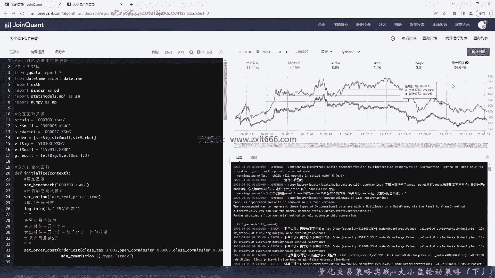
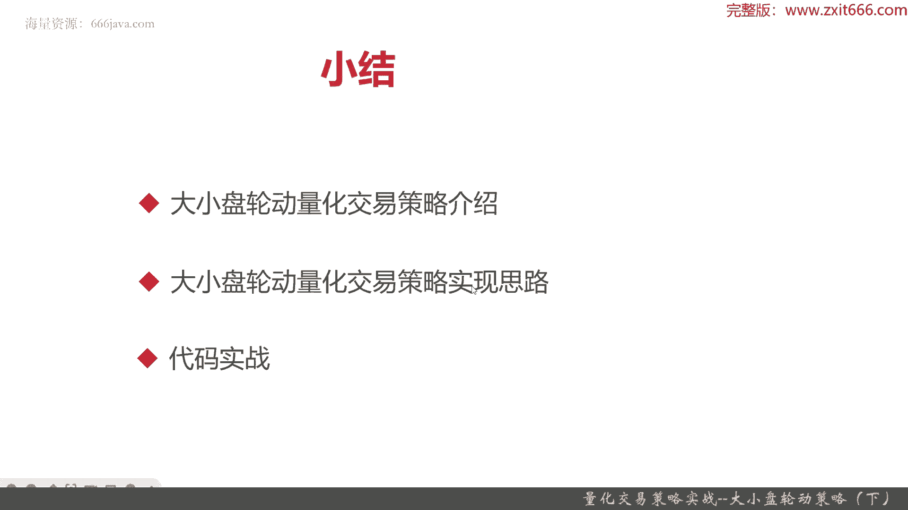

# 基于Python的股票分析与量化交易入门到实践 - P67：13.12 Python量化交易策略实战案例_量化交易策略实战--大小盘轮动策略（下） - 纸飞机旅行家 - BV1rESFYeEuA

这种求导呢，我们就没必要那个全部自己重新写了，用现有的库呢，其实可以让我们开发效率更高一些，如果每行代码都求导的都自己写，其实要写挺不少的，那这个就是一阶导数就求好了，然后准备求二阶导数了。

再把它初始化，那其实求二阶导数呢也很简单，就是把一阶导数求的方式，只不过参数呢换成求二阶导数就可以了，没有直接求导数的算法，所以我们其实是用最小二乘法，然后来进行拟合的，那这个二阶导数的准备就好了。

二阶导数也求完了，那我们要准备，下一步要准备判断我们的最终结果了，好就下面呢其实就是很简单了，已经把一阶和二阶导数求出来了，下面就是通过四象限，也就是T1和T2的大于零和小于零，来判断他所在什么象限。

通过所在什么象限，来判断它是大盘的策略还是小盘策略，还是均衡策略，如果这个时候是大盘策略占优的话，那我们就是全仓大盘占比百分之百，那这个时候小盘的ETF持仓就应该是零，如果是均衡态，两边都是等于零。

都各各半分吧，然后这其实呢也是一种均衡态，最后呢是小盘占优的情况，那这个时候全仓小盘ETF就行了，好交易信号判断了return result就行了，那最后交易函数，那么首先我们要计算我们的信号。

那既然我们把get signal给实现了，直接调用它就行了，该是呢我们这个时候呢，其实它要传参是个DATTATE，那其实trait ta呢就跟我们盘是有关系的。

我们context里面有个previous data用来做这个，正好，因为他传的是要REGDATA嘛，所以呢我们把它传传成字符串，好这样result就能算出来了，然后呢我们进行持仓。

如果我们现在当前的那个就是G点，result呢，就是当前的这个持仓信号呢，和我们算出来的结果不一样，我们就要进行交易了，嗯如果当前的持仓和我们get signal的转数，计算出来的持仓比例是不一致的话。

那我们要进行调仓，也就是该买的买，该卖的卖，那怎么做到该买的买，该卖的卖呢，首先清仓，先清仓，然后再买，然后我们判断现在的仓位的，我们整个账户里面的现金有多少，Part for6，那买完以后呢仓金比例。

因为我们是按照算出来result里面的ETF，B格和SMT的占比，那肯定就是要更新，当前就是全局变量里面的result产品，方便我们以后再去分析好，那么代码呢基本上就写完了。

然后我们看看在最近两三年时候，按照这样的策略会是运行出什么结果好，那么现在呢我们就把这个代码给写好了，那我们看一下，根据我们实现的这个交易策略呢，假设从2020年的1月1号到现在将近两年，3年的时间。

看看结果是怎么样的，首先边运行一下，好那么我们的策略就回收完了，可以看出我们这个策略呢其实非常和，就是沪深300的整体的那个比例，和运行的趋势有点像，但是呢我们始终比那个沪深300呢，赚的稍微多一点嘛。

在这段时间内，这两三年的时间内，沪深300是亏的，基准亏了3。6%，而我们的策略呢盈利率12%，那阿尔法0。05，贝塔1。08，夏普呢-0。01，其实不是破最大回撤，由于沪深三这段时间大盘也是在震动的。

所以有35%，那还算是比较高的，那我们呢再换一个时间点，比如说到去年，然后再运行一下回测，看看结果，到22年底，整整整整3年的时间，那么这个呢我们就把这3年给那个回测完了，可以看到这段时间呢。

这3年里面策略整体收益10%，3年换的不是特别高，但超额收益挺高的，19%，这个时候基准不是特别高，亏了5%点几，阿尔法0。061，贝塔1。0还是比较高的，因为我们基本上就和大盘的整体震荡呢差不多。

但是呢因为我们这策略的超额收益在这里，导致呢，我们虽然大盘在亏，我们整体还是涨的，然后夏普比0。015不是特别高，胜率0。548，大多数情况还是挣钱的，盈亏比1。1。67，最大回撤有点高。

那最大回撤是从这里这个点十点到这个时点，其实最大回撤是相当高了，35%，日均超额0。03，超额的最大回撤16%算是高了，那超额收益零点夏普0。197还行吧，日胜率0。15，盈利17次，亏损14次。

我们其实就赚了这正三次的那些盈利钱，信息比例0。510，那策略波动呢0。254，这可能稍微是比基准高一点，因为清基准在这段时间整个只有0。26，那接下来来看一下交易的详情，总体来说有赚有赔吧。

整体还是稍微赚一点，赚的不多嘛，好这是策略的整体收益情况，可以看到基本上是符合0。540的胜率，一半一半吧，五十五十五%左右的胜率，这是基准的设定基准，这段时间总体来说不是特别好，阿尔法贝塔夏普。

夏普在二0220年6月份非常高，34啊，待遇索提诺好，波动率好，感兴趣同学们可以自己去回测回测，那么接下来进入本章小结，本章呢，首先我们给大家介绍了大小盘轮动量化策略，这个策略呢很有意思。

是来源于国泰君安，在2011年11月10号下的一份研报，风格轮动下的基金组合策略，这个主要是为了给大家推荐基金的，这个研报，本来是给大家尝试发现一种，基金策略的构建思路。

那他呢核心思想就是通过构建相对指标i is，然后呢根据这个i is的滤波，正弦滤波和一二阶导数，来持续观察整个市场的大小盘的风格持续性，然后呢，找到如何利用这种情况来持续的获得盈利。

那这rs的指标在我们这个策略里面，现在策略大盘的策略风格代表的是沪深300，小盘风格代表的是创业股，然后指标算法呢，其实就是把沪深300和创业板的超额收益率，进行一个呃烙印，然后呢对比一下就可以了。

那为什么原来的这个原报里面，用的是那个中证500，而我们现在用的是创业板的，主要这个研报写的比较早十多年了，但是呢整体思想还是值得借鉴，所以我们把它换成了创业板指数。

然后整个指标的判断呢其实就是S大于零，就说明大盘风格强势，S小于零呢就是小盘风格强势，对rs4这个滤波的指标进行一二阶求导呢，那当一阶导数大于零，说明整个大盘是上涨的，那一阶导数小于零。

说明大盘呢是下跌的，当二阶导数大于零的时候，说明这个上涨或者下跌的趋势呢是呈加速状态，那当二阶导数小于零的时候呢，上涨和趋势它处于减速放缓的状态，那有了这些指标应用，我们要进行投资了。

投资标的就采用沪深300的ETF和创业板的ETF，这两个ETF能很好的代表出，沪深300和创业板这两个指数的整体的情况，然后呢其实通过四象限的方式来进行判断，那其实根据四象限，我们只要识别三种情况。

一种是整个市场大盘占有，另外一种呢是整个市场是一个均衡状态，最后呢是整个市场，那是小盘占有，那当整个市场处于大盘状元的时候呢，其实说白了就是一阶导数大于零，二阶导数也大于零。

我们要全仓持有那个大盘的ETF，当一阶导数小于零和二阶导数也小于零的时候，这个时候说明整个市场是在小盘的占优的，策略的情况，那我们要全仓持有小盘的ETF，其他的情况呢都是均衡的状态。

那我们大小盘ETF各持一半就好了，后面呢我们给大家介绍了，这个大小盘轮动交易策的实现思路，这个实现思路呢跟之前有个稍微缺些不同的，就是我们要设定一些基础的参数，这个基础参数无非就是大小盘的风格的。

代表的指数，还有一个市场指数，以及那个大小盘风格代表的ETF，还有我们自己设定了一个result，这个参数用作存放当前大小盘的比例，那后面呢就是代码实战了，整个策略呢。

其实它用到了不少数学相关的一些工具，比如说把i is它要进行那个正弦滤波，那它其实就需要用到hp filter这个函数要求导，那其实呢我们用的是最小二乘法，然后进行拟合方式来进行求导。

那这些呢其实都需要用到那static model，这个类库来进行处理，那其他的呢代码上呢就是没有什么特别的感人，特别需要同学们注意的地方，感嗯感兴趣的同学可以自己看看客户代码，然后自己再练习一遍。

那整个量化策略呢运行完的时候可以看到，其实它因为是个长线的策略嘛，他每个月才进行调仓或者回撤一次，整体来说我们这个策略其实和沪深300的走势，基本上和沪深板走势非常相似。

但是呢由于我们是一个非常稳定的策略，我们考虑大小盘的轮动，所以我们整个策略的超额收益，是比沪深河要好的，无论是大盘，沪深上面是怎么样，我们都是比沪深买可能多盈利将近十几个点，甚至20%。

OK以上呢就是本节课程的全部内容，我是米提亚。

大家下期再见。