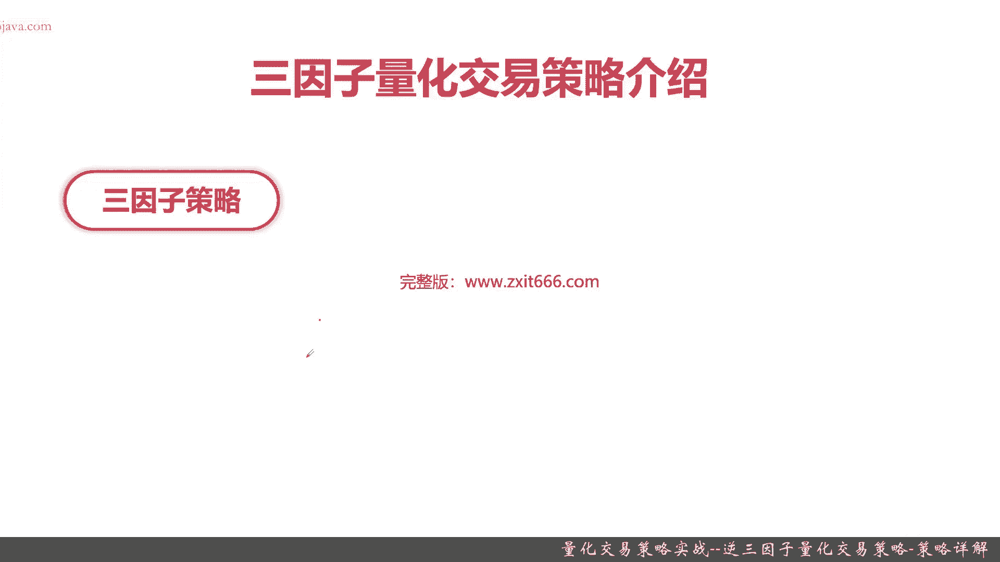
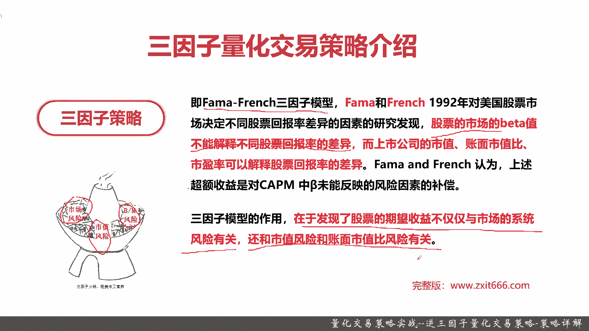
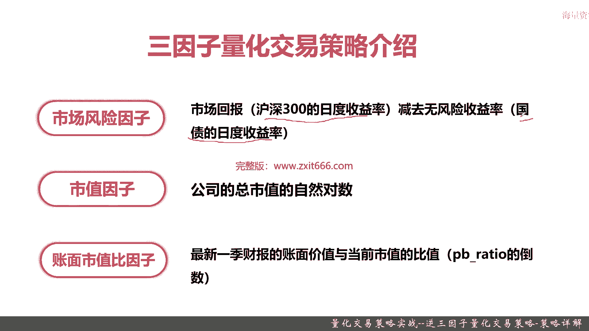
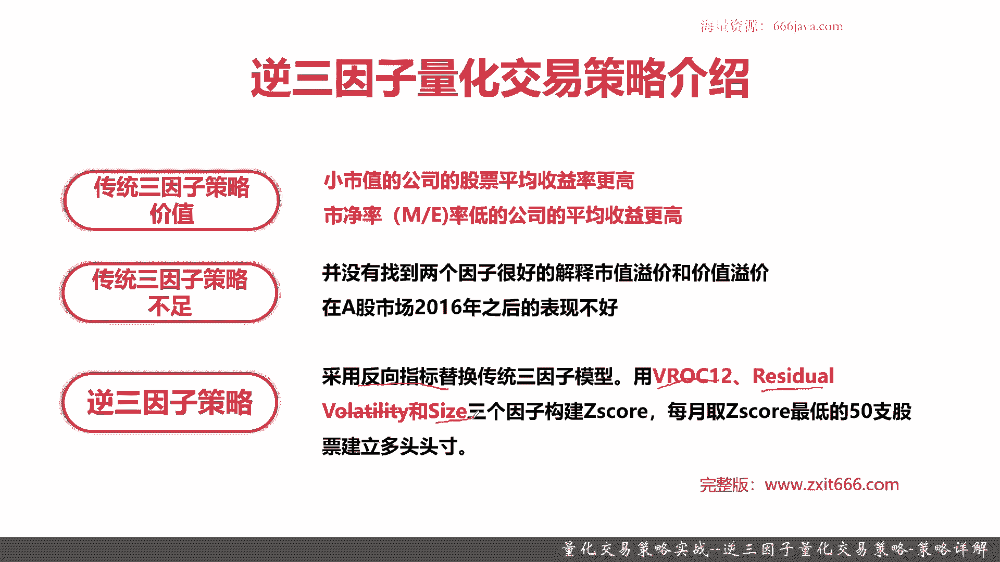
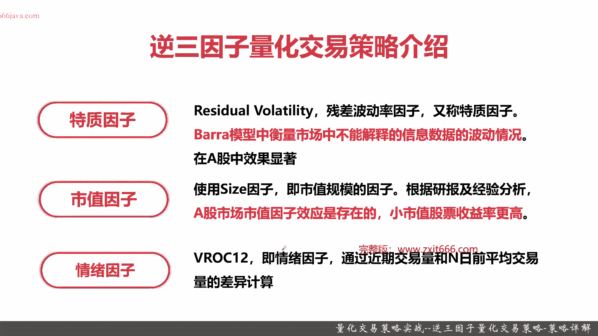
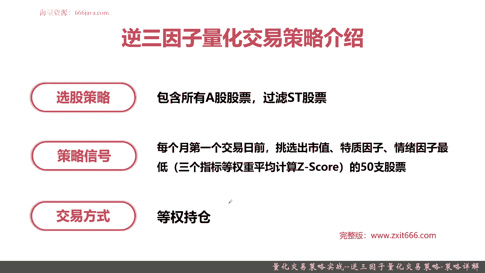
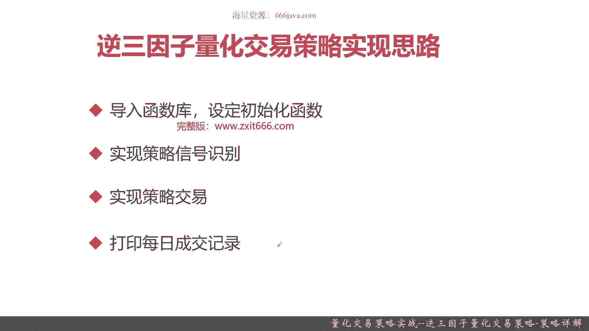

# 基于Python的股票分析与量化交易入门到实践 - P68：13.13 Python量化交易策略实战案例_量化交易策略实战--逆三因子量化交易策略-策略详解 - 纸飞机旅行家 - BV1rESFYeEuA

大家好，我是米铁，在上一节呢，我向大家介绍了大小盘轮动量化交易策略，那么本节呢将向大家介绍，本章最后一个量化交易策略的实战，逆向三因子量化交易策略。

本节我们将从以下四个方面给大家介绍，逆向三因子量化交易策略，首先给大家介绍一下，什么是三因子量化交易策略，上一节呢给大家介绍的，大小盘轮动量化交易策略呢，是脱胎于国泰君安之前一份非常著名的行业报。

而我们本节先向大家介绍的呢，逆向三因子量化策略呢，是根据非常著名的砝码，三因子这个模型来进行优化的，所以呢本节我们先向大家介绍，三因子模型和它相关的量化交易策略，接着呢我们给大家介绍一下。

脱胎于三因子量化交易策略的逆向，三因子量化交易策略，再然后呢，我们给大家介绍逆向三因子量化交易策略，的实现思路，最后还是老样子扣定实战环节好，那么接下来呢，首先我们给大家介绍一下三因子量化交易策略。

说到三因子量化交易策略，我们就得给大家介绍一下，大名鼎鼎的三因子模型，说到三因子模型呢。

其实它就是pharma french science模型，这个模型呢非常的著名，是整个金融工程领域非常著名的一个模型，那他的背景呢是这样的，FA和french这两个那个经济学家，在92年1992年。

对美国股票市场，决定不同股票回报率差异因素的研究时候呢，发现那传统的CIPM模型中，有一些地方它无法解释究竟是什么样的地方呢，就是股票的市场的贝塔值，不能解释不同股票回报率的差异，而上市公司的市值。

账面市值比市盈率，可以解释这个股票的回报率的差异，那么说到那个farmer french，在92年的这个研究呢，他的又不得不说到我们整个金融领域，非常著名的，或者说是在整个金融工程领域。

一个基石级别的那个定价策略模型叫CIPM，那之前在第一章的时候给大家介绍过，这个模型呢是呃很早就有前人提出来了，他是资产定价策略模型，这个模型就是我们整个量化的基十，但是呢虽然是70或者是奇数。

它也有很多很多的现象不能解释，然后呢他也需要被人改进，那么PHARMA和french，在92年提出的这个三因子模型，就是对这个呃CIPM模型一个非常好的改进，刚才我给大家画出了这句话，股票市场的贝塔值。

不能解释不同股票回报率的差异，那可能听上去比较拗口了，实际上其实翻译一下，就是在无论是在美股还是在A股，一般来说小市值的股票它可能回报率更高，还有一点市盈率低的股票，它回报率更高，这两个现象。

farmer和french模型发现了这一点，并进行了一些定量的分析，那么呃，farmer和french提出的这个三因子模型呢，重点就是这三种因素，一个是市场风险，一个是市值风险，还有一个BM风险呃。

市场风险和市值风险比较好理解，BM风险呢其实他就是账面市值比，那他用表征什么呢，他是不是一些小市值，这个股票市盈率低于多少这一块的风险，当然了，pharma french这个模型呢提出了。

这将军也有30年，它也不是完美的，那我们这个整个经济学领域，或者是金融工程领域，在不断地对它进行迭代更新，那三因子模型的作用就是，除了发现股票的期望收益，不仅仅与宏观市场的系统风险有关。

还和一些股票自身的市值风险和pm风险，也就是账面市值比风险有关，好的，那么接下来呢我们给大家介绍一下三因子模型，常见的是究竟是哪个三个因子。

首先是市场风险，因此市场风险是一个宏观的那个风险，因此那在我们A股呢他用什么来表示呢，沪深300的日度收益率减去国债的日度收益率，在宏观的维度，那个沪深300一般是作为大盘整个市场的回报。

那么大盘要减去一个无风险收益，无风险就用国债的收益来进行计算，那这一块就是市场风险，因此常见的计算算法，接下来呢是公司的市值，因此那一般来说是用这个上市公司的总市值的，自然对数。

那这一块是额区块链化平台的算法，当然了呃，在各家那边对这块有个些微的不同，但总体来说呢，还是以公司的总市值作为计算的基础，最后一个呢是账面市值比，因此那在区块链化平台端。

它一般是以最新一季的财报里面的账面价值，然后比上当前市值的比值，也就是p b ratio的导数，这个呢就是账面市值比，因此在区块链化平台的算法，OK给大家介绍了这个那个三因子N号母。

也并不代表着我们本章节会非常深入的去学，我们本节主要还是给大家介绍，逆三因子量化交易模型，那再给大家介绍逆三因子量化交易策略之前呢，我们先给大家介绍一下传统三因子策略，它有究竟有哪些价值。

然后呢他的不足之处又是哪些。

首先我们给大家介绍一下，传统三因子策略的价值，这块在我们刚才提到那个pharmer french，三因子模型呢，对于CIPM模型的一个提升，已经提到了，给大家，主要是这两点，第一点他他发现了一个规律吧。

小市值的公司的股票平均收益率更高，第二点市净率低的公司的平均收益率更高，这两点很好理解啊，呃首先小市值的公司它就有更高的成长空间，那它的平均收益率自然就更高了，你如果都是一些龙头股，都是些大市值。

那都是被别人已经发现的明星股了，那你其实它就算涨了百分之百，那那市场上哪有那么多资金让他成长这么多呢，对吧，一般来说它成长个500%分之十，那对于整个市场的资金要求量，和小市值公司的股票平均收益率比。

实在是差的太多了，那市净率低的公司的平均收益率更高呢，这点也很好理解，那市净率低的就证明这个股票是有被低估的，被低估的可能，那你如果都市净率非常高了，那很有可能就是泡沫了，当然这块也不绝对。

还要综合去看待一些这个公司的成长价值啊，呃这公司是不是那个有那个就是泡沫啊，等等等等，但是传统三因子策略的叫CIPM模型的，发现了这个规律，一个是小市值的公司的股票平均收益率更高。

再一个呢是市净率低的公司的平均收益率更高，那么传统三因子策略它有哪些不足呢，啊首先他并没有找到嗯，两个因子可以很好的解释市值溢价和价值溢价，那同学们可以回到刚才那个市场风险因子，这个是整个市场的宏观。

这个没有什么好说的，那三因子模型呢，有一个市值因子和账面市值比因子，无论是从理论上来说，还是从实际程序宽说，那个市值因子它就能代表这家公司，它究竟市值额好在哪里吗，它的溢价是在哪里吗，没办法进行预测。

至少从理论上不足以支撑，然后呢额账面市值比，因此它作为一个统计值，就是账面价值比上当前事实，那它能说明这家公司，它的价值到底是好在哪里吗，它是发现了一项新技术，还是有那个很好的利润控制。

这些都不足以说明这块，所以呢这是一个传统的砝码三因子模型，也就是对应的传统三因子策略呢，非常不足的地方，那还有一个呢，既然我们量化交易策略是非常实践的一门课程，那它其实就是要看这个策略。

在我们整个A股的市场上的表现如何，实际上呢，感兴趣的同学们，可以自己去那个私下里去找找资料，或者自己去实现一下传统三因子策略，他呢在A股市场2016年以后呢，表现普遍不好。

而且呢呃发发french在发现了三因子模型以后，觉得这个模型还有很大的提升空间，又会有四因子，五因子，甚至还有六因子，那再到现在呢还有KPI，还有BARA等等等等等这些不同的因素。

所以这块的金融工程里面，各种量化模型呢也在不停的迭代好，那么说到了传统三因子策略的一些不足，那么据此呢，我们整个国内一些那个量化爱好者自己的，对传统三因子模型进行了改造，在此之上。

他们改造了一个逆三因子策略，那什么是逆三因子策略呢，就是采用一些反向的指标，那指标有正向的，那就是说明那个指标值越大越好，那还有一些反向的指标，说明指标值越小越好，呃这里要采用了几个反向指标。

替换了传统三因子模型，这具体的反向，这三个因子的一个是VROC12，这是一个情绪因子，还有一个是那个REDUAL呃，Volatility，这个呢叫残差波动率，还有一个呢size是那个市额，市场规模。

这三个因子，然后基于统计学来构建this sc，那这块呢是基于统计结构建了this is sc，有就可以进行了排序了，那每月取this sc最低的50只股票建立多头，也就是说对于这50只股票购买持仓好。

那么呢我们接下来呢给大家介绍一下逆三因子。

首先呢是特质因子残差波动率，因此那这个因子呢又叫特质，因此它呢不是由那个就是PHARMA3因子，四因子，五因子提出的，它是由最近一段时间比较火的BA模型中提出的，bar模型其实是一个石因子的模型啊。

它呢主要是衡量市场中不能解释的信息，数据的一个总体的波动情况，这个因子呢为什么我们后来选它呢，主要还是实实践，因为说句实话，法马三因子它在理论支撑上不是那么好，而这个特质因子呢其实我们也是出于实践。

在实践中出真知，发现了这个因子在A股中的效果呢，是非常显著的，接下来呢我们还是要选市值因子，市值因子呢这块使用size，那这也是区块链化全平台自己已经体现的，他呢直接表征的是市值规模。

因此那无论是根据经验，还是根据之前我们说的一些研报，那都是呢有个普遍规律，就是A股市场的市值因子效应，它确实确实存在的，小市值的股票收益率更好，你要想搏更高的收益率，那你自然是搏一些小市值的股票。

当然了，你要把一些s st啊，或者一些垃圾股啊，尽量给去剔除，否则呢你可能就把自己玩在坑里了，最后一个是情绪因子VROC12，那情绪因子呢，这一块我们是用来表征整个市场风险的。

因此就是替换掉原来的三因子，模型中的市场风险因子，那这一块呢就是情绪因素，它是通过近期交易量和N日前的平均，交易量的差异计算出来以上这三个反向的，因此在聚光亮向平台里面都有实际的那个提供。

同学们只要调用相关的API，做一些那个标准化就可以了，那感兴趣的同学们自己可以课后去查一查资料，然后看看怎么具体算法，如果你们想自己去实现它，或者构造这些因子的，也可以当去当练练手。

那么接下来呢我们给大家介绍一下。

这个逆三因子量化策略的整体的设计，首先是选股策略，既然我们已经准备对于所有的股票，也就全市场股票来进行那个逆三因子化，然后计算它的最终的结果，那我们我们呢默认的，就会把所有的A股股票选出来，那么当然了。

s st的股票我们是可以过过滤的，接着呢是策略信号测试信号的识别呢，呃就像我在之前给大家介绍的，每月的第一个交易日前，也就是每月第一日，第一个交易日开市之前，参选出市值特指情绪因子最低的前50只股票。

那计算算法呢，就拿这三个指标等权重的平均一下，计算出类似SC雷斯靠，就是个统计时方便进行排序，然后我们选出了这个前50只股票，然后干什么的呢，那就可以再下一步呢就是进行一些交易了。

那交易的方式呢也非常简单，就是等权持仓，那什么意思呢，如果我假设就是我的仓位啊，我的那个整个的资金账户，一般是按照50份进行等分，如果我发现我们这个仓位里边呢，已经持仓的这些股票里面没有新。

根据我们那个逆三子，逆三因子量化交易策略呢，发现的这些呃股票持你的股票了，那我们考虑要把持仓在这此之前呢，我们第一步肯定是，先把已经在我们的那个账户的持仓列表里面，但是呢它并不是在我们根据新的策略信号。

计算出来的股票池给卖出，然后呢再把这个需要买进的股票买进，OK这就是整个的一个交易方式，从整体上可以看出，我们这个量化交易层呢，也是一个偏长线的策略好，那么接下来呢给大家介绍一下。

逆三因子量化交易策略的实现思路。

首先还是老样子导入函数库，设定初始化函数，接着呢实现整个策略的信号识别，再然后呢实现那根据我们的那个策略信号进行，实现策略交易，最后呢那就是每日那个收盘以后，我们呢多多做一步，打印每日的成交记录。

那方便我们后面透气的进行调试好。

