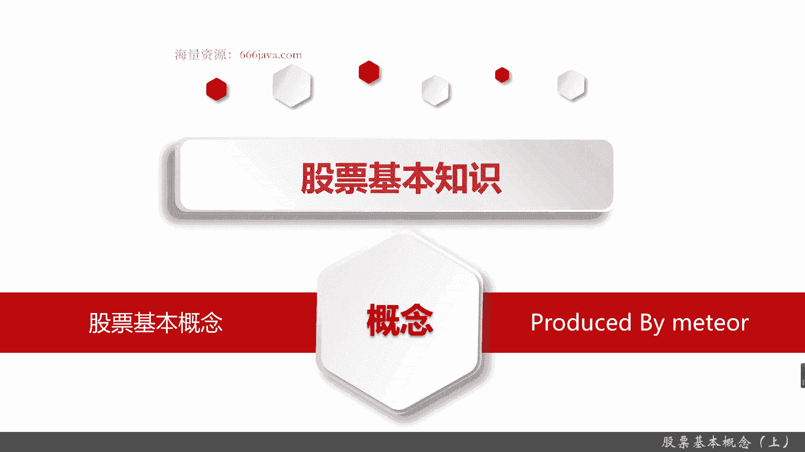
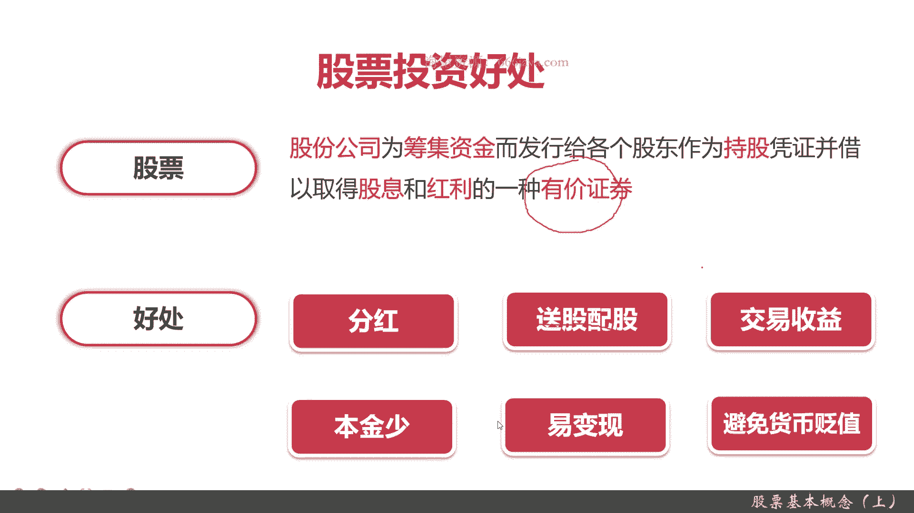
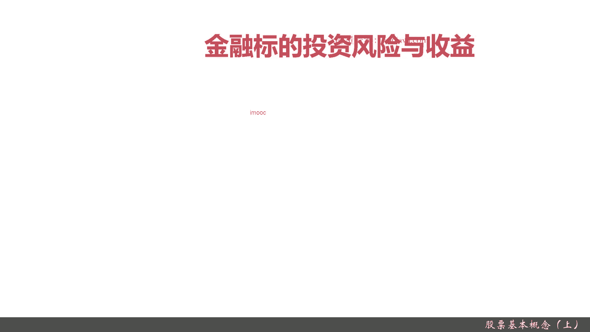
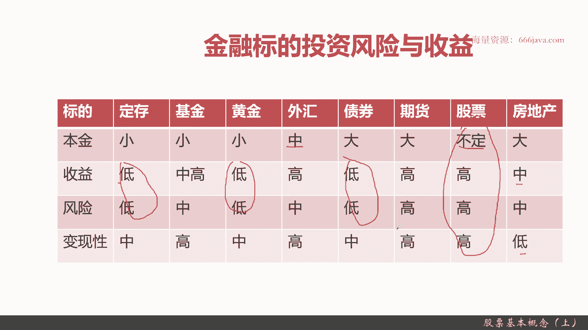
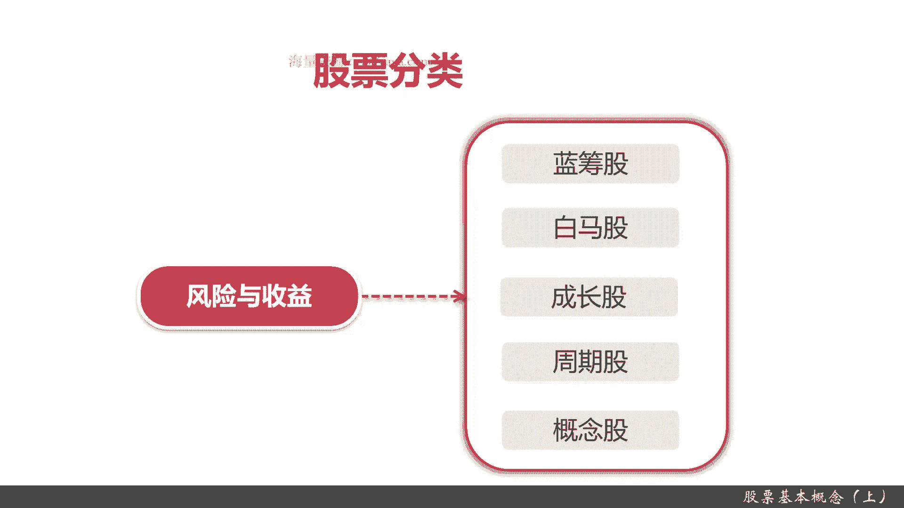
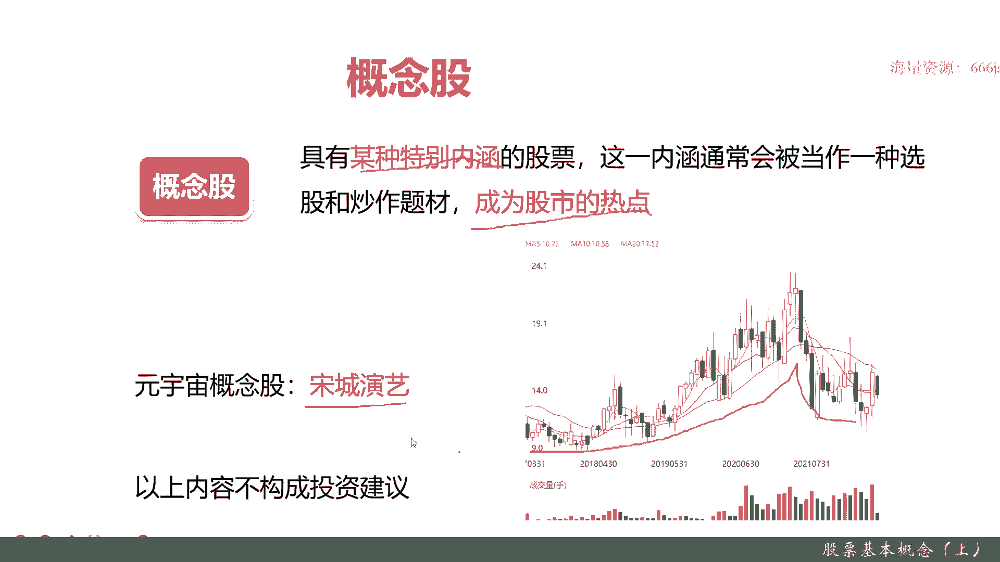

# 基于Python的股票分析与量化交易入门到实践 - P8：3.1 进军量化交易开发第一课-基本的股票交易维度和概念_股票基本概念（上） - 纸飞机旅行家 - BV1rESFYeEuA

大家好，我是米切尔，在前几节呢，我向大家介绍了量化交易的一些分类，有交易产品，盈利模式，还有策略信号这三个分类，那么这一节呢我将开始向大家介绍一下股票，尤其是股票投资相关的一些基本知识，本节我们开个头。

先从股票的基本概念开始向大家介绍起来，本节我们将从以下三个方向，向大家介绍股票的基本概念，首先介绍股票投资会给你带来哪些好处，这个收入好处不仅仅指的是收益，还有它本身和其他的一些投资标签有哪些差距。

接着我们更加深入地介绍一下，常见的八种金融标的，也就是金融投资的产品，比如说股票啊，债券啊，呃期货等等，这些的风险与收益进行一个对比，让大家能更加详细的了解这中间的差异，最后我们介绍一下股票的分类。

主要是从收益和风险这个角度，给大家进行一下分享，好，那么接下来我们将向大家介绍股票投资的好处，在介绍股票投资好处之前呢，我们先向大家再回顾一下股票的定义，股票它是一种有价证券，大家记住了。

它是可以被交易的，它有哪些好处呢，首先他可以得到分红，因为股票可以获得股息和红利，接着呢有一些上市公司它呢会把股票进行拆分，或者呢进行一个增资配股，那可以获得一些送股或配股，比如说你本来有十股。

然后变成11股，12股，这样送股配股，第三种呢可以进行交易，什么事呢，就是说你可以把你的股票按照股价进行交易，你直接可以获利，这些是直接收益方面的，接着呢向大家介绍一下，除了直接可见的经济收益。

还有哪些其他的黑好处，第一个股票它所需要的本金是很少的，相对于房地产或者其他一些投资，还是少了很多的，接着他易变现，你只要在中国的话，A股你只要隔天他就可以变现了，不像其他投资。

最后他还有个非常大的好处，就是避免货币贬值，现在大家都知道通货膨胀，10年前的五块钱和现在五块钱差很别很多，但是股价它会随着你的通货膨胀一直在升值。

这样的话你就可以避免货币贬值了，好，接下来呢我们将向大家介绍一下，常见的金融标的。

他的投资风险与收益主要是这张表，大家可以看到，常见的有定存基金，黄金外汇债券期货股票房地产，这里面可能大家比较熟悉的是定存基金，然后外汇可能听过那个债券可能就比较少了，我那个期货之前有介绍。

但是可能接触的更久更少，股票和房地产大家也可能听过，我们会从四个维度给大家进行分析，本金收益风险与变现性，本金就是他你所投的基本本金，本金要多少，很有意思啊，前三个本金都是小定存基金，黄金都可以想。

同学们可以想想，定存肯定是啊，基金呢最少可以投100，它也很小，黄金呢最小可以买几克，其实也很小，像债券期货和房地产，它都是大，最起码都是几10万上百万起，外汇呢。

它的本金相对来说中一般都是几万几10万，这种企股票它是随着股价的波动和股票的范围，股价范围就比如说有的股票只有几块钱，一两块钱，那他买一手可能只要几百，像茅台就2000多块钱，那买一手价几10万股价。

它的本金是不均负额，波动范围非常大，再下一个是收益，收益呢，定存黄金和债券，它的收益都非常低，债券其实就是国债，它一般来说都是稳定在3%左右，定存吗，你存活期，那你想想看，你5年才4%点几。

一年的话只有2%点几，那他肯定很低啊，黄金也很低，因为黄金非常稳定，黄金只有在战时他才会非常高，基金和房地产的的收益都是中或者中高基金，他也有3%到5%的，当然了，他也有比较高的，有5%到10%的。

甚至还有10%几20%的，它的波动范围相对来说相对较大，但是它总体来说它的收益是在中高的，房地产嘛，除了一线城市，最近呃，前面几年很火，但是最近几年它的相对来说，平均的房地产收益开始是重。

然后外汇大家没想到吧，外汇其实它的收益是非常高的，期货和股票它的收益都非常高，甚至都有你一年涨百分之几百的都有，再接下来是风险，风险定存黄金债券一样是低的，这看到的是什么，其实收益低了，风险也是低。

想一想啊，收益高了，风险也是高，期货股票只有外汇比较特殊，它是收益高，但是它风险是重，因为国家的崩盘其实还是比较难，当然也有啊，但不是所有国家都很容易崩盘，你只要去买稳定的美元啊，人民币啊。

日元这些投资这些标的其实就还好，基金它的收益是重高，但是风险是中基金来说，总体来说它还是比较OK的，因为基金都是一些专业的机构在场，所以他为了控他也要盈利嘛，所以它的整体的风险是比较重要。

然后可变现性其实就是交易了，什么时候才能获利，只有房地产它是低的，因为它最快也得几个月，慢的话可能是半年，一年甚至有数年，而股票期货外汇基金由于是在交易市场，二级市场进行交易，它都是很高的。

一般都是第二个交易日就可以进行交易的，像股票和期货都是当地的，像国内的股票A股它是第二个交易，但是期货它是当天就可以交易的，债券定存和黄金它是中OK好，大家总体有这个认识。

这个其实大家了解一下股票它是在这里啊，他的本金固定收益高。

风险高，可可变现性它也是高的好，我们来进行股票的分类，这股票分类呢主要是通过风险与收益，就是股票其实有多重啊，比如说A股啊，B股啊，美股啊，这有这种，但是我们现在主要是讲的是A股，主要是风险与收益。

因为我们这节课的目的主要是从那个量化投资，也就是股票量化投资的角度来给大家进行介绍，所以我们这一次主要是从风险与收益，给大家介绍一下股票的分类，首先根据风险与收益呢，其实有以下几个，一蓝筹股，二白马股。

三成长股，四周期股，五股概念股，蓝筹股其实就是一些绩优股，然后白马股呢是比咱售股稍微市值小于一些，绩优股，成长股呢就是它的明显好于行业平均的，周期股呢是随着经济波动概念股，就是一些题材板块概念炒作的。

然后下面让我们给大家详细介绍一下，同时给大家举一下例子。

首先是蓝筹股，给大家先看一下蓝筹股的定义啊，蓝筹股必须是长期稳定增长的大公司，以前的它的市值只要在1000亿以上，现在基本上都是在5000亿以上，然后呢基本上都是各个行业的龙头。

一般他都会有稳定的现金分红，比如说中石化，中石油现在的茅台，然后那个宁德时代都是的，然后呢我们来给大家，再看一下举个例子，现在以茅台为例啊，这张图是茅台最近几年的是呃涨势，大家可以看一下。

从17年的时候，他大概是100多，那你看现在他21年在高点的时候，他已经两千四两千五了，这才几年啊，4年四年涨了多少，十倍都不止，他一开始其实他在17年的时候，他还算不上蓝筹股。

但是现在他是妥妥的蓝筹股，那他有什么特点呢，就是，业绩稳定，然后有稳定的分红，当然了，以上内容不构成投资建议，好这是蓝筹股，蓝筹股其实它的收益和风险其实都挺好的，它的收益相对来说稳定偏稍微中。

它的风险呢更低，蓝筹股一般都是这样，下一个白马股，白马股的定义跟蓝筹股略微有些不同，他也是业绩长期不错，但是呢它一般来说，目前我们暂定为市值在3000亿以下，一般集中在这个基础。

白马股一般市值在3000元以下，集中在消费领域，当然你这边你可以跟我说，刚才说的茅台，它也是消费品，但是呢他现在已经市值非常高，它已经超过2万亿了，所以他已经不能再简单的画在白马股，他在17年的时候。

他还可以算是白马股，现在他已经不是了，然后我们再来举个例子，比如说海尔智家，他是家居的top three，你可以看到它最近到现在为止，他是1000多亿到2000亿的市值，那它也是总体来说也是上升了。

当然也有一些波段，在21年的11月份的时候，7月份投社现在逐步一些回调，但是总体来说他还是白马股的代表，以上内容还是不够，咱们投资建议下一个成长股，成长股顾顾名思义就是要成长，他的成长性要比白马股还高。

然后呢他公司要处于高速发展阶段，业绩增长一定要远超整个行业，记住是远超它，不仅仅是它不一定是要龙头企业，但他一定要远超投，一般来说它都是发展具有非常高的发展前景，中小型公司主要是高薪和科技类。

它的市值呢也没有白马股和那个蓝筹股那么高，嗯没有几千亿这个，然后我们再来看看举个例子啊，东方财富，东方财富大家应该是听过那个同学们，如果有买基金的话，应该就会用天天基金网，天天基金网就是东方财富的。

东方财富这几年成长非常快，可以看到你看到它的曲线，同学们可以看到从20年6月份开始，其实就是疫情那个之后啊，大家都喜欢玩基金了，基本上指向应指数极值转，206月份的，这时候才十块钱左右。

现在最高点他已经30了，短短一年内涨了三倍，这就是成长股，当然了，他现在那个因为他已经已经从中小型公司，一下子到了大型公司，它现在那个东方财富已经市值2000亿了，3000亿了。

所以它的增长不会有这么快，这个不要紧，记住这段时间内，他就是成长股的代表，东方财富，一般来说，最近几年这种情况在高新企业技术和科技类，比如说芯片类，比如说像东方这种金融科技对特别的常见。

OK成长股大家记住了，再下一个它是周期股，周期股是什么意思呢，它是随着经济波动，它会有个不周期的情况，然后呢一般它会出现在大宗商品，机械，造船等制造业港口，远处航运业以及汽车方业产汽车。

这里指的汽车是传统汽车，不是新能源汽车，新能源汽车很有可能会是之前的成长股，因为最近最近几年非常非常火，但是传统新车，比如说你的油车种茶呃，那个商用车，公交汽车等等等等，这些属于传统汽车，房地产。

那咱俩就不用说了，房地产前面几年非常风光，最近几年非常不行，恒大暴雷了，今年融创也暴雷了，但是不代表房地产从此这个行业就炸了对吧，其实后面还会要起来的，只不过没有以前那么风光了，那我们可以举个例子。

我们以万科来举个例子，可以看到它经过了几次的行业周期，最早的时候这时候才几块钱，然后17年其实大家可以看，17年是一个行业的经济的高，全国的房价都很高，那个时候涨了很多倍。

所以万科从13年几块钱到将近那个30块钱，这个时候其实涨了将近有十倍，就这短短4年，但是你们可以看到，现在万科基本股价股定在这里，而且还有下降趋势，现在跌去了将近一半，现在的股价大概是在十七十八左右。

这就是一个房地产这个经济和它在经济上行，经济周期上行的时候，他就是这个行，这个周期就非常好，那现在正好属于房地产的下降颓势，OK这个叫周期股，大家记住了，最后一个是概念股，概念股是什么意思呢。

其实就是有一点点嗯热点炒作的意思，它其实跟业绩是没有关系的，什么叫业绩呢，就是你这公司做的盈利不盈利，然后重点记住特别的内涵，就是比如说最近军工很火，这是一个那个最近芯片很火，最近于元宇宙很火对吧。

待会我给大家详细举个例子，他一定要成为股市的热点，这样才会有人跟风去炒作嘛，那我们现在给大家举个例子，元宇宙概念股宋城演绎，他可以看到纵深年金这个股价走势，非常符合原引出这个概念的现在情况。

可以看到在2017年那段时间，股价都是很正常的，基本上都是稳定稳定在这里，但是从2019年中旬开始就不一样了，立刻一根大的上涨的阳线就开始了，为什么呢，从2019年的时候就开始各种逐遍鼓吹，元宇宙。

2021年那个时候有个非常火的，就是FACEBOOK都已经改名叫了元宇宙了对吧，那个时候是最火，但是现在最近一年呢，从2020年7月份一直到现在，它的股价它是在下降，其实元宇宙这个概念。

现在慢慢慢慢的也没有这么火了，而且FACEBOOK这两年起，尤其是从2011年中旬，也就是7月份到现在，它股价也跌了二三十%，其实跟他们的概念，元宇宙这个概念没有被炒起来也是有关系的。

这家松山演员是做什么的，其实大家可能大部分人都没有听过它呢，其实很简单，他就是做VR和AI相关的戏，线上戏剧化的，但是呢这个家公司它实际业绩产出，其实和实际的经营效果其实没有多少关。

相信有多少同学会在VR里面，或者AI里面去看到这个，比如说梦幻迪士尼这种对吧，他主要是靠炒作元宇宙概念，它其实就是一个典型的概念股，OK我们在重申一遍，以上的内容均不构成投资建议，我们只是举个例子。

做个案例分析，那以上就是本节的全部内容。

