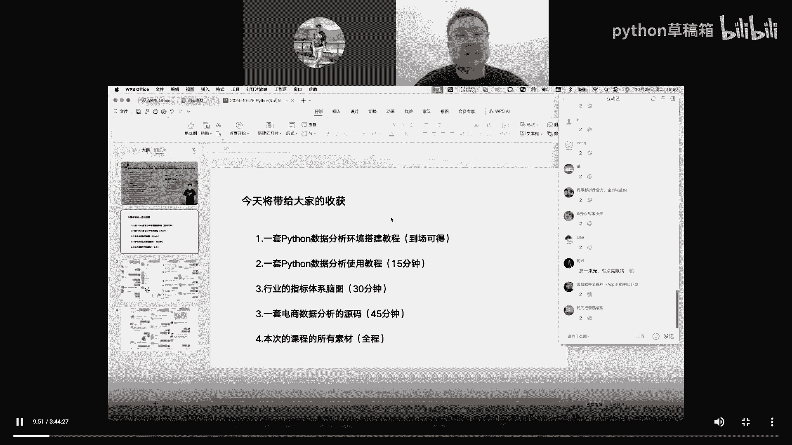
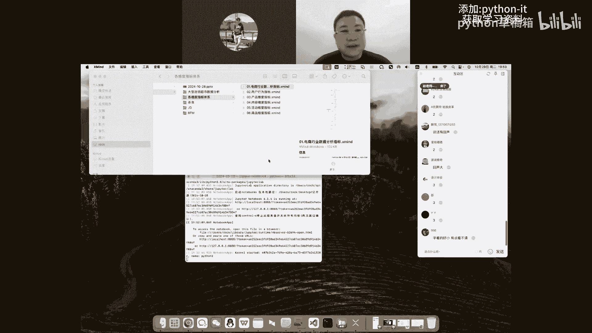
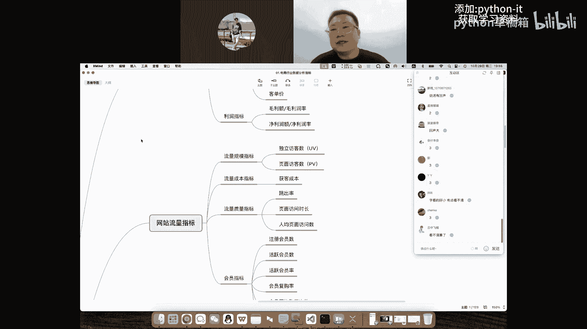
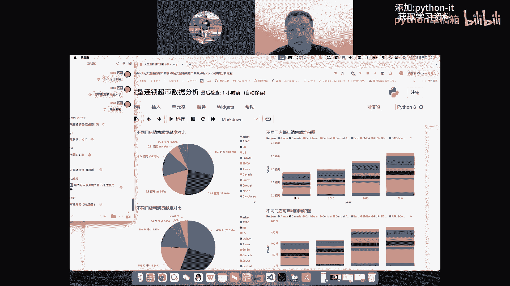
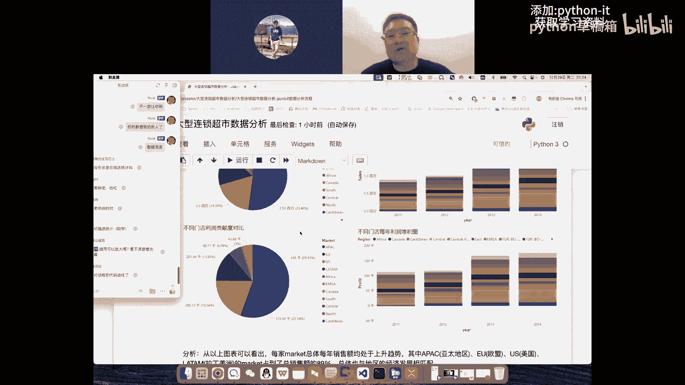
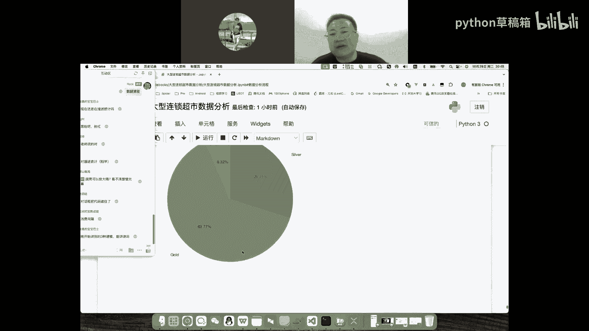

# 基于Python的量化分析实战！ - P2：02 电商数据分析实战 - python草稿箱 - BV11LSiYGEP6

本次课程啊大家会有哪些收获啊，依然呢是五个点啊，第一块呢会给大家一套数据分析的这个环境。

第二块呢是数据分析环境的一个使用教程，第三块呢是行业的这种指标体系啊，脑图啊，第四块呢是一套电商务数据分析的源码啊，最后呢是有一个全部的素材。

OK那接下来呢简单的扫一眼啊，针对于数据分析这块啊，很多人呢其实是比较迷茫的啊，或者说呢连老板也在这数据分析，有的时候我感觉他比较虚，实际上啊这数据分析它不虚，他就是有点宏观。

然后我这块呢其实准备了几个项目，比如说这种呃大型超市的这种数据分析啊，然后还有呢这种在我们一个电商平台中啊，杀虫系列的这种产品的一个数据分析，然后还有京东的这个数据分析啊，京东销售数据的这个数据分析。

还有一个是做用户画像，用户分群的一个分析，但是我们时间比较有限，今天呢只能给大家讲一个咱们优先选择啊，这种嗯商超的啊，或者说它它也是电商啊，就是不管是电商还是本地啊，其实效果是一样的。

因为我们最终面向的是一个数据啊，OK那接下来呢我们来把这个工程打开，那这种工程怎么打开啊，很多同学他拿到了一个这个网上的这个数据，或者说一套源码之后啊，他好像不会用啊，或者说一双击它也打不开啊。

那我们想打开它怎么办呢，实际上它是需要使用专业的数据分析工具的，这个工具呢后续呢在我们的课程中啊，会送给大家，那这块第一块我们要打开一个终端啊，在苹果里面呢它叫终端，在windows里面它叫CMD啊。

然后呢我把这个路径切换一下啊，CD啊到我们的桌面上，那切换到我们今天的这个路径中，然后呢我们去打开我们的这个开发工具啊，也就是我们的数据分析工具。

说话有回声有回声吗，有回声的话扣个三啊，因为我在一个会议室中，会议室可能没有那么大啊，他可能有一点点空旷，OK啊，回声大，我调整一下哈，OK那接下来呢我们就打开我们这个大型商超的，这个数据的这个分析啊。

之后呢打开我们的这个文件，在介绍我们这个商超分析之前呢，还是给大家去说一下数据分析里面啊，那他拿到数据之后到底要做什么对吧。

我这块儿给大家先介绍一下，比较常见的指标体系啊，比如说电商行业有哪些指标啊，然后呢用户有哪些指标啊，然后产品维度的内容维度的，活动维度的商品维度的，大家简单的去展开几个去看一眼哈，字儿好小是吧。

字一会可以给大家放大的啊，不要着急啊，在里面的话字儿会给大家放大的啊。

OK啊，大家简单的去看一下，比如说啊我们电商行业啊，那总体的一个运营指标啊，那大约有这样的几个方向，第一块呢比如说流量指标啊，独立访客数有多少，页面的访客数有多少，人均页面访访问数有多少，那有人说了。

什么是独立访客数，什么是页面访客数啊，简单的给大家说一嘴啊，独立放宽数指的是什么呢，啊就是说我今天打开了淘宝，那我既做一个访客，那我今天打开了十次淘宝，那我是一个还是十个呢对吧，那肯定是按一个去算的。

所以说不管我打开多少次啊，然后呢他只会把我统计为一啊，那今天我们有100个客户访问了1万次啊，有的人访问一次，有的人访问1000次对吧，那最终我们独立访客数是多少呢啊，我们只有100个人啊。

所以说独立访客数就是100，那页面访客数这什么意思，就是我这个页面被访问了多少次，一个页面我访问了1万次对吧，我一个人访问的那页面访客数会记为几呢，不会记为一了，它会记为1万。

就是这个页面我大家非常喜欢对吧，然后还有人均访问，就说白了我们要要讲人均啊对吧，那你就总的数量啊，所以我们这个独立访客的数量是吧，看不清吗，这么大还看不清吗，我再放大一下哈，嗯然后还有呢。

比如说订单产生的这种效率指标，总订单是多少啊，从访问到下单啊，那他有多少啊，它整体的一个转化率是多少，大专的业绩指标啊，比如说我们的交易金额总量是多少，销售金额，取消订单的金额加上拒收订单金额。

加上退货金额啊，一个总量GMV啊，然后呢，那我们销售金额是多少，哎我们卖出去多少货，客单价是多少，我们卖出去的总金额，出去除以我们来了多少人对吧，比如说来了十个人，卖了100万对吧。

那客单价就是一个10万反，这种指标非常非常多啊，在我们不同的领域里面啊，他都会有相应的相应的这个指标啊，每个指标有它自己的一个计算方式，当然这个计算方式不是死的啊，每个公司可能会根据自己的业务去提出。

我的这个指标计算规则啊，那比如说网页访问的时候，哎我们访问一次他就算一个是吧，那APP呢是打开一次算一个，还是说注册一个算一个对吧，它是不一样的。

这些指标不细说了，那我们回到这个主题上，那我们接下来给大家讲的是一个什么，是一个大型连锁超市的这个数据分析啊，也是一个电商数据一块呢，在我们这儿要做的一件事情，就是导入我们数据分析要用的一些资源啊。

这里面给大家去简单的去看一下，比如说啊Python里面的数据分析三剑客啊，Ny pandas matplod lab，再接下来呢基于matt plot lab，进化的一个CBN这个库啊。

然后下面的这个呢，其实和我们的数分布直接挂钩挂钩啊，给大家简单的说一嘴，这个呢就是比如说哎，我们要用到日期时间处理啊，然后呢还有呢就是为了兼容这个中文啊，以防中文乱码的这个库，那数分的一个流程是什么。

高老师，高老师，你的你的那个你的那个呃代码字有点小啊，诶好，我把这里边改一下啊，Ok，数据分析的一个流程大约分为这样几步啊，第一步呢就是我们我们要有一个简单的目标啊，我们要做什么。

啊那有了这个目标之后呢，下一步就是收集数据啊，获取数据，获取完数据之后呢，我们就要去加载数据啊，把数据加载进来，加载进来的，下一步哎我们要去清洗数据啊，也就是预处理这个数据，再接下来呢我们这数据有了诶。

那我们就去建模啊，就计算各种建模分几种，第一个呢关系建模，第二个呢是指标建模啊，还有呢就是算法建模，它实际上是有不同的这种级别啊，以往很多同学一听说这个建模就感觉哇，这个好高端好高大上，我学不会。

实际上不是的啊，我们的数据由多张表的时候，可能我一集连这个事就解决了啊，两张表一集连三张表，一集联，把数据关系就理清了啊，指标建模呢就是我们刚才说的一些指标对吧，比如说用户指标，产品指标啊。

那这会建模的时候就是将这些指标算出来，我这个访问了多少次，购买了多少次啊，然后算法建模呢相对来说啊难一点，但是啊你会的东西越难，他的薪资呢啊也有一个相应的提升啊，就是使用一些数学算法。

去解决我们的这个数据问题啊，然后呢进行一些机器的学习啊，训练预测建模之后呢，下一步就是数据可视化，我们把这些数据啊规律找到了啊，你把它理清了，给它做成图表啊，甚至呢你给它做成大屏看吧。

这个根据自己的一个实际需求啊，就根据你公司的这个需求，说我们这老板可能我给他发个邮件啊，他认为这个格式就很清晰了，那我做个图表就OK了对吧，那我们公司的这些业务人员都想看，想实时的看。

OK那我们可能需要做成一个大屏看板，一个网站一个网页啊，大家都能随时打开去看，或者说我们借助了一个bi工具去查看啊，那他的下再下一步是什么呢，就做个数据报告啊，就说这些图表有了很多人也看不懂。

或者说看完了之后呢，他也发现不了图表中要展示的意义，那我们要写一些数据报告啊，就是根据图表啊进行描述，啊描述这个，图中，显示的问题，那那再下一步呢就是你这报告里面呃，问题有了啊，如果你想升职加薪啊。

你想找的更快对吧，老板不希望看到问题啊，老板希望看到的是问题的解决方案，那你还可以干什么呢，诶给老板一些啊，或者说给这个图表中出现的问题，提供一些，建议啊或者说解决方案，啊老板希望看到的是什么呢。

是你给他三个方案，让他去选，而不是说你抛给他一个问题，那老板说我还得去想办法去解决这个问题，这个呢是大体的一个流程，然后呢，这个项目在企业中它是不断不断的去迭代的啊，那迭代的时候呢。

呃第一版本我们给他一些建议解决方案，他会去实施，实施完了之后，新的数据来了，那我们还要去干什么呢，验证优化啊，那他也叫回雁，你要去验证你先前得到的结论，所以我们根据奇偶数据得到了一些结论是吧。

他到底对不对呢，那不知道啊，OK这个呢就是大约是数据分析的一个流程，那我们今天要做的是什么呢，哎我们就顺着这个流程来说一下我们要做的啊，第一块就是，超市啊数据的分析啊，那之后呢就要收集数据啊，当然了。

这个数据呢我提我直接提供给大家了啊，那在企业中啊，你应该是找A这个项目的负责人啊，或者说这个业务的负责人去获取啊，嗯当然了，这块啊给大家说一下啊，就如果说你你要是做兼职。

或者说你在企业里面接触不到核心的业务，你是拿不到数据的啊，然后呢我们这块的监视直接给大家数据了，之后呢，我们还会给大家去做一些路飞的实时项目啊，相相对来说比较难得啊，然后后面的就是加载清洗建模。

OK那我们往后就看了啊，第一块我们这里面去导入这些包啊，下面的是加载数据，那我们这里面使用的一个呢就是数据分析，三剑客里面的pandas啊，曾经啊为什么给大家强调一下这个pandas斯。

就曾经有一个学员就把这个库玩的特别溜啊，特别明白，就靠着这个库拿了16K啊，那之后呢导入数据，那我们就使用pandas去read这个CSV啊，把这数据导入进来啊，导入进来之后呢，我们去查看一下这个数据。

这数据都有什么对吧啊，head2啊，然后呢这head2呢就是查看数据前两条啊，头两条这个其实啊就是我们用的一些工具啊，或者说我们用的一些编程，它没有多么复杂，它其实还是很人性化的啊。

嗯就和我们正常的逻辑是一样的，之后呢，那我们就可以看到啊，这数据有这么多的列，什么ROID啊，就你这行id order id，订单，Id order date，订单的日期啊，然后shape date。

他购买的是日期，joshaft model啊，什么customer id啊，就是我们的消费者的id啊，customer name啊，消费者的名字，然后还有城市州啊等等等，有这么多这个数据啊。

然后tale的话是什么意思呢，这个也是查看数据，tail是尾巴的意思啊，就是我们查看了前两条数据啊，查看了最后两个数据，那我们这数据规模给大家的并不是特别大啊，5万多条，因为我们现在这个时间比较有限啊。

如果数据量太大的话，它加载会比较慢啊，那接下来呢我们还可以去查看这个数据的一些，相关信息啊，所有的字段都给我们去罗列一下，看一下这个数据里面有没有空的啊，比如在我们这里面可以看一下啊，这些字段里面。

我们所有的数据一共啊51290啊，然后我们往下去看的时候，哎发现中间这个数据啊，它有9994，那也就意味着啊它有4万多条都是空数据啊，那我们以后在处理的时候，就要去考虑一下这个空的数据怎么去处理啊。

是把这个空的数据简单的给它删除了啊，还是说我们想办法去给它填充，另外呢我们还要去研究一下数据，这个空的原因啊，那我们发现只有我们这个post code啊存在缺失啊，然后呢我们可以看看我们所有的列啊。

都是什么啊，都有哪些，然后这里面呢就有我们这个一个文档的对应，他的这个英文名字是什么，数据类型是什么啊，中文是什么编号订单啊，然后呢什么发货日期，发货模式，客户id，客户类型啊，客户所在城市所在州啊。

所在国家邮编所属区域啊，那这些字段我们一般管它叫什么呢啊，就是我们的列啊，就是我们的列所有的这个数据聚在一起啊，聚聚成一个大表格的时候，大家可以看到啊，这个数据呢就像一个表格一样，它有它有这个行有列啊。

如果说我们是连了多张表，就叫宽表，数据好，那也就是说我们知道了这个数据有这么多行，这么多列，那下一步我们就可以干什么呢，啊，我们就可以去把这些字段，整理成我们想要的样子啊，也就是说进行一个数据清洗啊。

OK能听到我说话的小伙伴啊，扣个四，后续呢，大家可以去领取我们数据分析的这套环境，听到我说话的小伙伴扣个四了，OK啊那我们前面呢就把我们的目标啊，以及我们的数据啊加载进来了。

然后呢我们这个数据呢也查看了，那查看之后的下一步呢，就是进行一个数据的清洗啊，数据的清洗，比如说我们这里面做了一个操作啊，将我们这个订单日期啊，给它进行一个时间的一个转换啊，时间格式的一个转换。

然后呢把它这个格式啊，因为有的时候它会有多种格式啊，在我们这里面呢我们直接给他去转换一下是吧，转换完了之后呢去查看一下啊，让他们这个数据格式都一样啊，之后呢也是使用了一个定位啊。

然后随机的去抽了五条出来，然后呢去看一下这个数据啊，都是一样的啊，订单再之后呢，我们可以按照日期进行一个排序啊，比如说这个salt values啊，将我们这个数据按日期进行排序。

因为我们是一个超市的这个销售数据嘛，所以呢我们按日期进行一个排序啊，那也就是说它具备了一个时间轴的特性啊，再接下来呢我们就去提取数据中的啊，年月啊，也就是准备对它对数据进行什么进行分组。

那我们这分组规则其实也有了啊，就是年和月啊，就是你提取的数据，就是你后续要对对这些数据进行的操作啊，说我在统计这个定账单的时候啊，订单的时候啊，默认它是一个一个的订单。

那我想算我这一个月啊一共有多少流水对吧，那你肯定得有月这种字段出来啊，你你想去算年，你得有年这个字段出来啊，你不能拿着这个日期去算对吧，这个日期去算我这一天有多少，它只能算，并且它是直接带的。

那我们如果说把这个年提出来，我就可以算这一年有多少，然后呢我们把这个月提出来，我就可以算这一个月有多少，OK那我们提取到这个年月之后啊，那接下来再再去查看数据，在做数据分析的时候啊，这块儿给大家说一下。

就是数据分析的环节中，我们是要经常性的，去查看数据的啊，不是说一下子就到最终的结果啊，不是一下啊，或者说一步就成了，我们是有一个流程的啊，是有这种流程，是一个完整的流程，嗯它是一步一步的。

所以有一些小伙伴啊再去了解淑芬，或者说做编程的时候啊，有的时候就急于求成，一下子把所有的东西拿过来了，OK那我们这里面呢就是再次去查看数据，查看完数据之后啊，然后这里面呢去计算了一个商品的单价啊。

那就是使用我们数据里面那个销售的这个数据，去除以啊，然后我们的这个总的啊，然后呢就计算一下我们商品的单价啊，那再接下来呢去查看下这个数据，这数据咱们前面已经查看过了啊，就是这个postal code啊。

那post code相对来说啊，它存在的数据比较少，嗯那我们的一个简单的策略呢，就是把这个空数据给它删除掉啊，在这呢还要查看我们的这个异常数据啊，异常数据这里面使用了一个什么describe啊。

就是描述性统计啊，然后呢去查看一下我们这个数据，查看数据的描述性统计，然后呢可以去看到这些字段啊，这些字段一定注意它们是什么呢，是数字类型的才能去做计算啊，比如说count它有多少个啊。

它的平均值是多少，它的标准差是多少啊，它最小是多少，最大是多少，然后中间有下分位啊，中分位上分位这些数据啊，你都可以去看一看这个数据有没有对吧，然后再之后呢，这里面呢还有一种更多的去查看这个。

数据性统计的啊，就object对象上面，因为咱们刚才说了，默认的这种描述性统计，它针对的都是这种数字啊，那如果说我要把其他的字段也看一下，不管什么日期啊，字符串啊都去看，但是它的字段就会少了啊。

啊因为比如说你拿到一个日期，或者说你拿到一个字符串啊，他是没有办法去进行平均数啊，最大值最小值的，所以呢这里面如果我们包含了对象之后，他就变了啊，他只能给你去计数啊，然后呢他这个去虫统计有多少个。

然后呢这个最大的这个有多少啊，频率有多少，那下面呢我们就去构建一个分析模型啊，构建一个分析模型，从整体的一个运营状况去分析啊，运用多维度的拆解方法，比如说从整体企业的销售情况，销售额，利润额。

利润率增长率去查看，那从不同的门店去查看，然后呢，根据我们促销的这个活动情况去进行分析啊，也也就是说我们从很多的维度啊，或者说多维度去分析我们这个数据，去查看我们这个数据。

综合性的去了解这个企业的运营状况啊，等一个，那比如说我们进行一个整体的一个浏览啊，将这个数据进行了一个可视化啊，将这个订单的日期时间啊，销售数据啊，然后以及我们的这个呃增益啊，给它进行一个数据的提取啊。

也就在我们的数据里面，我们选了这三列出来啊，选了这三列出来之后呢，从我们这个里面拿出啊这个额订单的日期啊，进行一个索引的设置啊，之后呢给它绘制出一个图来啊，那我们的一个销售啊以及一个收益啊。

这里面拿着横轴日期啊去查看，那我们就可以看到啊，这个里面是我们的这个销售数据啊，然后里面呢有销售量以及我们的一个收益，不是爬虫吗，咱们今天讲的是数分哈，然后呢做了一个粗略的查看之后啊。

那我们下面的去计算一下这些年啊，它的一个销售额，利润额，然后销量利润率，那销售额呢咱们应该能知道啊，就说我这些年一共卖了多少啊，比如说卖了100万的这个销售额，那利润率利润额是多少呢。

比如说我这个利润呢有10万对吧，我销售额100万，利润呢有10万啊，那在这呢销量是我卖了多少，才达到了这么多的一个销售额对吧，然后还有利润率，就我的一个利润占我总体的这个量的多少啊。

那这里面就用到了我们前面给它分出来的一叶，这个字段，也就是年这个字段啊，那我们要去获取它的一个销售额啊，年的根据我们的年进行一个分组，然后呢去进行求和，然后将这些数据算出来。

然后还有呢就是我们的一个利润率，利润率呢就要用我们的收益去除，以我们的这个销售这额，然后呢去啊啊，不用那么细哈，那也行啊，那我给大家把的稍微啊放松一些啊，给他说白了就是我们要去计算啊销售额利润额。

销量利润率啊，然后呢我们就可以得到啊这四个年份的字段啊，这四个年份，那我们要获得的这些啊，数据也就是每一年的一个销售额啊，然后呢呃销售数量以及我们的一个利润啊，利润率，然后呢通过我们这个计算啊。

现在还没有图表啊，我们可以看到这个超市，在2011~2014年，每年它成一个逐步上升啊，然后呢销售额利润额，销售量都在上升，还有同学说了啊，给这个，GPT啊，呃大家要注意啊。

咱很多同学知道这个ChatGPT这种东西啊，chat j p t它不能结合一个实际的业务，他用chat gp去做数分的时候，它给你的只是一部分通用的用法啊，你结合自己的企业业务来说的是不太一样的哈。

另外呢ChatGPT它给你的相对来说啊，就是通用方案啊，它不能结合你企业的这个实际情况，然后再之后呢那我们去算销售额利润率啊，然后销量它的一个同比增长率啊，然后呢。

我们这里面可以去计算它的一个同比增长率，然后呢进行一个绘图，然后呢就将我们的这个同比增长率啊，每一年给他算出来了，但是第一年2011年是没有的啊，还有呢我们可以去查看一下啊。

就2011年他是没有这个同比增长率的啊，因为他在计算的时候，他需要用2010年的数据啊，他没有这个数据啊，俺同学说了，根据需求使用GBT会好很多啊，JVT也可以解决我们工作中啊，六七十%的问题啊。

但是大家还要知道一个问题啊，就是在大公司里面啊，就是以后你接触的多了，你会你会知道啊，这是不一定让你用啊，一个主要的原因是啥呢，就是你用ChatGPT的时候，你的数据就给别人了。

给别人就会涉及到数据泄密的，那你这会儿就就容易出问题了，并且我们在给他数据的时候，你怎么给他几万条，几10万条啊，如果公司大一点，他可能有几百万几个亿啊，所以这个东西要注意一下哈。

你可以从他那去借鉴一些思路啊，但不能完全依赖于他，O，然后呢在我们这里面，从增长率你就可以去看到销售额，利润额，销售量啊，然后利润率从一年到13年均在稳步的提升啊，其中呢在2013年的销售额达到了啊。

这个27%啊，从业绩增长率来看，对比这个沃尔玛公开的这个数据啊，它的一个均增长为45%，那证明我们是非常有竞争力的啊，那这里面呢就有一个数据比较，第一个呢就是我们在算啊，每一年我的一个增长啊。

每年我的一个增长，然后再之后呢，那我们要在比较的时候呢，它会有一个诶和行业去比啊，或者说和行业龙头去比啊，这里面的就有就没有对比，啊就没有增长，对吧，那这里面对比呢就是和谁比啊，比如说和自己比啊。

那自己比呢就有同比和环比啊，然后呢还有和别人比，和别人比呢，说白了就是竞品，哎我比他强多少，当然了，一般来说我们不会上来就和别人比较，我们会和行业均值比，啊你在行业里面对吧，到做的到底好不好对吧。

那你就和行业均值去比就可以了，记得这个雷军说过一句话啊，这小米的这个硬件，它的这个硬件收益永远控制在5%以内啊，为啥呢，因为海尔做的最好了对吧，海尔在硬件这个行业里面做的是最好。

他的一个硬件的收益率啊都在5%以内啊，那雷军它本身小米又以性价比啊为生，然后呢他这个硬件就是即使他想赚这份钱啊，他也做不到5%以上啊，然后再之后呢这个还看不到吗，我再放大一点哈。

第二个发现14年的销售额利润额，销售量利润率增长较13年啊均有所回落啊，其中利润增长这放缓啊，这里面有啊说我们一八，然后到这个二七啊，这27%，然后再之后呢这个到了26%啊，他又有所放缓。

那也不不可能一直登的特别快啊，那再之后呢我们可以去计算什么，每年每月的销售额，利润额，销量增长率啊，也就是我们去算一些指标，这里面呢使用了一个东西叫做数据透视表啊，如果说我们接触过excel的同学啊。

应该会知道啊，没有接触过的话呢，其实我给大家说的直白一点，它和我们前面的分组聚合是差不多的啊，就根据你的字段进行一个分组计算啊，然后这里面你去选上你的字段就OK了。

比如说我们这里面使用月和这个什么叶儿啊，月呢就作为我们的这个行索引啊，然后年的话呢作为这个列索引啊，它就可以给我们算出啊，哪一年哪一个月哎我们这个收益指标是多少啊，我们的销售指标是多少。

我们的销量指标是多少啊，我们的收益率是多少，再之后呢我们每个月的销售额，销量啊，利润，然后呢我们可以把它可视化出来，前面做的不都是数据表吗，数据表可能并不够直观哈，那我们给它做成啊图表啊。

咱们就可以去看到每一年的数据啊，这里面有页啊，然后下面有月份啊，你可以看到2011年是哪一个状态，2012年粉色的一个状态，2013年啊，这个里面这个橙色的再重呢，这个二硫14年啊。

就每一年的一个增长状况，照呢是画了几个图啊，从以上这表格和图表中，我们大致的可以看出啊，这个超市的销售季节性还是挺明显的，总体是上半年是淡季，下半年是旺季啊，这是一个整体的一个状况啊。

同时销售额和销量比上一年啊均有提高，我们可以看到一个整体的状况啊，每年确实是在增长的啊，然后之后啊对于这个旺季的月份，运营推广策略要继续推迟啊，还可以加大投入，提高整体的一个销售额，对于淡季的月份。

可以结合产品特点进行新产品的拓展，举办一些促销活动去吸引客户啊，那再之后呢，我们还可以去计算每月的同比增长率啊，之后呢进行一个绘图啊，前面我们看了这个年啊，再之后又看了一个月份啊，然后呢，到我们这里面。

可以去计算每个月的同比增长率啊，把数据集连起来，然后呢进行一个后边展示啊，也就是我们每一年啊每个月份大约有多少，把这数据给我们描述出来啊，哪些增长的比较多啊，这里面是颜色越深的啊，它这个增长越明显啊。

你可以找到这个月，找到这个月的数据之后啊，那你后续可以干什么呢，可以去查看这个月的数据有哪些特点，有哪些特征，然后我们把这个数据啊绘制出来，哪一年的啊，然后哪一个月份的，然后呢从表格显示啊。

几乎所有的月份同比前一年都是增长的，只有2012年的12月份呈现了负增长，这个需要结合当时的运营情况，去进行具体的分析了，其次啊结合年度的销售额增长看，每年月度销售增长，超过年度增长率的这个月份啊。

基本没什么特别的规律啊，第三同比增长率来看也没有太大的规律啊，这个呢需要去拆分业绩指标，去增加了一定的难度啊，也就是说有的时候你定位不到原因，那你要下一步的一个操作肯定难度增加了，并没有。

因为他并不是直接看到的啊，就市场布局，那我们可以去看一看，不同门店的这个销售情况啊，那也就是说我们根据门店进行了一个汇总啊，那得到了这些图表啊，比如说啊这个APAC这个店啊，它的一个总量占到3。

5910010000啊，28。67%啊，再之后呢EU这个门店啊，他的这个网店啊占到了2。9810010000，也就23。46%，你可以去看到各个店的一个贡献，哪个店的一个贡献更大啊。

然后我们可以看这个不同的门店，每年的一个销售堆积图啊，可以看一下我2011年啊，我的这个总量由哪些门店去构成，这里面的越宽呢，代表我这门店的一个贡献越大。

然后还有不同门店，他的利润贡献度，有些门店的销售额可能很高，但是它的成本也有可能比较高啊，比如说你一个店啊在北京啊有1000万的流水啊，但是呢这个北京消耗了800万，你最终赚了200万。

另外一个店子在天津有800万的流水啊，但是呢它只消耗了300万，他的利润是500万，这个也是存在的啊。

所以呢说你不能只看它的一个流水啊，也不能只看他的一个销售额啊，OK那再之后呢不同门店啊每年的这种堆积图啊，那我们从这个表里面就可以看到，每家超市每年的这个销售额啊整体上升啊，可以看得到啊，然后呢。

各个区域啊占到了销售额的一个，这几个大区域啊，啊占到了我们这销售额的啊89%啊，总体呢与地区的这种经济发展相匹配啊，那后面呢我们还可以从区域的维度去查看啊，比如说我们这里面根据这个客户。

ID以及国家的这个关系表去提取数据啊，然后呢根据客户进行分组，去计算销售的这个总额，然后将数据合并啊，然后呢去增加一个平均的这个金额的，这个字段啊，然后呢去存放该国家客户的人均消费金额。

也就是说我们会去计算这些指标啊，计算完这些指标呢，我们对这个数据啊，消费的总额进行一个降序排列，首先呢拿到的是图表啊，是一个图啊，也就是一个表格啊，后续呢我们再根据这个销售的情况啊。

就是他们对企业的这个贡献去给他做成图表，那我们就可以看到啊，2011年啊，这些有折扣的和没折扣的，大约的一个贡献度是多少，我们折扣折出去多少，那基于前面的这些数据内容。

我们预计2014年的这个销售额增长率，及利润增长率啊，它都会有所回降，有所下降啊，然后猜测和促销有很大的关系，那我们提出了一些假设，那之后呢要进行一个什么验证啊，那就根据这个折扣啊去进行一个验证啊。

做两个数据透视表，然后呢我们就可以得到这样的一个表格啊，这里面就有这个销售数据啊，收益啊，然后折扣和没有销售这个折扣啊，然后收益折扣啊，然后呢我们可以看到啊，打折活动确实能够有效带动整体的销售额啊。

从以上的图里面也可以看到14年啊，他的这个利润率确实比前几年高，也验证了前面提出的这个14年利润率增长的，这个原因太小啊，从右图也可以看到，这个图里面也可以看到14年12月份啊，他可能是冲业绩啊。

打折的折扣啊非常大，看前面这两年123啊，就相对来说就比较平缓，然后再之后呢我们在分析的时候，还可以从商品的这个结构去分析啊，那我们从不同的产品进行一个分析啊，那这里面呢我们就根据这个商品的品类啊。

以及它的子品类啊，进行一个分组啊，分组之后呢去求和，求完和之后啊，进行一个画图，说白了，那我们这里面用的最多的是什么呢，就是分组聚合啊，聚合完了之后去进行计算，你这一组数我们怎么去算啊。

然后呢拿到这个数据，可能啊这个数据并不能直接的使用，那我们需要进行一些简单的转换，然后呢这次呢给他画成这个柱状图啊，我们销售多少，收益多少，这就都有了，OK啊那这里面咱们先简单的看一下。

不不不去看下面这些内容了，看这啊就直接去看看那个图哈，那我们会发现这个这个绿色的啊，有深绿啊，它是一个销售，下面这个呢是一个收益啊，我们可以看到啊，看前面两个数据就很明显啊，第一个收益率最高。

但是这个销售最高，但是他的收益啊并不一定是最高的啊，可能花费的也比较多啊，啊甚至还有这种啊销售了很多最终赔钱的对吧，那这个数据呢，比如说哎在我们这个区域的这个数据。

那你要重点分析一下他到底在哪赔钱了对吧，那再之呢从商品的这个维度啊，然后呢我们进行一个分析啊，根据观察去发现相同商品在不同的订单中，单价不同啊，可知商品这个单价发生了波动啊。

可以去查看一下这里面的这个数据啊，所以接下来呢我们这个商品啊，因为比如说啊它刚上架的时候是1万块钱啊，过了一段呢他成了8000对吧，再过了一段呢调整成9000了，所以这里面呢我们又新增了字段。

就是我去计算这个商品的一个平均价钱啊，哎就是他这个总销售额，除以我们这个商品的销售数量啊，然后呢给他去进行一个新的指标的计算啊，指标的一个添加啊，那在我们这里面根据商品的id进行一个分组。

然后拿到里面这个销售数据，销售量进行一个求和之后呢，用销售总额去除以我们的这个销售数量，那得到了这个新的数据啊，新的这个数据这里面多了一个平均价格，然后呢，我们可以去查看这个平均价格的这个分布啊。

那可以看到啊，价格的一个分布一块的是多少啊，也就是说低价的是多少，然后这个下面是这个平均价格啊，然后上上面的是一个它出现的这个次数啊，那我们会发现这个低价的还是最多的啊，这个价越高的啊越少啊。

如果要说出现了这种的，大家可以看我这光标是这样的一个，如果是一个这种波峰样的，那也就是说大家可能喜欢这个中等价位的，并不一定都喜欢低价位的，在我们这里面啊，还是低价位的是最多的啊，然后这里面他就发现了。

商品价基本全部集中在250美元以内啊，出现了极少的这种天价商品预测的这种影响，然后呢这种价格特别高的，我们可以给它洗掉啊，把这种价格特别高的都洗掉之后啊，价格特别高的这个区域洗掉之后。

那我们这个数据看上去就更直观了啊，这会呢我们就发现，它有点这个波峰的这种形状了，也就是说并不一定喜欢的都是最便宜的啊，它肯定有一个上升区间，比如说在这儿啊，到我们这个啊十几块钱对吧，嗯然后后面再下降啊。

再提升，那我们会发现这个峰值是十美元左右啊，单价200元以上的这种商品就很少见了啊，那也就是说我们这个店铺里面，它主要的定位呢是啊小商品市场十美元左右的，之后呢可以把它绘制成这种三点图啊。

价格分布总体的是一个散点图是什么样的啊，但接下来呢我们均价的这个散点图啊，是什么样的，然后呢我们还可以进行什么呢，啊客户的这种行为数据在我们这数据里面，我们从订单的维度啊，单比价和连带率是多少啊。

订单金额与订单的这个商品数啊关系如何啊，那我们去添加一列去获取这个天啊，前面我们获取了年和月啊，这次呢我们去添添加了一个这个天啊，然后呢，我们就根据这个订单编号进行一个分组啊。

然后呢把我们的这个商品数量和销售额，进行一个求和，然后呢第一块拿到了一个基本的数据啊，然后呢查看它，查看一下它的描述性统计，之后呢依然使用直方图给我们显示出来，得到这样子的啊。

那我们知道了这个什么部分订单金额，交易过大啊，影响图表的这个可读性，就这边它都是空的，那这会儿呢也是进行一个筛选去查看一下，那么发现它呈单峰长尾这种状态啊，金额更为集中啊，峰值在20~30美元之间。

然后呢我们对这个订单内的这个商品数量啊，进行商品数啊，进行一个柱形图的绘制啊，前面都是连着的啊，连着的这个叫做直方图啊，那我们这种分布开的呢叫做柱状图，可以去查看一下，那再之后呢如果这个还是比较多啊。

我们再筛一下啊，让我们这数据看的更直观一些，也就是说我们优先照顾这个大数，那我们可以看到啊，在我们这个区间，它的数据更为明显，数据特征更为突出啊，然后再之后呢，我为了进一步的去探究这个交易金额。

与订单内商品件数的关系啊，去绘制一个散点图，和前面那个图的效果是差不多的，OK啊，那下一个呢，我们去看一下这个客户的生命周期啊，这个数据集啊不是最新的啊，因为相对来说比较新的数据。

这个公司里很难流出来啊，能流出来的基本都是几年后了啊，那之后呢我们去看一下啊，比如说统计下客户的初次消费时间，也就是说根据客户的ID进行分组，求它的最小值，然后客户的末次消费时间。

也就是他最后一次的这消费时间啊，最大值，然后呢可以去查看一下，这个数据大概是什么样子的，然后呢你就可以使用什么呢，最后一次的消费时间减去啊，你这个最初的消费时间去查看一下。

那我们在这个里面在这个平台上消费，已经消费了多久了对吧，如果为零，那表示他一天都没有消费过啊，这个越大，那就代表啊我在这个平台里面啊，存活的时间越长，那大家用京东淘宝应该都知道，它里面会告诉你诶。

你在这个平台上啊用了几年了，你的首次消费是什么时候对吧，之后呢这个字段呢我们就给它分为啊lifetime，然后呢拿它也去做一个直方图，那我们会发现，我们这个平台的这个生命周期还是很长的对吧。

用户在我们这啊，他1400多天的啊，1400的啊非常多啊，1200~1400的这这块啊都很多，也就是说，我们平台对用户的粘性是非常非常高的啊，前面的只有一小部分用户的生命周期比较短，然后呢有趣的是。

700天左右出现了一个小高峰啊，然后呢，那我们不妨将生命周期小于两年的，这个客户排除掉，再去查看，然后这个数据呢就有些惊人啊，生命周期存在周期性低，需要针对性的调查，当达到1250天之后。

则是数量可观的这种死忠用户啊，啊拥有极高的用户粘性，考虑到这些客户中，有许多从未进行完整的这个生命周期啊，实际的客户平均生命周期更长，因为我们这数据是截取了4年的数据嘛。

然后客户呢我们还可以去查看他的留存情况，那我们给大家说的这些什么留存呐，用户生命周期啊，这些实际上是什么呢，都是用户的这个消费指标啊，在我们平台里面，用户的这些指标，之后呢这个数据图表我看了啊。

然后呢我们这里面又新增了一个字段叫dd f，就这个日期差啊，用于存放本次消费与首次消费的时间差，又新增了一个字段好，然后这里面呢我们将三天七天，30天，60天，90天，180天啊，一年，然后一年半两年。

两年半3年这些啊去作为一个区间的端点啊，也就是说我们对数据又划分区间了啊，然后呢对这个数据使用这个数据啊，进行一个分块啊，分开之后有一些可能没有数据啊，这个不要慌啊，都正常。

然后呢我们拿到这个数据之后啊，给它进行一个呃分组啊，之后呢给他来一个可视化，那我们会发现看0~3的，3~7的啊，就是给他直接分段啊，那我们会发现啊，在我们这儿啊，基本上在一年半到两年这块是一个峰值。

也就是说我们使用这个平台，如果超过两年，它后续的一个粘性会更大啊，如果到两年这块是一个峰值，就是也就是说用到两年之后啊，他可能对这平台已经非常熟，甚至有些厌倦了啊，他有可能会切换到其他平台啊。

那也就是说我们要重点关注，使用我们平台两年的这个用户啊，OK那再接下来我们去看一下客户的购买周期啊，那这个也是客户购买的一个指标啊，那他的思路呢是其相邻两次消费日期相减啊。

然后呢我们通过data df啊去进行一个计算啊，然后这里面呢就说了我的一些规则啊，我们要去去除客户编号和消费日期，相同的重复数据啊，也就是说对数据进行一个简单的二次的清洗啊。

然后呢这里面写了一个K不等于first，就是保留我们的这个呃首条数据，正的定义一个函数啊，去计算我们这个数据里面那个消费的时间差，然后呢根据客户的id进行分组，去执行我们前前面的这个函数。

然后呢他就给我们计算出时间差了，然后呢，把这个数据啊集连到我们先前的这个数据里面，之后呢我们把它画成一个柱状图，可以得到啊这样的一个呃直方图啊，但是后面的那个数据相对来说啊，比较少对它进行一个优化。

然后呢我们发现这是一个什么，前面几个比较突出啊，之后呢是一个右峰分布啊，峰值呢在我们这15~70天啊，说明大部分用户啊购买的这个区间集中于此啊，然后再之后每隔30天，对用户的优惠活动信息推送。

比较符合老部分的老客户的一个购买周期啊，然后再之后呢客户的一个价值分析，从客户的维度啊，我们去看看都有哪些字段，有了这些字段之后呢，我们还是根据啊客户的这个id啊，也就是客户的唯一标识啊。

进行一个分组啊，之后呢这里面还有一个订单的路段，进行一个分组啊，得到这个数据之后呢，查看一下描述性统计啊，然后可以看到啊，我们的这一个它的一个消线图啊，也就是最小最大啊，上分位，下分位以及一个50%。

这边一样，平均销售的啊，然后这一个图里面给大家说一下，这几个圈圈代表什么意思啊，这几个圈圈啊就代表我们的一个异常值啊，就是你已经超过我这个上限了，我们希望的是啊这个区域越集中越好。

然后这个线的这个差别啊，这个拉空的这个线也就是从75%，到我们这个百分之百啊，这个区间小一点，然后超过我们这个百分百，这个就已经是一个异常值了，可能就类似于我们去计算这个平均财产的时候，是吧啊。

我们这些人在计算的时候把马云算进来了对吧，那马云在我们这个里面，我们认为他就是一个异常值，然后之后呢，我们去进一步的去观察客户的这个，消费金额的一个分布啊，那一个直方图下来。

那我们发现它最开始的时候有一个凸起啊，然后呢在我们这5000多有一个下降啊，5000多之后在我们平台的一个忠诚度提高之后，诶，那1万多到1万5，他又又迎来了一波高峰。

之后呢我们还可以截取这一部分的这个数据啊，或者这一部分的数据啊，然后呢进一步的去查看，OK之后呢我们再将数据的这个散点图啊，去查看一下啊，我们发现客户的一个群体整体健康啊，整体情况还是比较健康的啊。

它没有那种大起大落的啊，如果全都是特别高和特别低的，那证明我们的客户群啊，是有一定的这个问题的哈，就忠忠诚度过高的啊，或者忠诚度过低的之后呢，我们还可以去看客户的一个分类，及同比的一个变化。

客户有哪些分类啊，大约都有哪样呢，然后每一年的一个变化大概是多少啊，然后新客户数和老客户数，这个呢也是两个不同的这个指标啊，只要在这里面消费过，就是老客户啊，没有时间限制，这个呢是我们设定的一个规则。

大家都可以算出来每一年每个月份啊，新来了多少，哪些是首次消费的，然后呢还可以换一种计算方式啊，哎每一年每个月啊是什么样的，但是这个呢是不同的指标定义啊，就是比如说按照方式二计算。

新客户明显比方式一计算高出不少对吧，11年的这个数据它没有对比，就没有参考性了是吧，再之后呢针对于我们用户啊，那现在呢又给大家说了一个啊RFM指标，RFM是什么，实际上呢它是三个字母啊。

第一个这个R啊是REACY啊，最近一次消费啊，F呢是什么，free cony是一个频率，然后呢这个M呢是MONARY啊，一个消费的总金额，也就是用这三个指标啊，去对用户进行一个分群啊。

也就是计算我们的RFM，我们在计算指标的时候，有一些指标是我们自己定义的，然后有一些是行业的，然后还有一些呢是结合业务啊，结合实际情况我们去选取的，那之后呢就可以去看一下，哪些用户有这种消费行为啊。

然后频率啊F也就是free free控啊，我们这个频率啊他买了多少次，一年买多少次，或者说总共买多少次啊，你根据自己的一个情况去算就OK了，根据自己的一个平台的啊，一个数据的情况去算有多少次。

这里面算的是一年的啊，然后呢将这个数据调整一下，优化一下啊，1~3次有多少啊，5~7次的，3~5次的，还有呢这MONTREAL啊，就是在我们这平台花花钱多的啊，花钱多少去计算的，查看一下统计之后呢。

大约的一个呃入门金额啊，以及一个消费最多的啊，1万到1万5之间的是吧，然后使用这三个指标呢，可以去建立一个RFM模型啊，那根据我们的字段分组，然后呢去计算这些字段，那我们的RFM指标就有了。

那接下来的这三个指标呢，我们就可以给他建立一个用户的评分机制啊，评分这里面是用的1~4啊，然后呢分值越大呃，评分越小啊，因为呢商家都喜欢这种活跃的用户，这个这个是近期的嘛，其他的都是这个金额越大越好啊。

然后呢这个频率越高越好，这个呃最近一次呢应该是越小越好啊，就这两个是越大越好，这个是越小越好，然后给他们进行一个评分分组啊，之后呢去平分，之后啊就可以去算出啊，我们这RFM的这个值啊。

根据我们IFM给它分成了十个等级，也就我们的用户那个等级是怎么划分的对吧，你用的那个支付宝，它的蚂蚁评分是怎么来的对吧，你是那个V几V几是怎么算的，其实就这就是这样出来的啊。

你在京东上面有京东的那个什么小白小白分啊，信用分也是这么来的，那根据这几个字段啊，就得到了几个分段值啊，你这个是金牌会员，银牌会员，铜木牌也会员啊，那绘制一些柱状图，那再下一步呢就是哎更深层次的。

我们可以使用机器学习的算法，比如k means去挖掘有价值的用户啊，然后呢对数据进行一些转换啊，然后标签与直方图绘制在一起，那之后哎我们可以看到这个密度的对吧，然后RFMR的F的M的啊，它们分别在哪。

然后对数据进行一些标准化处理，它转化过去，然后呢我们对它进行一个数据的一个聚类啊，分组啊，到底多少个啊，那我们也不知道到底多少个给他分多少组，2~10啊，让他给我们去测一下哪一个效果最好，我们去选。

可以看到啊，两组三组四组五组啊，他们得到了不同的这个分值，之后呢我们对它进行一个评分啊，我们这个分组的这个效果好不好啊，三种建模能讲下吗，今天时间略微紧张哈，有有时间可以讲一讲的哈。

就是关系建模这个指标建模，然后还有我们的这个嗯算法建模，本次这个案例里面实际上指标建模居多，最后这块给大家点了一点点，那个算法建模我们使用的一个k means，然后之后呢这三类啊就得出来了。

大约得有多少聚类为零的价值，用户聚类为一的啊，聚列为二了，就分了三类啊，三类的效果是最好的啊，然后呢我们还可以看这个这三类客户啊，就我们分的这三组客户对销售额的一个贡献啊，大约能贡献多少。

第一类的有多少，第二类有多少，我们发现他们整体来说还是比较均衡的哈，OK啊，那今天要给大家讲的技术部分。

