# 基于alphalens的因子收益分析解读-量化金融与机器学习2024 - P1 - 背包2004 - BV1jJ4m1V7Ln

好吧，我们来具体讲讲这个东西啊，到底是怎么回事，到底是按照什么样的逻辑来的，所谓的因子分析啊，啊呃首先大家要明确一个思路，就是说他要判断这个因子好与坏的核心，显然是要看这个因子能不能带来收益。

所以说所有的因子分析，包括前面之前的那个资本资产也一样，它最大的核心点还是要落在收益率上面，肯定是要落在收益率上面的啊，这个是肯定的，而且呢我们需要回顾一下我们的前置知识，什么意思呢。

就是我们上节课学的所谓的三因子模型里面。

他对之前的那个因子的处理手段啊，这个手段呢它本质上是一脉相承的啊。

一脉相承的啊，什么手段呢，就是在构建这个因子和这个因子的时候。

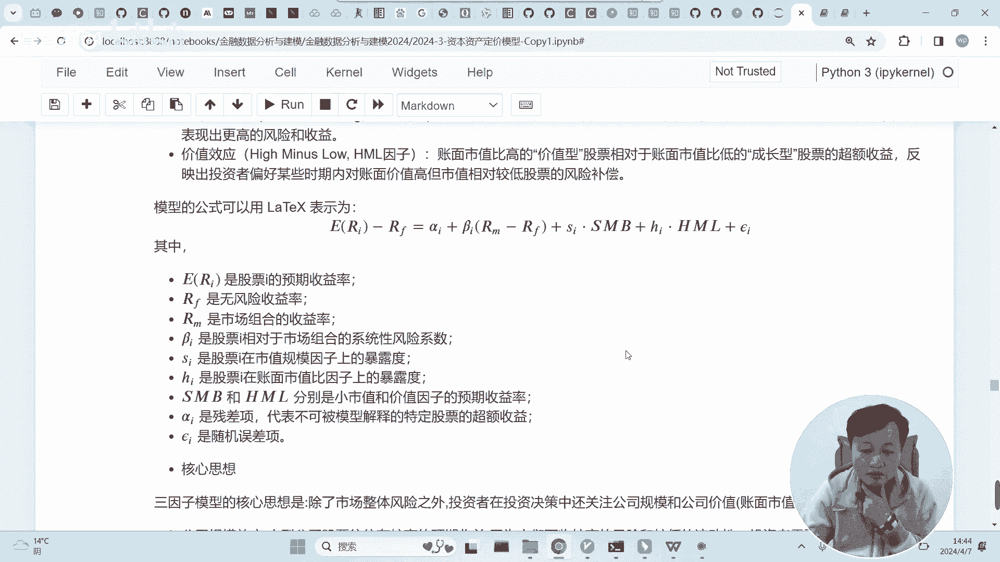

他用了一个很很有意思的手段，什么手段呢，就是你看他这里是四次因子。

然后他干嘛呢，他是把所有的股票根据市值从小到大排序。

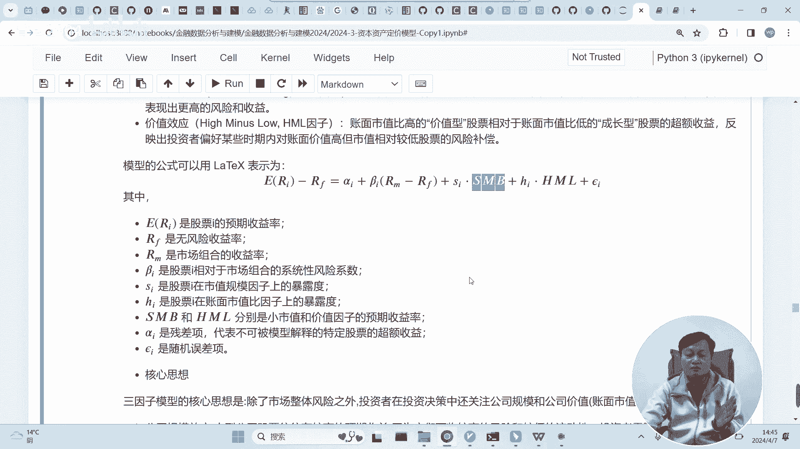

排序之后呢，分成了两组，好像是还是三组，我忘记了，分成了几组，然后看不同组的股票收益之差，以以此来显示这个这个因子的风险一筹。

这是三因子模型的一个手段。

而这个手段呢，实际上是被这个这里的阿尔法因子分析，所继承的，什么意思呢，这里面也是想看，这个因子到底能带来多大的收益啊，而怎么来看呢，一个核心点依然也是基于你给的这个因子，来进行股票的排序。

从小到大进行排序，从小到大排序之后呢，会把然后再把这些股票分成，按照你的分位数分成若干个组，到底分成多少个组，这个是你自己定的，默认是分层五组啊，默认这个应该是，这里应该是定了它的分组的一个数量啊。

分组的数量也就是说分位数嘛啊。

默认应该是分成了五组。

默认应该是分成了五组啊，为什么会说是五组呢。

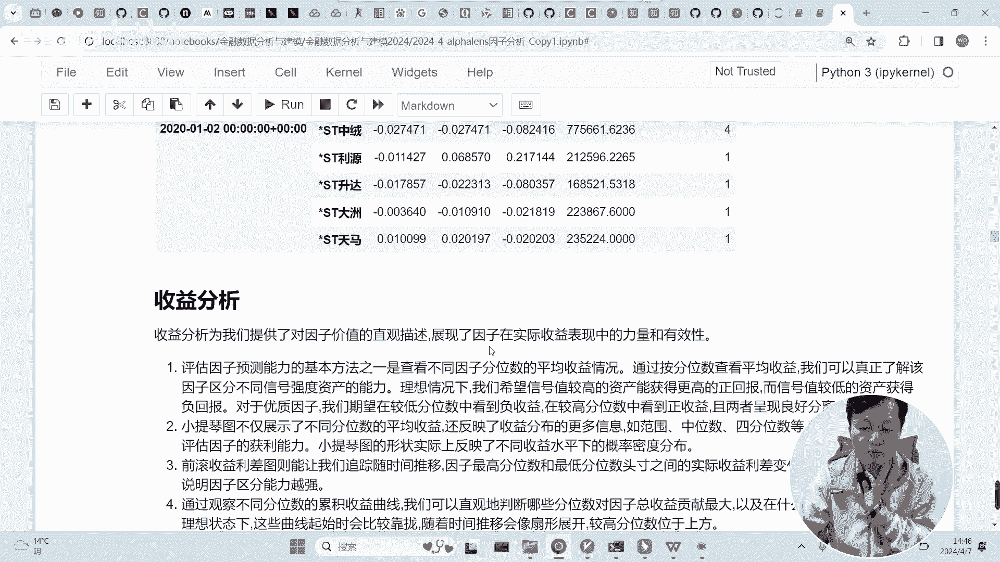

是因为大家可以看到这里啊，这里是有五个，默认是分成了五组啊。

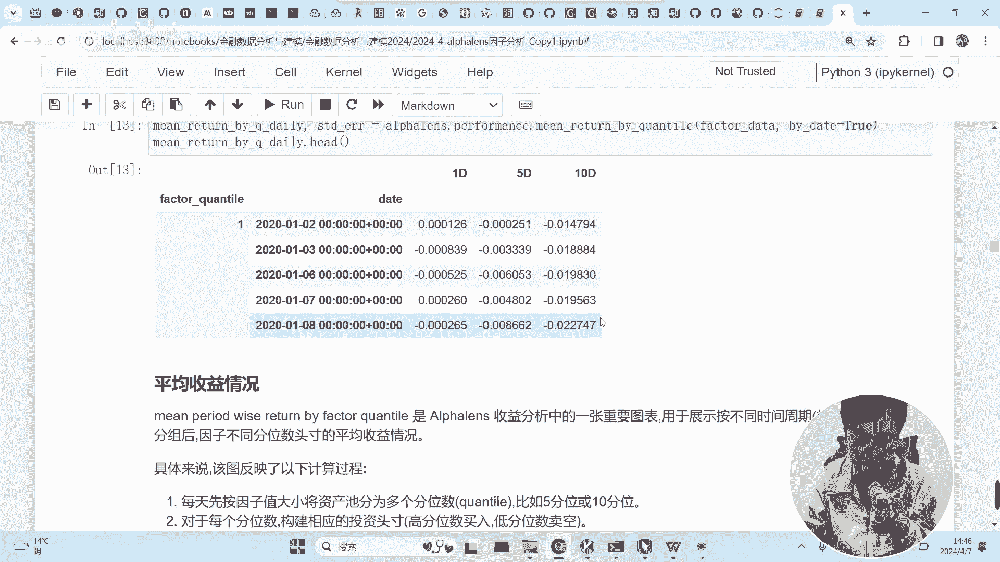

分成了五组之后，然后分别看什么呢，分别看不同组，随着时间的推移，它的收益情况是什么样子，这是阿尔法因子分析的一个核心逻辑，按照你给的因子从小到大排序，然后进行分组，分组完了之后看这些组啊。

这些组随着时间的推移，收益率哪个高，哪个低，哪个是赔钱的，哪个是赚钱的，以围绕围绕这个东西来看这个因子的效果，来看这个因子的效果，所以这是他整个分析啊。

整个也不算是整个分析，应该是这是他整个收益分析的一个核心逻辑，所谓的收益分析的核心逻辑啊，这理解了这这里面第一个分析，第一种分析所谓的收益分析的核心逻辑之后呢。

我们再回过头看他这个函数，就是我们的这个数据处理函数啊，就是这个就是这个这个函数，它的一些参数就能够比较好的理解了。

你看啊，首先呢这是我们的因子和价格，这个是你如果要有那个行业的话，你可以给到他，每日最大损失者入职，他是要过滤掉异常大的损失的天数啊，这个事他应该会做一个呃异常处理里面啊。

异常处理里面你可以处理的一个比值啊，比值，然后呢这个是什么呢，这个显然就是你把股票分组之后，看那个股票到底是几天的收益，你看这里设置了一天，五天和十天。

正是因为这样子啊，所以你可以看到这里是1D5D和10D，他分别看这个时间周期的收益啊，分这个时间周期的收益。

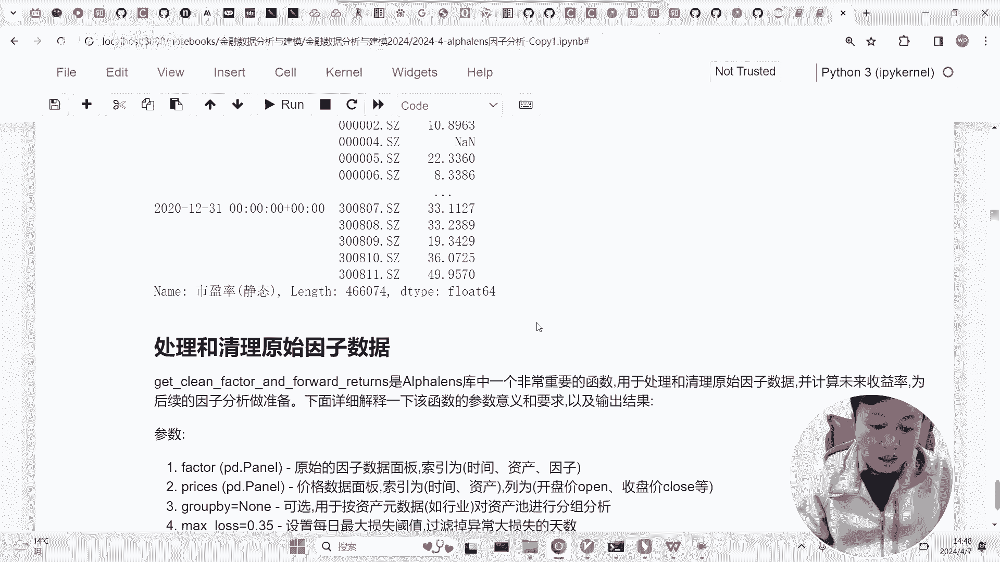

用于排除非正常交易状态的资产啊，过滤函数，这个我们也没用啊，啊等等啊。

记到底是怎么分组啊，这些都是围绕我们这个逻辑来实现的。

好吧，这个大概了解一下就够了啊，因为我们具体用的话哈。

什么都是用的默认的哈，都没有去改变它的默认值，直接把这两个东西放进去就行了啊，初学者嘛我们先最简单的方式用起来好呃。

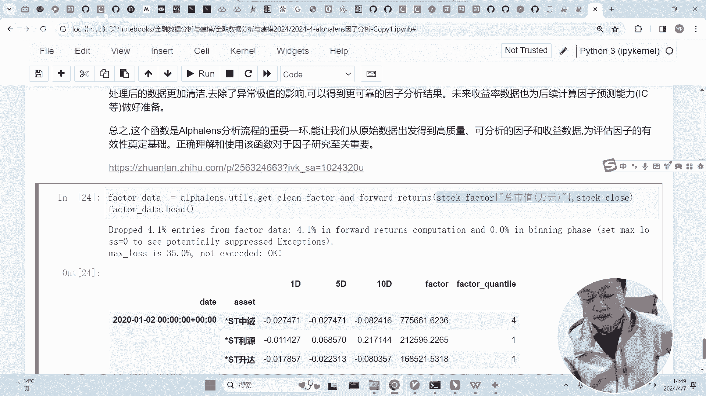

所以说有了这个逻辑，我们就很容易能理解下面这张表啊。

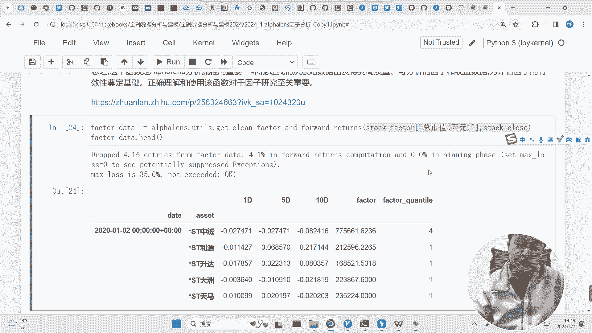

刚才也跟同学们讨论过，这显然是一天五天十天，一天五天十天，这个股票一天的收益，一天的平均收益啊，读一读一下，它是一天的，因为我们这里是一年的一年的数据，它是一天的平均收益。

这是五天的平均收益和十天的平均收益啊，十天的平均收益，那么这个值也很简单，显然就是我们的那个因子的值，也就是市值是吧，而这个呢刚才讲了，他是要把股票分组的，所以呢这里应该是它属于哪个组，属于4号组。

4号组意味着什么呢，它默认是被分成五组，一号组肯定是市值比较小的那个组，4号组呢应该是市值偏大的组，5号组应该是市值最大的组，能理解吧啊就这么个意思好。

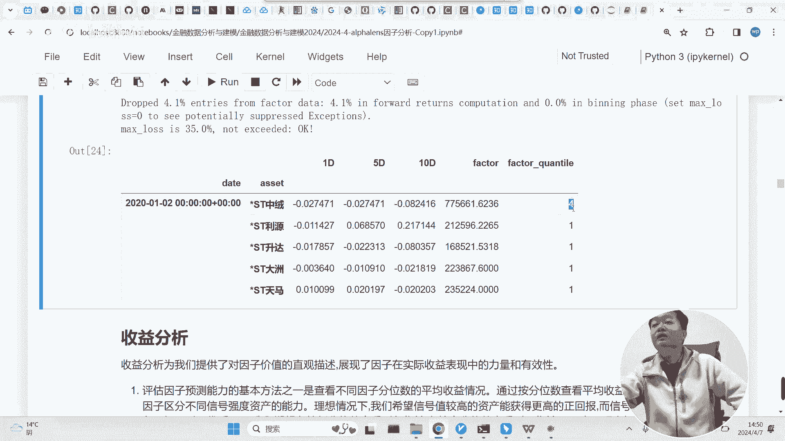

这就是我们第一步得到的这个东西，得到了这个东西之后呢，啊得到了这个值之后呢，就可以干嘛呢，就可以给到下面这个东西了。

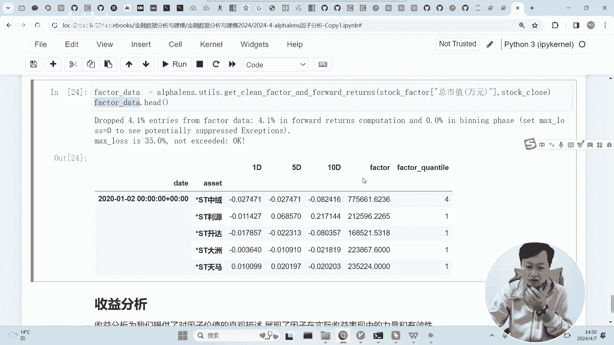

你看到下面这个词，然后再运行。

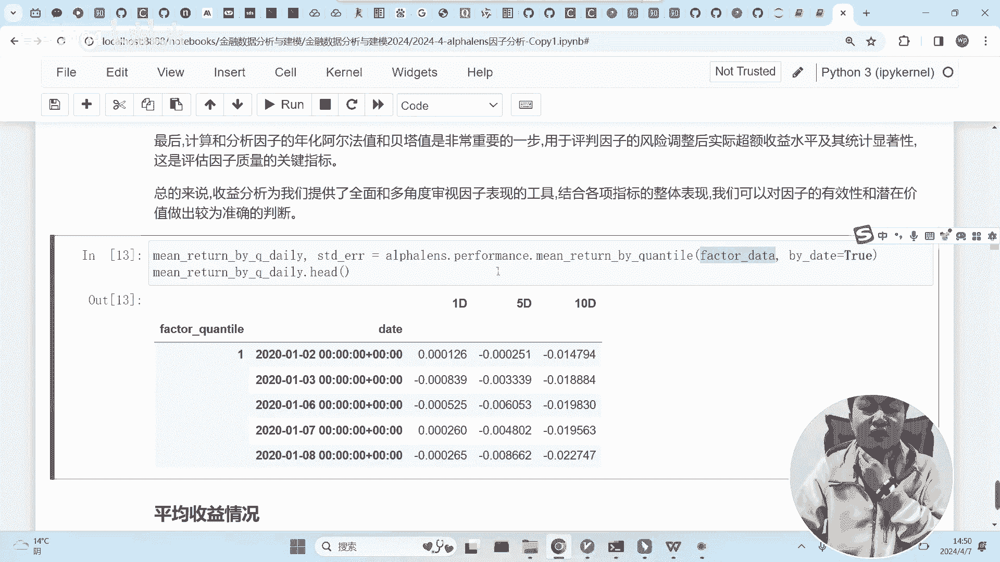

运行之后呢，得到的是什么呢，注意下，从刚才到这里运行之后得到了这个东西，这个东西其实同学们也很很很能看出来，这显然是一天五天十天的股票收益情况，但是大家发现了什么问题诶，股票id没了，股票id没了。

显然是这里干嘛，这里显然是对股，对不同的股票取了个平均能理解吧，对不同的股票取得平均啊，就这就这么个意思。

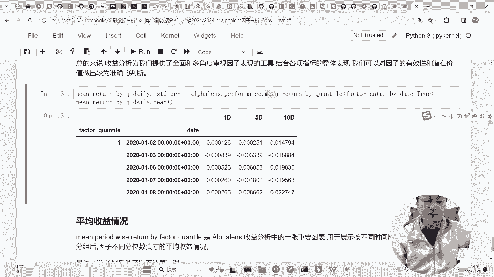

嗯嗯好吧嗯这里这些这里面的字，同学们可以仔细看看啊。

其实挺多有意思的一些结论的，但是老师上课要要多练一遍。

不是太花时间了啊，我们我们最重要的地方跟大家过一下好。

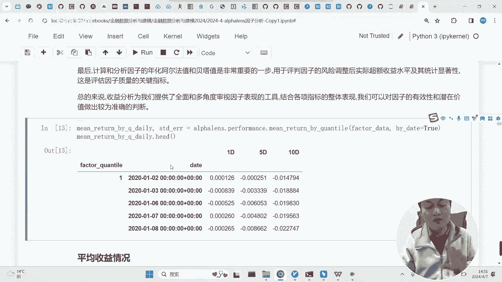

这是这个东西啊。

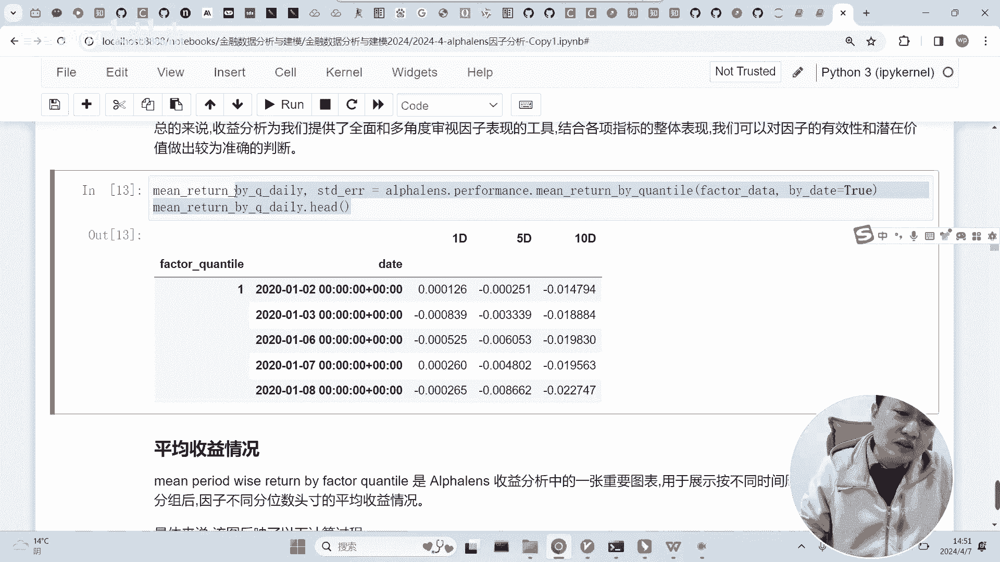

这是这个东西，然后再看下面这个下面是基于什么呢。

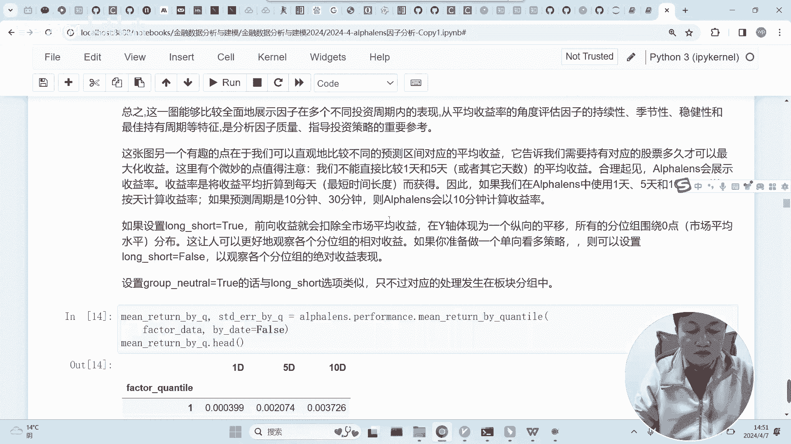

基于刚才的这个数据啊，基于这个基于这个数据来做的。

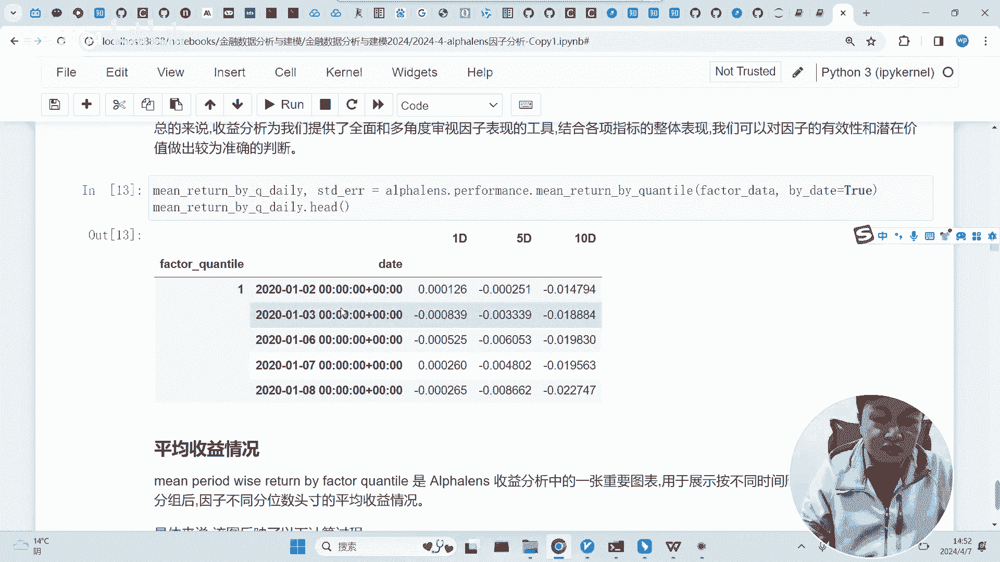

基于这个数据，然后运行一下就得到这个注意一下。

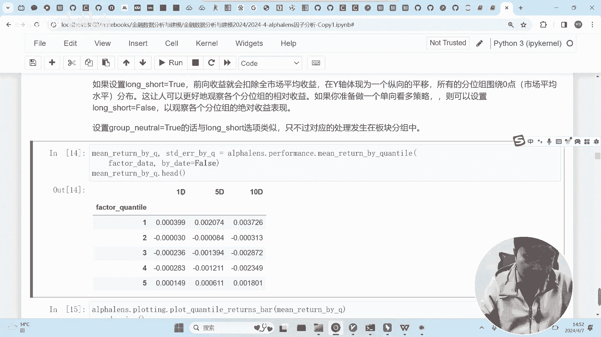

又跟上面不一样了，上面是有时间的，而这个呢已经没有时间了，已经是这个东西了，这个东西大家应该能够猜出它是什么意思吗，我找位同学讲讲好不好，好啊，同学说的是对的啊，这个很显然就是什么呢。

这是一号组一号土啊，一天的收益情况，这是2号组五天的收益平均啊，五天平均收益啊，这是5号图十天的平均收益呃，这里大家需要了解一点不同的分组，他的股票是不变的还是变的呀，问大家一个问题。

啊就大家要注意一点，这里面每一个组，他只是对应的，按照那个分位数的规则来进行筛选，他每天都要筛选一次，因为我们的因子值每天都会变，那么它这个组里面，不同的组里面的这个具体的股票也是会变的啊。

他不是一个固定组啊，不是一个固定组，好吧，这个能了解，有了这张表，下面这张就是不是非常好理解了，你看啊，我们是不是有五组啊，我们是有五组，是不是，所以说你看这是一组，这是一组，这是一组。

这是一组还是一组，这是一号组，看见没有，这是2号组，这是3号组，这是4号组，这是5号组，一号组呢显然就是市值最小的组，看见没，5号组呢显然是市值最大的，这是中间的啊，然后这个蓝色的是一天的平均收益。

这是五天的，这是十天的啊，这是十天的，从这个表我们能够分解什么信息呢，首先这是基于那个因子排序得到的图，那么可以看到，如果你要投资的话，你应该投资哪个组比较好啊，那显然是投资这个组比较好。

是不是能理解吧，再不济你也得投资这个组啊，啥时候他的收益是正的，是不是，那就说明什么呢，就是如果你以市值因子做筛选的话，显然这其实还是，其实中国的这个市场上，还是存在一定的小市值效应。

只不过是没有当年那么变态了啊，小市值的企业的效益其实还存在的，小市值企业的收益还是有一定效果的啊，还是有一定效果，已经没有当年，那么那个了啊，但是还是有一定的效果，而且比较奇怪的是他大势。

但还有一些正收益，反而是反而是中间的，你这个是不行的，中间是不行的，这是这一点，就从这里来看，第二点，这个因子啊好不好，问大家一个问题，这个音质好不好，其实不是很好啊，为什么呢。

通常因子分析最好的是什么因子呢，就它是一个单调的，是最好的懂吗，说明这个因子在整个变化的一个区间里面，你是具有一个很强的一个稳定性，但这个因子它不单调啊，它小的是最小的时候能够收益好，最大的时候收益好。

但中间收益不好啊，他是一个非单调的一个变化情况，从这一点来说，说明这个因子其实不是很稳定的啊，不是很稳定的，这是第二点，第三点，这个因子如果你以这个因子选了股之后，什么时候抛比较好，你持有的时间。

DOTA比较好，或者这个因子的，持续时间，其实从这里来看啊，可以看到看到一个什么什么效果呢，他至少在这个区域，在他每一个区域啊，他的这个收益还是比较稳定，什么意思呢，它随着这个，你看这是一天啊。

这是一天，这是五天，这是十天，至少这个因子在这个区域，它随着你的持有时间变长，他他还是能够增长好，还是随着时间增长，就说如果你使用这个用这个因子选股的话，是建议持有的时间稍微长一点啊。

持有时间稍微长一点会更好一些啊，就是要在这对于这个来说哈，他时间尺度上它的收益，正收益的情况还算是比较稳定的啊，还算是比较稳定的，当然啊在这个区间大家其实可以看到，随着时间的增长，它的收益其实是微微啊。

就这一段的收益相比，这一段的收益它是稍微小一点，它不像这里，你看这个呃大市值的区域，这一段的收益是明显要高于下面这一段，说明它随着你持有的时间变长，它的收益的增加啊，有点加速的情况。

而这里呢其实它有个减速的情况啊，减速的情况好吧，这是我们肉眼揣测，大概是这些啊，大概是这些。

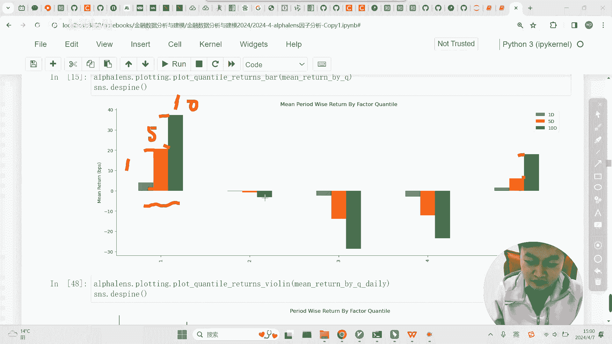

然后我们仔细看一下啊，我们仔细看一下啊。

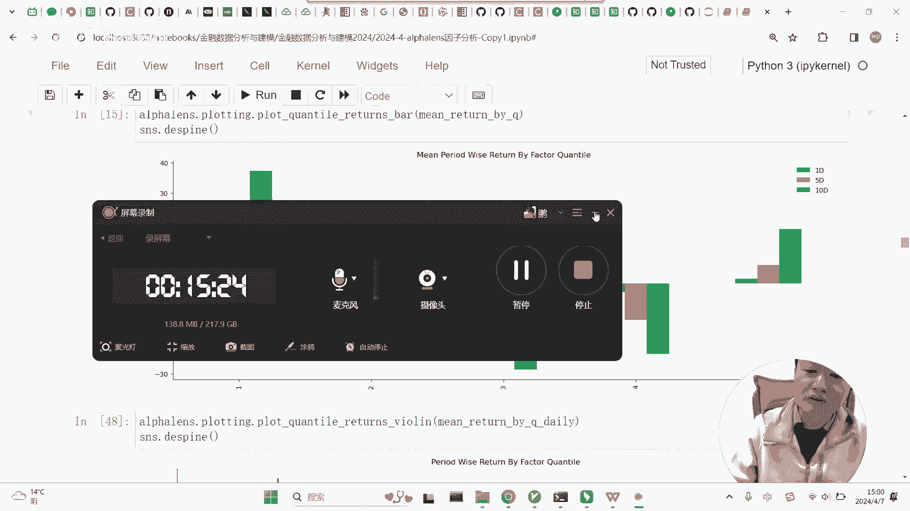

这里面提到的他的一些方面啊，这张表称之为什么呢。

所谓的平均收益情况，用于暂时按照不同时间周期，因此不同分位数头寸的平均收益啊，所谓的头寸就是这样的一个投资组合，这样一个呃资产配置。

每天首先是这个图。

这个图呢是每天先按照英尺的大小，将股票池分成多个分位组啊，然后呢每个分位数组构建构建那个啊，构建呃你的一个资产的一个配置，就摆他或者卖他，然后计算每个头寸数，在不同时间周期的平均收益率啊，平均收益率。

然后将同一周期内不同分位数的平均收益率，在同一个尺度绘制出来。

形成一个样子啊，这就是形成的就是下面这张图啊，这张图然后看一下它的意义展示了。

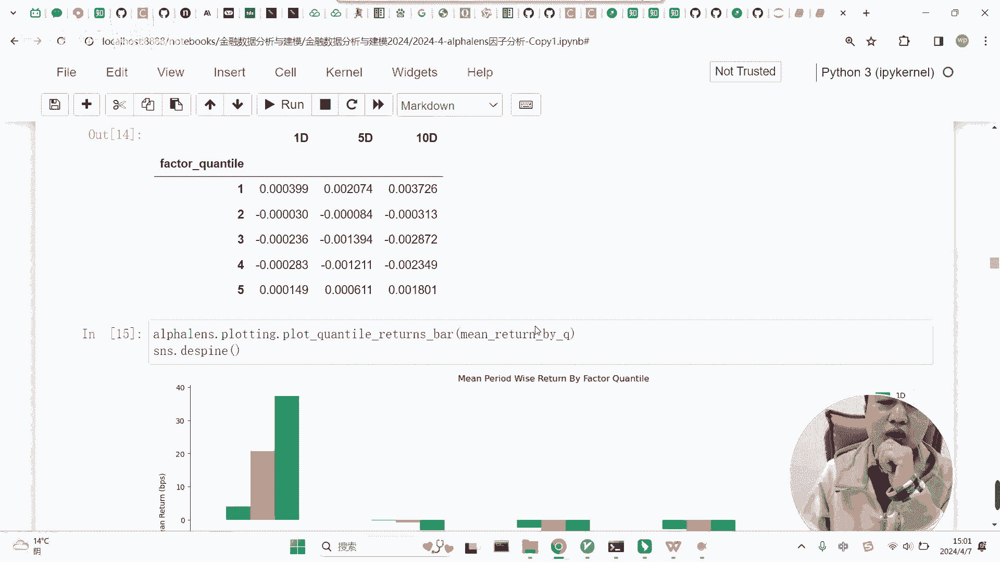

因此对不同投资周期是预测能力，帮助确定合适的这个高分位数和低分位数，收益差距差距越大，说明该时间窗口内因子的区分力度越强啊。

这里但这一条来说，这个音质就不是很好了，你看它高和低，反而两头正收益，中间负收益。

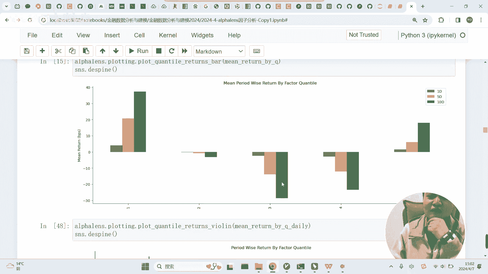

不单调不单调，所以说他其实在这里违背了，你看你看这里啊，理想状态的高分位数呈现正收益。

低分位数呈现负收益，显然不是理想状态，显然不是理想状态，但这一点是不重要的，其实关键是单调性啊，关键是单调性，至于说正负收益其实无所谓，如果一个因子它越低，收益越高，越高收益越低，只要它能够持续。

这显然也是能够，显然也是能够很好的音质啊，就是非常好的音质了啊，你不不需要它因此增加收益增加，这不存在的，只需要他的这个趋势能够单调。

能够长期保持就够了啊，长期保持就够了。

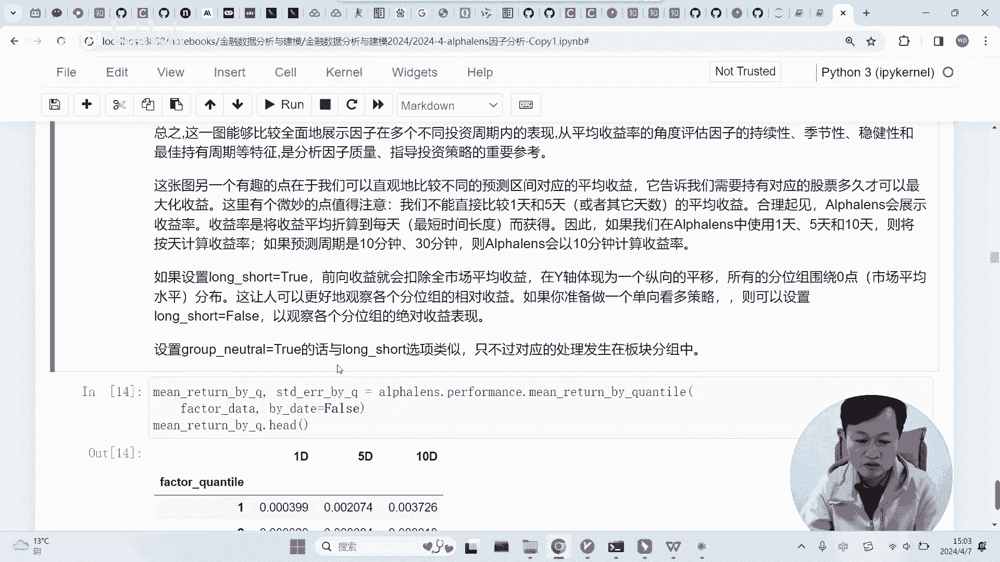

呃分析不同分位数在不同周期的分布形态。

可评评估因子的稳健性啊，这个这个稳定性就不是很啊，至少在这里啊，单个这个区间它的收益还是还是可以的哈，就在这个区间啊，他还算是比较稳健的，他一天五天和十天都保持了一个正收益啊，都保持一个正收益。

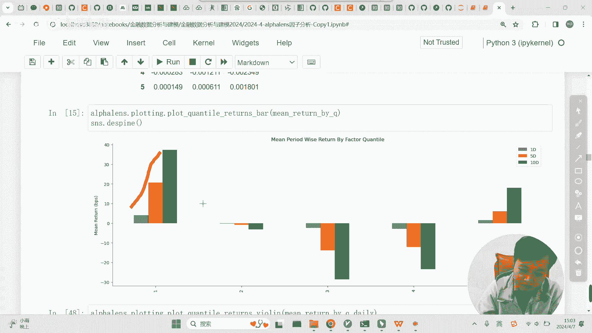

从这一点来说，这个音质是还可以的啊，这还可以，判断因此是否存在季节性。

这个这里判断不出来，这不存在的啊，这里除非你把那个周期调的很高。

那倒可能暂时是我们这里一一天五天，十天不存在，判断季节性有助于音质最佳持有期限，指导实际交易啊，判断因子的最佳持有期限。

其实从这里来看啊，其实至少这里是鼓励，鼓励你能够持有的时间长一点啊，因为它的随着持有的时间增加，他的收益一直在一直稳定的增加啊，这是能鼓励，包括这里也是啊，这里也是，所以说啊这一点它是它是存在的。

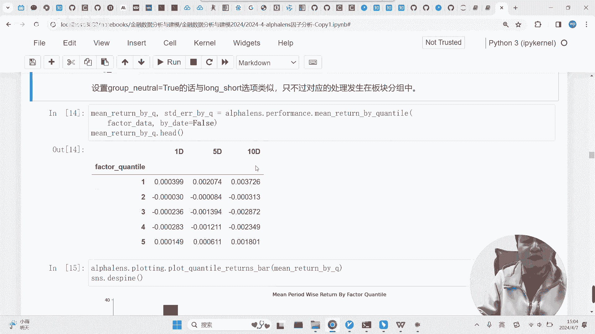

嗯好吧呃其他的更细节的东西呢，我们今后如果再用它正儿八经，做因子分析的时候，我们再去多了解啊。

再回过头来了解一下，当然这里的话，你看这里并没有扣除整个市场的平均收益啊。

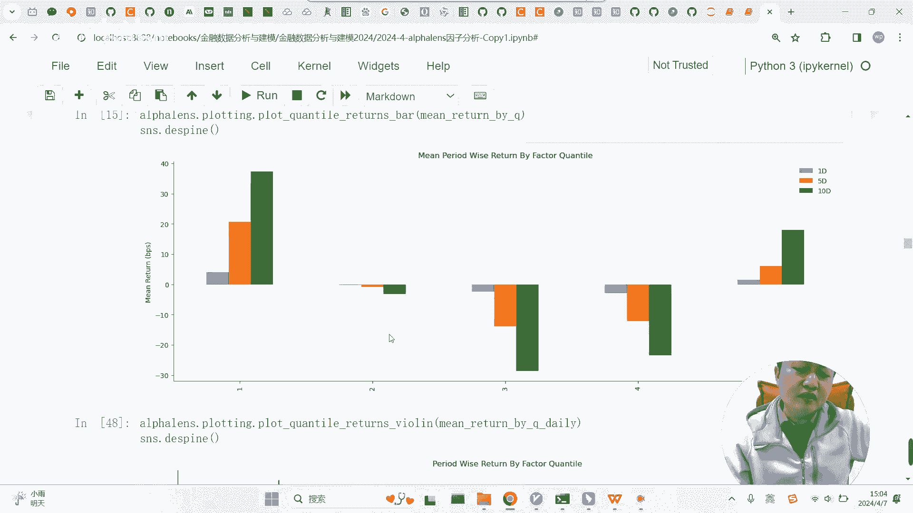

如果你想扣除的话，设置一下这个东西就行了啊，设置一下这个这个这个东西就行了。

唉，OK这是所谓的呃，不同分组的平均收益图设置在这里，下面这个呢跟上面那个差不多，不同的在于什么呢，他弄的是一个这叫什么图啊，叫钢琴图啊。

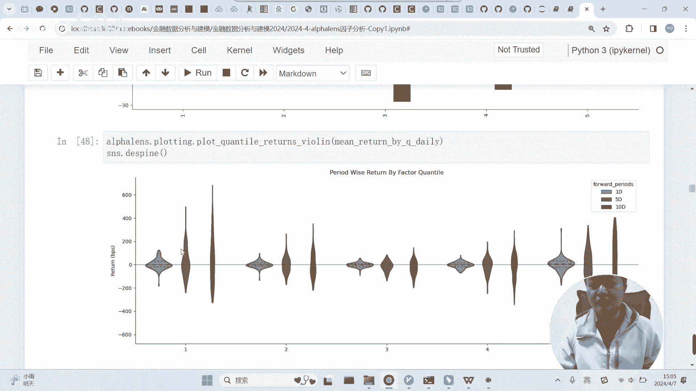

我看一下叫什么图啊，小提琴图对小提琴图啊，所谓的小小记录，不仅展示了不同分位数的平均收益，还反映了收益分布的更多信息，比如说中位数和四分位，更全面的了解不同收益水平下的概率密度啊。

我们可以看一下这个小提琴图，首先，大家能看出一些啥吗，能看出些啥吗，啊就是相比上面他能看出一些什么呢，至少大家注意点，它不对称啊，看见没有，就是这些图啊，显示一个什么情况呢，它并不是特别对称的啊。

并不是特别对称的，而每一个分组里面偏极端的，你看啊呃，这个pg代表什么，代表大量的都是在这个位置，是不是，但是呢等你放了再打这个分组，等你在手上持有了十天之后啊，他们彼此的收益其实就就差异就大了。

而而而上面那个正收益怎么带来的呢，实际上主要还是以头部的，少数的股票所带来的正收益，大量的其实还是在中间的，能理解吧，就是它这里面还是有赖于少量的头部的，而这少量的头部的呢。

它是能够把这个收益给拉上去啊，把这个收益给拉上去，这一点大家要注意一点啊，所以说它这上面比较细啊，而这里会出一些。

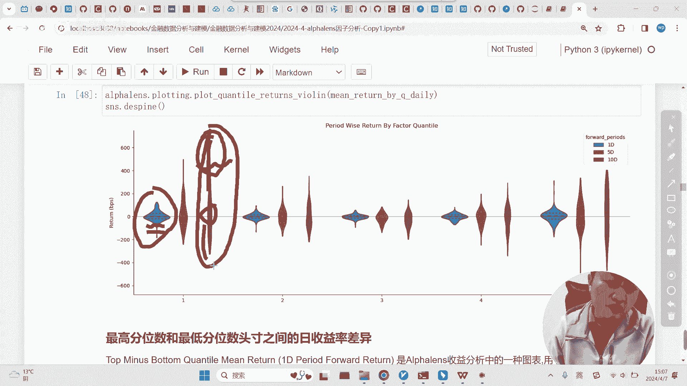

但是呢这个事情到了到了高市值的情况，是发生了变化的，高市值的情况呢，他极端的，啊极端的情况它是负收益，但是呢因为有很多的股票它是正收益啊，使得这个收益也被拉上去了啊，也被拉上去了。

没有被这些极端的给拖累一下啊，给拖累一下，就是说在高市值的情况，其实存在少量的企业，它的收益巨坑啊巨坑，但是因为高市值的情况，下面还是有不少的企业存在一个正收益的情况，正是有他们这些企业存在。

才平息了这些那些巨坑的企业啊，这是这个小提琴图给我们带来的一些信息啊，给我们带来的一些信息好吧，这个同学们了解一下啊，同学们了解一下，就是我们的我们的我们的小提琴图。

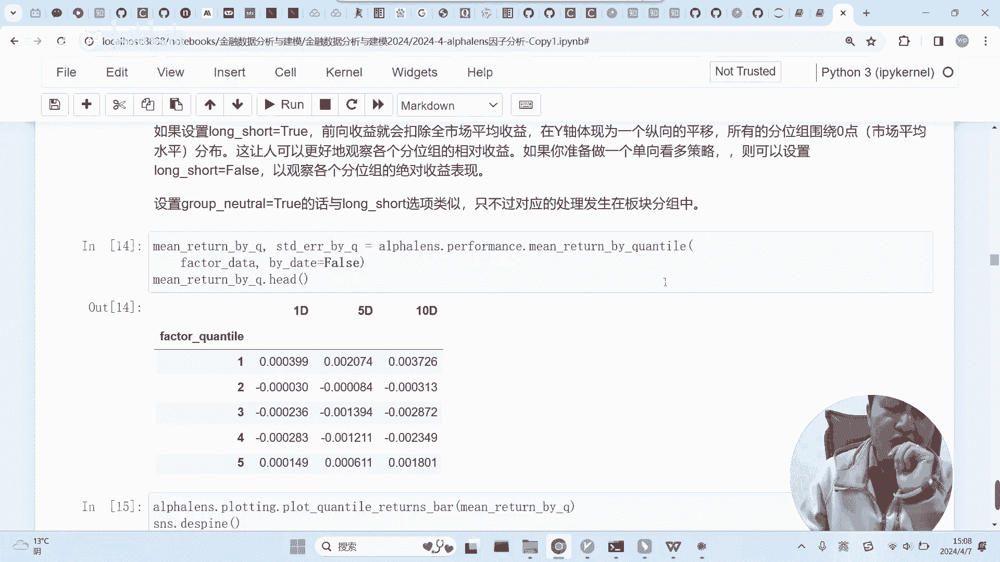

接下来是，最高分位数和最低分位数头寸之间，的日收益差异。

也就是下面这个图，看没这个图，这个图是啥意思呢。

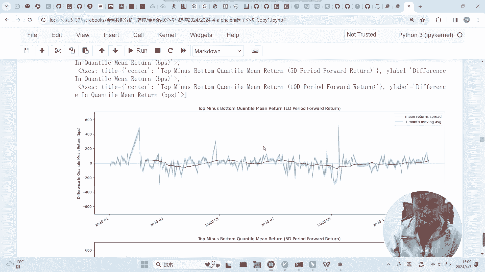

我们来看一下怎么说的啊。

他是怎么怎么怎么这个图怎么做的，首先每天按因子时的大小，将资产池分成若干分位数，这没问题，然后计算计算最高分位数和最低分位数，在当天以及之后一日或者几日啊，51日或者5日或者10日的平均收益。

Y轴的值是头部的和底部的之间的收益差值。

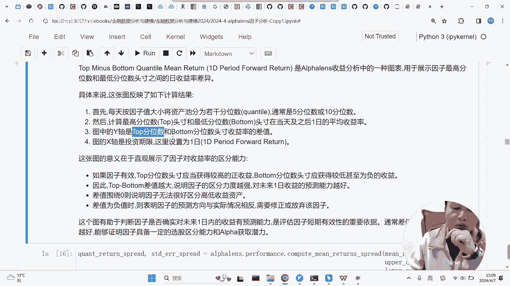

能理解吧，所以说这个这个词是他头部啊，这个词是它头部和底部的那个分位，区分为那个群体收益的一个差值啊，收益的差值。

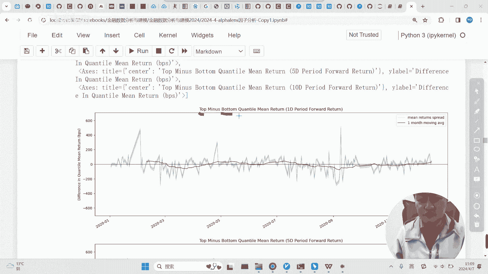

啊当我们这里设置的是一天。

其实还有五天和十天的啊，五天和十天，这是这个啊。

这个东西让我们看一下它的意义啊，如果音质有效，头部应当获得较高的正收益，底部应该获得负收益，这个不一定啊，就是我说了啊，底部负收额，头部负收益，底部正收益也很好，也很好啊，他这个不存在的啊，就不存在。

一定是要头部或者这个这个无所谓啊，然后但是呢这个差值倒是肯定差，是肯定差值越大，区分力度越强，未来的预测能力越好，这个是没问题的啊，显然就是差值越大，说明这个因子它的区分度很强，很很好啊。

差值如果围绕零，说明因此无法很好地区分高低，收益好，区分度不强，那如果就围绕零啊，差值为负时，表明因子的预测方向与实际情况相反啊。

需要修正放弃啊，这我觉得不简单啊，不简单，这个，好我们来看看，其实本质上你看市值因子，基本上是围绕您这个地方变来变去的，不就是你就是，至少至少什么呢，至少我们的拓扑组和最高值和最低值之间的差。

值是不明显，其实老师要讲，我们从上面其实就能看到什么呢，这两者显然这一组这一组显然不明显，因为它都是正直，你要用这要用什么，要用这一组和这一组比，他肯定就明显啊。

因为它们之间的差值才会才会区分度才会大啊，才会大，这真实情况都不会总是完美的，不存在完美的情况，但这里比较的是拓扑和那个button啊，是最高和最低，最高和字体看起来其实差异不大啊，都是围绕零。

然后呢这是到了5日，5日看起来稍微好一点，看到没有，5日看起来稍微好一点，而10日的话，10日的话其实也挺好的，还可以啊，10日的话其实这个差值看起来还不错的，至少什么呢，至少他有一些起伏了。

说明什么呢，说明在某些时候啊，说明在某一些时候，这个因子其实是起作用的，只不过只不过这个时间的呃，时间的跨度呢可能也才几个月，看见没有，就是这个因子绝对的有效的时间，其实只有几个月的时间。

但是这个时间挺长的，你看没，这个时间应该有个小半年啊，有个小半年，就是这说明什么呢，就是这个你用这个因子来做股票，不要搞这个短期的啊，还是要长期一点的，长期一点的会会好一点。

而且长期的话它也存在一个择时的问题啊，也存在一个择时的问题，就是你要什么时间进，什么时间出，不能不要一直持有啊，不要一直这样子，不要一直用这样的一个方式，得得得有得则死啊，得则死好吧。

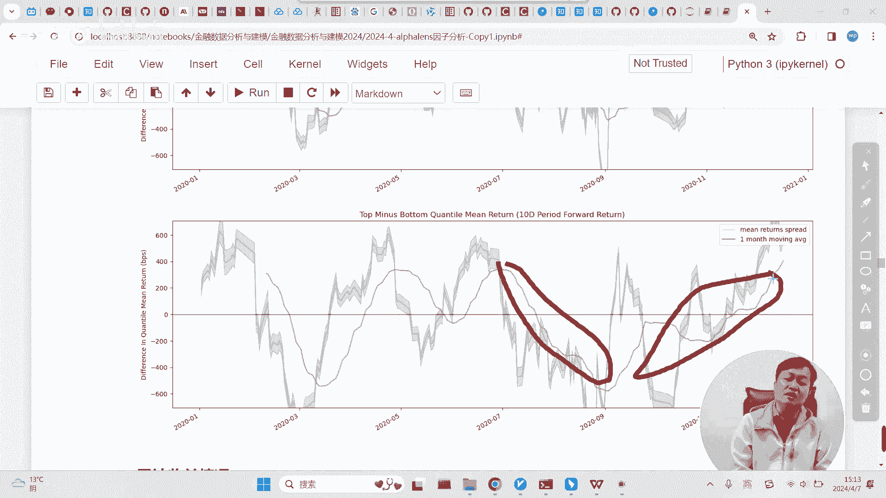

这是所谓的最高分位数和最低分位数之间的差。

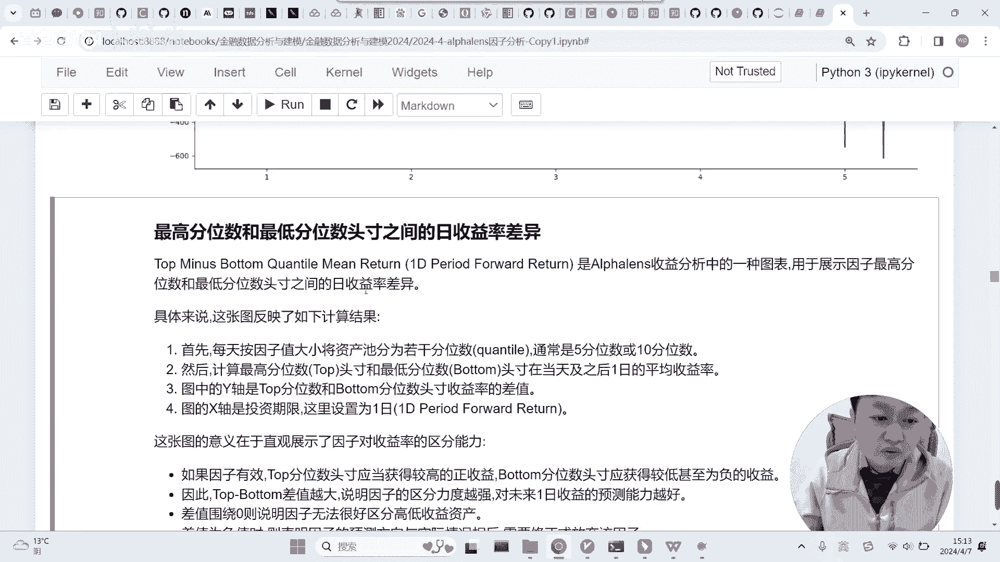

异之间的差异。

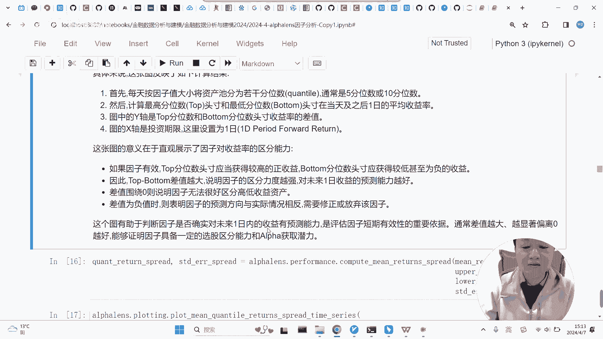

这是这个这个表。

然后是我们什么呢，累计收益情况啊，累计收益情况，我们看一下这个东西，听他的名字，我们应该能理解这个表是什么意思吧，应该能理解这个表是什么意思，是不是，他是。

我们我们我们可以读一下吧，看，对每个分位数构建头寸，然后当日的简单收益。

再次因为要对各方投资进行累积，得到累积训练，显然这个就是什么呢，就是你看啊，比如说比如说这条线，这条线对应的是什么10D5这个吗，这意味着什么呢，这意味着我们始终以这个以什么呢。

以嗯嗯始终获取四只因子里面，最大的那个分组啊，最大的那个分组，因为他从小到大的嘛，最大的那个分组，然后呢获取到了之后呢，持有它十天啊，持有十天的一个，收益啊只有十天的一个收益。

我们可以看到之前的平均收益五和一，这个组都是正的，然后我们这里呢就能看到它是怎么变成正的，是怎么变成正的，是怎么辩证的呢，首先这个正值并不是恒定的，大家看清楚没，就是刚才我们看到了呃，刚才我们看到了。

就是，四只因子两边的那个分组，都能够获得一个正收益，但是从这个时间这个收益的时间变化，我们可以明显的看出啊，不管是这个5号组还是一号组，它并不是所有时间都是正的，他只不过是什么呢，你可以看一下啊。

它它整个收益它其实是围绕这个东西波动在啊，在变化，像这个5号主，他他只在最后一个时刻看到没，只在最后一个时刻辩证了哈哈，只在最后一个时刻辩证了，但实际上它也是一样，他一开始是这样看没有，然后再这样。

然后再再这样，然后在这里辩证了，然后在这里辩证了，然后再再下来，然后再下来哈，然后再下来的就是它并不是整个时间都是正的，所以说你可以看到，如果你要用四只因子的话，这肯定是要做择时的啊。

不能一直用四次因子到底什么时候用，这个也谁谁也搞不清楚，这里看起来好像很当然，因为这是我们用的数据，真实数据才会知道这个事情，但是如果没有真实数据，未来你要怎么弄，这个确实同学们给，我也不知道啊。

我不知道，至少从这里来看，他不是一个稳定成长，他是一个是一个是一个变化的啊，是一个变化的，而且大家看到还有一点看见没，这两个市值因子市值极大和市值极小，他们这两个东西还是很有区分度的。

就是当当市值极小的亏钱的时候，市值极大的他是赚钱的啊，但是当市值极大的，开始亏钱的时候，市值极小的又开始往上涨了，他们这两个还是有一个很强的一个对冲作用啊，这个是很有意思，其实也是可以利用的啊。

这个这个特征是可以利用啊，他们看起来是有个挺强的一个对冲的作用啊，只不过是在在这个位置，为什么最后他们两个都都是正的，只不过在最后时刻四只小的它没跌下去，而市值大的呢稍微起来了一下。

所以让我们看到了他们的平均值，这两者的平均值都是正的啊，都是正好吧，这是我们简单的看看他的这个累计收益的，时间变化，能得到的一些信息啊。

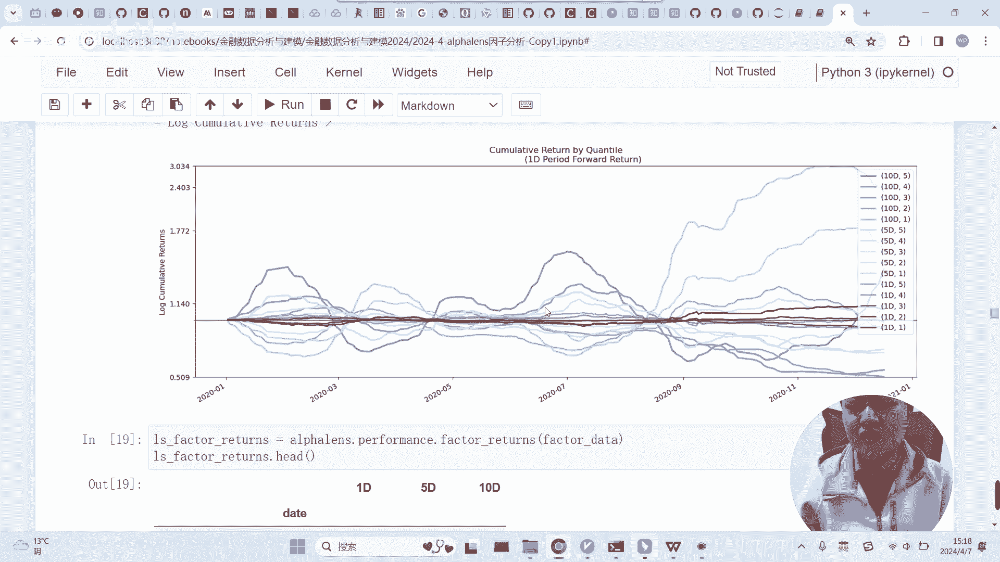

能得到的一些信息，我们看一下它这里怎么讲呢，这个图反映的因子对未来的预测能力强弱，如果高分位和低分位的一收益差异明显。

说明因此具备一定的选择和择时能力，这个是这个对吧，这个对的，你看至少我们这看到四只因子，其实是具备一定的颧骨和择时能力啊。

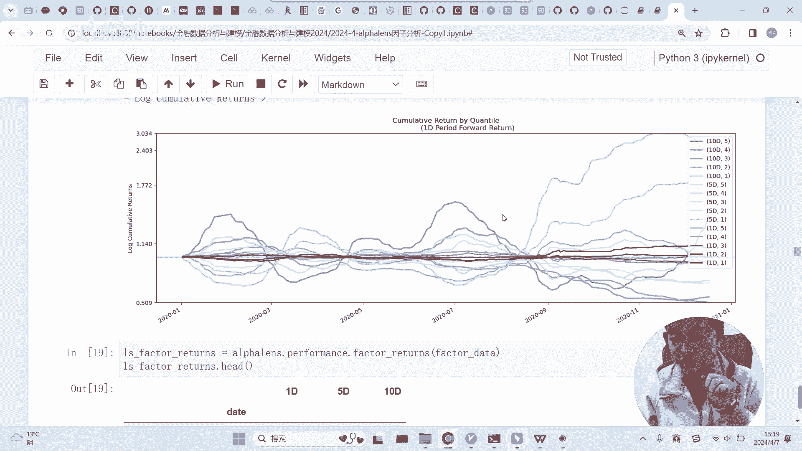

择时能力的。

他为什么呢，你看它的高分位和低分位，它的差异性是很大的。

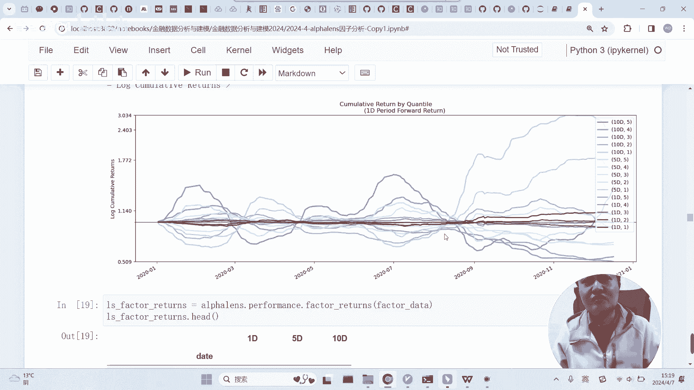

差异性是很大的，曲线的走势一致性反映了因子的稳定性啊，那我们这个音质一点稳定性都没有哈，高分位曲线高度一致，说明因此获利来源较为稳定啊，我们这个不稳定啊，这个东西啊一点都不稳定。

在时间维度上可观察不同时期的因子变化，判断是否具备持续性，这个看起来实际性没那么强啊，高分位曲线位于上方，低分位于下方是理想状态啊，体现了因子的合理性，这啊通过曲线的扇贝开口程度。

可评价因子的潜在获利空间。

扇贝开口程度是不是就是这之间的一个距离啊，这之间的一个距离啊，这之间的一个距离看起来还可以啊，看起来还可以好吧，这是累积收益图是这么一个情况啊，累计收益图是这么个情况啊，啊这个代码就直接运行啊。

就就不不用再讲了，就是把刚才的东西放进去就行了啊，然后这个也是一个的累积吧，某个一天的这应该是什么呢，这是一天的所有的情况的累计啊，这是什么呢，这是啊一天的五个组合并到一起的一个累积啊，是这么个情况。

是这么个情况，这个应该给给到了是什么呢，给到的是这个因子的阿尔法，他应该是做了回归，得到了这样一个系数，这个老师还不太还没研究还没研究啊，可能是对不同的时期做了一个回归啊，好吧，然后呢呃，这个是啥呢。

这个其实比较有用一点，就是刚才老师为什么一张一张图讲啊，就是一个个弄呃，其实同学们可以最最方便的方式是什么呢，是用这个代码，这个代码可以一次性把这个分，这个收益分析里面所有的图都都展示出来，看见没有。

啊看见没，这个图可以一次性把所有的都展示出来，啊就是。

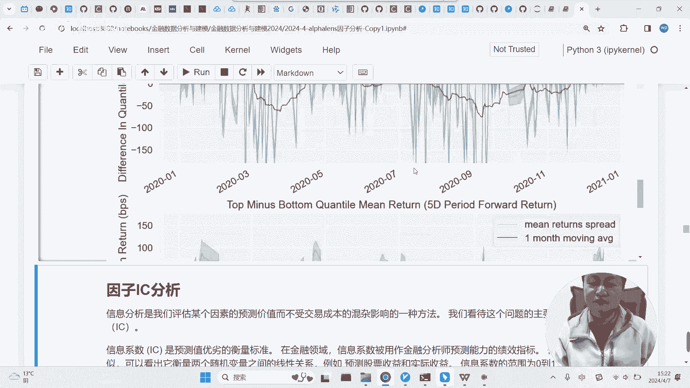

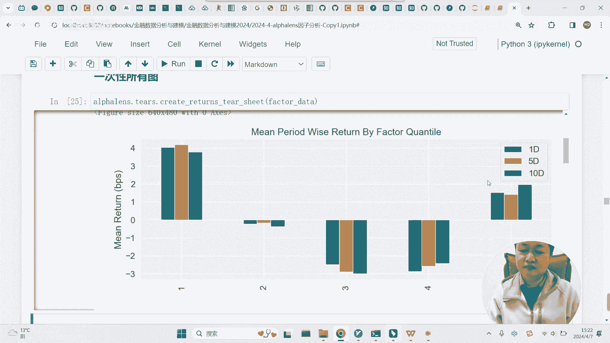

哎呀等一下等一下，我刚才收拾。

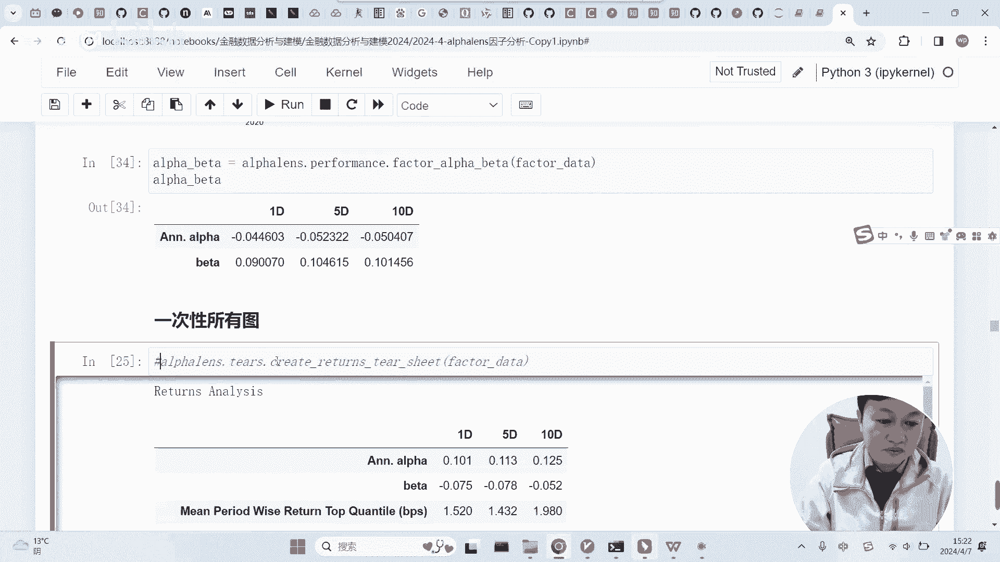

好吧先不先不管这么多吧，就这个呢就是它一次性可以把这个分析里面，所有的图做出来，实际上还有一个更一次性的能够把所有的哈，我们现在才学了一个所谓的收益分析，而实际上这里面应该有除了收益分析以外。

还有所谓的IC分析和下面好几种呢。

好吧。

