# 基于backtrader的通用量化框架及其简单使用-量化金融与机器学习2024 - P1 - 背包2004 - BV1VM4m1X7Xo

好吧呃我们进入一个新的阶段啊，我们来学习具体的一个量化交易策略啊，而且呃老师还是像这应该是我去年开始用的啊，是用的这样一个开源的一个包啊，black treat啊，Bad treat。

老师上这个课上了好多年啊，以前用过各种平台啊，但是我觉得还是用开源的吧，因为我怕那些平台总会有些变动啊，束手束脚，而且很多平台大家也看到了，都快挂了啊，都快挂了，所以用这个开源的啊，用这个开源的安装。

同学们应该以前应该安装过了啊，以前说是安装作图的话，需要加上这个，但是好像现在不加这个也能够用了啊，而且去年装是有一些问题的，但是今年装了发现这个问题已经都解决了，所以就这只是放在这里。

大家如果有问题就去看看。

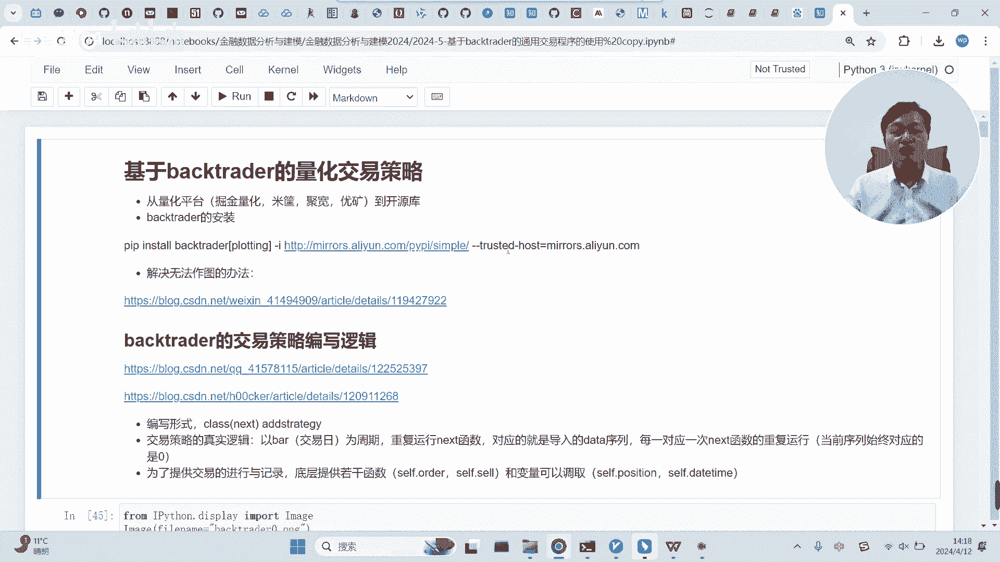

没问题就就直接用就行了，好好。

这个包主要是用来做量化交易策略的编写的啊。

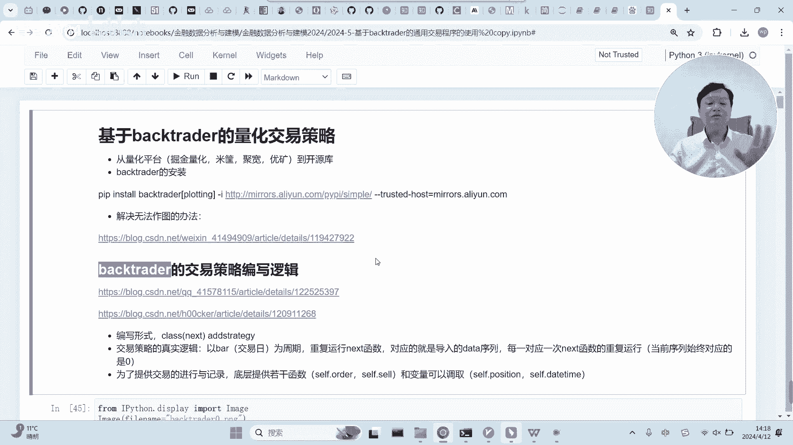

编写的今年一个很大的不同呢。

老师不打算去教这个包到底怎么用呢，啊老师把他自己封装好了。

我们今后只是只是调用它，我们不涉及到我们写这个用这个包来写框架了。

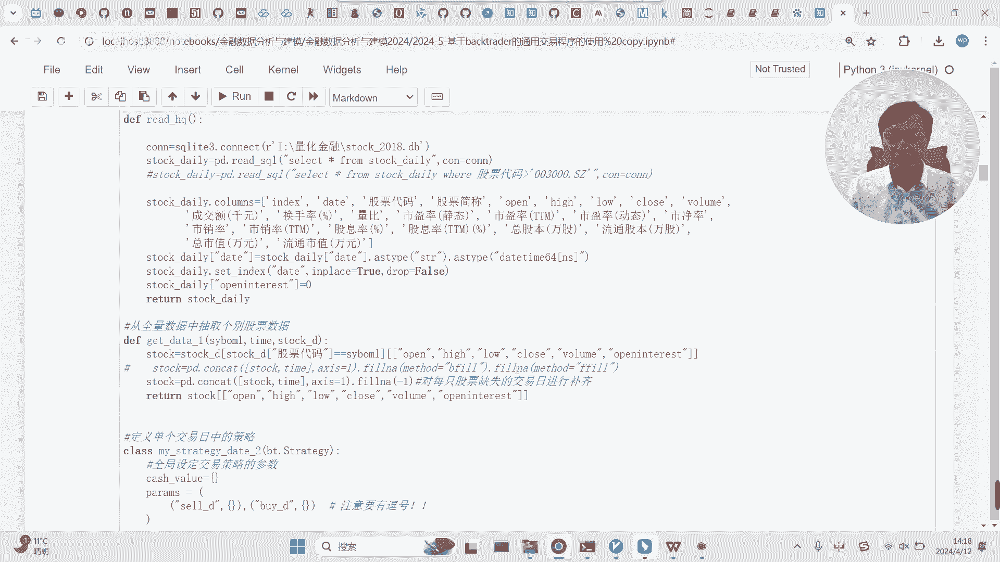

我觉得这样可能会更加容易一点啊。

更加容易一点，为什么说更容易呢。

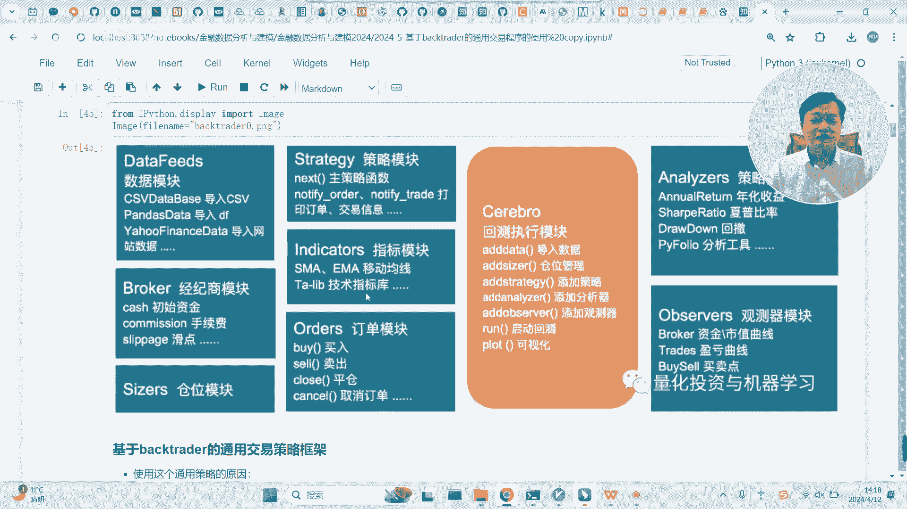

因为这个包的学习本身也是一件很麻烦的事情，一个是这个包的文档也不见得特别友好啊，而且他玩内容也非常繁杂，我觉得作为包括老师，我觉得也不愿意去深入学习那么多。

为什么呢，因为框架非常多的，量化交易的框架很多。

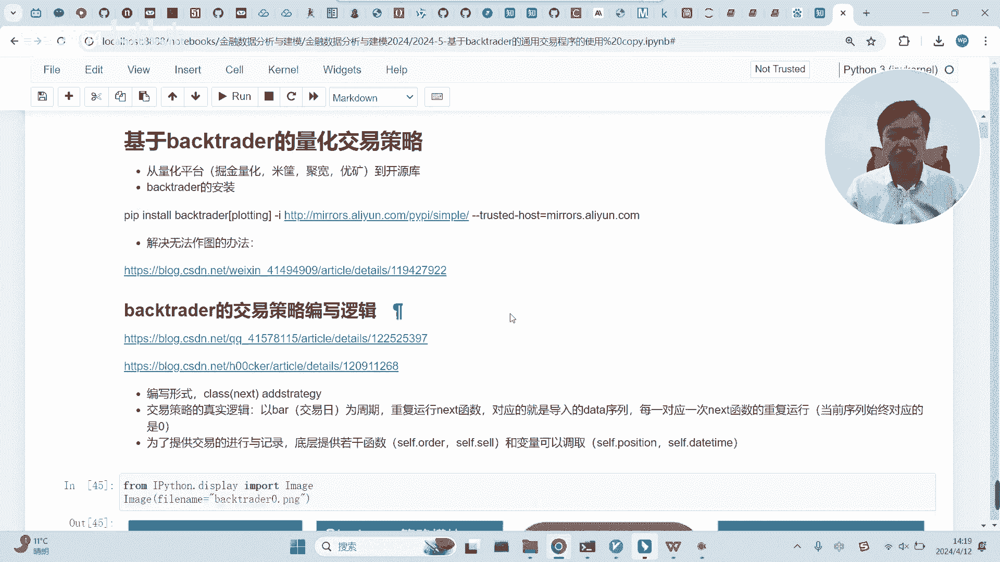

你经常会涉及到框架之间的迁移啊，你如果每个框架都很深入的去学习，我觉得是一件非常费力的事情啊，所以为了让我们这个课程更加容易一点。

老师是把这个框架做了一个打包啊，做成了一个更加容易的一个呃一个一个程序啊，这个程序呢只要我们什么呢，只要我们定义好，在这里定义好你要怎么进行交易，然后喂到它，它就能够帮我们完成交易啊。

这个程序是这样的啊，是这样的，当然在用这个程序之前呢，我觉得还是有必要跟同学们大概聊，大概讲讲这个量化交易，它的一个逻辑和以及这个程序的一个实现的，大概的思想，我觉得可以跟大家讲讲啊，同学们有兴趣的话。

可以自己了解一下这个代码到底是怎么组织的，然后因为有可能还涉及到一点修改。

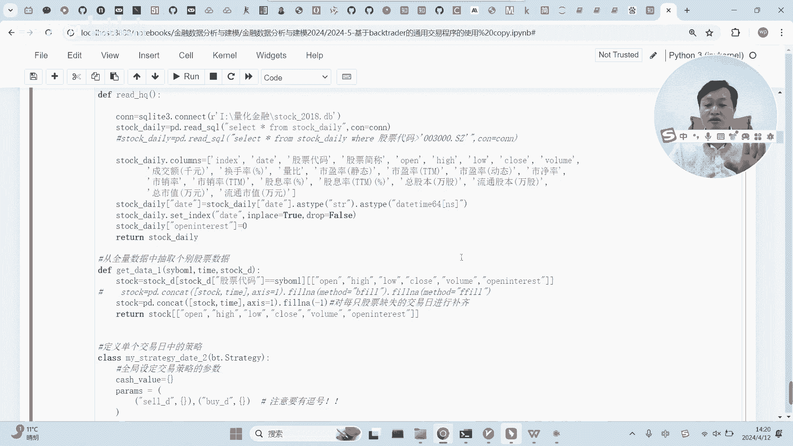

自己的修改。

当然有很多原因啊，老师这里讲的同学们可能不太体会啊。

就是老是这么干，是有很多原因，不仅是为了简单简单易用，而且还有很多人，还有还有一个很大的原因就是什么呢，black trade这个交易策略啊，如果你涉及的股票太多的话，它的这个程序的运行就非常慢啊。

这个是非常不好的一件事情啊，因为他自己引入了一个新的数据结构啊，这个数据结构，是面向交易的，它不面向数据分析，所以说你在它内部来进行策略的一个调配，其实是非常低效的啊。

所以这也是为什么老师更建议在外部来做策略，策略作业做好了之后，给到他来进行一个实现就行了。

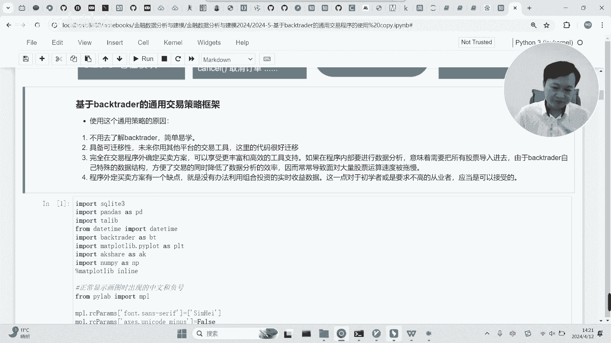

好吧，这些我们嗯稍微讲讲，然后我们大概讲一下这个逻辑啊。

所谓的量化交易策略的编写呢，首先它就是要模拟啊，他是要模拟一个真实的一个交易的，一个真实的就是什么呢，就是他要模拟你真实的假设，你真实买了这个股票，然后过了一段时间呢，这个股票赚了多少。

然后你再然后你要你，你又把它这个股票给抛掉了，然后最后你收益多少等等，这样一个过程，它是要模拟这个过程，而模拟这个过程最核心的点是什么呢，大家要理解一点，股票交易是有是存在一个周期的。

大家能理解这一点吗，就通常都是以交易日作为周期，通常都是以交易日作为周期的，就是说呃，我们的策略通常会告诉你啊，告诉他在在交易制里面怎么来进行啊，怎么来进行你的你的交易。

而这个交易日呢它作为一个固定的函数。

它是会被，会被自动的重复的运行的，大家能理解这一点吗，就是股票交易它是由一个一个个交易日构成的，我们在制定策略的时候，是假设每一个交易日我们的策略，我们的思想和策略都是通用的。

我们只是在这这个交易日里面，把我们的方式给定义好，方式定义好，然后呢，我们这个方式会自动的，在每一个交易日会进行运行啊，这是它这里面最核心的点啊，最核心的点正是因为有这个核心，它会意味着什么呢。

这里面会有一个函数，你看起来没有被循环的执行，但是它实际上是始终会被循环的执行的，这一点大家要非常清楚，我整个你看整个这个策略里面，你没看到任何一个没看到这里的函数啊，当然有一个函数这个管。

特别是这个最主要是这个函数，这个函数就是我们来定义单日交易的一个策略，你你在整个这个代码里面，没有看到这个函数被重复的循环的执行过，但是实际上这个函数是被循环执行，循环执行的。

它会从它会根据日期一天一天的重复执行，比如说1月1月一号，它会执行一下这个函数，然后到了1月2号，如果是交易日，它又会执行，到了1月3号又会执行，所以它会重复的对这个东西来进行执行。

这是这个量化交易的一个最核心的一点，而这个函数呢，也是我们所有量量化交易策略，最核心的一个函数，就是你要干什么事情都在这个函数里面定义，一旦定义好了之后，这个函数会自动的。

在每一个交易日来执行你的买卖的一个操作啊，执行你的买卖操作，啊这是这是这个意思嗯，然后呢啊老师讲几点吧，细节我也不讲啊，不太讲，首先呢break treat这个量化交易策略，它要运行的话。

有我们运行上面的，呃它要运行的话，他需要有一些前提，首先你得他不他没有准备数据，你得把你的数据给他啊，你得把你的数据给他，而且呢这个数据是呃是有一定的格式要求的，就是你这就意味着什么呢。

这就意味着你需要提前处理一下你的数据啊，我们的数据呢还是用的之前的那个，这个啊这个5年的这个数据啊，5年的数据，而且这一次大家看到了，老师应该是好，老师刚才运行的这个函数派。

没有运行的这个函数应该是读取了啊，这5年所有的股票的数据，这个大概会消耗一到两个G的内存，如果同学们内存比较少的话，可能要稍微变一下，你就干脆只只获取部分股票啊，老师这里是拿到了所有的股票数据。

拿到了所有的股票数据之后呢，重新定义它的columns，这个很重要，为什么呢，因为，我们原来的克隆是这几个都是中文，就是最高最低开盘收盘以及换手率，这些在我们原来的数据里面都是中文名字。

但是呢black trade要求给的数据，这几年这关键的几个核心链是得要求是英文，所以说这是我们拿到这个数据要干的，第一件事情，就是要改变它的列标啊，改变它的列表，第二件事情是什么呢。

就是需要他的时间这一列，date这一列应该变成应该把它弄成时间序列啊，这就是这里来完成的，弄成时间序列之后呢，而且还要把它作为索引，而且还把它作为索引，另外的话还得加这一列。

这一列应该是股票里面的另外一个特征，我们我们这个数据里没有，而且通常也用不到，但是呢他需要用不到，但是他需要，所以说这里强行给他加了这一列啊，最后我们看到的数据的形式呢，就是就是这样的。

看到的数据形式就这样，看到没有，就是得以时间做索引，这几列必须是这个名字啊，这几列必须是这个名字啊，这个必须得已经转换成了时间戳，这是这个black trade对对于数据的一个要求啊。

当然这里准备的是全量的数据，但是实际上在真实在这个策略里面，我们通常是不会把全量的数据放进去的，为的就是效率问题，如果往black trade交易策略里面塞入2000啊。

因为这个应该这里应该是有2000多只股票塞入，如果把把这里塞入2000多只股票的话，它的速度会非常慢，所以啊这个程序的原则就是什么呢，就是你的交易涉及到了哪几只股票，我们就放哪几只股票进去。

这个是怎么实现的呢，这是由这是由这个啊，通过这个参数来定义，你交易涉及到的股票的数量，定义好了之后呢，会通过这个给到他给传进去，传进去之后呢，他会在这个循环里面啊。

在这个循环里面逐个的把你涉及到的股票的，把数据给拿到啊，怎么拿到的呢，通过通过的是这个函数啊，也就是上面的这个函数把对应的股票拿到，然后给到啊，然后给到我们的交易策略，给到我们的交易策略。

这是这是这一点啊，这是这一点，这里面有一个地方，老师大家可能要注意一点，就是它的日期的索引是必须得完全和对齐的，而这里怎么实现的对齐呢，是通过，这个地方啊，通过这个地方时间的对齐，所以说大家可以看到。

虽然说这个这一列加到这个里面去了，但是最终并没用，它的作用，只在于让所有的股票这交易日对齐，为什么所谓的对齐，因为在我们这个数据里面，如果那个股票停盘，那那一天是没有这个股票的记录的。

但是这个是在black trade里面是不允许的啊，你必须得有那个股票的记录，哪怕那个记录是什么呢，是一都可以，你给是给你不用，它没问题，但是你得有记录，所以说这里他强行的给所有股票。

在所有的交易日都都给他塞了纸啊，都塞了纸，就是这一点，因此呢通过这两个函数的使用，我们获取的全量数据，然后呢针对性的把对应的股票数据呢输进去了，这样的话就完成了整个交易的数据准备，数据准备。

哦准备好了之后呢，然后来运行交易哈，来运行交易，交易是在这里，就是我刚才老师讲的啊，每一个交易日的策略都是在这里实现的啊，这里是怎么实现的呢，老师其实就是实现了一个定时的多股票的交易，什么是定时呢啊。

大家可以看一下，你看这个获取的是当前交易日的日期，看它是否在我们的这个列表里面，什么列表呢，你看我会输入一个交易的列表，这个列表意味着在这一天我会买入这两只股票，而这个列表意味着。

在这一天我会抛售这两只股票，有了这个东西，我们在交易的时候会看时间，会根据时间，根据这个时间来判定今天是不是要执行操作，如果判定今天要卖出，那么再进到这个键里面的值，把对应的啊通过这个循环。

啊这应该是这个应该是卖出是吧啊，通过这个循环来来，把列表里面的所有的股票卖出，然后来看，然后再通过这个循环把列表里面买入，列表里面的所有股票都买入啊，就是整个这个策略它本质上就是看日期。

你是不是到了那一天，到了那一天之后呢，啊你的买入卖出列表里面有哪些股票，然后逐个的卖出，然后到了那一天你的买入列表有哪些股票，然后逐个买入进来，这里为什么会是0。9呢，主要是因为会有那个佣金。

佣金在哪里设定呢，你看佣金在这里设定就是交易的印花税，这里设定的是初始的金额，我这里设的是100万啊，假设一开始你有100万元啊，这些设定好了，然后为什么这里要用0。9。

就是因为呃我们并不可能买百分之百份额的，所以说这里只买了99%，90%的份额的，而且注意一下，这里是平均购买，就列表里面每一个词平均购买啊，平均购买好吧，这个股票的策略老师就讲讲一下啊，讲一下呃。

可能同学们大部分时候不需要太去了解这些，但是我们要了解怎么用啊，接下来同学们，我老师教给同学，告诉同学，同学们怎么用，首先肯定是像刚才一样，需要把数据导进去，如果你的内存比较小的话，你可以导一部分。

这里是导的全量的数据哈，全量的数据数据导进去之后干嘛呢啊，你需要去定义你的起止时间，就是你这个交易策略啊，到底从什么时候开始，到什么时候结束啊，在这里进行定义，这里进行定义，定义好了之后呢。

你得跟他讲你的交易里面涉及哪些股票啊，涉及哪些股票，然后呢你得跟他讲，你到你在哪一天买哪几只股票，哪一天抛售了几只股票，然后呢，把什么呢，把对应，把对应日期的对应时间段的数据都塞进去啊，都塞进去。

注意一下，这个塞进去它会只会在获取函数里面用，但是实际上它并没有塞到这个交易程序里面去，它只会在这里使用啊，所以说这个不会影响程序的速度的啊，真正会影响速度，是你。

你要塞多少股票数据到这个交易程序里面去啊，塞的越少越好，太多的话它就慢，这些会很慢了啊，就会很慢了好吧，这是这里的所有的函数的意义，我们可以运行一下，然后就可以运行这个策略了。

这些这些变量都是上面我们定义好的，然后我们运行一下，你看他给了他的记录，这个记录是什么呢，他告诉我们呢，呃你的初始的时间和截止时间，初始金额是100万，这是你你在哪几天做的交易，一个是什么时候买入。

买入价格是多少，买入了多少量，然后什么时候卖出，卖出价格是多少，最终呢好像还赚了点钱，3年赚一点，赚了多少钱，最终最终的金额是112万啊，赚了10%几啊，赚了10%几，这就是简单的一个策略。

然后他给了给了一个夏普率，夏普率是0。2，0。2，是很一般的，夏普率接近一就是一个很好的一个投资方案了，但这个是很一般，而且这边还给了他的回撤的一个情况啊，回撤的情况，这里有两个不同的地方。

如果是少量的股票，建议同学们written这个东西，return这个东西的话，我们可以看一下，看一下结果结果是怎么看的，让填。

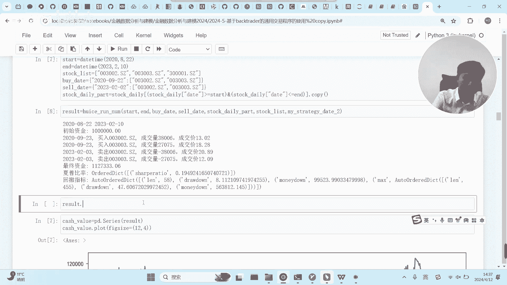

看见没啊，用这个方式可以显示出你整个投资的情况，因为我们这里引入了三只股票，看见没有，引入了三只股票，所以说他给了三条曲线，给了三条曲线，这个绿色向上的箭头是买入的意思，红色向下的箭头是红色。

向下的箭头是卖出的意思，我们在三只股票里面有两只股票，我们是做了操作的，所以说它这里有箭头来显示啊，镜头来显示最上面这个蓝线是你的资金。

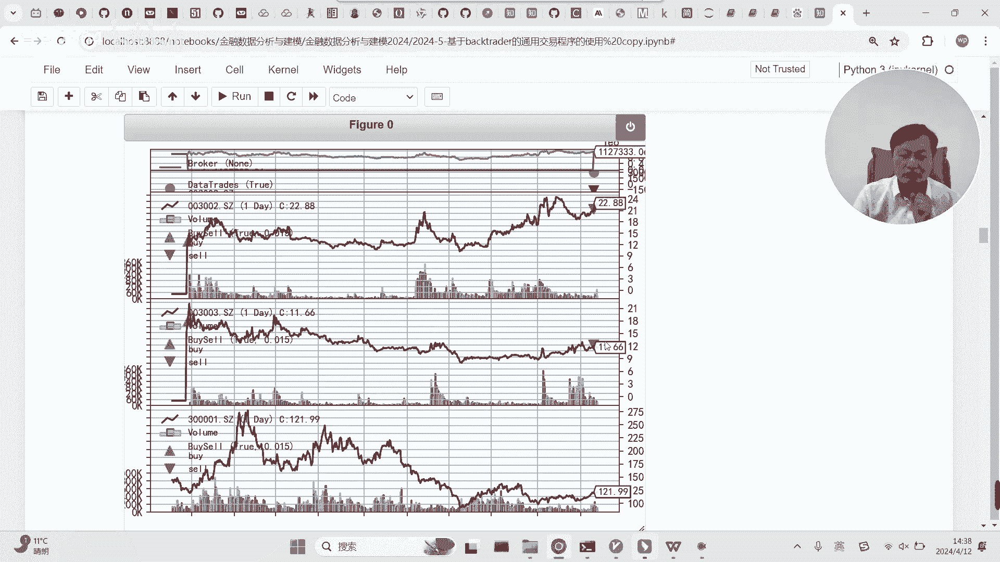

最终的一个收益情况还比较小啊。

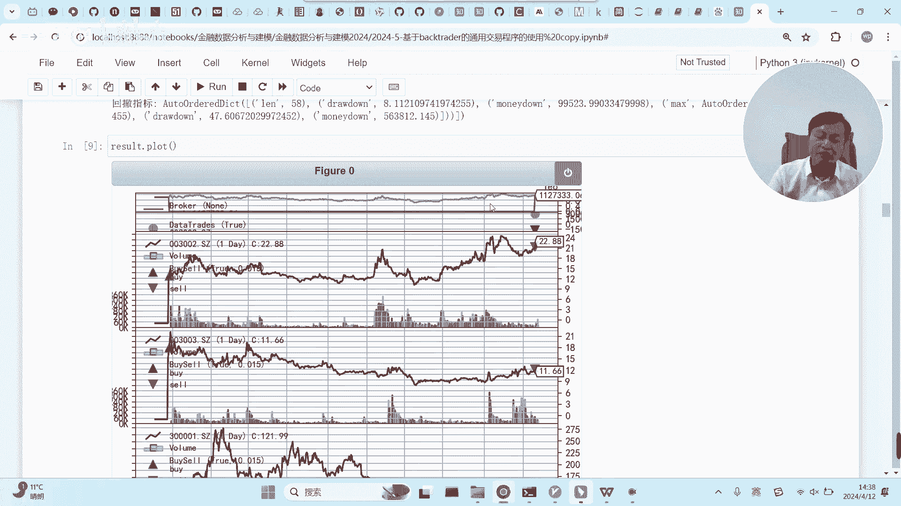

弄的比较小，下面这个股票我们自始至终没有做任何操作，所以说啊就没有啊，没有没有一些标识。

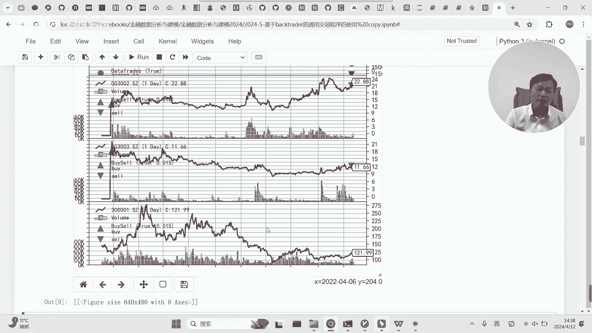

就这个三角形对应的是你买入买出的时间好吧。

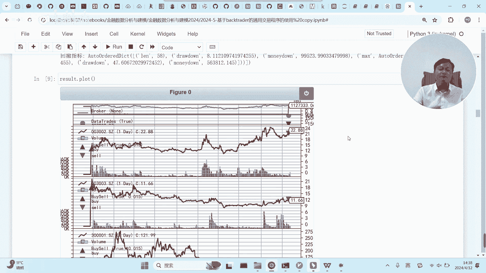

这是啊用这个方式来啊来输出最后的结果好吧，这是整个这个东西的用法好，现在我们，来尝试着用一下，尝试着用一下，在某个时间买入某个股票，然后卖出它，当然关键是什么呢，关键是比亚迪是哪只股票啊。

我们可以看一下，我看一下比亚迪是哪只股票，好比亚迪是这一次它的股票代码是这个，那么意味着呢，我们想用我们的东西来实现，我们这样一个简单的，就是在这个时间点买入比亚迪，然后在这个时间点终止卖出。

其实我也不清楚这个时间点有没有这个交易日，我看看啊，他最后的交易日是2月17号，那我们2月16号吧，这样的话保险一点是吧，2月16号卖出啊，卖这个卖这个股票，然后，我们只显示一行就行了。

我们只需要这两个啊，这样的话呢我们要怎么调用它呢，你尝试着拿一下这些东西，假设你已经把数据弄弄弄弄到了哈，我们需要，在这个时间点买入的话，我们的买入应该是这个，然后买入的对应的股票的代码呢是这个是吧。

那么其他的就不要了，我们只买一个股票，只买一个股票，然后卖出也是这个股票，时间是这个点，呃定一下这个交易的棋子，交易的其实只要大于我们的买入，买出的时间就行了，这个是我们把它弄成9月份吧，和2月10号。

我用这2月17号吧，这样就可以了啊，先运行一下，运行好了之后，然后我们把把这些值啊带到我们的函数里面去，带到我们的函数里面去，你看，啊，但实际上我应该是应该是卖卖的太太晚了，他应该。

因为时间只有那么多啊，我买我看一下看一下，最后几天13号吧，这样会好一点，因为我总共的数据只有这么多，我们改成13号卖出吧，诶他他怎么总是没有卖出呢，零二啊，对对对，我搞错了，应该有零二。

应该得有前导零啊，得有前导零，没有前导，零的话，他看不出来啊，是这个原因好吧，呃然后还可以把把结果做出来，把结果做出来，可以，啊又做不出来了，我看看啊。

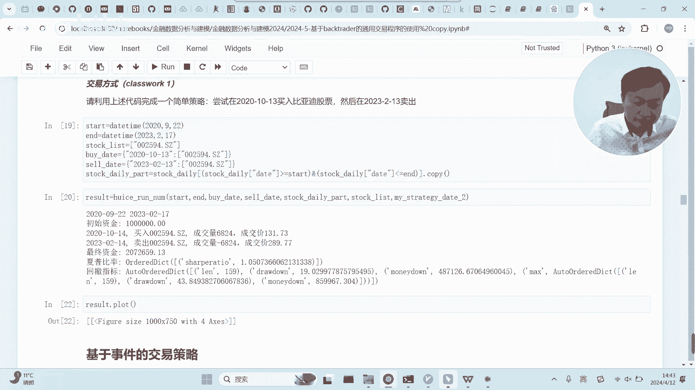

好这样他要把它摁掉，摁掉才能做一个，摁掉才能做一个，你看就是大概就是这么个情况，在这里买入。

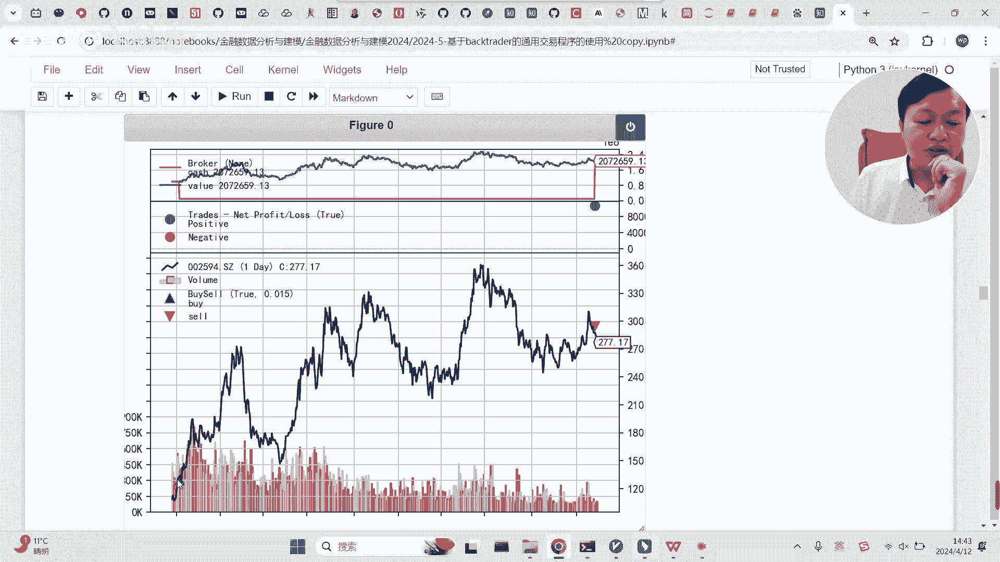

在这里卖出，最后的收益肯定比较高，因为比亚迪这两年一直在赚钱啊，翻了一倍是吧，好吧。

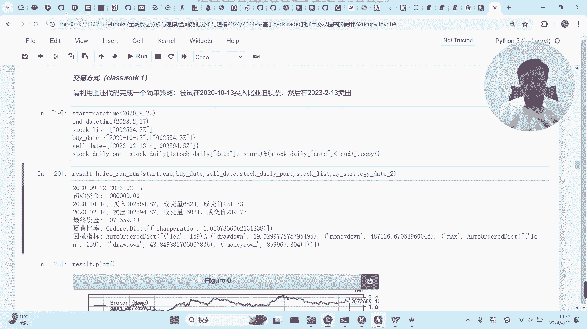

就是这么一个事情，同学们自己尝试一下，好不好。