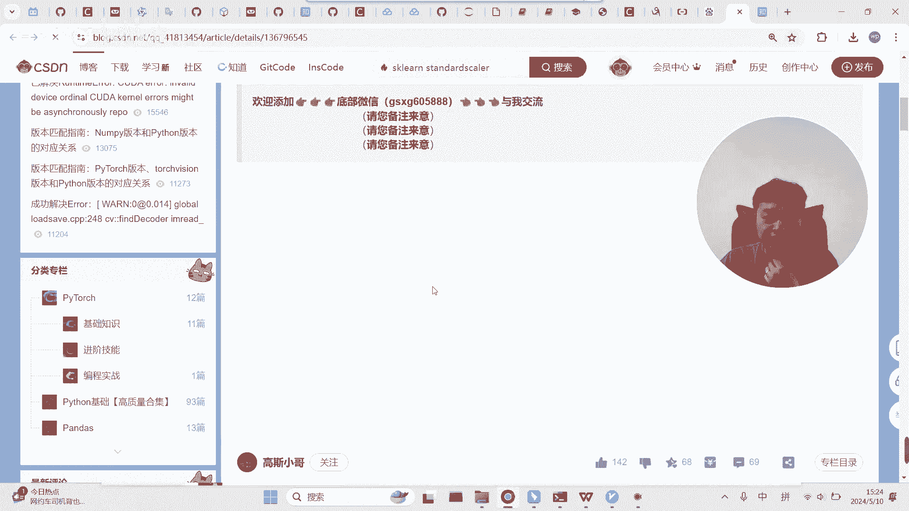
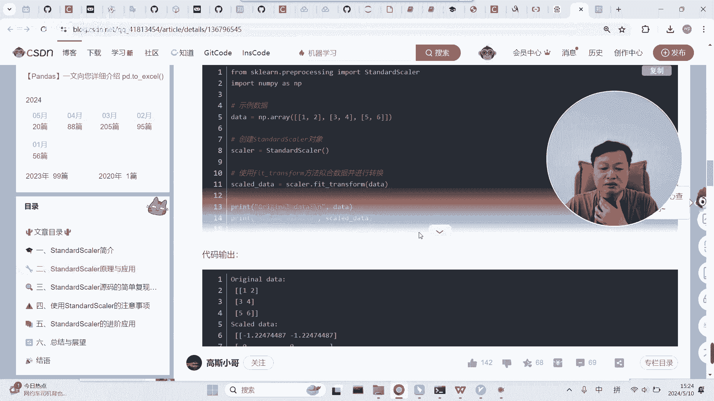
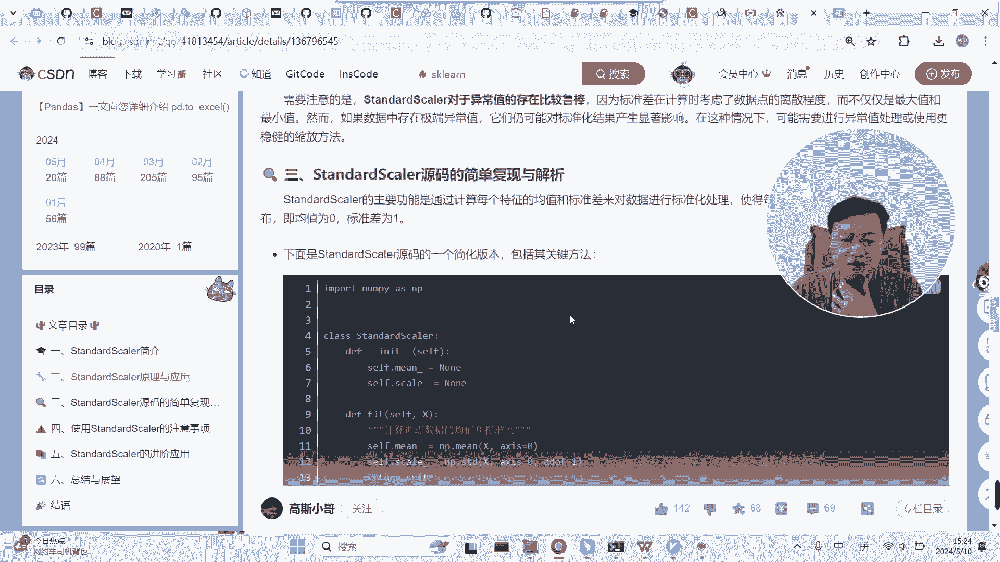
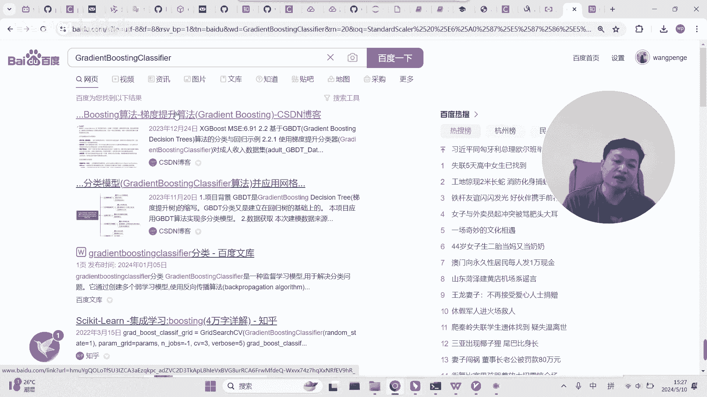
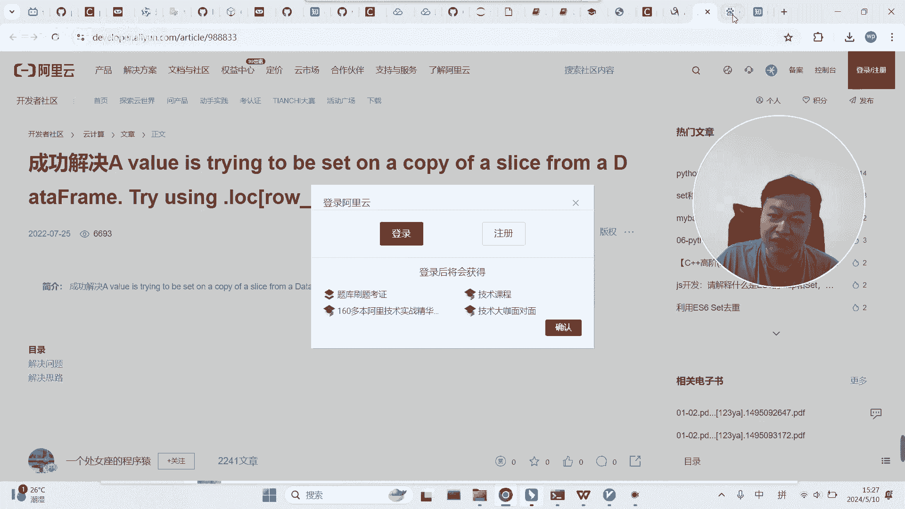
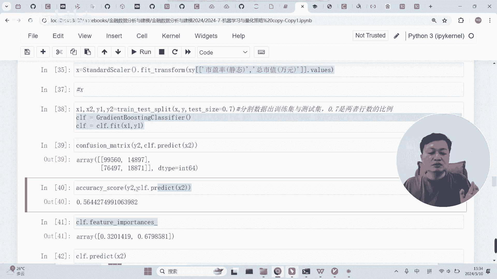

# 基于机器学习的股票涨跌预测-基本流程-量化金融与机器学习2024 - P1 - 背包2004 - BV1SS411F7b4

好有了我们刚才做了这个东西之后，基本上就有了我们的目标向量，然后我们的特征其实是现成的，因为我们老师老师刚讲，就是我们就拿最简单的两个特征，就是刚才我们因子分析里面用的一个市盈率，一个市值。

这两个东西做我们的特征都不拿多了，都不拉多，简单一点，然后呢我们刚才又把这个目标向量搞出来了，基本上我们的特征矩阵其实就就差不多了，因此呢我们接下来走我们机器学习的标准流程，标准流程啊。

我们先把这些包这些包先导进来啊，导进来可能会用到的一些东西，导进来之后呢，我们先要从我们已经建好的这个这个里面，来获取我们想要的东西，来获取我们想要的东西啊，这是我们建好了这个我们首先要拿什么呢。

我们首先得拿我们的，市盈率，嗯但是得再拿个框框啊，五个先拿拿我们的市盈率，然后呢拿我们的总市值，这两个我们作为我们的特征，然后呢还有一个目标向量，目标向量是什么呢，说明这个东西我们做好的，是吧。

啊拿这些东西这两个作为特征，这个呢就作为我们要预测的值啊，要预测的值，然后呢我们拿到了之后，我们看一下，你看有一些空子啊，有些空子这种东西肯定是要去掉的啊，这种东西肯定是要去掉的。

啊把所有包含空值的行给去掉啊，给去掉，这样的话我们的思想就很明确了，我们用这两个值来预测这个值啊，就这么个意思，这个值呢就是说就是未来30个交易日之后，到底是涨还是跌，涨还是跌啊。

就是用用用这两个来预测这个啊，就这么个意思，那么我们把这个给到我们的，做成我们的XXY啊，有了这个，然后呢我们要干嘛呢，我们先抽个样吧，我们还是要凑个样吧，点simple，为什么呢，为什么不要抽样。

我感觉有点样，本量有点大啊，因为大概是在我们这样本量多少，我看一下100万呢，100万其实没问题啊，其实运行得了，就是上课不太好好弄，因为它运行的话，很可能要好几分钟才能够，把这100万的数据给训练完。

我们抽一点吧，我们抽个几万就够了，所以取个取个什么呢，取个0。0。4，取个到一半，0。3，取个这个吧，取个样吧，这样的话我们是几万，20几万，20几万可能可以，因为我们的特征数也不多，只有两个。

上课玩一玩应该是可以的啊，上课玩一玩是可以的，有二三十万的数据吗，呃这个弄好了，弄好了之后呢，我们先要干嘛呢，我们要给要拿我们的目标向量YY的话，就是XY的这个，X y z，好然后我们先拿出来看看吧。

拿了这个之后要干嘛呢，还得还得那个啊，还得values，要取它的值啊，这样的话这就是我们的Y了，Y就是这个了，也就是我们的目标向量了，你们放一起吧，Y拿到了，然后是xx的话，我们得取什么呢，得取XY的。

这两个是吧，得取这两个好，得取这两个，取这两个的什么呢，取这两个的values是不是取这两个的value，这应该就是我们的X，但是呢这个X啊他要搞一个事情，这个还没有做标准化呢。

啊我们这个值差异性太大了啊，肯定是要做一些标准化的，甚至其实还要做一些什么呢，还要把一些极值给抛掉，但是我们现在先不搞这么复杂，我们就仅仅是做一个标准化啊就行了啊，大家可还记得什么是标准化。

这个我们我们搜一下给大家看看吧，所谓的标准化是啥意思呢，就是，有没有公司呀，我看看我找一个有公司的网网页。

随便跟同学们讲两句就行了吧，标准化其实就是把它搞成一个。

是用这样这个方式来做的标准化，然后没有公司说一说吗。

没有公司给我看看，我我有点忘了那个链接在哪里了，我之前看得到，但是，这的话，就是它自身的值减去均值，然后再除以方差，好像是大概是这样子啊，啊就是这么个意思啊，老是找不到公司就算了吧，同学们自己查一查啊。

就是因为我们这里的这些值啊，啊，我们这里的这些词肯定是有很大的差异性的啊，肯定是要做一个标准化的啊，要做一个标准化的，啊这个代码老师在前面有啊，你看这里这里有太长了，我就拷贝拷贝放在这里啊。

就是用这个方式啊，用这个用这个东西啊，这里我们已经导入了，然后然后做一个这样的一个标准化，那这样的话给到我们的X啊，给到我们的X，这样的话它的这里面的值呢，就不会就会变成一个标准的啊。

0~1之间的一个值啊，0~1还是零到V1，大概就是这样的一个值啊，有了X有了Y，那么我们就可以干嘛呢，可以做训练了，但是训练之前大家也都知道，是要做训练集和测试集的分割的。

是不是得用这个函数对训练集和测试集做分割，所以说呢我们要把这个做好的X放到这里，然后做好的Y呢放到这里，这样会是什么呢，会是X1和Y1是占70%，然后呢呃测试集是X2和Y2占30%。

然后我们的模型呢用的是我们的呃，决策树啊，应该是，GBDT啊啊是不是一个变种的一个决策树，变种的决策数名字我有点忘了哈，你忘了是一个变种的一个决策树，梯度提升算法，一个梯度提升梯度提升。

它是它是一个集成学习。

集成学习这个啊，以老师的经验。

为什么老师一上来就用这个呢，sk learn的这个包里面最好的算法，可能就是这个东西，当然不是一不是一定的，但是以我的经验来说，在很多问题里面啊，这个方法应该是sk learn，这个包里面比较好的了。

效果比较好，所以老师一上来就用它了，就没有用很基础的东西啊，当然如果你可以，你可以把这个函数改一改啊，你可以试一下别的，试一下别的，而且老师也没调参，直接用它的默认参数，然后这是把算法实例化。

实际画好了之后呢，把我们的训练集放进去，这样的话模型就出来了啊，五星就出了20多万数据，两个两个特征还是很简单的，可能一小会儿就能出结果啊，好好，然后呢，接下来就是一些代码都有的，这个是干嘛呢。

这个是算这个是算什么呢，这个是算我们的测试题的，通过测试题来来做预测，就是测试题通过测试题的特征，算出对应的目标向量，然后和什么呢，然后和真实的目标向量进行对比，这个是来做，这是来做混淆矩阵的。

这是二分类问题或者多分类问题，经常会用的混淆矩阵啊啊，就是这么个情况，这个混淆矩阵大家大家了，不了解什么是混淆矩阵，我又又又得找一找了，混淆矩阵也是很好理解的啊，我看能不能比较简单的找到相关的说法啊。

啊这这样东西就是混淆矩阵啊，就是混淆矩阵，就是我们是二分类吗，是吧，是零和一，是不是大家注意点对角线的位置是什么呢，就是预测对的，对角线的地方就是预测对的啊，你看所以我们这个是预测对了的。

这个是预测对了，为什么有两个呢，有一个是零内，有一个是一类哈啊这应该是零内吧，这应该是零内吧，这应该是一类，就是这些我们是预测对了，相反的这个都是预测错的啊，在对角线外面都预测错了，就他本来是啊。

本来是可能是，一类，但是被我们预测成了零类，就是这个意思啊，这是预测错的啊，这是预测对的，这是混淆矩阵，然后我们看一下我们的准确度，准确度，0。56，也就是说56%的准确率，如果就是瞎猜蒙。

瞎蒙应该是50%啊，瞎蒙是50%，我们比瞎蒙好一点点，是不是比瞎蒙好一点点哈，比瞎蒙好一点点啊，说明说明这个机器学习还有那么一点点效果，就是什么呢，就是用当天的市盈率和总市值，来预测30天之后的涨跌啊。

我们这个比加盟稍微好点啊，稍微好点好吧啊，这是啊这两个东西啊，一个是混淆矩阵，一个是那个呃准确度，我们这里不需要用F1score啊，为什么呢，F1过是用来评判呃，是用来主要是给的推荐算法。

就是样本不均衡的时候啊，用F1F1时过比较合适，但是这里的话，我它是样本还是没有那么不均衡啊，样本还行，虽然说正样本应该是比负样本要少，因为在熊市的时候，正样本肯定是比负样本要少。

但是不至于没到完全不均衡的情况，所以说我们的准确度其实就有，能一定程度上反映这个事情了，不太需要FX过啊，然后这个是干嘛呢，这是模型的特征，重要性我们是两个特征，是不是一个是市盈率，一个是市值。

看来市值这个特征效果会重要性会高一点，会高一点啊啊这个就是对特征进行预测啊，预测的啊，这个比较重要哈，这个比较重要，这个是啥呢，这个是这个东西，这个东西是啥呢，这个东西应该是他对于啊。

他对于这个样本到底是处于零，还是一这个东西的一个呃得分什么意思呢，你看第一个样本是不是零，它的0号位就是大一点，懂吗，它大一点就是零，这个是他这个是什么，这个是第一个样本，是为零啊。

他预测值为零的概率是他认为是54%，预测值为一的概率是45%，所以说他通过这两个词最后决定让它变成零，能理解吗，所以这个是啊，每一个样本处于哪个分类的一个概率啊，概率值这个其实是有一定用处的啊。

有一定用处的，待会有用啊，待会有用，现在我们同学了解一下就行了好吧，同学们把这个事情实现一下好不好，就是机器学习的基本流程实现一下，无非就是什么呢，就是抽样，我们抽一点，其实可以不抽样。

只要你机器够强大啊，老师就是为了上课快一点抽样，然后呢做标准化，然后呢分割，然后做训练，然后做评价啊，用我们的混淆矩阵和准确度做评价。

就这么回事。