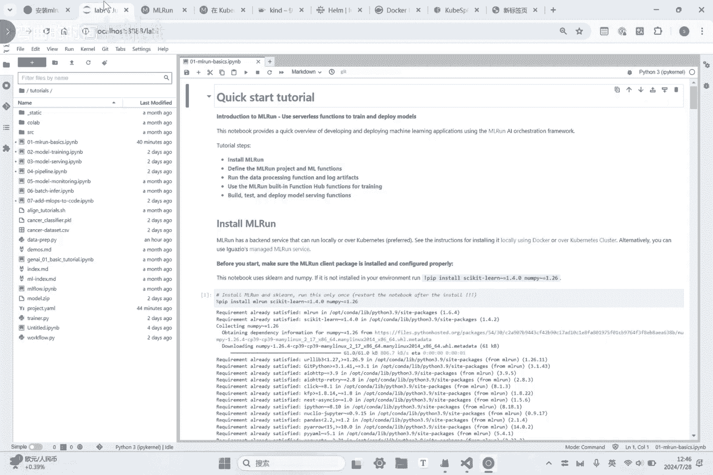
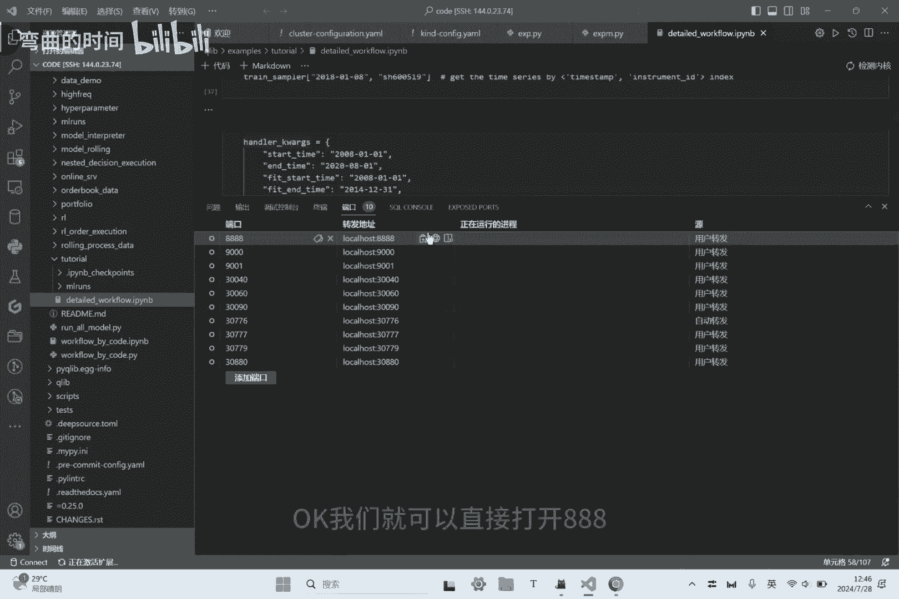
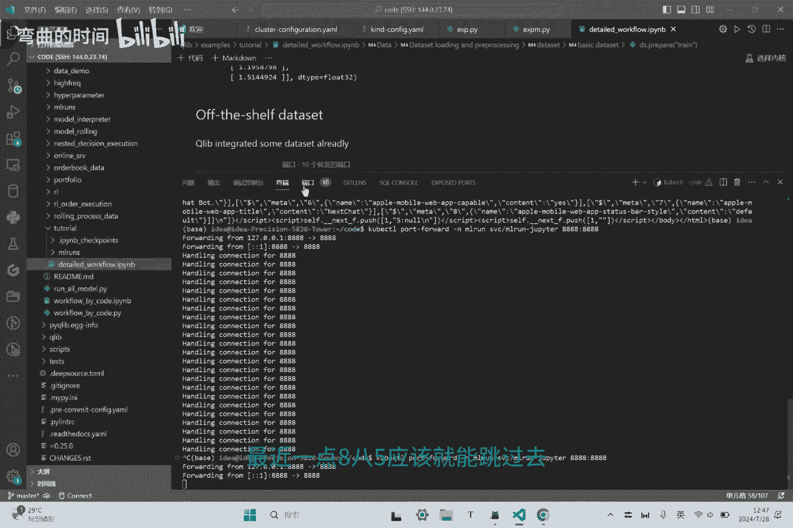
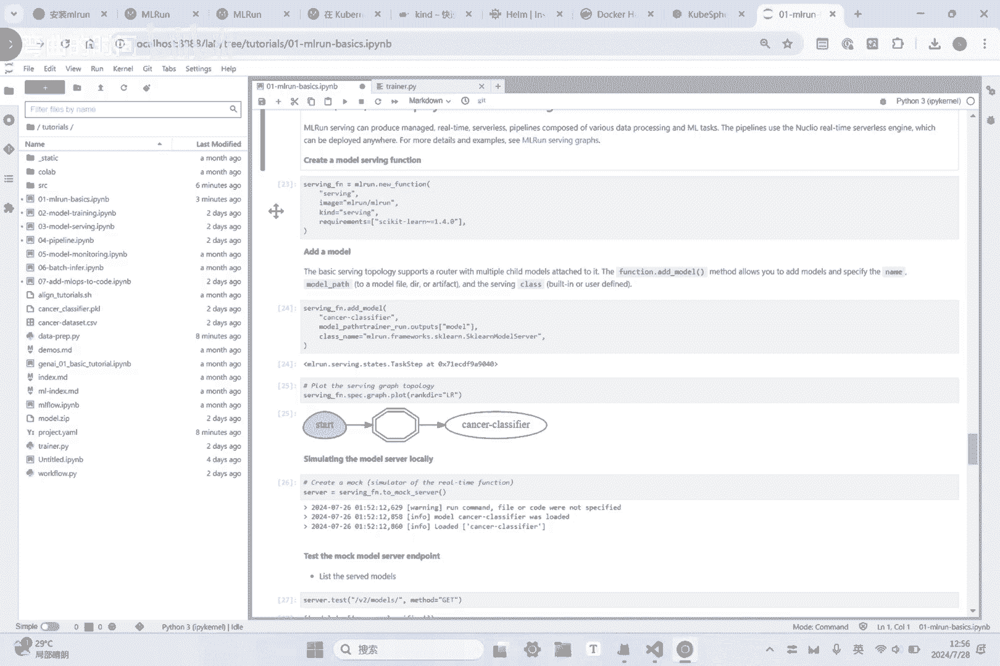

# 基于机器学习的量化交易框架打完收工 - P1 - 弯曲的时间 - BV1E1421t7yx

Hello，各位大家中午好，今天我们沟通一下关于量化交易的基础啊，机器学习，机器学习的基础，I'm wrong，然后我们看一下m run的安装方式，现在目前来讲呢m run方式呢有两种。

第一个是基于docker，第二个呢是基于COOKIDOCKER的话，我们上一次大概讲了一点点啊，就是如何去安装，就是这一个安装的方式呢，非常简单，就是单纯的把一些配置文件，然后去，停练一下就好了。

其实它没有那么复杂，简单的就可以用，一个docker来执行就好了，就是你只要对docker比较熟的话，其实这个非常简单，就是把这个配置文件下载下来，然后把这些环境变量配置一下。

然后执行一下这个docker compose就完事了，就非常简单，如果你想用那个reader来使用的话，那么其实你就用下下面这一个来去执行就好了，但是实际上我个人在安装的时候。

确实有很多的这种demo似的，在用这种docker的方式来去执行的时候，我发现有一些是失败的，有一些细节我可能也不是很清楚，但是为了我个人在进行量化交易的模型，训练的这个过程当中，不受到这个环境的影响。

所以我还是采用coolness ice的方式来去进行，EMERON的安装，那么今天我就重点讲一下用啊COBNICE的，就是他这个在这个里面他也是这样写的，因store i'm wrong on。

在COBANIZE上安装am wrong，它这个里面有一些先决条件，第一个先决条件呢是啊，就是非常简单，就是要有CPIZE对吧，然后嗯他也需要有一些版本的支持，那么我这边其实没有装1。2，也没有装1。

26，我装的是1。3002，是最新的版本，其实影响也没那么大，第二个呢是你要有这个命令行的工具啊，啊could be c t l，这里面他还给你了一个链接，就是然后CTRL的安装说明。

我们可以也可以打开看一下，就是如何去，就是因为我全程都是在LINUX上去执行的，所以大家也可以用这种方式，就是一行命令就可以把它弄，就是比较简单，但如果是这个里面也有一个介绍，是用kind。

就是他这里面也有非常非常明确的一个介绍，我这边也用，用这个翻译啊给大家看一下，就是kind的允许你在本地计算机上运行COBI，但是前提条件就是你要安装docker或者是PORTMAN。

那么client create start的页面呢，我们可以打开这一个快速启动页面，对这，那其实就跳转到嗯find的这个页面上去，那么它这个里面也介绍了安装time的方式，其实这个大家那也非常简单。

直接安装就好了，安装完成之后呢，呃我们就可以建立集群啊，创建集群的话，在这个里面也有介绍creating啊，嗯cluster其实简单一点就是直接执行对象命令，Kind great cluster。

然后这个里面会有一些参数啊，什么imagine啊什么的，你需要锁定一些版本啊，还有一个等待时间呀等等这些东西，当然前提条件就是你需要提前安装一下这个，docker或者图什么，其实这一些其实就蛮简单的。

这里就不再赘述了，你比如说这个里面是就是安装了一些嗯，接这个介绍，按你想删除也很简单，就是一行命令delete和image加载到集群里面去，有一些，也可以做一些集群，这里面就不做详细赘述了。

因为这个里面这些脚本呢其实，这是一方面，那么在这个基础上呢，我们还需要安装这个help，爱好的话，这个里面也会有一个详细的说明，大家也可以倒过来，然后我们去看一下help。

这里面你需要下载一个版本后解压，解压之后，然后移动到这个UIFU口这个里面，然后增加一个stable的re否，下面就是一个比较明确的介绍啊，执行一下就完事了，也非常简单非常简单。

下面这个是在乌班图的条件下进行的，比如我就是用这个方法去，这个是help help的这个条件，我这边也介绍，然后还有个是docker，docker的话，你需要注册一下，这一个呢有一点点困难啊。

困难应该是就是你在这个地方去注册一个账号，然后在使用一些相关的镜像的时候，在这个里面就会自动拉起来，那这个里面有一个困难是什么，困难就是现在的docker呢啊，国内访问不了，那么你需要想一些特殊的办法。

然后解决这个问题，还有就是存储要求，然后就没没了，然后存储一零了，八个G内存要求九八个G，然后我们装的是个社区版，社区版的话，他这个里面包含了一些组件，比如安装装，包括APIUUI，还有那个数据库。

还有NUK里边，这是一个微服务，还有主BER，主BER，还有一些集成，还有这个MPI的一个operator，还有一个存储mini，这就是协议跟艾S算是一样的，还有spark的operator。

还有papine pop line是cobe flow的part，这个我用的比较少，还有那个监控的promise juice，还有那个笔画监控的笔画叫banner。

然后下面就是安装一些就是安装一些chat，chat的话，这里面有一些介绍，就是首先创建一个命名空间，然后呢就把这个加到这个分数库里面去，然后大家也可以list的看一下，然后下一步的话就是更新一下。

更新完了之后呢，创建一个密钥，理解就就就是密钥啊，密钥完了之后呢，这里边把你的这个申请的这个docker的这个账号，密码填一下，然后邮箱填一下啊，啊这一个其实你完全按照他的格式来优化。

我这边呢其实也也做了一个示例，就是在我的这个版本详细的安装的一个过程，然后安装完了之后呢，再下一步我们就要去安装em on amir的话，它这个里面嗯是直接按照这个命令安装安装的。

但我用这个命令可能会有一点点问题，所以呢我就把这一个MRCE的这一个啊GITHUB，然后下载下来，下载下来了之后呢，然后执行的是本地的安装，这里面有三，在这个里面呢是是在哪里，是在这里。

我先把它下载下来，CLN一下，然后签到这一个目录里面，然后去再check check out那个开发者的这个环境，然后下面的工作就是跟上面的一样，然后就是去执行这个M，然后这个地方稍微调一下。

就是这个二次M2就是统一的一个环境，OK这样的话我们就把整个的环境安装好了，安装好了之后呢，其实我们的额就可以有，有有各种各种地方的这个安装，你就可以在这个里面去打开了，36050啊，30060。

36070，但是这个这个里面呢你就啊你就直接可以啊，用这些方法来去去访问，然后直接等下就可以访问嗯，但是你在嗯，但是你那个集群啊，因为我们是在那个课外的集群里，所以他这个里面还有一个穿透的问题。

好像啥都没问题，完全穿透的问题的话，其实也有一些方案，就是这边其实在这个里面也加了一个穿透的，比如说我们这个皮垫直接使用这个这一行命令，把8888，然后切到我们的一的那个，那这样的话我们就安装完成了。

安装完成之后呢，就是准备点我们就可以打。

OK我们就可以直接打开8888。

稍微切一下，执行一下，就叭叭叭应该就能跳过去了。

那我们那个主频点就就装好了，装好了之后呢，然后我们的MR的一个UI也装好了，其实就在这里，在这个里面我其实就没切了，直接用了那个30060这一个，来去实现就好了，然后这样的话我们整个的环境就装好了。

装好了之后呢，如果我们想试泡一下，试用一下的话，这个里面它原声呢就带了一些这个demo，你比如说去执行一下，执行一下，安装一下这个工具呀，然后在这里面去执行导入是吧。

然后这个里面去锁定自己的那个工程目录，下面这一个呢就是前面这两个呢，是整个的环境的基础啊，下面这一个呢就是他需要把这个数据导入进来，导入进来了之后呢，然后去啊他这个里面就加了一个J啊，就加了一个句柄。

其他的其实就是一个传统的机器学习的一个，然后他这个里面就是set一下，把这一个嗯做了一个job，做了一个job，然后他这个里面其实在运行的时候，是以啊容器的方式来来运行的，然后然后他就run一下。

run一下的话，那么就把这个相应的数据呢，然后去加载进来，加载进来的话，你想做一些可视化的东西，其实你就可以在另外一个页面给他跑完了，我们看就是在哪个里面，就是quick对，亏个车头表对，完了之后呢。

这个里面他会有收入，然后有这个考这个数据，这个数据它会反正到了一个S3啊，S3其实就是亚马逊的一个标配的一个模式，其实但是它后端用的是mu，然后可视化的数据就非常直观，你就会发现如果我们用这套方案的话。

其实整个q lip的使用就非常舒服，对啊就离谱气，为什么大家觉得是微软开源的这个工具，大家都觉得它很好，但是就是用不起来的，就是在这个点，就是这个点呢，就是就会发现呃他做可视化做的不好。

因为呃微软它用的是m flow，m flow的话，他的这个可视化这种跟踪啊，记录啊这种东西就明显不如m m one，这也是我为什么用m wrong，选择m run的一个非常重要，非常的。

也是我这个花这么大的力气去搞这件事情的，非常非常重要的一点，然后把数据加载进来之后，当然你也可以用命令行的形式，然后去看他的是否完成啦，然后看到的输出啊，当然你可以用。

把那个数据以data frame形式做一个展示，额，在那个UI的形式做一个展示是一样的，另外呢这个里面你也可以啊，用这个内置的函数来去执行the china auto。

china auto trainer的这个啊，我看您是在这里，这个代码呢就是auto trainer的，然后它是一个呃典型的一个机器学习的算法，用的思科认，然后用了一个GB啊，GB就可以分类啊。

然后他这个里面唯一的一行就是加了这个，然后把这些相关的数据加载进来，好执行完之后呢，我们去按照去run一下，run一下的话，那么我们就可以看到然实实在在会跑，它这个里面会这个job就会在后台运行。

然后这个BD用的就是how to train a train，其实这个pod其实走的是PROMAX，其实我们如果看一下我们的coo covista，这个里面，其实它这个里面应该是有一个。

里面应该是都会创建一个auto trainer，这是对这个down是运行中的，你就可以看到它实际执行，其实是在这个那库洛nice集群这边去执行，然后啊他这个是跑完了，跑完了之后。

其实我们就可以在呃在这个可视化里面，我们可以看一下他训练的结果，就是这一个这一个的话，你会发现它有一个盖了，非常非常非常整齐的一个盖子，然后它是包含这个函数在哪里，你可以看到它函数是在哪里。

代码也会给你非常非常明确的哎，看到诶你这个开发的代码是怎么样的，编辑的日志是什么呀，你整个的一个情况是什么样，什么时候运行什么样都会有些完整的呈现，然后另外呢呃会有一些LIL，有一些标签是谁开发的呀。

这个版本安卓one的版本是什么，用这个Python的版本boss是什么，输出在哪里面，我们可以看一下这个输入输入呢，就是刚才我们的那个做的输入输出的话，他会有一些嗯可视化的分析啊。

他实际也可以把它在这个里面去看，那我们为了方便，其实它它这个里面其实有有很多东西，可以看他的认错，那么它这个里面就会有它的哈希他的key对吧，然后他的版本等等都会有完整的东西路径。

UIL和他的UID对吧，然后的供应时间存储明通except，然后你可以做PREVIE6，但有的时候会发现这个朋友用就非常舒服，知道吧，你就你就不需要画图啊，所以我们不需要做这种这种东西。

嗯就自然而然的就嗯，非常方便的就能看到他的这个模型，训练的一些结果，然后你就会呃，非常舒服非常舒服，然后还用了一些什么方法，用的是放放在这，然后你可以下载啊，然后当然你也可以用这个三角图。

你也可以pop out，当然你也可以下载，下载下来你就可以，其实它是一个HTML，他整个的机器学习的这个这个曲线，就非常的你会发现非常的舒服，然后但是它下面还有一个混淆矩阵，还有一个特征特种。

每一个特征的情况就一些非常非常，就是你传统的这个机器学习的一些一些东西，你就会非常舒服的人去用，你就再也不用关心啊，跟机器学习这个环境相关的内容，因为这些东西他都给你做的非常完整。

然后下面的话就是它的一些输出的结果效率啊，F1啊，precision啊，精确率啊，然后召回率啊对吧，然后它的呃feature importance呀，就这些都都会给你告诉你放到哪里去了。

也大概是这么一个样子，然后就是今天就是给大家介绍一下呢，到目前为止，我们基于我们要实现的，我认为就是这个样子，基于啊JULIVE的i'm round和cube，IZE的基础上去实现下一个逻辑。

那后面呢我就不会再对框架做任何的去探索，我认为这一个对我来讲就是成熟的够用的，那么下一步的工作重点就放在模型的编辑啊，训练在这这一部分工作，我认为我我的整个的平台的设计已经完成行好。

那就这样啦。