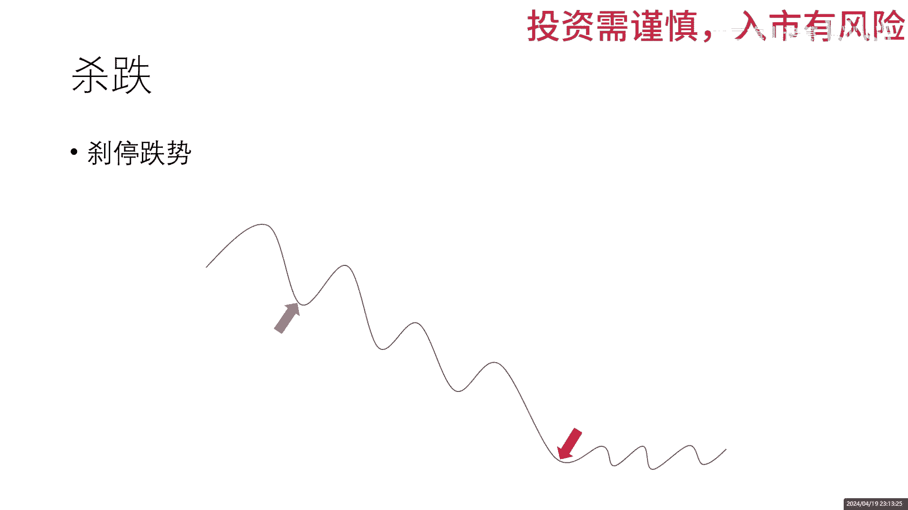

# 基于机器学习的量化策略第7期-闲聊近况和追涨杀跌 - P1 - 西二旗小诸葛 - BV17H4y1T7xb

晚上好呀，很久没有做视频了，今天正好有时间啊，来和大家分享一下最近的一些经历吧，哦还是和之前一样，先放收益的曲线出来，然后左侧是从去年3月10号到今天的啊，应该是今天更新以后就超过30%了。

正好是一个新高，然后右侧的是从今年第一个交易日到今天的啊，今天的还没更新到昨天的4月10日嗯，4月18号的，反正今年大盘是比较好了，所以说跑赢大盘也很艰难，那3月份的时候一直是跑输大盘的。

基本上就是这么个情况，不过比较好的一点是，去年希望做到的事情都已经做到了，割了一次肉，然后呢也加入了周线的信号，总的来看结果还不错吧，哥的这次肉也是我看一下，应该没有泄露具体的信息啊。

对没有泄露具体的信息，那嗯反正割的这次之后割的是比较狠吧，嗯割肉那天应该是年报出来吧，挂跌停跑的，当时还发了一个动态，确实是跑掉了嗯，虽然后来又接回来了，但是确实不太打算长期持有吧，赚一个波动就好了。

3月份的时候基本上都是跑输大盘的，唉太难了太难了，真的是太难了，后面简单分享一下，我对于追涨杀跌的这四个字的一个理解吧，我之前好像也聊过，就是追追的是涨势嘛，杀杀的是跌势啊，就是我们看曲线就可以了啊。

还是比较清楚的，那追逐涨势，那什么叫涨势呢，就是嗯我在涨势起来的时候追进去，然后在涨势结束的时候，或者说在中段把它给卖掉，吃的是上涨的这段的收益就是红啊，绿色的箭头是真正的追涨A这个位置。

绿色箭头是追涨的位置，那当然很多时候我们我们说啊，有的时候追涨杀跌啊，哎呀那个亏了，那那个时候通常都是在红色的位置追涨，追进去了，嗯反正这是我的习惯吧，我的习惯应该是在绿色的时候去追涨。

然后另外一个刹停跌势其实也是一个意思啊，当破了一些技术性或者说模型给出了止跌啊，不不不不是止跌啊，是止损割肉的一个信号的时候，那就赶紧出，别等到了跌跌跌一直跌，跌到了红色箭头的位置，那再杀。

那那那那那不亏那不亏更多了，所以这是我理解的追涨杀跌的意思，因为后台嗯最近没更视频的话，其实后台跟不少朋友在聊天的，所以说嗯有聊到这个事儿吧，反正这是我的一个小的理解，然后后续呢。

后续估计其实现在加上周线的信号之后，操作的频率是变得越来越低了，因为我我看一下，我印象里已经很长时间没有去卖过股票了，就是只有当有明确的卖出的信号的时候，我才去买，我看一下我上次挂单是什么时候。

历史成交是在哦，不好意思，历史成交最近的是在4月17号哈，今天4月19号哦，哦也没有那么好，也没有那么的，也没有想象中的那么低频，4月17号买入，4月11号买入，4月11号还有一个分红。

然后4月2号买入，反正没有卖出了，哦4月1号卖出了，4月1号就是割肉的那一笔，好吧哦，好像也没有想象的那么低的频率，不过正常来说确实是之前买的，还有现在买的嗯，感觉频率操作的频率是比以前低了很多的。

因为我去年基本上嗯，反正券商给出来的统计是去年操作了100多次，我觉得今年不会有那么多，这就是周线的信号吧，唉基本就是这样，我们就聊到这儿。

