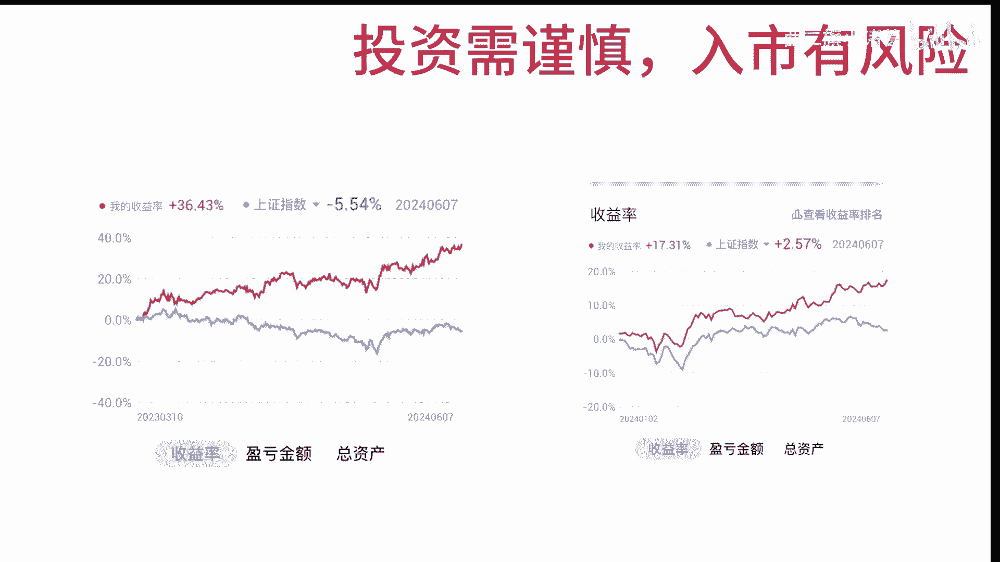
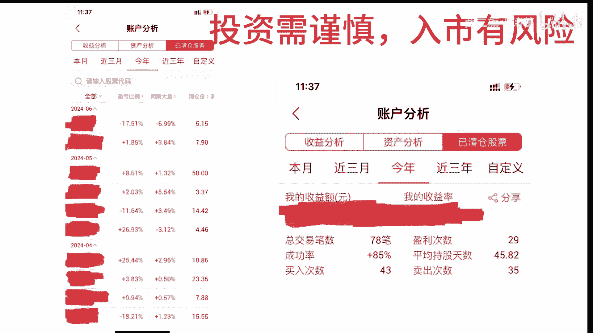
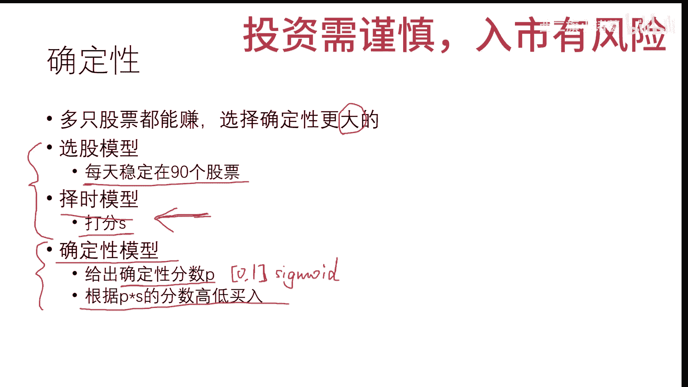
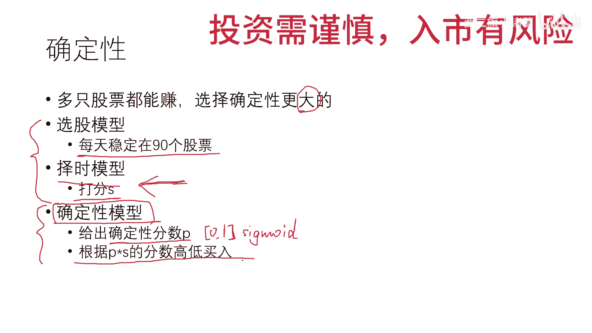

# 基于机器学习的量化策略第8期-闲聊确定性！ - P1 - 西二旗小诸葛 - BV1Dn4y197fs

好那大家好久不见啦，趁着这次端午节，端午假期，也趁着这次收益率创新高，来分享一下近况吧，嗯确实是有一些变化，也确实收获到了不少东西啊，现在界面上的应该是从2023年3月份额，3月10号到今天的收益情况。

收益曲线，还有今年的收益曲线，那今年收益曲线就一般啦，因为我看网上很多人都已经到二三十三四十了，而雪球上的黑色格好像已经翻倍了，所以说唉这个收益率嗯一般吧，而且今年的大盘也很强对吧，大盘正二。

所以说好像在这个好像在大盘趋势良好的时候，我的策略偏保守一些，而且我现在仓位已经降到70了，额不到七十六十八吧，就按照70算吧，所以说好像偏保守一些嗯，左边的话是从23年3月10号开始的。

总的来说还是一直在往上去运行的，啊接下来这两张图，我再检查一下有没有违反B站规定的地方，应该没有啊，具体的股票的名称和代码都抹掉了，哎应该没有啊，这两张图是今年的情况啦。

那今年可以说是圆满完成了去年的目标，坚决割肉，坚决这个叫什么，坚决割肉，坚决止损啊，三次大的止损额，第一条就是左边的第一条-17，然后清盘的呃，清仓的是昨天刚刚清仓的复时期，实在是坚持不下去了。

然后24年5月份一次-11清仓，2024年4月份一次-18清仓，这次三次大笔的清仓，也确实是避免了后续的进一步的下跌，嗯右侧这个是今年的，具体的统计的情况了，而成功率成功率终于不再是百分之百了。

是不是85%了，坚决割肉额，平均持股天数也是显著的上升啊，去年最低的时候，平均持股天数是五还是几吧，呃今年的话就上涨到了45天。

也确实我们之前也聊过，加了周线的判断之后，这个持股天数是显著的，在往上涨的，这个我自己的体会也非常明显，那最后就是模型了，模型的话呃，因为后台也在跟有些朋友在聊，然后我看到有些看到视频的朋友。

也觉得没有涉及到太大的机器学，机器学习的内容啊，因为这部分已经模型确型嗯，模型确实是已经固定下来了，嗯最近的话也加了一个模型，加了一个这个确定性模型，我们来看一下是什么意思吧，就是说确定性。

因为嗯现在整个市场当中有几千只股票对吧，四五千只股票，那总有那些好的那尾巴的，我们就不去管它了，有那些s st的，那当然有些这个网友分享出来的，他们会去赌，会去拼这个s st的。

那但是他他不是我的风格呀，他嗯我之前就说过，可能我的风格偏保守，我不希望去损失本金，我也不希望去赌，所以说呃那些排在后面的，肯定就不是我的这个范围了，就不在我的考虑范围内了。

那我选择的一般都是这种确定性更大的，换句话说就是多只股票都能赚，那选择确定性更强的，选择确定性更高的更大的，那什么意思呢，就是有一些行业它本身就很好对吧，它毛利率很高的，现金流很强的，然后呢。

那这些行业里边，它就是会有很多股票都是能赚的，根据我们的选股的模型选出来，你像我现在的选股模型，基本上每天稳定在90个股票那一，那有的时候多的是100多个了，那少的时候就是90多个。

所以说这些票里边儿它它都是能赚的，那我们不能每一个都买啊，那总共就那么点钱，那每个都买，那那也那也太分散了吧，我们总不能自己呃，散户自己操作，再搞一个自己的什么，这叫什么量化基金出来，这这太累了。

所以说就是在这些票里边，选那些确定性更高的就可以了，比如有一只股票95%的可能性能涨，还有一只是80%的可能性能涨，那选哪个呢，那如果是我的话，我肯定会选那个95%会涨的呀。

所以说在这的话选的是确定性更强的，这个大的这个大字啊，这个大字好像有点奇怪，确定性更高的吧，确定性更高的嗯，下面是三个模型了啊，我去年是这两个选股跟择时，这选股好像去年也是这样，每天稳定90多个呃。

90多吧，有的时候多一点，有的时候能到120，我看到有120的时候，然后择时呢择时就是一个给一个分数S，这个S的话我还会有一些呃，因为它毕竟涉及到行业嘛，就像我刚才说的。

你有的行业在那一段时间他分数就是高，那你也不能嗯一个行业里全五只，然后所有钱都到这一个行业里吧，这个这个就这个就不太对了，所以打出来分以后，我会根据行业再去选额，这个是去年的两个模型。

然后今年新加的是这个确定性的模型，那当然在择时的时候加了加了这个周线了，这个我们在过年的那一天聊过对吧，嗯刚才也聊过，说这个是新加上的确定性的分数，这个有一个确定性的分数P，这个P就是0~1之间的。

这个如果大家对深度学习呃，对深度学习或者机器学习熟的话，就是一个sigma的，就是0~1之间的一个值，然后呢，这个值因为这个择时的这个择时的模型，我没有动，我也我一直没有动，就除了加这个周线信号以外。

我没有动它，我只是乘了这样的一个分数，然后根据P上S的分数高低来买入，那那排的高的，那我就买呀，就是这个是新加的一个一个一个内容。

基本上就是这样的，然后如果说大家有什么想聊的，也可以在后台给我发消息，我一般嗯啊最近这段时间是比较忙了，忙过去以后嗯应该就可以了，有什么想聊的都可以在后台聊好吧，只要不违反B站的规定，都可以在后台聊。

那这基本就是这些内容了，大家端午快乐。

