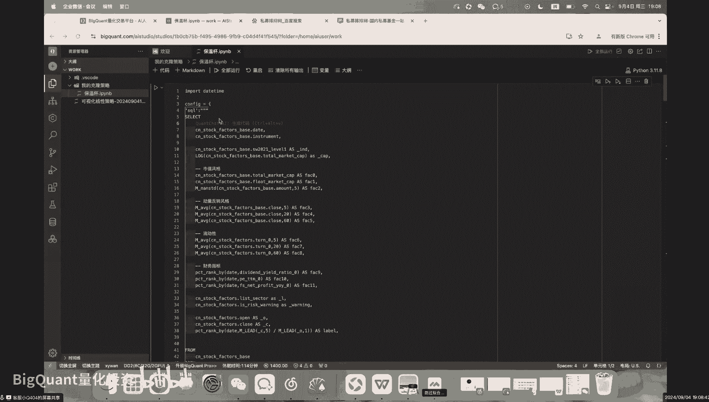
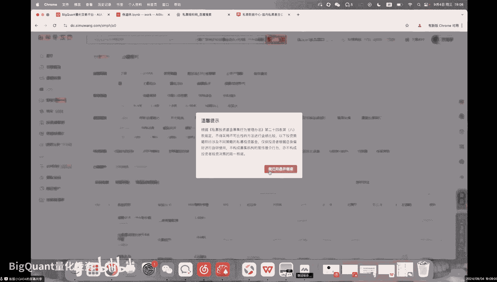
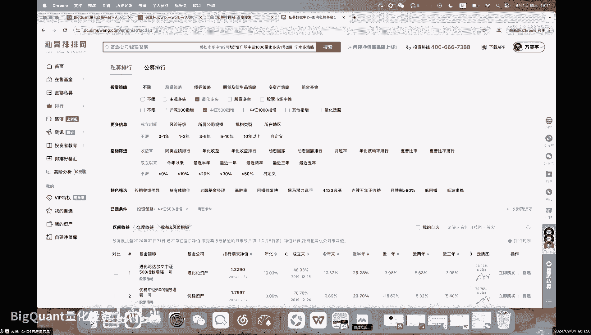
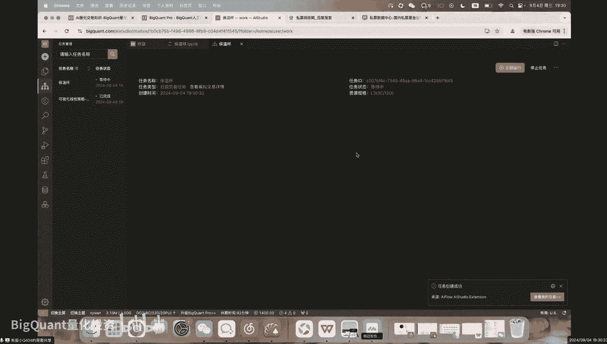
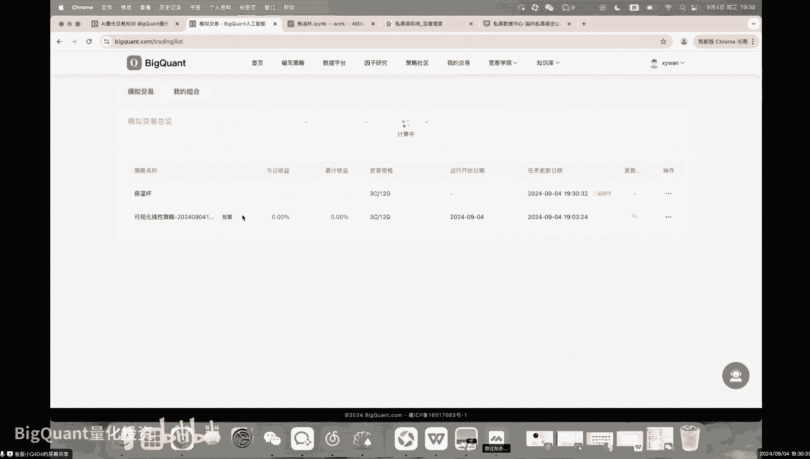
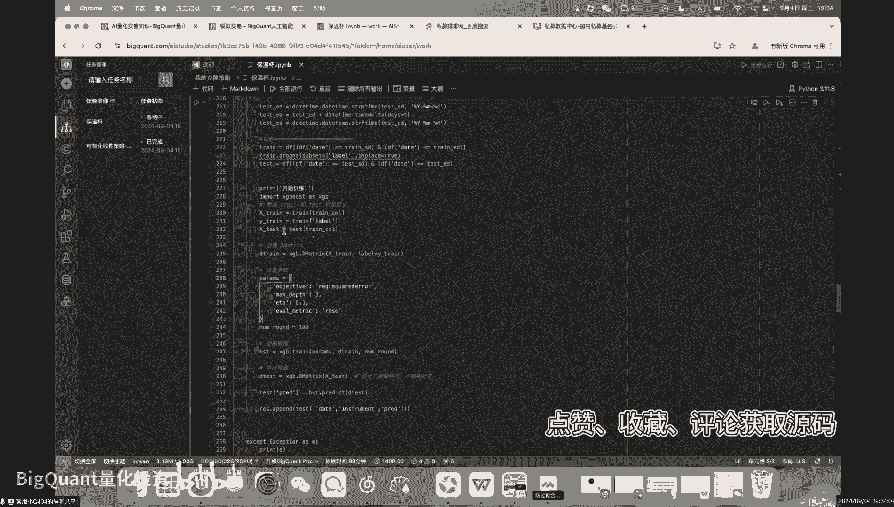

# 基于机器学习的风格自动切换策略，还能避免过拟合！【策略实验室】 - P1 - BigQuant量化投资 - BV16kpEeiE5R

啊大家好，那今天呢主要是给大家去讲一个啊，机器学习的一个策略框架。

那讲之前呢，其实就是会去跟大家介绍一下这个啊，相当于是偏专业一点的，也是偏机构的一些做法，不知道在座的各位，然后对，然后我这边呢是开了会中聊天的，然后如果在额我讲的过程中，如果有什么问题的话。

你都可以随时的去打字啊，当然也可以申请上麦，OK那我就开始了，昨天呢我们其实呢是花了很多的时间啊，给大家讲一个这个这个呃小市值的一个策略，包括这个原始的小市值和这个高频的小市值，那昨天也跟大家讨论了。

这个不同的市场该怎么做，那其实那回到我们现实生活中来啊，就是这个A股的量化啊，大概这个就是机构跟爱好者啊，大概他们的玩法有什么样的区别呢，有今天我们这课的重点，那首先说一下，就是今天大多数的。

你看到这种不使用多因子体系的这种策略，它其实呢基本上就是用几个事件，或者用一些信号啊，或者就是啊用一些筛选条件啊，在一当然也可能会用到一些因子做出来的，一种策略，那这种策略呢在实盘的过程中呢。

它会有有一些问题，第一如果呢你去用这种固定的策略呢，它里面的这些参数啊，就是它你失去拟合的历史，可是未来走势该怎么样，跟这个参数可能完全没有任何关系，所以呢如果你是过度拟合的历史。

就好比说你参数数的很多，那实盘我不是说实盘一定不好，但实盘大概率会和你的回测的出入会很大啊，这个但凡反正不管是在我们平台吧，还是在别的平台，因为我知道有有有有同学是从别的平台过来的，就是你都会发现啊。

这个回测跟实盘差距会很大，那这是第一，第二呢就是这种类型的策略呢，往往会啊是一个单一的一个风格，我们都知道，今天的A股，大多数它的收益其实是来自于这个风格的收益，也就是说如果你去看了那个讲多因子体系。

就是法码测因子那篇论文的时候，你会发现，他们其实就是把大多数因凡尔赛因子那个论文，它其实就是把说股票市场中最主要的收益，归结于纳尔啊，三个基数因子，它是用这个基础因子，然后跟其他因子做回归。

然后取了一个残差啊，残差的部分叫阿尔法，也就是说无法被这三个核心因子解释的收益，才能够称之为啊这个阿法，那今天其实除了就是在A股市场中，除了能够被风格解释的阿尔法收益，其实非常非常少的。

就大多数的这个私募，其实他们的就他们肯定也会去研究alpha对吧，肯定是干这个事情的啊，但是主要给他的净值曲线贡献的那部分，大多数其实还是smart beta，smart beta是什么。

实际上就是风格啊。

那贝塔就是这个可能整体的这个水涨船高，这个smart beta就是某一个风格的水，就你点开这个私募排行，你会发现啊这个啊股票策略啊啊量主观多头。

量化多头，然后我们随便选一个比中证500指增，那就可以去看看这些，随便选一个比较好一点的吧，好吧，选一个大家可以看到今年来啊，最好的目前是涨了十个点啊，近年来最差的是跌了30个点，好有有名点的明红的吧。

好吧，这个跌2。9啊，这个明红的应该算是额规模number one啊，我们看一下它的产品，你会发现啊，今年全部的指增都会有这个年初这一波啊，小市值以及后续的这一波很大的一个回撤啊。

在这之前其实他的回撤是非常非常低的，那除了这个产品，当然这个明红这个产品应该是多资产的，就是不是纯股的啊，平方和大家可以看看，就是他们在今年的2月份啊，都会有很大的一块回撤，都会有很大的一块回撤。

这个原因啊，他这个在这个太太太空仓了，那为什么呢，其实就是因为很多的这个只增的产品，就是机构做的产品，它其实都包含了一个这个事事风格在里面，那巨宽的这个产品的走势，其实就跟我昨天给大家那个高频小市值。

单因子的这个这个曲线非常一致啊，那这个这个这个巨款这个产品，3。33。7年只赚了26啊，今年以来收益-11对吧，那其实今天的市场就是这样的一个现状，你今天其实就是，你可以在网上看到各种各样的策略。

我知道有很久不知道就是巨宽，你就就巨宽他们自己发的这个产品啊，在他们自己的那个量化平台上可能都比不过，但并不是说他们不想做得好，而是说这个市场呢确实是很难去做好一个现状，那在这样的一个市场中。

这些量化私募他们是怎么去做的，那我们如何能够呃从爱好者的角度上来说，比他们做的稍微好一点啊，用他们跟他们类似的方式，比他们做的稍微好一点，然后如何能做出类似的这种策略啊，进入今天的课程的内容。

那大多数的全部的这种只增类的策略，其实呢都是这种啊使用统一的一个框架来做的。

那当然了，每一家他们的做法细节上有很多很多的不同，但基本上他们的框架都是使用，多因子的框架体系，也就是今天给大家的这个保温杯策略好吧，那这个策略呢，我给大家就是通过代码快速的讲一讲啊。

首先呢这个里面呢就是一些因子啊，那我在这边呢用的是12个机器学习呢，其实就是啊用机器的方式呢，去记录训练集的一个经验，那就我们人如果说你今天或者你去菜市场买菜，你都知道怎么去挑那个啊新鲜的蔬菜对吧。

你可能看一看根部，看一看这些地方，那其实机器也可以在数据中和人一样，获取一些经验，只不过我们人可能是通过啊你的感官，你的视觉，你的一些对吧，记忆力或者别人老人告诉你，你获得了一些经验。

机器是单纯的用算法在数据中去得到这些经验，那机器学习呢呃详细的，如果想要了解的，可以去买我们的plus会员的课程，如果不想了解的话呢，就直接用我们这些代码里面默认的也是OK的。

那机器学习呢在这边就不会展开的，给大家讲好吧，那到时候会跟大家说它的原理，所以呢我们的策略呢就会分为这个，trend和test days，那这个训练时间和预测时间。

我们是用过去240天呢作为一个训练时间，也就是在过去的一年240个交易日啊，也大概是一年的时间，也就是我们用过去大概接近一年的时间，去学习市场中的风格，然后呢去把这个市场图中的这个风格呢。

运用到最近60天的，未来60天的一个交易之中，那这个就是这个策略，然后每过60天我会再学一次，历史240天的一个风格，等于我是用最近240天的一个经验，去指导我未来60天的一个交易，那这个也是经常的。

就是这种持续分析任务最常用的啊框架，无论你是这个啊，用它来预测这个金融市场还是什么样的市场，但凡是跟这种时间序列相关的，基本上都会用到滚动窗口训练这样的一个技术，为什么，因为时序的金融数。

因为所有的金融数据，就所有的这种时序的数据，它都有一个时间的一个维度，它都有一个所谓的一个时效性，举个很简很简单的一个例子啊，今天如果我们是用机器学习，去做其他的一些领域的任务。

好比说去做这个啊CV领域的一些任务对吧，那我可能就是要啊，比如我这个任务是想学习一下，这个猫长什么样子啊，那我就把一对猫的照片丢给了这个啊，我的模型模型非常可以，就它就它可以很好的学习到猫的这个样子。

并且在预测中的准确率非常的高，为什么呢，因为猫这个东西它没有时间的维度，或者说猫虽然会从剑齿虎进化到猫，需要很长的时间，可是在我们人能够理解的时间范围之内，它其实基本上是不会变的对吧。

就你5000年前的猫，估计跟今天的猫估计都是差不多，无非是多了点新品种，但基本上大差不差，也就猫这个动物它不会在，起码你这一辈子之内，你估计看不出来它长出翅膀来了，但是金融市场是完全不一样的啊。

全部的金融市场很久之前的数据和今天的数据，他们所需要的经验其实是可能，甚至是完全不相关的啊，所以说呢有，而且金融市场的很多一些基础指标啊，也也都会在变化，就好比说这个可能啊，这个九几年的时候。

中国刚有A股的时候，那时候可能小市值公司，可能20亿都算大市值了啊，大概就这意思了，那这个呃全部的机器学习的框架呢，基本上都是基于就是这些私募他们做的，基本上都是基于这个框架去做的，那什么不同呢。

是这些因子不同，然后呢其他的一些非常非常细节的东西不同，好比说模型不同，他们可能要把多模型的一些融合啊，因子他们会用到一些高频的因子，那最后呢，他们可能也会去做一些风格的一些控制，用组合优化。

那对于我们个人爱好者来说呢，其实这些就呃大可不必了，就直接好就行了，给大家讲一下这个代码，那上面呢这边就是一个配置文件啊，你拿到了这个代码之后，这些你就可以自己去改，如果你买了我们的因子服务。

你有高频因子，就可以把这些替换成高频因子，或者说你买了，我这边也会给你一个高频因子版本的，那如果你没有买的话，你就可以用这些免费的因子直接去跑，这些都是免费的，直接跑就可以了啊。

噗咳然后这些地方呢就是一个，这边也都给大家写了注释，调仓周期和买入数量，在我做任在做这种类型的回测的时候呢，基本上都是会用50支票去做一个回测啊，这边也跟大家说一下，为什么，我就是呃。

这也是昨天我看就是一个群里面，一个人问了一下啊，什么样的策略呃，什么样的策略可以上实盘，那今天也给大家说一下，就是我建议大家在回测的时候呢，都要把股票数量放的多一点，因为其实呢我们今天做回测这个事情。

其实就有点像嗯额在做一个统计的一个感觉啊，其实你每天买买，或者你每个调仓期买多少支票，这个其实就有点像这种抽样检验对吧，你抽样次数越多，这个策略的执行水平越高，你如果就买一支票啊。

就如果你的策略就回撤了一支票，让他赚钱的，这个时候你就去实盘了，那有没有可能实盘的时候他就亏了，或者说你把这个策略啊，比如你买一支票是赚钱，然后你给他改成买五支票是亏钱，那这样的策略你敢买吗。

那你可以说啊，我就买一支票，我就我就我就买那个赚钱的，可能只仅仅只是回色赚钱对吧，万一十盘中你变成了，因为你没有买到那赚赚赚赚钱的对吧，前五只剩下四只都是亏钱的，对怎怎这个怎么办。

所以说呢一般建议在回测的时候，建议大家呢会把这个这个买入数量写一个50，确保这个策略真的是有效了，之后，你实盘的时候买不买这50只没有是没关系的，好吧，就你如果真的想买50只，你又买不了。

你可以呃在我们平台上去连接你的实盘啊，如果你想自己买个什么十支十来只，这些其实自己都可以自己手动的好，那这个呢其实也给到，也是给到大家的源码的这个价值所在，就很多人其实会发现网上有很多策略啊。

除了我们平台，因为在我相信大家也应该知道，很多地方都会有一些策略，那我们平台的价值呢，其实就会把这些策略的源码给到大家，并且你可以基于自己的理解去进行一些调试，你知道这个东西50支票有效，十支票有效。

五支票也有效，证明这个东西是真的有效的，而不是仅仅的选了几支票啊赚钱，但是可能买十支票就亏钱的策略，他只是把五支票展示给你了啊，仅仅是这样子的，所以说呢如果你的策略50支票回撤是赚钱的，而你实盘亏了。

那只能说你然然你实盘买了五只亏了，但是你实盘那个东西呢，你又发现你50只是还是赚钱的，那只能说你运气不好对吧，但是如果你这个票，但如果你这个策略好比说就买五只是赚钱，买50只就亏，然后你实盘中还赚钱。

那只能说你赚的是运气的钱啊，回测只是去增加这个回测的，有同学问为什么回测50，只有去要要回测50值，我说回测的时候，建议策略的回测的这个样本量一定要大，这个就跟你统计一样，你统计的时候你的样本数量越大。

你最后这个统计的这个啊直线水平越高对吧，你如果就抽样一次得到一个结论，那这个东西就不就是执行水平非常低，他就他就不太可信啊，你就买一支票，然后做一个回测，总共你一年只交易了，你要是按按五天一条仓。

你一年只交易50次，然后这个测要赚钱，他的样本量只有一支票50，但你一天买50支票，连着买一年，那就是多少倍了对吧，这个直接水平是完全不在一个量级的啊，所以我们因为你真正你去做回测。

你不是说我一定要去画出一个完美的曲线，回测是干什么用的，回测是让你去看这个策略是不是真的有效，你的策略如果是一坨屎，它就是一坨屎，你改一改这些什么调调参数，调一调这个过滤条件，然后改一改什么买入数量。

把它变得漂亮了，那也只是给这个就给这坨屎盖了个盒子啊，打开它可能还是那坨屎，那这就是这个策略啊，前面是这个circle，就是我们的配置这个这个部分，下面大家简单过一下这个代码，那上面呢就是读了一些数据。

然后这个这个这个地方呢，实际上就是去对这个训练的时间和回测的时间，进行了一个划分，然后呢就会进入到我们的训练里面啊，如果你是额直接提模拟交易这个trade，这个呢就配置成true，如果你是想回测。

你就把它改成false就可以了好吧，然后呢如果你是直接提交模拟交易呢，额其实后面他就是会按照这个时间划分，然后进行滚动训练，但目前这个模型里面呢，我用的是非常简单的一个x g boost。

这个是x g boost的一个模型，那就等于是呢这是一个免费的一个版本，用的是非常简单的一个模型，同时呢也用的是一个12个风格因子，最后做出来的策略能不能看到啊，这个就是这个策略唉，这应该只跑了比较久。

反正这是最近这几天的吧，啊只只大家看一下最近这几天的啊，只有两个月吗，对呀啊啊三个月只有六个点好吧，这个策略呢我看看有没有，这个应该在我其他的号里面跑过了好吧，反正这个策略最后的年化是应该是超过了很多。

中证500指增的策略，并且呢这个策略的我去跑这些时间比较久的，额时间的就是就跑比较久的时间，基本都是从17年开始跑的，就他就他的时间会非常非常的长，回测周期非常非常的长。

然后为什么这个策略是我建议大家去跑的一个，主流策略呢，第一它是一个多因子体系的一个框架，它不是一个单因子啊，就大家想了想，我或我或者我这样问大家一个问题，你今天如果用一个单因子策略。

那我问你有没有可能一个因子它永远的有效，很明显是不可能的嘛对吧，一个因子有，如果但凡一个因子永远的有效，那也那那这个东西在这个世界就太荒唐了好吧，那这个世界就这钱就太好赚了。

对这个世界也就这个圣杯就太简单了啊，小市值就是圣杯啊，那那那这个钱就太好赚了啊，那我今天也不用上班了，我基本上就买个策略给他躺着就可以了吧，所以其实这个世界，或者说股票里面就不存在这种永远有效。

永远无敌的因子对，那在这样的情况之下，我们怎么才可以让我那我不可能说啊，天天去换策略吧，今天一个策略，明天一个策略，后天一个策略啊，今天这个策略我觉得好啊，买了过两天这策略不行了，最后再换一个，太累了。

怎么办呢，那就是用滚动训练的这种方式，也就是说你把你全部的因子丢进去，当然了，我是按风格丢的啊，按风格得你全部，你如果只丢一个风格因子，那那其实跟丢一个因子没什么太大区别啊。

我把足够多的足够好的因子丢进去了，我让他定期的按照过去N天的一个风格，学一个参数，学一个经验，把这个经验运用到交易之中，那这就是一个策略，所以这个策略因为它是有了这个滚动训练的，这个框架。

它是可以定期的自动的去切换风格的对吧，已知这个世界的风格不是永远唯一的，它是会变的，那么我只要知道大概有什么样的风格好，他的因子是是哪类因子放进去就OK了，所以这个就是这个策略。

这也是为什么今年很多的私募，都是用这种类型的策略，好吧，就是第一它是一个这个策略，是真的是一个啊可以就一直跑的一个策略，那这个策略的这个收益来源，和它的风险在哪里呢，这边也要跟大家说一下。

收益来源很简单啊，他就是他收益来源，就是过去240天的一个风格，他通过模型和因子学到，学到之后，在未来的60天按照这个风格去交易，这个就是收益来源，什么时候会亏损啊，我学到了过去240天的一个风格。

在我刚刚交易的时候好了，他风格换了，这个时候就亏损，那当然了，这个呢只给大家一个非常简单的一个框架，实际上呢如果大家有这个代码能力的话呢，实际上是可以很多魔改的，就是在你的回测引擎里面。

你是可以取到每天的净值的，当你的净值如果连续下跌了多少的时候，你可以判断为你当前学到的经验无效，你可以重新的手动的去重新啊，去训练一个更加短期的模型，好比说过去240天的这个经验，已经完全无效了。

我需要用最近呃，60天甚至80天甚至100天的一个数据，再重新训练一个模型，这些可以，大家如果想想想去魔改都是可以魔改的好吧，就是这个策略呢，它是需要啊取过去一年的很多的数据，然后修改个模型啊。

如果内存太小就有可能会爆掉对吧，那怎么选因子呢，建议大家就是按照风格选，就是你其实就是市值动量，流动性财务可能还有一些什么是杠杆啊，大概也就是这些主要的风格，有条件的就放风格的这个高频音子啊。

没条件的就用这些免费的因子，最终用高频的风格因子的话，大概会有几个点的提升，如果你的资金量很大，你又想跑这个策略，那肯定就是用高频的音子去跑，这个想都不用想啊，如果你就没多少钱想用一下好吧。

这个这个策略就免费送给你，然后你只需要买一个模拟交易位就可以了，那这个策略呢最后呃，因为我这边我要我要我我要回测的话啊，有没有人知道怎么提交模拟交易，如果不知道的话，就给大家演示一下。

拿到这个策略之后呢，你其实什么都不需要改，如果你想改的话，就按照我刚才说的这些去改是吧，如果你不什么都不改的话，那你就可以直接哎，右上角这边可以去提交模拟交易啊，然后这边触发时间啊，这边随便选一个好。

比如说这个6。05，然后记住选完了之后一定要点下一个确定，然后就可以了，然后就就就这么简单。

就提交完完成了，然后你绑，然后每天呢在你的主页里面有个我的交易。

就可以看到这个策略的这个信号了，同时咳如果你绑定了你的手机，它每天也可以会推送到你的手机上啊，没那么多钱买50支股票可以上买，当然可以了对吧，你回测的话，然后告诉大家怎么回测，回测的话呢。

一定要把这个true呢先改成false，就FIALSE大写的F改成false之后呢，你就可以先回收50支票，然后再回撤个20支票啊，再回测个十支票啊，都是可以的。

起始日期呢默认的这个起始日期呢就是19年，你这个可以改，然后这个end date呢就结束日期，建议大家不要碰好吧，结束日期就结束到今天，那就是每天会去自动更新的好吧，额就这样的一个策略。

然后如果你买完了我们的模拟交易位，直接去找小Q要这个代码可以了啊，这个trade最后跟大家说一下这个参数，调仓周期啊，这个就是五天，你可以去改一改这个number stocks。

这个就是买入股票的一个持仓的一个数量对吧，这个start date indate就是起始和结束日期，结束日期呢是默认到今天，这个不建议大家去改，这改完了之后，你你你你要提交模拟的时候，你得给他改回来。

不然就会报错，这个训练和结束日期默认是二百四十六十，label shift就是你用了未来多少天的数据，好比说我这边的label用的是未来五天的数据，我的label shift就要为五。

我就要把我的训练集最后五天的数据给删掉，否则就会有数据泄露，这些都是在我的这个日期调整，这部分都是有帮大家做好的，所以只跟大家说一下，就如果你把你的这个训练的label，就如果懂机器学习的。

你把你的label改成了好比说一天的，那你就把这个label shift再改成一，不然的话基本上你不用碰啊，这个就是这个策略，那为什么给大家这个框架呢，因为首先啊后面这些代码里面这些代码。

如果你的代码能力很强啊，我这些是完全开源的给到你，因为我这个策略是没有任何的猫腻的，就是实实在在的按照日期去滚动训练去做，没有任何的过拟合，没有任何的调参，没有任何的过滤条件。

就单单纯纯的多因子的一个训练的一个结果，这个都是给到你可以自己去看看，然后并且呢你如果有足够的代码能力的话呢，你是可以在上面去做很多的魔改的，就像我刚才去说的啊，你如果好比说这个策略啊。

回测的时候连续多少天亏损，你可以手动的去训练这些模型，这些就交给你自己去魔改，如果你没有这些能力去魔改，我这边把全部你需要知道可以调的地的东西，都放在了这个CONFIG里面，好吧。

就这个配置文件就全部跟跟这个，就这我这或或者我这么说，这个模这个策略，你基本上全部能调到都在这儿了啊，其他的地方调就没有必要好吧，就这个最后入可能说下模型，模型用的是这个x g boost啊。

x g boost是非常基础的一个模型，但是它是一个梯度的这种数列模型，其实去做股票的问题的时候，就是做股票的分类问题，实际是一个还不错的一个选择，那模型参数不建议大家去改，没有什么太大的意义，好吧。

如果想去替换的话，你也可以在这边替换成别的模型。

就如果你会机器学习的话啊。