# 多因子策略框架-backtrader-量化金融与机器学习2024 - P1 - 背包2004 - BV1DH4y1g7Dk

接下来老师来实现一下我们的多因子策略，因为之前之前我们讲的是一个因子啊，这里的话我们假设我们要做两个因子啊，先简单一点，之前我们做了一个假设，我们做这两个因子的因子策略，我们之前之前学习过。

当一个因子之后，我们对这个因子排序，然后获取啊头部的那几个股票，那现在问题来了，我们有两个因子，那是不是我们都都要排序，那两个音怎么怎么弄的啊，两个音是怎么弄的，我们的思想很简单。

我们对因子都分别进行排序，排序好了之后呢，我们显然不能像之前一样，就是拿某一个因子的前面这个就不合适了啊，所以我们现在是想法是干嘛呢，我们分别对这两个因子进行排序，这样的话呢，我们拿到每个股票。

在对应因子下面的一个序号序号，然后把这两个因子的排序的序号相加求和，得到一个总序号，然后根据这个总序号的顺序取头部的多少个，能理解这个思思想吧，这就是我们多因子处理多音字的时候。

我们依然是以我们之前单音子的思想为基础，只不过是做了一个简单的一个修改，就是呃整合各个因子的顺序，然后把它加起来加起来好吧，这是我们现在的思想啊，现在的思想，然后我们把之前的这个先拿过来啊，先拿过来。

先拿过来，拿过来之后呢，呃我们显然是不能再简单的做这样的排序了，你看啊这个排序就不能简单的这样干了啊，呃因此的话呢这个我们就不要用这个名字吧，我们换一个名字，我们先把它注释掉啊，注释掉啊，先注释掉。

注释掉这个我们换成另外一个名字吧，啊，呃这上面都一样，我们还是引入我们之前那个，避免涨停这些机制啊，这些机制没问题啊，现在我们拿到的是这一天的股票的一些信息啊，我们运行一下，还有我们老是忘了啊。

我们只运行一个循环，我们拿这个数据试一下，啊啊啊，第一个循环我们拿到的是什么呢，是这一天所有有效股票的信息，是不是拿到这个之后呢，我们要对两个因子进行排序啊，呃比如说我们要对什么呢。

我们有一个因子是我们的市盈率是吧，我们要对它进行排序，对它进行排序的话，我们用用一个什么函数来用这个函数，我们用这个更简单，点rank啊，你看当我们点rank之后啊，这样的一个市盈率的一个序列。

就变成了一个根据它顺序的一个序列，一个序列，这个就是它的顺序号了啊，它意味着它是在277位，我们看一下它默认排序，你看这个市盈率应该是小于它的，所以呢它的顺序也是小于它，它是一个从小到大来进行排序的。

能理解吧，呃咳咳，是一个从小到大来进行排序的，市盈率的排序的话，我们之前其实讨论过，我们我们要的是头部的，是不是我们要的是头部的，我们最好是让市盈率从大到小排序，能理解吗，我们就是说我们还是要头部。

所以说我们在这里让他弄序号的时候，排序的那个那个那个那个参数我忘了啊，这个参数啊，就这个这个参数额，我们希望它从大到小来进行排序，从大到小来进行排序，那这样就是从大到小的，然后呢我们还能够拿到什么呢。

我们还能够拿到，呃我们的总市值的总市值的，总市值的话，我们是要选取市值比较小的股票，还记得吗，所以他最好是什么呢，他最好是，呃从小到大就行了，我们取头部的，是不是我们看一下是不是从小到大啊。

我们可以拿出来看看嘛，比较一下，你看这是这个是小一点的，然后它的排序就小一点，所以这个总数值是从小到大的啊，从小到大的，这个是从大到小，从大到小的，然后然后我们都是要取这两个排序的。

头头部的股票是不是啊，市盈率我们是要取大的啊，呃总市值我们是要取小的，极小的，取这两个股票这两个排序头部的，那我们怎么来做呢，我们把这两个东西啊加起来，加起来能理解吗，加起来这样是不是形成了一个总序号。

形成了一个总序号之后呢，我们怎么办呢，我们把它这个作为一个新的一列，作为新的一列给到，link给到原来的那个，因为注意一下这这个索引跟原来的是一致的啊，啊它的顺序跟原来的那个呃。

跟原来的这个数据框的顺序是一致的，所以说我们直接可以这样给到他啊，给他。

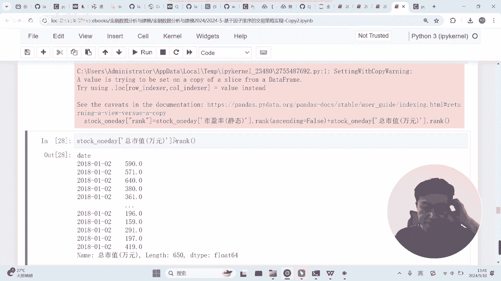

等一下。

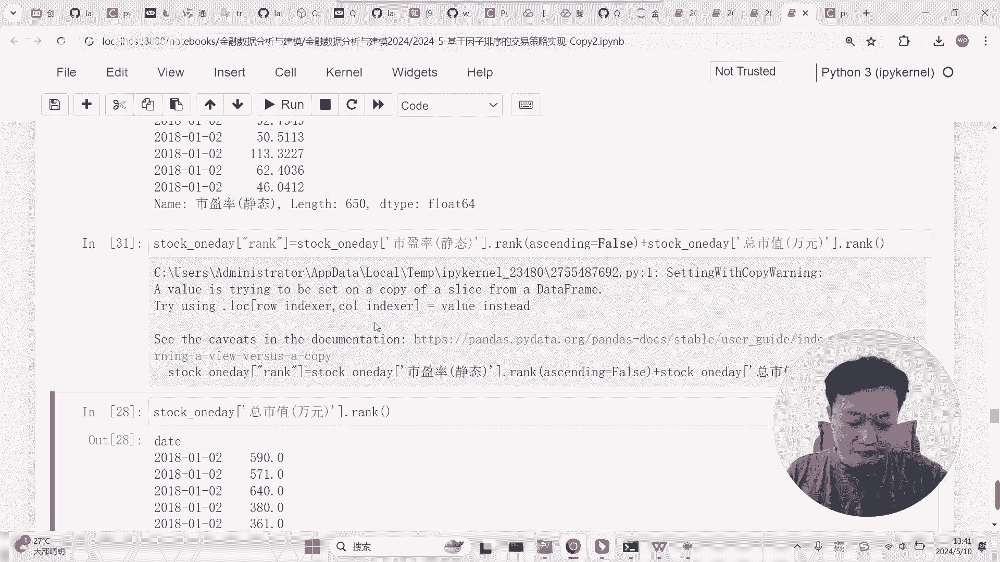

好吧呃啊这个这个刚才他给了我一个警告啊。

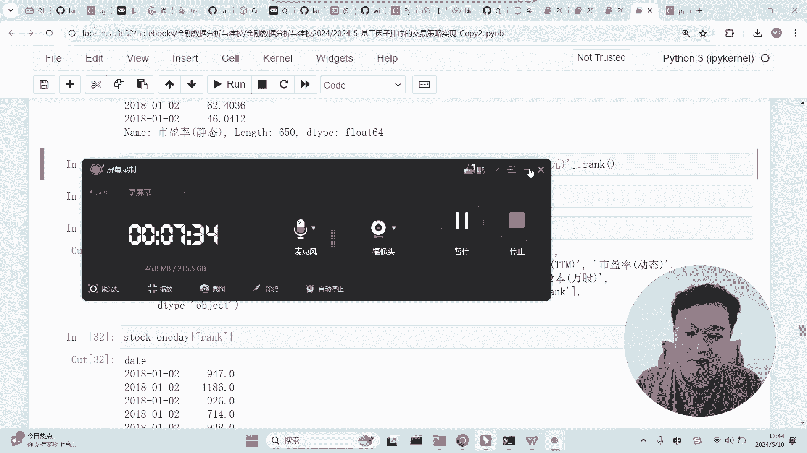

就是这样干的话，他说你孩子不太合适啊，怎么怎样干呢，啊我们刚才是这样的啊，他给了我一个警告，他说要最好是要怎样干呢，他说你最好是这样干，你看他说了说了，让我用那个LOC啊，他就不给警告，那就行了。

我们试一下啊，这样他就不给警告，但是效果肯定是一样的，那我们就用这个吧啊啊就用这个这样的话呢，我们可以看到啊，我们这个rank实际上是进去了，而且他这里面是有这一列的，通过这种方式，他应该是有这一列的。

啊然后呢我们可以在这里对它进行排序啊，对它进行排序，点点，是不是，然后呢对它进行排序，然后跟之前一样，然后再hit，还害得我，然后呢然后再取什么呢，取股票代码，然后再再点to list。

是不是就是思想是差不多的，无非就是呃我们使用了rank啊，使用rank这个方法，获得了每个因子的排序的序号，然后把它加起来，给到了原来的那个之前的那个数据框，然后再对这个总的这个因子啊。

总的这个呃这个这个这个排序的号，然后进行排序，然后再获取前五啊，就这么个思路好了，我们在下面实现了，然后呢我们在上面把它实现下来吧，这里这里实现一下，然后，然后呢我们的STOCKLIST是这个东西。

就是我们的这个，那等于他是不是就刚好跟下面能接上哈，刚好跟下面是能接上的，能理解吧，这样的话我们其实就用了这两行来实现了，我们刚才的想法，这两行的核心就是通过这个rank这个函数，来实现排序的序号。

然后相加，然后给到原来的这个给到原来的这个呃，这个数据框，然后再排序，然后再获取啊，再获取，我们运行一下。

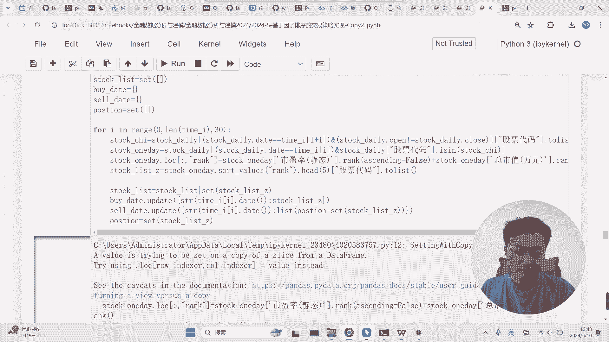

他总是有这个警告啊，他第一次从事这个警告。

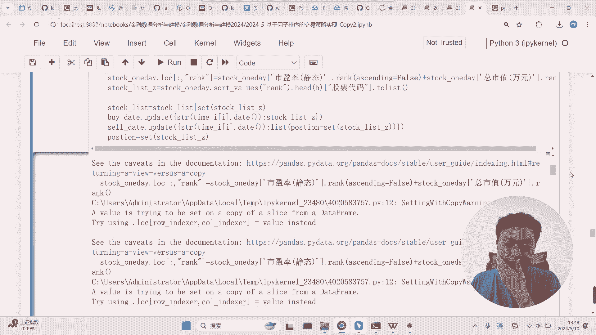

我们把那个但是东西肯定是拿到了，看有什么，结果肯定是拿到了。

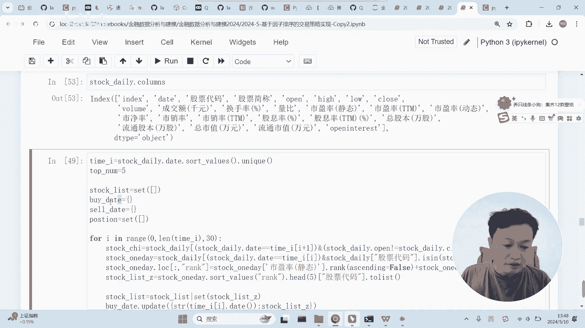

结果肯定是拿到了，结果是有的。

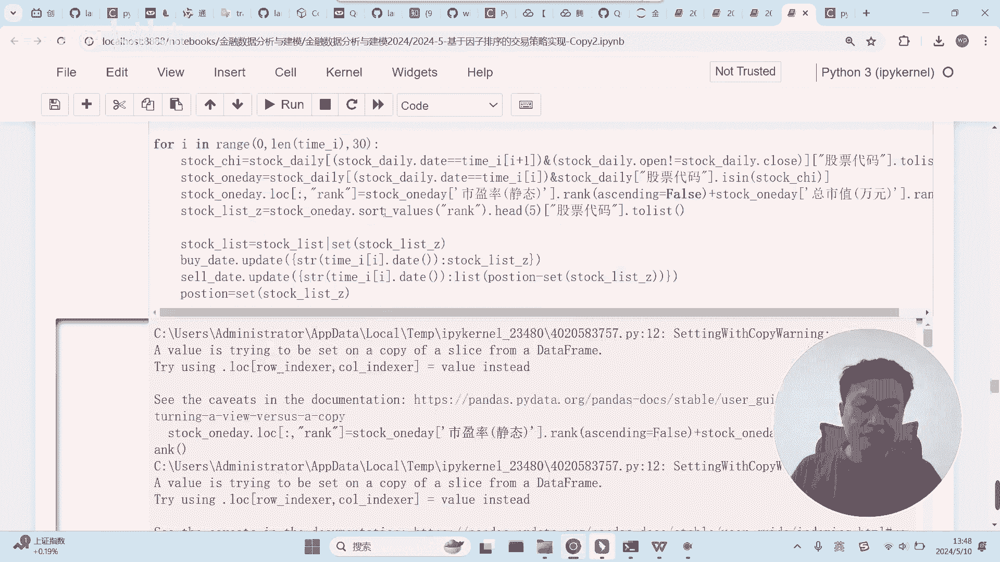

然后我们先不管这个警告吧，先不管这个警告，然后我们来运行一下。

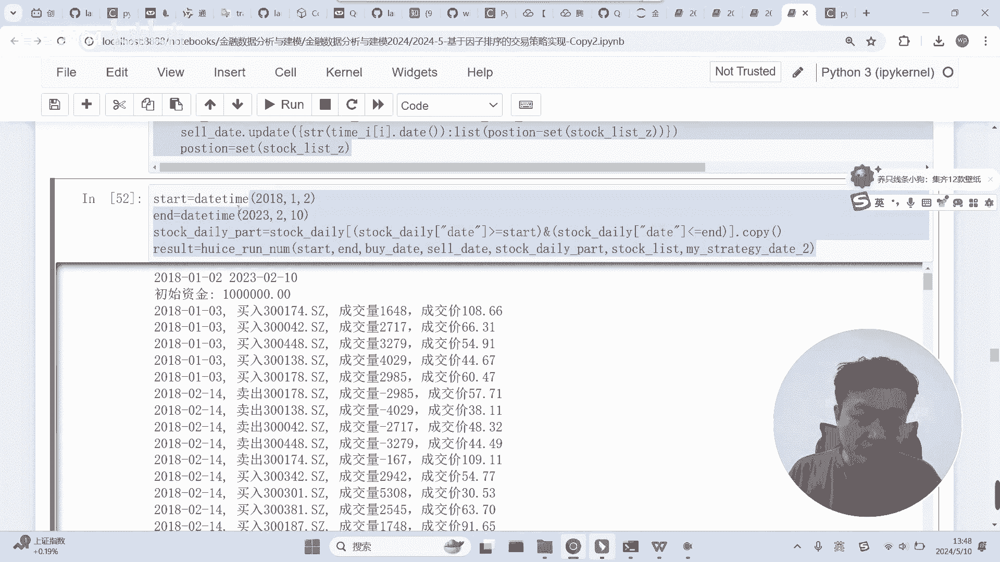

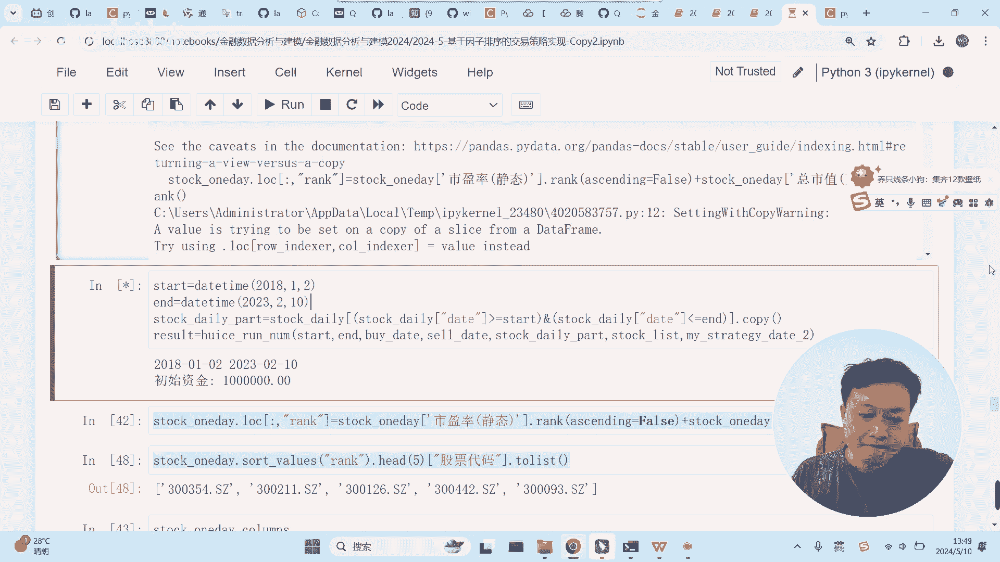

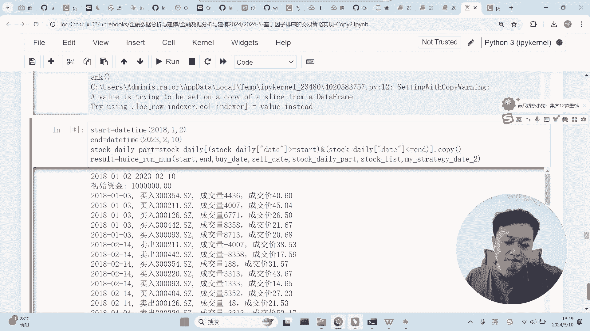

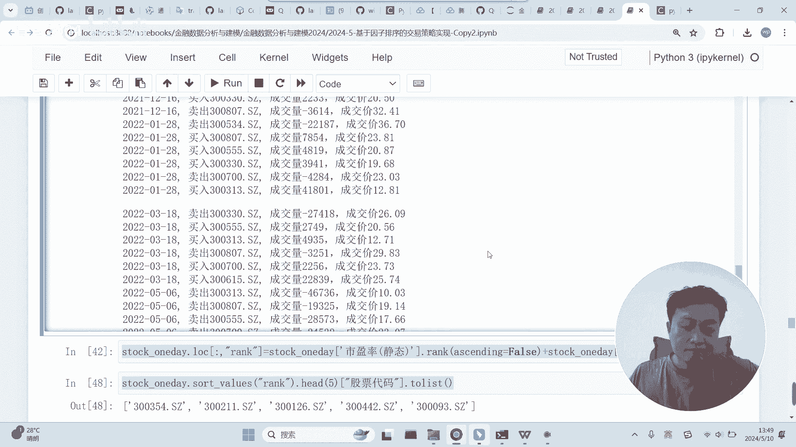

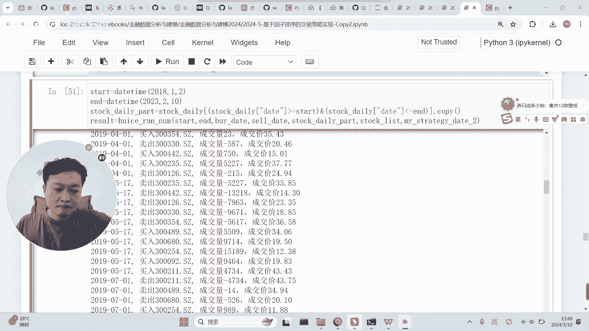

好吧，这次应该就是这个运行的结果好，看起来还行，是不是啊，看起来还行，涨是涨了不少的，我们是之前是100万，是不是，大概接近四倍的样子啊，接近四倍的样子，我们看一下这个好，我们看一下我的那个呃。

这个东西，因此策略其实是很容易能够获取比较好的，啊我这里还没运行呢，啊这其实就是那个啊，看起来还行好吧，同学们试一下啊，老师也看一下。

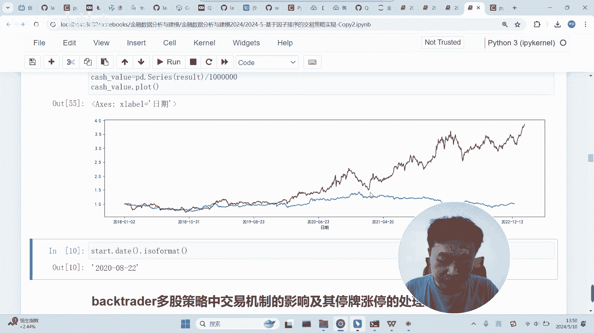