# 多少人看涨,多少人看跌？7个指标精确量化投资者情绪【量化投资邢不行啊】 - P1 - 量化投资邢不行啊 - BV1zb421E7rE

大家好，我是专注于量化投资的，行不行，巴菲特曾说，别人贪婪，我恐惧，别人恐惧，我贪婪，在A股也有前人的经验教训，被总结成了格言，广为流传，买在无人问津处，卖在人声鼎沸时，这两句话本质上都都是一样的。

讲的都是对市场情绪的判断，可能你自己也有过一些类似的经验，比如说在坐地铁的时候，看到周围人都在讨论股票，那这可能意味着一轮牛市基本到头了，又或者如果哪天炒股群里面都没人说话。

甚至连吐槽大A的段子都懒得发了，那可能熊市就真的快见底了，那么正式是有这样的经验观察，所以很多人就想着，是否可以去量化市场的情绪呢，比如说把恐惧和贪婪量化出来，以此来形成交易的决策。

但情绪这东西呢是虚无缥缈的，该如何精确客观的量化呢，本期视频我们就会同以下四个角度入手，分别为大家介绍几种常见的方法，教你如何客观的量化市场情绪，摸透市场的脾气，视频中涉及的数据和代码都已经打包好了。

只要加屏幕右下角或者置顶评论区，我的微信都是可以直接发给你的，话不多说，我们开始正式的介绍，想感知市场情绪。

最简单粗暴的方法就是做个问卷调查，直接问问大家对未来市场的看法，比如在2019年，我曾在朋友圈发起过一个小调查，询问大家是否认为上证指数会跌破。

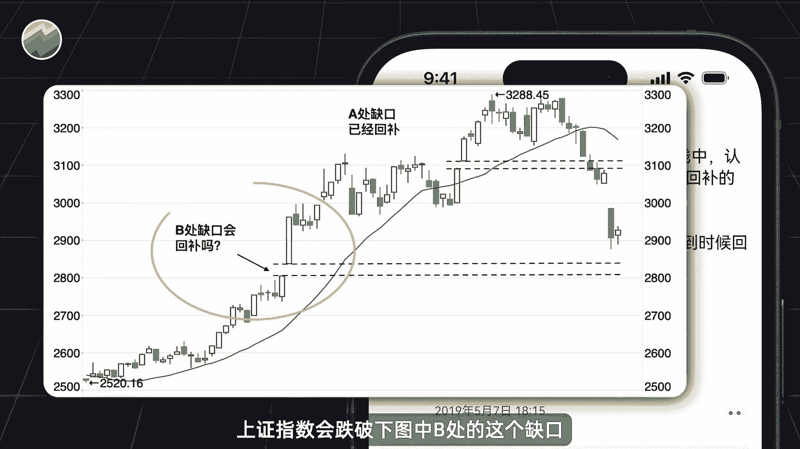

下图中B出的这个缺口，根据下图的调查结果来看，80%的人认为会跌破。

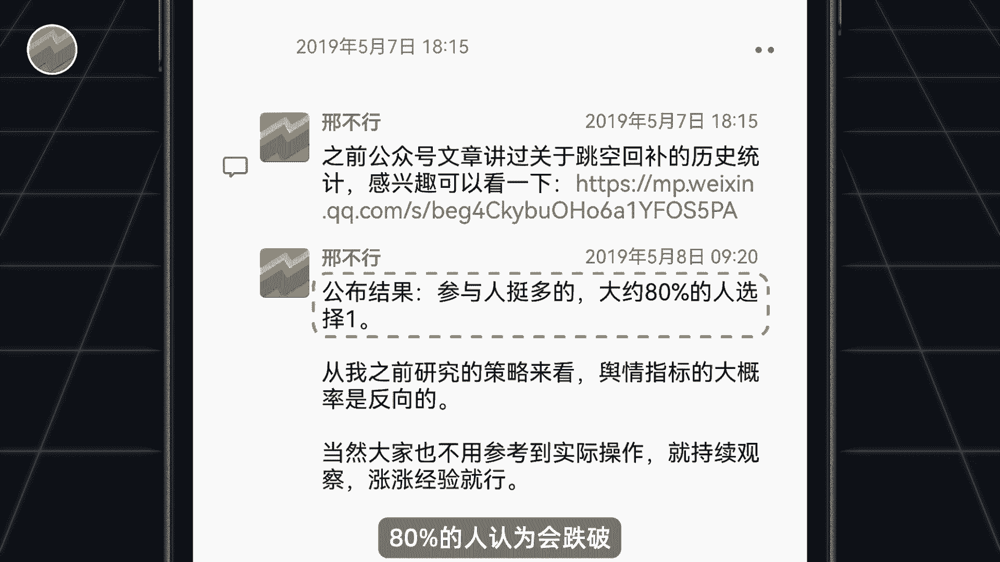

而最终的结果是到8月6日，上证指数跌破2800，完全回补了这次跳空与问卷调查中。

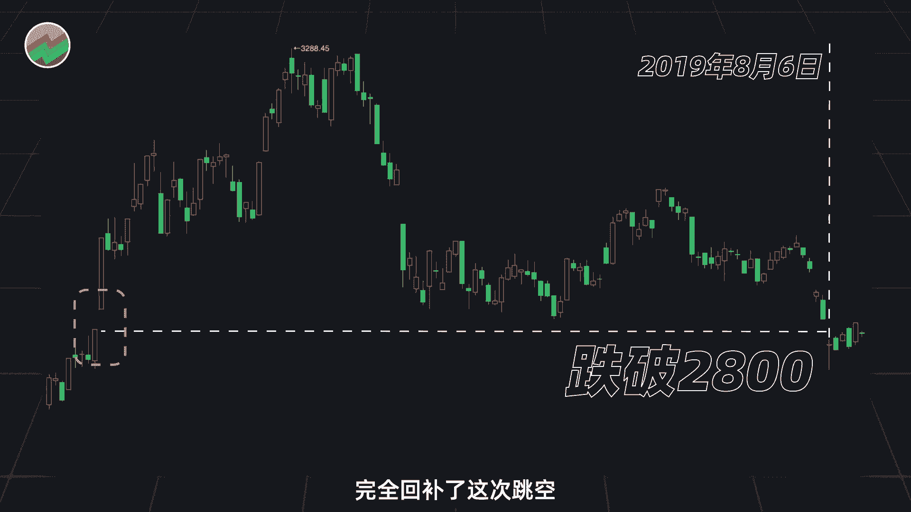

大家的预期是一致的，以上呢就是一个问卷调查的案例，但是老实说啊。

这样的问卷调查查方法呢，可能在1929年的华尔街算是先进的，但放到现在却难免有些过时，并且很多人其实不会认真对待问卷，信息来源和可靠性都没有保证，整个过程呢还费时费力，因此不推荐这种方式，除了做问卷呢。

我们也可以去看看部分词条的搜索量，也就是通过大常用的搜索引擎来获取信息，当牛市来临的时候，关注股市的人数大大增加，在网上搜索股市，上证指数等关键词的人呢也会增加，因此啊。

我们也可以通过搜索数量这一指指标，来量化市场的情绪，大型的搜索引擎或社交网站呢。

一般也会有一个搜索指数的页面，比如说谷歌指数，微指数，微信指数。

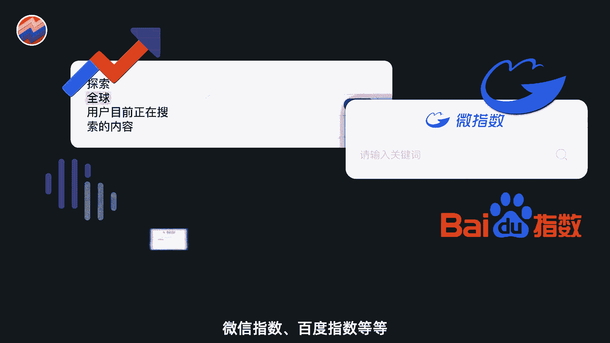

百度指数等等，以这里百度指数为例，在百度指数上搜索上证指数作为关键词。

会发现在2015年牛市来临的时间段，指数与K线的走势非常的接近，学术界呢也对此有过很多相关的研究，感兴趣的朋友都可以去搜索看一看，当然啊这种方法也有一定的局限性，比如说百度原来用的人很多。

但现在用的人越来越少，那么可能他现在的参考价值就没有以前那么强，然后啊我们既然提到了百度，那么经常用他搜索股市资讯的朋友，应该会看到过一些类似的标题，特别是在财经网站或者一些公众号上。

许多小文章的标题也是类似这样，这样的标题呢往往带有非常强的情绪倾向，比如说风险周转率降低等字眼，就带有明显的负面情绪，而新增无惧等关键词就代表着非常积极的情绪。

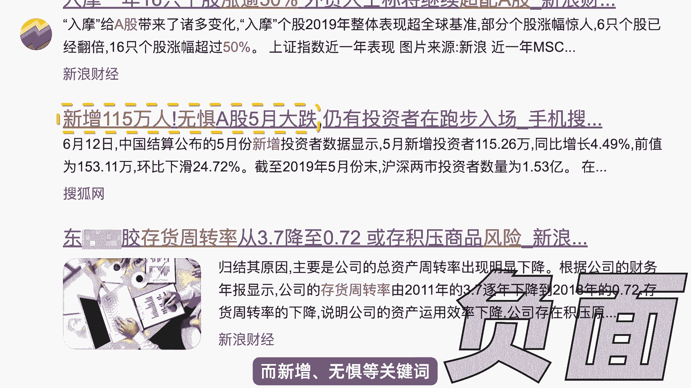

每天各大财经媒体啊，会产生成千上万条类似的新闻，社交网站上呢，也可以看到众多投资者对于市场情绪的看法。

那么这些文本内容就可以成为大数据，来分析市场的情绪，当然啊对于这海量的内容，我们不可能通过人工来处理，这就得依靠人工智能技术，例如对于每天财经网站上的文章，我们可以通过AI根据它包含的情绪。

将这篇文章自动地分为看涨，看跌，中性或者无观点，然后呢我们就可以得到每天看涨的比例数据，看跌的比例数据，这些啊就能一定程度上代表市场情绪的趋势，当然啊也不要觉得这样做法很先进。

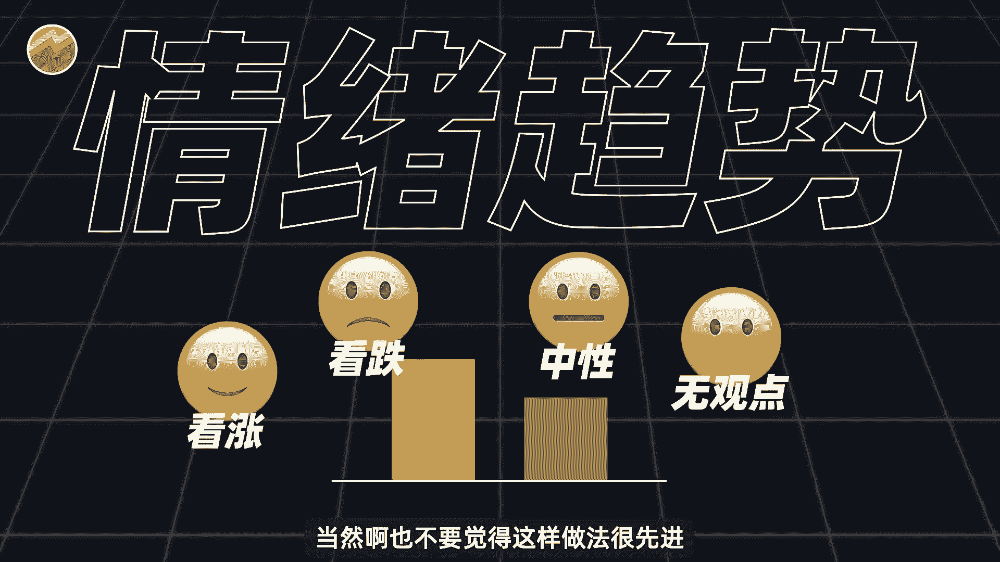

类似的研究呢其实很早就开始，美国早在2010年就有对冲基金，基于twitter上的发言来进行交易，我自己呢在2011年左右，也做过这方面的研究。

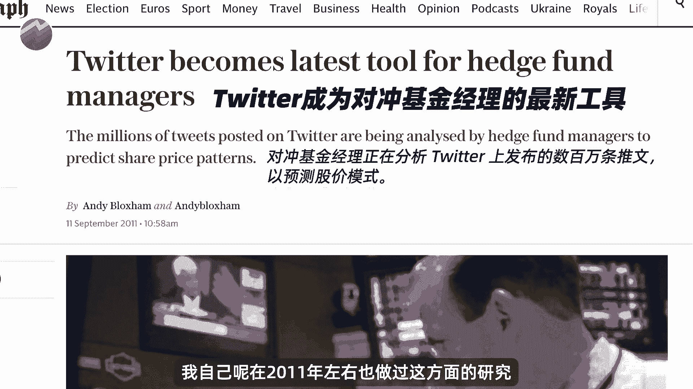

到现在啊又过去这么多年了，人工智能技术呢又变得更加成熟，有一定技术的朋友都可以尝试一下，也欢迎大家在评论区畅所欲言，或者加屏幕右下角或者置顶评论区，我的微信和我交流，当然需要说明的是。

这类所谓舆情大数据，很多人研究之后发现，其实对交易的指导性价值一般，可靠性也比较差，很多运行这一类策略的基金呢表现也一般，所以说啊面对股市，并不是说你用的方法越先进，就一定会越赚钱的好。

除了上述的方法之外呢，其实还有一类比较特殊的市场参与者，他们的主观情绪往往更加的单一化，也不用我们对海量的数据做分析，他们就是券商的分析师，虽然很多人对分析师行业多有诟病。

但业内很多机构还是会参照他们的一些建议，国内证券公司的分析师虽然不能够下场炒股，但是呢他们会在研究报告中对股票进行评级，根据看好程度呢会分为几类，比如说卖出减持，中性增持或者买如之类的评级啊。

明显就代表了专业的分析师，对股票未来的情绪以及预测。

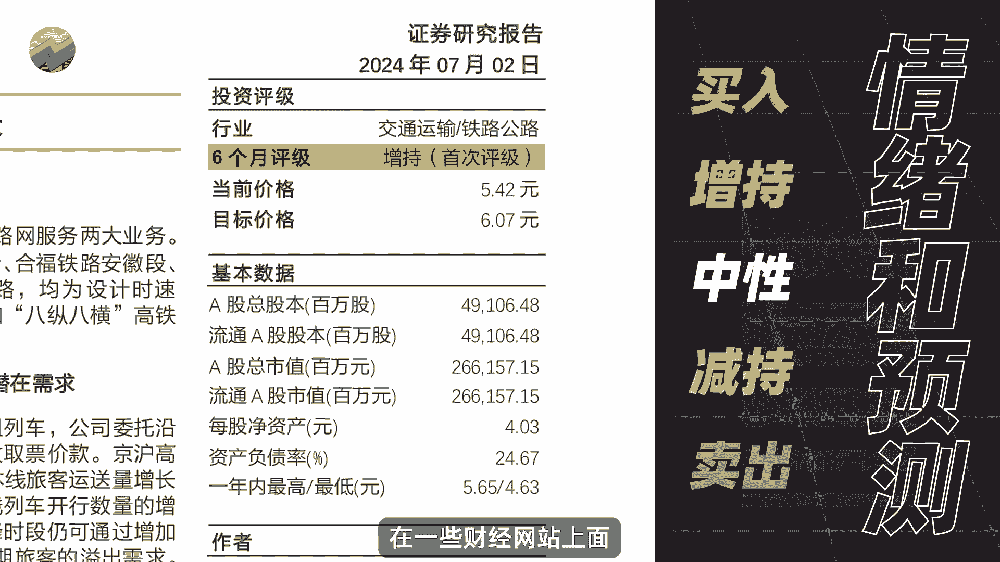

在一些财经网站上面，我们也可以看到整理好的分析师的评级数据，有某某某在某年某月某日，针对具体的某和股票做出了什么样的评级，那么这些评级其实就是代表着分析师。

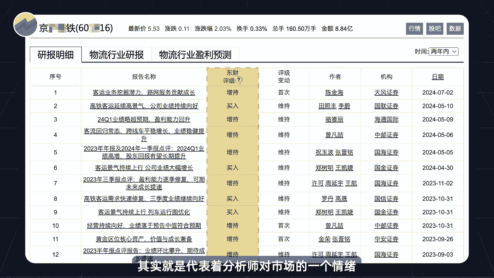

对市场的一个情绪，我们可以把这些评级的数量进行汇总，得到如下的数据，那么每个这个评级的占比会随着时间发生变化，这种变化实际上就是市场情绪的变化。

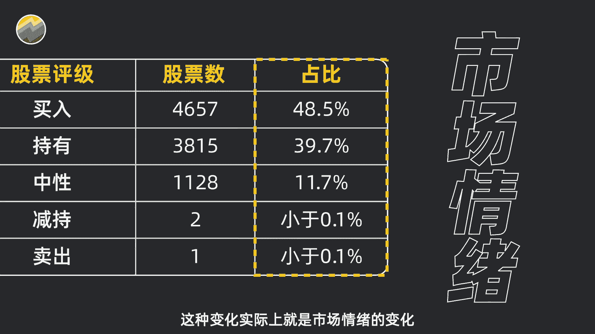

比如说如果发现买入级别的占比增加了，说明情绪变得更加积极了，反之如果持有中性，甚至是减持和卖出的数量增加了，那么可能就说明市场情绪比较悲观。

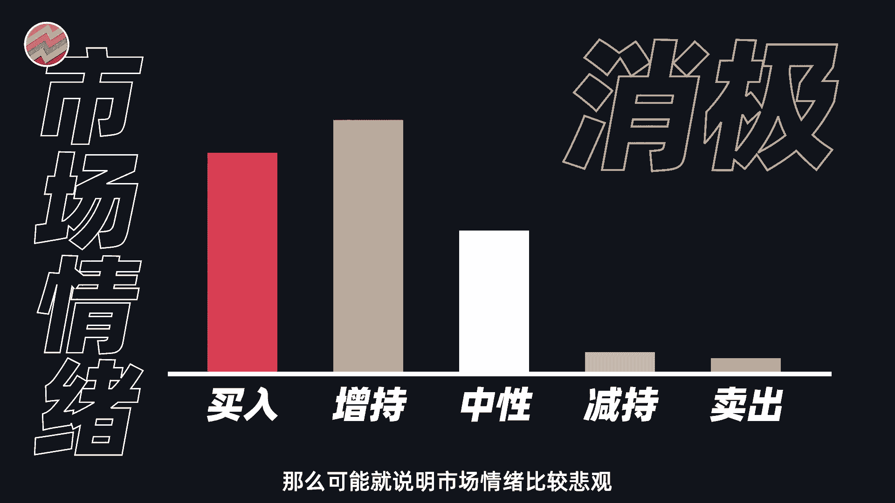

当然我们也可以关注个股的评级的变化，如果你关注的股票，它的评级从买入突然掉到了减持，那说明有的分析师情绪开始多转空，这个时候可能就需要想了。

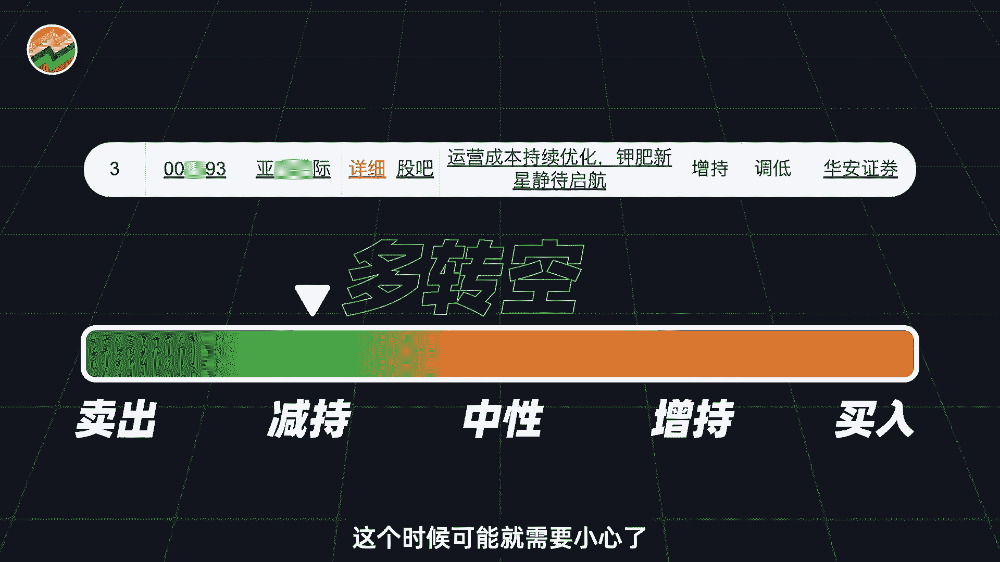

那分析师们的情绪指标到底准确与否呢，我们其实早已经做过相应的研究，感兴趣的可以去看一下。

我们这个视频，可能会打破你觉得分析师都是骗人的固有印象，好至此呢。

我们介绍了这种比较主观的市场情绪指标，的量化方法，这些指标呢有的数据获取难度比较大，主观性也太强，所以在实操当中啊，应用其实并不多，我们更多的时候啊，也会通过股市本身的一些指标。

去构建相应的所谓的市场情绪指标。

虽然这些指标更加简单，有的时候呢跟市场情绪也不是完全沾边，但是实盘用下来其实效果并不差。

在过往视频中，我们曾经介绍过许多观察大盘的指标，比如说PCR指标，前5%个股成交额指标等等，这些指标本质上反映那就是市场的情绪，比如说PCR指标，它代表的是每天市场上看涨和看跌的，投资者的比例。

这不就是一种最直白的情绪吗，又或者像北向资金的流入流出。

数据，反映的就是香港和境外投资者对于大A的情绪，顺便说一句题外话，最近的交易所不再披露北向资金的实时成交额，但这个数据啊在盘后仍然会统一公布，所以盘后在使用这些数据的量化策略，不会受到什么影响。

感兴趣的呢可以去港交所官网看一看原始数据，相应的网址我也会放到评论区，有需要的可以自己领取，另外呢交易软件中常见的资金流数据。

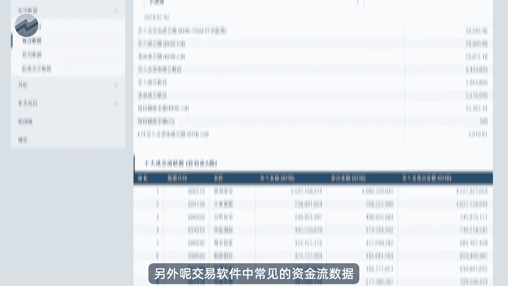

其实也也是一种市场情绪的表现，我们可以通过肝数据侧面了解。

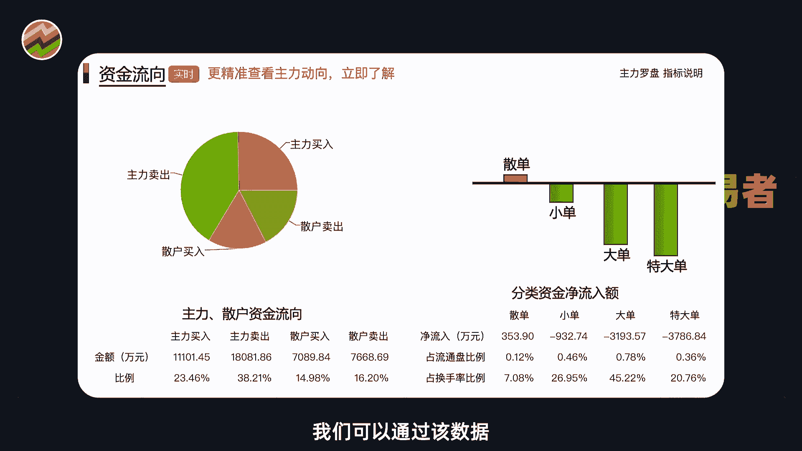

不同交易者对市场的看法，以此构建相应的量化策略，当然龙虎榜的数据也有类似的功能。

这里就不做详细的介绍了，具体都可以看我们这几期视频，看到这老观众有没有一种死去的回忆，突然攻击了我的感觉，很多看似毫无关联的知识，其实在某些方面也是互通的。

上述提到的这些视频呢，推荐新观众都可以去看一看好，那么复习完之后，我们就再给大家介绍几种全新的市场情绪指标。

一些做宏观研究的人，非常喜欢去分析A股的新开户人数，当市场情绪特别高涨的时候，往往会有许多人争先恐后的来开户，你自己也可以回忆一下，是不是每每牛市的时候，你身边从不炒股的家人朋友都会来问你，怎么开户。

熊市的时候，他们也都销声匿迹了，甚至啊应该有不少观众，也是在牛市的时候开启的投资生涯吧，所以啊，新开户人数确实可以作为量化市场情绪的指标，A股的新开户的数据是公开的。

可以在中国证券登记结算网上查到，获取开户人数数据之后呢。

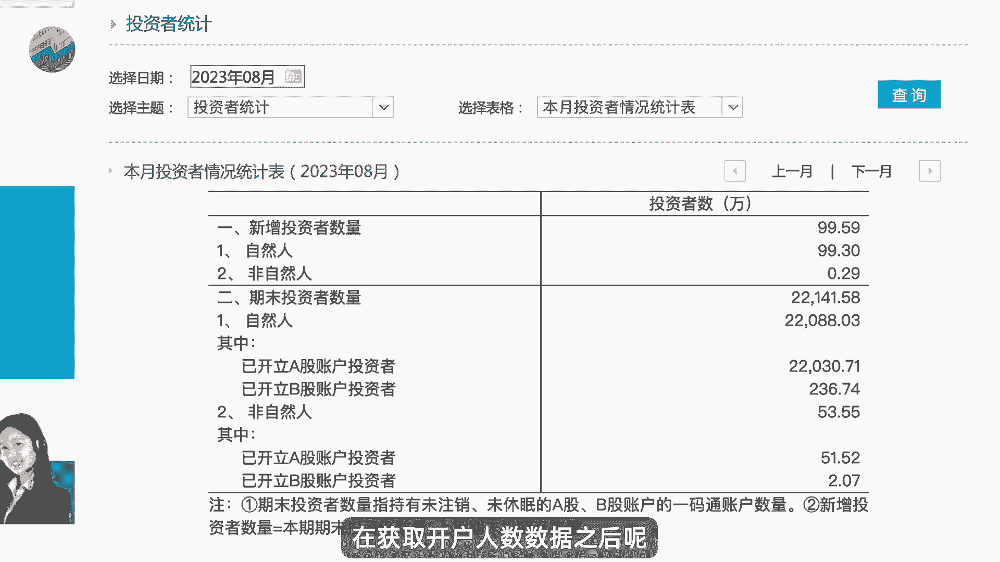

我们就能对比出A股投资者的增增速，和股价之间的关系了，可以发现啊，新股民的增长率，会比沪深300指数更先做出反应，有一定的预测作用，这也不难理解，新投资者和新资金的进入，是牛市开始的重要原因嘛。

但也要注意的是，增长率过高也是明显的顶部指标，大量新人开户，说明市场可能进入了过热的状态，这个时候很可能需要注意风险，除此以外呢，其实融资融券的数据也是很好的，观察市场的情绪指标，融资融券俗称两融。

可以借钱做多，也可以借股票做空。

具体介绍呢我帮大家列了出来，感兴趣的可以截图查看，大家如果对两融相关的内容感兴趣的话，也可以多多点赞，点赞破5000的话，我们后面就可以详细的介绍一下两融，并给大家介绍一个相关的量化策略。

那融资融券到底如何体现市场的情绪呢，其实融资融券的余额，就直接反映了，市场上面有多少人在加杠杆进行操作，加杠杆的程度，可以很明确的直接的反应市场此时的情绪，比如说更多的人愿意加杠杆买入股票。

那么就说明此时市场情绪高涨，上掉头的官网，可以直接查到融资融券的余额数据。

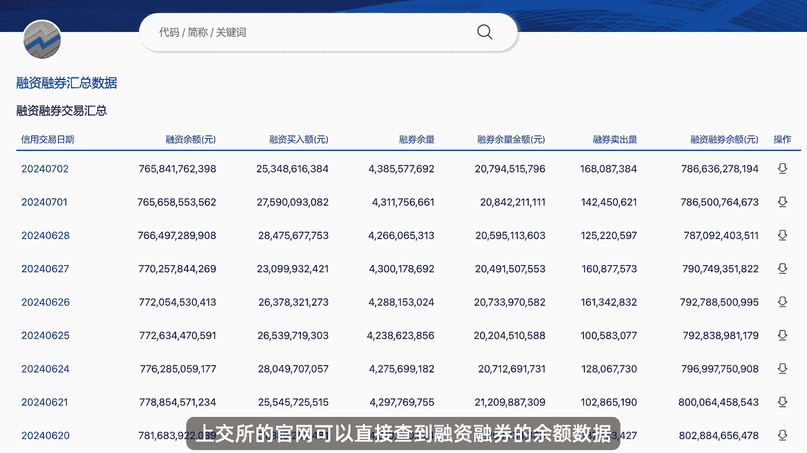

我们将2015年牛市那一段时间的，融资融券余额数据和大盘进行对比，也可以发现非常明显的相关关系，另外呢股指期期货也能很好地衡量市场的情绪。

我们以中证500的股指期货为例，指数本身的价格呢是5469点，但是像中证500 2412这个期货，它现在的价格是5343。

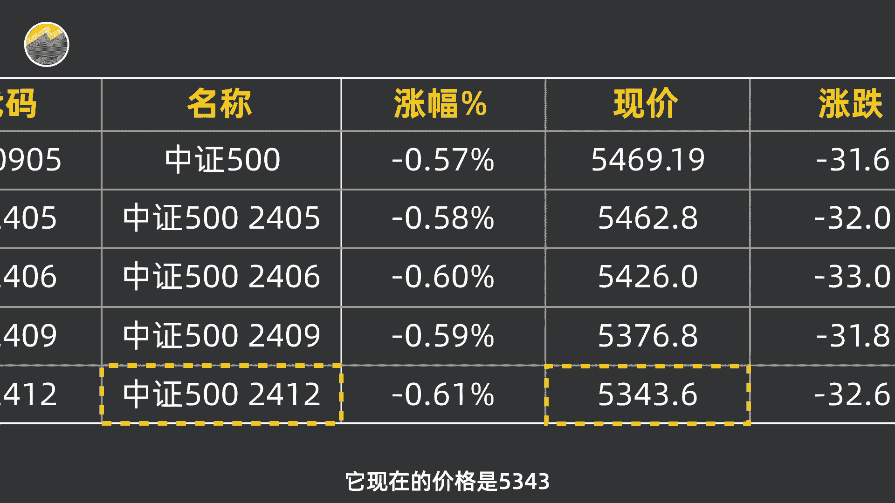

也就是说投资者认为到2024年12月，该期货交割的时候，中证500的价格会是5343，这个价格呢比现在的价格低了2。3%，由此可见，大家对未来市场的预期呢还是比较悲观的。

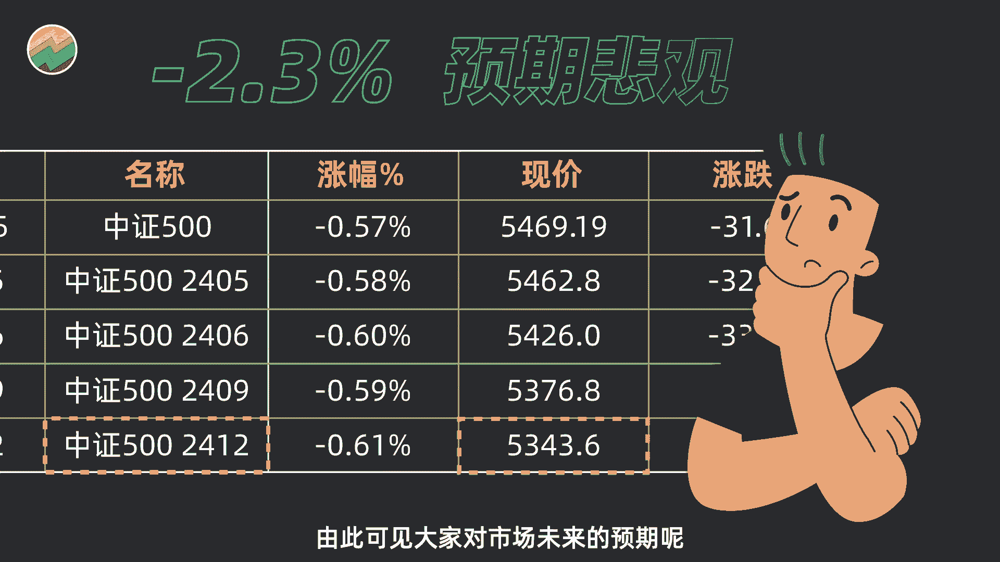

那这种期货价格比现货低的情况，我们就称之为贴水，相反如果期货价格比现货高的话，就说明现在是深水行，我们呢就可以实时计算股指期货的贴水率，或者深水率，以此来观察市场的情绪变化。

目前大A期货长期贴水，这说明大家对市场信心确实不足，我们之前也介绍过。

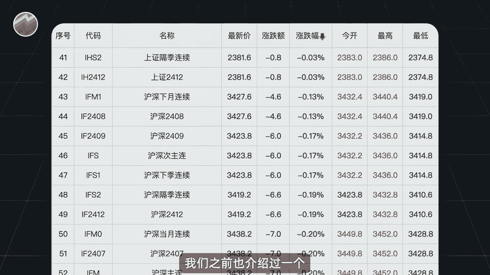

一个通过股指期货的升贴水率来构建的策略，对期货感兴趣的同学可以去了解一下。

至此呢，我们已经介绍了七种全新的，如何量化市场情绪的方法，以这些加工之后的情绪数据为基础，我们可以开发出各种各样效果，很不错的择时选股策略。

之后有机会的话呢，我们也可以展示一些相关的案例。

当然啊刻画市场情绪的方法远远不止这些。

我再给大家举些例子，比如说股市的成交量和换手率，也是很常见的情绪指标，短期内某个股票成交量急剧上升，都能间接体现投资者的情绪在上升，又比如说公募基金的仓位，描述的就是公募基金的情绪，仓位越重。

说明公募基金越看好市场，或者说公募基金的净赎回率，就是表示有多少居民正在赎回基金，那么大家越不看好市场，赎回率也就越高，还有大股东以及高管的增减持行为也很好理解，增持即看好，减持就是看空。

诸如这类指标呢，其实还有很多。

我把比较把常见的一些方法都列了出来，感兴趣的可以截图观看，如果对这些指标的计算以及应用感兴趣的话，欢迎在评论区留言，留言，最多的那个指标呢，我们就可以专门出一期视频来做详细的介绍好。

那么本期视频就到此结束，感谢大家的点赞，收藏和转发。

