# 抱最狠的团，亏最多的钱？Python量化散户抱团，这次真的不一样？｜ 揭秘A股股东户数的秘密，人多并不可以为所欲为 ｜ 附代码 ｜ 量化投资邢不行啊 - P1 - 量化投资邢不行啊 - BV1vi421X78d

在人类战争史的浩瀚长河中。

以众凌寡似乎始终是主旋律，然而历史的魅力就在于它的波谲云诡，项羽巨鹿破釜沉舟，刘秀昆阳召唤陨石，富坚肥水，风声鹤唳，又好像在昭示人多并不一定能为所欲为，在股市这个没有硝烟的战场上，这种现象似乎尤为明显。

在美股的百年历史中，人多势众的散户被机构花式收割，散户大战华尔街的gm1事件也仅此一桩，反观A股市场情况却好像不同，在A股机构常被群嘲为大号韭菜，基金经理追涨杀跌，屡创新低，而A股散户不仅人数众多。

还在3000点高地学艺多年，早已学富五车，博古通，今是不可忽视的一支生力军，那这次在A股这片独特的土壤上，是否能和美国的剧本一样，散户人数优势能否转化为盛世，从而战胜市场，战胜机构呢。

我们又是否可以根据散户人数的优势，来构建一个有效的量化投资策略呢，毕竟怎么看这波优势在我。

大家好，我是专注于量化投资的行不行。

本期视频呢我们一起来探究A股，散户的人数优势，是否能产生超额收益这一问题，要做这样的研究啊，就要有散户操作的相应数据，因为数据对我们做量化投资来说是非常重要的，没有数据的话呢，就是巧妇难为无米之炊。

恰好有一个非常适合我们这个主题的数据。

可以去使用这个数据和东方财富这家券商有关，作为全国最大的互联网券商。

东财的主要客户群体就是散户，你在东台的官网上开户之后。

不管你身处何地，都会被统一归结到他在拉萨的营业部，你可能属于东方财富，拉萨团结路第一第二营业部，也有可能是东财的拉萨东环路第一第二营业部，如果是的话，可以在弹幕或者评论里面打个一。

由于这几个营业交易量呢基本上都来自于散户。

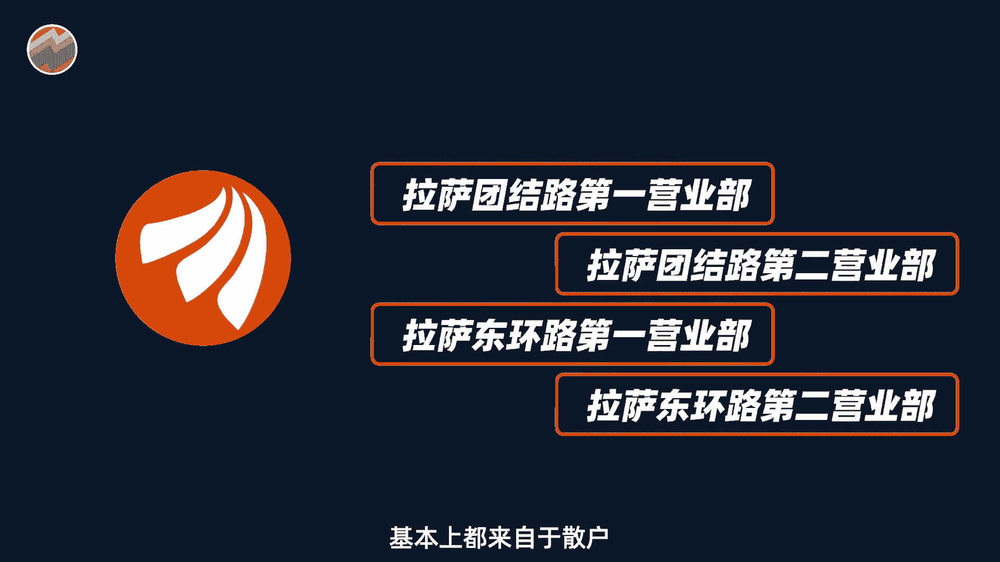

所以他们也被称作散户大本营，并且这几家营业部的身影，在我们A股久负盛名的龙虎榜上，也是常常出现的，有的同学可能不知道什么是龙虎榜，这里简单介绍一下，每个交易日都会有一些股票价格有异常的波动。

交易所会把符合上面任何一个条件的股票，列出来，放在一个榜单上面，这个榜单呢就叫做龙虎榜，感兴趣的朋友可以暂停看一下相关规则，想了解龙虎榜更多详细信息，也可以看我这期视频，然后上了龙虎榜的公司。

交易所就会公布这家公司背后，买入和卖出的活跃营业部，我们拉来历史所有的龙虎榜数据，你会发现东方财富的东环路第一证券营业部，他是龙虎榜上的常客。

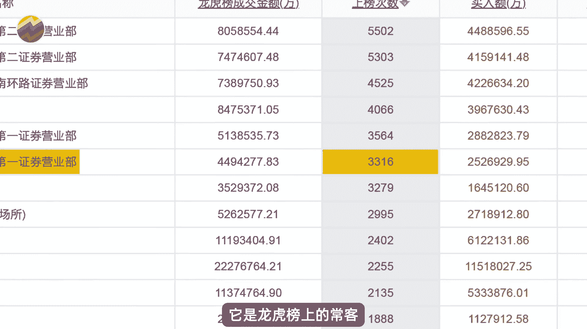

我们甚至还发现有一个财经网站统计了，东财这个营业部在上榜之后。

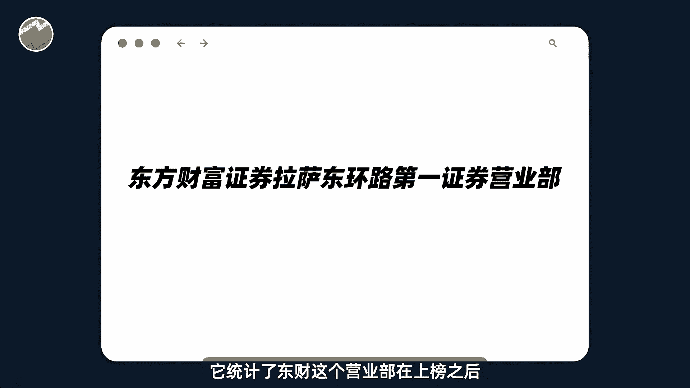

相关股票在未来的涨跌幅的表现，具体就是这张表格，你可以看到，比如说最近一个月，东财这个营业部上榜了185次，它涉及的股票呢，在之后一天的涨跌幅，是平均亏了2。96%，这是非常大的一个跌幅啊。

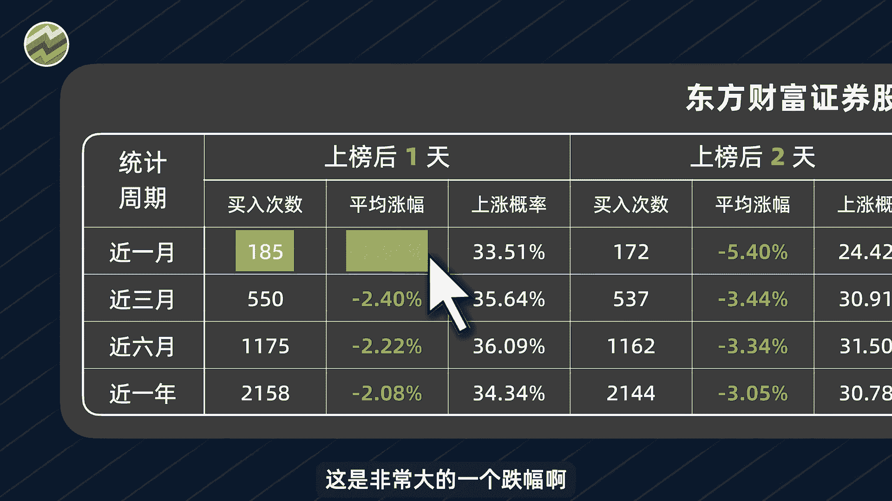

两天后，三天后以及十天后的平均涨跌幅呢，这边也有所统计，真的是一片绿啊，你可以再仔细看这张表，反正就是这个散户大本营的营业部，他涉及到的股票上榜之后大概率都是亏的。

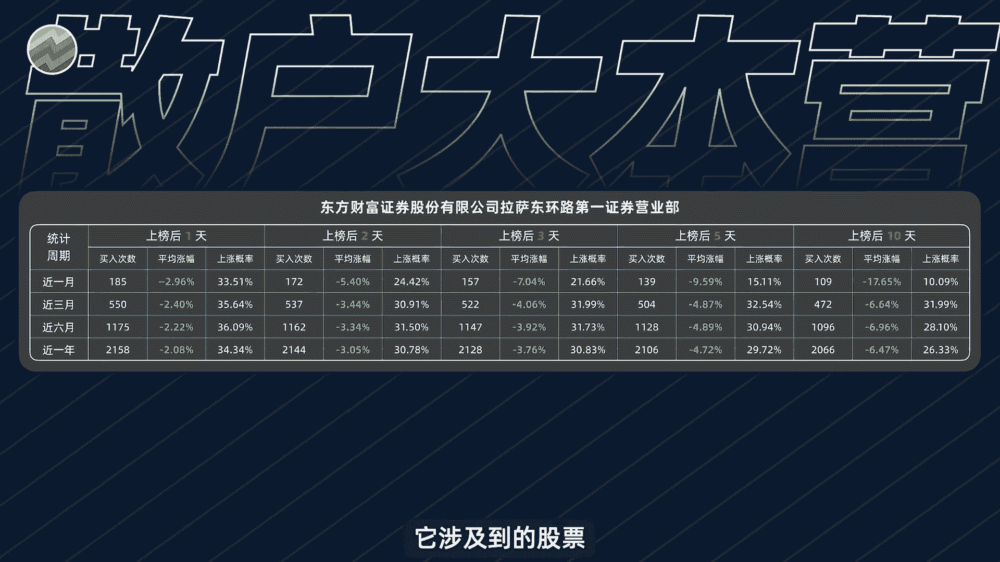

上榜越久亏得越多，胜率极低，也就是说大量散户在某个股票抱团冲杀，结果却成了反面教材，画面异常惨烈，而且除了东环路丁营业部，东财的其他三家营业部也有同样的数据。

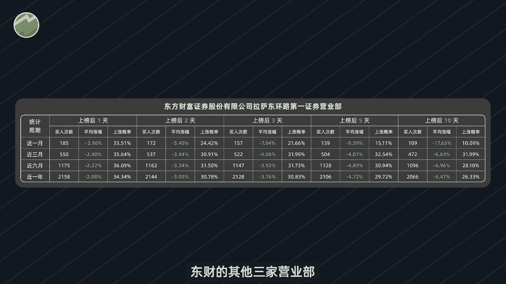

表现，也是同样的惨不忍睹，大家可以自己暂停看一下相关数据，那么大家知道这个统计是出自哪个财经网站吗，可以在弹幕里面猜一下。

三秒之后公布答案，答案呢就是这个统计啊。

居然是来自于东方财富官网的本身，所以这件事情就很魔幻啊，我打脸我自己，罗老师见了都要说一声，别这样，我这边甚至可以在评论区，把这个网指的网页发给你们，大家可以自己去围观一下，真的很神奇。

但不管有多么神奇啊，我们通过这个数据有了一个初步的判断，就是散户的人数优势啊，他好像并不能转化为实际的收益，但是呢这个数据也有一定的局限性啊，毕竟每天能上龙虎榜的股票都是很有限。

东财的营业部也并不能代表所有的散户的操作，比如说在座看视频的各位大帅哥，大美女，肯定是怎么操作，怎么赚钱，所以呢这个东台的数据啊还不够全面，我们如果基于这个数据来构建，超散户作业的量化策略会有失偏颇。

那么这个时候我们就需要用到另外一份数据，就是我们的股东户数数据。

这个数据也很好理解，假如我B站的账号就是一家上市公司，每一个关注我的人都是我的股东，那我就有大约16万的股东。

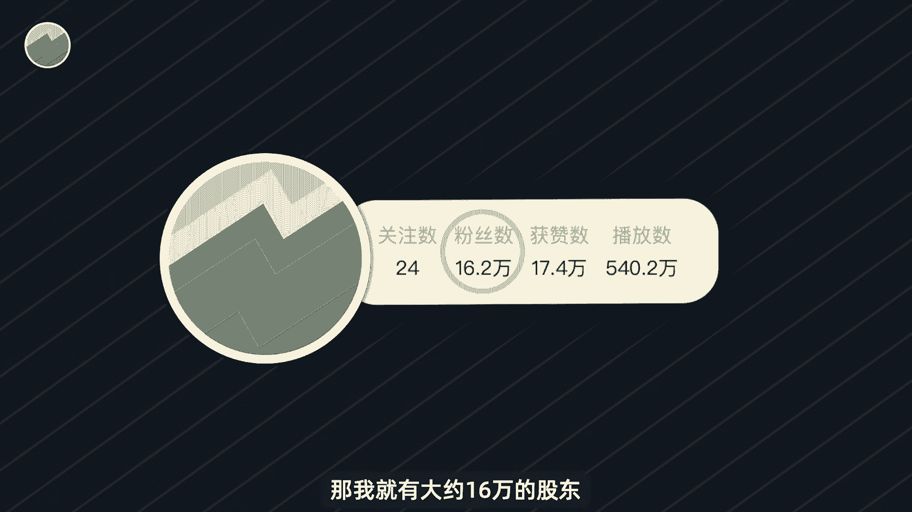

看上去人数，但是一看其他领域，好家伙，张三这个人有3000多万个股东。

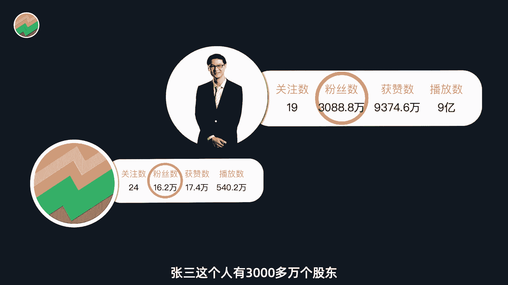

那我的股东人数和他对比的话，那就不值一提了，那相对的他的影响力比我要大很多很多，但如果换个角度啊，大家在我这边学到的量化知识，肯定是比张三那里要多的，那里都是刑法知识，言归正传啊，真实的股东数据。

通常会在上市公司的定期财务报告中披露。

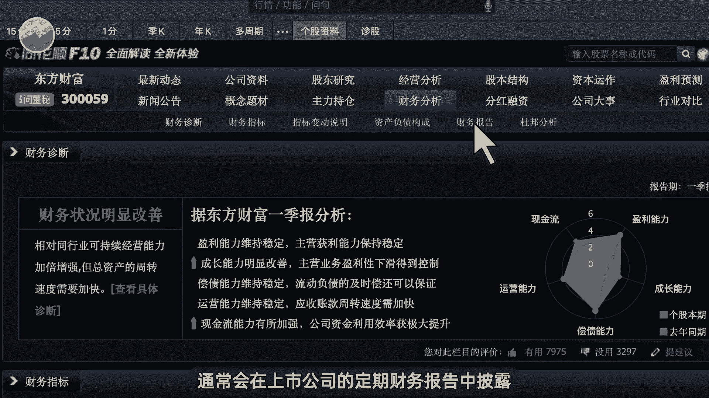

每个季度发布一次，我们可以通过不过这个字段来了解，一家公司到底有多少个股东。

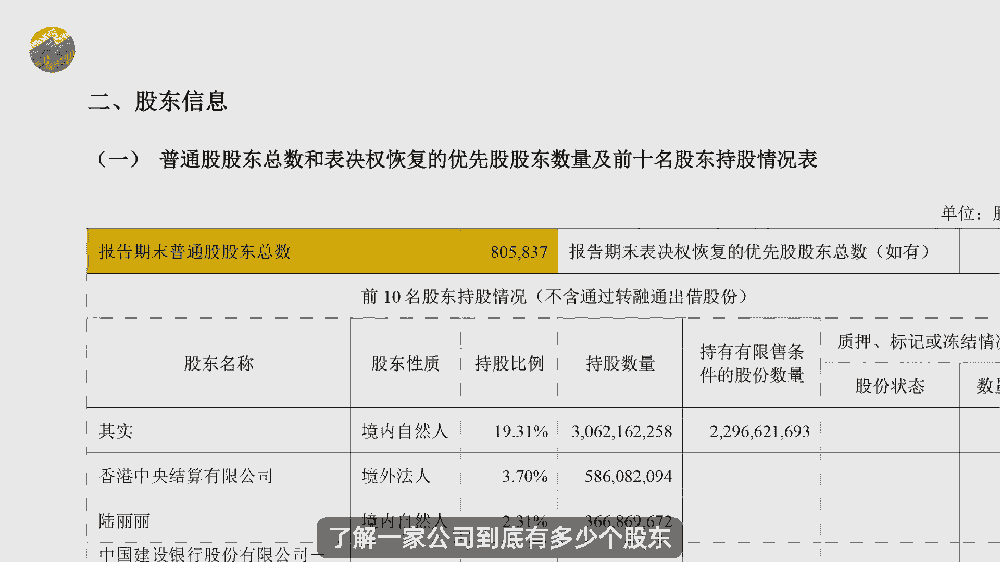

然后由于A股的散户人数远远多于机构的人数，所以我们甚至可以近似地认为，一家公司的股东人数，就约等于他的散户股东人数，那么也就是说公司的股东越多，说明持有它的散户也就越多，那么散户越多的公司。

到底是能够帮我们额外多赚钱呢，还是多亏钱呢，要验证这样的结论，我们就需要A股历史上。

所有公司的所有股东人数的数据，并借助Python代码来帮助我们进行计算，相应的数据呢我都已经帮他准备好了，你打开其中任意一个文件，不仅可以看到每个报告期的股东人数，还可以看到股东户数。

相对上期的增减和户均持股市值等等。

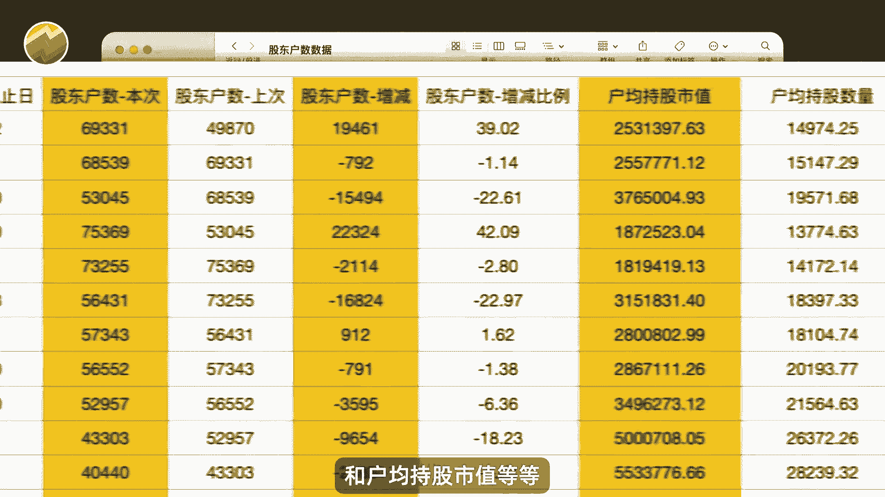

可谓非常的全面，懂行的同学一定能够发现这份数据的珍贵，如果你对这个数据感兴趣的话。

可以加几点评论区，我的微信都是可以直免费发给你的，有了这个数据之后，我们就做了一些简单的统计，发现截止2023年年底，股东人数最多的公司有126万位股东，这个公司要是在B站怎么都能评上个百大对吧。

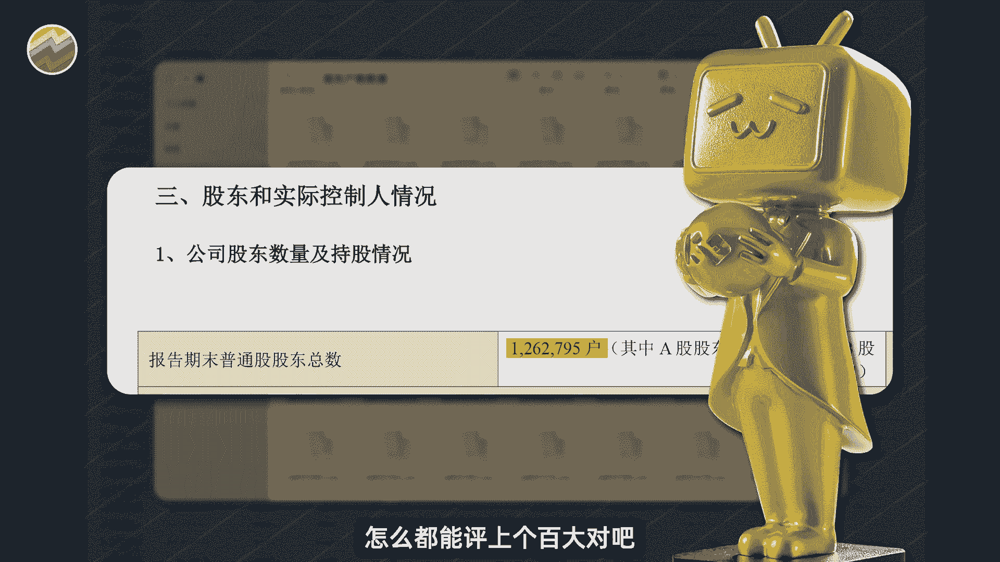

最少的公司只有1757位股东，那真的就是门可罗雀，我们又去看了那些股东户数最多的股票。

发现他们都是基本面优秀的行业龙头，这好像也比较符合大家买好公司的共识，然后呢在很多人眼里呢，他们会认为那些股东户数少的公司，关注度比较低，没有话题性，说不定可能还有很严重的财务问题，再说了。

机构能够抱团，散户人更多，抱团更能成，所以说啊这波优势在那，散户越多的公司到底能不能更赚钱呢，我们是做量化交易的，不能凭感觉去做出判断，还是要用数据说话，去构建一个相关的量化策略。

看看在历史上买股东多的公司。

到底能不能帮我们赚钱呢。

假设我们在每个月的最后一个交易日结束之后，将股东户数从小到大进行排序，并且删除掉，那些当时在st或者退市或者停牌的股票，挑选出此时股东户数最大的十个，然后呢，我们就在下个月的第一个交易日的开盘。

清仓买入这十只股票，并且会一直持有到下个月的一整月，直到下个月的最后一个交易日收，把它全部卖出，并重新去选择下个月股东户数最大的十只股票，并且在下下个月的第一个交易去买入，如此的循环往复啊，比如说途中。

我们在2024年的2月29这一天，在所有股票当中选出了这十只股票，他们是此时股东户数最多的，那么我就在下个月的第一个交易日，也就是3月1日去买入他们，然后呢，一直持有到3月29日这一天卖出之后。

重新选择符合条件的股票，那么就是这样一个非常简单的量化选股策略。

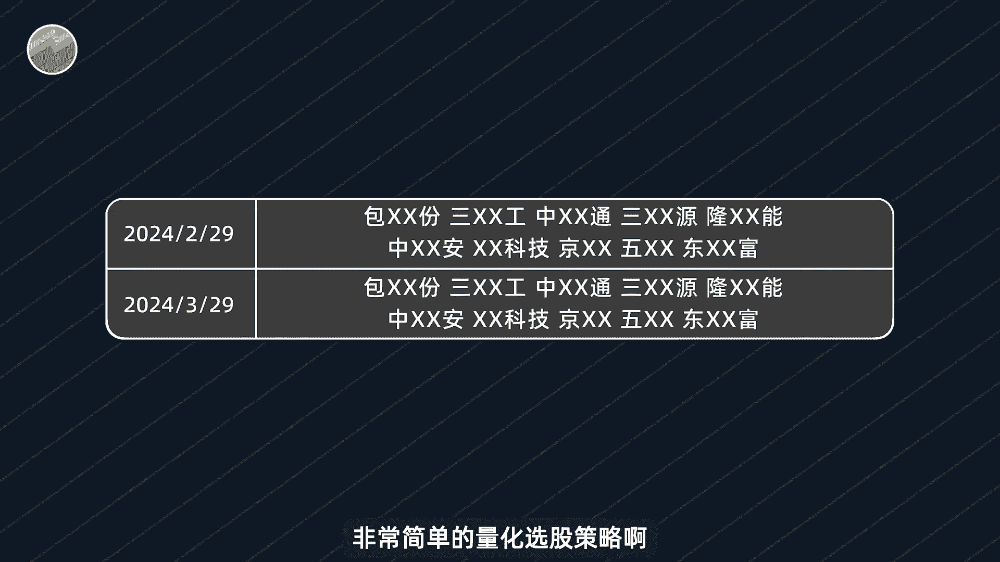

假设我一开始投入一笔钱去交易，这个策略最终是赚呢还是亏呢。

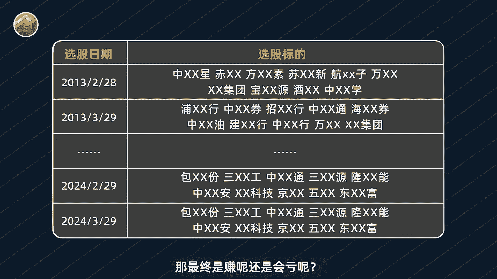

要验证我这个想法，就需要借助就全部的股东户数，历史数据和Python代码，那么相关的资料我都已经给大家准备好了，你只需要打开开个PY后缀的Python文件，点击运行就可以看到结果。

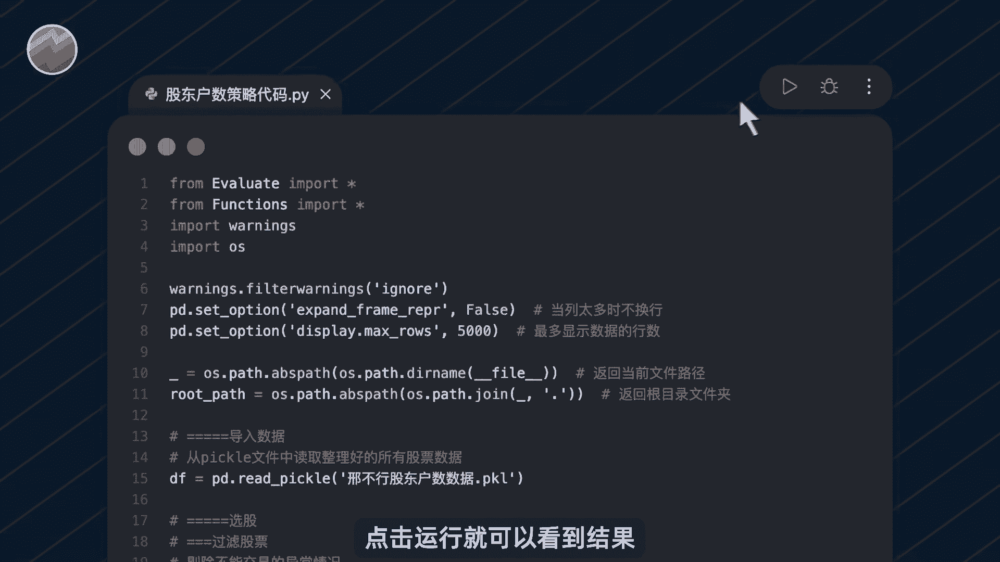

如果你需要这个数据和可以加置顶评论区，我的微信都是可以直接发给你的。

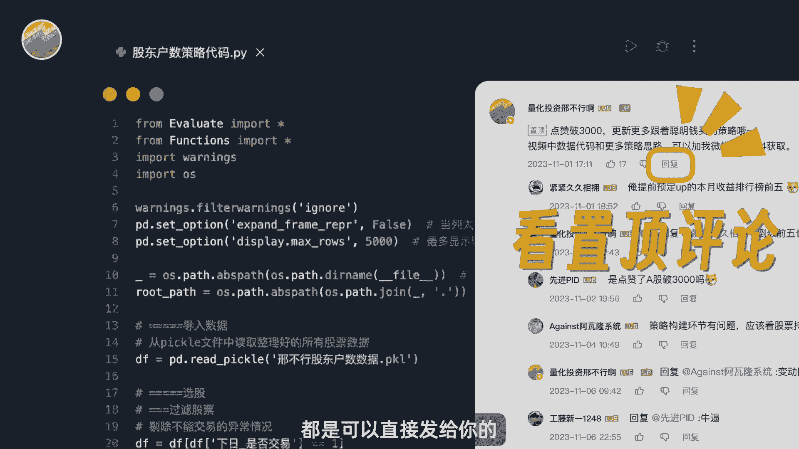

好，那么我们运行一下程序来看看结果到底如何，在看程序运行结果之前，先插一个题外话。

很多人问我小白如何入门量化投资，有什么资料分享，所以我特意为大家准备了一个量化投资。

新手学习的大礼包，你打开这个文件，它包含了非常多的内容啊。

首先这个word文档是我们自己总结的，量化投资学习路径，很适合零基础的新手。

让你知道自己一步一步需要达到什么样的阶段，看完学习路径后呢，就可以通过我整理的量化文章合集，来更全面的了解量化投资到底是什么，然后呢，我还精选了适合各个学习阶段的策略研报合集，正如我一直说的。

量化研报是很好的，量化实践项目，深度研报可以显著提升你的量化水平，还有这一份代码呢，则适合所有喜欢技术指标的人，你可以跟着教程轻松计算出所有的技术指标，并测试这个指标是否有效，如果你有一定的基础。

你还可以长回测一些策略，我为你准备好了十几个不同类型的经典策略，和他们的代码，运用到实盘，当然最后也是最关键的，量化的基础就是准确的历史数据，我会送你一份股票，历史日线数据和一份财务数据。

你可以用它来像我一样，去测试所有的技术指标和财务指标，以及大部分的策略，所以这个大礼包的内容真的非常的丰富，如果你需要的话，可以加置顶评论区，我的微信都是可以直接直接免费发给你的。

好我们回来看程序运行的结果，程序结果运行如图所示，代表策略的橙色曲线呢，从一开始的一块钱涨到了1。2，九元和图中代表沪深300指数的蓝色曲线。

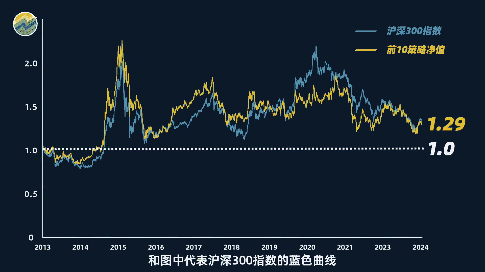

表现非常接近，年化收益只有2。29%，最大回撤却高达5%，也就是说，我们精挑细选的买股东户数最多的股票，量化策略还不如直接持有指数，这也意味着，买大量散户抱团的股票是没有办法跑赢大盘的。

但可能也会有一些朋友说啊，我每次只是选十只股票，这样太极端了，存在一定的偶然性，数据样本也不够，一旦有一只股票出现异常，就会很容易影响结论，所以呢，我们接下来就不仅仅只看，股东户数最多的前十只股票。

我们直接来看每个月股东户数最多的，前10%的股票，比如说A股现在有5000只股票，那么前10%大概就是500只股票，你想想看，散户人数最多，抱团最集中的那些股票，很大概率是处于前500只股票当中的。

那么我们来看看之前10%的股票。

它的收益到底如何呢，我们仍然使用经验的代码，只需要把条件改成前10%即可运行。

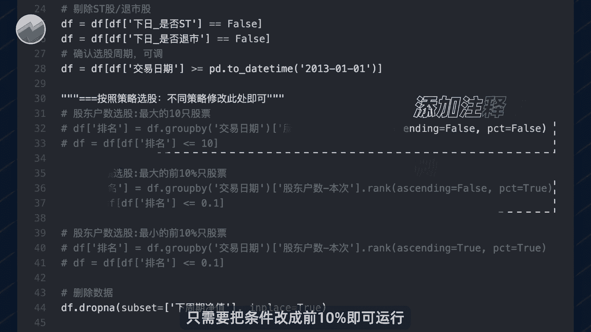

如果你需要这个代码的话，可以加这里评论区，我的微信都是可以直接发给你的。

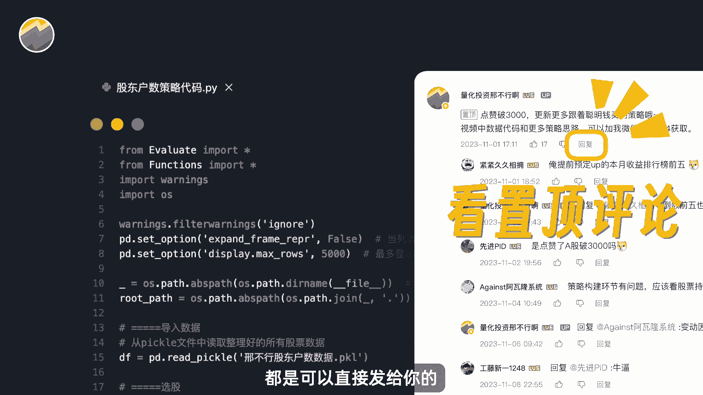

运行结果如图所示，股东户数最多的前10%，股票就是我们图中的橙色曲线，初始投呢是一块钱，最终的净值是1。19元，结果甚至还不如买前十的股票，那至此我们已经从数据角度证明了。

在大A人数优势是无法给投资者带来有收益的，买大量散户持有的股票，也没办法帮我们赚钱，然后呢，关于股东户数，我们还可以进一步研究，我们刚刚只是看了前10%的股票，对不对。

但是呢其实我们还可以看股东户数的排名，在10%到20%，以及20%到30%，或者30%到40%等等等等，一直到90%到100%的股票，看他们的表现如何。

其实也就是我们把所有的股票，按照股东户数从大到小分成十来看一看。

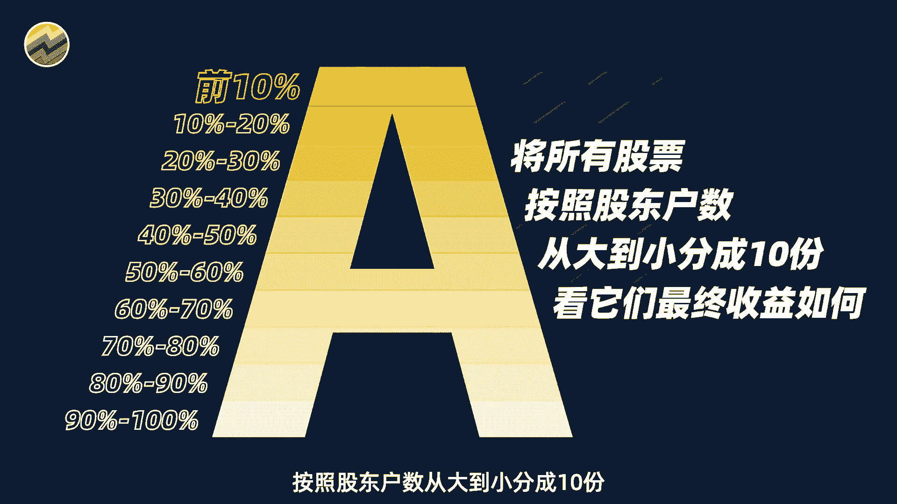

最终的收益到底如何，最终结果如图所示，我们可以很明显的观察到股东户数少的股票，它的收益是越高的，并且呈单调递增性。

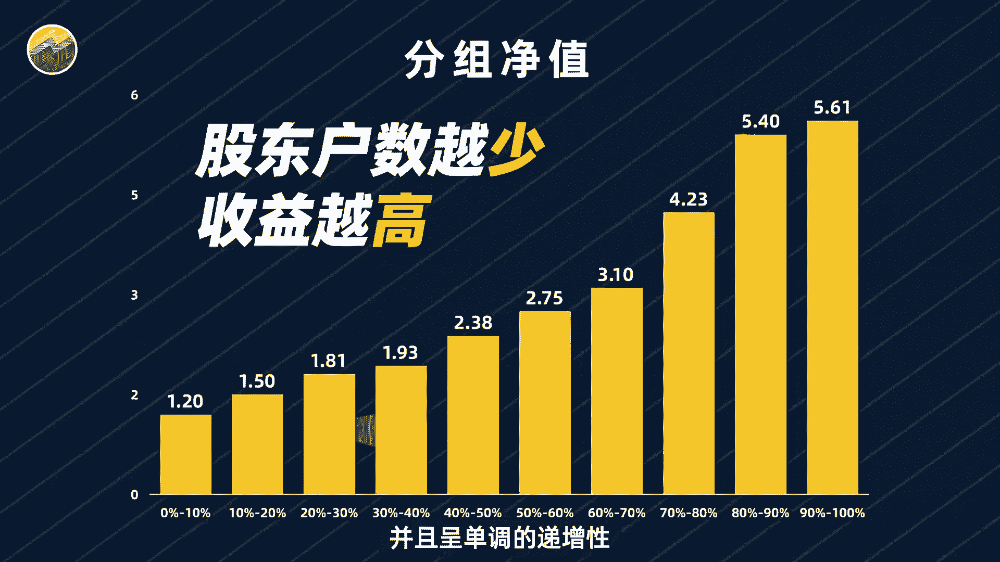

说明这个规律很强烈，看来啊我们不仅不能去买散户多的股票。

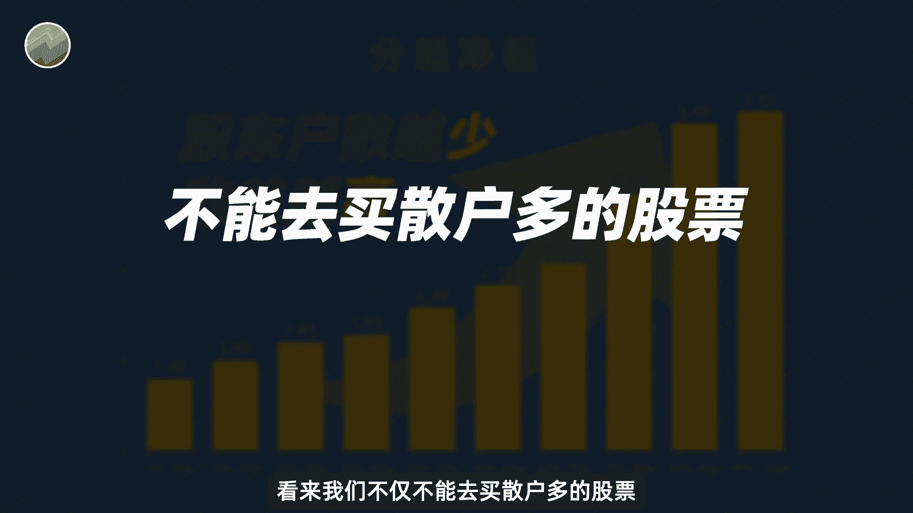

反而应该是去反着买，去买那些散户少的股票，这个其实和我们金融市场上的一些基本的道理，是一致的，比如说不要去人多的地方。

比如说真理往往掌握在少数人手中。

好不管怎么说，我们验证了A股散户的人数优势是无效的，无意间也发现了股东人数越少的公司，他未来收益会越高这一现象，至于造成该现象的原因也是有很多方面的，时间关系就不详细讲，我大概列了一下。

感兴趣的同学可以截图查看，当然最后想说的是，本期视频对普通护士的探究还是比较粗浅，比如说持仓是否会影响最终的收益呢，公司的市值又和股东人数是否有关系呢，大股东的持仓会影响股东人数吗。

这些都是值得大家去进一步深入探究的点，你也可以加指点评论区，我的微信问我要了数据和代码。

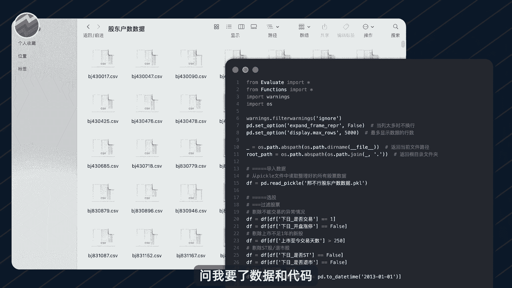

自己去把玩，做相关的研究，并且啊，我们也不能说买股东户数少的公司就一定赚钱，但不管怎么样，我们可以把这个作为一个基础策略，去想办法进行魔改优化，生成属于自己的策略，时间有限，今天就不多做介绍了。

感兴趣的可以多多点赞，点赞破5000的话，下期我们就来讲讲如何运用这个规律，生成属于自己的实盘策略好，那么本期视频就到此结束，最后感谢大家的点赞，投币收藏和转发。

