# 大A为何频繁跳水，Python量化1200W条交易数据给你答案！#量化交易 #股票 #python #金融 #A股 - P1 - 无限超人Infinitman - BV1aGtoeuEG7

大家好。

我是专注于量化投资的行不行，不知道经常看我们视频的观众有没有发现，我们过去介绍的量化策略，都是会选择在开盘的时候买入，比如这是我们介绍过的小市值选股策略，它就会在每个月的第一个阶交易日。

开盘去买入相应的股票，这是我们的散户反着买事件策略。

他也是在每个交易日的开盘买入选中的股票，那么有人就会有疑问了，为什么选择在开盘买入呢，不能在前一天的收盘，或者在盘中的时候去买入吗。

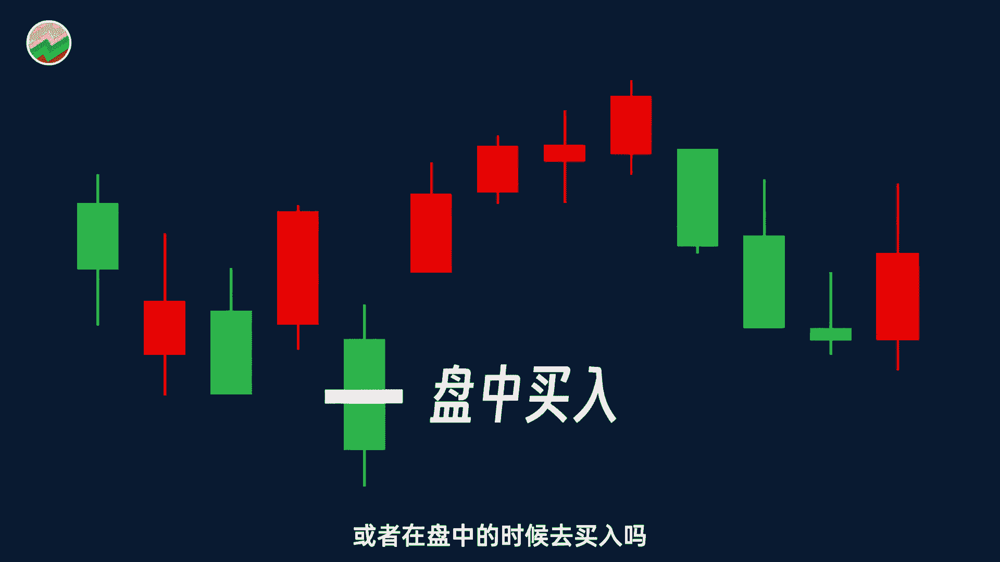

这样就能在第二天高开的时候卖出效果会更好，而且印象中大A好像经常性的高台跳水，那么开盘一买不就要承受亏本吗，关于这个问题啊，其实部分原因呢，也和股市中的一个常见现象有关，你了解了这个现象。

不仅对做量化交易有帮助，自己手工交易也会很有启发，那么本期视频我们就来做相应的解答，视频开始之前，我们先做一个小调研，你自己平时交易的时候是习惯开盘买，收盘买还是盘中去买呢。

一直以来A股都被认为是国家一级跳水运动员，非著名降速自行车手，3000点高地常备守义军，因为大家遇到的行情都是这样的，这样的或是这样的，尤其是最近啊，大家可能都习惯了A股的低开，即使偶尔高开。

也会觉得有低走的感觉，我也问过一些有交易经验的朋友，他们印象中好像大多数时候A股都是低走，那这样的感觉是否正确呢，我们是做量化交易的，不能只凭主观直觉去判断我们的想法，还是要找来所有的A股历史数据。

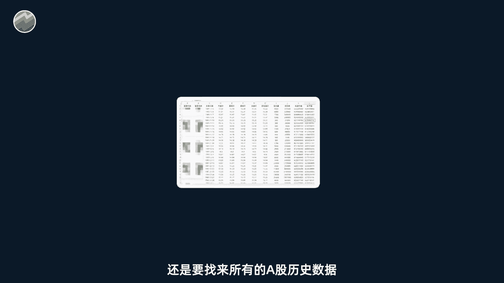

借助Python代码来看看，A股是否真的像我们所想的那样频频低开，一路向南，而这也恰好是决定我们策略，是开盘买还是收盘买的关键所在，要验证A股历史是低开多还是高开多，我们就需要定义一下什么是低开。

什么是高开以及低开，低走和高开高走分别是什么，其实也很简单啊。

只要当天的开盘价超过前一天的收盘价，那么就认为是开盘上涨，也就是我们常说的高开。

相反的开盘价低于前一天的收盘价，那就是所谓的低开低走。

也就是指当日的收盘价小于开盘价，高走呢就是反过来开盘价低于收盘价，很容易理解，那么知道了相关的定义，我们就可以找来上证指数的交易数据。

并编写相Python代码来看看结果到底如何，具体情况呢，如图所示，我们从2007年考察至今啊，上证指数的4150个历史交易日当中，出现过1750一次，高开占比42%，2397次，低开占比57。76。

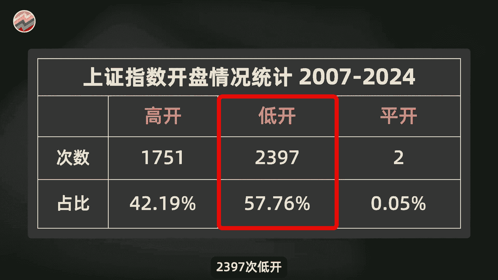

还有两次平开，从数据角度看啊，A股确实是低开的更多。

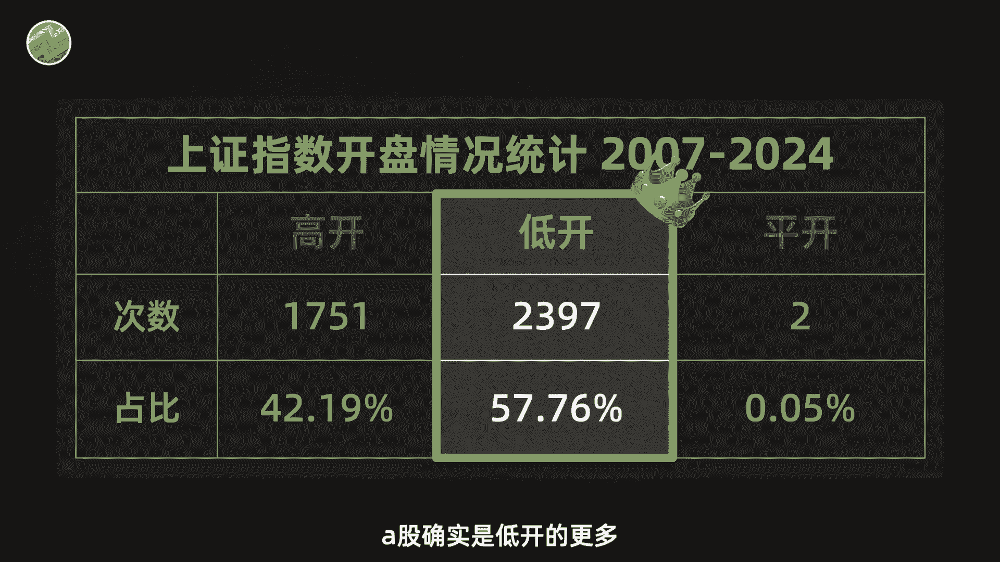

而且是明显的多很多，如果赌场跟你的胜率是这个样子的话，这个赌场应该早就关门了，我们顺便还统计了A股的其他指数，发现也是低开的时间居多，高开的更少。

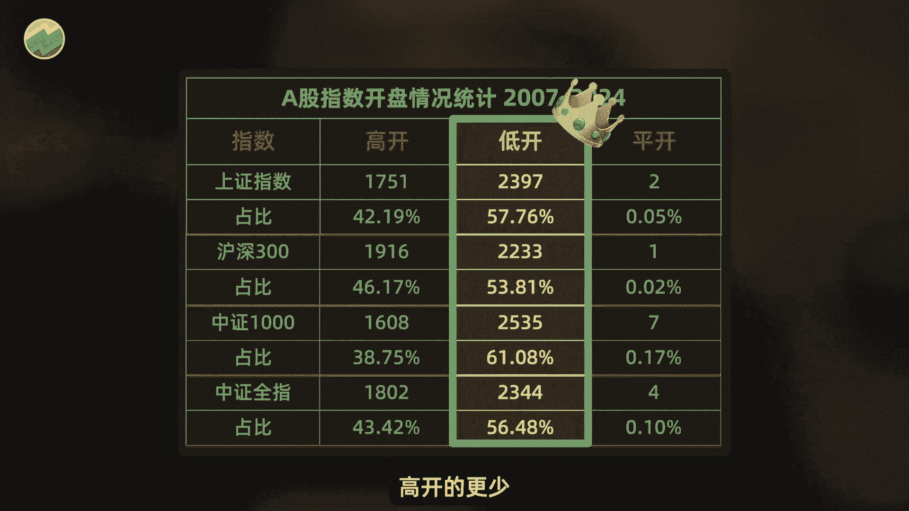

关于这个现象，它背后的道理呢其实是比较难解释的，有人他认为这是和A股的T加一交易制度相关，但我个人觉得呢好像也不能完全说通，但不管怎么样，我们可以拿一下其他T加零，交易市场的指数表现来做个交叉验证。

比如啊我们可以来看一下恒生指数，标普500和纳斯达克指数，他们的高开低开比率，具体结果呢如图所示。

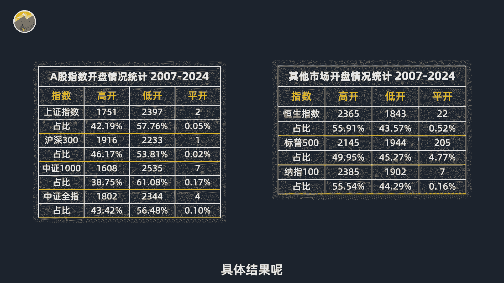

好像真的这些指数，他们高开的情况会明显的占比更多，但是话又说回来。

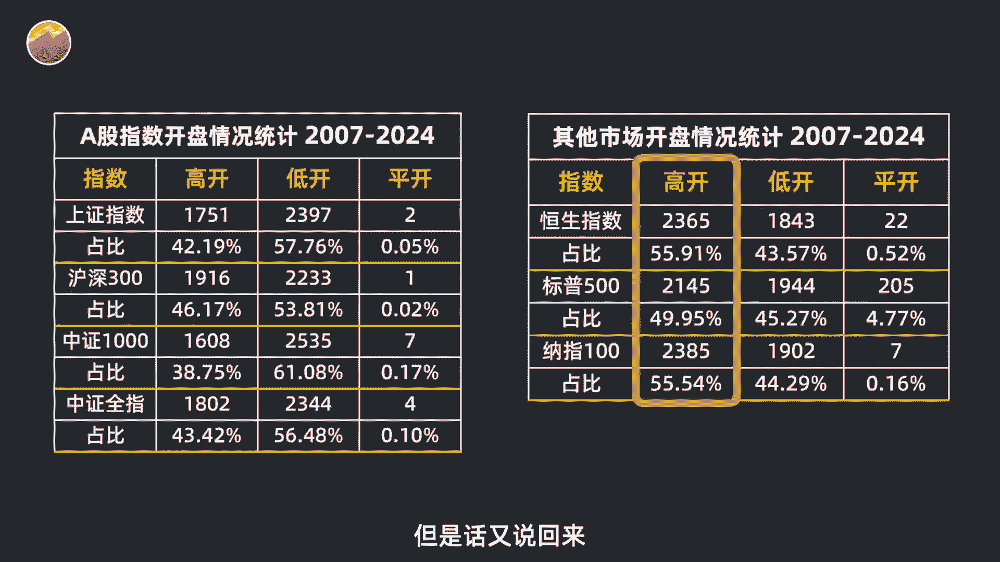

这两堆指数，他们高开和低开比例的差别，真的仅仅是由T加一交易制度所带来的吗，我们先不管这些，我们先进一步往下看，接下来我们来看一下股，高开和低开之后的走势是如何的，也就是开盘之后的当天的走势。

那么这个计算也很简单，只需要在原先的代码上面稍微修改一下，就可以，具体运行，结果呢如图所示，上证指数在历史上共出现一千两百九十十二次，低开高走的现象，占比31%，这超出我们经验上认为的。

最多的是低开低走和高开低走，与大部分人的感知呢还是相悖的好。

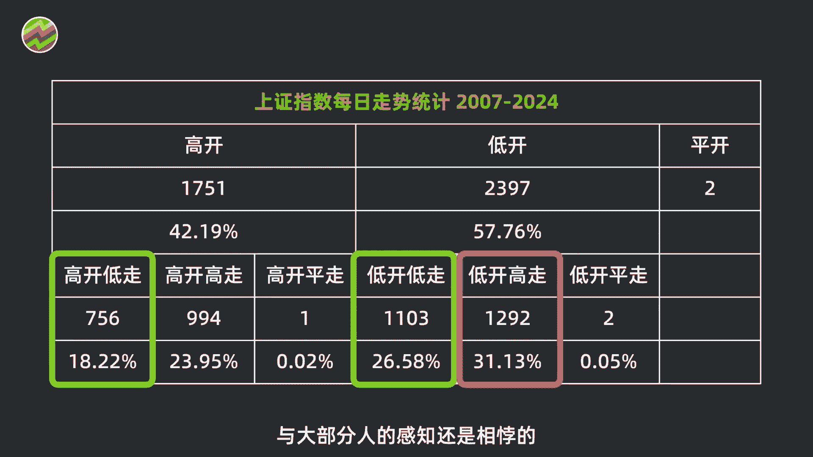

当然啊我们做这个研究呢也不能只看上证指数，就像我们之前的视频当中说的一样，指数无法代表全部的股票，尤其是上证指数这样一个失真的指数，所以接下来呢我们就要找出全部A股的个股，历史数据。

总共有5000多只股票来编写相应的Python代码。

去看看在个股上面到底是低开更多呢，还是高开更多，以及低开高走的现象是否可以维持呢，具体的数据呢我已经帮大家准备好了，这里面包含了A股历史上所有5000多只股票。

甚至是已经退市的，你可以打开其中任意一个文件，包含了这个股票从上市第一天至今，每天的开高收低的价格，并且你可以计算付全价，非常的完备，如果你需要这个数据的话，可以加我抖音的群聊，都是可以直接发给你的。

都可以借助Python去编程验证，我们点击运运行一下代码，看看最终结果会怎么样，程序运行结果如图所示。

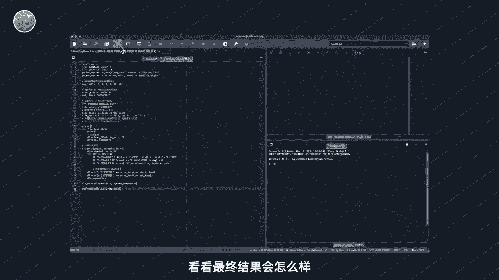

2007年至今，所有A股股票也都是以低开为主。

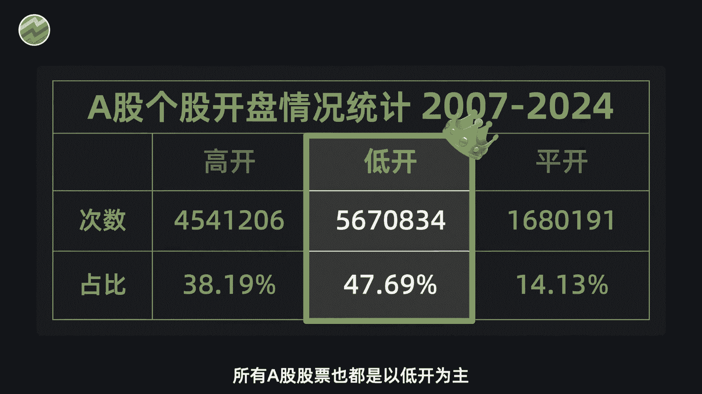

比较神奇的是啊，在剔除了停牌的情况放下，竟然有168万次的平开，占比14。13。

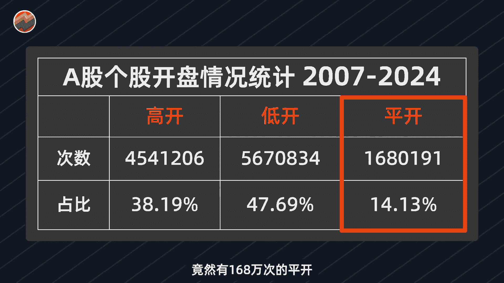

然后进一步挖掘约当日的走势，我们发现个股当中还是低开高走的居多，然后才是低开低走和高开低走，这与指数的结论呢是一致的。

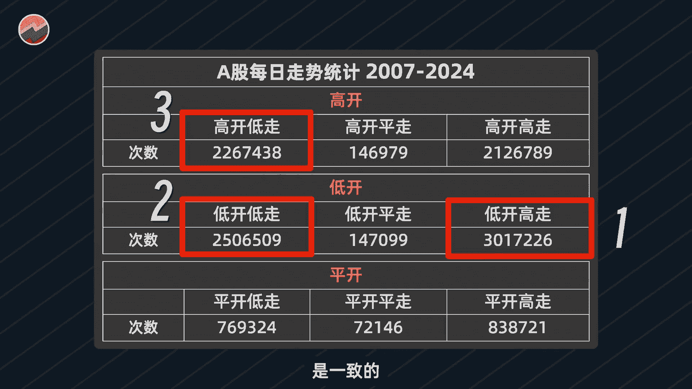

A股整体呢就是低开居多，且低开高走的趋势是最多的，其实这个数据呢也就解释了，为什么我们实盘的策略，会倾向于在开盘去买入股票，因为这会有更大的可能性在收盘获得正收益，而相反如果是在前一天的收盘买呢。

你则有更高的可能面，开盘是下跌的境地，那么有了这样的结论啊，大家哪怕不做量化交易，自己手工操作的时候，也是可以做相应的借鉴的，比如说你本来准备今天买入这个股票，但是你可以稍微等一等。

等到第二天开盘的时候再去买入，这样相比于你在今天收盘买啊，会有一个系统性的优势，日积月累下来呢也是不得了的，但是呢我们是做量化交易的，比对于手工匠操作更倾向于去做系统性的研究。

接下来呢我们就继续深入的去探索一番，看看A股的低开高走，又有哪些更细分的规律可言，比如说我们就想找一找，到底哪些情况下低开会更加容易高走。

我们呢可以把低开的幅度啊，按照0%到1%，1%到2%，这样进行分组，以此类推，一直分到8%到90%组，90%以上呢就涉及到跌停的情况了，这边就暂时不讨论，那么我们去看了一下这九组低开的情况。

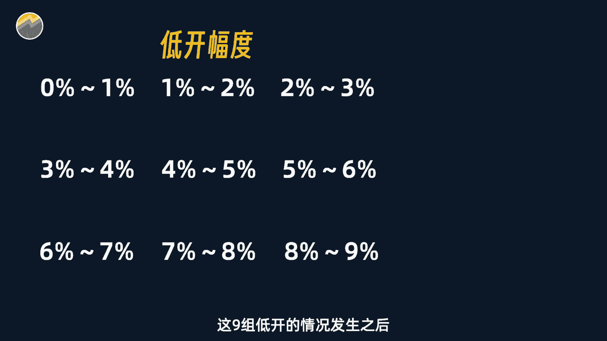

发生之后，在未来一天两天，三天以及更多天的股价表现到底是如何的，那么要验证这个实验的想法，就需要要借助全部A股的历史数据和Python代码。

相关的数据和代码呢已经给你们准备好了，只需要打打开这个PY后缀的文件，点击运行就可以看到相关的结果，如果你需要这个数据和代码的话，可以加我抖音的群聊。

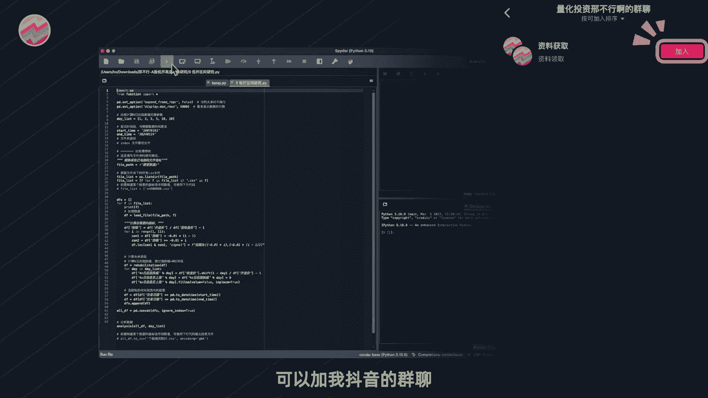

都是可以直接发给你的，程序运行结果如图所示，07年至今啊，在低开1%以内的情况是最多的。

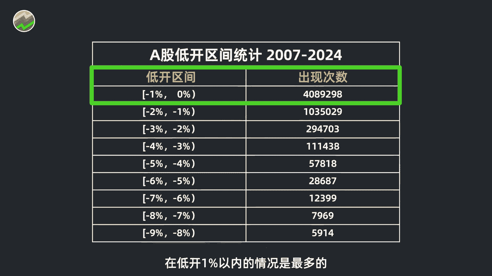

总共有409万次，而低开8%到9%。

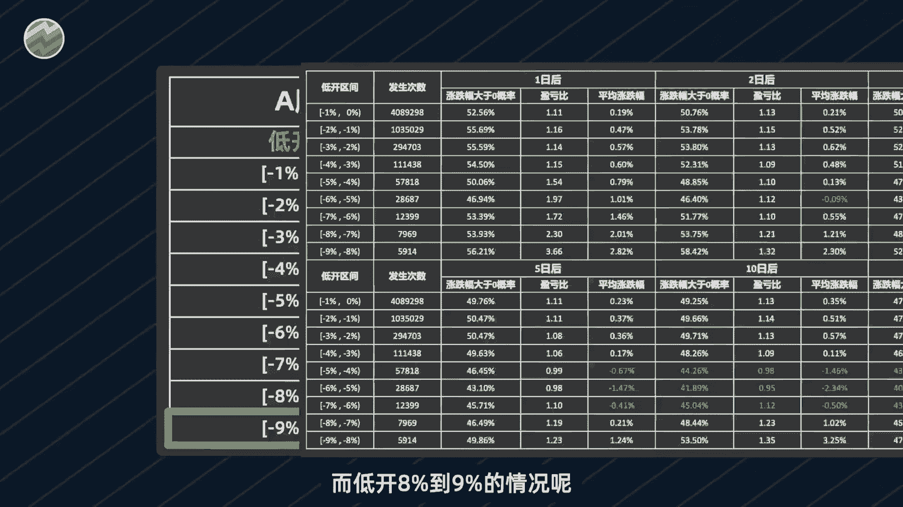

情况呢只出现过5000次，很明显啊，低开的幅度越大，出现的次数越少，从一天的表现来看呢。

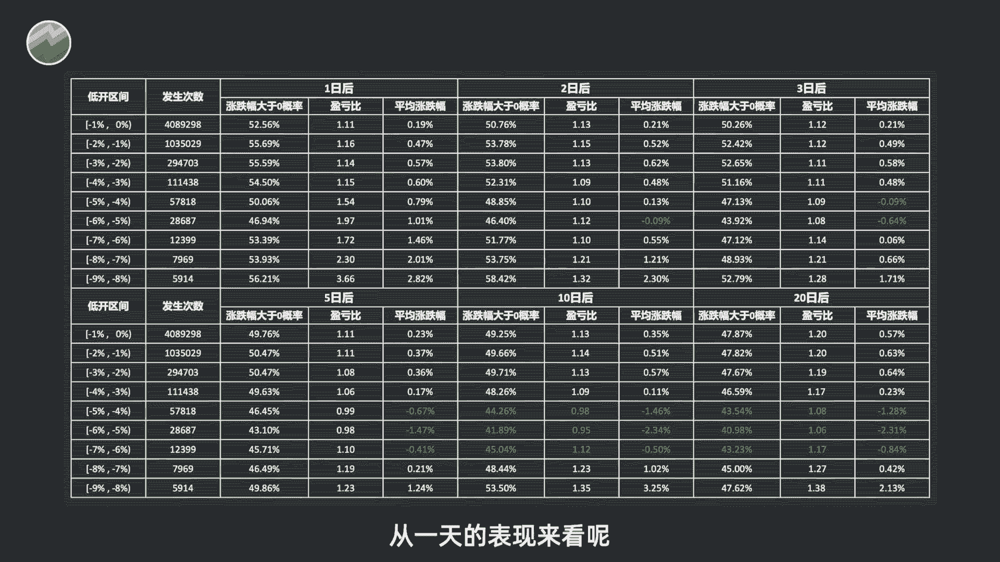

跌幅8%到9%的区间，低开是更容易走高的，高走的概率达到了56。21%啊，并且盈亏比也很高啊，高达3。65，这意味着每一次高走的收益，相当于3。6次低走的收益啊，我们再进一步去看买入低开的股票。

低开幅度越大，当天的平均收益越高啊，最高的甚至有2。82%，当然需要注意的是啊，在实际操作当中啊，我们是无法在当天卖出这些股票的。

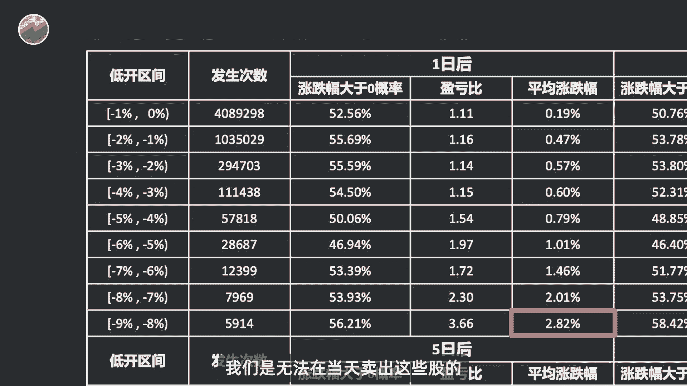

没有办法进行实操赚到这个2。82的钱，但不管怎么样，长期来看，低开的股票未来收益都是不错的，除了低开4~7这个区间的股票。

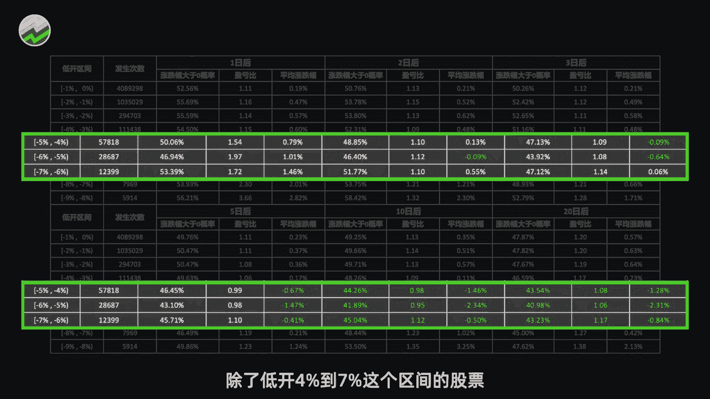

还是会面临亏损好，那么有了这样的一个初步结论啊，我们是否可以构建一个对应的量化的策略呢，好，以上呢就是我们对于低开现象的一个，更深入的分析，当然本期视频呢只是得出来一个结论。

从一个结论转化到一个可以执行的交易策略，其实是还有很多的步骤的，那么时我们就不再继续讲解了，大家感兴趣的话呢，可以多多点赞，点赞破3000的话，我们可以讲一讲相关的量化策略，到底如何去设计。

那么本期视频就到此结束。

非常感谢大家的点赞，收藏转发和关注。

