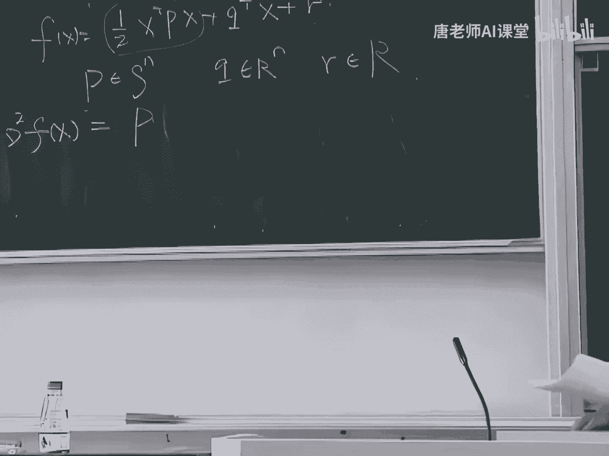

# 【比刷剧还爽！】这太完整了！量化交易和python金融分析实战课程，全程干货无废话 入门到精通一步到位！（数据挖掘分析／大数据／可视化／投资／金融／股票／算法） - P69：73. 10.11.凸函数定义2，常见例函数的凸性（1）(Av526664194,P10) - AI算法-溜溜 - BV1iC411n7XN

呃上节课呢我们讲到了凸函数的三个定义，呃，实际上这个凸函数的定义非常非常多，总共有四个定义，我们今天会讲到第四个定义的啊，那么这四个定义呢各有各有它自己的用处，呃。

我们先来简单的复习一下上节课讲的三个定义，好这第一个定义呢是个非常一般的定义，也是我们平时接触的可能比较多的一个定义，但是真正用嘴啊，其实有的时候不是很方便啊，这个定义是这样的。

就是如果我们讲这样一个函数是凸函数呢，那么它等价于我们在讲这么一件事情，就首先呢这个函数的定义域啊是个突击，其实呢我在这个突击中间，我在这个定义中间去任意的去选上两点X和Y，那么我的结论是什么呢。

就是这个函数要满足这样的性质，我对这个XY这两点去做个凸组合，然后我再求它的，求它的这样一个函数值，它要小于等于FX和FY这两个函数值的凸组合，就需要满足这样的这样一个条件。

那么这个意思呢就有点像我们上节课讲过的，它实际上是在这个是设个锅上面，就发生一根棍子，要使得这个棍子要比这个锅一定要高，那么这就是关于这个凸函数的第一个定义，那么这样一个东西呢，这样的定义啊。

对于高位的情况的话，实际上用起来有的时候不是很方便，那么对于高位的情况的话呢，我们又引进了另外一个定义，好那么简单起见呢，上面这块我就不写了，我就只写这底下这一块好吧，好。

那么第二个力呢用我们这个形象化的比喻来讲，就是一个切西瓜，我们对这个函数去切个西瓜好，那么我在这个高维的函数里面呢，这个高维函数定义域里面呢，我找个点X，然后另外呢我再找一个任意一个方向V。

那么这个X和V都是属于都是这样一个N维的，这个点，或者说是一个方向，那么我来这么构造这样一个这样一个任意的，这样一个一定要记住，这是对于任意的X和任意的V，都要满足这样的条件。

就是我构建一个任意的这样一个函数G，这是个一维的函数，G它的自变量是T那么gt是什么东西呢，gt就等于FX加上TV好，那么这样的函数呢它必须是凸函数，当然了，我必须要满足这个这样一个对于定义域的要求。

就是这个X加上TV呢，是要属于这个F的定义域的，那么这个问题呢，这个定义就是把这样一个高维的复杂的问题，给降到低维上面来了，那么第三个定义是这样的，是第三个定义，我们讲的是关于这样一个凸函数的。

它的一阶条件，所谓的一阶条件呢，实际上就是如果当我这个函数是可导的时候，如果当我当我这样的函数是可微可导，就是它有这样一个导数存在的时候，那么我可以怎么去分析它的这个图形呢。

好那么如果这样一个函数是可微的情况下，我可以在他的定义里面去选择任意的两点，X和Y那么他必须要满足这个条件，就是FY是要大于等于FX，加上这个X的一阶偏导，在X最点的一阶偏导和这个Y减去X这个方向。

它的内积好，那么这个比喻呢就是就像我们上节课讲的，就是在一个铁锅底下去放上一根棍子，这根这根棍子一定要是要比这个铁锅要矮的，实际上就是我要对这个铁锅啊，它的底去做个切线，做个这样的方向好，我们再证明呢。

上节课呢我们试着证明一下这个定义，这这这样一个啊这样一个定义的前半部分，就指的是，就是就是说如果当这个F是一个低维的函数，如果当这个F是这样一个一维的函数啊，我怎么去利用这个第一。

去证明这样一个新的定义，三我们上节课讲了这样一件事情，那么我们把这个思路重新再稍微解释一下吧，好上节课呢实际上我们是证明了这样一件事情，就是如果这个这个一维的函数，F它是个可微的函数。

而且呢F呢是个凸函数，那么也就是说这个函数它的定义是个突击，另外呢我在里面去找上这样一个，利用了两个点X和Y，我要满足这样一个不等式存在好，这个呢是对于一个一维的情况，那么我们讲就是既然这个一维的情况。

我们是用这个定义来证明的，那么对于高位的情况的话，我们应该用哪个定义来证明呢，我们就应该来用一下D2了是吧，好我们来试着把这个证明也给整完好吧，这个证明里面呢实际上也分为两个方向。

第一个方向呢就是说我需要证明，如果这个函数是一个凸函数的话，那么他需要满足这个条件，另外呢我要证明一下，他如果如果满足这样的条件的话，那么它就是一个凸函数了，我们先来证明这样一个正的方向，好。

那么既然我们现在知道这个F是个凸函数的话，那么很显然我们就要从中间去选择两点对吧，我肯定要从中间去选择两个点，来看看这两个点它会满足什么样的性质，那么下面呢我来构造这个函数。

我来构一定要构造一个一维的函数，对不对，因为我们的D2里面是要求要低，要构造一个低维的函数嘛，我来构造这个函数，这实际上这个我中间占一个自变量啊，实际上是以X和Y的什么组合呢，这是X和Y的什么组合。

是个仿射组合是吧，这个词不要忘了啊，是个仿射组合，因为这时候我对T没有任何要求，为什么呢，因为我在D2里面，我对于T也是没有任何要求的，只要求这个这个X加上TV，是要再占一个地域里面就可以了，好。

那么这个这个式子实际上看起来还不是很明显，我把这个式子稍微的改一下，你们就能看明白我在做什么事情了，看清楚吧对吧，这个是一个完全等价的这样一个变化，那么实际上我在做什么事情呢，就是我首先呢找到了一点X。

首先呢我找到一点X，这跟这个D2里面是一样的，我要找到一个起点X，另外呢我有一个这样一个距离T，这是我的距离T，另外我还选了一个方向啊，我选的方向不是一个V，这个V这样的这样的东西太麻烦了。

我就用这个Y减去X来代替我，怎么来选择这样的方向呢，就是首先呢我选择已经选择好了一点X了，另外呢我在这个空间里面再选择一点Y，那么从X到Y，这就是我要选择的方向，叫做V，这个可以理解对吧好。

那么下面我们再来看一看啊，这个函数这个gt这个函数它是个一维的函数，我们就可以利用一下，我们对于这样一个定义的前一部分的证明，对于这种低位情况的证明，我们来看看它的一阶偏导是等于什么东西，这个可以吧。

因为我们已经假设这个F是可导的，F是可导的，那么里面的东西呢，又是一个关于这个T的一个可导的，这样一个函数，所以这个函数自然是对于T是可导的，也就是说gt是一定对于T是一个可导的函数。

那么怎么去对T求微分，我相信你们肯定都会吧，很简单对吧，好我们来看看我们对它求完一阶微分之后，实际上我们可以得到这样的结果，那么我们再用一下这个DA2里面的，这样一个结果，就是如果当F是一个凸函数的话。

那么gt这样的函数呢它一定也是个凸函数，它一定是个关于TT的凸函数对吧，这没有问题吧，这在这里面呢，在这个式子我们在讨论这个gt的性质的时候，我们一定要去去借鉴一下这样一个D2。

因为D2里面是关于这个从高维到低维的，这样一个变换的，那么既然这个gt是个凸函数，既然这个gt是个凸函数，那么它的一阶偏导一定要满足一个性质，就是我们之前讲过的这样一个性质对吧。

他一定要满足这样一个性质，就是我愿意的去选择两点，比如说我选择第一点叫T1，第二减掉T2，那么它一定满足这样的性质，好这个没有问题吧，这个是我们上节课刚刚证明过的嘛对吧，对于一维的情况。

我们已经证明了这件事情了，就是如果gt这样一个一维的函数，它是它是个凸函数的话，那么它一定要满足这样一个性质，他一定会满足这样一个性质的，好，那么现在呢我来对这个T1和T2呢，我来选取一些比较特别的数。

因为这个是对于任意的T1和T2都是成立的，那么我来选择这样一个T1和T2，我把T1呢给选成一，把，T2呢选成零，那么这个式子自然也是成立的，好那后面既然T1是等于一，T2是等于零的话。

那么后面一项我就可以不用写了，那么我再来看一看啊，我把这个这个G和G的微分呢，我把它给带进去，我把它给带进这个式子里面了，来看看是个什么样的结果，首先呢这个G1是什么东西呢，这个G1实际上就等于FY了。

对吧没错吧，看看上面这个关于记忆的定义，G0G0就是FX了，这也没错吧，好，那么之后我对于这个G的微分，在零这一点去去求它的值的话，它是什么呢，我们看看G的微分式等于什么东西，没错吧。

你们自己把这个T等于零，把它给带进去，自己去试试看，就这样一个结果，那这是什么东西啊，这是什么结论呢，这是不是就是我们要证明的结论呢，对吧好了，这个证明结束了，这个思路有没有理解。

在整个的这种明看来好像显得很巧妙，对不对，实际上是我们是怎么做的呢，我们首先呢去用了一下，首先我们去用了一下这个定义，一定啊，对不起啊，是我们用了一下定义二，在用第二列的时候呢，我们就去选了两个点。

我们从这两个点呢去切了个西瓜对吧，构造了这样一个低维的函数gt，然后呢我又用了一下这个这样一个dd2，里面这样一个结论，就是这个gt呢它是个凸函数，我们是在知道这个gt是个凸函数的时候。

我们就可以用一下这个这样一个，第三就是我们正在证明这个定义的前半部分，已经证明过的结论，就是他要满足这样一个，他要满足上面这样一个式子，要满足这样一个这个不等式好，对于这样的不等式，我们取个特例的话。

因为我们来想象一下，实际上我们在我们在讲这个D2的时候啊，这个第二实际上是个非常冗余的一个定义，为什么呢，因为你要证明一个西瓜皮是个凸函数的话，你并不一定要在这个西瓜上去切上无数刀，对不对。

这实际上是个很冗余的事情，那么实际上我们在这个证明的时候呢，我们只是只是用了中间的一刀，这道是怎么取的呢，我觉得取的是这个T1是等于一，T2是等于零，我是这么去取上一道的，这就是我的整个的这样一个思路。

就是这么去做的好，那么下面这个结论就是很自然的一个结论了，好这个理解了吧，这证明了这部分实际上是比较简单的吧，好那么我们再来证明一下这个另外一个方向，就是从这个方向来证明一下，这个F是一个凸函数，好。

那么同样的，我们也要在这个函数里面去找到两点，在这样一个地域里面去找到两点，我们来这样去选择两点，首先呢我已经有了这个这个X和Y的两点了，然后呢我再选择两个T这两个不同的T，那么他需要满足一个要求。

就是唯一的要求，就是这样两个构造的新点，都一定要在这个F的地域里面，一定要满足这样的要求，那么现在我们的结论就是我们有了这样一个，我们已经有了这样一个结论存在了，我们要证明这个F是个凸函数。

那么怎么去做呢，我就把这个结论呢也用在这两点上面，这个没问题吧，好，好这个式子很长，这个我写的很累，大家写的可能也很累，但是呢这个思路是很简单的，就是我把这两个很长的点呢，把它给带进去。

带进这个式子里面来，我就可以得到这样一个不等式了，这不等式是一定成立的，好这个式子你们你们都写完了吗，好既然你们都写完了的话，那我来告诉你们，这个式子实际上可以写的更简单一点，我们不用写这么长。

为什么呢，因为后面这两个点呢，我可以把这个东西，我可以把它给组合一下，对不对，我可以稍微的组合一下，可以改成什么东西呢，可以这样吗，你们自己去把它给分解一下，这肯定是没有问题的，为什么呢。

因为中间这个X5，前面这个X跟后面这个负X，我可以把它给抵消掉了，那么剩下的几项呢，剩下就剩下四项了，这四项分别是YX，还有这个T这个读叫叫TTT，TTTT这样一个这样一个点呢。

实际上他们他们几个四个乘积吧，好那么有了这个结论之后，我再来定义一个新的函数，这个函数叫做又是D这样一个函数，同样的我还是要定义这样一个函数G，因为对于这样对于这种高维的情况的话。

我们一定要利用这个D2，那么在利用D2的时候，你一定要定义这样一个一维的函数G，好那么利用前面这个不等式啊，我就可以把我就可以写出来，关于这个G和GQ弹它们之间的关系，好这个是没有问题的吧。

我现在我现在写这个可能还是太早了一点啊，稍等一下，我还是把这个稍微改一下，首先呢我还是要还是要去求一下，这个GQA1撇，我对于这个g q a gt ta去求个偏导，去求个一阶偏导。

我看看可以得到什么结果，实际上我可以写出来一个关于F和，这个和这个TT这个函数的，对不对对吧，因为这个G1撇TT，它的话我可以很简单的形成这个形式，这个一阶开导。

实际上我们在之前一个证明的时候已经用过了，这是以前我们以前我们已经求过了，这样一个偏导了，好，那我把这三个式子，这三个等式啊，我代入到这样一个不等式里面来，我代入到之前这样一个不等式里面来。

我来看看我可以得到一个什么结果呢，也就是说我任意的去选择两点T和TQA，那么它都是这个G这个我新定义的这个函数G，它的定义域里面的点，那么它一定是满足这个不等式的，那么这个结论说明什么呢。

如果我有这样一个不等式的话，那么可以说明什么呢，可以可以说明这个G是一个凸函数，是不是对吧，这个G是个凸函数好，那么我这个gt是不是任意的去选的，是不是我可以任意的去选择的，对不对对吧。

因为我的这个这个起点，我的起点是是我任意的去选择的一个一个X，然后我的终点是我的任意去任意的去选择的，这样一个Y减去X这样一个方向，所以我这个gt这个函数啊，是任意选择这样一个函数。

那么既然对于任意的选择这样一个函数，都是都有这样一个条件存在的话，都有这样一个这个gt为出，这样一个结果存在的话，那么利用利用我们的这个DN2，的另外一个方向，从右边到左边，那么我们是不是就可以证明。

这个函数是凸函数了，对不对，那么我们的结论就是就是F是一个凸函数，好这个证明要结束了，有没有什么问题，没有什么问题是吧，好实验都很简单，就是你碰到问题的话啊，你一定要去想一想。

我们已经有了一些什么结论了，我们有的结论呢就是这个D1和D2，你们就好好的去用一下这个D1和D2，看看怎么去证明这样一些新的结论，好我们上节课讲过啊，这个这个一阶条件呢。

实际上是关于凸函数的最重要的一个性质，它是关于凸函数的一个最重要的一个性质，为什么说它最重要呢，就是他讲的它实际上隐含了这样一个意思，就是如果对于任意的一个凸函数，如果对于任意的一个函数，它是个凸函数。

而且呢它的这个一阶偏导你能找到一点，使得它的一阶偏导数等于零的话，那么实际上你就找到了，这个这样一个凸函数的最小值点了，这个这个实际上就是对，就在这一阶条件里面所隐含的内容，那么这个一阶条件呢。

实际上我们很多时候不大用得上的，那么我们真正的用的比较多的条件呢，叫做二阶条件，这就是我们讲的关于这个凸函数的第四个，定义了，这样一个定义啊，实际上是关于凸函数的最实用的一个定义。

就是我们在分析一个函数是不是凸函数的时候，用的频率最高的，就这样一个定义，所以这个定义一定要记住，但实际上也很简单，这个定义呢他的思路是非常简单的，就是如果这样一个函数它是二阶可微的话。

那一定要是二阶可微，就是它的二阶导数是存在的，那么我们讲如果F是凸函数，它的等价条件是什么东西呢，首先呢就是这个F的定义域必须要是个凸集，这是第一个条件，是所有的定义里面都要求这样的条件。

另外呢就是我在这个定义里面，去任意的去选择一点X，它的它的这样一个二阶偏导的这样一个矩阵，这个矩阵你们知道它叫什么名字吗，知道吧，这个就叫海森矩阵，这是海森矩阵，它的海森矩阵是半正定的。

对于任意的X都一定要满足这样一个条件，好，我们看，为什么说这样一个定义，是一个非常实用的一个定义呢，这个这个想法实际上也很简单，就是因为在我们之前的这个定义里面呢，比如说在这个一阶条件里面。

实际上呢我们是要是要去选择两个点对吧，我们要选择一个X，选择一个Y，那么做任何事情的时候，你一个人做事情，总是比两个人做事情要简单一点，对不对，两个人做事的，做事的时候，你要跟别人商量一下。

一个人做事的时候，你就可以自己去做了，那么这个二阶条件就这样的，就是你你自己去看吧，比如说你是X，你就去看看你的这样一个你你所在这一点，它的这个它的海森矩阵，它的值是不是大于等于零的啊，应该这么讲吧。

就是HYTHON矩阵，它它是不是这个半决定了，那么你对于所有的X你把所有的点全都跑一遍，看看是不是都是这样的，如果是这样的话，那么这样一个这个函数就是个凸函数，好，那么这个二阶小条件我可以怎么去理解呢。

我可以画出来这样一幅图，我来考虑一个比较简单的情况，就是一维的情况好，一维情况里面这个海森矩阵是半正定的话，等价于什么呢，等价于它的二阶偏导是大于等于二阶，偏导数大于等于零，那对不对好。

二阶偏导数大于等于零的话，那说明它的一阶偏导是满足什么条件，一定是帝尊的吗，要单调不减，对不对对吧，它大于等于零嘛，就也有可能是是不减的好，那么它的一阶偏导是有一阶偏导，单调单调单调不减对吧。

一阶偏导单调单调不减又代表什么意义呢，我们看这个函数啊，我在这一点去求给它的一阶偏导，它的一阶偏导是正的还是负的，是负的了对吧，那么这一点呢他一定让别人领了，这一点呢它的一阶现场变成变成真的了，对不对。

好我们来看一看啊，所谓的一阶偏导单调不减的话，实际上是表示的是什么含义呢，就是我这个函数中间呢有个这样的曲线，有一个这样一个弯弯的这样一个曲线，这样这么一直弯上来，对吧好。

那么但是弯的时候一定要满足一个条件，就是一定要这样稍微向上弯一点，你不要这个向下去了，如果你放这个这个曲线向下去的话，那么就不满足这个这个一阶偏导，单调不减这样一个条件了。

所以就是说从这个几何的这个意义上来看的话，实际上就是这样一个二阶条件呢，给你反映的是个什么样的性质呢，就是这个函数呢是一个锅的形形状，给您看来是个锅的形状，这个就是二阶条件，它所隐含的这个这样一个含义。

好在我们讲之前的三个定义的时候，我们都讲过一件事情，就是我们把这个这个定义里面的，这个大于等于号这些东西给改成大于号的话，那么这个关于凸函数定义，就变成了严格凸的定义对吧。

那么如果我把这个符号改成小于等于呢，那它就变成一个关于凹函数的定义了。

那么关于这个二阶条件呢，它有个很特殊的地方，就是你把这个半正定这个号啊，把它改一下，它并不一定能够让你这个让你另外的定义，也是满足的，这是什么意思呢，好如果我们这一个举占一个这个FX。

它的这样一个海森矩阵是正定的话，如果他是个正定矩阵的话，那么我可以讲这个F是个是个严格凸的函数，如果它的矩阵是正定矩阵的话，那么这个函数是严格凸的函数，这就是个标准的铁锅好，那么反过来成立不成立呢。

就如果一个函数它是个严格凸的函数，那么它的这样一个它的二阶偏导，是不是一定都是要都是要镇定的呢，这是不一定的，好，我们来举个例子啊，好我们来考虑这个X4次方这个函数，这是一个一维的函数。

实际上它是一个非常非常尖，非常非常尖的这样一个铁锅，对不对对吧，如果我们讲这个X平方呢，是一个是个正常一点的这样一个铁锅的话，那么它是一个比较是个很尖的这样一个铁锅，所以你看他这样子就是就是严格凸的嘛。

一看一看就是很秃的样子，对吧好，那么我们来求求它的这个海森矩阵，也就是说，实际上我们我们现在只能求这样一个这样一个，二阶二阶导数了，因为它只是一个数了，是什么东西呢，是等于12X平方，对不对对吧。

这个这个求导你们应该都会吧，好那我们来看一看啊，这个数是不是一直都要一直都会大于等于零呢，一直都会大于零的，不是吧，我可以找到一点，就是X等于零，这一点使得它是等于零的好，那么X等于零。

这点实际上又是他用这个函数本身的定义域，所以也就是说呢，如果我把我把这个，如果我把这个定义稍微改一下，改成这样的东西，我把这个图改成严格凸，那么实际上我占一个正的方向是对的对吧。

这个正的方向是没有问题的，那么反过来呢，反过来就不对了对吧，就如果它是呃，对不起啊，反的方向是对的，就是如果如果这个条件是满足的话，那么它是严格凸的，但如果他是严格凸的话，那么这个词是不一定成立的。

因为它不一定对于这个地域里面，任意点都是满足这个条件的，对吧好，但是呢这个关于凹函数啊这个定义，你把这个式子稍微改一下，就是把这样一个，把这样一个半正定改成半负定的话，这个这个定义也还是成立的。

这是没有问题的，好下面我们会讲一种非常非常重要的凸函数，这个可能是我们见得最多的一种凸函数了，我们来定义这样一个二次函数，这样的定义，这个表达式，我们以前可能见的不是特别多吧对吧。

因为以前我们在写这个二次函数的时候，我们通常会写成比如说写成X平方的形式，但是现在呢因为我们考虑的是向量，考虑的是这样一个高位的情况，所以一般来说呢，我们会把这个二次函数的这样一个二次项呢。

写成这样的形式，写成一个X转置乘以P这样一个矩阵，再乘以X这样一个形式，这是非常常见的这样一种写法，这为什么有1/2呢，这个1/2就是为了你你求导的时候方便，因为你求完导之后啊。

对于一个二次的这样一个式子的话，你求完导之后，你会有一个二出现对吧，那么我不想和二，我一定要把这个二给去掉，所以我就先在这边去除掉一个二，对不对，那么这个P呢一般来说呢我们有这样一个要求。

就是要求这个P啊是是占一个对称的矩阵，这个要求呢一般来说你你如果愿意去改的话，也是可以去改的，但是你改完之后呢，可能就会很不方便了，这个以后再又在碰到一些具体问题的时候，你会你会发现呢很多问题都很神奇。

你会发现这个最后出来这个矩阵呢，它真的就是一个对称矩阵，你们自己以后碰到问题的时候，可以去想一想，为什么好，那么这个Q呢是这个这个现象，Q是个标量呃，呃Q是一个向量，然后这个R是个标量，好我们来看一看。

就是这样一个二次函数，在什么样的条件下，它是凸函数，在什么样的条件下，它又是凹函数，我们来验证一下这个事情好，这时候我们就能发现这样一个二次条件，他应该是很好用的一个东西了嘛对吧。

因为这个函数它是一个二次可导的一个函数嘛，我去验证一下它的HS矩阵就可以了，他的举证很简单，就是这个P这个矩阵，这也就是为什么我们讲这个这个二次函数，是一个是一个非常是个非常好的函数呢。

是个非常重要的函数呢，就实际上你在验证它的这样一个通信的时候啊，你你可以只用去看一下它的P矩阵就可以了，因为你在写的时候，你自然可以写出来这样一个矩阵存在的，那么如果这个矩阵呢它是一个。

它这个判定是一个是一个半正定的矩阵的话，那么这个函数就是个凸函数，对不对对吧，如果这个函数是一个是一个镇定的矩阵的话，那么这个函数就是一个严格凸的函数，如果这个函数是一个是一个半固定的函数呢。

那么这个函数就是一个凹函数了，这个很简单吧，就非常简单的结论好，但是我们还要再讲一点呢，就是我们刚刚讲到这样一个问题，就是如果如果一个函数是严格凸的函数的话，那么你不一定能够说明他的这个他的哈森矩阵。

一定要是一定要是正定的，但是呢如果对于一个二次函数的话，我们来考虑这样一个二次函数，如果它是严格凸的话，那么这个P矩阵它有没有可能是一个，它有没有可能是一个是一个是一个半正逆矩阵。

就说是不是他一定是一个正定矩阵，它有没有可能在某一点它是它是非正定的，有没有可能，有可能吗，这个不容易想清楚对吧，那么为了让这个问题容易想清楚，我们来看一看，最简单的情况就是当N等于一的情况。

好就是X平方，或者说二分之1X平方这个函数好，那么对于这样一个函数，你去求他还算矩阵的话，你会发现它的所有的点他都是等于一的，它一定是一定是大于零的，对不对对吧，这个就是这个二次函数。

它比较特别的一个地方就是二次函数，如果当这个P矩阵呢，它是一个它是一个正定矩阵的话，那么这个函数是严格凸的，反过来呢如果它是严格凸的话，那么这个P矩阵一定是个正定矩阵，这是为数不多的这个凸函数里面。

满足这样一个性质的这样一个函数，好那么我们来考虑这样一个函数，这个我们刚刚讲过这个二次函数了，那么现在我们来讲一下这个二次函数的导数，他是不是个凸函数，我们现在是在考虑一个一维的情况。

那么我们还是用这个二级条件去验证一下，好吧，我们去接他，去求二阶偏导的话，我相信这个大家都会吧，很简单的，对不对，没错吧，那么它对于所有的X，它对于所有的X，它是不是都是都是大于零的对吧。

那么他是不是这个图函数呢，是不是凸函数啊，如果我们来套一下上面这样一个二阶条件，它是不是有个图函数，好我们来看一看啊，我们来看看这个函数是一个什么样子的，好同学们，终于讲到这个问题的关键了。

就是我为什么要讲这个例子，就是一定要记住，在我们四个定义中间一定都不能少，一句话，就是它的定义一定要是个突击火的话，你所有的条件都不能用了，好X平方分之一，这样一个函数是长什么样子的呢，对不对。

是这个样子啊，好那么这个函数啊，它实际上是一个性质很好的一个函数，就是如果你看看这个坐标轴的左边的话，你看这个纵轴的左边的话，它实际上它是个凸函数的，对不对，它纵轴左边是个凸函数。

它的右边呢也还是个凸函数，但是两个凸函数给拼在一起去了之后，它不是个图函数，这是为什么呢，就是因为中间这个地方呢有个极值的点，这个就是问题的关键，所以你们一定要记住，再用这样一个在用这样一个定理的时候。

一定要记住，一定要满足这个条件，就是它的这样一个它的定义域一定要是个凸起，如果不满足这个条件的话，那么你可以马上就可以断定，这个函数不是个同函数了，那么下面我们来讨论一下，就是一些比较简单的一些函数。

就是我们比较常见的这样一些函数，它到底是不是凸的，首先呢我来考虑一个比较简单的函数，叫仿射函数，这个仿射函数是不是一个凸函数，是的吧对吧，他肯定是个凸函数吗，为什么呢，因为我们可以去用一下它的二阶条件。

这时候你就会发现这个二阶条件是多么好用了，好但是你们要一定要记住啊，就是这边这个地方其实并不是一零，这样一个向量一定要记住啊，这个零实际上是一个是个矩阵，对不对，这个零实际上是我写的是个矩阵。

那么这个矩阵它既是它既是正，它既是半正定，又是半负定的，所以这样这样一个仿射函数，它既是一个凸函数，又是个凹函数，对吧好，那么仿射函数实际上是一个，是一种一一阶的函数，是这种一次的函数。

这里呢我们实际上已经讲过了这个二次函数了，也就是说这个对于一次的函数和二次函数啊，我们都已经讨论过它的图形了，下面我们再来看一个，稍微复杂一点的这样一个函数，我们来讨论这样一个指数函数。

或者讲的更直接点，就是这样一个负指数函数，这个复指数函数它是不是一个凸函数，这函数是不是一个凸函数啊，视图函数吧，对吧好，为什么呢，就是因为我们可以画个图，我们从图上实际上就可以直接看得出来呃。

但是呢实际上我们也可以用一下二阶条件，去证明一下这个事情。