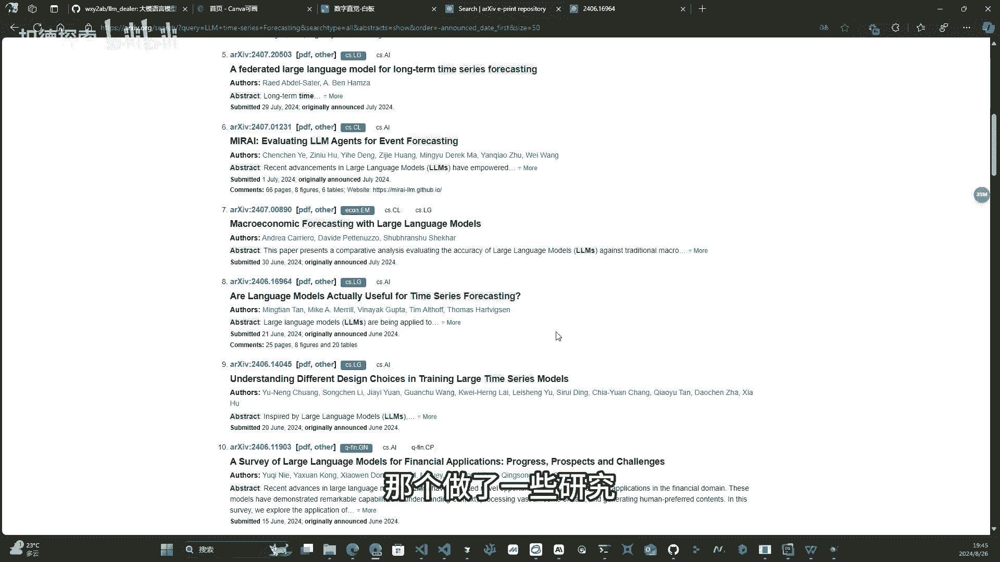
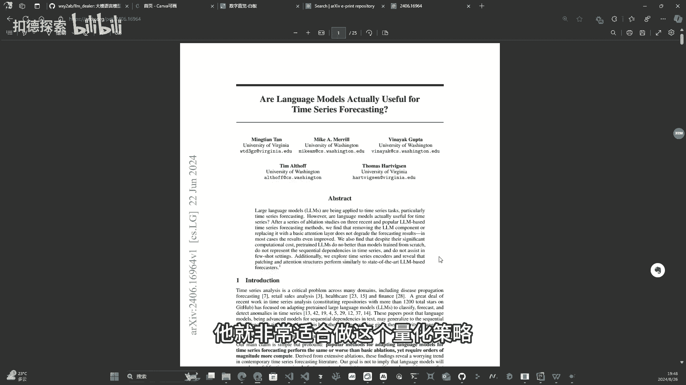
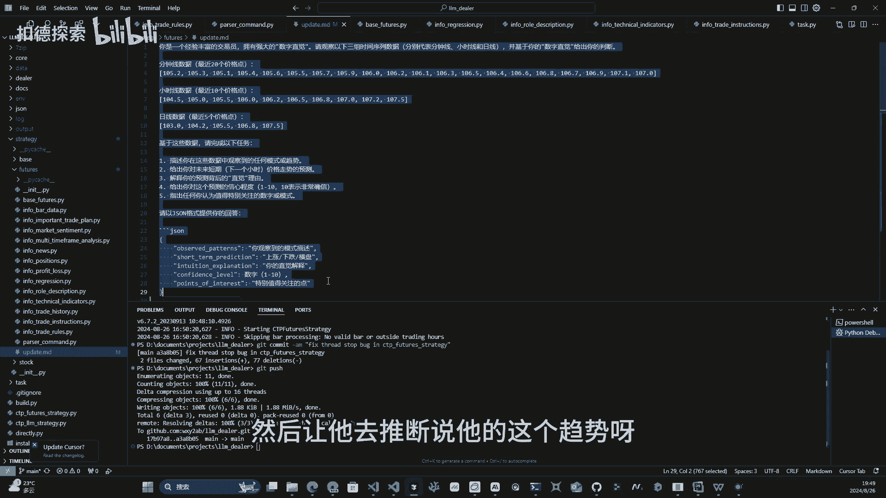
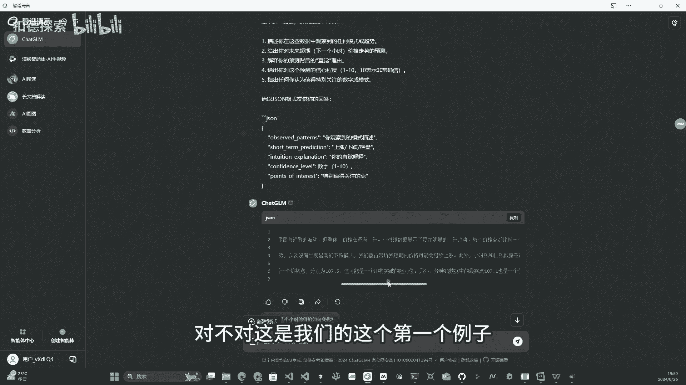
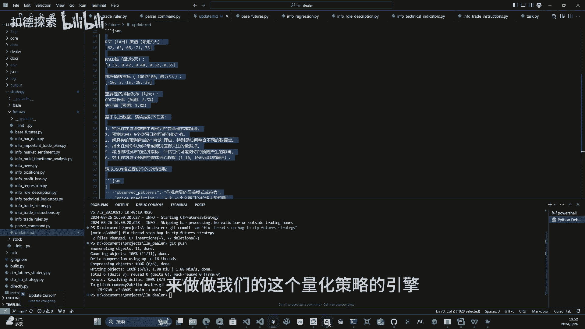
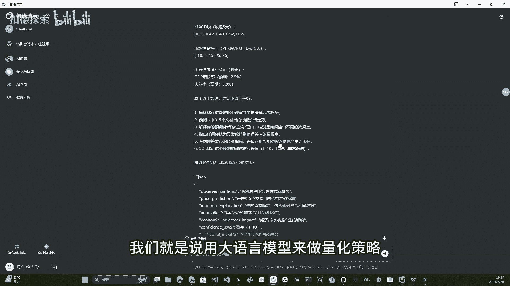

# 大语言模型做量化究竟靠不靠谱#大语言模型 #量化 #量化交易 - P1 - 扣德探索 - BV1N8sJeHEXJ

哈喽哈喽大家好啊，上次发了视频之后呢，很多小伙伴就他又来问我说，哎，你为什么会想起来，拿这个大圆模型来做这个量化策略，拿这个大圆模型做这个量化策略究竟靠不靠谱，对不对，或者是说你有没有哪些基本的事实。

或者是证据可以证明，他LL这个大语言模型它是适合做量化的对吧，它或者是它比传统的这个量化它更有优势，有没有什么地方可以证明，那么这期视频呢我就来解答这样一些问题，就是用大语言模型来做量化究竟靠不靠谱。

那么首先啊那个我们可以就来看一下，就是这个大圆模型来做时序预测，相关的一些研究，那么这是在阿克cave上，你去搜索可以获得到的一些结果，对不对，那么我之前其实已经对这个里边，那个做了一些研究呃。

我精挑细选了一篇文章啊，那就是这一篇这篇的这个文章，它的标题其实就是大语言模型，做时序预测究竟靠不靠谱，它的标题就是这个这篇文章呢，其实如果你归纳起来的话，呃我我我就不去仔细读了呀。

因为这篇文章的话它比较长，它大概有20多页对吧，那个仔细读是比较费劲的，他其实最后这个作者其实就是给了两个观点，第一个观点是什么呢，第一个观点就是这个大圆模型，它在做时序预测方面。

它并没有比传统的机器学习手段，有更明显的一个优势对吧，这是他的第一个，然后但是就是说在这个算力消耗方面，大语言模型，它是要远远的超过传统的机器学习手段的对吧，这是他的这个第一个观点。

对那很多小伙伴听到这个地方，他就会说哎，那既然他已经证明说，这个大语言模型并没有比传统的机器学习手段，更有优势的话，那你还拿这个就是大圆模型来做量化，对不对，那不是这个白搞嘛，其实不是啊。

因为你得看他的这个第二个观点，这篇文章的第二个观点是什么呢，就是他这个作者是说大圆模型，它在时序的这种推理和理解方面，有非常独到的一个优势，这是这篇文章的第二个观点，对这个在持续的推理和理解方面。

有非常独到的优势，是什么意思呢，就是或者是说这两个观点合起来，是个什么意思呢，我给大家来描述一下，就是不能做这个，就是他的预测方面没有比其他的模型更有优势，是什么意思，就是说如果你要去做一个预测嘛。

对不对，他其实是更那个呃就是更关注的是什么呢，就是什么时间到达什么样的这种位置，对不对，其实如果我们来做这个量化的话，我们不一定是说要对这个数据有一个，非常准确的一个预测，我们其实更重要的是什么呢。

我们更重要的其实是要把握住一个趋势，对不对，它那个呃就是他就是他具体能到哪个位置，我们只要能猜一个大概的一个概率就行了对吧，就是说而把握一个趋势，是往往比说一个准确的点位是要更重要的。

这个就是他说的这个第二点啊，就是他这个第二个点是什么意思呢，就是什么叫做这个时序的这个推理和理解呢，其实就是对这种呃时序序列的，比如说他这个趋势呀，或者是它跟其他因素的这种相关性的这种分析，理解呀。

对不对，就是什么因素在里那个影响他呀，在影响他的这种波动啊，对不对，在这些方面的一个理解，或者是这个解释，是要远远强过那个传统的机器学习模型的，对，那只要有第二个点，那它就非常适合做这个量化目。

它就非常适合做这个量化策略。

那么在这个地方呢，我给大家那个引入一个概念啊，叫做什么呢，叫做数字直觉，直觉对吧，就是说我们都有，就是哎有时候你会觉得哎，这事儿那个好像不能做对吧，就是我直觉上觉得他很奇怪，你你要给他具体解释。

其实解释不出来，对不对，我就是觉得他有问题，所以不能做，不能不能搞这个事，这个就是直觉啊，那么其实我们只要回答一个问题，就是这个大圆模型，它对这个数字，它对这种时序序列究竟有没有直觉，对不对。

如果他有有直觉，而且他的这个直觉很准，对不对，他能够去总结一些趋势规律，对不对，能够对这个持续的这种里面的一些变化变动，能够去做出一些合理的解释，那他就非常适合做这个对吧，量化策略。

如果A干这些事情他都不行，那就他就不适合，那他就是那个是不是，我这边给大家准备了两个例子啊，对不对，准备了两个例子，第一个例子呢比较简单一些，其实就是一个很标准的一个时序的理解啊。

对那个其实就是给了一些时序的序列，然后让他去推断说他的这个趋势呀，对不对。

那个还有他的这种可信度啊等等，就是这样一些因素，那么我现在来给大家演示一下，我把提示词复制过来啊，然后可以看到那个就是这个大圆模型的这种，对他的这个理解，对不对，他他的这个就是短期预测是上涨，对不对。

然后的那个就是它的可信度是七分对吧，实际上我给的也确实是个上涨趋势，比较明显的一个这个序列啊，就是他前期有一些震荡，然后后续的话，他一直处于一个比较明显的一个上升的趋势，对吧，就是吃这个就是这个序列对。

然后这个模型你可以看到啊，就是说那个叫啥，你只是给出一堆，对于人来说，如果你不看图形，对不对，你只是看这些数字很难观察，觉得很难理解的这么一个数字，但是对大语言模型来说，这些都不是事儿。

它理解起来毫无压力，他可以非常准确的理解，它是处于一个上升的一个趋势对吧，然后那个叫啥，就是还能给出一些那个呃一些合理的一个解释，对不对，这是我们的这个第一个例子。

那第二个例子呢会稍微更复杂一些，第二个例子是什么样子呢，第二个例子的话就是说，他除了给到那个时序的一个序列之外呢，他还会给到一些比如说技术指标RSI，对不对，还有MACD对不对。

还有这个比如说市场情绪啊，甚至还有这种宏观经济指标，对不对，那么我们给到这么一些，我为什么要给到这么多的这个呃数据，对不对，因为是什么呢，就是这个和我们想要去做的这个策略，其实很像对吧。

就是说如果我们只是对数据进行一些技术分析，对不对，那其实它本质上来说的话，其实跟那种传统的这个量化策略，其实没有什么对吧，就是最本质的区别，如果说这个模型它能够提供一个综合的分析。

它能够比如说把技术指标呀，能够把这种比如说市场情绪啊，能够把这种宏观经济啊，这些呃都融入理解到这种呃，就是这个持续的这种推测和这个推论，推断和理解上的话，那诶那个叫啥，如果这点能够沉了，那么就可以对吧。

哎你看我这里提示词就是直接就给到了一个，用你的数字直觉给出判断，对不对，让他用数字直觉进行推断，如果是那个叫啥，就是他能够就是说很好的来理解这些数据的话，那我们就说明在我们的策略里面。

我们就可以把这样一些综合信息，全部给到这个模型，对不对，让他根据他的这种数字直觉，来为我们做这种量化分析对吧，来做做我们的这个量化策略的引擎。

那我们继续来看我们第二个案例啊，哎多点了一下嗯，你看他这个结果已经出来了呀，这个价格呈现上升趋势，对不对，大多数交易收盘高于前一日对吧，就是因为这个数据，它相对那个就是震荡幅度会要高一些对吧。

震荡震荡的程度是要高一些，但是他也给出了明显的这个比如说RSI啊，这样的一些那个趋势，他就会给出说那个对他他会给出很综合的分析，因为他这里面会结合了这种，比如说RSIMACD对不对。

然后那个还有市场情绪啊，还有这个交易量增加呀，种种因素他都会注意到，然后最后给出一个综合的这种分析，他的这个确信度也是七对吧，你们可以看到说，这个大圆模型在做这种综合的时序的理解。

和分析上表现真的是非常非常优秀的，这个就是呃，我们就是说用大圆模型来做量化策略。

比起传统的这种量化策略来说，它的这个就更有优势的一个地方对吧，上一期我已经说过了嘛，就是他会有一些优势，也有一些这个劣势，但是他的优势真的是非常明显的，就是他在做这种综合分析方面，确实那个叫啥。

就是你之前比如说你要把这种宏观经济啊，把那个对比如说把一些那种比如说新闻啊，这些东西融入到你的这个策略里边，其实是件非常非常难的一件事情，他大的需要依靠人来做一些分析判断，对不对。

然后最后去调整模型的一些参数，来解决这些问题，但是对于那个大圆模型来说的话，这些你都不需要，你只需要依赖它的这个数据值，这个数字直觉，然后的话那个把相关的数据整理好，然后提供给他对吧。

他就可以来帮我们做这种量化的这种分析，和这个做我们的策略引擎，对，这个真的是大语言模型，做量化的一个非常非常大的一个优势，对，那么那个这一期视频就到这个地方，我给大家解释了。

为什么大圆模型非常来适合做这个量化策略，对不对，那么看到这个地方的小伙伴对吧，记得给我点一个赞，点一个收藏，我会持续的去优化我们的这个大圆模型，做这种视量化策略，然后我会随时用视频。

把我的工作进度汇报给大家。