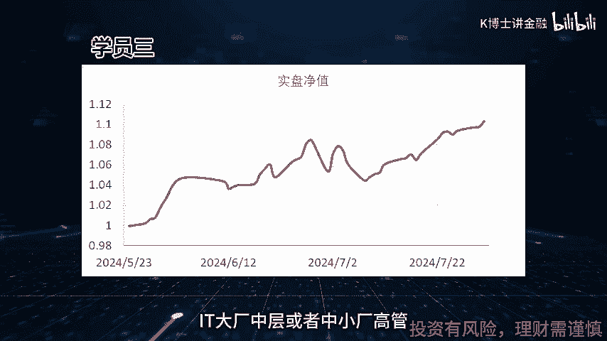
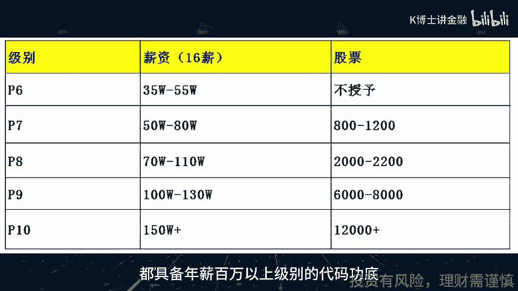

# 大龄程序员转型利器--量化交易 - P1 - 量化K博士 - BV1HSYFeLEVt

今天讲一下，为什么说量化最适合大龄程序员转型，这是我自从开设量化课程以来的切身感受，我的学员里有相当数量的大龄程序员，目前来看，这些程序员转型量化是效果最好的，先晒几个成功案例。

以下是几位学员的个人示范曲线，可以看到效果是相当不错的，可以和专业的资管机构媲美了，这几位兄弟的背景基本上都是i it大厂。

中层或者中小厂高管，他们自己本来已经是年薪百万，但是同时也面临35~40岁的职业瓶颈期，都体会到了如今越来越卷的大环境，都在为40岁后的日子做打算，然后都选择了量化作为主要的转型赛道。

能够带几位这种级别的优秀的老哥上手，也让我觉得很有成就感。

我认为他们的选择是相当明智的，有以下几点理由，第一他们都有优秀和强悍的技术素养，都具备年薪百万以上级别的代码功底。

对于普通小白和传统金融从业人员，代码能力是一条难以逾越的巨大鸿沟，而对于这几位老哥来说，coding是毫无压力的，这就赢了一大半在起跑线上，第二他们都有极高的悟性和清晰的逻辑思维。

本来都已经是工作多年的老油条，都做到了团队leader总监等级别以上，无论是逻辑思维还是技术品位，都已经是老炮级别了，各方面的素质都是很给力的，很多知识点都是一点就透，交流过程也让人觉得如沐春风。

第三虽然他们都缺乏一定的金融知识储备，但是金融知识相对于他们的技术素养来说，就像故事书一样，所以就像听评书一样，听我讲一遍就可以了，第四他们都有一定数量的本金，毕竟拿了很多年的高薪水。

有后半生独立靠交易为生的资金条件，同时在前面讲的技术储备和工作履历上，又已经取得了很大的领先优势，其实缺的就是业内人士，带他们避开大量的坑，踢出那临门一脚，第五量化这条赛道其实是像医生和律师一样。

是一条大后期赛道，这条赛道没有青春饭，而是越老越有经验，越老越吃香，他正好和程序员的35岁危机，形成完美的互补，这几位老哥也分别有后半生靠交易为生的意愿，第六量化是最公平的赛道，在市场里面不拼爹。

不拼背景，不拼出身，就像电子竞技一样，管你什么二代不二代，只要进了游戏，众生平等，你赚钱还是亏钱，都是你的智商和技术的直接结果，不用跪舔领导，不用勾心斗角，你的策略给力，就可以成天吃喝玩乐旅游。

跑着程序自动交易赚钱，你的策略拉胯，无论你怎么加班熬夜，996都拯救不了你亏钱的结果，这是一个众生平等，唯有技术高的领域，确实是非常适合程序员，综上所述，量化是非常适合大龄程序员转型的赛道。

其实大龄不大龄并不重要，更准确的说是非常适合优秀的程序员转型，如果你足够优秀，你和量化差的其实就是临门一脚，你完全可以在家自己默默写程序，搭系统跑交易，然后惊艳所有人，至于怎样迈出这临门一脚。

欢迎大家联系和咨询K博士，在我的昵称和评论区可以加到K博士的微信。