# 讲的太好了！2024最系统完整Python金融分析与量化交易实战教程，完整63个小节，附带配套代码数据集分享！ - P22：2-量化交易所需技能分析 - 默默无闻你路哥 - BV1izmqYZEMU

那都需要哪些技能呢？你看该我是不是写了机学算法当中啊，几他项回归分类聚类，这都不用说了吧。最常规了。而且更重要的是什么？你看这里写了叫做一个特征工程，做过数据挖掘的同学啊，肯定都会有印象。哎。

你说现在我要去呃做一件事儿，那做一件事儿，我是算法更重要呢，还是数据更重要呢？我在讲机学习课程当中啊，经常会提到一点啊，就是数据决定了你模型的一个上限算法呢只是决定咱们怎么样去逼近于这样一个上限吧。

所以这一块有一个词儿叫特征工程。说白了就是怎么样处理数据，怎么样在海量数据当中找出来最有价值的信息吧。因为我们现在在做电话交易过程当中，拿到一些金融数据啊，我可以这么说吧，金融数据，那简直太庞大了。

比如说你想分析股票，那你不光有什么，大家可能觉得就是一个收盘价开盘价啊，就是这两个指标吧，其实不光这两个吧。😊。

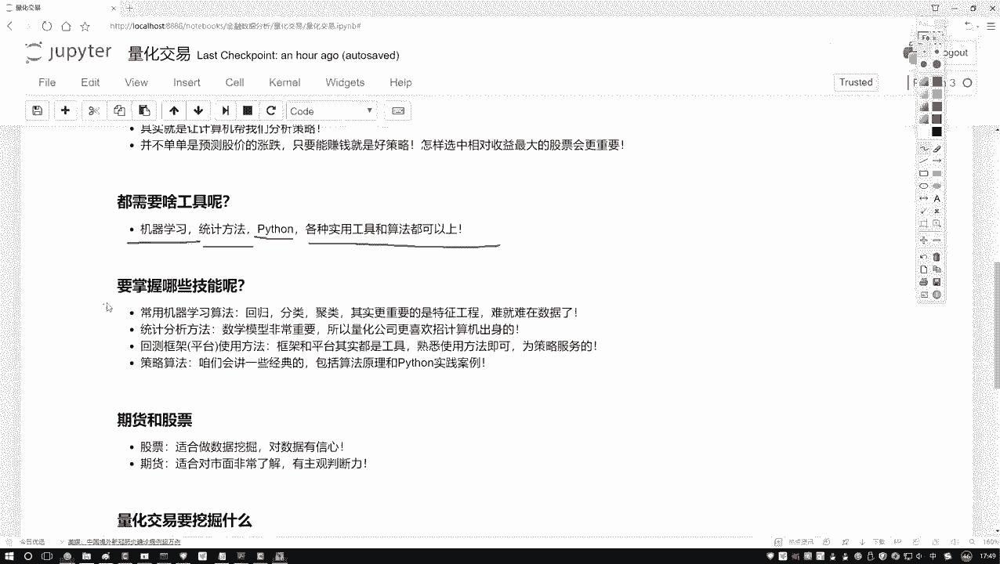

股票对应什么？对应着公司吧，公司当中财务数据啊，各种各样指标数据是不是都来了？那所以说呀我们要面对的可能是更为复杂更为庞大的数据了。你想把这么多层面数据都融入到一起，比如说有一个市场的数据。

有各个公司的数据啊，有各种财务报表的数据，还有股市走势的些数据，这些可能都会对你最终结构产生影响吧。那你怎么样设计算法啊，怎么样把这些算法融入到我们的数据当中啊，这就是特用工程了。

怎么样选择最有价值的数据，呃，怎么说呢？就是计济学当中最难的一点啊，其实并不是算法是怎么处理数据啊，难就难在数据了。这里我写了一下还需要什么统计学方法啊，像我们说的。

大家可能可以看一些关于这个量话交易啊，它一些招聘的岗位都会写什么啊，要不然希望你是数学专业统计学专业计算机专业啊或者金融专业，是不是哎，为什么说需要这么多？跟数学相关的呀。其实在我们计算当中啊。

你说无论是算法还是你的一个策略都是什么？把数学公式应用到了数据当中吧。所以说啊数学这个东西已经不用强调了。我讲机学习的当中啊，大家可能觉得讲机学习里边数学讲太多了。因为数学就是一个本质了。这里啊。

需要大家掌握的数学知识点还是蛮多的啊。然后第三点就是一些框架的使用。咱们课程当中啊会选择一款啊，我先不说等后续啊咱们会介绍，选择一款我们的一个平台来大家去讲讲怎么样去由平台，哎，做一些回测。

做一些我们策略的实践，以及呢看一看我们策略结果好坏。其实大家咱们现在唉去一搜。你搜这个电话交易啊，能搜到好多好多平台，是不是？那你说具体选哪个平台啊，其实这里也没有具体选哪个片一说，那就是看哪个方便吧。

我会给大家找一个就是相对来说用起来是比较方便的，相当于就是API我尽量使得简单一些，可视化展示的清晰一些的，会给大家选择一个框架啊，相当于一个平台API当中啊，你可以把写thon代码写代码之后。

你可以直接编译，然后得到一个运营结果运营结果就是呃一个持续时间。比如说你观察这个10年到20年期间，你设计一个策略。然后它的一个策略，然后在每一TI实施的一个情况，然后你的一个收益怎么样。

你最终的一个结果啊，这是一个平台使用。但这里啊你看我写的平台和框架这些东西啊都是什么都是我们的一个工具吧，工具就是熟悉就行，没必要去背，也没必要去记啊，简单了解或者说会用就行了。还有就是策略算法。

算法当中啊其实蛮多的。你要想看最新的，那建议大家去看一些唉经常非常经典一些论文吧。论文当中讲的都是一些新的。但是我们课程当中呢会给大家讲最常用的最经典的一些算法啊，比如说呃怎么样去学习算法去做啊。

怎么样会去用一些常用的策略算法啊啊，这些诠释会给大家去讲原理，以及呢在python当中啊，咱们该怎么样去用啊，注意一下我们课程的一个名字，跟python是直接挂钩的吧。

所以说啊咱们的重点不会给大家去讲啊，怎么样教你超股票重企爱，怎么样教你去做这个做那个我们重点是怎么样在python当中给它做出来。我们重点是要落在一个案例啊，实践当中，这个是我们的一个重点。

然后呢接着同学问我啊，就是。

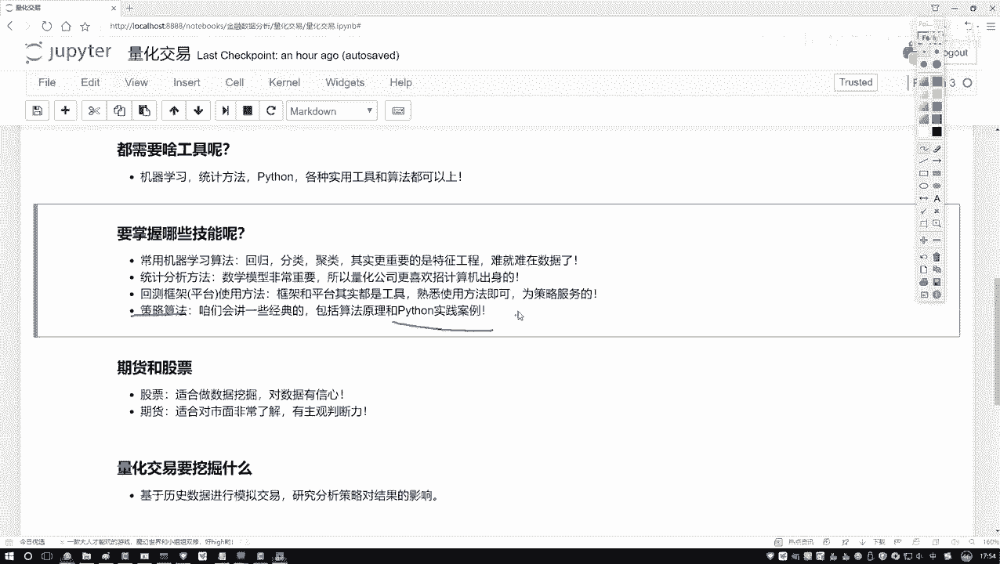

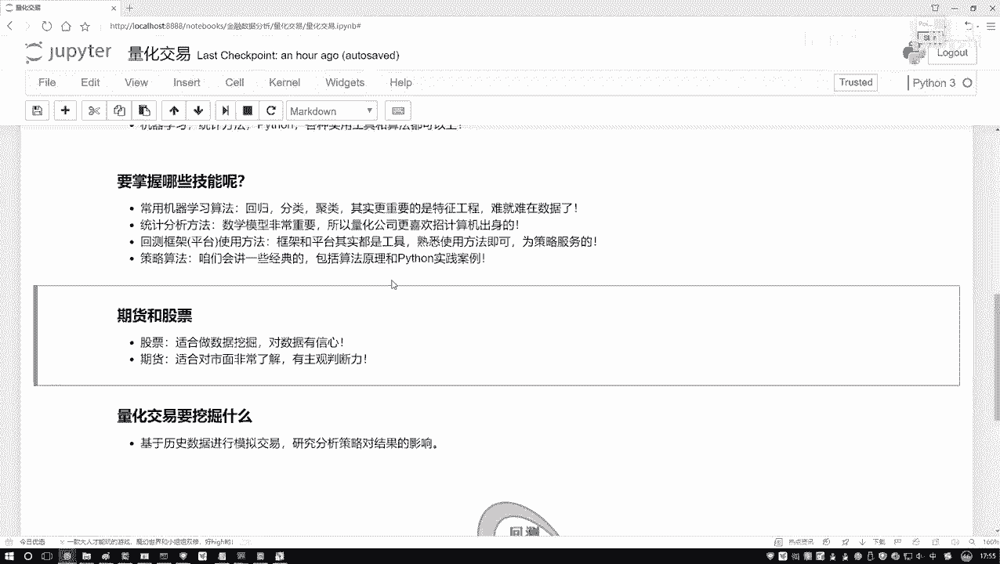

咱们像这个期货和这个股票，哎，你说咱们在量化交易当中啊都能去做。那我们可能更重点的是做哪一个呀？我觉得可能是跟股票是相关的。因为对一个股票数据来说呀，咱们可以看到什么自然而然，股票数据。

各种各样的数据指标是不是都有啊，它适合做这个数据挖掘啊，所以说我们接下来课程这个重点可能是跟这个股票更相关一些。因为在股票当中做数据挖掘相应更容易一些。那期货为什么不适合，其实大家估计有一点感觉啊。

就是那些期货玩的厉害的，玩的牛的人，它都什么样，他都是专门去研究这个东西的吧？它不是一个学IT出身对吧？也不是一个学数学出身，对吧？它可能就是专门哎这个行业的一个从业人员。

因为它对这个市场啊非常非常了解，因为期货这个东西跟股票可能稍微有点区别啊，期货跟市场关系更大一些。但是你看一旦在跟市场关。

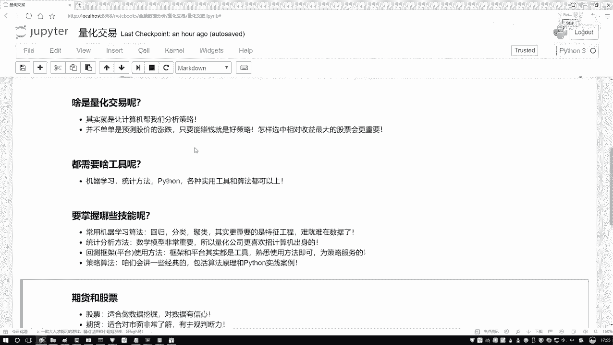

更大一些，相当于主观判断力是不是更强一些啊。你判断这个东西什么时候，那可能是一个高价，什么时候可能是个低价，主观的因素会更重要一点吧。所以说啊咱们课程当中啊关于期货哎会举几个小例子，不当做一个重点。

我们重点会给大家讲什么，讲股票。因为股票更适合做数据挖掘，更适合咱们拿python做案例要做一些实际的任务。

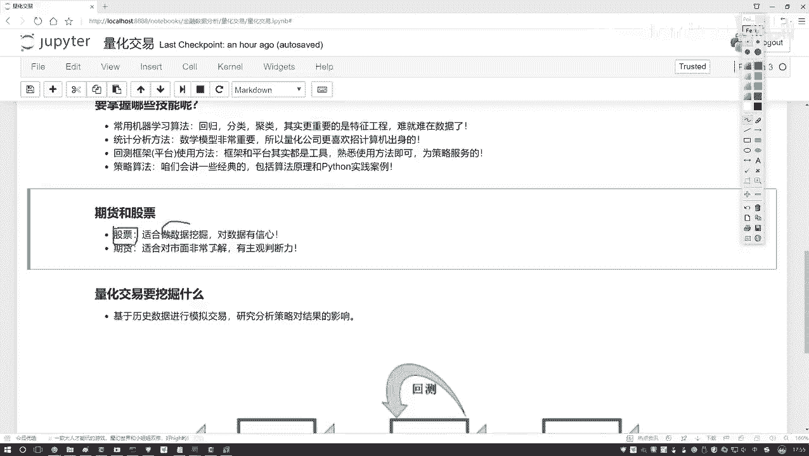

既然提到了这个数据挖掘，那咱们不得不说啊，数据挖掘要干什么呀？其实说白了数据挖掘就是给我们拿到了这些，咱们简单这一下啊，大家都不用去记啊，拿到了一份数据之后，怎么样对数据做处理啊。

怎么样你去设计一个交易策略啊。好了，有数据有策略之后怎么样融入到一起啊，融入到一起之后，其实说白了就是一个回测回测意思就是说呃你现在我拿到历史的一个数据。然后你告诉我你要用什么样的方法去做。

然后我测试一下当前你这个策略怎么样，是不是那测测试好这些策略都是对历史数据来去做的吧。在对历史数据做的完之后，我们是不是要对实际的决策产生什么一些指导一些依据啊，这个就是我们量化交易啊。

大家要去做一件事。其实呢你可以把这个东西啊，你叫做数据挖掘别我觉得也没什么问题啊，因为我是专门做机极学习的。我觉得这个东西它其实说白了就是数据挖掘吧。😊。

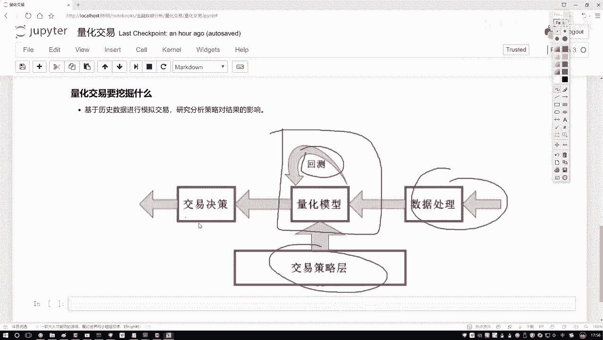

数据挖掘算法应入到金融数据当中了，起了个名字叫做一个量化交易啊。但是其实以前有同学问我，就是这个量化交易哎，是不是就是去预测一下我这个股票哎，明天是涨还是跌啊，然后你基于它的涨跌做一些事啊。

其实不仅是要做这样一件事，预测涨跌啊，其实可能不是那么特别容易啊，我们刚才说的什么，我们量化交易目的是什么，是要做收益吧。所以说啊就是当我们啊在做的过程当中可能并不是非要关注于一个涨和一个跌。

而可能更关注于什么怎么样收益最大吧。那比如说现在啊300只股票摆在一个池子里边，我说这池子里指股票你都可以去玩。那比如说你本金是一定的，怎么样，那你的收益最大啊。

怎么样去选股选择最好的一个股票选择单位风险收益最高的一个股票，那这是不是也是数据挖掘啊，所以说量化交易哎不是像大家讲的，就是预测一个走势，那就是一个金血问题啊？😊，么这里它是一个综合学科啊。

但是目的是一样的，就是要咱们怎么样收益最大化吧。行了。关于量化交易啊，不需要大家掌握太多。你对它的一个基本概念有一个了解就行了，没必要看一些长篇大论，也没必要看一些历史啊，你看历史都是国外的历史。

因为中国这个第一点，股市开放的比较晚，是不是，而且这些常用算法也大部分都是从国外利进来的吧？人家研究这个东西研究几十年，中国的路，其实怎么说呢？发展的毕经比人家晚了三四十年了哦。

所以这个历史咱都不用去看了，国外爱咋做咋做呗，这些咱们都不用关心，你只需要去知道电化交易要干什么的，数据挖掘什么意思，用什么工具哎，大概我们后需要讲什么，这就可以了。这时先给大家概述了一下。

我们的量化交易哎是一个什么事儿。😊。

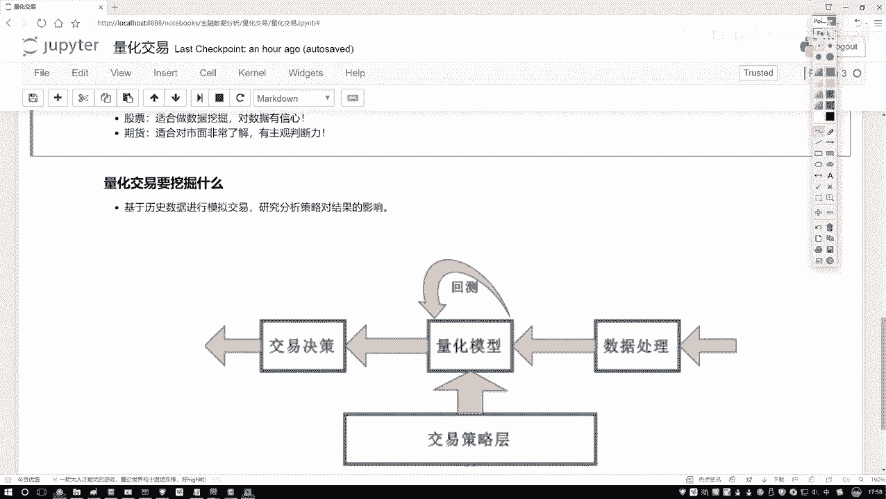

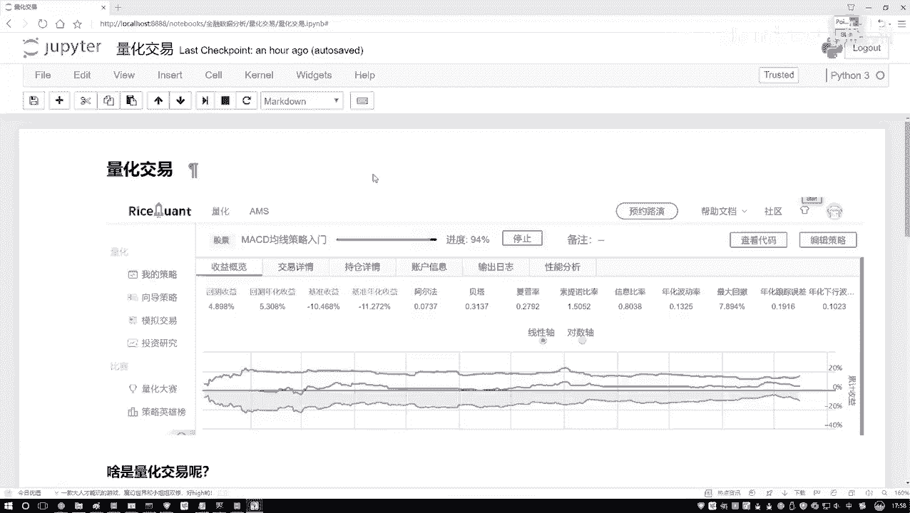

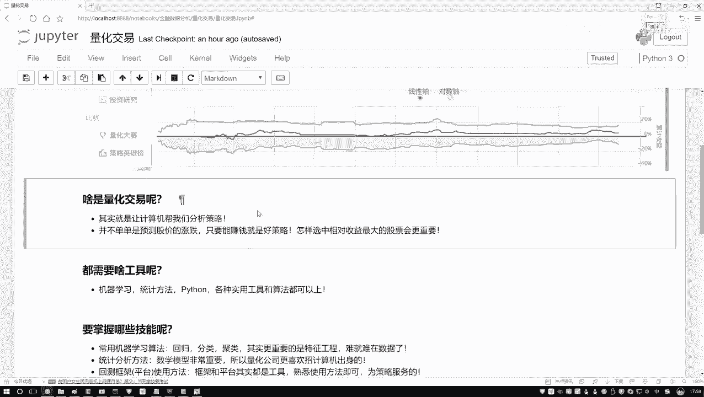

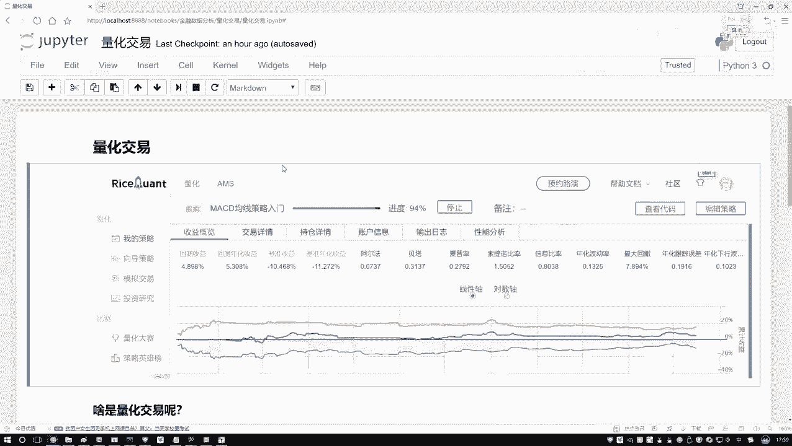

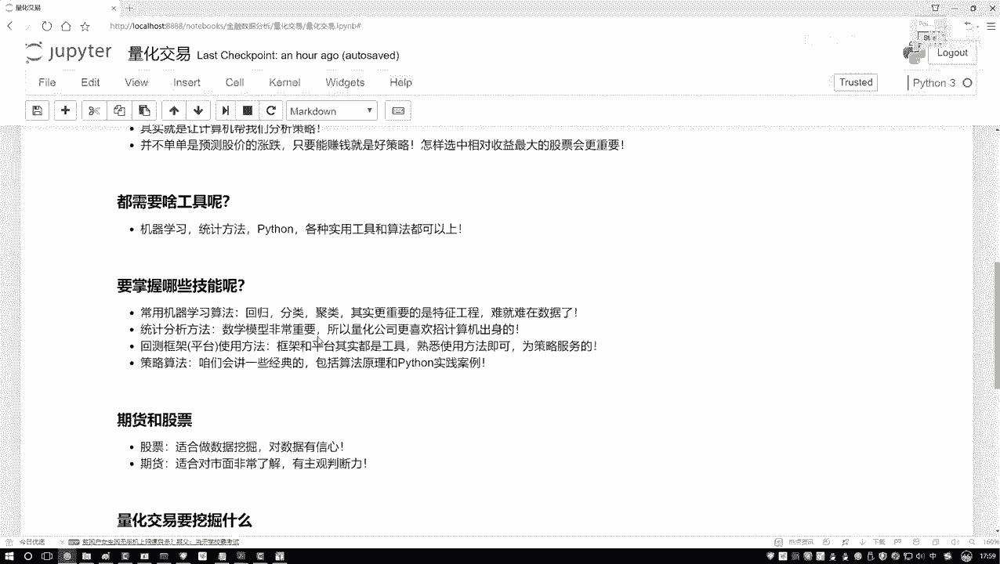

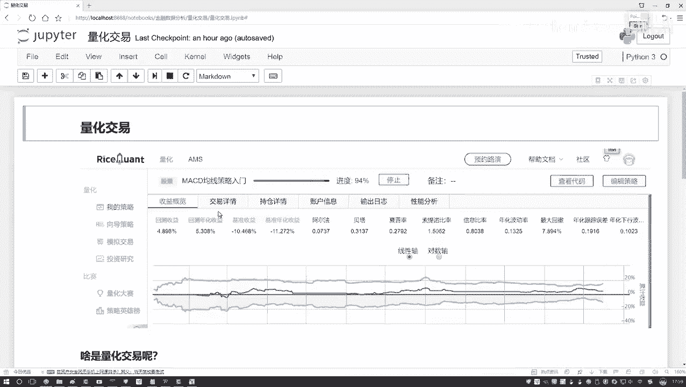