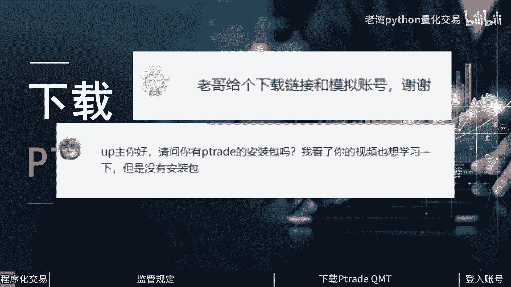
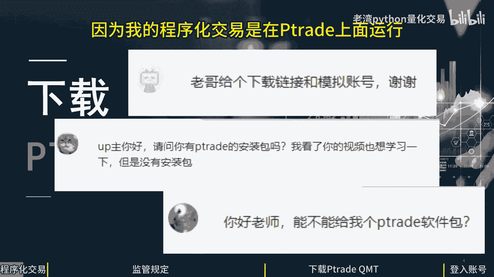
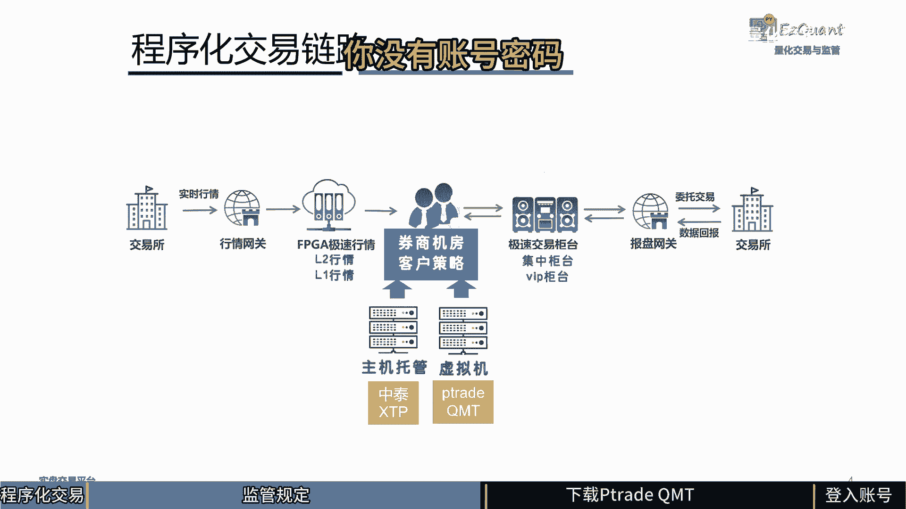
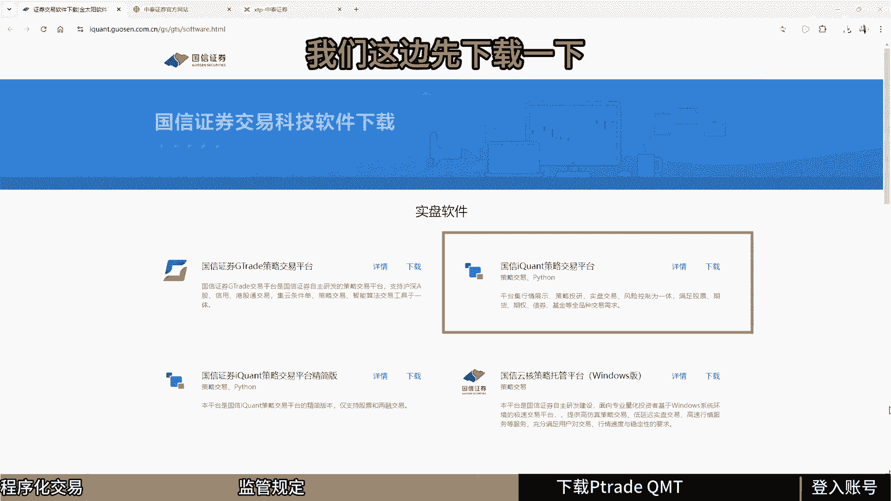
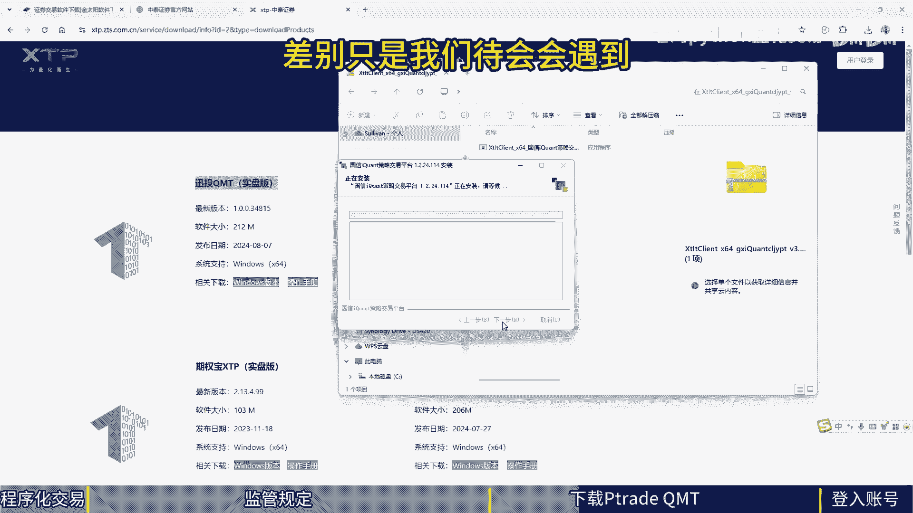
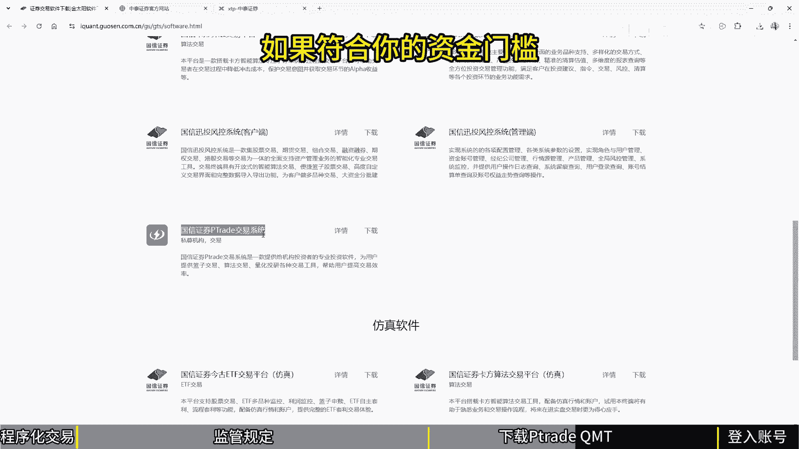
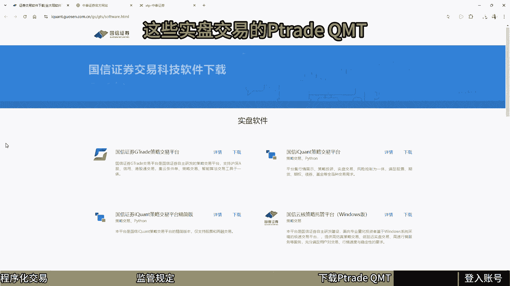
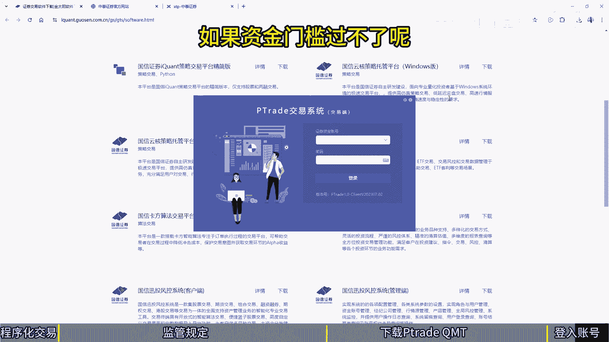

# 如何下载Ptrade QMT - P1 - 老湾python量化交易 - BV1FdSTYpEak

各位同学大家好，我是Python量化交易的老万，有一段时间没有更新视频了，今天视频是回答同学在后台里面，最常问我的一个问题。

哪边可以下载PC或者是QMT，因为我的程序化交易是在p tr上面运行。

所以很多同学是想尝试P退或者是QMP下载，直接在自己的电脑上面运行，今天跟大家介绍一下国内的程序化交易环境，以及跟大家解释一下，为什么我没办法直接提供同学P罪，或者是QMT下载链接。

首先我们来看一下2019年的，中证协发了一个通知，券商的交易系统应该严防外挂介入，这句话怎么理解呢，可以从两个方面来理解，第一个呢它没办法提供API交易接口，让同学在自己的电脑上面。

不管是服务器或者是桌机，你一定要在券商的软件上面，就跟券商发行的一个手机版，或者是电脑版的下单app一样，所以TETRQNT就是这样的环境之下面诞生的，那这个观点像是手机上面安装的安卓一样啊。

同学呢是没办法直接跟谷歌下载安卓的，因为上面是一个纯净版的，没有任何的环境，一定要搭配手机，小米啊，OPPO这些公司跟谷歌要到了安卓的最新版，搭配上自己家公司的UI之后呢，才会提供首期给使用者。

就跟我们程序化交易一样，证券公司跟讯腾或者是恒生电子，买了ptrq mt之后呢，这是一个干净的环境，上面没有行情接口，也没有下单接口，证券公司买了之后呢，是部署在自己的服务器上面。

将TJQMD接上了行情接口，还有下单接口再提供给投资者，投资者会拿到了下载链接之外呢，也会拿到登录账号，还有登录密码，所有的环境，不管你是主机托管或者是PTRQMT，是使用的虚拟啊。

这些都是在券商的环境，所以他不是外籍，他没有外挂切入，全部就在券商楼内部环境运行，你现在拿到的只是一个客户端，远程的控制，这个平台控制你程序化交易的环境，你只是把代码推送到券商的环境。

就跟券商提供一个手机app给你一样，或者是windows的下单软体一样，都是在券商的环境里面运行，你拿到的只是一个客户端的环境，券商在部署这些主机托管，或者是PJQND这些虚拟机的时候。

首先会接让行情按券商提供你什么行情啊，level two的行情有level one的行情，或者甚至你要硬体去解那些指数行情下单，有极速交易柜台，有集中交易柜台或者是VIP柜台。

看你自己跟券商买到什么样的服务都不一样，如果真的想要下载P翠QND，我这边介绍几个网站，同学可以直接下载，那试一下，是不是如同我说的，你没有账号密码。

看看可不可以登录进去，我这边介绍两个券商的下载平台，第一个是国信证券，上面是可以下载q mt，因为经过一些调整修改，保留了核心的下单部分，在国庆上面的QMT叫做I框的，直接可以下载，那这边先下载一下。

另外是中泰证券，中泰上证券它有一个叉TP啊，这边有实盘的QMT啊，通I框已经下载完毕了，我们现在来安装一下看看，现在一步一步的往下安装，这个软体安装，跟我一般的软体安装是一样的差别。

只是我们待会会遇到登录账号密码微信正确。

除了提供爱矿之外呢，里面还没有PTRA的同学也可以下载看看，安装看看了，我这边也补充一下，很多券商朋友呢会在我的视频下面留言，同学如果有兴趣开户啊，实盘交易的话，可以跟这些是在我电接下面的一些朋友店。

业务经理啊，联系啊，只因为每家券商开PHQMD的资格不一样，有些是有资金门槛的，那不符合你的资金门槛。

那自己去去开一下，我这边跟券商都是合作关系啊，没这边也没有靠券商的渠道收入吧，同学跟这些券商联系一下，如果可以直接开户的话，那就开户，如果你还想要免门槛的话，也可以私底下跟我问一下怎么开户啊。

这些实盘交易的批脆QMT啊。

我这边会提供同学开户的渠道，我们这边也同时安装一下PTR的P坠的安装，这跟一般软体是一样的，在我视频下面留言的呢，那都是可以开PATTRICQNT的，同学可以跟这些业务经理联系一下。

看看如何开一个PTRICKQNT的，磁盘交易的账号，还有密码，账号密码呢就跟你下单的是一样的，所以不用计量储账号密码，这边已经安装完毕，我们直接运行p trade，当你安装完毕的时候呢，需要更新版本。

因为PETRAQNT就跟一般软体一样，是位置在更新的，有时候呢是礼拜五晚上开始更新，我们现在已经更新完毕了，现在就卡关了，需要资金账号，还有密码，同学可以跟券商要一个测试账号跟密码。

跟券商朋友呢呃联系一下，如果资金门槛过不了呢。

可以私信我，帮同学找一个免门槛的PJQNT账号，同样的icon也是需要账号密码的，都是需要账号密码才能登录的，所以呢同学不是不给你链接，是给了你下载链接也没用，你没有账号密码，今天的视频先分享到这边。

下次见喽。