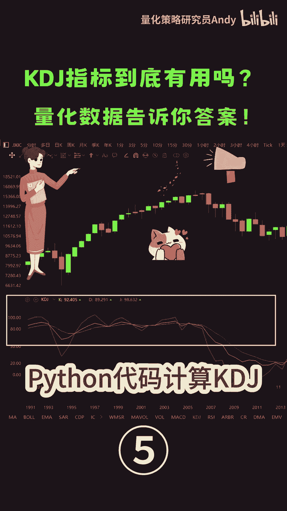
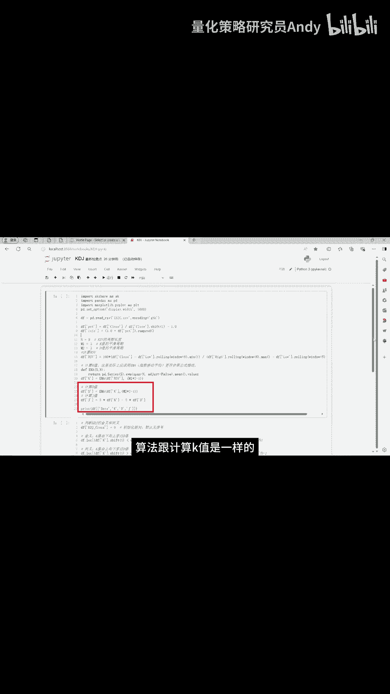

# 如何使用Python代码计算KDJ指标 - P1 - 量化策略研究员Andy - BV1mx4y147zi

第一部分是获取那值每天的价格数据，然后计算KDJ的值，这里的三个参数我们采用默认的参数933，接下来就是计算K值，我们使用EMA函数里面的参数，用M12减去一，这里的M1等于三。

也就是5日的指数移动平均，刚才不是说K值是等于前一天的K值，乘以2/3，加上今天的rs v乘以13吗，怎么这里又用5日的指数移动平均呢，我们来看一下这个EMA的计算公式，当N等于50，我们把它展开。

Y就等于23乘以Y撇，加上13乘以X，这里的Y撇就是前一天的K值，X就是今天的rs v，关于EMA更详细的讲解，可以观看我主页的另一个视频，双均线策略深度解析，下面这里就是计算D值。

算法跟计算K值是一样的。

