# 如何使用国产AI大模型自动编写量化策略？ - P1 - 量化投资技术 - BV1nTbje5Ewc

大家好啊，这个视频呢给大家介绍几个国产的大模型呃，从GBT嗯出来之后呢，这个大概两一年多到两年的时间啊，其实国产大模型呢也在飞速的发展啊，目前到现在这个时间点呢，我认为国产的一些大模型队。

跟GBT4的差距呢其实已经很小了，这个差距可以基本上可以忽略啊，所以我们用叉着GBT4能解决的问题呢，很多是用嗯国产大模型也能解决啊，啊这个不是硬吹啊，因为其实日常的很多工作呢，并不需要太高的能力对吧。

嗯然后再一个呢就是国产大模型，它对一些嗯呃中文的互联网会更了解啊，然后嗯五他的费用也是更低的，如果我们调API的话，你可以看到他跟GBT4这个是这个费用啊，和价格是不是不是一个量级的啊。

因为中国现在在打百魔大战嘛，啊也在打打这个价格战啊，所以目前呢是我们接触国产大模型，并且薅国产大模型，薅羊毛的一个很好的一个机会啊，所以我认为这里呢就给大家介绍一下，我自己在用的几个国产大模型。

以及他的能力有哪些啊，最后呢他怎么跟我们的这个量化策略结合，能不能帮我们辅助写一些量化策略啊，那我们就现在就开始介绍啊，第一个呢就是我现在啊，网页打开的这个叫做deep sc啊。

这个deep seek可能是大家了解的，可能是最少的一个，因为他没怎么做宣传，但是呃这个是我在搜索这个相关写代码的，专门写代码的这个大模型的一个过程中发现的，嗯我试用了一下，他的能力其实很强啊。

但是呃需要说的是，deep sink呢，deep seek这个大模型呢，它主要还是针对于这个代码的编写和呃，呃逻辑这一块啊，对别的可能不太不是特别太行啊，嗯所以呃可以用这个模型呢，来协助我们写代码啊。

当然我个人最大的一个需求呢，其实就是希望这个大模型能帮我完成一部分啊，代码这个会减少我很大的一个工作量啊，那嗯deep think呢就可以很好的帮我解决这个问题啊，嗯比如说我们简单的测试一下。

他这里模型有两种，一个是通用对话，一个是代码助手，我基本上都在用这个代码助手啊，然后我们简单的做一个最简单的测试啊，用让他用back trader呢写一个双均线的策略啊，可以看到呢他的输出结果是很快的。

而双均线策略的这个嗯，编写呢也是没什么问题啊，很明显他是理解BACKTRINDER，这个语法和API是怎么用的啊，然后他这里的默认会用这个呃，一个雅虎的数据源啊。

嗯大家如果对back tra了解一点的话，就可以看到他这个不是瞎写的啊，这个策略基本上是可以直接运行的。

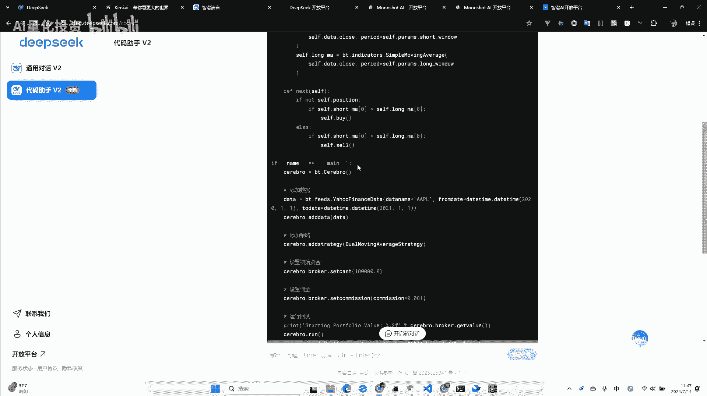

但但是这很简单啊，我之前也测试过一些比较复杂的策略。

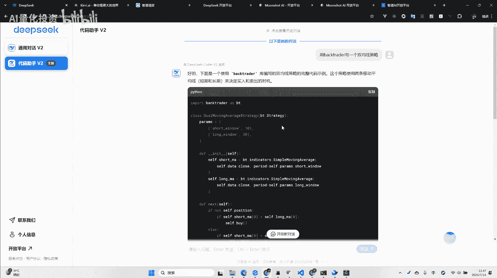

但是你可能要给更多的提示词呃，就就编程这一块呢。

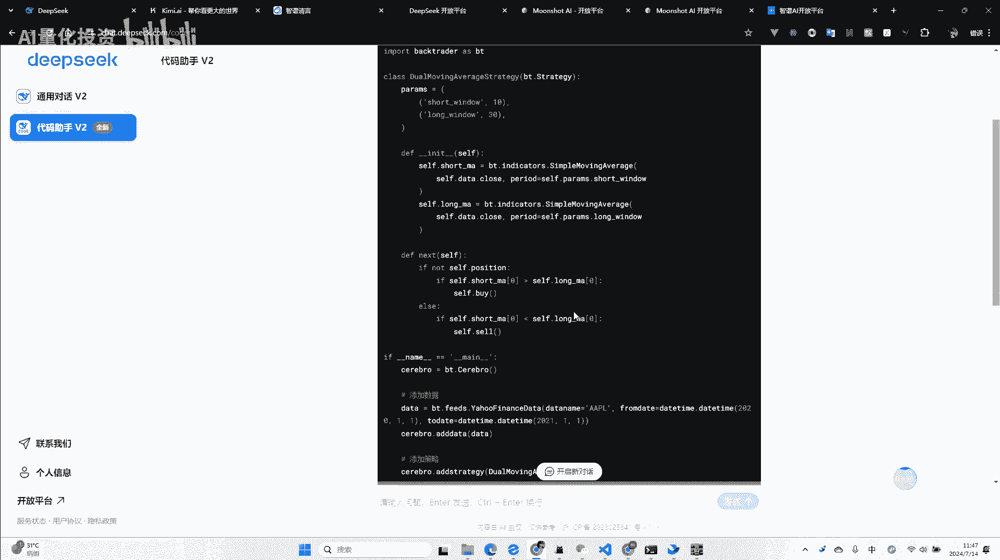

我觉得呃DEPSICK这个大模型呢其实是很强的啊。

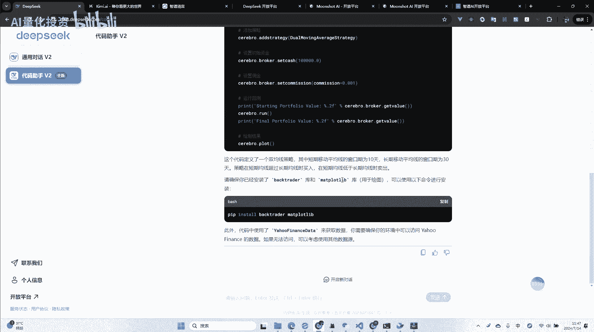

所以呢嗯这个是目前我一直在用的一个啊。

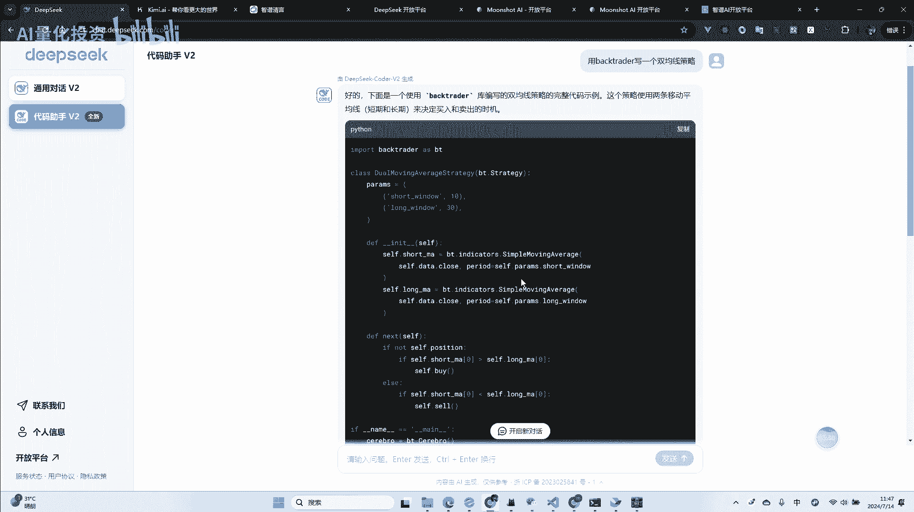

模型啊，但这不只是他的一个呃我唯一的能力啊，我们再试一下他另外一个能力，嗯这个也是他最近我看他公众号发布的，就是比如说嗯我让他给我做一个这个，做一个AI量化投资，的主页啊。

用HTMLCSSJJS计数生成嗯。

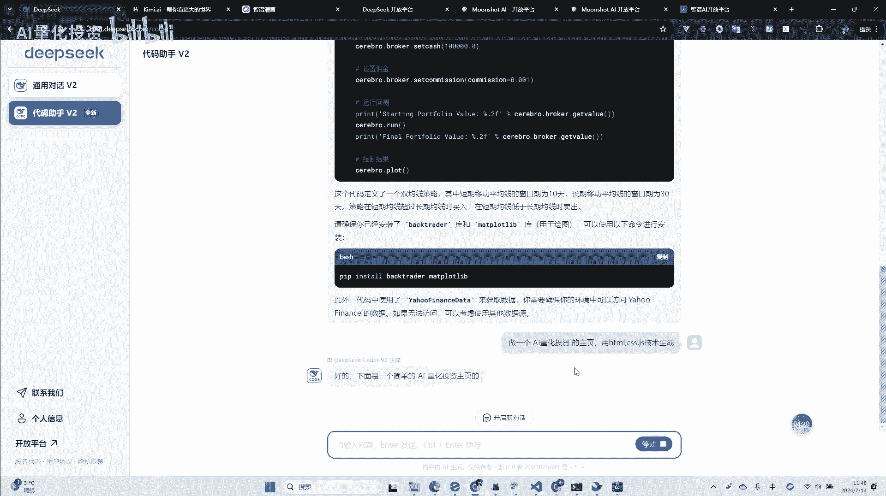

那他这样呢就会给你嗯生成一个前端的网页啊。

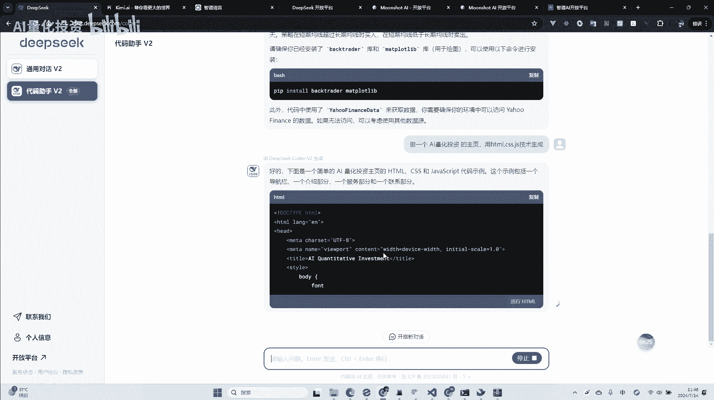

那这个可能嗯跟我们量化没有太大关系了，但是我就想介绍一下这个能力，他这个你可以看到这个它生成完这个网页，是可以直接运行的，我们暂停一下，因为他这个写作样式会比较长，可以看到他的输出是输出是非常长的。

他能他能连续写很多很多的代码啊，然后一直在给你输出，然后嗯现在基本上代码就输出完了啊。

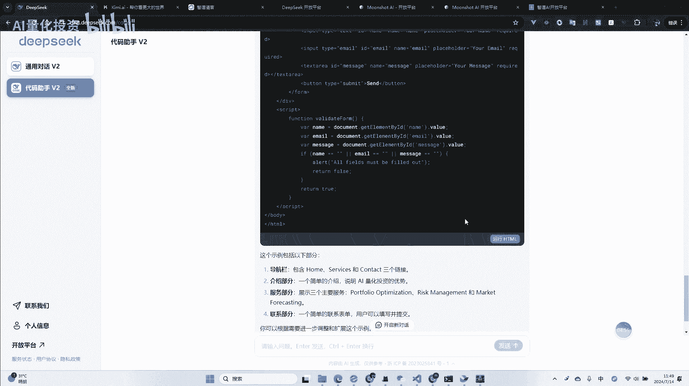

我们可以试着运行一下啊，哎可以看到这个就运行了，但是我没指定他用中文，它给我生成的是英文的是吧，嗯就是这样一个网页就就瞬间就生成了啊，啊而且这些交互都不需要自己写啊。

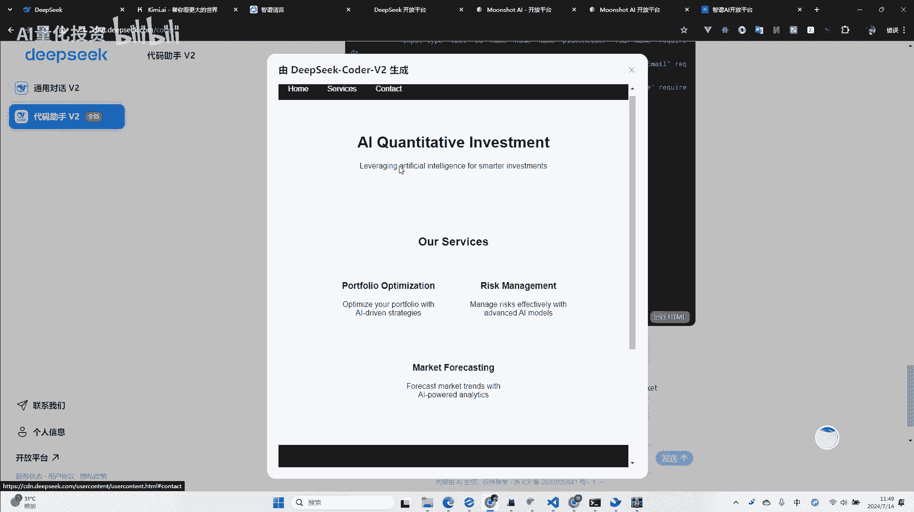

这个是他，我看他公众号发的是对标外国的一个。

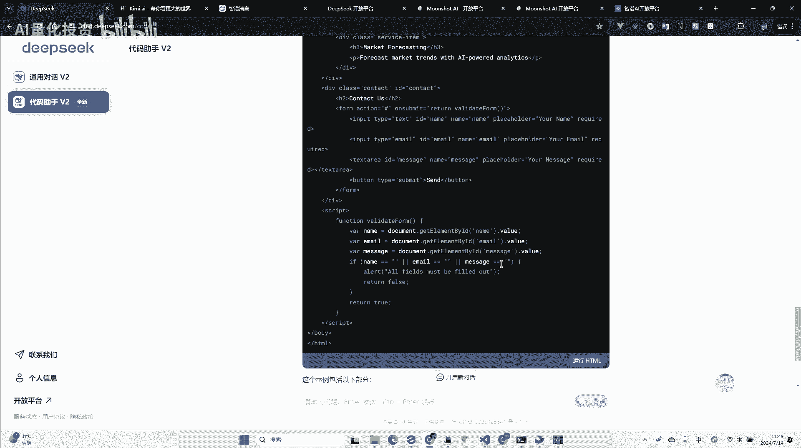

模型的能力，我没太记住啊，嗯反正这个功能呢大家也可以需要的话。

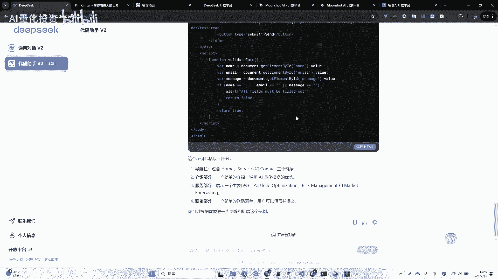

运行一下啊，嗯然后呢其实我们在目前呢。

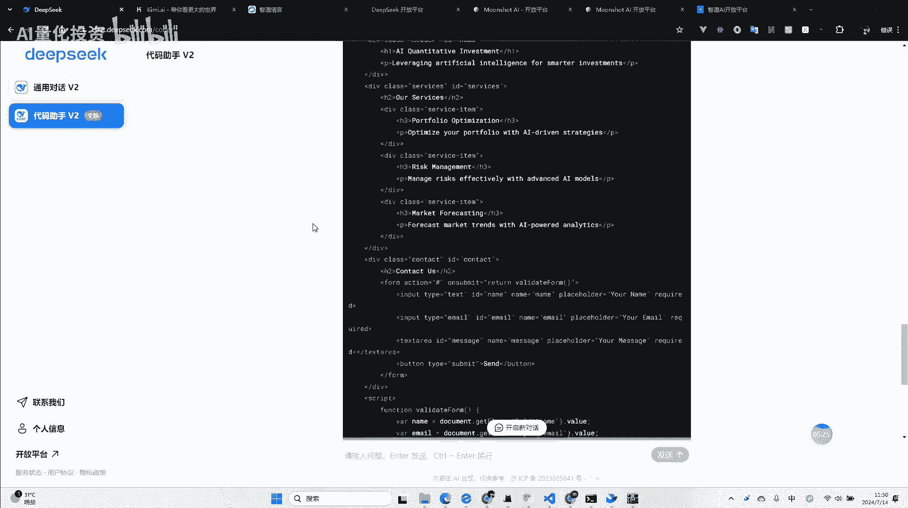

你作为一个开发者来讲，你用这种大模型呢，嗯肯定不只是想用他这个网页的这种，对话的能力对吧，你还肯肯定要用他的API，我们可以看一下这个DPSK的这个开放平台啊。

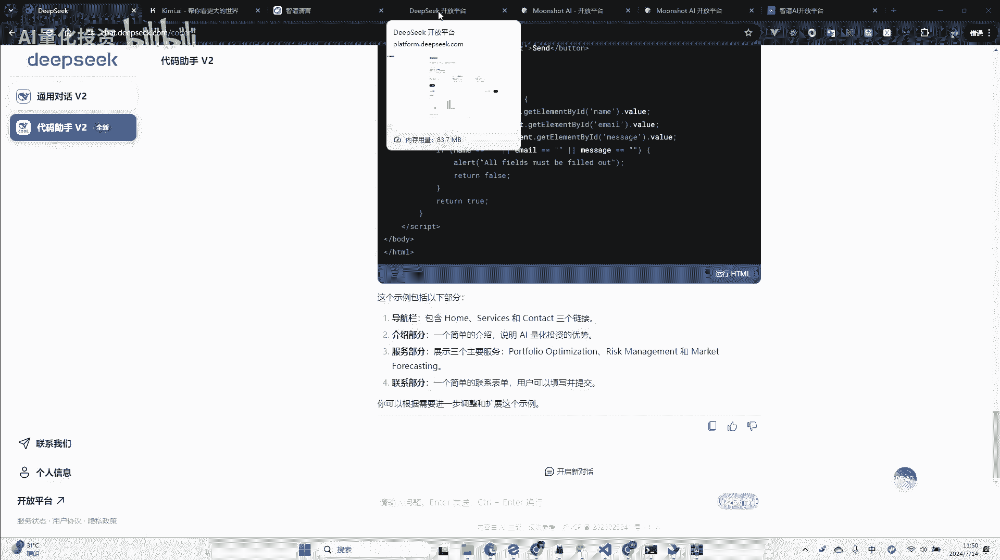

嗯目前的话DP seek的注册呢，你只要注册成功呢，他就送送你5000000token，然后我这里用了一点啊，注册试用的，然后他的单价是很低的，这5000000token呢相当于十块钱啊。

你说有时也就是说他的百万的token的单价，在一块到两块钱啊，压的已经非常低了，我现在没看到哪个国产大模型呢，比他还低啊，除了那几个大厂的，他可能是直接赠送的，有一些啊，但单价这块呢它是的确是非常低的。

然后额这里可以看一下他这里写的写的，写的价格啊，模型价格额，这两个模型的价格是一样的嗯，额输入是100万亿元，输出是100万2元啊，就是非常非常低的价格啊。

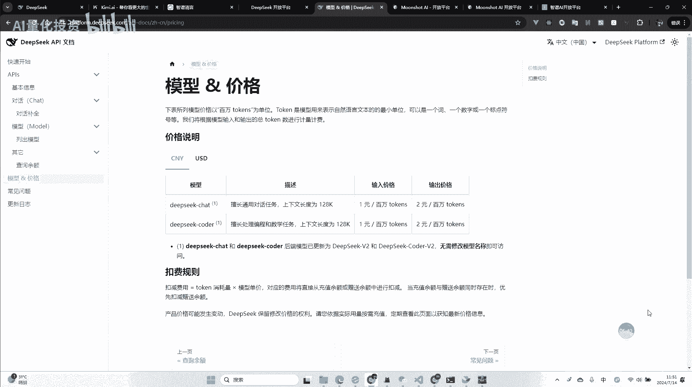

嗯而且而且现在这个deep sk呢，我认为他并没有在很多渠道进行宣传啊，所以现在是薅他羊毛的一个比较好的时机，然后再介绍一下这个deep sick的背景吧，嗯大家可能想不到这个东西是是是谁做的啊。

他背后的资本呢，其实是中国最大的这个量化私募的啊，老板啊是梁文峰，梁总做的啊，他的实控人就是呃呃换方的啊。

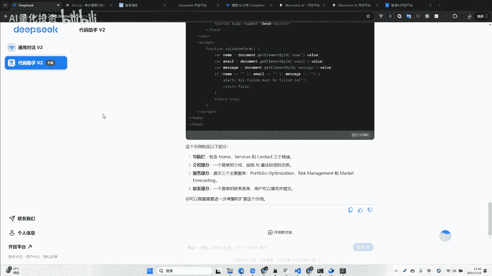

实控人嗯，也就是说它这个东西，它呃它的技术呢是嗯非常偏量化这一块的。

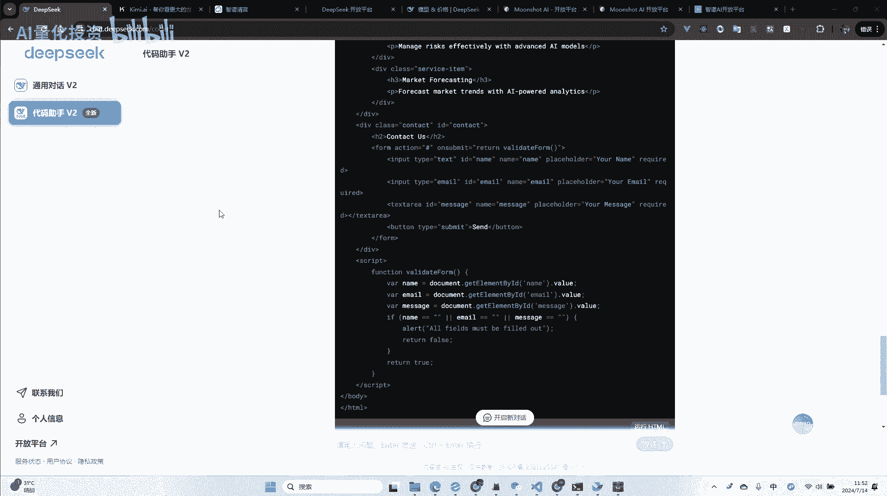

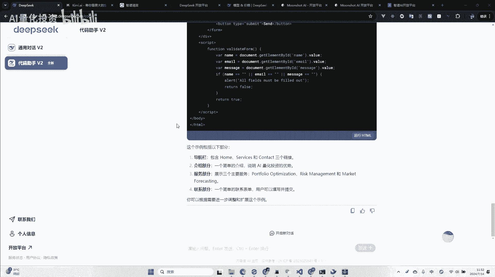

嗯因为量化这一块呢，它就主要是嗯你需要对数据进行分析，然后对嗯这个相应的数据进行嗯回测，和嗯一些测试吧，啊，所以他对这种代码逻辑这一块呢，理解是很强的啊，嗯然后大家可以搜一下这个新闻啊。

这个嗯换方背后呢是砸了很多的钱啊，在投入这个deep sc啊。

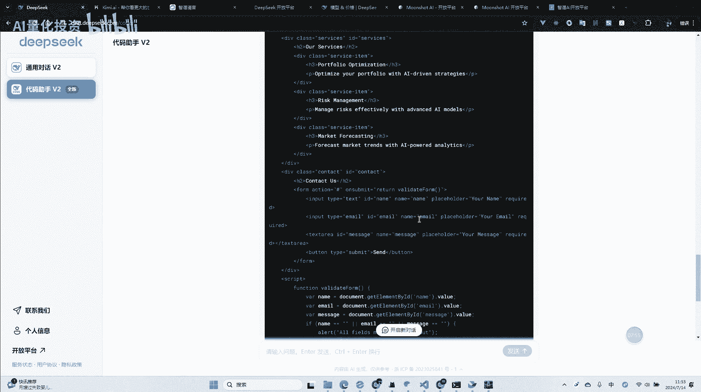

然后也因为这个呢，现在它的价格呢是非常低的啊，嗯但这些事情都很低调啊，可能没有人嗯自自己不去主动搜的话，是没有人告诉你的啊。

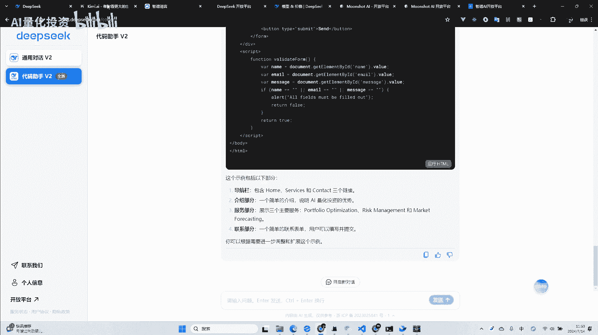

嗯然后我们再看一下下一个比较火的大模型啊，这个就是新闻上就爆过爆过一次了对吧，因为因为就因为他呢很嗯，有一次这个A股还跟着涨了很多股票，对吧啊这个就是月之暗面KIMI啊。

呃KIMI呢其实他的主要擅长的在于嗯写写文章啊，嗯但是写代码啊，我的我看他的能力也是可以的，但是他更擅长的呢其实是写文章啊，这个呢可以平时呃大家用它来呢，嗯生成一些自己的文章啊，或者是扩写自己的内容啊。

啊都是非常方便的，而且它这个网页版呢它可以进行这个呃，就是页面的搜索啊，有搜索引擎的功能啊，比如说我给大家看一下这个例子啊，嗯比如说我之前做了一个例子，就是嗯去网上我让他去查一下文档。

然后啊给我写一篇就是文章，然后这个文章是关于mini q mt怎么获取啊，历史行情的啊，然后呢他就会去搜索这些啊这些文章，这些文章有些还是我自己写的，你可以看到像这两篇呢都是都是我我写的。

他给我收到了嗯，然后他又给我生成了一篇新的文章啊，那这个文章生成的我看了一下呢，逻辑是基本上没有问题的啊，所以呢这个呃这个东西呢，其实对我们的工作呢也会有一定的提升对吧，你很多的文章的润色呢。

其实不需要自己再去做了啊，你可能给他，比如说你提供一个核心的内容啊，然后并且让他根据网上的一些内容，就可以生成一一个啊，其他的这种呃码字的东西，他就可以给你给你码了，不用你自己再想词了对吧。

嗯啊这也是很很提高效率的一个东西啊，大家如果能想明白的话，其实嗯对吧，能节省你很多的工作，呃然后我们再来看一下这个KIMI的这个呃，这个开放平台啊，呃KIMI的定价呢，其实要比这个DBCC要贵一点啊。

他你看可以看到百万头恨，是大概嗯最低的是12块钱啊，最贵的呢要60块钱，也就是说是呃deep seek的十几倍啊，到几十倍啊这么一个价格啊，但是要强调的呢就是嗯这个KIMI呢，他啊它有很多呃功能。

就是现在大家如果对于大模型开发，有一定了解的话，现在嗯GPT呢是支持这个叫to call啊，这种这种功能的啊，那像目前D刚才我介绍的DPC，可能是目前还不支持这些功能，它只是有上下文对话。

然后提示词这个功能像这种工具调用呢，目前deep sg不支持啊，但是像这个啊KIMI啊，就是月之暗面，它是支持的啊，还有相关的文档啊，这个东西具体怎么用呢，大家如果感兴趣的话的，可以去看一下啊啊嗯。

然后包括他有一些这个呃，其他的增值增强的API的功能，比如角色扮演呐，还有这个输出接身模式，这种啊啊这种能力啊都是比较多的，所以它功能多的话呢，它也是会更贵啊啊，额总结呢KIMI他就是一个呃。

也是比较通用的一个大模型啊，然后呢最擅长的呢是文本处理啊，所以我一般会拿它做一些文本处理工工作啊，嗯然后再介绍一个这个就是第三个叫质朴青言，这个肯定大家也了解很多了啊。

也是国内现在比较领先的一个啊通用的啊，它是完全对标于JBT的一个一个模型啊，而且他那个嗯还是走开源路线的，对吧啊，啊这个我们先不讨论嗯，呃质朴青言呢目前是呃这几个，我我现在用的这几个大模型里。

它的API最贵的一个啊，然后呢呃他这个呃走的呢基本上是复刻啊，GBT对标GBT的一个一个路线啊，额那这里我们就不一一示了啊，这个志不轻言，它的用法呢也类似啊。

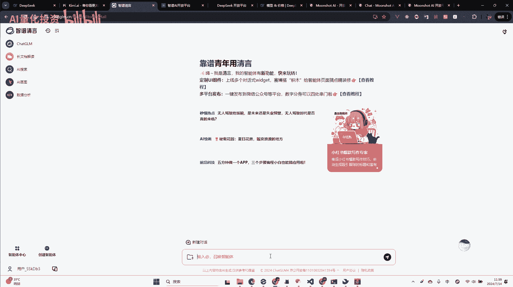

然后呃我们看一下质朴的质谱的这个API啊。

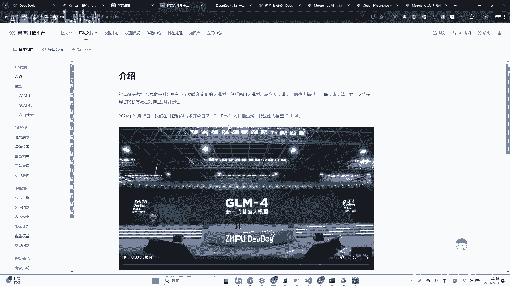

嗯智谱API呢它有一个更强的能力，就是embedding啊，就是这个向量转化的这么一个模型的能力啊，呃这个能力呢其实呃至少deep sick是没有的，然后KIMI我也没看到。

我不知道他有没有可能是没有啊，然后嗯反正他他宣传的呢。

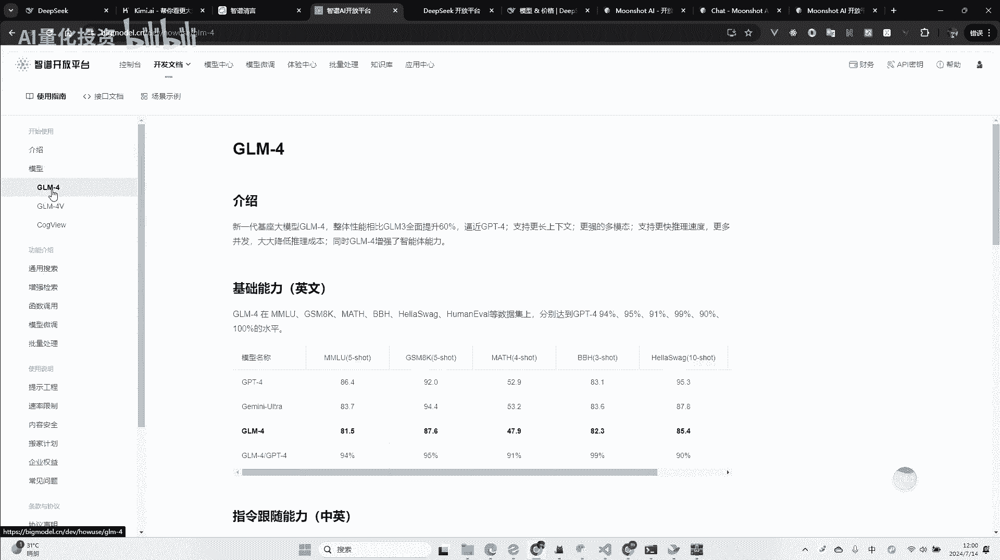

就是我也看了他整个这个介绍，这个介绍的话，大家感兴趣的话也也可以看一下，这个是他们的啊。

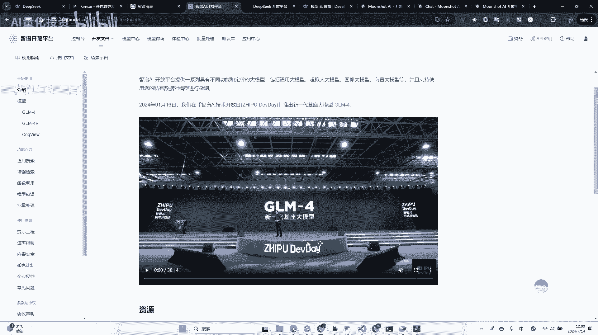

这个负责人嗯，创始人在介绍这个这个东西啊，基本上他跟GPT的相关的能力，他都介绍了一遍啊，嗯然后但目前呢现在这个呃质朴质朴的API呢。

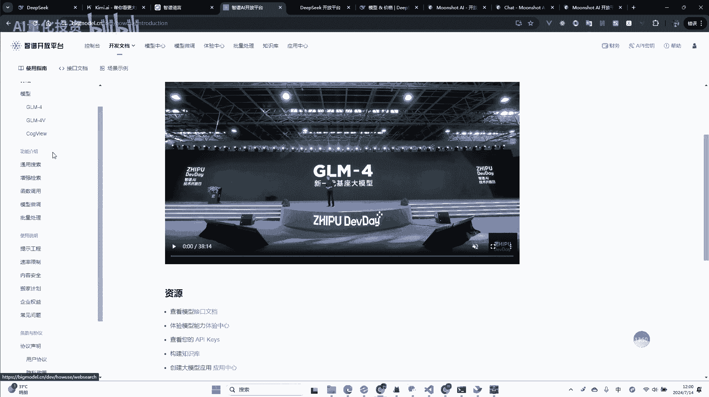

是最贵的，呃我们可以看一下这个质谱的这个API的定价啊，质朴的API定价呢大概是在嗯，是在这个铅头根一毛钱的左右，铅头跟一毛呢，你合到嗯就是10000token是一块钱对吧。

那就是将近1000000token是100块钱啊，嗯这是它最贵的这个这个呃，呃四的模型是是这样一个啊，那也就是说它的价格呢是稍微要比那KIMI，要更贵一点点啊，更贵一点点。

嗯然后但是它的功能呢目前是最全的，如果要做这个大型的或者是企业级的应用呢，可能他的嗯包括最典型的，你需要有一些本地知识库的这种啊，可能他更更合适一点啊，最后呢给大家看一下这个嗯这个大模型呢。

怎么结合到自己的这个研究体系，或者是嗯在本地用对吧，在大家自己来用，怎么调它的API啊，然后能做一些什么的效果，给大家一个小小的启发啊，那比如说这里就是我自己做的一个页面啊。

这个页面呢目前我这就调用了deep sk的这个API，然后让他帮我协助我写一些策略啊，额我现在让他尝试给我写一个最简单的策略啊，呃写一个多头回踩，就是首先判断这个标的是不是多头对吧。

然后他多头呢就有一个上涨的趋势，然后我们让他回踩20日均线的时候呢，进行买入，然后冲高就止盈，我现在并没有指定具体是什么，指什么，冲高到哪止盈，让他自己来给我判断是吧，然后跌破半年线的话。

止损的这么一个策略对吧，这就是一个买入卖出的条件都有了啊，然后我们看一下他能不能给我写出来啊，然后我们执行开始啊，这时候呢他就在帮我洗啊，这个时间呢是需要耗一定时间的，因为在调API。

我这里没采用这个流式生成啊，因为我想让他给我生成JSON，嗯JASON的话呢，我要把整个的JSON结构都拿到的时候呢，他再给我返回啊，我们等待一下，OK他现在就给我写出来了啊，然后写的那一个啊。

可以看到，我这里呢其实默认的我的提示词不止这些啊，我在代码里还有很多别的提示词，告诉他帮我要写策略，然后以什么格式去返回嗯，那这里呢他就默认啊，他已经知道我要用BACKTRDER了。

然后我写了一个这个策略，这个策略呢我们可以看一下啊，是20日线，然后半点线，然后呢啊如果呢这个嗯就是回踩20日线呢，就进行一个买入啊，然后额如果冲高呢，他这个是额意思就是建仓价格的百分。

他自己判断了一下建仓价格的百分之呃，一呃110，那就相当于一点一嘛，乘上1。1。1倍就卖出，然后如果跌破半年线呢，就那个嗯嗯就就也卖出啊，然后这里呢可以看到他忽略了我一个事儿，就是嗯关于多头的。

他没给我判断这个是不是多头啊，所以呢这个地方呢我目前往下的还没有做啊，就这个意思，如果要是说我们去做的话呢，可以在这里呢再去提示他说，你要给我判断这个股票是不是多头，是多头在买入啊，这么一个嗯过程啊。

嗯然后呢其实这个呢本地开发这个东西呢，就是做agent，我回头也会去再去介绍这方面的内容，嗯这个内容呢就是可能啊又是一大块了啊，然后怎么在本地用agent的呢，做一个自己的这个应用，包括这个写策略。

然后运行策略等等啊，嗯那现在呢我就做到这儿给大家简单展示一下，那这样呢我们就可以嗯，有希望让AI帮我们写这种日常的嗯，代码和策略对吧啊，像这种这种其实你自己写也也也也就这样对吧。

然后你可以这个提示词呢更加的详细，就会有他就会输出更多的内容啊，当然目前呢你还看，还看不到这个本地跟线上有什么太大的区别啊，后续呢如果有进一步的，我这边进进一步的进展呢，也会跟大家去分享。

看看我们本地呢做这种应用，到底能做到什么程度啊，好的今天关于这个国产大模型的这个应用呢，嗯就介绍到这里，现在呢我觉得是大家转行AI或者悬AI的一个，最佳的时机啊，因为国产大模型为了这个胜出呢。

因为现在很多大模型嘛最终肯定会淘汰到嗯，几家大规模的对吧，然后啊在这个过程中，其他的可能就被淘汰了，那在这个过程中呢，它的价格呢是嗯比较低的啊，而且基本上每个大模型你现在去注册呢，他都会送你一些啊。

至少送你呃十几块钱，几十块钱这样的一个额度啊，你可以免费用，也不用花什么钱，所以呢这块的额，开发呢和测试呢是比较廉价的啊，目前来看，其实我现在用GPT呢也越来越少了，这可能是我现在还在冲这个JP4。

一个月一个月挣20美元的这么一个嗯，就这么一个费用啊，但接下来呢可能我就不充了啊，嗯因为我觉得差不多真的差不多啊，好那今天的这个视频呢就介绍到这。

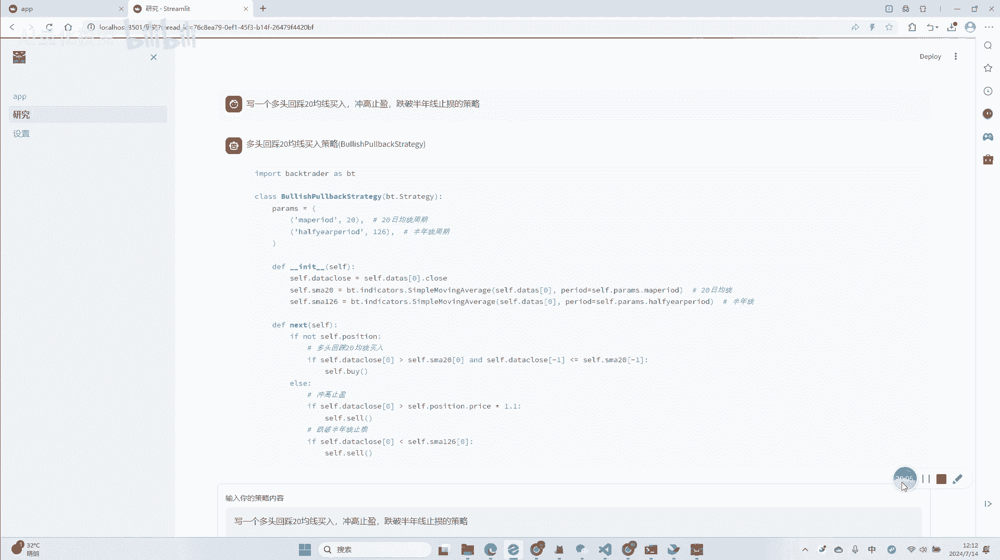