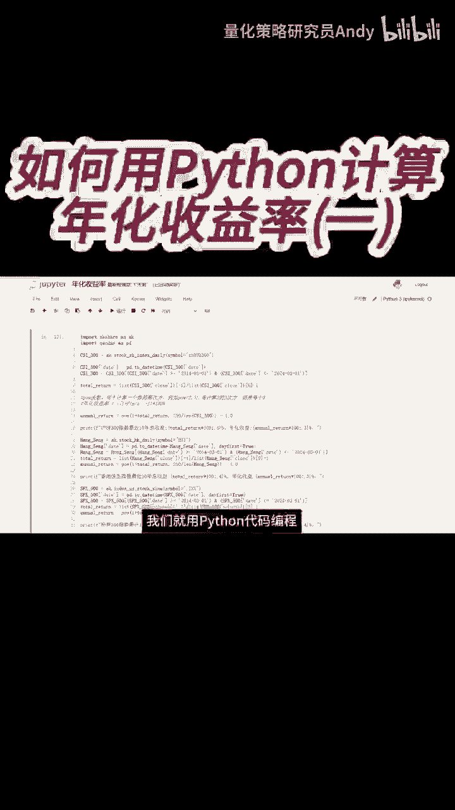
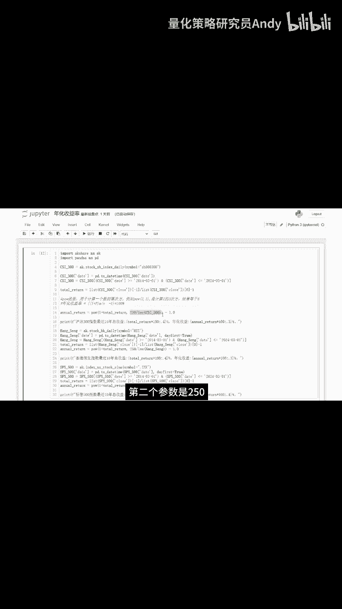

# 如何利用Python代码计算年化收益率(一) - P1：短视频3 - 量化策略研究员Andy - BV1jZ421b76E

那接下来我们就用Python代码编程来计算一下。

最近10年沪深300指数，首先我们先导入excel和pandas这两个包，然后再获取沪深300的价格数据，并且通过日期来筛选最近10年的数据，这里的total return就是总收益率。

它是等于最后一天的价格除以第一天的价格，再减去一下面这个annual return是年化收益率，这个泡函数是用于计算一个数的幂次方，这个函数里面有两个参数，比如我把参数分别设置为二和三。

就是计算二的三次方，结果等于八，那我们根据这个计算年化收益率的公式，把它带入泡函数，第一个参数就是一加上总收益率，第二个参数是250除以沪深300。

