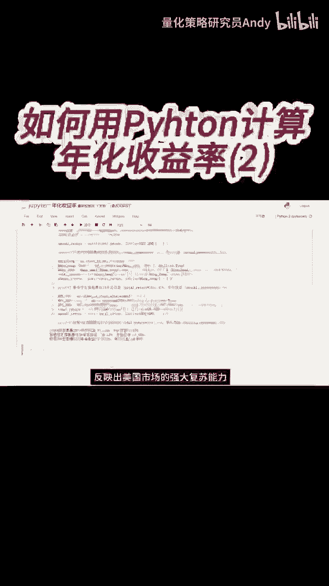
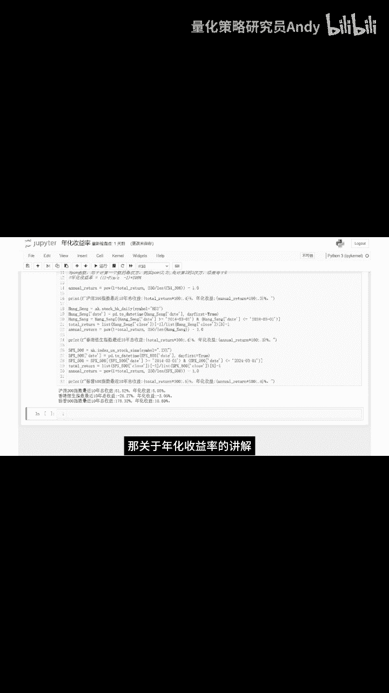

# 如何利用Python代码计算年化收益率(二) - P1：短视频4 - 量化策略研究员Andy - BV1iy421v7hJ

代码运行之后，我们可以看到，沪深300指数，最近10年的总收益率是61。5%，二，年化收益率5。05%，沪深300作为中国A股市场的重要指数，最近10年的表现相对平稳，尽管绝对收益不高。

但至少也比存银行强一点，26。27%，年化收益率负3。05%，整体表现不佳，而标普500指数在过去10年内，实现了令人瞩目的增长，总收益率达到了178。3%，二，年化收益率10。69%。

反映出美国市场的强大复苏能力，及经济基本面的良好支撑。

