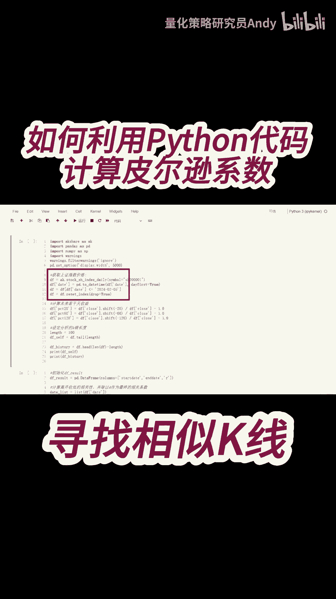
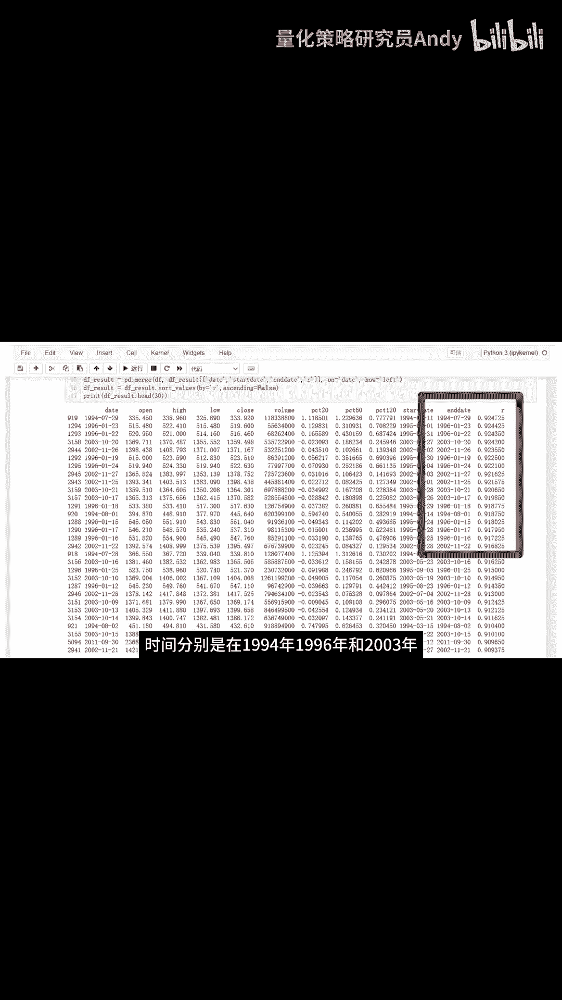

# 如何利用Python代码计算皮尔逊系数 - P1 - 量化策略研究员Andy - BV1RZ421H7TG

我们筛选出2024年2月5号之前的数据，因为在这个案例中，我们是站在2月5号当天进行分析的，接下来是计算未来若干天的收益率，待会我们会找出历史上的相似K线，这个数据就是用来分析。

在历史行情中出现这种相似的K线走势之后，在未来一段时间的收益率是多少，这个参数length等于100，表示往前获取100根K线，作为我们的基准K线，我们来看第二段代码，首先是初始化df result。

用来记录寻找到K线组合的，起始日期和截止日期以及相关系数，然后就是循环计算K线组合的相关性，因为一个K线是由高开低收四个价格组成的，所以我们分别计算这四个价格数据的相关性，然后再求平均值。

得到的就是最终的相关系数，最后我们把两个DF拼接起来，并打印出最终的数据，可以看到相关性最高的三个数据，大约都在0。924左右，时间分别是在1994年。

