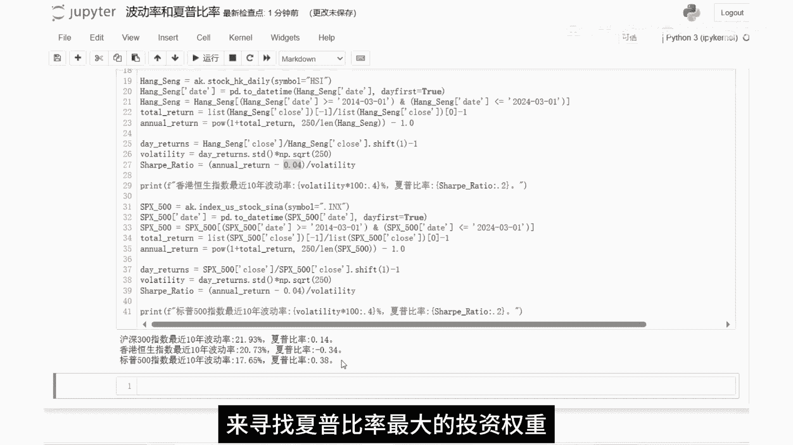

# 如何利用Python计算年化收益率、最大回撤、波动率、夏普比率。 - P1：中文定稿 - 量化策略研究员Andy - BV1Ww4m1o7Hn

大家好，我是量化策略研究员ANDY，本期视频，我们来介绍量化策略的一些常见的收益。

风险指标，以及如何利用Python代码来计算这些指标，我们在进行历史回测的时候，通常会看到一些策略指标，包括很多基金产品也有类似的指标，我们今天主要讲解四个指标，年化收益率，最大回撤波动率和夏普比率。

那我们先来看第一个指标，年化收益率，顾名思义就是将总收益率换算成一年的标准，总收益率就是等于期末总资产减去期初总资产，再除以期初总资产乘以百分之百，这比较简单，而年化收益率的计算相对复杂一点。

它是等于这样一个公式，R等于一加P的M除以N次方减去一，再乘以100%，这里的R代表年化收益率，P代表策略的总收益率，N代表策略执行的总天数，M代表每年的交易天数，那要怎么理解这个公式呀。

我们把这个公式稍微变换一下，把百分号去掉，把右边的一移到左边来，变成这个式子，121加P的M除以N次方，现在我们假设策略的初始净值为一，那左边这个1+2，是不是就是策略第一年年末的净值啊。

而右边的一加P就是整个策略运行结束之后，期末的净值，那右上角这个指数M除以N是什么意思，现在我们再假设策略总共运行了10年的时间，我们把M取值为250，N取值为2500，那这个式子就变换成1+2。

等于一加P的0。1次方，我们再把右边的指数移到左边来，整个式子是不是就变成1+2的十次方，等于一加P，那这个式子就比较容易理解了，1+2是策略第一年年末的净值，那策略第2年年末的净值就是1+2的平方。

以此类推，10年之后的策略净值就是1+2的十次方，刚好等于右边这个式子一加P，这里的M要特别说一下，在计算年化收益率时，每年的交易天数，通常会使用365天或者250天，两个不同的参数来计算。

当M等于365时，代表将投资期内的收益率，换算成，以一年365天为基础的年化收益率，适用于连续计算且不分节假日的投资情况，比如货币基金，外汇投资，固定收益类证券等，以自然日计算的情况，但是在股票市场中。

通常会用250天作为基准，因为扣除周末和公共假日，股市每年大约有250个交易日，所以用250天来估算，基于交易日的年化收益率是更为准确，那接下来我们就用Python代码编程来计算一下。

最近10年沪深300指数，首先我们先导入excel和pandas这两个包，然后再获取沪深300的价格数据，并且通过日期来筛选最近10年的数据，这里的total return就是总收益率。

它是等于最后一天的价格除以第一天的价格，再减去一下面这个annual return是年化收益率，这个泡函数是用于计算一个数的幂次方，这个函数里面有两个参数，比如我把参数分别设置为二和三。

就是计算二的三次方，结果等于八，那我们根据这个计算年化收益率的公式，把它带入泡函数，第一个参数就是一加上总收益率，第二个参数是250，除以沪深300数据的长度，这个长度就代表策略执行的总天数。

下面这两块分别是计算，计算方法跟上面的沪深300是一样的，只是数据源更改了一下好，那我们直接运行一下代码，代码运行之后，我们可以看到，沪深300指数，最近10年的总收益率是61。5%，二，年化收益率5。

05%，沪深300作为中国A股市场的重要指数，最近10年的表现相对平稳，尽管绝对收益不高，但至少也比存银行强一点，26。27%，年化收益率负3。05%，整体表现不佳，而标普500指数在过去10年内。

实现了令人瞩目的增长，总收益率达到了178。3%，二，年化收益率10。69%，反映出美国市场的强大复苏能力，及经济基本面的良好支撑，那关于年化收益率的讲解到这里就告一段落，下面我们再来看一下第二个指标。

最大回撤，最大回撤，其实也是投资者关心的一个重要风险指标，它反映了投资过程中可能出现的，最严重的亏损幅度，这里的回撤的意思是指在某一段时期内，策略从最高点开始回落到最低点的幅度。

但是最大回撤它不一定是最高点，净值跟最低点净值的比值，举个例子，比如说像这样的策略曲线，最高点出现在这里，最低点出现在这里，从最低点到最高点是上涨的过程，而最大回撤是这两段中跌幅较大的一段。

我们来看一下最大回撤的计算公式，这里的PX和PY是策略某日的净值，其中Y大于X，也就是说Y是在X后面的交易日，这个算法就是把每一天的净值，跟往后每一天的净值对比，求出回撤幅度，然后在这里面取一个最大值。

我们来看一下最大回撤的代码，获取数据的部分跟前面一样，主要是这三行代码，这个come max函数的作用是，求出迄今为止最大的收盘价，举个例子，比如今天是2015年3月2号。

那今天的最大收盘价就是从最开始的数据至今，也就是2014年3月1号，到2015年3月2号，这段区间内所有收盘价的最大值，然后用这个最大收盘价减去当天的收盘价，再除以最大收盘价，就是回撤。

最后再计算出回撤这一列的最大值，就是我们要求的最大回撤，我们运行一下代码，可以看到标普500的最大回撤，最小只有33。92%，它是三个指数里面回撤最大的，而沪深300居中，最大回撤46。7%。

这跟我们刚才计算出的年化收益率是一致的，也就是说最近10年的时间，标普500走势最强，沪深300次之，下面我们再来看一下波动率，在量化投资中，波动率通常是通过对投资组合或策略。

每日收益率的标准差进行计算的，反映了收益率与其平均值偏离的程度，通过计算一段时间内每日收益率的标准差，并进行年化处理，这里的年化处理通常是乘以根号下的交易天数，通过这个公式我们可以得到年化波动率。

他表示，策略收益在一年内可能发生的预期波动范围，波动率在投资策略的风险评估中，扮演着至关重要的角色，高波动率策略就像是过山车，可能短时间内带来丰厚回报，但同时也容易遭遇大幅下滑，这对风险偏好较低。

或追求稳定收益的投资者来说可能并不适宜，相反，低波动率策略趋向于提供更平稳的收益曲线，即使增长速率可能不如高波动策略快，但它减少了短期内出现巨大损失的可能性，适合那些注重资本保护。

和长期稳健增长的投资者，在了解了波动率作为衡量投资策略，风险的指标后，接下来我们介绍另一个，同样重要的风险收益评估指标夏普比率，它不仅关注风险，更侧重于反映每承担一单位风险，所能带来的超额收益。

从而为投资者提供了一个更为全面且实用的，风险收益性价比视角，夏普比率是由诺贝尔经济学奖得主，威廉夏普提出，它的计算公式是等于，年化收益率减去无风险利率，再除以波动率，这里的无风险利率通常是指。

国债收益率减去无风险利率后，得到的是投资组合，相对于无风险投资的超额回报，一个较高的夏普比率，意味着投资组合在承担同等风险的情况下，能获得更高的收益，因此它常被用来评价基金经理的能力。

和不同投资策略的效率，举例来说，如果一个投资产品的夏普比率大于一，意味着投资者每多承担一份风险，可以期望获得超过一份的回报，这样的投资产品在风险收益比上更具吸引力，相反如果一个投资产品的夏普比率小于一。

这意味着投资者每多承担一份风险，获得的超额回报不足一份，在这种情况下，投资产品的性价比相对较低，就是说相对于其所承担的风险，投资策略未能带来足够高的超额收益，波动率与夏普比率相辅相成。

共同构成了投资者在决策过程中，不可或缺的风险收益分析框架，帮助投资者在追求更高收益的同时，有效地控制和权衡投资风险，最后我们来看一下，计算波动率和夏普比率的代码。

上面这一块代码是我们刚才计算年化收益率的，我在下面再加入三行代码，分别计算日收益率，波动率和夏普比率，这里的无风险利率取值，沪深300取值为0。02，我们直接运行一下代码。

可以看到最近10年沪深300指数，分别为0。14，负的0。34和0。38，全部都小于一，从这组数据我们可以得出一个结论，单纯的买指数是一种投资性价比很低的行为，那关于如何利用夏普比率来构建量化交易策略。

大家可以看我主页另外一个视频，马科维茨投资组合理论，这个视频讲述了如何利用蒙特卡洛枚举，来寻找夏普比率最大的投资权重。

即最优投资组合好，本期视频到此结束，大家记得点赞关注我们。