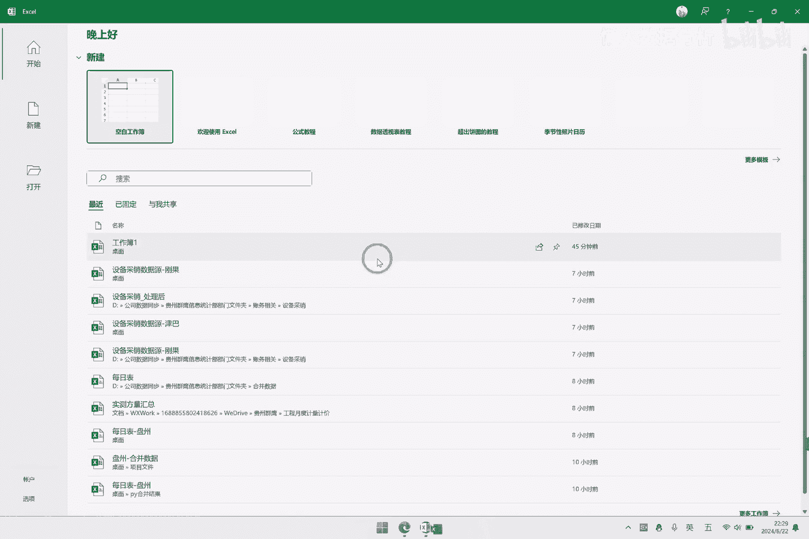

# 如何在Excel中运行Python或R语言代码？ - P1 - 懒人数据分析 - BV1UM4m1m7zP

大家好，今天我们介绍如何在excel中运行Python，或者是R语言的代码，那一看到这个问题，他就是一个比较小众的问题，因为一般我们把这些关键词去呃，搜搜索网站上去搜索的话，一般得到的结果都是呃。

怎么在Python或者是R语言中读取excel数据，并进行分析，那我们这里的问题是反过来的，我们是需要在excel中去运行Python，或者是R语言的代码，那可能有人会问。

为什么要在excel中去运行Python，或者是R语言的代码呢，我们知道Python或者是R语言，它是需要写代码的，对于大多数人来说呃，学习这些代码的话是没有必要的，而且成本会很高。

但是在excel中的话，我们通过这些可视化的按钮的话，就比较容易的去操作，比较容易上手，所以我们是需要在excel中去实现，那可能还有人会问我，为什么额需要去调用Python或者是R语言的代码呢。

而不是在excel中直接计算，呃其实我们excel里面它是一个呃很强大的，然后我们之前做的一些很多的功能，包括呃编码合并数据，多选题，排序题的分析等等，还有评述描述统计一些简单的信效度。

只要我们有规范的数据之后，通过一些呃简单的加减乘除的组合，就能够得到我们想要的结果，那这个在excel中它是能够自己完成的，那还有一些功能是额靠这些运算是还达不到的。

比如假如说要在excel里面做一个因子分析，那因子分析的话呃，它涉及到了多元统计，和那个线性代数的相关的知识，那这个光靠excel的话，它就没有那么好的支持，甚至说是很难实现。

我之前有尝试搜索过在excel中做因子分析，那相关的资料是很少的，甚至是找不到一个呃比较完整规范的，一个如何实现的介绍，那所以我们是呃，就是需要去调用其他带其他程序语言，执行代码之后。

返回他们的结果到excel里面来，那这样我们就能够实现一些更复杂的分析，那我为了要在excel中去调用Python，或者是R语言的代码的话，我做过了一些尝试，这里和大家分享一下。

因为我的工作当中会用到Python，然后呃就以Python来实现了这个过程，查了很多资料里面，其中的话有些问题还是挺难解决的，但是呃最后还是把最基本的那个过程走跑通了，也就是我们写了代码。

然后放入Python给他执行，执行之后把它自动返回到excel里面去，这样的流程是实现了，实现了之后，当我想进一步做因子分析的功能的时候，发现了一个问题，我们在Python里面的话。

它呃其实针对学术领域的数据分析的话，它的嗯支持是相对不多的，特别是我们呃做问卷分析，然后涉及到一些结构方程模型和因子分析，这这一类的，它相关的库或者是包没那么多，而且相关的教程是比较少的。

那这就在我做这个因子分析，这个功能的过程当中呢，就会因为资料很少的话，就会遇到很多问题，然后我们知道R语言的话，它是一个做统计的人，或者是有很多搞学术研究的人，会在里面有一些贡献的库，那这样的话。

我们做我们相关的专业领域的数据分析的话，呃其实用R语言的话会更合适，那后来我又去继续研究了R语言，去额如何在excel中去实现执行它的代码，嗯后面经过一系列的努力的话，也是把它这个过程走通了。

里面涉及到的涉及到了很多的问题，要不断的尝试之类的才能把它走通，那我们现在就来呃，简单的介绍一下如何在excel中去运行，我们的Python或者是R的代码，当我们能够运行的时候呢。

我下一步的计划就是逐步介入，我们在问卷分析相关的一些功能，包括中介调节之类的，当然做那些功能的话，他肯定一下子也做不出来，也是要慢慢的摸索，那现在我们先来看一下，如何在我们这个插件里面去运行。

Python或者是R语言的代码呃，首先是安装插件，因为这里要考虑到，有些老师或者是同学是第一次接触，然后我们就快速的过一下，这个整个的安装的流程，我们这里是已经安装成功了的。

它会有这么一个界面，然后我们现在先把它卸载掉，这里我们卸载掉之后，介绍一下下载的方法，下载的话就是进入我们这个呃，我们的一个交流群，比如说这里两个群，我们看一下，我们进入了这个群之后会有公告群。

公告里面我会把下载的位置放到这里，这边是一个关于这个插件介绍的链接，里面包括了它下载额以及各个功能的使用方法，那这边进进来了之后，这边有一个下载和安装，这边是目录，然后下载和安装。

然后下面的话就是各个功能的介绍，使用方法，现在已经有几十个功能。

那我们要做的就是第一步。

是要把这个插件给下载下来，就是这第一个文件下载下来之后，他是这么一个压缩包，压缩包，然后我们进行解压，解压之后就有一个安装的图标。

这边我存放这个插件介绍的这个软件。

它是阿里出的一个知识库管理软件，它是叫做雨确，然后可以保存平时的笔记啊，记录的一些文章啊，或者是其他各种各样的知识点都可以，光看这个介绍的话，是不需要登录，然后如果要下载的话，呃。

我之前试过是需要登录的。

所以大家下载的时候也是需要登录一下，那下载解压之后直接双击安装就可以，安装的时候要把excel关闭掉，因为这个安装包它也不大，就就就几兆，然后我们直接呃点击下一步，它会自动默认安装到那个D盘。

然后安装之后我们直接打开，直接打开excel。

然后打开之后，这里就会出现一个选项卡，有了这个选项卡之后，就说明我们安装成功了，如果没有安装成功的话。

大家可以对照一下下面可能的原因。

安装成功之后，我们这上面有一个按钮是R或Python，然后我们点击下面，我们点击了之后，这边有一个选择语言，可以选择Python或者是R语言，那我们这里首先以Python的语言来举例，我们选择这里。

然后他这边有一个DLL路径，这里需要说明的一点是，我们在excel中去调用Python或者是R语言的这个程序，执行那个代码的时候，它的前提是我们电脑上要安装的，Python或者是R语言。

那如果大家比较熟悉的话，就可以自己安装，然后呃需要哪些库，哪些包的话就可以自己决定，那如果是不熟悉的话，我这边也是提供了一个压缩包。

我们先把这个关了。

这个这个压缩包它是在这个呃目录的最下面，这边有一个运行Python或者是R语言，那这边是有一个额介绍，运行这个Python或者是R的时候，它相关的一些条件以及使用方法。

那我们刚才说要运行的话是需要先安装的。

然后这里我们提供的压缩包是在这边，Python的一个压缩包是在这里，然后R语言的压缩包是在这里，下载下来之后，它的压缩包就像这桌面上的一个一个PY，3114，3114的话。

代表这个Python的版本是3。3。11。4，然后这是二元的压缩包。

大家下载之后，要把这个就是找一个合适的位置保存起来，因为这个呃就是设置了之后，他的位置要固定以后不能动动了的话，就要会重新选择那个目录才行。

那我们看一下选择目录的这个过程，首先我们是我们就用嗯Python这个来举例子，这边他是需要提供一个额Python d l l的路径，也就是我们在这边执行这个，在这个路径下执行它的Python的脚本。

那我们把这个压缩包下载，下载下来之后要进行解压，Python的话它是一个很大的语言，它里面什么都可以做呃，他可以做的话，也是说他去调用了呃，别人写了很多的包，也就是写了很多的功能。

然后我们用的人会去调用这些包，那我的这个压缩包里面，它是预先安装了一些基础的必要的包，必要的包是指我们后面我陆续开发的那些功能，它是需要这些包它才能够运行的，然后呢其他不需要的话。

我就不会去额压缩到这里面去，那假如说你对这个语言很熟悉的话，你就可以自己安装自己想要的包，当然我觉得如果已经会这个语言的话，也不太会来用这个插件，所以呢不熟悉的话。

就按照我这个步骤来，然后先下载这个下载这个压缩包，然后这边解压之后，有一个PY3114的文件夹。

这个文件夹，然后我们打开这个文件夹，看一下它的路径呃，它里面的内容，它这里面的话有一个嗯进来之后有很多文件夹，然后在下面有很多DLL的文件，那我们要添加的是呃带有版本的这个文件。

带有版本的这个DLL文件，也就是python311点DLL，然后我们要把它添加到添加到这个路径里面，那我们这个文件它是放到它是放到桌面的路径，是这个我们复制一下，然后把它粘贴到这个位置，额不太对。

这个是这个是路径，然后我们要这个文件文件的路径，不是文件夹的路径，那这边选中这个文件，它是有一个呃复制文件地址，然后这边粘贴我们不要他的双引号，就这样，或者说我们直接点击这边右边的这个，浏览的按钮。

然后把它添加到，把刚才那个PY3114，下面的这个311点DAL把它添加进来，添加进来之后，那就表示我们excel已经和这个Python的这个程序，已经关联起来了，那后面我们演示一下执行代码的方法。

这里为了方便演示。

然后我们是有一个示例数据的按钮，这边有一个示例数据，我们点击一下，点击之后，我们看到这边excel里面它是生成了两张表，一个是DF1，一个是DF2，那还有一个是习题，一是我们没有用到的，没有数据。

那这里有三张表，那这左边它是一个数据源，也就是每一张工作表，它就是一个数据源，这里三张，然后我们要用到DF1和DF2，那这就表示我们呃我们勾选这两个，就表示我们要用这两张表的数据，那这里勾选呢。

它就会自动把这个数据导到Python的程序里面去，那导进去之后，我们写代码的时候，就可以直接以这个工作表明去调用这个数据，那这边是一个示例的代码，这边示例的代码简单的介绍一下他的意思，这第一行是呃。

导入Python里面的pandas这个库，这是一个处理二维表最常用的库，二维表的话就是我们平常收收集到的这种数据，这种就叫二维表，然后第二行是用这个pd库里面的这个contact函数。

把这个DF1和DF2追加起来，追加的意思就是哎比如说这个是一，这个是二，我们追加的话就是把它拼接起来，然后我们这里做了一个最佳的操作，然后呢我们呃这下面还有一个匹配的操作。

匹配的话就是用这个pd库里面的merge函数，把DF1和DF2匹配起来，那匹配的意思就是横向的匹配，纵向的叫追加，横向的话叫匹配，匹配的意思就是，比如说他的他这个A假如说A列是他的姓名哈。

一个叫2345，然后我们要匹配的话，就是呃把二和二对应的行给它匹配起来，三和三对应的行匹配起来，然后最后匹配完了之后是列数增加了，然后这就是匹配，那第四行的功能是追加的变量名。

我们DF追加是把DF1和DF2追加起来，然后我们这里是要呃返回它，返回一下他的一个变量名，我们看一下DF1，它的变量名是ABCDF，二的变量名是变量名是AACD，一个ABC，一个ACD。

那我们呃追加了之后，看一下它的变量名是哪几列，最后一行的话是返回追加后的函数，也就是呃比如说原来是这么多行，后面我追加了这么多行，最后他有多少行，我们需要返回这个行，这个行数我们撤销一下。

然后这里是代码最后的这个框是返回值，就是我们执行了这个代码之后，我们需要哪些数据，那我们这里是返回了四个值，也就是刚才的我们要一个追加后的数据，要一个匹配后的数据，要一个追加后的那个变量名。

然后要一个追加后的行数，然后我们点击这个确定确定，就表示我们执行这个代码，我们看到他用了12秒，我们是没有啥数据的，他都用了12秒，然后经过我测试之后呢，他是那个额，就是可能是前几次会比较慢。

然后这个原因的话呃，可能有一些初始化的操作在里面吧，我估计是这样的，那我们这里删了之后重新执行一下，可能速度会快一点，看这里的话他就是零秒，就是零点几的话，他就约等于零秒，这个速度就会比较快。

然后我们一个一个的来看这个结果，我们看一下，这是那个DF1的数据。

这边是那个。

DF2的数据，这边一个是DF1，一个是DF2，然后我们看一下它追加的结果，追加了之后他是呃DF1和二都只有三列，然后一个是ABC，一个是ACD，然后追加之后他是四列，追加了之后，他缺少的那些数据。

它会标记成这个NANNAN的话，它在Python里面就是一个缺失值的意思，他就是呃不是一个数值，Not available number，第一列在DF1里面它是没有的，所以是这个NAN。

那这个数据我们也可以给它处理一下，比如说这个DF追加，它是追加之后的结果，然后我们要给它填充一下缺失值，比如说这个缺失值，我们填充就填充成一个空值，就是啥都没有，然后我们再运行一遍看一下。

我们再看一下追加的这个文件，然后他就是他就啥都没了，看这里我们追加，我们比如说你想填充成一个零，用999表示趋势，那它也是一样的，然后追加的结果也是这样子，那这里是追加的结果。

我们他其实就是说这边返回值一个值，我们就返回一张表，然后表明就是这个值就是这边的变量，它要一一对应呃，第二个是他匹配匹配的结果是，这个总共有五个人，12345，这边他应该是还有一个呃匹配的字段。

比如说你根据哪一列来匹配，那这里我们增加来看一下，比如说我们根据A列来进行匹配，然后house是alter，就是一种匹配模式，这个就不细讲了，这个，然后我们看一下它的结果是怎么样的。

但是我们根据A列来匹配的话，然后因为DF1里面有C，然后DF2里面也有C，然后他呃最后匹配来的话就有两个C，所以他用一个X和Y来进行区分，我们知道这个逻辑之后，它看它默认的情况。

因为他有两个共同的列是AC，所以如果没有这个参数的话，它就是根据AC列的组合来进行匹配，那我们直接看那个默认这个代码的结果，那这边AC的话我们看哈，呃比如说DFE的AC有那个一一，那，Ac 4e1。

然后呃针对针对DF1的话，这一行他是没问题的，然后因为DF2里面，他没有AC组合之后是一一的这个值，所以他的D是匹配不到值的，所以他是NNA，然后AC1列是234，这边有234，有234，234234。

所以他能够匹配到低列的值，那反过来A为五，C为六的时候，DF2中D列有一个七，那DF1的话他没有，所以这里匹配了一个空值，那这就是一个匹配的结果，这边返回了那个匹配的结果是这张表。

然后后面的追加的变量名，我们也就是追加的变量名是这个ABCD，所以这里返回了ABCD，然后这边有一个行数，行数的话是八行，我们看这边是呃，因为第一行是标题，所以它返回的最佳的行数是八行。

那这就是我们在excel中，借用我们这个插件来执行Python代码功能，的一个演示，那讲这个呢，其实呃，不是说让大家去用这个工具来执行Python的代码，而是我在后续的功能开发里面。

会涉及到要调用Python或者是R语言的这个程序，然后大家要知道去下载这，这个或者或者是这个压缩包，呃，我后面开发的那些功能，它才能够执行，一般来说如果你有基础的话。

如果你想在我这个工具里面去执行这个代码，那我觉得合理的流程是嗯，你首先要把这个代码在Python的语言里面去呃，比如说PCHARM里面或者是其他编辑器里面运行，能够成功之后，然后再放到这里面来之后呢。

才额直接返回这个结果，那这样一来可能是一个比较合适的选择，呃我们看一下这边这边运行Python代码的时候。

我这里是写了一些写了一些他的额介绍，其实就是一些呃深度使用的话。

你可以了解一下这些内容。

然后我们再来简单的介绍一下，怎么去调用R语言的代码，R语言的代码和Python的话很像，然后首先下载了这个之后，我们要把它解压出来，呃解压之后这边就有一个文件夹，然后同样的。

我们这边就要选择R语言的这个这个按钮，额，选择了之后，这里假如说是没有的，然后呢就要添加添加的话，他这个DLL的路径的话，大家看一下是在哪个位置，首先进入到这个文件夹，下面有一个R4。4。0。

它是指那个版本，然后后面是后面是有一个并这个目录，然后点这个叉64，然后这边有一个R点DLL，那这个路径我们就添加进来了，那我们这里再找一个测试数据来试一下，呃这边他会把之前把这个工作簿里面的。

所有工作表都读进来，那我们先删掉，看起来会清晰一点，都删掉，然后我们再重新生成一个测试数据，这边是一个R语言的测试数据和Python的是一样的，但是他测试的这个代码就是R语言的语法。

那我们直接点击这个结果看一下，这边这个merge应该是说他是一个追加的概念，然后这边是一个匹配，比如说这里最佳，然后这里是匹配，然后这里是那个变量名。

这里是它的行数，这四个表和Python是一致的，那Python和R语言你去在excel中执行的话，额方法就是这样，然后也也简单一些，细节的话大家可以看这边。

然后在使用的过程当中的话，因为呃因为这些功能它是第一次做出来，也就是一个出版，后面肯定会遇到不少的bug或者是呃大家的建议，然后呢都可以告诉我，我会把它添加进去，然后慢慢的一个迭代优化。

那后面会基于能够调用Python，或者是R语言的这种能力，去开发其他的一个比较复杂的功能。

那后面后面基于这些，会打算这边有一个历史更新，这边后面接着计划更新的是一个呃因子分析，然后后面会再加一个，后面再加一个额简单的中介调节，然后把这个走通了之后，再去呃研究一些复杂的中介调节。

那大家如果有其他的建议建议的新功能。

或者是现在已经有的功能的优化的话。

大家都可以告诉我呃，比如说在前面的很多的功能，或者是这些呃优化的呃，优化的点都是嗯，其他的老师或者是同学提的建议。

然后逐渐加进来的额，欢迎大家进QQ群来讨论。

谢谢大家。

