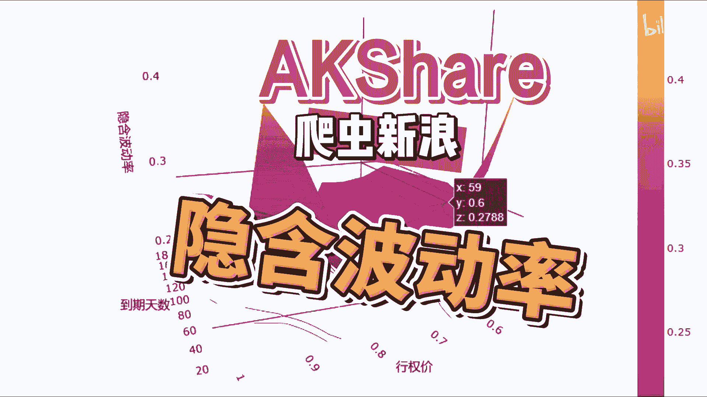
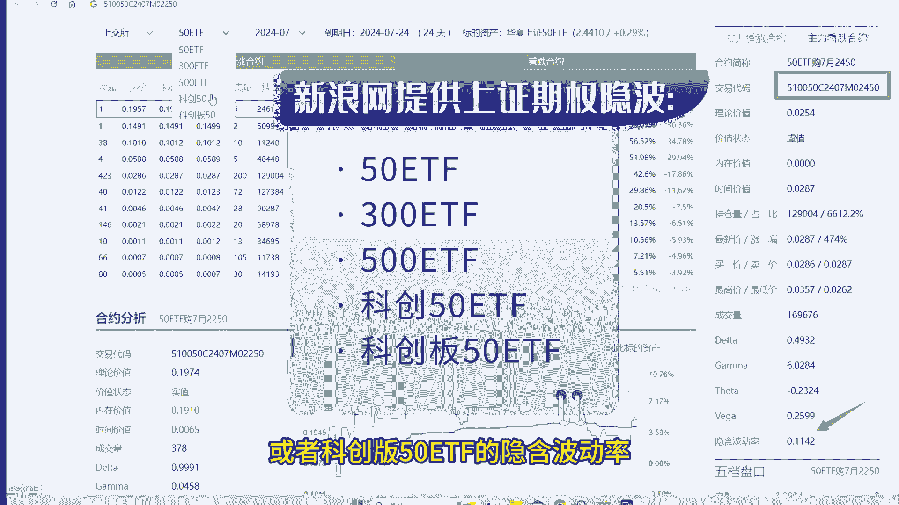
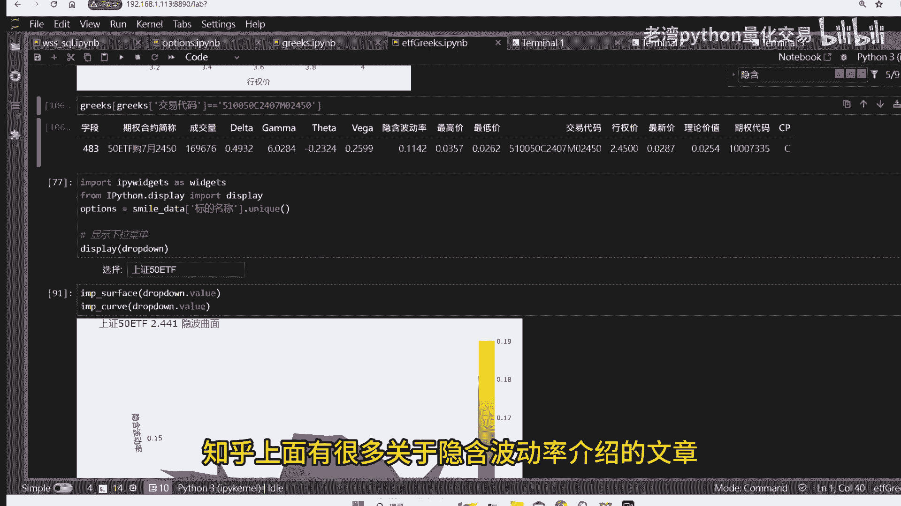
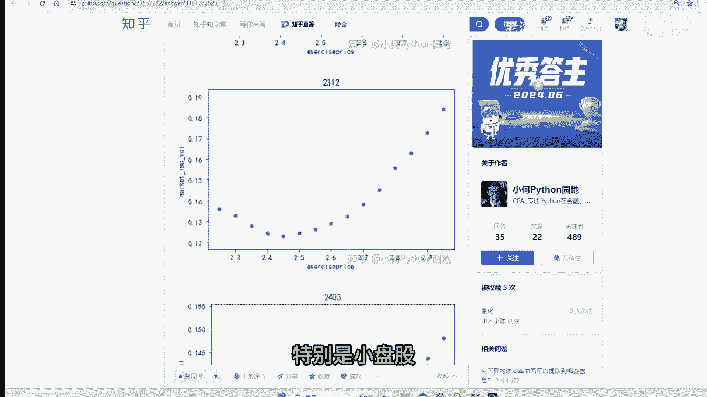
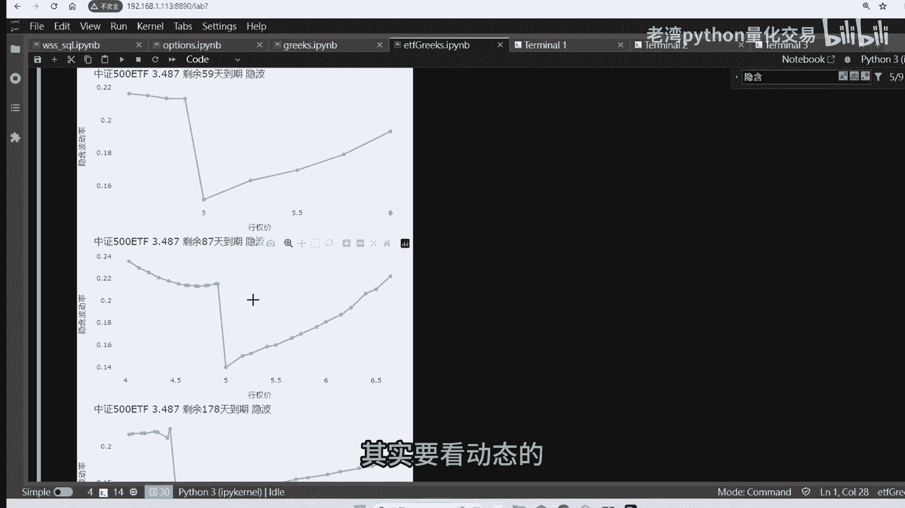
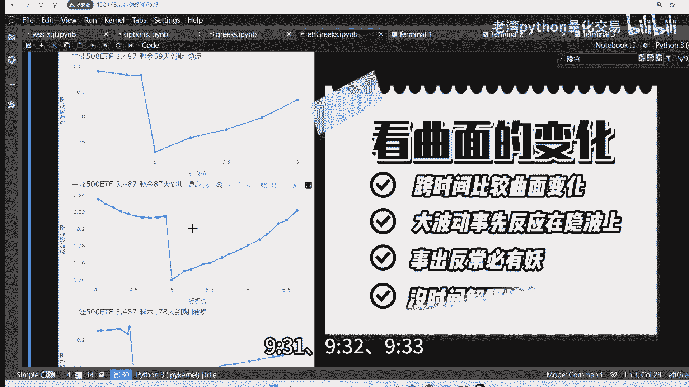
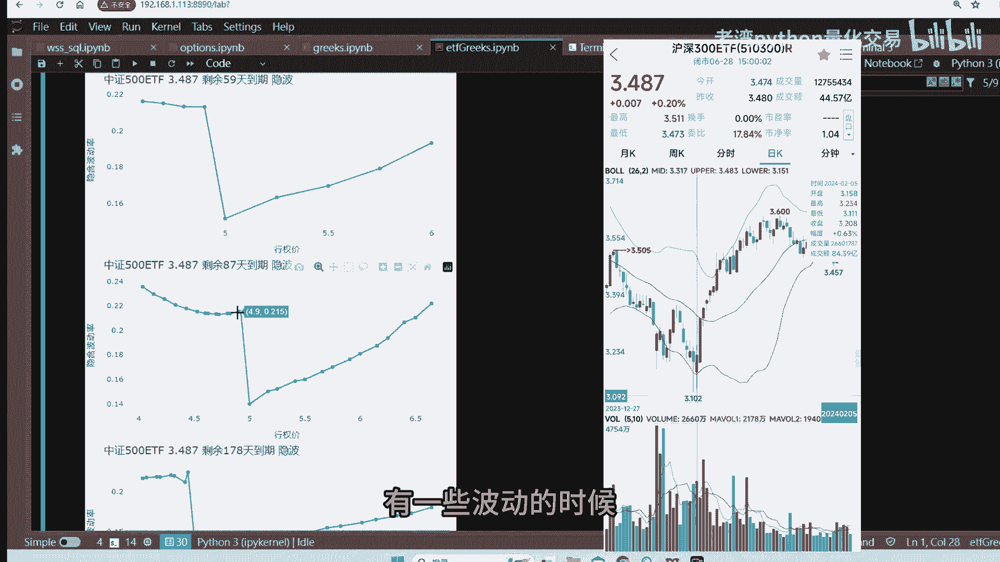
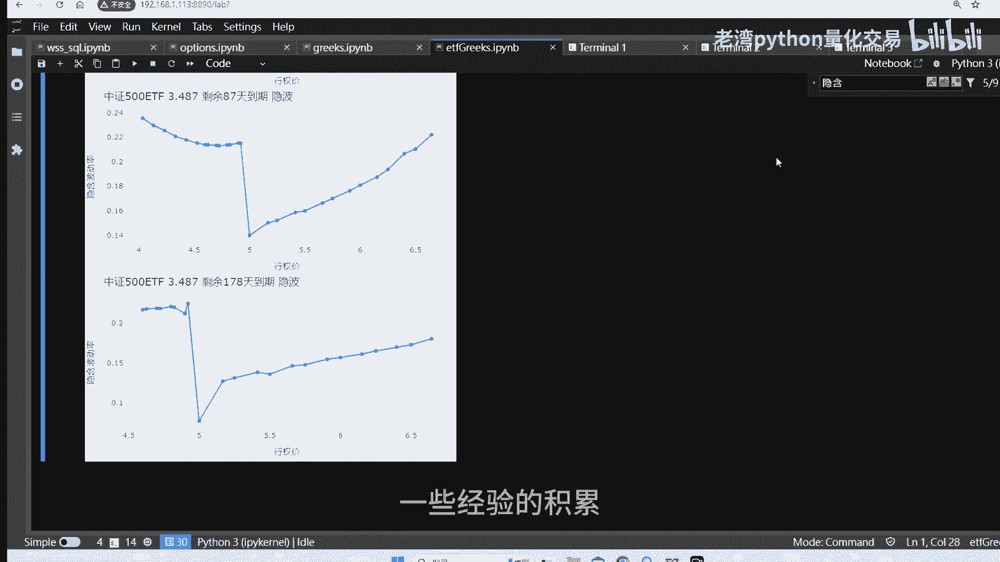
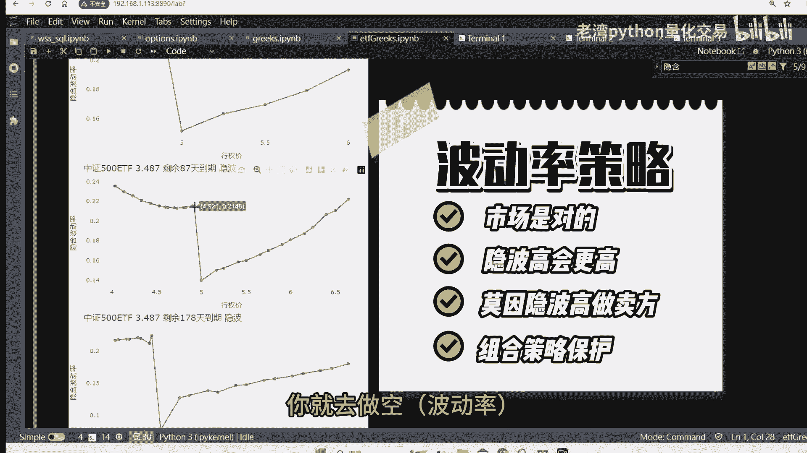
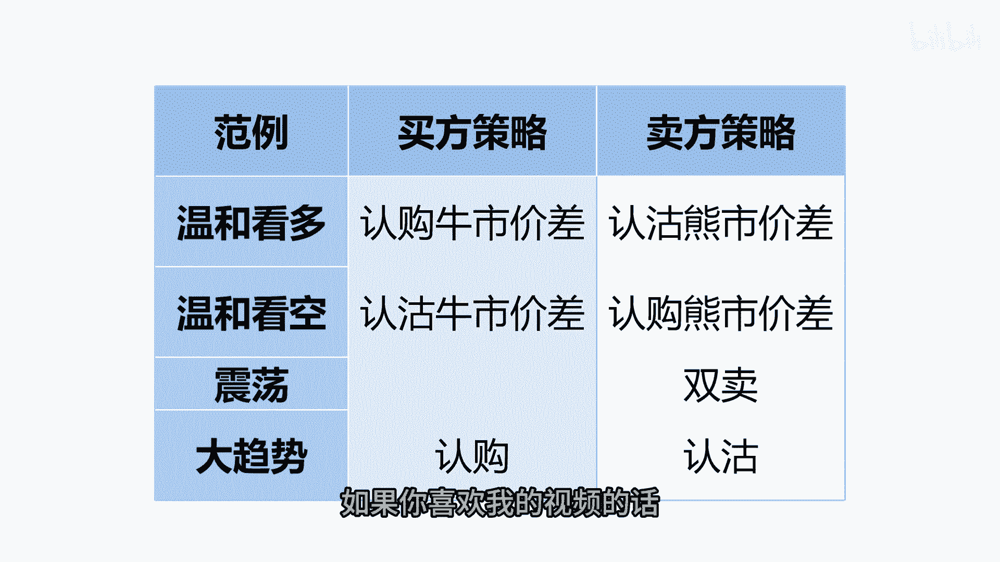

# 如何套用AKShare的隐含波动率预测市场涨跌？ - P1 - 老湾python量化交易 - BV1KM4m1U7Dv

投资有风险，入市需谨慎，大家好，我是Python量化交易的老湾，前几期视频有教大家使用ak share，这个免费的工具包，它是一个爬虫的工具包，它能够帮你爬取金龙与网页上面。

不管是上证或者是新浪广或者是东方财富，他都能够帮你爬取金融数据，这其实网页上面的数据，ak share呢它帮你爬取了这么多丰富的数据，而且他返回来的是数据框，因为如果你是直接爬虫的画。

自己还要解析这些数据，AK需要人，他都帮你处理好，今天示范一个应用是集权的隐含波动率，那在ak shell们上面也可以帮你爬取，今天用的范例呢是新浪网上面的隐含波动率，先解释一下什么是隐含波动率。

其实你是买未来的一个预期，如果你是买认购，那就是认为它未来会上涨的，如果权利金越高，就是买的价格隐含波动率越高，其实卖认购或者认沽都是买这个隐含波动率，我举例的是14年7月的啊，侵权价是2。45的。

上证50DF，从新浪网上面直接看到了50ETF，300ETF或者是500ETF或者科创板，50TF的隐含波动率。

还有它的C大字母，那这些数据呢都会透过ak sh子攻击包爬回来，2450，这个平泉附近的隐含波动率，那是1142，那必须要爬总捆来的隐含波动率呢是142，所以呢。

ak share是可以帮你直接爬取这些网页上面的数据，它本身是不持有这些数据，它只是在你查询的时候帮你爬取这个数据，植物上面有很多关于隐含波动率介绍的文章。

齐全型天价，离ET5最新价格越近，隐含波动率就越低，离最新价格越远，隐含波动率就越高，所以会形成一个微笑曲线，怎么设后未出现的不对称的情况呢，如果市场大跌或是大涨的时候。

对于单方面隐含波动率预期比较高的时候呢，你就会偏离掉这个曲线，上礼拜大盘跌的比较多一点，特别是小盘股。

中证500的跌幅是比较大的，日常这时候市场比较悲观的时候，认沽的隐含波动率会比较高，如果是我们一般在看上证五零，或者是沪深300的时候呢，这个都是一个比较对称的形状，市场上对于上涨或者下跌的预期呢。

它是一个比较平均的，有一个比较特殊的中证500ETF的一个齐全，这些代码呢都是我透过ak show那在Python上面画出来，可以看到中证500，衣服呢是一个非常特殊的一个齐全。

中证500目前大概是五块钱左右，五块钱往下试点八，试点九，自在往下的话，忽有一个很大的跳动，它转动一下的这个3D的曲面图，可以看到它不是对称的，市场上呢对于下跌的，所愿意付出的溢价是比较高的。

银行波动率就是我愿意付出的价格，因为我们买慢了，其实是是隐含波动率，所以市场上对是比较悲观的，认沽会有比较大的溢价，上涨呢它是一个比较平常的一个波动，往下看一下，把它分不同不同的涉及到期天数。

全部把画修改24天啊，这是最近七到启的，或者是59天，这是8月到期的，可以看到都有一个特大的跳档，这里要注意的是，一般对于上涨或者下跌的预测，其实要看动态的。

也就是现在如果是开盘的时候，09：30开盘，9。31分，9。32分。

9。33分，整个曲面是不是有开始的波动，农历年前的时候，我有发了一篇预测，半认购跟认股起打的拉升，有一些波动的时候。

露露说打兄弟要进场，村市场上都会知道，字场上通常是正确的，表示呢，真的有人要出手，这个是我们在做预期一预测的时候，那一些经验的积累，不要认为这现在的波动率比较高一点。

波动率比较高一点，你就是做空啊。

那是非常危险的，职场上是对的，最后帮大家做个总结，因为其权交易由买卖多空两个方向是种操作，所以在策略的主额上面会比较丰富，不管你是积极的看多，或者是认为市场是震荡的，你总能找到一个合适的策略。

不管是隐含波动率或者是时间价值，或者是恐慌指数，都可以找到合适的信号，作为你策略参考的依据，当你对市场上有一定的看法之后呢，再找到合适的策略，可以拉大你的利润，降低你的风险，今天的分享先到这边。

如果你喜欢我的视频的话。

投币点赞加关注，一键三连，下次见喽。