# 如何构建一个完整的量化策略 - P1 - 掘金量化 - BV1AM4m1S7Cs

啊那上一节课已经讲到了那些Python啊，这边了，那我们就可以啊，学会了Python之后，那你可能就要选择一个啊一个专业的一个平台，因为这是你构建一个量化策略的一个基础啊，不管你是选择自己造轮子。

写一个本地的回车框架也好啊，或者是选择一个专业平台也好啊，都是可以的，但是这里的话，你可以可能可以稍微进一步了解一下，如果你的编程程序，编程的基础还是比较弱的话，那对于如果选择自己造轮子。

自己选写一个回收框架来说的话，那你可能会发现啊，你自己要搭啊回撤的框架，还要搭一个绩效分析的框架啊，然后呢你还要需要涉及到啊，历史数据怎么去处理啊，你要自己去清洗这些数据，然后搭建一个数据库好。

搭建好数据库之后能做回撤了，那你还要再接入一个交易的一个通道啊，交易券上的通道啊，所以他他整个流程啊是比较麻烦的啊，像我们之前也有一位啊客户啊，他是一个高校的老师啊，他自己的编程技术肯定是很好的。

但是他呢也花了3年多的一个时间，自己去写一个回撤的啊，期货的的一个交易框架啊，整个的一个时间周期啊还是比较长的，那这里呢除了你自己去啊造轮子，弄一个回测框架，弄一个交易本地的交易框架。

那你还可以去选择啊一个比如说开源的软件好，现在有很多开源的软件，比如说VNPY啊，啊back trainer啊等等啊，那你这些啊选择这些量化开源的平台的话，你会发现啊。

你可能你所需要的编程技术并不是很高啊，但是呢你还是要需要啊，处自己去处理这些历史数据啊，当然啦又有一些啊，他们平台也会对接一些专业的数据库啊，所以呢在其实你这里每年也要自己买，他们的数据，也是要有额。

也也要大几千的一个花费啊，所以呢啊这里的话可能你去做一个选择一些啊，在线式的啊，流一站式流程的一些软件可能会更好一点，比如说像我们掘金就会提供的比较完整的啊，包括回撤啊。

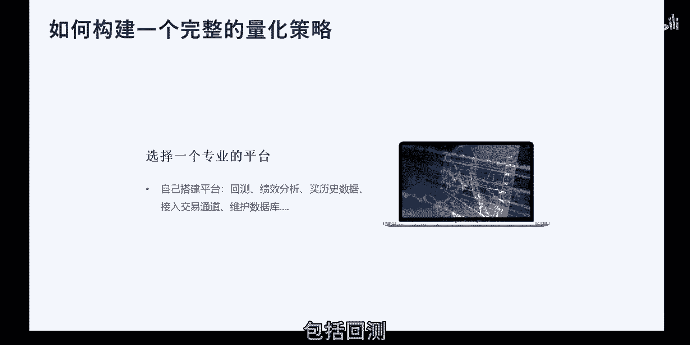

啊包括回测啊，策略开发回撤啊，仿真都要示范的这一整个全链路的一个功能，还有同时呢也会支持本地化的一个终端啊，这里的话相对于一些额友商来说啊，比如说像啊巨宽他们的话，整个呃平台的一个框架。

是一个在云端的一个设计啊，在云端的设计的话，他们啊你在不同的软件，不同的电脑上都可以同时随时习登录啊，这个是他们的一个平台的优势啊，但是呢可能策略的一个私密性，肯定是不如本地化终端卖得好的是吧啊。

因为你你不管你换一台电脑，那你可能就看不到你的那些策略源码，所以呢对这方面有需求的用户朋友，可以尽可能的去选择这种本地化的一个终端啊，同时呢掘金呢还会支持TK基的回撤啊，还有风险控制。

刚才也有演示到了啊，就是比如说像刚才啊股票黑名单这种设计啊，啊你就可以在啊终端的策略交易里面去设置啊，然后还有一些智能工具啊，也就是刚才有提到过的啊，条件单，还有网格交易等等。

还有很重要的一点就是对配置低的策略，是能够落地到交易去的，对对对啊，这里可以说这其实呃刚才有提到巨宽，巨宽其实是一个很好的一个平台，不过他们的主主页呃，应该是从一个量化平台转到了自己做私募啊。

所以呢他们呃他们的一个实盘的通道啊，只是在去年的12月份已经下架了，所以呢呃在聚宽公平台上，你可能就做不了实盘交易了啊，那你可能就会发现那里啊写好了这个策略啊，从特别开发好了，回撤好了。

哎反正那仿真的挺不错的，但是你就不能去做实盘交易啊，那可能就意义就不大了，所以你最可能的话最可能好的其实是啊，在你一开始选择平台的时候，就要去尽可能去选择一个，可以做实盘的一个平台啊。

啊那你当你选好了一个平台之后，那你可能就要开始去写这个策略了啊，写策略之前呢，你可以先了解一下啊，策略的它也主要的一个结构有哪一些部分好，那我们这边先啊提这个策略结构之前呢，我们先来跟大家讲解一下好。

因为你一个策略你写好之后，你刚开始肯定是要先回撤的嘛，回撤了，然后再去实盘啊，所以呢一一份代码的，可能就是要兼顾回撤跟实盘两个功能，你不可能说我回撤好了，但是实盘的话又要改代码哦，是那会很麻烦。

很耗费时间，所以呢在啊策略的一个设计当中啊，其实有包含两类比较重要的主流啊，主流的回测方式，第一种就是矩阵式的一个回撤方式啊，比如说我将所有股票啊的一个选股条件啊，还有一个收益率啊等等都弄成一个矩阵。

通过矩阵的一个运算啊，去求解出我最后所需，满足我所有条件的这些目标股票，我计算出这些目标股票它未来的买点卖点啊，再算出它的一个收益率啊，矩阵式的这种回撤会啊，优点就是速度很非常快啊。

相比另外一种速度是很快的啊，但是看他对一些细节一些处理啊，啊比如说额交易它是哪一些滑点啊，然后或者是交易的那个时间，他的一个啊档口期间的一些变化，那些细节处理是不够精细的好。

所以呢现在大部分的一个量化平台啊，他们所采用的回测框架啊，都是另外一种就是事件驱动型的一个回收框架，怎样什么是自动区间驱动型的呢，啊这边那可以稍微来看一下这种在这幅图中啊，就有提到的两种啊任务。

一种是定时任务，另外一种呢就是事件驱动型的一个任务啊，这个我们先来看一下事件驱动啊，事件驱动，其实啊里面最包含了一种，最重最重要的一个事件就是行情事件，好航天事件，比如说啊你订阅了一个数据的行情好。

假设假设是一分钟的啊，那你定位一中一分钟之后，那交易所那边每一分钟它啊，给你推送了一分钟的数据之后，那你就会触发你这个啊一分钟的这个事件啊，那你就可以在你这个事件这里面啊，去构建你所需要的啊策略的逻辑。

比如说你可以判断这只股票的一个股价啊，是否达到了你一个买卖点啊，那达到买卖点之后再去进行一个下单是吧，那这里呢除了这种事啊，行情事件的还有一些很重要的一个一些事件。

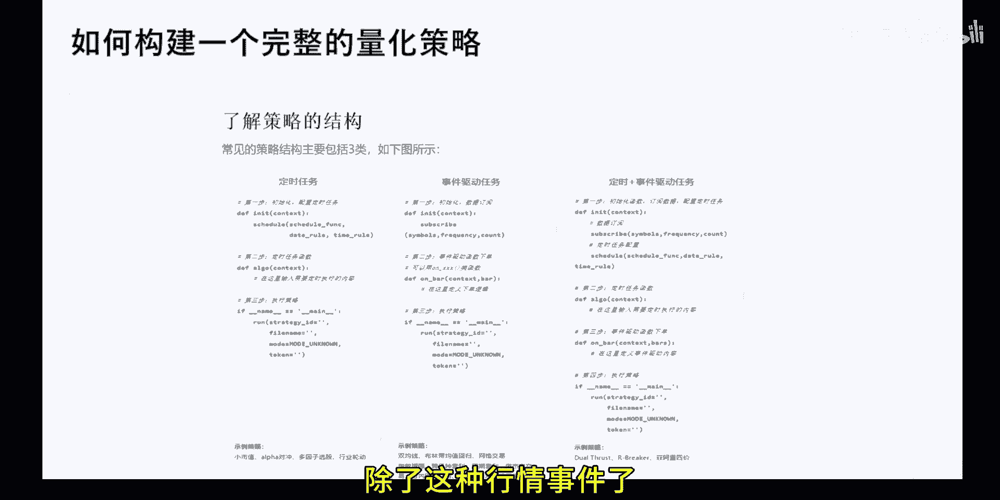

那我们这里的话就直接。

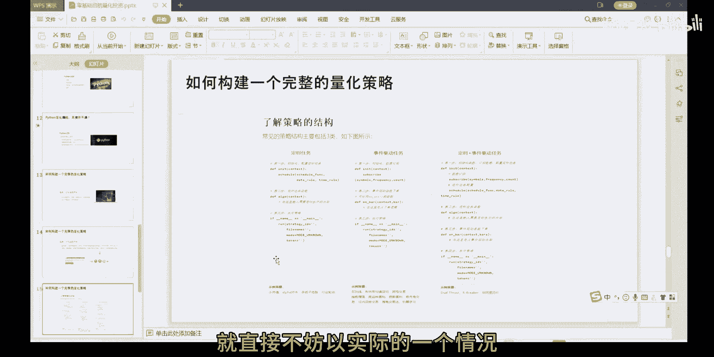

不妨以实际的一个情况跟大家展示吧，我们先打开这个9300啊。

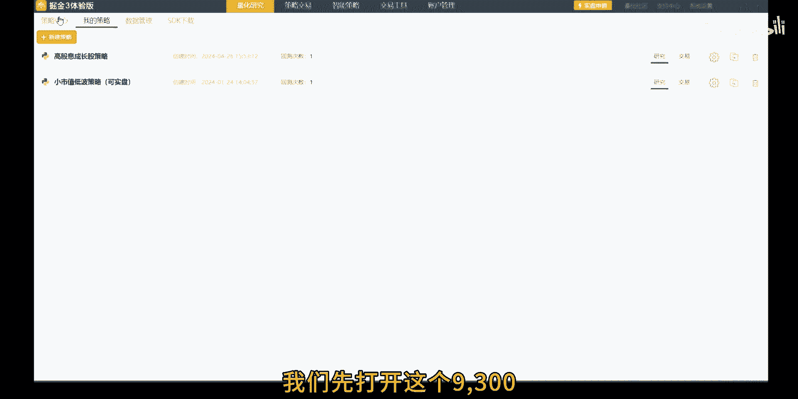

终端这边啊，比如说我们先设这个啊事件驱动。

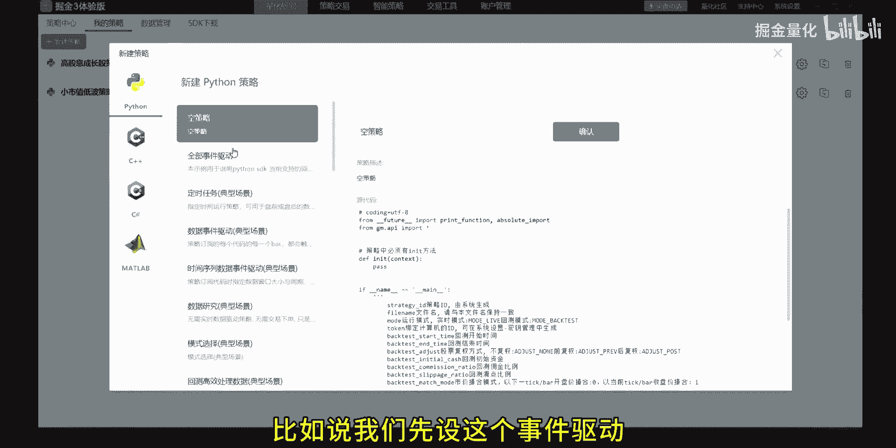

这边跟大家演示一下。

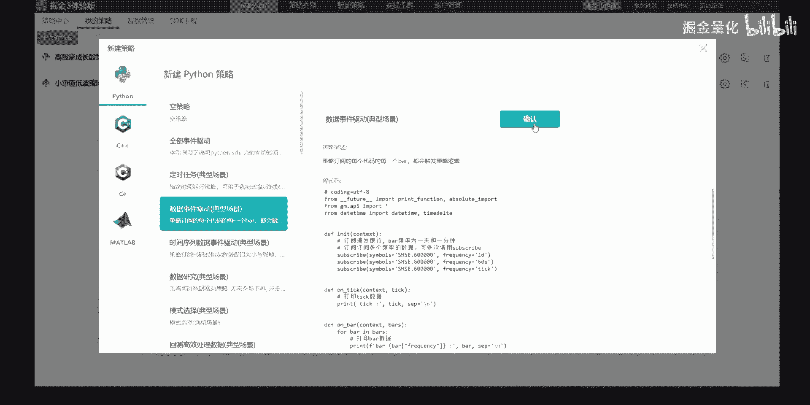

你可以看到点击新建的一个数据，事件驱动的一个策略啊，点进来之后你可以看下这个就是整个的啊，这个代码整个策略它的一个代码了啊，从最先刚开始的这个这部分可以先改，从上面啊就是一个导入第三方库啊。

前面三行应该是固定的，后面呢你可以导入你自己想要的，所需要的一些好第三方库，然后呢就是一个初始化，初在初始化这方块呢，你可以自己啊，初始化你一些你策略的一些参数啊，比如说你要买卖多少只股票啊。

每只股票要多少成仓位啊，那你比如说你的交易的指标有哪一些，那个指标有哪些参数都可以在初始化这边去啊，先去进行设置好，然后这两个就是一个行情事件了啊，你说第一个啊就是一个pig或者行情事件啊。

tick的话一般就是额交易所这边所默认的啊，level one等级的一个最高频的一个数据啊，tick在股票里的话，tick是每三秒一个tick啊，里面就包就包括啊高开低收等等一些数据啊，如果是期货的话。

他就是呃一秒是两个tick，它的频率会高很多，那在我们觉金镇这边这个品牌里面的话，你去做额订阅，这是股票的一个tick数据啊，这个操作是非常简简便的，只要通过这个subscriber这个函数啊。

比如说像我们这个视力这样子啊，指定你所需要所要订阅的股票的标的，发了个代码，然后然后按了一个订阅的一个频率有多少啊，比如说里边要要一个tick级的啊，是60秒的哦，是一天的，那你都可以在这边罗列出来啊。

那除了行情这个事件之外啊。

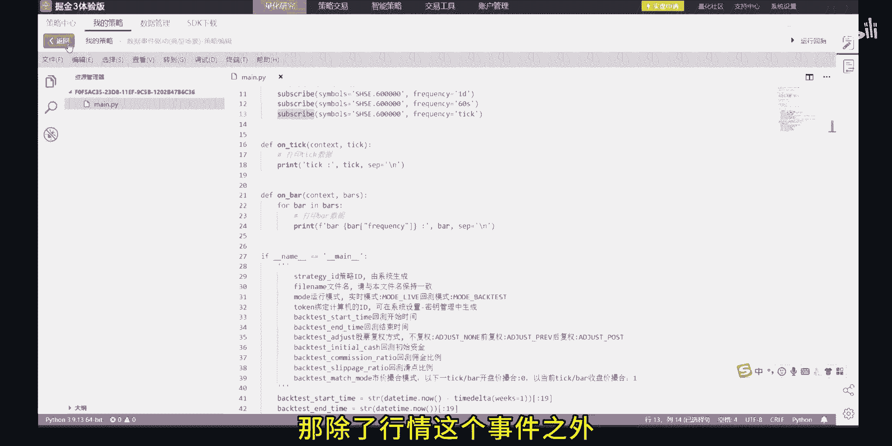

啊还有一些比较重要的啊一些事件，比如说你你下单了之后。

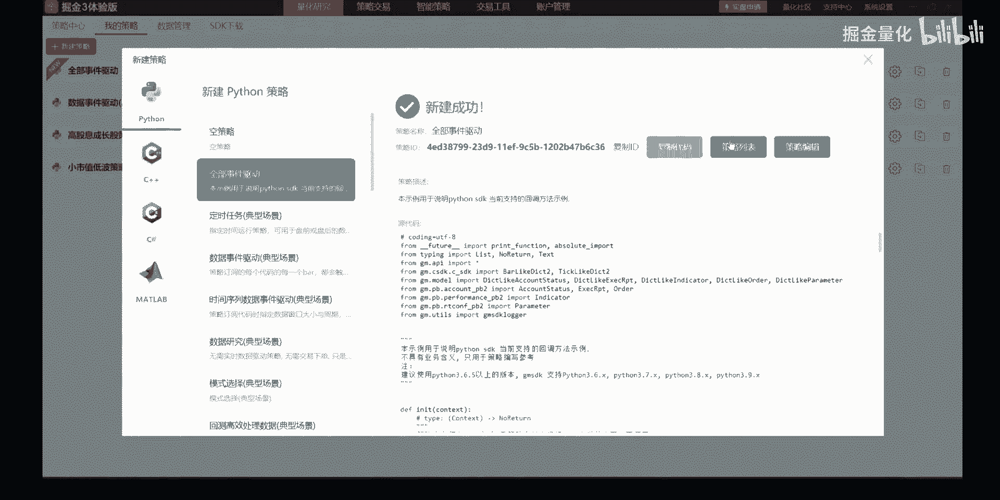

那你这个下单这个委托从你策略这边，从你的电脑端这边发送出去啊，到券商的柜台，再到交易所啊，交易所再返还还回来这一整个链路啊，其实他你一笔委托他的个状态是不一样的，啊比如说你这种状委托的状态啊。

从刚开始代报好，再发出去，拉出去者在券商，在交易所那边啊，是已成的还是带撮合的，或者是只成交了一部分的啊，他的状态都不一样，那你去汇编的话，你就可以啊在这一个啊委托状态变更这个事件。

on order stdude这个函数里面的啊，啊去做一个啊，针对他的这个委托状态的变更事件，进行一个逻辑上的一个设置啊，比如说如果如果你有可能啊这笔委托交易之后，你需要更新你的交易数据。

那你就可以在这个啊在这个事件里面去更新，你这个啊交易的一些参数，当然了还有一些情况，比如说动态参数啊，或者是呃交易账户状态的变更时间啊，或者是回撤结束这个事件啊等等。

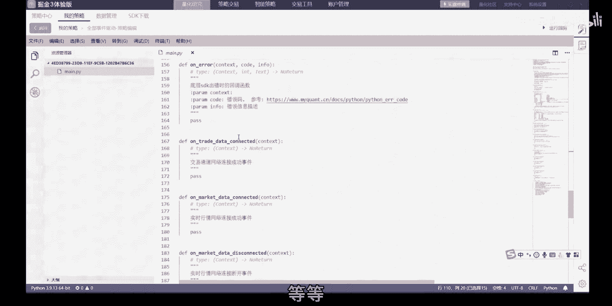

啊那除了额事件驱动任务啊，还有另外一个比较重要的啊，就是定时任务啊，定时任务这个就比较好理解了啊，比如说可能大家没你的股票策略里面，你可能就需要在每天一个盘前了，就去选股这样的操作。

那选股的话一般是在盘前进行操作完的，那你就可以设自制一个定时任务，比如说我在每天的09：15分啊，就开始啊选股了，那我在09：30之后，就可以根据我这股票池的内容啊，那个标的词进行几个啊。

行情的实时的去监控了啊，当然了，你也可以在盘后设置一个定时任务啊，去更新去处理，去计算你今天的一些交易，交易的情况也是可以的啊。

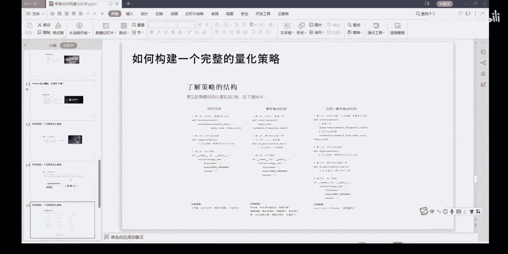

当然了你也可以，我们往往一般都是定时任务跟事件驱动任务啊，这些是啊混合着用啊。

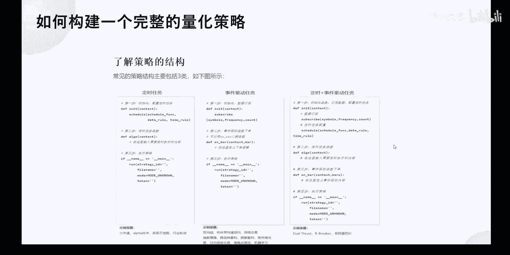

这种用的会更多一点。

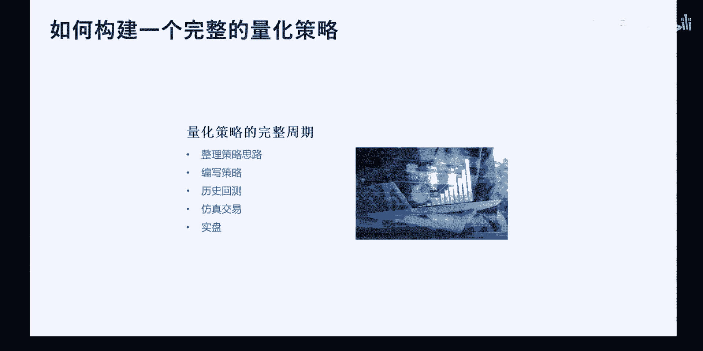

那在了解了怎么去整个一个策略的框架之后啊，你就可以开始逐步的去将你的那个核心的一，些思想去落实到代码层面了啊。

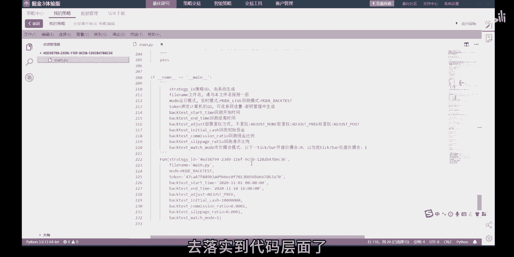

那我们整一整个策略的一个开发，它可能会经过的啊及这样子一个几个周期啊。

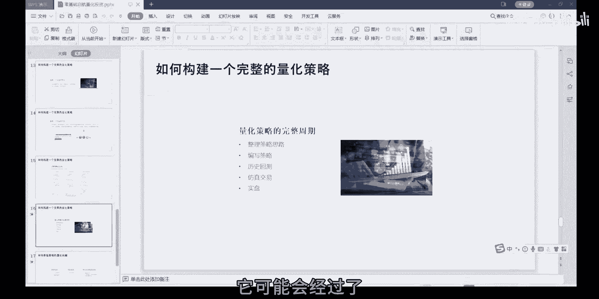

几个环节啊，比如说你要先整理好你自己的一个策略的思路，好像我们在帮助客户进行策略的开发的时候，刚开始的一个讨论一般会持续了好几次啊，因为客户一般都是，你需要将他的一个交易逻辑说出来啊。

一般说出来这个过程啊啊就很重要了，比如说你要怎么判断一只股票是上涨的，好趋势向上的，怎么去定义这个趋势向上啊这一个东西，那我们就需要啊帮助协助这些客户啊，讲你这个定义啊，落实到文字上啊。

或者是落实到数字上啊，然后呢那你的策略思路整理好了之后，相当于你就有一个伪代码啊，你那你就可以根据你这个策略思路啊，去编写策略了，编写好策略之后啊，就可以开始进行历史回测，历史回测之后就可以。

一般也可以做做仿真交易，不然后再进步到实盘啊，当然了这些环节啊，也有可能你可能只进行到前面几个环节啊，所以一个策略你可能会发现好回撤是一道坎啊，仿真又是一道坎，仿真之后呢，再到十盘还是一道坎哈。

就是回测数据很好看啊，仿真的时候诶数据就很拉了，他可能仿真的时候数据还好诶，到时判断又惨不忍睹了，那所以呢他在这一整个周期啊，可能可能就不能完全的去经历完，当然了，我们可能是希望每个策略都能进行到。

