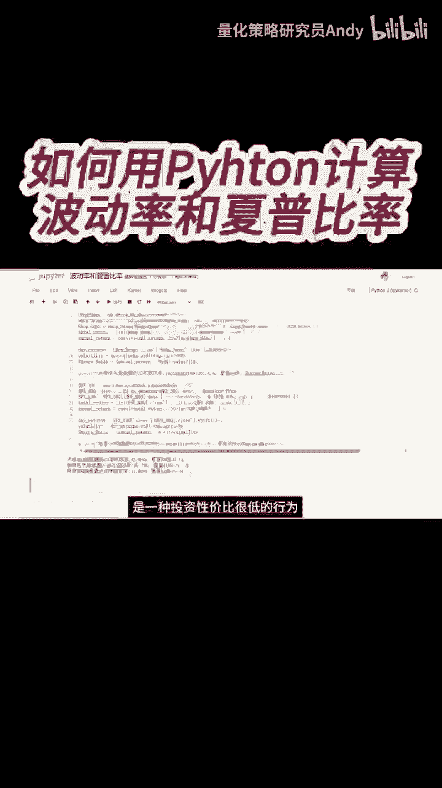
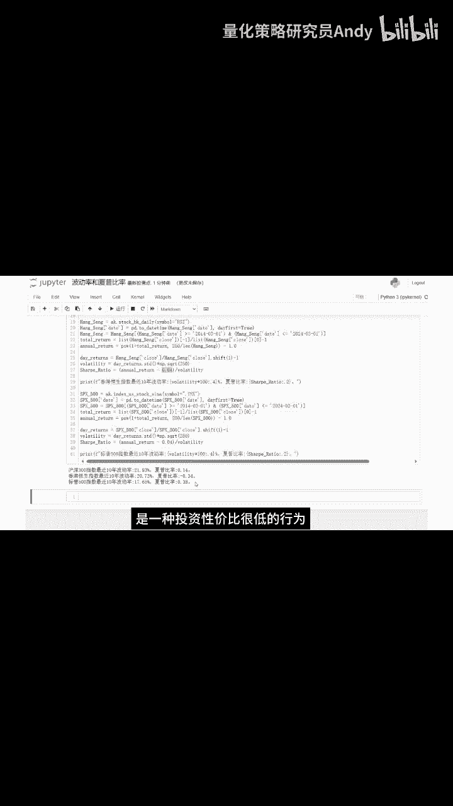

# 如何用Python计算波动率和夏普比率 - P1：短视频9 - 量化策略研究员Andy - BV1rK421v7cF

最后我们来看一下，计算波动率和夏普比率的代码，上面这一块代码是我们刚才计算年化收益率的，我在下面再加入三行代码，分别计算日收益率，波动率和夏普比率，这里的无风险利率取值，沪深300取值为0。02。

我们直接运行一下代码，可以看到最近10年沪深300指数，分别为0。14，负的0。34和0。38，全部都小于一，从这组数据我们可以得出一个结论。

