# 如何用python得到币安均线数据，ma和ema - P1 - X蓝田Chef - BV1WKpme9Eu9

大家好，这期视频给大家讲解一下，如何用Python得到我们B安的均线数据，主要是ma和EMA，首先我们所以我们看到ma数据，ma是moving average，就是我们的均线。

它主要就是用来监测价格变化趋势的，当作为趋势判断的时候。

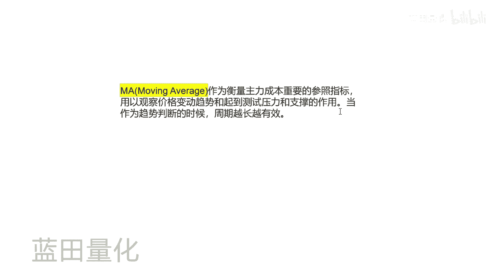

周期越长越有效，然后我们看来看下它的计算方法，就是用最近N根K线的收盘价之和，除以N根K线，所以他的计算计算是很简单，然后我们看来看下代码。

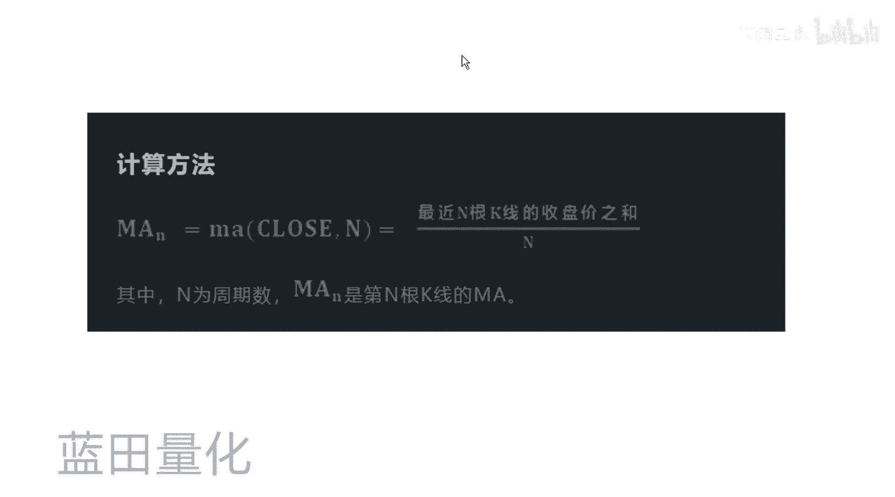

好好这个就是我们的代码，它主要就是先获取比特币五，我们周期选择5分钟的周期，然后我们比如我们要获获得，最近十根K线的数据，然后我们就这里这里填十，然后我们得到我们选取最近15根K线。

然后我们输出一下这个指令。

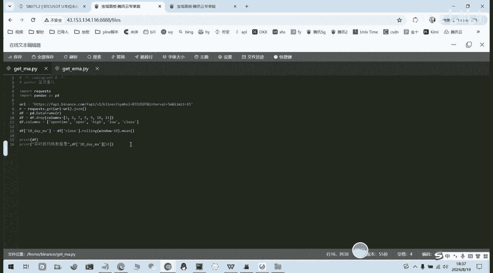

然后我们输入指令，就可以看到我们最近5分钟周期的，10日均线的数据，然后最新的是58042，之前的是5804058089，我们去看一下这部电，好好我们来到B安这个B安的。

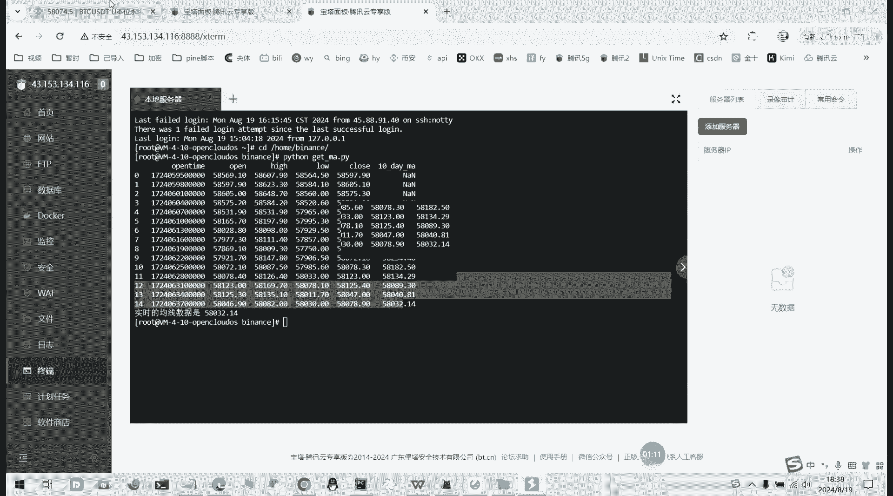

然后最新的是58058032左右，5803232左右，它变了，然后上一根是58040，这一根58040，再上一个58089，58089行，这这个就是我们获取BI均线的代码。

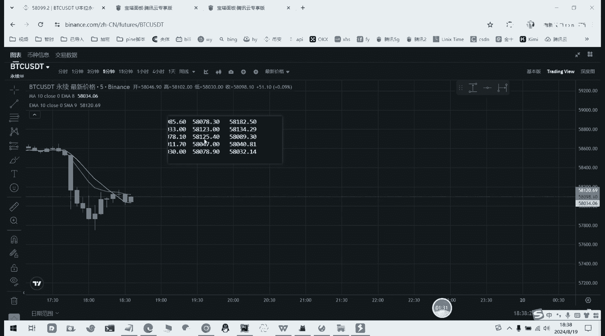

10日均线，10日就是5分钟周期的10日均线代码。

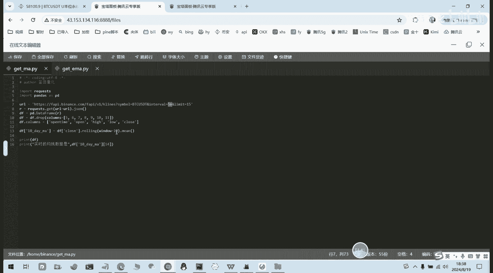

好接下来我们看看EMA均线如何如何得到，EMA均线，就是对N根K线的收盘价进行加权算数，平均后得到的数值，也就是说，约到后面他的收盘价的权重就会就会更大。

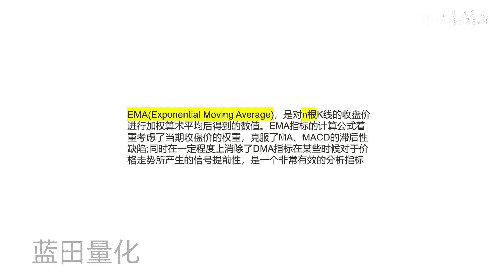

然后我们看一下它的计算方法。

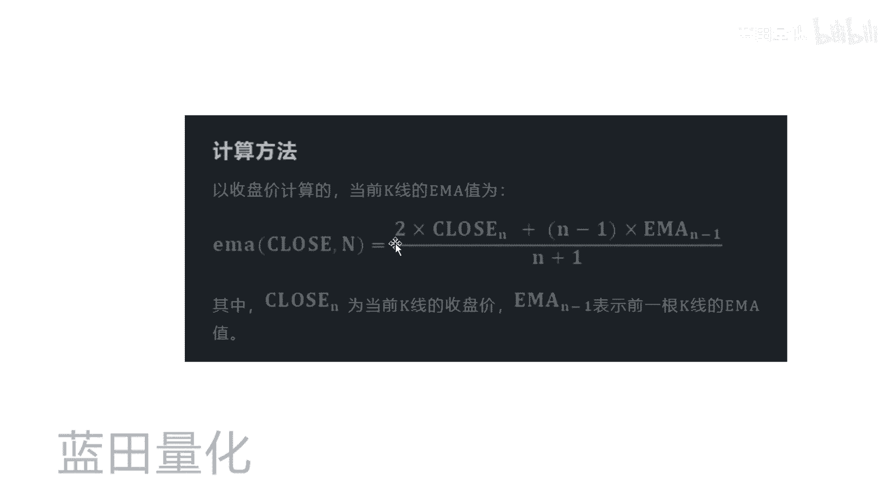

这种方法的话就是这个公式，嗯接下来我们看到代码部分，代码部分的话，照样我们选取5分钟，然后我们得获取一下1010日均线的数值，10日均线的话，我们直接用这个EWM函数，它是pandas值提供的一个函数。

就不用我们自己去用公式来计算。

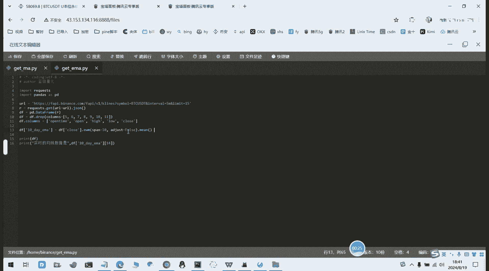

然后我们运行一下，啊然后这个就是我们EMA的数据，然后最新的是58113，我们看一下与与光。

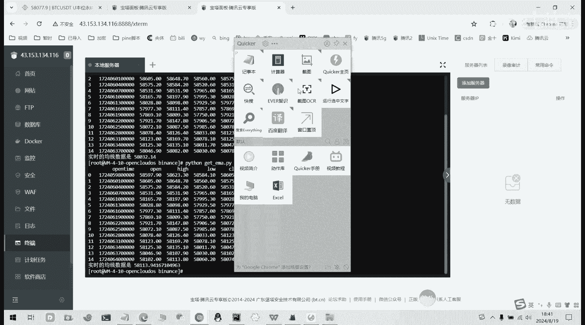

对不对，EMA嘛，最新的是58113，他这里变化了一点变化了，然后上一根是58122，58121哦，他他这里的话，你看他这里与官方的可能会有点对不上。

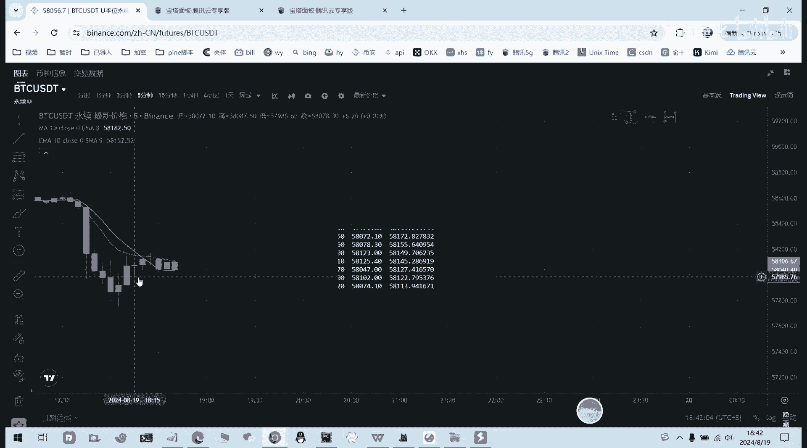

对不上，是什么原因呢，因为啧我们获取的K线，它的数据它太少了，因为他他要他是进行加权的，就是你或你的获取的数量比较少，它加权的话就不够，然后我们比如我们就获取多一点，获取100个100根的话。

然后我们这里填，我们就最近一个的话就要地球100个好，我们再回再运行一下。

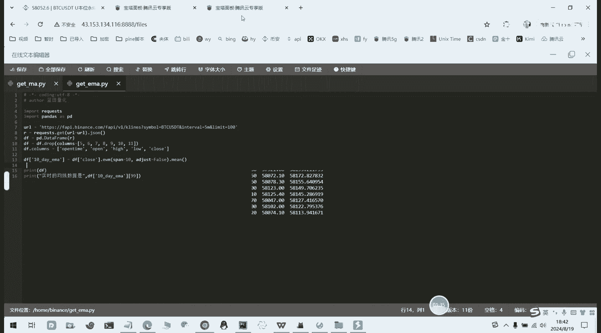

啊这就是我继续，然后我们再去看一下10日EMA的数据，最新的是58109，然后前面是5812158125，我们看一下。

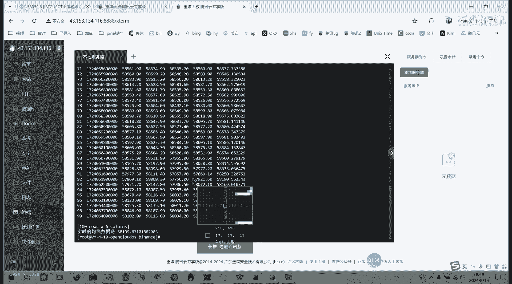

对不对，嗯5810109，他在变变化的，所以我们前面一个5812158121对的，然后5812558125也是对的，所以有。

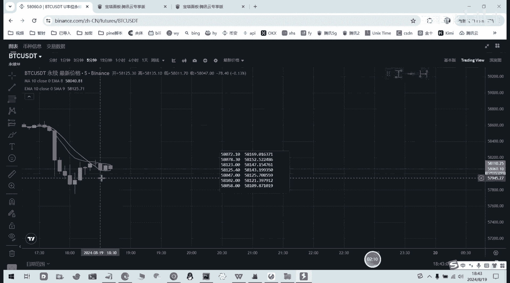

所以我们这个就是EMA均线的，或获取EMA均线的，获取好，今天的视频就到这里。

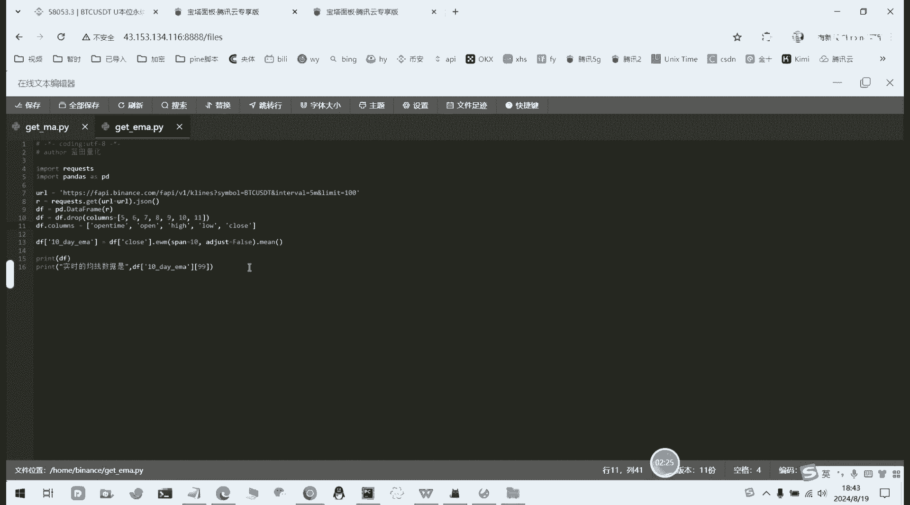