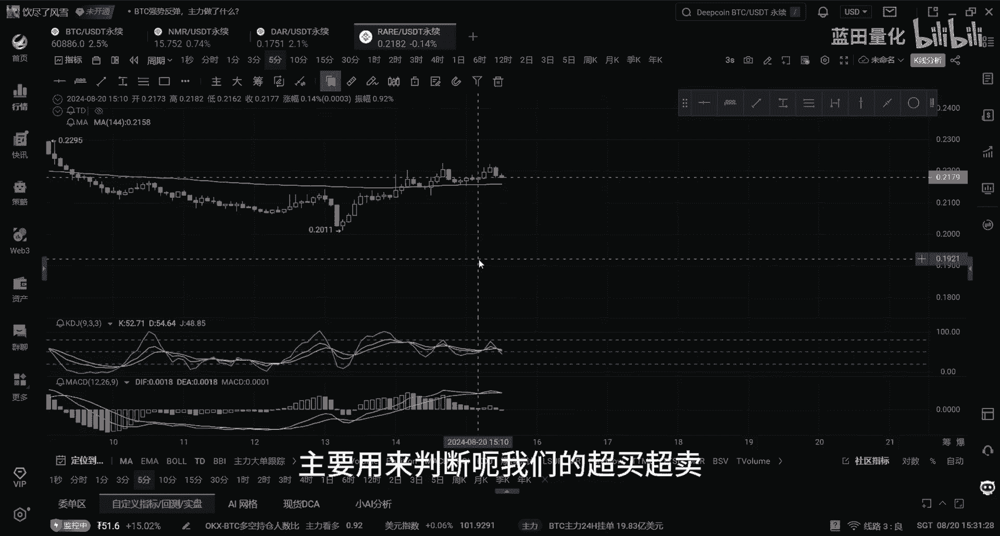
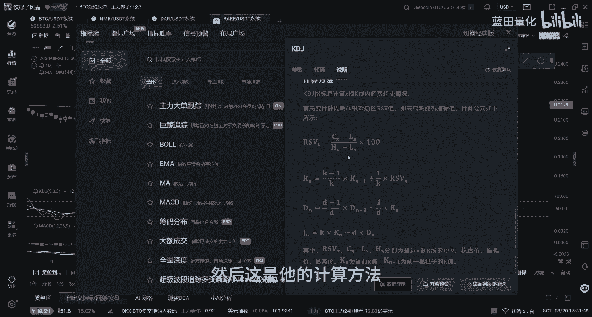
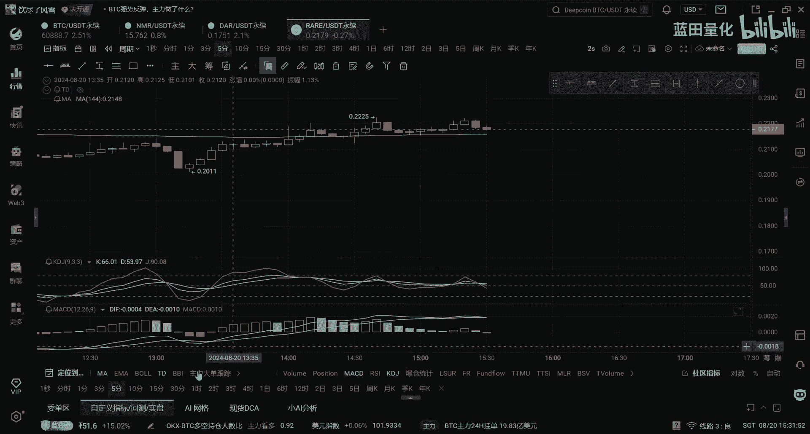
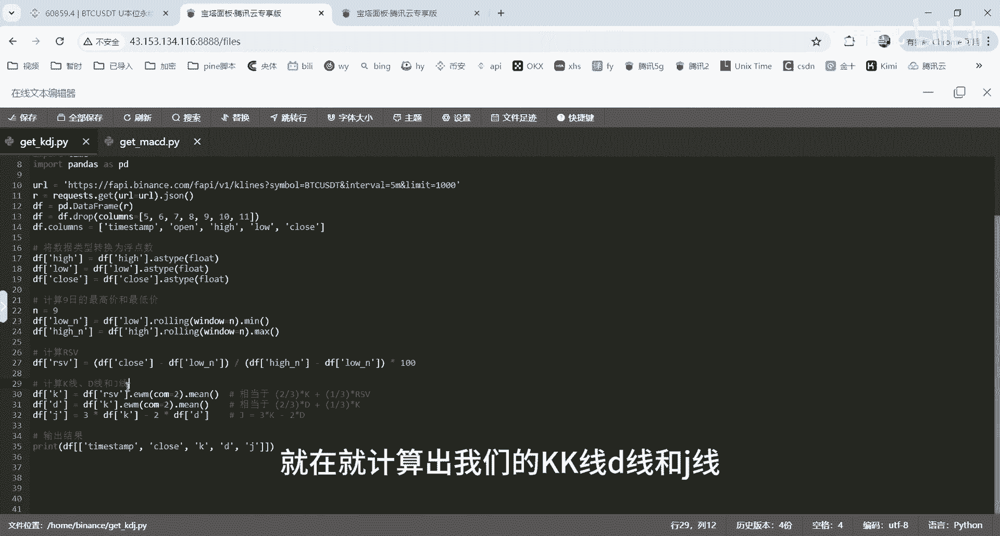
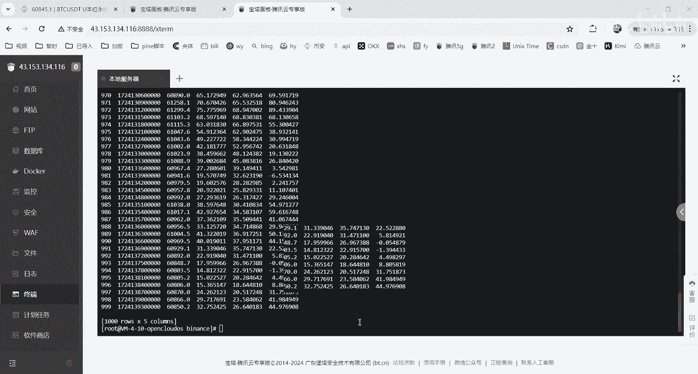
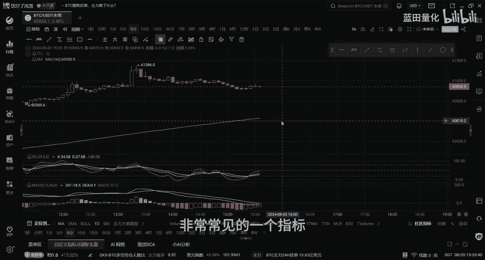
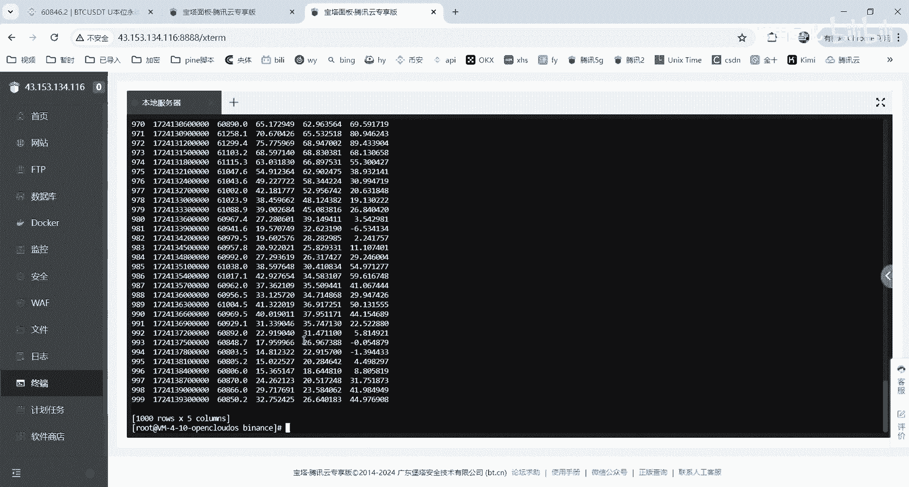
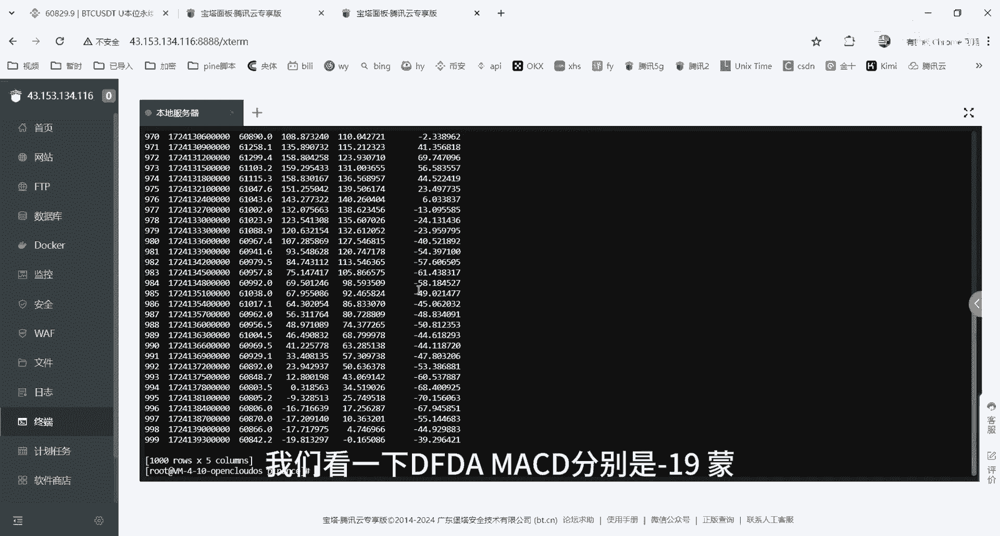

# 如何用python获取kdj和macd指标的数值 - P1 - X蓝田Chef - BV1QoWpeiEn7

Hello，大家好，这期视频给大家录制一下，如何获得我们这个KDJ指标以及MACD指标的数值，首先我们看到KDJ指标，KDJ指标是也是比较常用的一个指标，主要用来判断还我们的超买超卖。

我们看一下他的一些用法，它是用于市场中短期趋势的分析嗯，然后这是他的计算方法。

让我们看看下它的计算代码。

KDJ指标它的获取代码就是就是就是这这这些，首先我们计算出9日的最高价和最低价，然后我们，计算出ISV，最后再就计算出我们的KK线D线和界线。

然后我们运行一下，看一下，好这个就是我们的结果kt，然后最新的是322644。

这是我们322644对，然后前面是292341，这个这个的话就这个就是我们KDJ指标的计算，那接下来我们就还我们MACD啊，MACD也是我们交易中的一非常常见的一个指标。

让我们看看它是怎么计算的。

MACD的话，首先我们先计算出短期的和长期的EMA啊，然后我们在计算出DIF线，然后再计算出DEA线，最后计算出MAACD数线。

然后我们看运行下这个代码，啊这是我们SD指标，我们看下DFDEAMACD，分别是负149门。

他这个的话负负负前一根是17负十七，然后4。74104再切一个-17。2，然后这个计算的是没有问题的。

然后这就是我们MACD指标的计算。

