# 如何用python获取rsi指标的数值，以及指标库ta的使用 - P1 - X蓝田Chef - BV12xWpeoEV4

哈喽大家好，这期视频给大家录制一下，我这个RSI指标的的代码呀，首先我们看ISI指标，一是我们做交易中非常常用的一个指标，一般大于80的话就是超满，小于20的话就是操麦，让我们看一下ISI指标的说明。

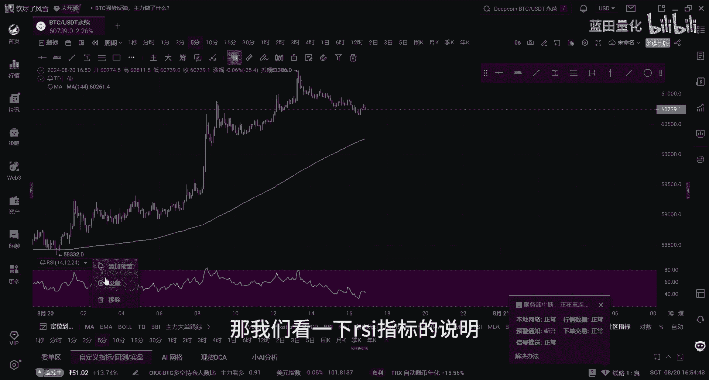

它是通过一段时期的收盘涨幅，和总波动幅度之间的比值，来分析资产买卖意向和实力，嗯就就就是一个衡量多空双方的力道，然后他的计算方法的话也是很简单。

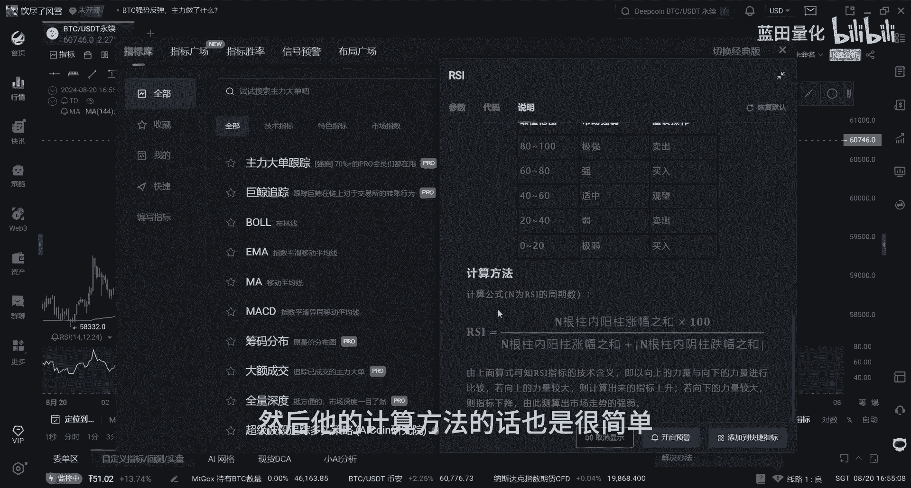

让我们看一下它的代码，怎么用Python来获取这个SI指标的数值。

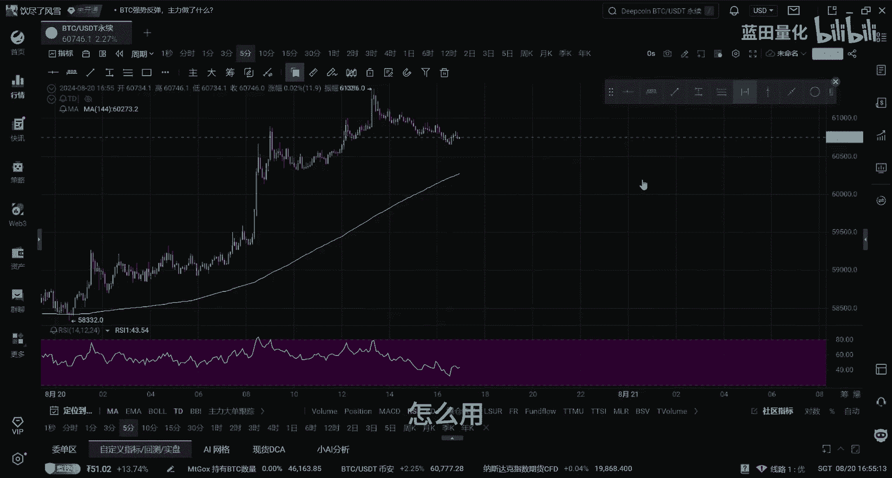

好这个就是我们的代码，首先我们先得到我们的收盘价的收盘价，收盘价，然后把收盘价转化为浮点数，然后我们再计算出收盘价的叉子，然后，最后我们在这个就是ISI指标的计算计算公式。

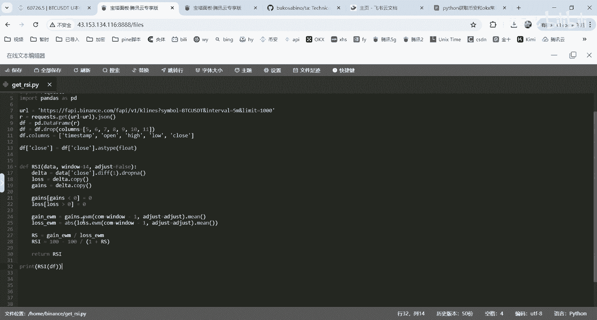

让我们运行一下，好我们看下最新的数据。

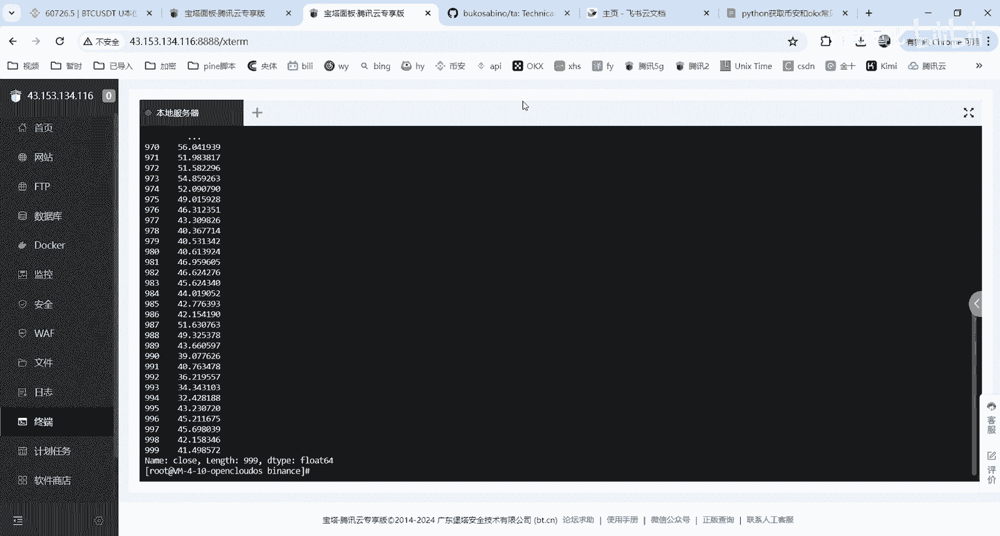

最新的是41。6，然后前一根40，42。16，再减一个45。7，然后他在与我们交易所的数值是对得上的，所以这就是我们IISI指标的计算。

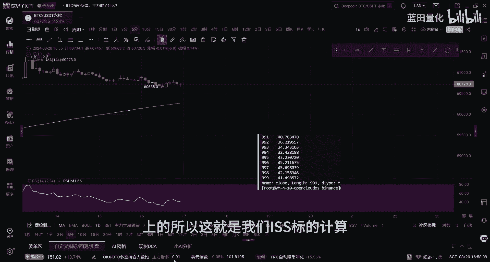

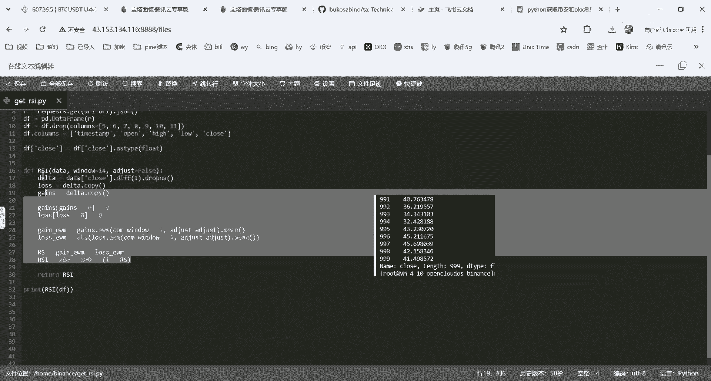

然后在这里给大家推荐一个量化交易的，量化交易的库啊，ta库它是一个指标，我们经常用在我们量化交易中，然后他这里有很多指标的方法，他都他都提供了，比如我们刚才的ISS表，这个ISI指标。

然后我们看一下它的，的是怎么了怎么写的，他这里直接就只需要调用一下这个方法，就能获得我们的ISI指标给我们，然后我们就用一下这个这个指标库，来获取一下我们的RSI指标。

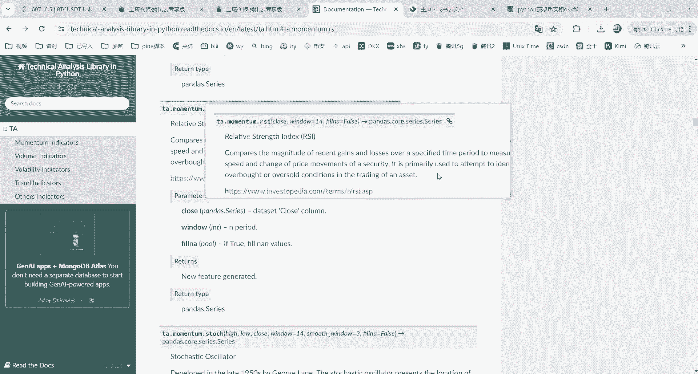

啊这个就是我们用我们的ta，ta这个库来获取我们ISS点，让我们运行一下。

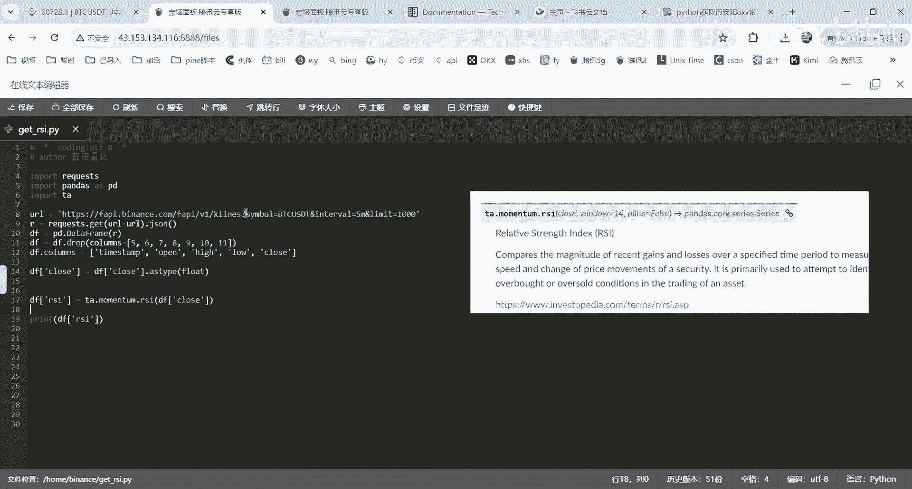

嗯他的输出，这是它输出的结果。

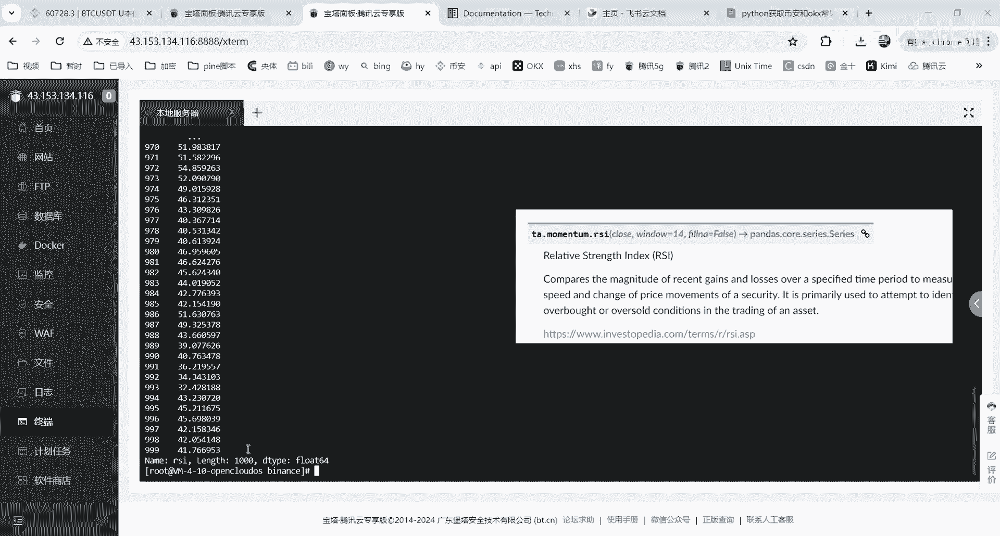

最新的41左右减一根42。05，再接一根42。1，42。1516，45。69，对，这这他的结果跟我们之前的那个结果是一样的。

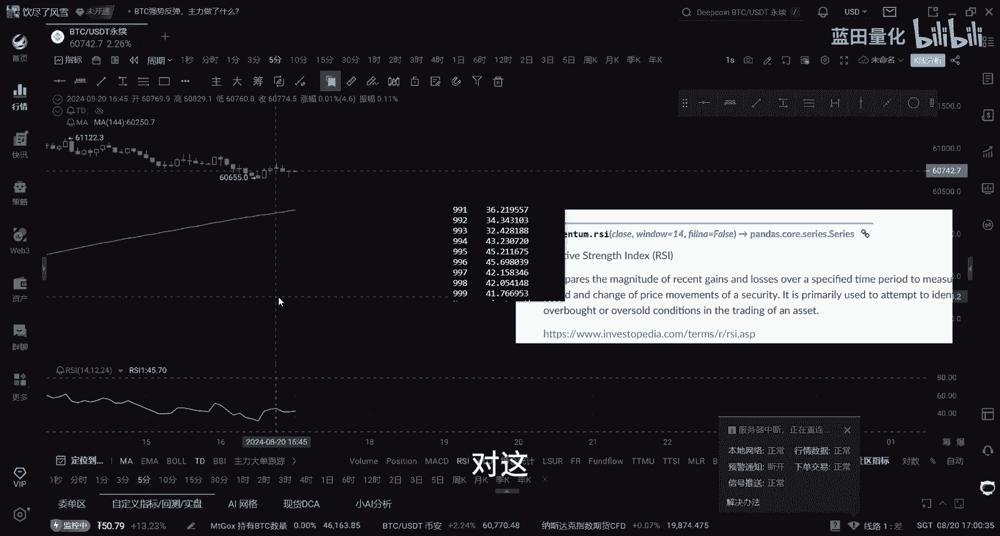

所有我们可以使用这个ta库来更简便的获取，我们的这个一些交易指标，这个库怎么安装呢。

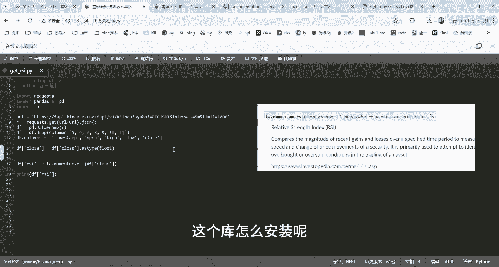

他这里这里有介绍，Python的话是用这个判断指令，在终端输入这个就能安装嗯，关于这些。

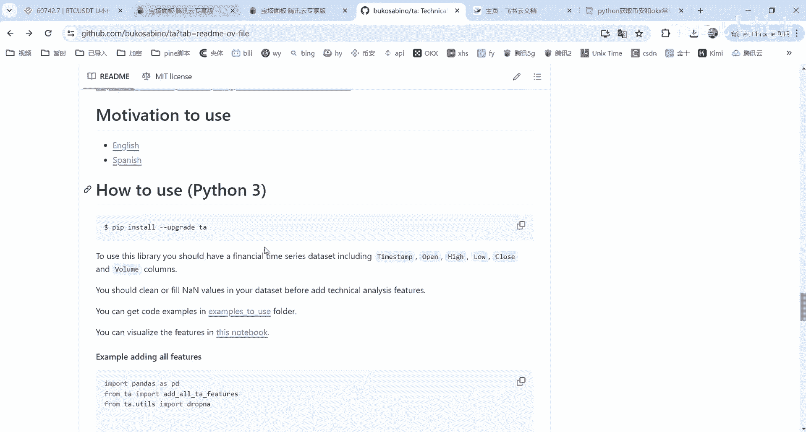

然后我把这些指标的代码给整理了一遍。

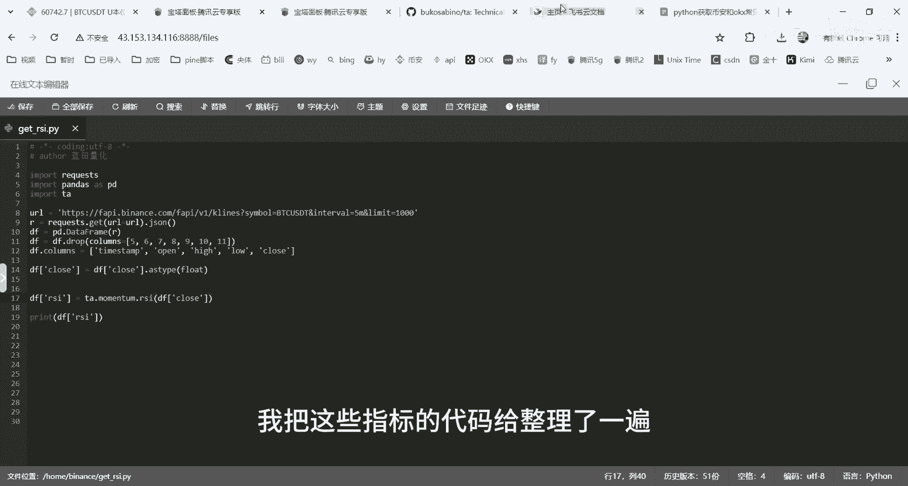

有有有B安交易所以及OE交易所的，然后有需要的小伙伴可以视频一键三连后，主页主页联联系我。

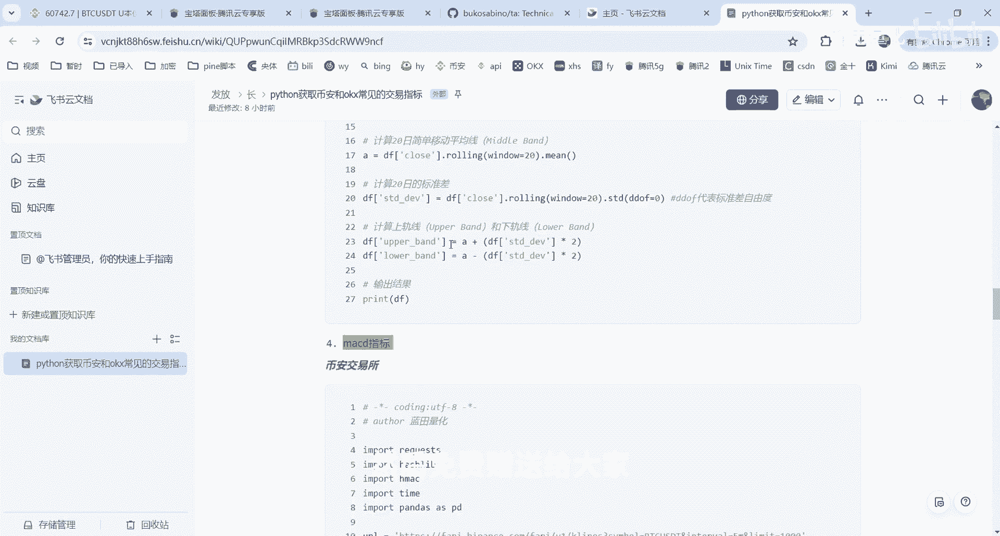