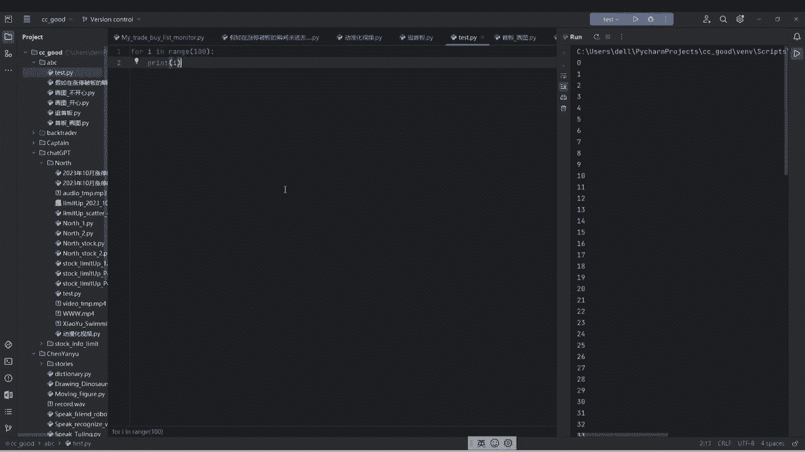
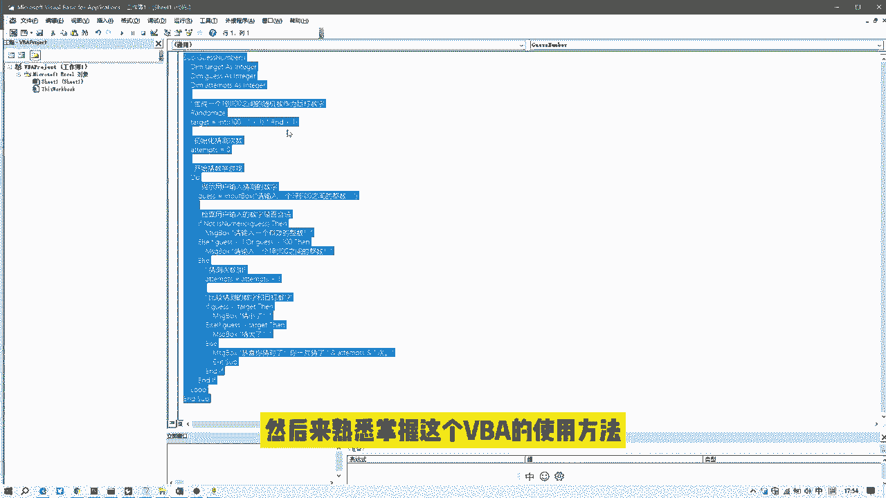

# 如何获取数据？如何学习python？#python #pycharm #量化交易 #股票 #干货分享 - P1 - 无限超人Infinitman - BV1Gj4ueMEmJ

如何获取股票交易数据，如何学习量化工具Python，最近不少朋友询问过这方面的问题，这里统一回复一下我之前的三个视频，分别介绍了做什么数据，哪儿来代码怎么写的，大家可以看一下。

这里我汇总了这几天大家的需求分三类，第一是为了更好的做股票，需要分析相关数据，第二纯粹就是为了学习数据分析，数据处理技巧，第三类是本身精通计算机语言，想了解如何依靠自己在语言上的优势，建立交易策略。

先说第一类需求，为了更好的做股票，需要分析相关数据的，我的建议是工具无所谓，会什么用什么能解决问题就行，数据可以直接从看盘软件下载，全程不需要写代码，我以通达信举例哈，打开软件后。

在选项菜单下点击盘后数据下载，按照提示下载所需要的数据类型和日期，完成后再选择数据导出，高级导出，按照提示将数据导入到本地，一般的数据分析需求都可以在excel完成，就是速度上稍微慢一些。

这里要解释一下为什么谈到量化的时候，总是提起Python有两个原因啊。

一几乎所有的数据供方给的API接口，都接受Python的程序调用，第二是几乎所有的回测平台，首选支持的是Python语言，第二类需求纯粹为了学习数据分析处理技巧，我自己是学统计的。

语言是C工作经历是数据分析师，我的理解啊，有这类需求的朋友，如果你有一点编程基础，在学习其他的语言入门都很简单，但是如果说没有语言基础，我的建议是工作中啥用的多就钻研啥。

以微软的office为例行，大体上就是一个数据名，首先是数据来源，这里涉及到数据库，Sql server，SQL语言，数据清洗，涉及到excel，如果说数据量超大超过100万行，可能需要用到VBA。

Power pilot，Power query，Power map，数据的分析与展现需要用到power bi，以及对应的DEX语言，核心就是把工作中流程化，周期化的数据处理需求尽量自动化，减少重复劳动。

这里以excel为例来看一下VBA的一个使用，这段代码是我让ChatGPT，帮我随机写的一个小游戏，要求是在1~100之间随机生成数字，这个数字让我来猜，如果我猜错了，它会提示我是猜大了还是猜小了。

如果猜对了，它提示我我总共猜了多少次，就是这么一个小功能，我们来看一下，首先点击宏，然后把这个程序执行一下，它会跳出一个对话框，让我输入一个数字，那我猜50，猜50，太大了，那就25，太小了。

25~50之间，我猜一个35才太大，35~25之间才30，太小了，30~35之间才32，还猜小了，那就33，剩下一个就34了，恭喜你，猜对了，一共七次，他就这么一个小功能。

我举这个例子的目的哈是介绍一种学习方法，就是我们可以通过拆解一些小的程序，来熟练掌握这个VBA的使用方法。

第三类需求就是本身精通计算机语言，想了解如何依靠自己的语言优势建立交易策略，这里哈我的看法，策略它来源于我们的市场认知和交易认知，特别是交易认知手段，可以提升提高加速检验认知，但不能代替认知。

成熟可用的策略通常是在经验积累的基础上，经历过很多次迭代形成的。

