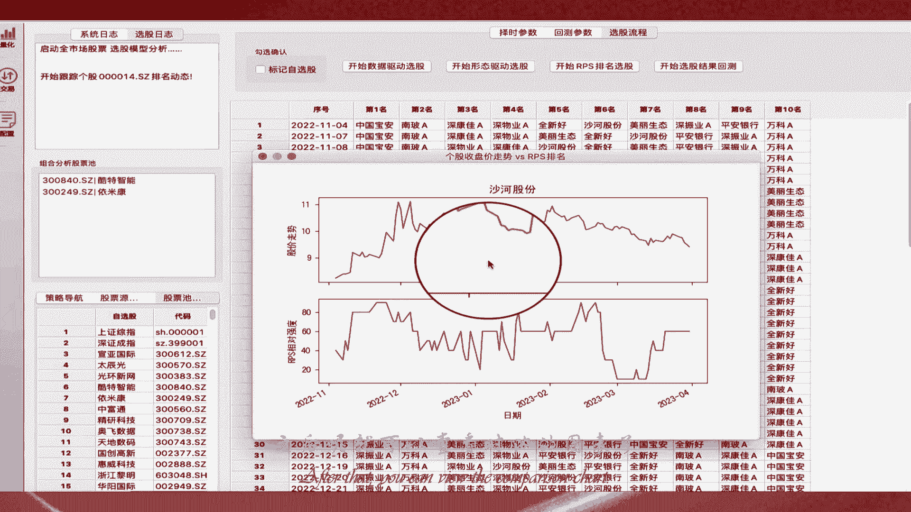

# 如何通过python编写股票量化自动化交易程序主要操作界面 如何通过python编写股票量化自动化交易程序主要操作界面#股票知识 #股票交易 #股票干货 #量化 - P1 - 数透社A谷 - BV1Lst2enEV3

我们新疆好牛啊，祝代代的好牧场，那么当需要返回的时候呢，点击上方菜单的主菜单，选择返回，这样呢就切回到了登录页面，在主界面中的左侧，我们看到有一个工具栏，里面有量化交易和配置三个按钮控件。

当前的主界面呢是量化界面，那么比如我们点击配置控件，那么就会进入配置界面，配置界面呢，主要用于设置工具的一些通用的参数，比如行情显示图的大小，编剧之类的，配置美丽的田园。

那么我们点击交易空间就会进入到交易的界面，交易界面提供的是实盘方面的功能，美丽的嗯，这部分内容比较多，我们会有单独的主题去具体的介绍，好，接下来我们啊逐一介绍一下，量化页面上控件对应的功能。

关于离线数据下载，那他是把最新的个股行情数据下载到本地，包括了开始下载，刷新文件，补全下载，停止下载四个选项，下载的时候呢，我们可以选择啊，只更新更新全市场全部个股的数据，也可以选择只更新自选股票池。

或者是某个赶快的数据，缩短下载数据的时间，♪ 每天经地一草 ♪，♪ 葡萄瓜果甜又甜美 ♪，♪ 天金银遍地 ♪，股票池的管理，这里导入我的股票池，是从本地导入自选股票啊，到KTX中导出我的股票池。

会把QT5X自选股票池的股票代码和名称，与CSV文件格式并存到本地，这样做可以来回切换多份自选股票池，也可以和其他的系统建立自选股票的联系，我们可爱的系统日志呢，是显示系统级别的运行状态。

选股日志呢显示选股环节中的运行情况，组合分析，股票池是把需要对比的股票添加到这个池中，进行对比分析，目前呢我们是开放了收益率波动率的对比分析，♪ 弹起你的冬不拉耶 ♪，♪ 跳起舞来 ♪，唱起歌。

走势叠加分析，♪ 这两个各族人民大团结 ♪，我们看策略导航，这里呢包括了各种择时的策略，团结经典策略中的N日突破，AATR止盈止损和布林带突破策略，这些呢是针对回测模块去设计的，比如我们选中策略后。

我们点击回车参数，点击开始回撤，填写回测和参数，我们可然后对择时策略呢进行回测分析，♪ 我们美丽的 ♪，那我们看到啊，除了对000876这只股票的图表显示之外，我们还可以看到有交易日志。

衍生指标呢比如像均线交叉跳空缺口，黄金分割，以及像啊K线形态，那么用于在黄金走势图上标注折时信号，比如我们点击实时参数，这里输入股票代码，然后选中某一个策略，然后我们填写行情走势参数，戈壁沙滩变良田。

积雪融化着浓妆，这样呢，就可以在行情界面上看到相应的折时信号了，另外像均线交叉，还支持批量涨的资本股票个股，这里选择自选股票池，美丽的好可爱，那么开始扫描之后，我们会对符合金仓死仓时叠加滑点。

进入到交易股票池，准备下一个交易日持盘的监测去买入卖出，另外我们看还有多子图显示功能，可以同时显示两幅行情走势进行对比分析，麦穗金黄，♪ 稻花香啊 ♪，♪ 风吹草低 ♪，♪ 见牛飘呀飘呀 ♪。

♪ 我要葡萄瓜 ♪，♪ 果甜又甜 ♪，♪ 野美贴金银变 ♪，那这里可以是啊动态图图标显示，也可以是静态图标显示，♪ 天田又田园 ♪，♪ 每天金银遍地 ♪，♪ 藏地藏 ♪，这里有一个高级功能。

我们看除了是有添加自选股票池，加入组合分析池，导入离线数据啊，这些管理类的啊，指指令之外，还包括了查看个股现金流量，查看个股的行情走势，查看个股F10资料，K线自动播放等等啊。

那选股流程呢是最重要的功能，因为选股选的好呢，赚钱效率就会很高啊，通过数据驱动选股形态驱动选股，RPS排名，选股这三种模式去选出优质股票的，数据驱动选股呢，支持通过各种指标，大北向资金团结每日涨停数据。

季度的基金持仓，也可以通过导入自定义特色的离线数据，进行选股，那我们还可以通过举证数图形式去显示行业，板块所属个体的涨跌幅排行，对比的家啊啊乡乡，♪ 我们美丽的田园 ♪，刷新了数据之后呢。

就可以通过条件表达式去进行股票的过滤，♪ 我们新疆好地方啊 ♪，天山南北好牧场牧牧场戈壁沙滩变良田，积雪融化着浓妆，形态驱动选股，支持双底形态，选股又是箱体形态，突破选股均线多头排列。

选股及单针探底回升选股，选股日期选择过往的日期的话，可以进入到回撤模式，多选叠加分析数据，选项呢可以在形态选股产生的结果基础上面，叠加测试数据，进行多维度的综合分析，比如添加像季度利润报表。

也向资金持股，每日基本面指标等等的股票池选项中呢，除了包含自选股票池，全市场股票之外，还可以聚焦概念板块池和行业板块池，这样就可以针对性的去聚焦自己，专注的板块的个股，同时选股也会变得非常的快速。

另外不同的形态选股算法里面呢，还开放了专用的参数配置界面，然后点击开始选股结果回撤，还可以对形态选股功能选出来的股票结果，进行回测评估，♪ 葡萄瓜果甜又甜野 ♪，♪ 每天金银遍地藏 ♪。

♪ 擦不到瓜果甜 ♪，又选股环节中还支持全市场的叉P排名，选股一擦，在使用前要先更新全市场个股的行情数据，那么我们刚才点点击了开始RPS排名选图之后，可以看到RPS相关参数的配置界面。

同时呢我们也开放了IPS专用配置的界面，目前提供了观测排名范围，这个学校用于尽早发现那些蠢蠢欲动的强势股，♪ 我们没美丽的田园 ♪，我们可爱，生成RTS分析结果后，我们通过数据驱动方式导入到FX中。

弹起你的冬不拉，跳起舞来唱起，那我们看这里有一个个股RPS跟踪的功能，这个功能呢支持个股股价和IPS的可视化对比，团结这样用于辅助分析强势股的介入时机，我刚才写了监测数和价参数之后。

就可以查看对比的图表了。

以上呢就在各个功能模块中，还有很多丰富的使用技巧，关于每个功能模块具体的讲解呢，可以移步至这个功能对应的使用攻略去查看，另外说明一点，由于GTX一直迭代更新，当前介绍对应的版本是02。6。2。

后续升级版本后呢，我们也会同步更新文档和视频的内容，好如果大家对这个系统感兴趣，可以关注我的微信公众号。

