# 妙用市场情绪找出大盘买卖点，逆向交易5年3倍 ｜ Python量化期权成交量，上证50ETF择时 ｜ 量化投资邢不行啊 - P1 - 量化投资邢不行啊 - BV1Pb421p7vH

有这么一个交易品种。

如影视般的游离于大众的视野之外，不熟悉他的人对他敬而远之，熟悉他的人对他又爱又憎，他时而是身披圣光的天使，让你一夜之间财富暴涨，12又会化身诱人疯狂的恶魔，让你一之间血本无归，我们似乎很了解他。

又似乎从未真正懂他，他就是本期视频的主角，投资者手中最锋利的双刃剑，七权，大家好。

我是专注于量化投资的，行不行，本期视频呢我们来聊聊期权，分享给大家一个常用的，观察市场情绪的期权指标，并会据此构建一个量化择时策略，这个策略原理简单，逻辑过硬，效果呢看上去也不错。

你可以加屏幕右下角或者置顶评论区，我的微信策略的代码和数据都是可以免费，可以直接发给你的，好言归正传，期权呢大家或多或少都听说过，比如某某某在腾讯啊，阿里啊，拿了多少多少的期权，但期权到底是什么。

估计很多人也是一知半解，所以我们首先给大家补充一点点，期权相关的知识，期权的英文名是option，背单词，背到abandon的，各位应该都知道，option有选择的意思，顾名思义。

期权本身就是给你的选择权，它赋予了持有者在未来的特定时间或之前，以预先约定的价格购买或出售某种资产的权利，因为他是权利啊，到期之后你可以选择执行这个权利，你也可以选择不执行。

比如说呢巴菲特收了我100块钱，并且和我做了一个约定，在2024年底的时候，按照70万美元一股的价格卖给我，100股伯克希尔哈撒韦的股票，那么到了2024年底，如果股价低于70万美元。

那我就可以直接不问他买，而是去市场上面直接买，说不定还能买到200美元一股的，那这个时候呢巴菲特持有的股票数量不变，就白白的赚走了我跟他约定好的100块钱，而如果股价超过了70万，比如说来到了80万。

那我还是可以选，则按照70万每股的价格问他买，此时股价涨再多都和他没有关系，他都必须以70万的价格乖乖的卖给我，我薅了股神的羊毛，这就构成了一个最简单的期权交易流程，那么在上述的交易中呢。

本质上我是买入了一个看涨期权，而巴菲特是卖了一个看涨期权给我，当然我也不一定只是看涨，我可能觉得未来会跌，那这个时候呢就可以买入看跌期权，所以买卖方的看涨和看跌。

就构成了期权交易的四个基本方向，然后啊可以考证的最早期的期权券交易呢，是来自于古希腊时期的数学家泰勒斯，当时他通过交易橄榄榨油机看涨期权而获利，而直到1973年，芝加哥期权交易所的成立。

则标志着现代期权市场的开端，我们大A的期权交易呢则起步较晚，一直到2015年2月9号，上证50ETF期权在上交所上市交易，才实现了场内期权零的突破，经过了几年的发展呢，现在大A的期权品种也开始丰富起来。

我们可以找到来上证五零的ETF期权，去看一看它到底长什么样，和股票是否有区别，比如这些分别是5月的上证50ETF，认购和认沽期权，这里的认购和认沽，就是我们常说的看涨和看跌的意思。

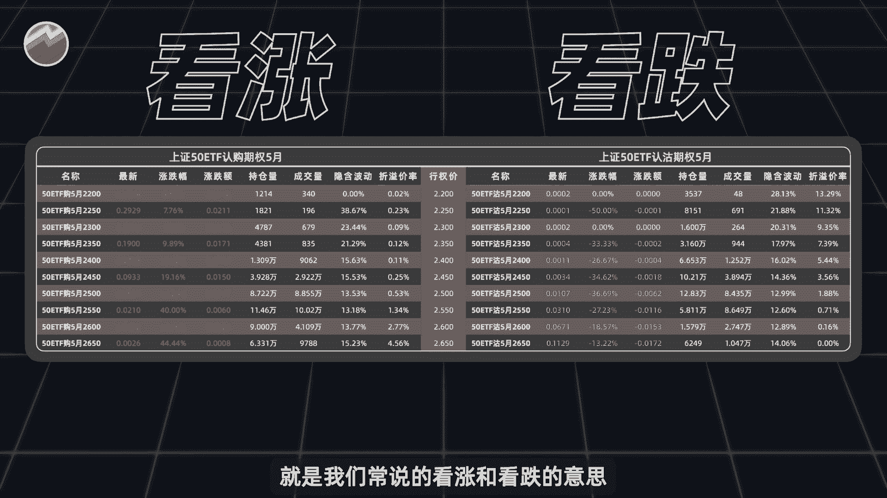

他们的名称的意思是，这个期权是5月某日到期的看涨期权合约，给予持有人在到期日以美股叉叉元价格，买入上证50ETF的权利，除此以外啊，还有价格涨跌幅等基本信息呢，也不需要我来多做解释。

含波动折价率这些信息的详细解释呢。

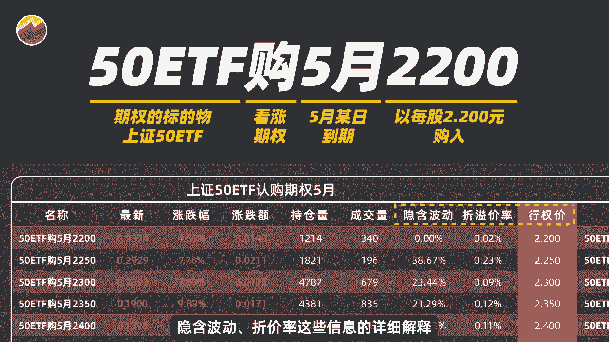

我也帮大家列了出来，感兴趣的可以暂停截图，然后有的朋友可能会说啊，既然有5月的期权，那是不是有7月8月的呢，确实如交易所一般，会把期权按照月份分为以下几类，其中当月期权的成交量是最大的。

影响相对来说也比较大一点，我们后面介绍的这个量化策略，也是基于当月期权的数据构建的。

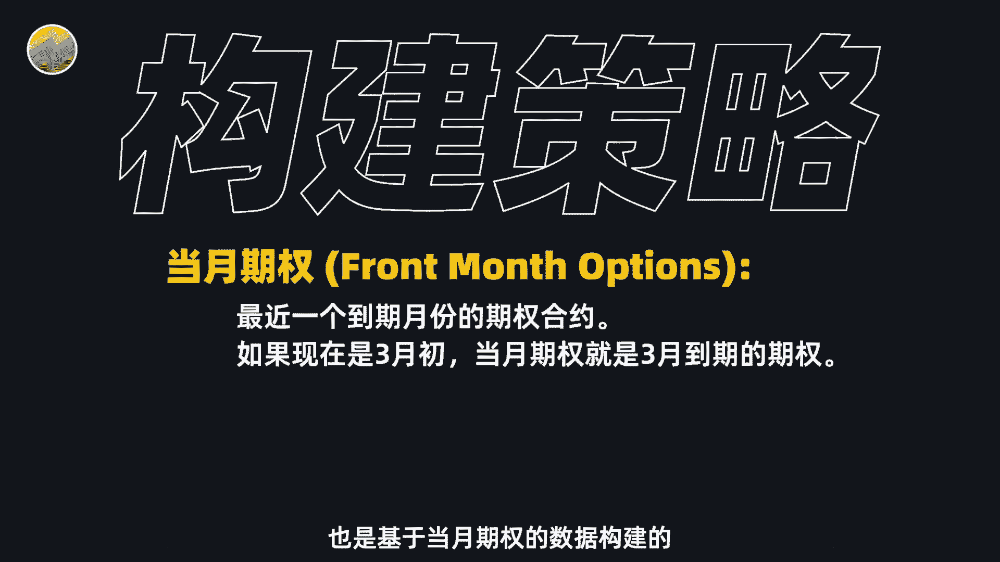

然后我想说的是啊，期权这个品种交易门槛很高，学习成本也很高。

要讲清楚的话，需要大量的精力，时间有限，本期视频呢不会做过于深入的讲解，大家只需要了解期权的一些基本信息即可，如果大家对期权感兴趣的话呢，也可以多多点赞。

点赞破5000的话呢，我们可以专门出一期视频聊聊期权这个东西，有想系统性学习期权的朋友呢，我推荐这几本书，我觉得都是很好的教材，介绍完了期权的基本信息之后呢，接下来我们就来分享一个我们常用的。

由机器人数据构建的市场情绪指标。

有一定交易经验的朋友，应该都有一套自己衡量市场情绪和热度的方法，这些方法呢可能是某个指标。

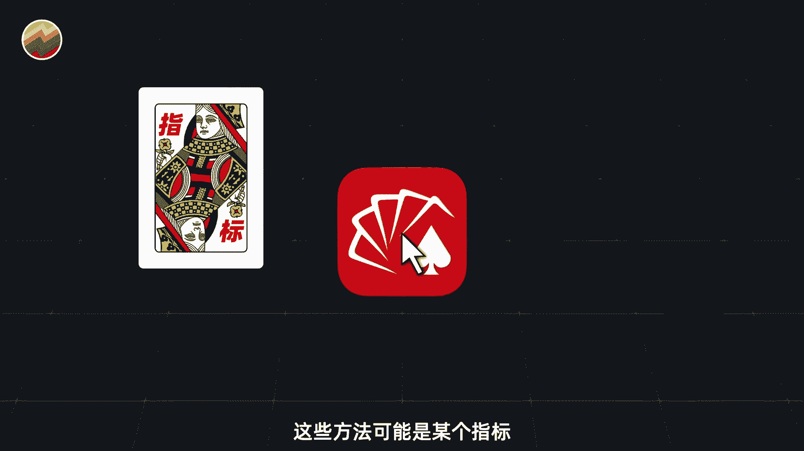

也可能是某个指数，甚至是对炒股论坛中帖子的情绪的解读，我这里呢大概列了一些长用的，度量交易情绪的指标，感兴趣的同学可以自己去研究一下。

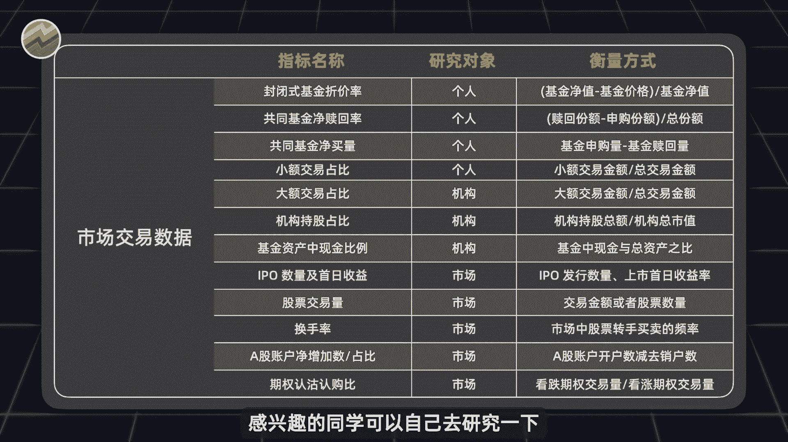

顺便插一句啊，如果大家想看，如何构建一些衡量投资者情绪的指标呢，那么就请多多三连支持。

后续我们会出一期相关的视频来聊一下，然后呢在这么多的市场情绪指标中。

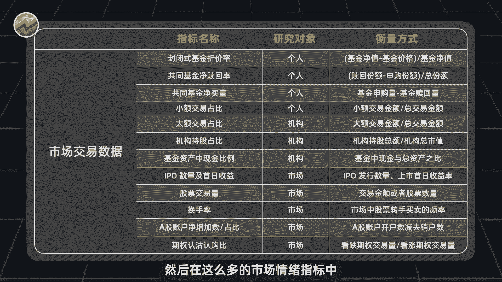

我们要介绍的是期权认沽认购比率，这个指标又叫做PCR指标，是由期权的认沽成交量除以认购成交量所得，按照我们自己的经验啊，一一般会用最近五个交易日的期权认沽成交量，除以认购成交量来构建这个指标。

从指标公式看呢，PCR指标越大，看跌的投资者就越多，市场情绪应该越悲观，反之啊，PCR指标越小，投资者情绪呢就越乐观，但是如果是我们的老观众。

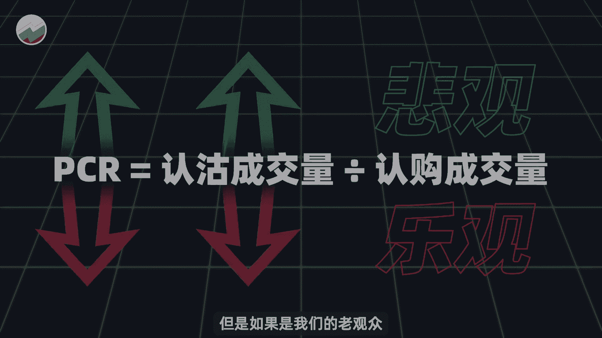

应该记得，我们有很多期视频都告诉了大家，金融第一定律就是大热必死，那放在PCR指标这里其实也同样适用，当大家一致看好，甚至在游戏中，直播间的弹幕都在聊炒股的时候，可能就是到顶的时候呢。

所以在大家一致悲观的时候去抄底，一乐观的时候去逃顶，或许反而会有更好的收益呢，当然啊说了这么多，其实也都是经验之谈，我们做量化交易的，还是要借助全部的期权数据和Python代码。

帮我们去计算出历史上所有的PCR指标，看看这个指标和大盘后续的走势有什么关联，相应的数据呢，我们也帮大家准备好了，里面包含了上证50ETF上市以来每天的收盘价，持仓量，认购和认沽的成交量等等。

非常的完备。

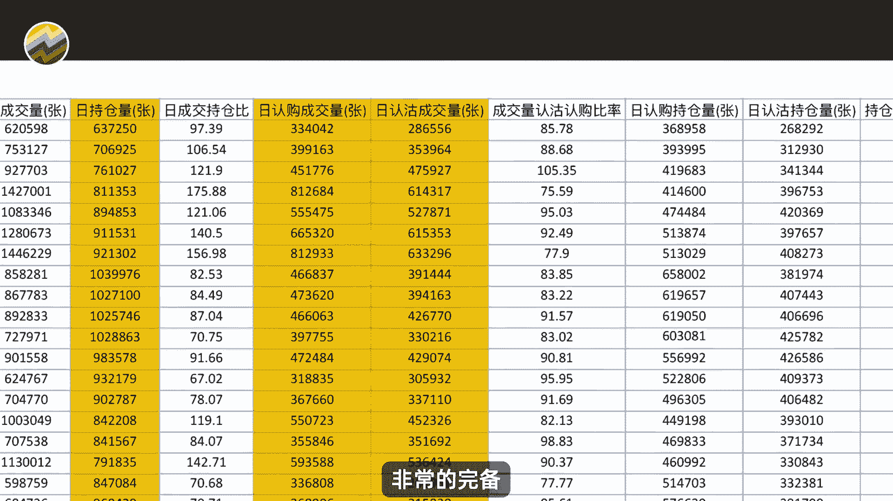

有眼光的同学应该能发现，这份数据是比较珍贵的，毕竟研究过期权都知道历史数据是很难获取的，如果你需要这个数据的话，可以加屏幕右下角或者置顶评论区，我的微信都是可以免费发给你的，之后呢。

我们就借助Python代码，帮我们计算出每天的PCR指标。

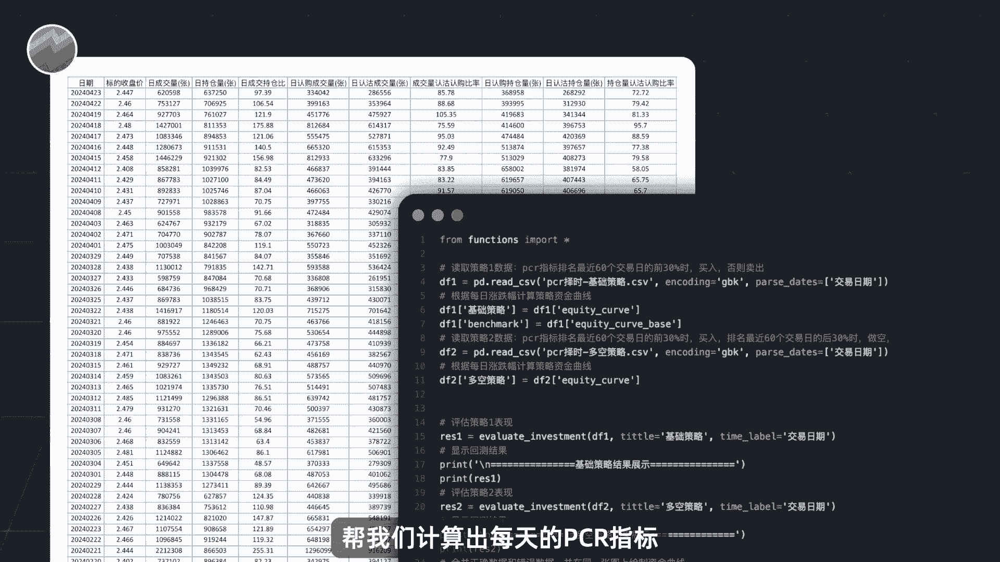

我们运行一下程序，让它帮我们做图，就可以得到如下结果，图中蓝色曲线就是我们的上证五零指数，橙色曲线则是PCR指标，我们随便挑几个时间点观察就可以发现，当PCR指标很高的时候，基本都是在市场的底部。

此时是情绪最低迷的时候，反而大部分是较好的入场时机，同样的PCR指标很低的时候，就是市场上涨，情绪高涨的时候，事后看确实有一些可以逃顶的机会，所以大家平时可以关注一下这个指标。

辅助你去判断大盘到底目前处于什么状态，当然了，如果只是观察大盘的话，那就太浪费这个指标了。

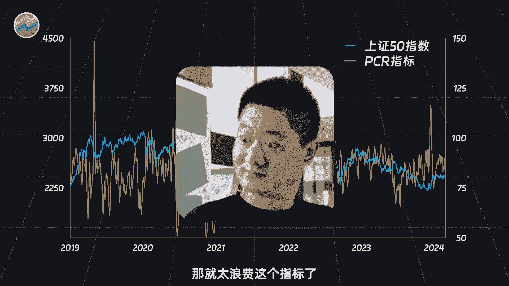

一个情绪指标最好的归宿，就是用来构建可以准确择时的量化策略。

比如说我们从2019年起，在每天收盘后啊，去获取最近五天，上证五零期权认购和认沽的成交量，并计算出相应的PCR指标的值，并且呢将最近60个交易日的PCR值啊，从大到小进行排序。

如果当天的排名呢处于最近60天里面的，最大的前30%，也就是排名在18名之前，那么我们就在下一个交易日开盘，去买入上证50ETF，然后呢一直持有到某天啊，这个排名掉出了前30%。

我们就去卖出完全全部的清仓，然后呢再次等到他什么时候回到前30的时候，我们就再去买入，就是这么一个简单的策略，如果我们循环往复的去操作，那最后能赚多少钱呢，这个计算相对来说是比较简单的。

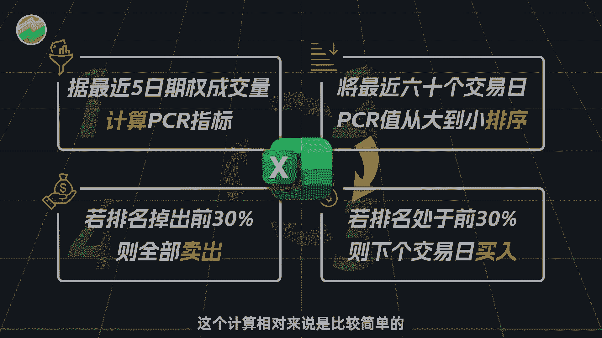

你用excel就可以实现了，我们这边的使用Python代码来帮忙，如果你需要这个代码的话，以及前面的数据都可以，屏幕右下角或者置顶评论区，我的微信都是可以直接发给你的，好。

那么我们运行一下程序来看看结果到底如何，在看程序运行结果之前。

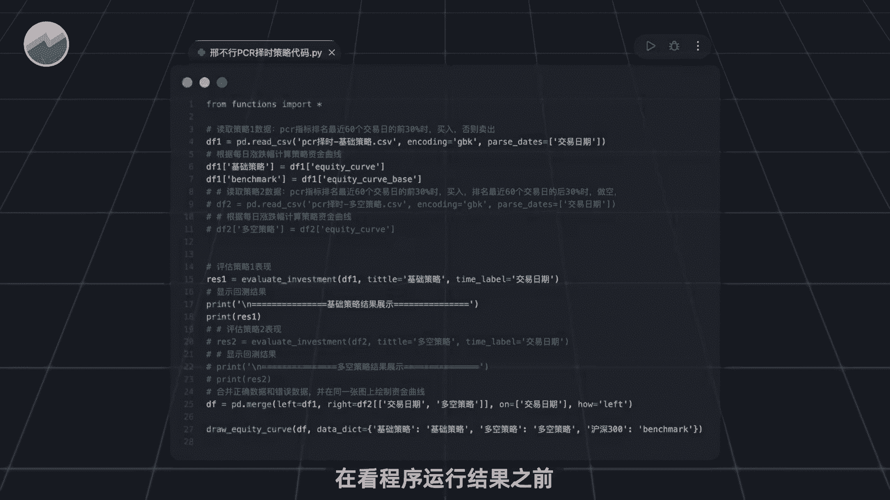

先插一个题外话，很多人问我小白如何入门量化投资，有什么资料分享。

所以呢我特意为大家准备了一个量化投资，新手学习的大礼包，你打开这个文件。

它包含非常多的内容啊，首先这个word文档呢是我们自己总结的，量化投资学习路径。

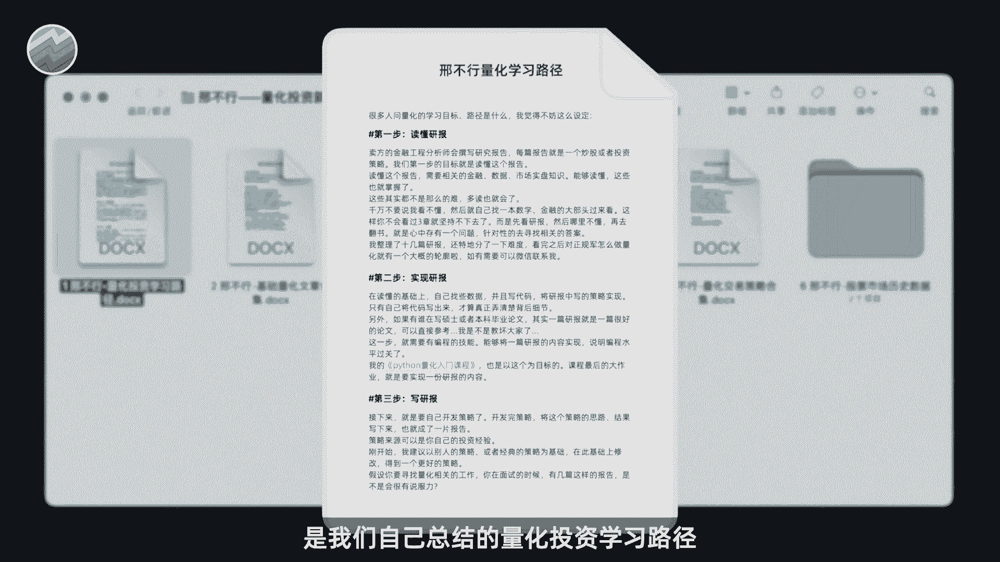

很适合零基础的新手，让你知道自己一步一步需要达到什么样的阶段。

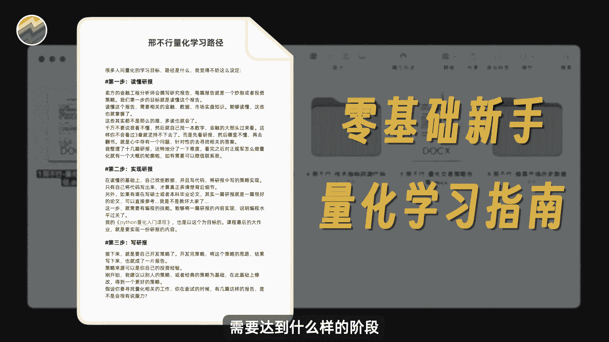

看完学习路径后呢，就可以通过我整理的量化文章合集，来更全面的了解量化投资到底是什么，然后呢，我还精选了适合各个学习阶段的策略研报合集，正如我一直说的，量化研报是很好的，量化实践项目。

深度研报可以显著提升你的量化水平，还有这一份代码呢，则适合所有喜欢技术指标的人，你可以跟着教程轻松计算出所有的技术指标，并测试这个指标是否有效，如果你有一定的基础，你还可以尝试回测一些策略。

我为你准备好了十几个不同类型的经典策略，和他们的代码，相信总有一个适合你自己去魔改开发，运用到实盘，当然最后也是最关键的，量化的基础就是准确的历史数据，我会送你一份股票，历史日线数据和一份财务数据。

你可以用它来像我一样去测试所有的技术指标，和财务指标以及大部分的策略，所以这个大礼包的内容真的非常的丰富啊，如果你需要的话呢，可以加屏幕右下角或者置顶评论区，我的微信都是可以直接免费发给你的。

好我们回来看程序运行的结果。

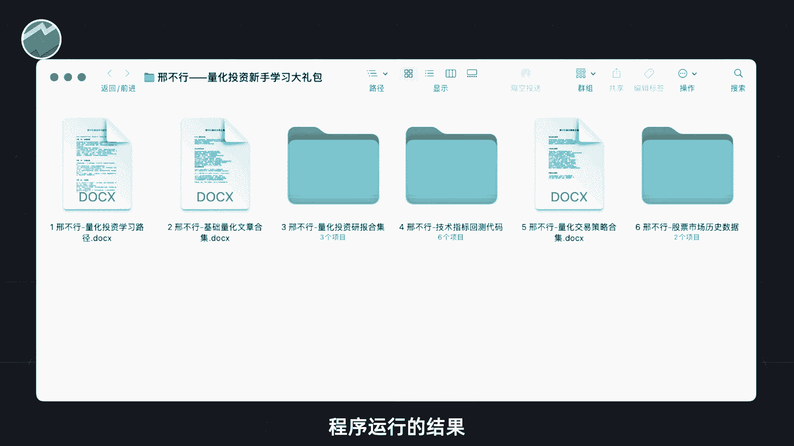

代码运行的结果呢如图所示，代表策略的成色曲线呢，是从最初的一块钱涨到现在的1。83，他远远的跑赢了上证五零指数本身年化收益啊，12。04，最大回撤呢很小，只有14。54，可能会有人觉得这个收益很少。

但你要知道我们买入的是上证五零啊，这么几年，他自身的年化收益就只有1。1%，最大回撤呢更是高达了45%，所以这个策略有这样的表现已经很惊人了。

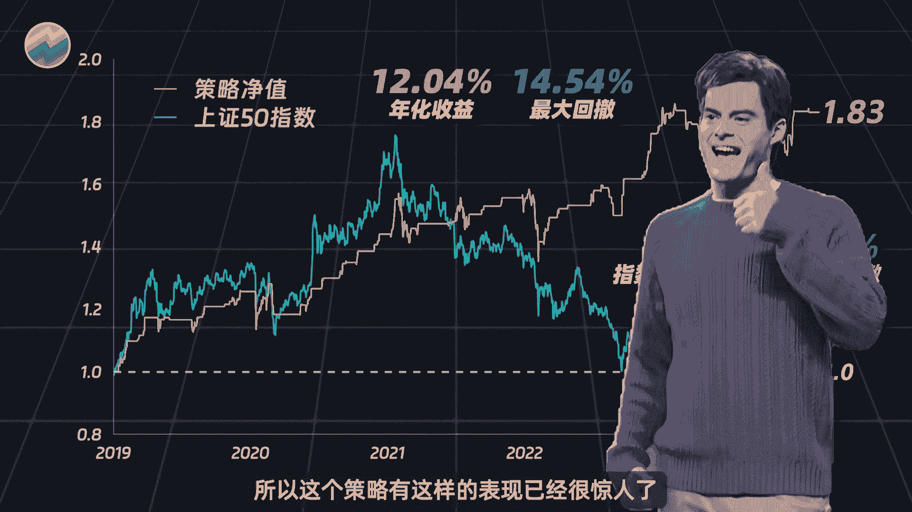

你不能指望一个简单的指标构建的择时策略，能跑出8年1万倍的表现对吧。

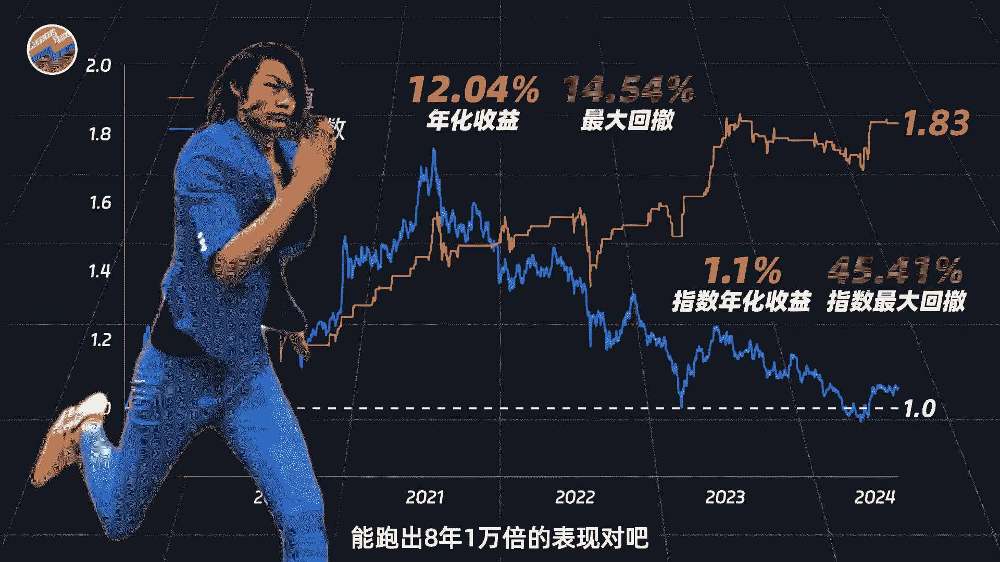

但就是这样一个简单的策略，其实就很适合喜欢投资指数的朋友，也比较适合那些不知道去买哪些指标的，新手小白，实操起来呢也很简单，不会Python其实也没有关系啊，每天看一下上交所的数据。

用excel计算下指标排名也很方便。

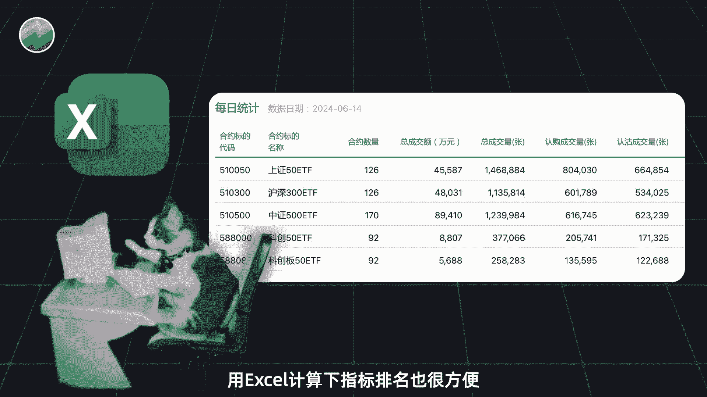

当然啊对于一些有股指期货投资经验的朋友，你也可以问我要了这个数据和代码，去改进一下这个基础策略，尝试加入做空指数的部分，比如我们可以在前面策略，其他条件不变的基础上增加一个新的条件。

当PCR这个值排名处于后30%，也就是排名在后18名的时候，我们呢就去做空上证50ETF。

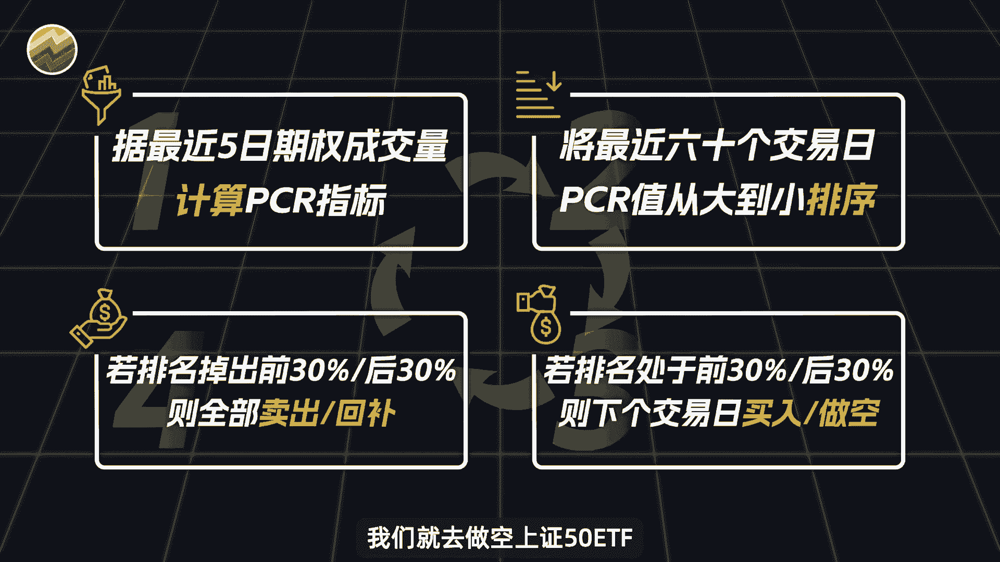

这样做呢可以增厚我们的投资收益，但需要注意的是。

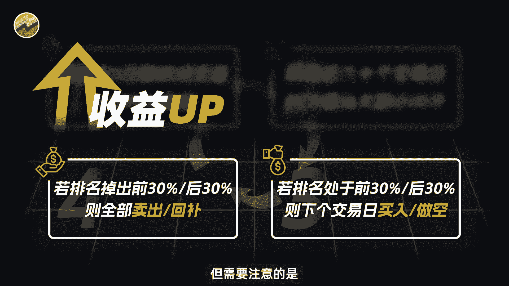

也会同样放大一部分的风险，那改进后的策略是否会有不一样的表现呢，我们只需要在原有代码上稍作修改，就可以得到想要的答案了，城市的运行结果呢如图所示，代表策略的橙色曲线，从最初的一块钱涨到了两块八。

接近翻了三倍，同样大幅跑赢上证五零指数，年化收益也大幅提升到了20%几，当然同样最大回撤也上升到了20%左右，和原来策略对比来看呢，这个策略近两年的表现无疑是更好的。

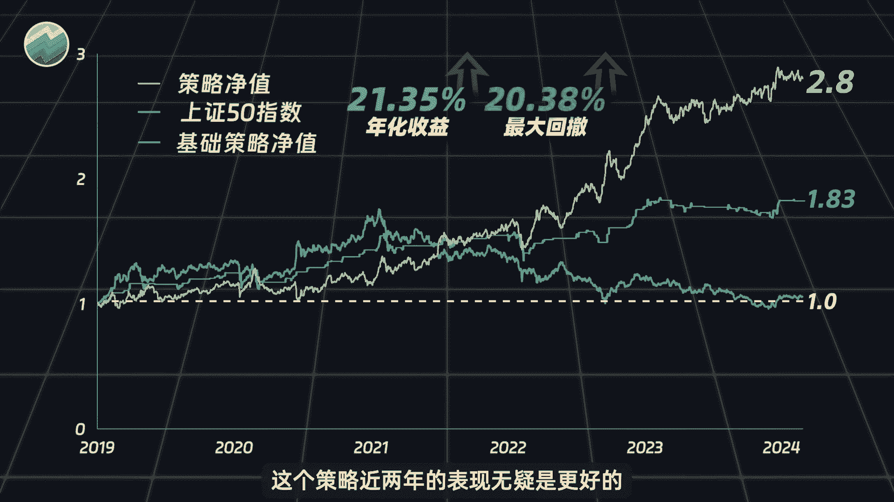

当然啊要运行这个策略的基础是，你得熟悉股指期货的做空规则，我也不建议新手小白脑子一热去做这个策略啊，这本身是需要一定的门槛，不管是资金也好，还是经验，知识储备也罢好。

那么这个期权认沽认购比率指标和相关的策略，我们就分享到这里，最后我想说的是，期权作为一个不被大众知晓的交易工具，其实有很多的可玩性和研究的价值，是值得我们去探索，但同时啊它也确实是一把锋利的双刃剑。

用好了呢可以增加收益，减少风险，而市场的情绪呢也是同样如此，用的好了，可以构建择时策略，帮助我们趋利避害，用的不好，可能就会成为追涨杀跌的典型，如果你还想了解更多，期权知识和市场情绪指标的话。

也可以多多点赞，点赞破5000，我们就更新更多的内容好，那么本期视频就到此结束，感谢大家的点赞，收藏转发。

