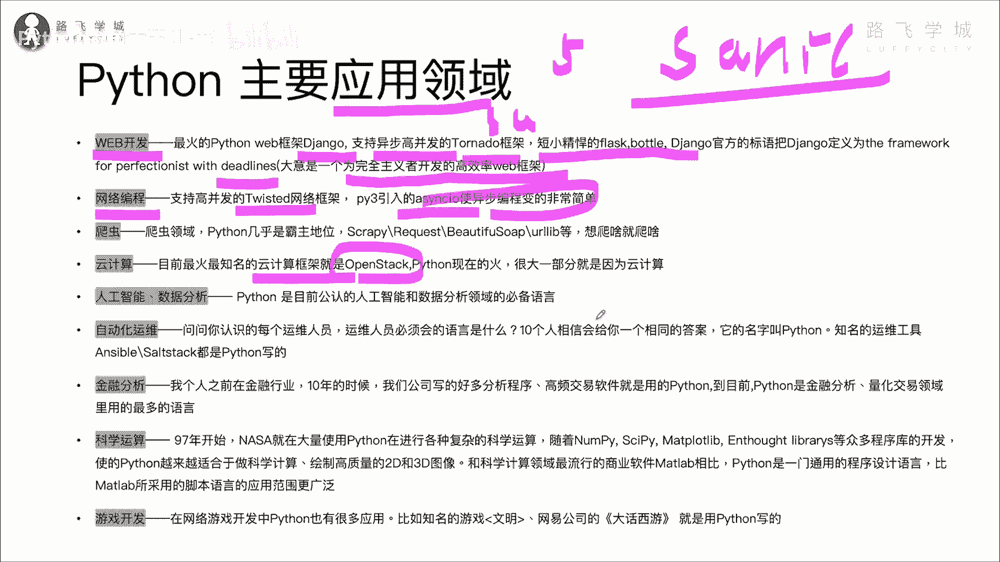
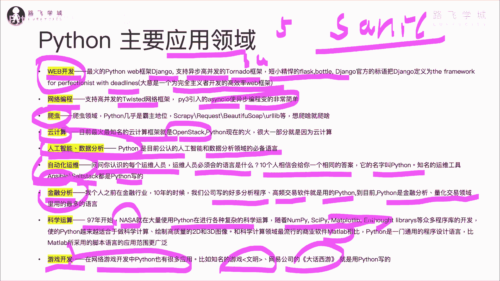
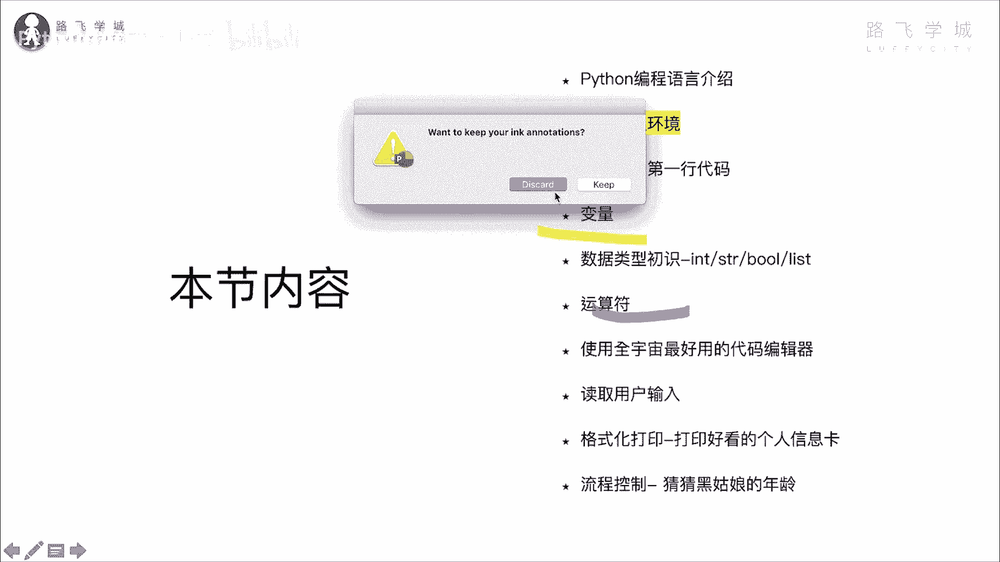
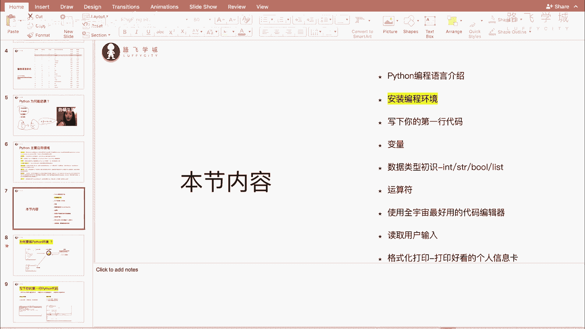

# 【2024年Python】8小时学会Excel数据分析、挖掘、清洗、可视化从入门到项目实战（完整版）学会可做项目 - P3：02 Python在哪些领域大放异彩 - Python金角大王Alex1 - BV1gE421V7HF

好同学们，这小节给大家介绍一下，Python的主要的一个应用领域啊，我给大家标黄了啊，这个都是Python比较擅长的领域，首先先看它的web开发啊，web开发呢。

这是也是Python这几年比较火起来的一个领域，之前大家做网站都用java p p啊，但是现在啊做网站用Python的会比较多了啊，那好多小白不明就里的，以为说做网站不都用java和PVP吗。

那都是过去式了，我告诉你，现在啊做网站做网站首选，我建议还是用Python，因为用Python做网站开发效率极高啊，这个最火的Python的web框架jungle，注意了，它是全球第五大外部框架啊。

第五大外部框架，并且还有支持异步高并发啊，小白不懂，但是你就知道性能强的，一个彪悍的一个tomato框架，还有短小精悍的flash bottle对吧，这个这个异步非常强的。

有有说Python man嘛对吧，但是有一个非常不慢的框架叫sonic，这是新出来的，以后你可以学老牛逼了啊，做这个网站，然后啊jungle官方把这个jungle的定义叫什么。

The framework for perfectionist with deadlines，什么意思啊，就是为一个完美主义者开发的高效率外部框架，并且它VIDEYLINE。

也就是说你开发网站要求这个什么呀，有截止日期对吧，你用其他这个java你写俩月，用Python，我跟你讲半个月就出来了，所以做网站非常强，第二个网络编程啊，Python网络编程方向非常强。

有专门的复杂的网络框架叫twisted，这个python3还引入了叫ACIO哇是异步编程，变得非常的简单，等以后啊我们可以学啊，这个异步编程非常强大，非常强大啊，非常性能非常高，这是网络编程。

然后呢还有爬虫，爬虫呢大家一起爬虫，基本上就是Python的代名词啊，这个属于是霸主地位，写爬虫，百分之百分之90以上的爬虫，几乎都是用Python写的吧，这个并且实现非常简单，实现非常简单啊。

那些非跟你抬杠说用java也可以做爬虫，pp可以做八成的人，你不要搭理他对吧，你再跟他吵一吵，下一下，下句话他拿刀捅你了啊，就这种人对吧，那另外这个云计算云计算注意了。

这个目前最火的最知名的一个云计算的框架，叫open stack啊，他就是用Python写的，这个据我了解啊，这个像像像呃，就是就是阿里云，亚马逊他们内部啊，大量的都在用Python在做云计算的各种东西。

OK吧各种东西啊。

OK呃这是云计算非常火，然后sorry。

这是咋的呀，咋的呀，接下来就是这个人工智能数据分析对吧，是属于公认的啊，数据分析和人工智能领域的必备的一个语言啊，语言你说大家一提人工智能都跟Python挂钩，各种培训机构啊，宣传的时候说啊。

我这个人工智能Python什么什么的，对吧啊，就是因为这个人工智能啊，数据分析，机器学习领域，大家用Python会用的比较多啊，因为各种相当机器学习的数据分析的框架啊，这个这个这个软件框架啊。

都是用Python来做的，OK了，再就是自动化运维是吧，我自己多年前也是做运维出身啊，你问一下你认识的每一个做运每一个同学啊，你问他说这个运维必须会什么语言，我告诉你十个人里面，我告诉你都会告诉你。

同样的答案就是Python啊，因为就是这个这个，因为说白了就是，它相当于是运维人员标配的一个语言啊，标配语言这个很多知名的运维工具，像ansible stack都是喷漆的。

这个ANSIBLE还被红帽软件给收购了2亿美金，应该是2亿美金，就写了一个工具，我擦那工具我跟你讲，11年的时候，我就写了一个类似的啊，结果没人说过，我妈的哼，只能混到讲课了，是不是啊。

然后接下来就是金融分析啊，金融分析呢我之前在金融行业啊待了4年啊，金融公司金融的那些人喜欢用Python，之前用C加加，但是C加学习成本很高，非常难跟C语言一样。

但是Python又能实现同样的像C加加一样的功能，然后学习又简单，所以呢很多我们公司的这个，做金融的那些大佬们，他们用Python来写各种分析程序，高频的交易软件，量化分析的啊。

现在就是我的这个金融量化分析，都是用Python来做啊，什么叫量化分析，你就理解为自动化炒股就行了啊，自动化炒股好吧，接下来科学运算，科学运算，大家知道97年的时候，大家NASANASA对航天局。

美国就大量的用Python在做各种复杂的科学运算，对吧，后来呢，这个这个这个随着这种，什么各种科学运算的包啊，像number py c i c IP y，my pla lab这些东西都出来了之后。

就导致Python在科学运算数据啊，这个这个这个这个处理这方面就越来越适合啊，越来越适合OK了，这个大家知道这个学统计学什么的，学的那些专业的同学肯定用过叫MATLAB，是不是Python。

MATLAB是花钱的，Python里面的这个my polib可是不花钱的，随便用吧，好这个再就是游戏开发，大家知道啊，在网络游戏中啊，这个很多啊，也有很多是用Python来做啊，国外的有知名的文明。

国内的比较知名的大话西游就是用Python写的，大话西游的后端程序就是用Python写的，对吧啊这个有人说Python慢，我告诉你人家大话西游这种对不对，那么多人上百万人同时在线是吧。

照样用快速写就是牛逼对吧，为什么，因为我有一个老师啊，他之前就在网易对吧，他就是负责做那个大话西游戏的，发现我好把Python是吧，就各种模仿老牛逼了老牛逼了，OK这个是Python主要的一个应用领域。

这就是为什么它被称为万能的一个语言，你学好了一个Python，我告诉你你朝哪个方向发展，好好学是吧，你都可以对吧，能出人头地，有出息啊，有出息对吧，你说我我我专门做web开发，你学好了也牛逼。

专门做爬虫也牛逼，云计算也行，人工智能更牛逼对吧，自动化开发对吧，金融量化啊，这个都可以，游戏开发都可以，对不对，我们还有专门的游戏项目啊，游戏实战项目，大家有兴趣的话可以拿来学啊。

OK这个就是Python的主要应用能力，大家了解一下就OK了。

