# 学完血赚！最强人工智能数据挖掘实战【Python金融量化分析】，非常适合新手！即练即会！！！ - P28：28-百分位去极值方法 - 迪哥小助手 - BV1URsfeqEQ5

这节课啊咱们来说一说该怎么样对因子数据做预处理操作。好了，第一个词来了。因子数据。哎，什么叫做一个因子啊？好比这么说吧，哎，我说你现在要去买股票了。那在买股票过程当中啊，你肯定不是大捞针的。

我随便买一个，那你自己心里哎是有些想法的。按照我某种想法，按照我某个标准，我说我去选一选筛一筛符合我标准的，我买下来是不是咱们经常有这样一个操作呀。那好了，刚才我们提到一个词叫做一个标准吧。

这个标准就是我们现在啊所说的一个因子，比如现在这样我说大家在买股票的时候，可能都知道一个常识啊，就是对于市净率对于这个市净率来说，那低的相对来说我买起来比较合适。因为市盈率低的值，哎。

它的一个涨幅空间相来说比较大吧。对我来说我的收益可能也比较高吧。那再比如说呢我说财务当中的信息也可以。哎比如说我现在这样一些公司当中啊，如果说它的营收增长率比较高，那我认为这个公司那可能是好公司。

那我就买他们的。😊，股票我可能去赚钱吧。其实因子啊理解很简单，对你最终结果有影响的这些个指标啊，就是咱们要来今天讨论的这个因子。那行，因子咱们既然说到了。那当我们拿到这个因子数据之后啊。

该怎么样去处理这批数据呢？给我们感觉想这样，哎，现在有一个要立个大方程。我说最终啊我的一个收益，那可能是一个Y是吧？好了，那我说我现在因子因子来说，那比如说是我的输入吧，我说这因子有挺多。

X1X2X3X4等一堆是吧？那我们现在要干什么，好像是做一个数据挖掘问题，看一看每个因子哎，对最终结果有产生什么样的影响，我该怎么样在这些个因子当中去做一个选择吧。好了，这节课讲完之后会给大家举个例子。

就是呃怎么在因子因子测略当中啊选择哎我们合适的股票，使得咱们收益啊能够更高一些啊。那现在我们要做的事是这样，哎，先想一想因子数据，我们该怎么样去处理。那比如这样咱先不说多因子。

咱就说担心的一个那比如现在拿到一个因子之后，它是什么，它是一个数据吧。那拿到数据。😊，之后哎咱直接的做一些建模吗？直接的拿数据去用吗？好像不一定吧，我们得对数据做一些预处理操作吧。好了。

今天咱们主要来说一说啊预处理操作当中，我们都有哪几个做法。这里呢列出来三个叫做哎第一步，那你看这里我写了一个三步走。第一步啊，咱们就是去极值啊，第二步叫标准化。第三步叫做中性化。

如果说啊大家以前对机器学习，哎，还有数据挖掘比较熟悉的话，前两个是不是一打尔就明白了。哎，去极值，有一些可能离群点有些异常点，我它规范一点。标准化呢？

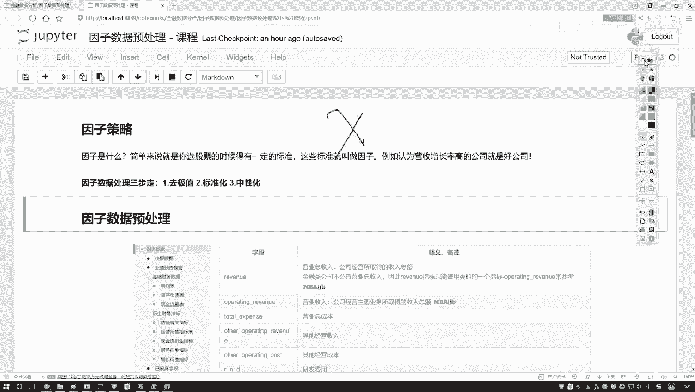

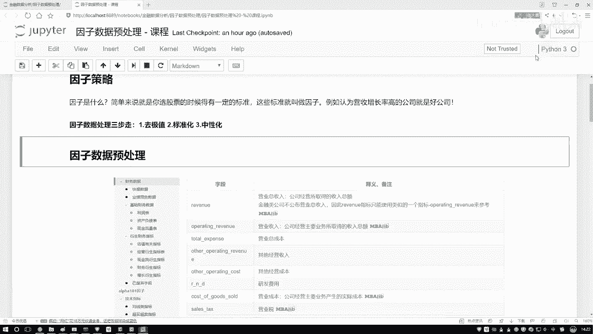

数据啊在各维度当中，可能哎它的一个数值取值范围是不同的那比如说哎咱们的一些有些指标取值范围是0到10的，有些指标取值范围是0到1万的那你看他们取值范围是不同。那好像数值对结果有很大的一个差异吧。

咱尽可能让不同的数值在相同的一个浮动范围区间吧。比如说都是负一到正一啊，都是0到1啊，哎，这个东西啊就叫做一个标准化。这两个都是数据挖掘当中啊常见的一个概念。然后第三个叫中性化。

可能这个词啊大家以前没用过，因为一般数据化有任务当中啊，还用不到中心化这个东西。但是呢在我们的因子策略当中啊，咱得来说一说了啊这个中性化它做了一件什么事儿。接下来咱们就这样，哎，按照我们的三步走策略。

先说及值怎么处理，再说怎么标准化，最后来说中性化，哎，咱们该怎么样去做啊，这个是我们讲的一个顺序，然后呢大家如果想看啊，就是有什么样因子，在那个。

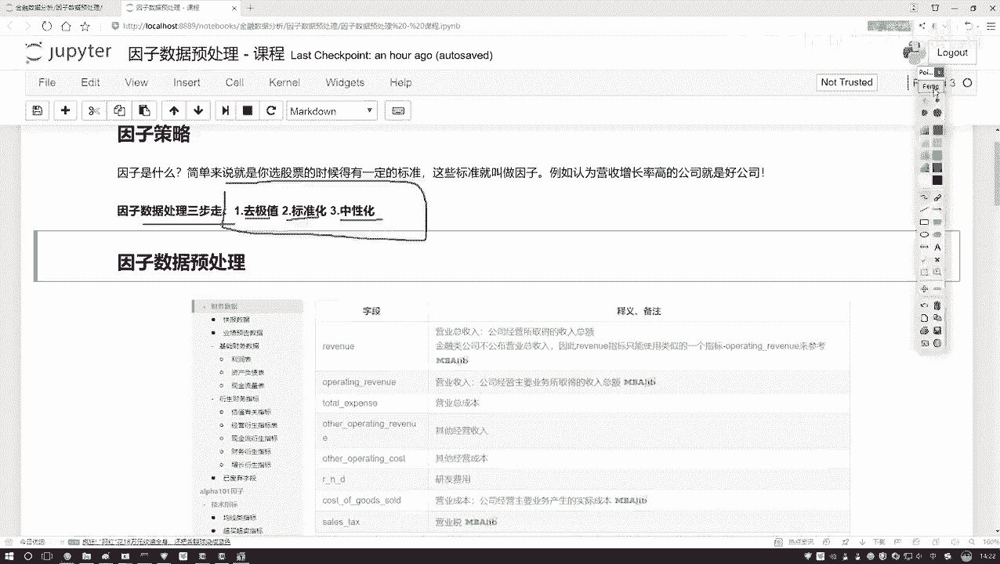

米框那个平I当中啊，哎它有各种各样指标吧，那你就去扫一遍吧。所有的指标当中，那字段多了去了，可能每一个字段都会对我结果产生影响吧。好了，今天啊一会儿啊咱们来分析那个市净率啊，拿市盈率来举例子。

因为这个相对来说会更直观一些，大家可能对它会更了解一些啊。

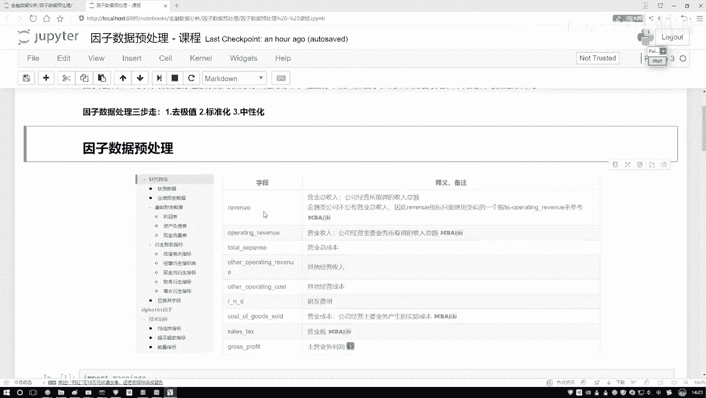

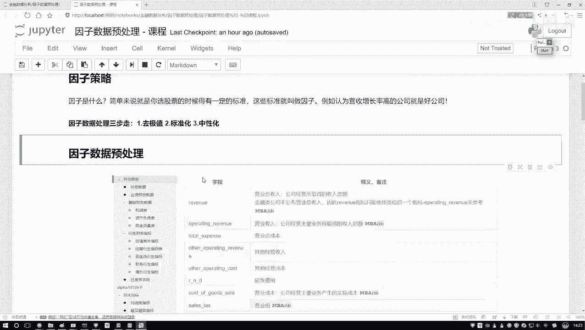

第一步啊，咱们跟之前一样，还是啊先导进来我们所需要的这些工具包，工具包啊都没变。然后这里呢我给大家先举例子，一会儿啊咱们再去那个平台上，哎，我们自己写个策略。

我现在这里啊把咱们的一些处理方法以及咱们的一些知识点讲完了，咱们再去写策略啊，在这个诺布当中，我们先说知识点，一会儿咱们再来玩一个策略啊，好了，读数据啊，这个数据大家很熟悉了，都已经不用解释了。

一会儿咱就拿这个苹果股架啊，当做一个举例子了，大家可能说这个苹果骨架。😊。

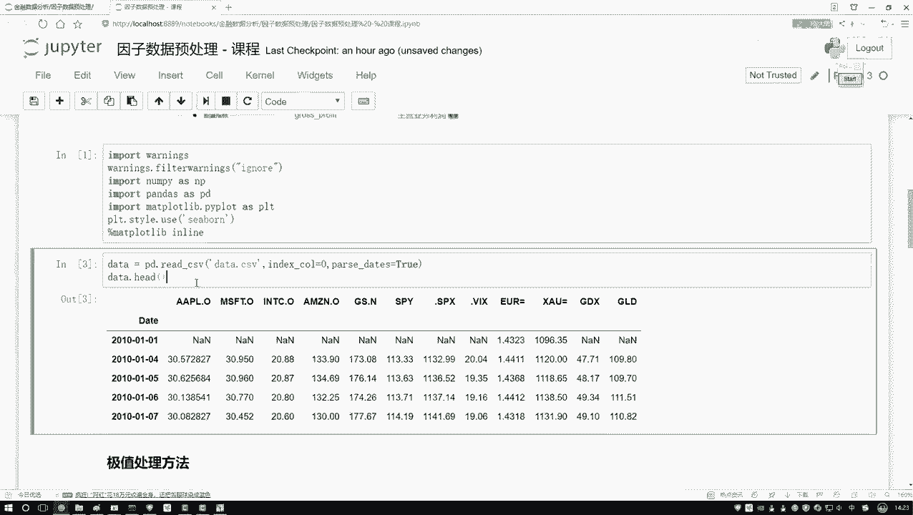

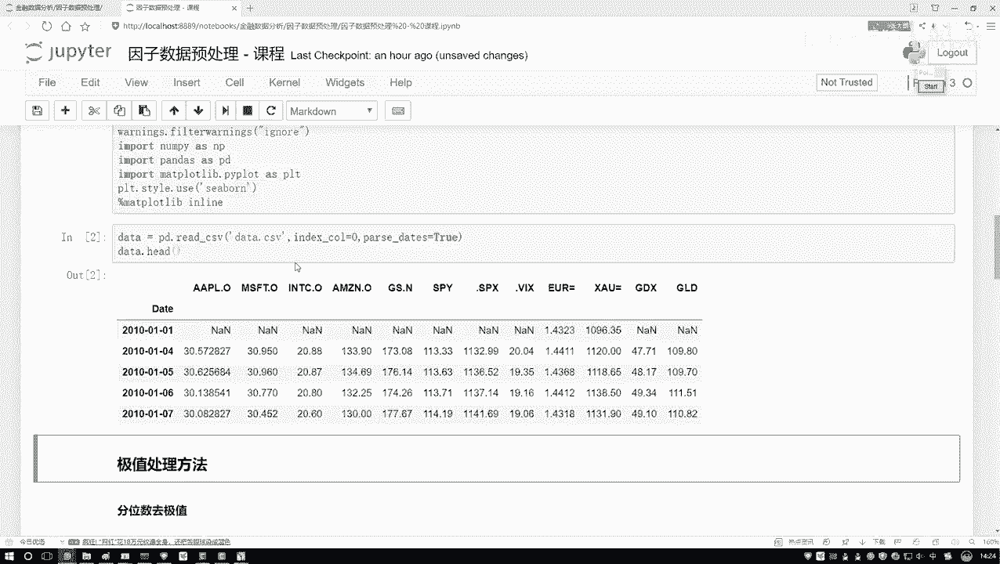

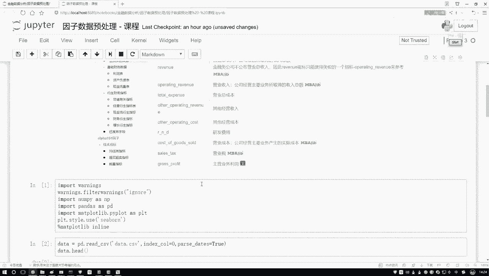

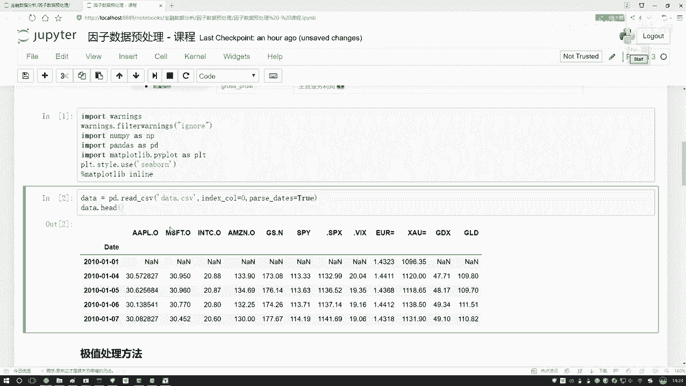

它也不是一个因子啊，你拿它举例子可以吗？因为这样啊，就是呃我现在不是在本地去写的嘛，没有连那个人家平台吧，所以说获取数据啊稍微麻烦一些。一会儿咱在平I当中啊，咱们去获取实际你要做的，比如说一些市净率啊。

市值啊，哎这些指标在这里啊，咱们就随便拿一个数值给大家举例子，主要讲一讲咱咱们的这些操作啊，该怎么去做。一会儿呢咱们拿实际因子啊去做。😊。

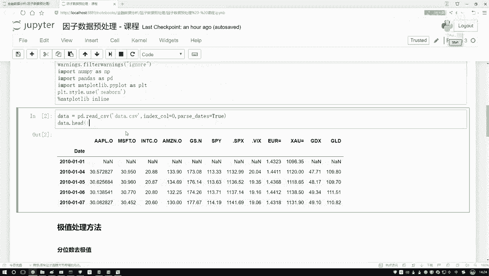

好了，第一步就是极值的一个处理。极时处理方法其实有蛮多的。那我问大家最常见一件事儿。那你说现在啊一个数据当中，比如这是一个数据吧，那绝大多数的数据点可能都浮动在中间范围当中了，是不是没有少部分怎么样？

你看有个黑点，在这里在这里在这里在这里哎，有两个极值吧啊，左边右边，那你说对这个极值怎么办呢？大家可能第一个想法，可能离群点啊，那我就不要了吧啊，这些数据我就全扔了啊。好，是一种想法。

或者说咱们扔了说点可惜啊，我们能不能给他劝一劝，让他迷途直返一点啊，我说这个哥们在这儿。😊，我说你劝一劝，我告诉你，我说你越界了，然后呢，那哥们问我说你借在哪啊？我给他画了一下，我说我借在这儿。

那比如这个值它是一个-十吧，然后我的界限是一个-5。那我说行，咱界限是-5，我把它拉回来。当前这个数值，它越界了，我不给它丢掉，我把它的数值改成什么，改成我的一个下界还有上界当中自己指定啊。

可以自己指定一个上界和下界，把这个负十改成-5，它是不是就没月界了，相当于啊我们要做这样一件事儿啊，不是直接去删除了，而是把它大于我界限的给它拉回来，让它成为我的临界点的一个数值啊，这就行了。

这个是咱们的一个做法啊，不是给它丢了，那怎么去做呢？给大家说几种啊，现在说第一个叫分位数。😊。

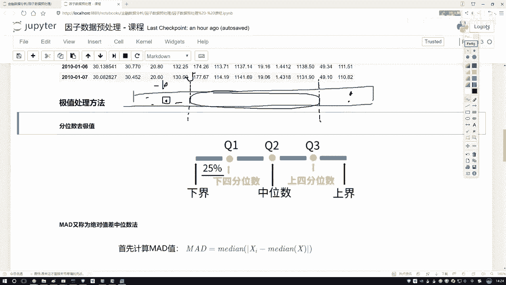

分位数这个东西啊其实挺直接的啊，先说一下吧。哎，分位数如果大家不太了解，那中位数总了解吧。哎，大家可能说那你说中位数为什么不说均值啊，因为均值这个东西怎么样？均值这个东西不好用啊。

尤其是在我们的数据挖掘任务当中，哎，你说当你去。填充一些缺失值的时候，经常用什么中位数吧，而不用均值吧，有什么问题啊。咱们我前几天看那个好长时间好几个月前，看那个腾讯，然后他们那个微博说。

腾讯员工这个月工资达到了7万多，啊，大家想这工资怎么可能达到月工资达到7万多呀。后来啊大家一看是把这些高管的工资，把这些人上层的人家股东的工资可能都算下去了啊，一算个平均可能是7万多。

但是你说这个平均他有代表性吗？好像没有什么代表性吧，因为里边它的一个分布可能有一些头入脚轻，哎，这样有感觉是吧？行了，这是一个均值，然后呢刷完均值之后，咱来说中位数，哎，你说中位数怎么样，哎。

中间那个人怎么样，我用中间这个去看一看整体感觉是不是更靠谱一些啊，所以说啊咱们来看一下啊，我们的一个分位数，分位数就是这样啊，这里你可以把整个的数据吧，分成几个位置。你看这里中位数大家说过了。

中位数挺好解释的吧，就是。😊。

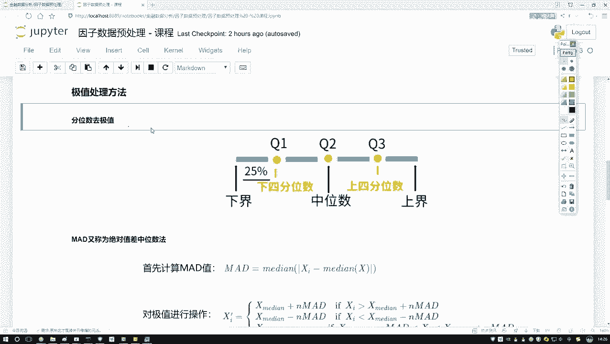

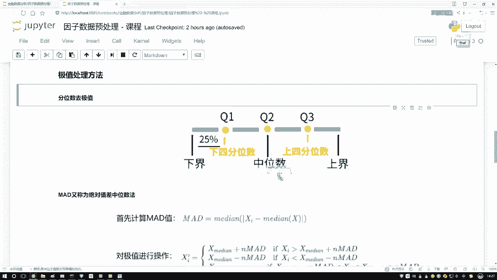

中间那个位置，它的一个值7个人来说，7个人中间位置是谁啊？这是123，这是456，中间谁啊？这是不是中间这块是567，中间谁啊？中间就4吧。那如果说这块8个数呢，8个数中间是四和5啊。

那你可以四和5加一起除以个2是不是就行了啊，这个就是我们的一个中位数。然后呢，你看这里啊，我们不光列了一个中位数，还列什么？

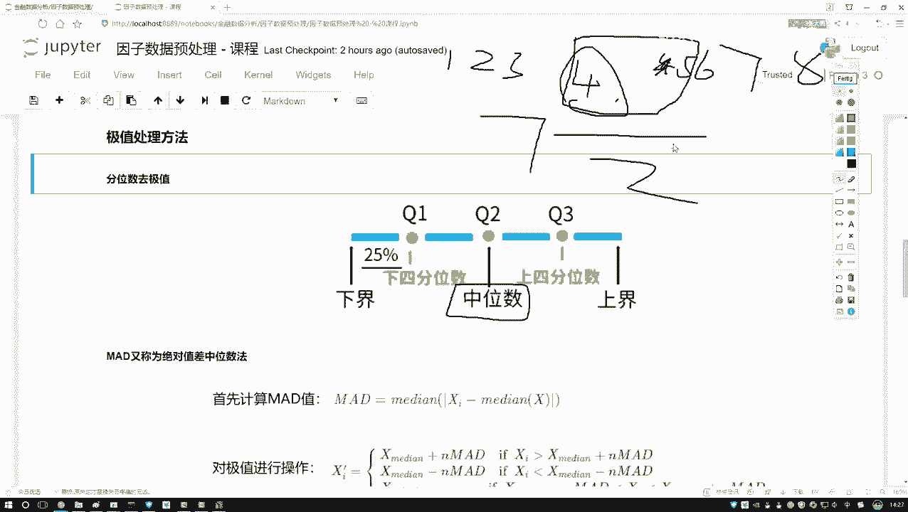

四分位两个四分位吧，相当于Q1个Q3，你就当做这块是4分之1的啊，这块是一半的，2分之1的这块是一个4分之3的，是不是就可以了？这个啊就是咱们现在列了一下我们的一个分位数当中啊有三个指标。哎。

Q1Q2Q3他们都表示啊在我整个数据当中啊，哪一个部分。

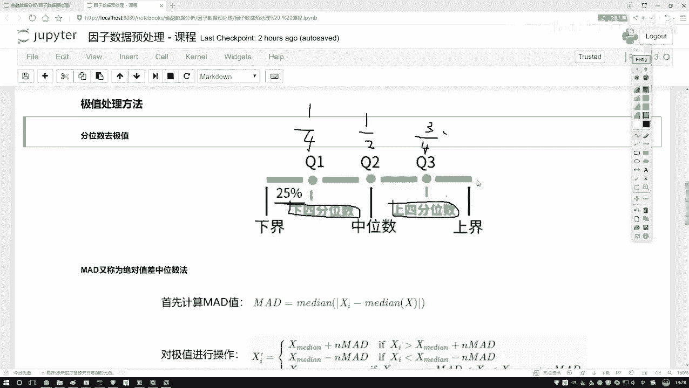