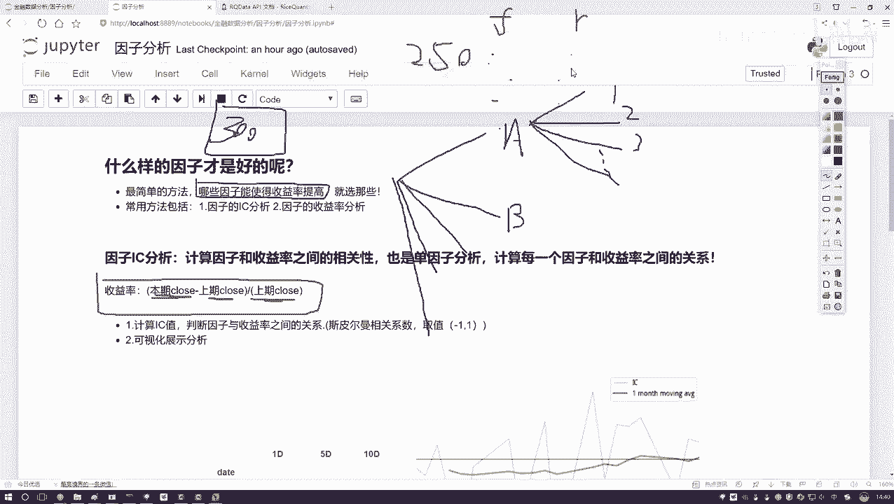
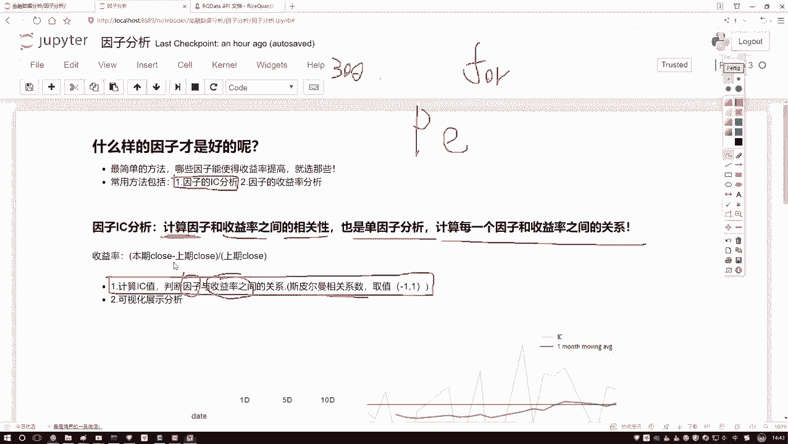
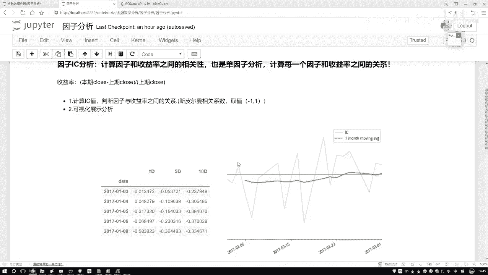
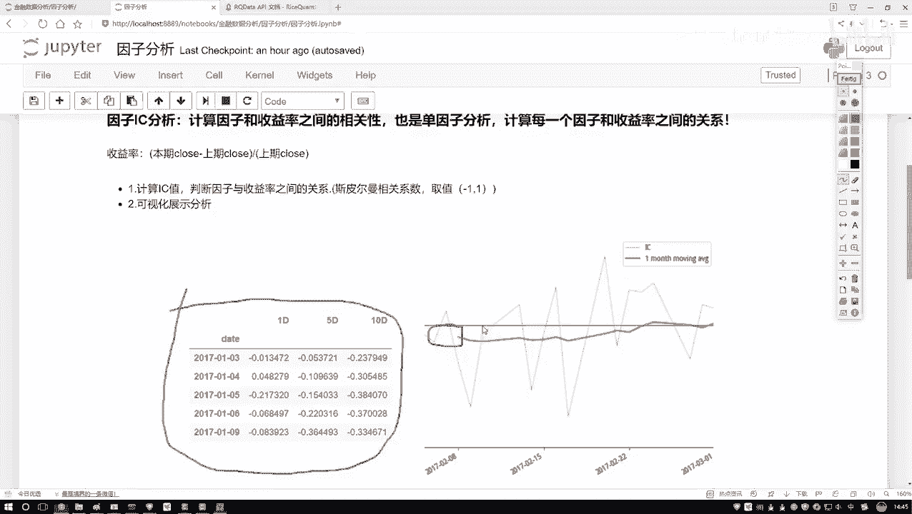
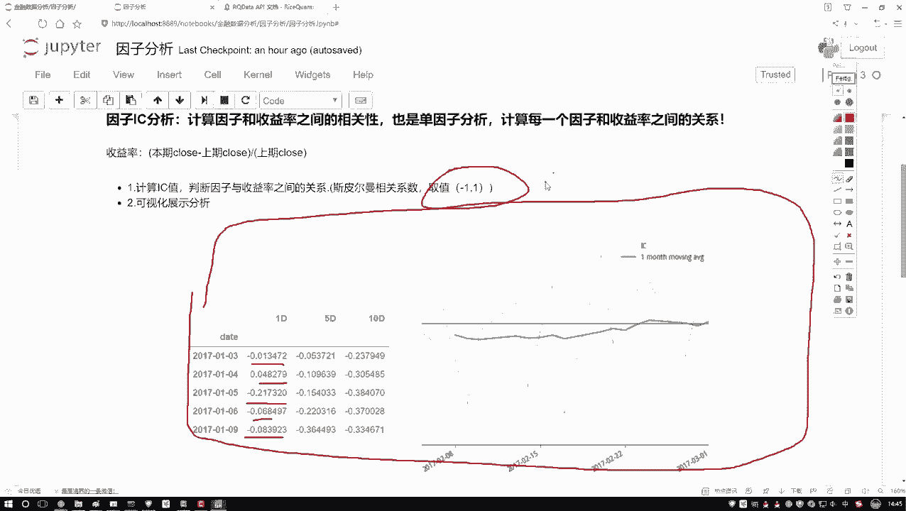

# 学完血赚！最强人工智能数据挖掘实战【Python金融量化分析】，非常适合新手！即练即会！！！ - P40：40-因子分析概述 - 迪哥小助手 - BV1URsfeqEQ5

这节课啊咱们来说一下因子分析啊，今议大家解释一下我们要分析的一个目标。好比说现在这样啊，我们拿到了哎股票当中啊很多的一些因子数据。那比如说啊咱们现在啊就是每个股票我都能取出各种各样指标吧。

那指标随便列两个。比如大家常见的一些基本面信息，我写个哎还有一些技术指标的是也可以啊。那这一块如果说咱再往下去画。那我们的因子能分成好多大类吧，有很多大类的因子，然后呢，每多每个大类因子。

比如说基本面当中的那你还能再细分吧，再细分个123点点一直好多好多个吧，各种各样指标。那问题来了，那比如现在你手里啊，你能拿到有这么300个指标。😊，或者说你手里现在有300个因子。

那你说这300因子啊，一会儿当我要做一些回测的时候，或者说我要设计策略的时候，咱们是都用呢，还是用部分几个呀？我们是不是得做这样一件事判断一下什么样的一个因子哎，是我想要的，什么因子是我不想要的。

换句话来说，哎，现在300个因子，我们给他放到这啊，要干什么？我说给他们做一个排序吧，按照他们的一个成绩，什么叫做一个成绩呢？哎，比如因子我说按它呀对我最终的一个收益的影响，我说给打分吧，有打98分的。

哎，因为这因子挺好的，有打979695哎一照零分是吧？把这些因子从上到下我能不能排一个序啊，好人来说能因为每个因子对最终结果影响是不一样的吧。那现在我们就要做这样一件事啊，看一看什么样的因子啊才是好的。

那怎么看才是好的呢？其实最简单有几种方法，在这里给大家教绍两种，呃，最基本方法是什么？看我们的一个收益率。😊，哎，既然咱提到收益率啊，咱也解释解释什么叫收益率。你看我这写了收益率它是这样一件事啊。

就是这个这些知识点大家简单略一写啊，都不用去记，我觉得都很简单，也没有列公式啊。收益率这样，那比如咱们现在呃，当你去统计的时候，你说你按月统计也行，按5天按一天也行，咱拿一天举例子。

那比如说你现在你想看每天的一个收益率，那等于什么？当天的一个哎收盘价减去啊上一期就是上一个交易日吧，它的一个收盘价，再比上上一个交易日，它的一个收盘价叫做什么？我们当前这一天啊，我们的一个收益率。

那其实呢是要这样一件事儿，那你说股票也挣钱。哎，是不是说我要积少成多呀，每一天要都想去挣吧。那好了，我说看一下，哎呦我这个因子啊，它也在变，我的收益率呢，它也在变。我想看一看因子和收益率。

我们现在不有好多天指标吗？比如这样。😊，现在呢我说我连续啊取了这么一年，一年可能有取到了250天吧。250天当中啊，你有这个因子，我写一个F，还有一个收益率，你写一个R。

是不是啊它俩之间会有很多对应的一个值啊，每天都在变化吧。我们需要看什么？哎呦这个因子，它的一个走势跟我收益率，它的一个走势怎么样，有什么样的一个关系呢？你是一个线性的呀，还是一个就是相关的。

还是一个不相关啊。如果相关的时候，哎，你跟我这个相传成怎么样，这正的还是个负的呀？咱要把这些指标拿出来吧。其实说白了我们要对因子，哎，就是做这样一个分析。非当中啊，咱们要做两件事儿。第一件事啊。

就是一个因子的IC分析。😊。

什么叫IC啊？呃，现谢大家解释吧？什么叫ICIC这样一件事啊，其实很简单，它算的是一个相关性的指标啊，你看这块我也写了，一会儿我们要也要去做的，就算什么哎计算一个IC值IC值是这样。

他说啊计算一下因子啊，我们的因子就是你选择比如咱们一会会选一个P指标是吧？拿某个指标哎跟这个收益率，我之间啊算一个相关性，算这个相关性啊是一个P尔曼相关系数啊。这个大家简就行。

然后它的取值范围是负一到正一越近于正一的那月正相关，月近于负一的有负相关月近于零的，表示没什么关系啊，这样一件事要算因子和我们收益率之间啊这样一个相关相关性。然后呢我们也可以把这件事叫做一个单因子分析。

哎，为什么单因子分析啊，比如现在我这个选指标当中有300个。😊，那收益率哎收益率相对来说是固定的吧。那每天什么样就是这个收益率吧。好了，那收益率啊在相对固定的前提下。

我是不是得看一下每一个因子哎跟我说一对关系，第一个因子跟收益率的关系，第二个因子，第三个一直到第300个吧？所以给我们的感觉啊，一会儿哎我们可能会做一个负循环，是不是在这个复循环当中啊要去遍利啊。

每一个因子跟收益率啊之间的一个关系，计算它们之间的一个哎次平脉计换系数就行了啊。然后呢，这个是我要去自算。哎，那计算结果叫什么？😊，因此和收益率之间的这个斯皮尔曼消换系数。

我们计算出来的结果就把它呀叫做一个IC值了啊，这就是它的一个缩写叫IC值。然后呢咱们来想吧，那你说你计算出这个IC值之后，我是不是得看一看它的IC值的一个大小啊，那下面我们还要做一个分析操作，在这里呢。

比如说。

呃，左边这个就是我们一会儿要去做的一个结果。那这里是统计了每一天，然后它的一个IC值，然后它的一个变化情况。然后右边这张图呢就是呃蓝色这条线，他画的，你看这块写的比较少，就是画了几个月的时间。

蓝色这个就是它的IC值，然后它的一个就是它的一个那个折线图啊，统计出来了。然后绿色的就是它的一个。均线图啊，均线图当相当于就是呃你不是一天一天的，你可以是10天的统计个值，10天统计个值。

因为你看前面它有个空值吧，相当于这个是个窗口统计均值，这个在一个窗口在一个窗口统一均值。哎，这是一个均线啊，这里给大家看了一下，就是一会儿啊，我们要做一几个指标，大家先不用去管啊，这些数值，这些东西。

我们一会儿怎么去做，一会儿代码当中啊，咱为大家慢慢去说啊，怎么样画这个图以及怎么样把这个结果给它呈现出来。然后呢，你看这个技术当中啊，它是什么？是不是有一些正负值啊，哎，像我才说的。

我们有一个取值范围吧，负一导致正一之间，我们要找啊看一看哪些因子跟生域之间关系越大关系越大的，我来挖掘一下，它跟我什么关系，是不是说这件事做的越值得呀，那跟我的没什么关系的。

或者说你这个这个东西反而会影响我的，是不是干脆咱不管就行了啊，这个就是一个因子分析啊。😊。

