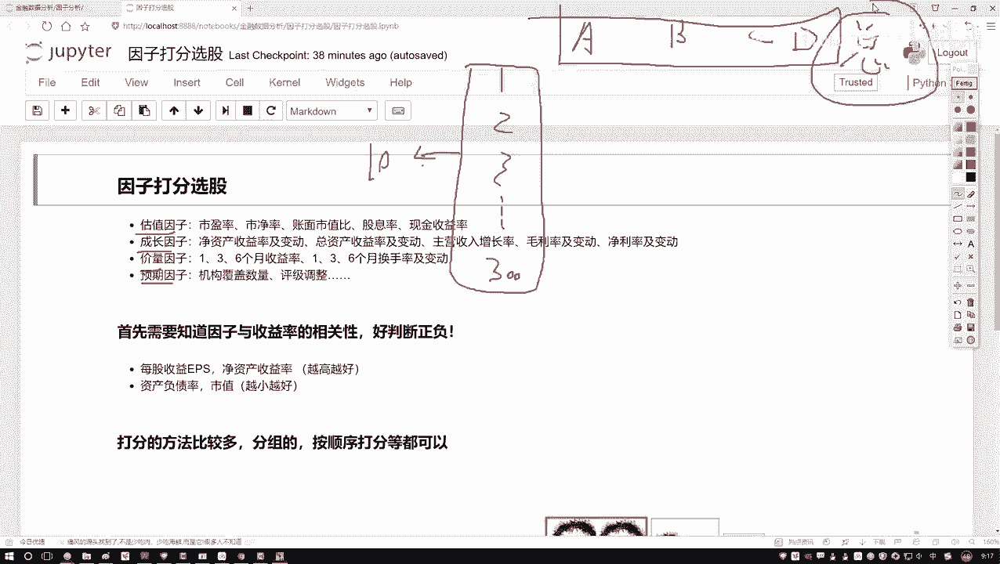
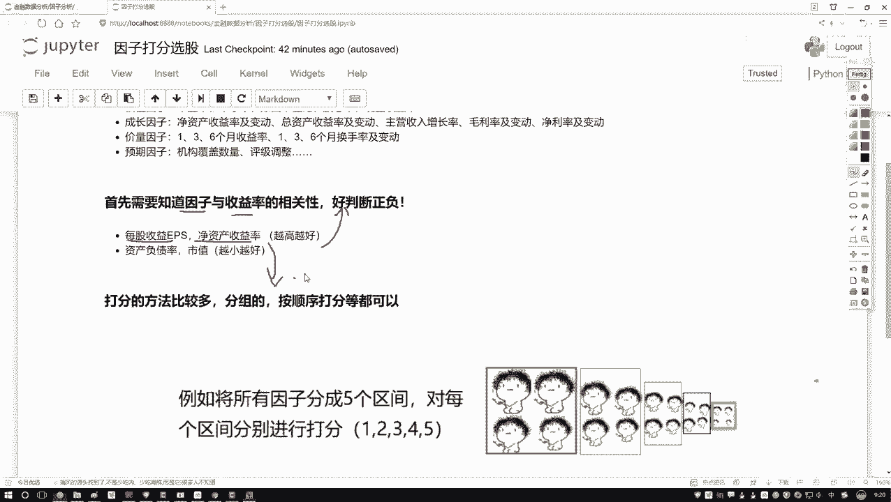

# 学完血赚！最强人工智能数据挖掘实战【Python金融量化分析】，非常适合新手！即练即会！！！ - P48：48-打分法选股策略概述 - 迪哥小助手 - BV1URsfeqEQ5

这节课咱们来说一下，就是在我们选股过程当中啊，经常会用到一个策略，叫做因子打分选股。先从这个名字当中啊给大家解释一下啊，我们都要对因子啊做一件什么事儿。之前呢我们也说了好多次这个因子啊。

归大家都比较熟悉了。哎，有一些大因子将是估值的成长的价量的预期的。然后呢在每个大的因子当中啊，还有一些哎巨值指标，比如说咱们接着唠叨市盈率啊，还有一个市净值，哎，还有一些其指标。

这些啊咱们之前呢给大家举例说过，那我们之前讲的过程当中述说这样一件事，有一个股票当中，哎有哪个因子。然后呢我可以通过一些方法啊，比如说算一些IC值，哎，或者一些其他的指标来判断一下当前这个因子啊。

它是好还是不好。那跟我们的感觉好像是哎呀你说这个好还是不好。那就是说一个股票还还是不好。那直接啊是由某一个因子所决定的。之前我们交易过程当中好像有点单一了吧。哎，每个因子算一个IC值。

那这种方法好像是只看一个因子哎去选择个股票，那今天啊咱们把这个策。😊，再给它放大一点，再作为综合的相应这样一件事。哎，比如说我给大家画一下我们数据啊，我数据当中有些股票，那比如说有这个1231至第二点。

哎，咱们说三00股票吧，然后呢300股票当中啊，我们现在有的，那不仅仅是一个指标了。我说现在有这个ABCD我有4个因子指标行吧？那好了，我说咱们要做这样一件事，在这300股票当中啊，我说咱不全用啊。

我们要做一些调仓的操作，每个月做一次，这300个当中，我说你给我选出来10个或20个是不是都行。那我问大家，那这10个，我们该怎么选啊？那家肯定会想，哎呦哪一个能让我赚的更多，我选哪一个呗。

那怎么去衡量呢？我们是不是说啊现在有这么四个因子ABCD啊，那我们得看一看ABCD这4个因子分别对我们最终的一个收益情况，哎做出什么样影响。那我观察一下，比如说A因子当中，哎。

我选什么样的A因子能使收益率最高，哎，B因子DC因子D因子是不是一样的呀。😊，但是呢给我们感觉好像这样，你单独看A呀，单独看B，单独看C和D。那好像只是一个方面。我们现在还没有说什么一个汇总的吧。

一个总体。所以说这里哎我说我再加一列吧，最后一列啊表示的是我一个总体，我就写个总得了。那好比说这样一件事儿，我说ABCD吧，那我呃不说你这好还不好了，说好还不好，有点太笼统了。

我说这样你给我具体打上一个分。比如说呃对于低个股票来说，哎呀，A因子打10分，B因子打了15分，CD因子分别有分吧。那好比说这样就这样一件事啊，你说啊你最终的一个考试成绩。

是由你各科的成绩的一个总分来决定了，行吧？A表示语文B表示数学哎，C表示天文D表地理行吧？那他最后算出来一个总分，我们把这个总分，我说我给他排个名，哎，300股票总分，我一旦都算出来之后，我说我排名吧。

排名完之后，我说我取个前十，那是不就行了。前十哎就是整体成绩，我认为最好的。那下一次调仓呢，我就可这10个来哎，这个是不是一种策略啊？这个就是我们现在所说啊因子选啊因子打分选股，咱们大概啊要做的一件事。

其实呢就是我们需要把最终的一个总分给它求出来。行了啊，这个是我们最终目标。一会儿呢咱们会到这个平案当中啊给大家演示啊，咱们怎么样去求这个总分的。然后这里啊咱们还得有一些条件啊。

就是当我们在做打分的过程当中，哎，我们得有一些已知条件，或者说得有一些先知是吧？

首先第一个我们得需要知一个指标啊，就是因子哎和咱们这个收益率。我们的一个相关性吧，或者说它们之间啊哎是一个正的呢，还是一个负的呢？什么叫做一个正和负啊，咱之前给大家讲那个因子分析的时候。

是不是说了有些因子哎越大的时候，哎你的一个收益情况可能越好，你说因子呢你越小的时候，你的收益情况可能越好，那我为什么事先要知道一个越大还是一个越小啊，因为我们一会要打分啊，打分的过程当中。

我们是不是说要基于因子的一个数值，哎，看它数值大小，不可能是数值越大的，我也打分越高，还是数值越小的，我给它打分越高吧。那既然我们要打分。那所以说你的一个评判标准，你得先告诉我呀，那大家可能会问哎。

这个指标啊，比如现在这里我随天列出几个指标。比如说每股这个收益，还有呢一个净资产的一个收益。那对于这两个指标来说，哎，那我怎么大家可能听着这个名字一听就越大越好啊，那我怎么知道呢？你可以呀从。😊。

过一些研究报告，那可能各个证券公司它都有每就海了去了各种研究报告里边，我们都有一些现验值，或者说都有一些经验值可以做参考吧。另一方面呢，咱们在讲那个因子分析的时候，我们是不是自己也能动手去计算一下，哎。

到底是我们的一个正的，它还是一个负的，哎，这个相关性吧。所以说啊首先第一步哎我们得有一个经验知识，你也知道啊当前你选因子，那是大了好还是小了好，这个呢咱们就得当做啊它是一个已知条件了。

一会儿啊咱们在那个哎实际的偏I听平台啊写策略当中。我们啊也会哎选择出来几个因子，那选出来因子其实啊都是我们已经事先知道的。比如热点。哎，我们说选择两组吧，那一组是越高越好的，一组是越小越好的。

这个哎是我们的一个已知条件，也是咱们所必须啊需要去预先知道的一个先验知识。好了，那这个是我们的一个已知条件。

