# 学完血赚！最强人工智能数据挖掘实战【Python金融量化分析】，非常适合新手！即练即会！！！ - P53：53-完成策略交易展示结果 - 迪哥小助手 - BV1URsfeqEQ5

接下来啊咱们来继续完成我们的rebes函数啊。第一步，我们现在选出来了当前啊呃我要去的就是当前我们排名的一个股票。然后呢，接下来啊咱们不是把这个股票拿到手了。那接下来我们是不是得看一下。

哎有现在我这个排名可能做了一些变化吧。那我们现在要再写个函数，就是呃我们手里有的和现在新的一个排名当中哎，有什么样的一个差异，一会儿呢咱们是不是要基于这个差异，哎，实际的咱们要去选一些股票。

或者说实际的我们要去购买一些股票了。好了，咱们来把这个函数完成，这个函数其实说白了就是呃去看一下当前你手里有的一个股票有哪些，然后呢我们做一个差异。好，我们现在也第一个就是现在咱们手里有的。

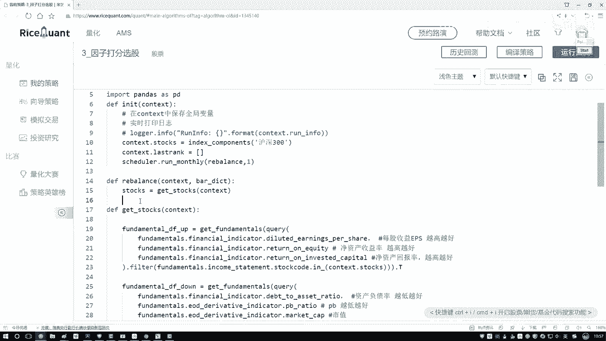

啊，咱先把手里用的股票给拿过来，把这个contexs递给我传进去。

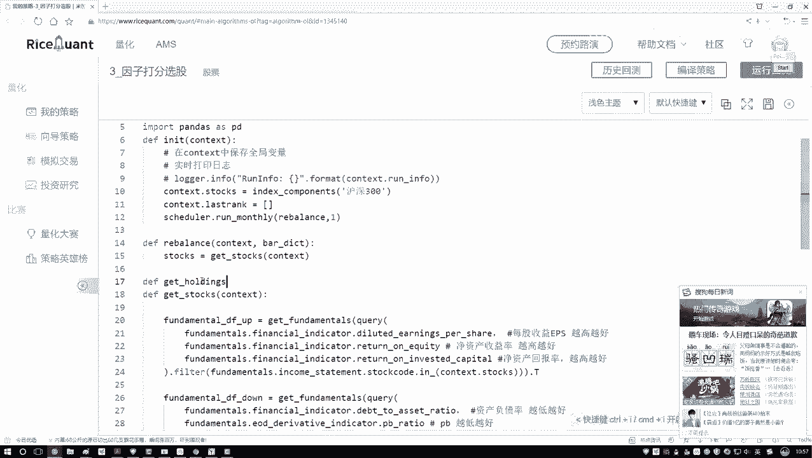

好了，在这个函数当中啊，咱们想一想做什么。首先第一步，哎我说现在这个股票当中，我是不是说看一下我的一个position它是等于多少啊IN好了，拿到我们contest当中找吧contest里边。

咱找一下咱们的用户信息里边哦这些个指标在这个指标当中，我们是不是哎把这一个position拿过来啊，跟咱之前的方法是一样的。好了，然后我说现在我呃写个名字吧。在这个获定当中。😊。

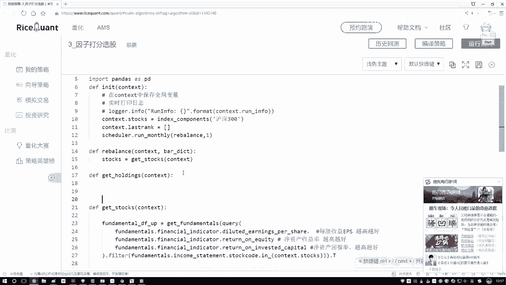

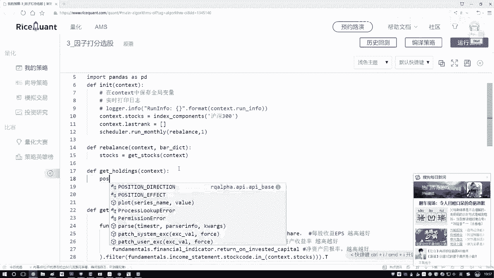

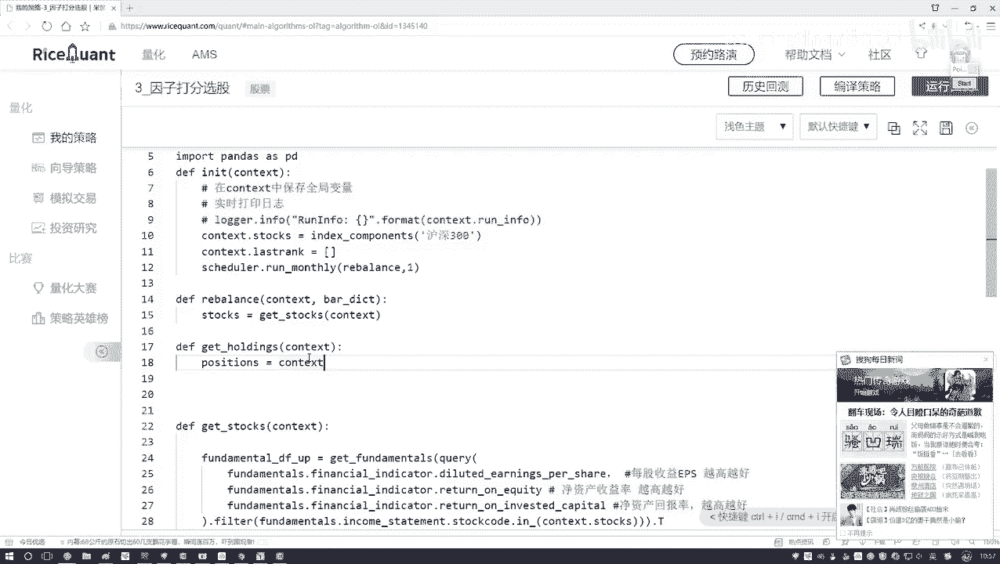

会影当中现现在它是1个加S吧，现在它是一个list。然后呢，一会儿我说把这个list做一个填充，然后做一个判断吧，for咱们的一个position。

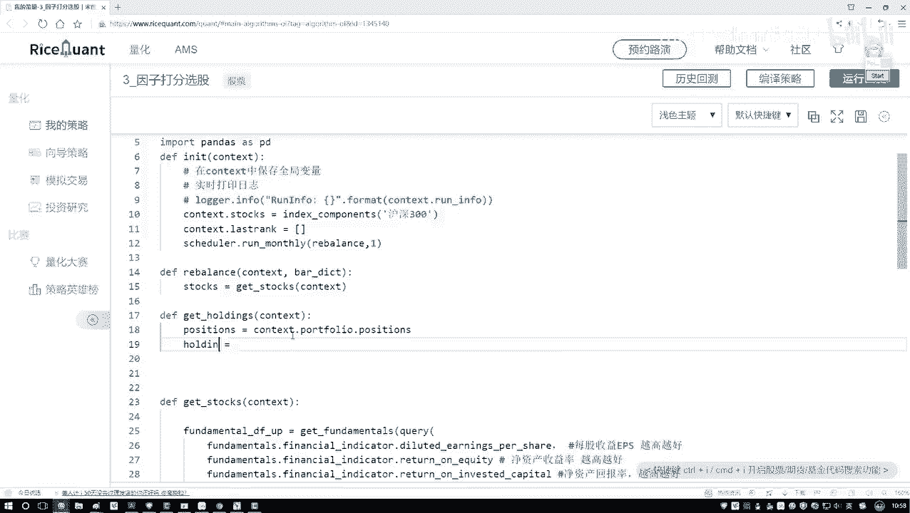

呃，在这一块for我们这个position in这些position当中。好了，看一看咱们现在这些持有的吧。如不果说哎我持有的数量只要怎么样，它大于0是不是就行了？好了，把我这个position拿过来。

呃，然后看一下，如果看一下这里，哎，我说先找到吧。啊，找到把positionition传进去，看它什么，看一看咱们拥有的一个质量等于多少吧。QUNTI这个TY然后去判断一下。如果说啊大于02。

那是不说咱们现在持有啊，持有的时候给它加进来就行了。呃，这块这块应该是个判断。如果说哎它是大于零的，大于零的情况下，咱就是持有的持有的。然后在这里我说做一个判子操作。额盘的操作。

把咱当前的这个股票给它传进来是不就可以了。好了，现在啊把咱们股票拿入手之后，那我说最后我 returnturn一下吧，return就是咱们当前你持有这些东西啊，这完事了。好了，咱们来练习啊。

现在我得到了就是新的一轮dos是排名周位结果。然后呢，接下来我说现在啊把我这个hold定再拿到手。

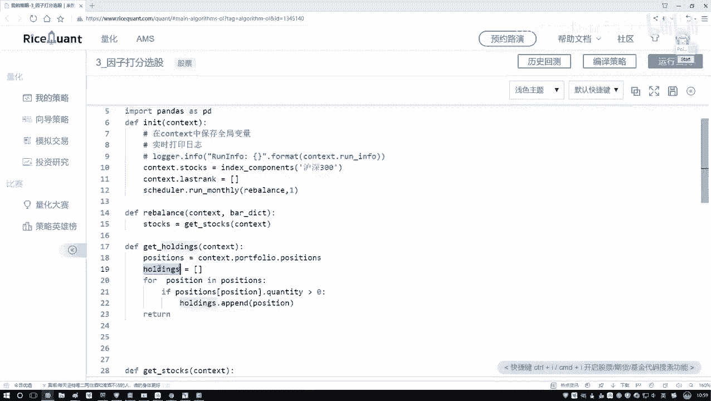

他等于去get一下啊，这就完事了。get一下咱当研结果，然后把这个contexs再传进去。那现在我说要算什么？哎，我说我得去算一下我要买什么了，那写一个to by吧，我要接下来去买的买的就是。

当前什么哎，你手里有的这些东西跟你现在新的域名之间肯定有差异吧，重复的你就不用去管了，你要管的什么差异的吧？所以说啊在这个doss当中，我们要呃在这个doss当中我们去算，减掉谁呢？

减掉咱现在手里有的这不就是我现在要去买的嘛。然后不管我要去买，然后我可能还要去卖。去卖什么意思？现在这个holding当中啊不在哪儿了，不在sts当中了。那holding里边不在style当中的。

是不是用这个holding减去一个sts当中啊？好了，我们把一个买的和卖的都指定完了。那先卖吧，应该是先卖后买吧。好了，然后我一个for stock。在咱们现在要去卖的当中。

然后咱就执行这样一个卖操作就行成了吧。然后一个alder order target value哦order target percent然后全卖掉那per就是给它变成0ta给它复制过来，然后全卖掉。

占有的量变成0这就完事了，这就是一个卖的操作。然后呢接下咱直行买啊，这我可先判断一下。如果说啊咱们现在没有买的这接 return就行。如果这个东西to bad浪值如果它等于等于0，一直股票都没有去买。

那return回去，相当于咱做完了哎就完事了。然后如果说咱要有买的。

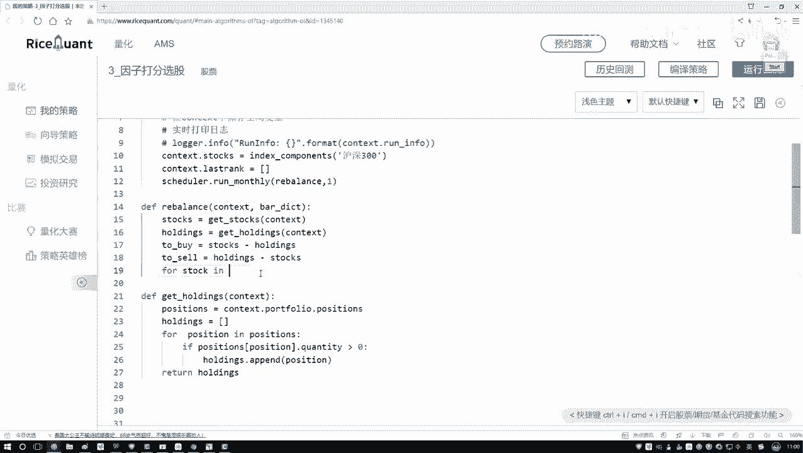

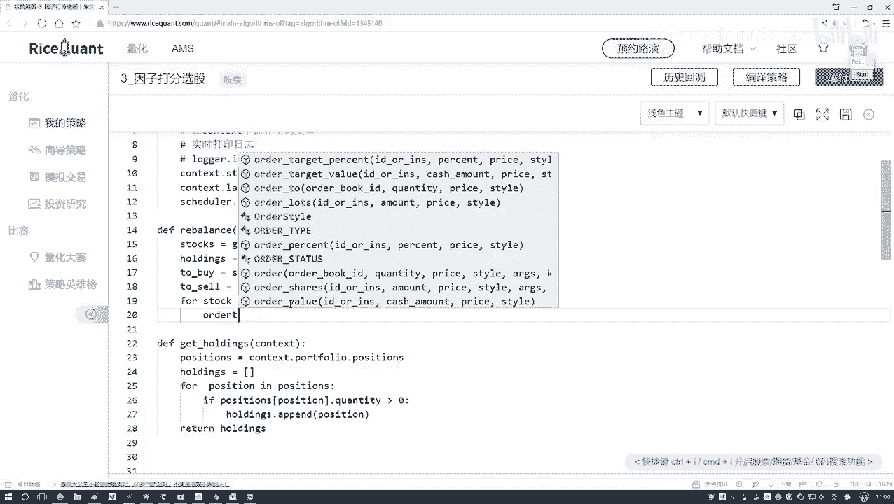

要我买的时候啊，再得看一看呃，我现在手里有多少钱。然后呢，咱平均去买是就行了。哎，比如说给大家算一下吧，咱可以咱现在啊指定个指标，就是在这个contests当中啊。

你所有的信息都能调出来你的一些用户的信息在这里。😊，啊，咱们信息当中好看一下呃，找一个Y6值，咱来我把这个直接复制过来吧。这里边它叫做一个Y6值，呃，应该是它的一个全称，然后点一下它的全称。

然后杠一个value就行了。好了，看下咱们现在呃有多少的一个资产。然后呢，有多少资产之后，然后我们要指定呃，对于我当前这个资产要判断什么。判断一下呃，当前我买股票的时候，我买一个股，然后咱买多少吧。

好了，然后咱一共是有这么多股票啊，图败当中一共是有这么股票。那它俩比一下，那就是实际一个股票当中，我们应该去买多少吧。好了，这块指定的参数叫做一个。

平均的待一会儿咱就平均去买啊erage然后一个Y9值就行了。接来呢我们还是执行这个函数，只不过说呃还是把这个复制过来吧，还是要去遍利一下。遍地在我们接下来啊，这块不是to sell了。

就是一个to buy在我们要去买的这些个股票当中呃，这就不是一个per了。我们之前不是算了你要买多少吗，那就是一个valueview。然后t当中再指定出来了，然后每一个买多少，哎。

咱指定出来是不是就行了，这样我们就指定了咱们去买的一个操作吧。那好了，现在就是基本上我们已经把所有操作咱都列完了吧。呃，回顾一下吧，看一看我们还没有什么赖的。一开始在contex当中，哎。

我说我指定个股票池子或者下当中，然后这里呢哎有一个。😊。

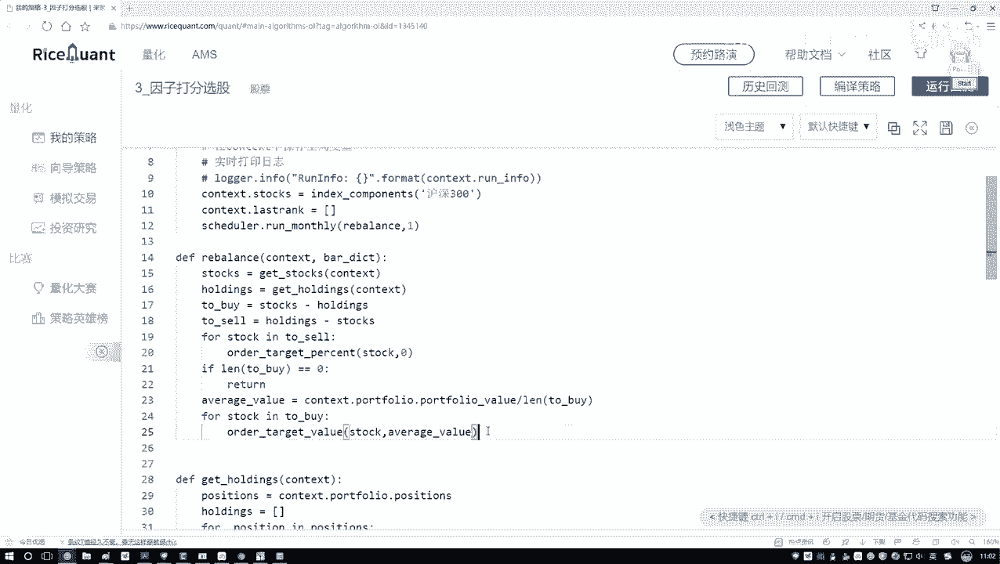

那 rank就是我们上一期咱们的一个排名，嗯，咱们现在暂时还没用上这个结果是吧？一会咱看会不会用把国邮给它注释掉吧。然后说每月咱要做一个调仓操作，然后每月呢在做这个调仓操作过程当中，说我先去算算几个值。

哎，先算买什么和卖什么，不是，就是现在我算一个新的排名的值，然后呢再算我手里有什么，然后接下来我说基于他们的一个差异，然后去买还是去卖哎，这些操作都没什么问题。然后呢，主要还说啊就是我们这个get当中。

咱去查这些指标，然后把这些做一些筛选是吧？行了，基本上没什么问题啊，咱写完了，这样咱运行一下，看一看有没有什么问题，我估计可能会报错。😊。

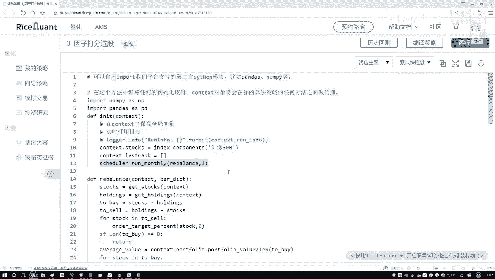

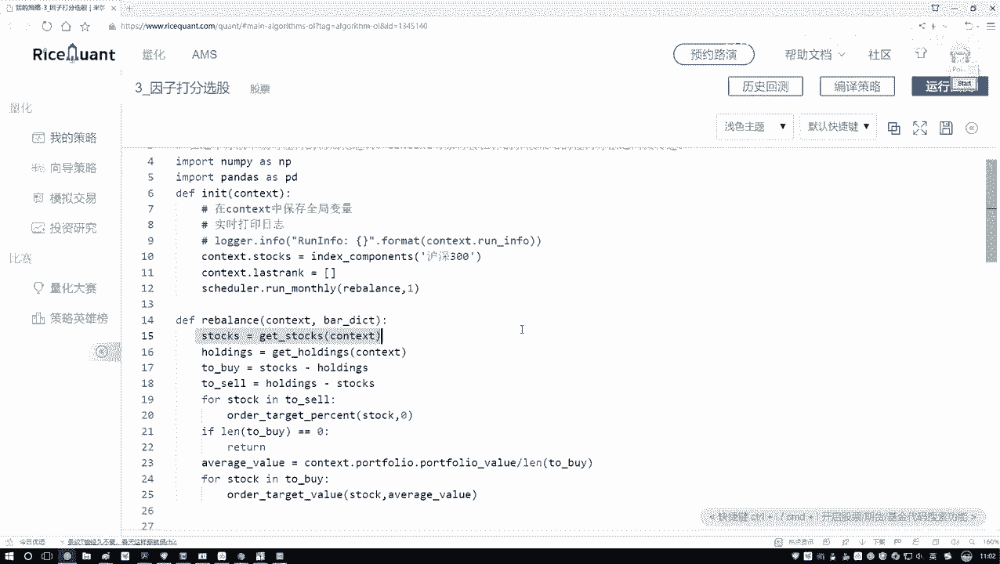

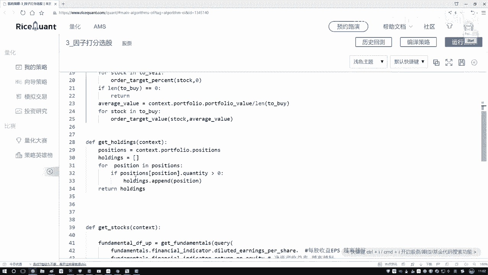

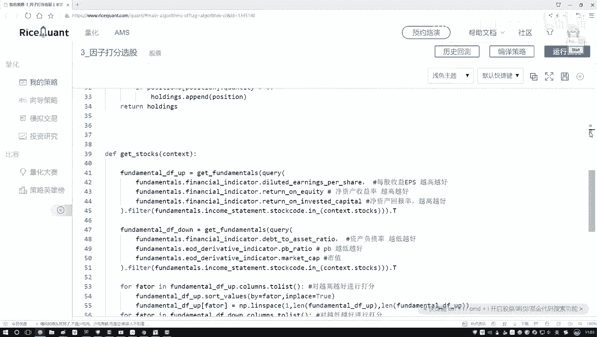

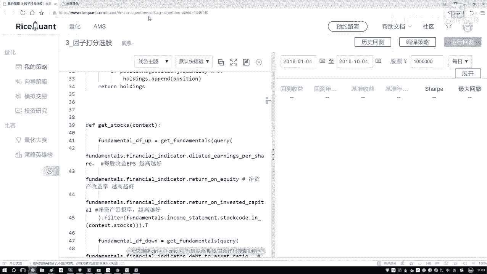

遇到报错没关系啊，咱们来改一改。不过现在这个pas没用上的，咱就全都给它pass掉。然后看一下结果吧，这时可能会报错，来看一看。

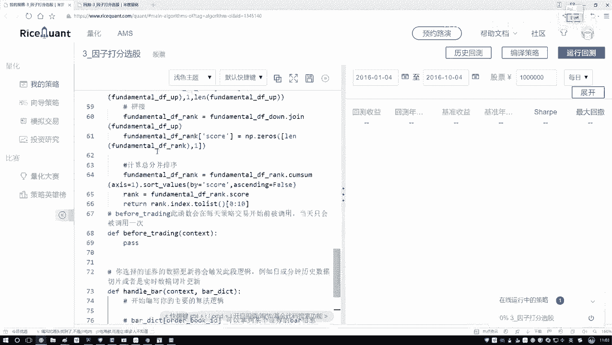

看数日结果写这报错了，他说啊现在这块有一个无效的字符，呃，找一找，他说每股收EPS那看一下。

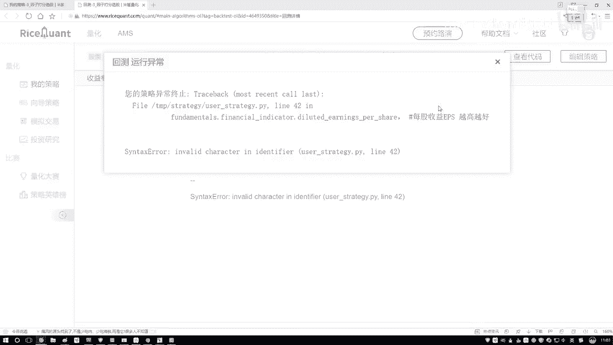

在咱们当前的给他还是放放右边。

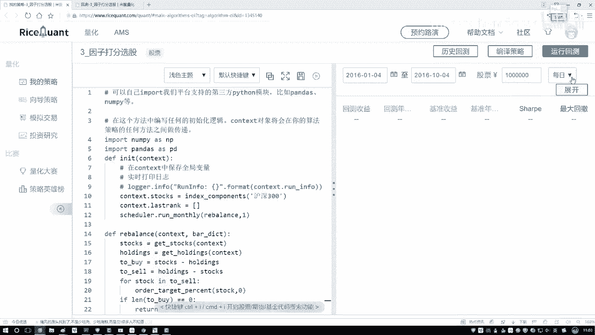

每股收益EPS这来找一找，在当前这块，他说有一个特殊字符呃，fuamentals点，然后去查找。哦，这个写错了是什么？写成了一个中文逗号是吧？好，再执行一下。哦，我我顺便哎算了，这块先给它Q掉吧。

我发现几个毛病，这块它也是一个重要逗号是吧？咱都没注意，然后这块，然后这里这块又少写了一个逗号，我们再再加上这块，它也少写了逗号，也加上这里也是一样的，咱有点小毛病，给它稍微改一改。

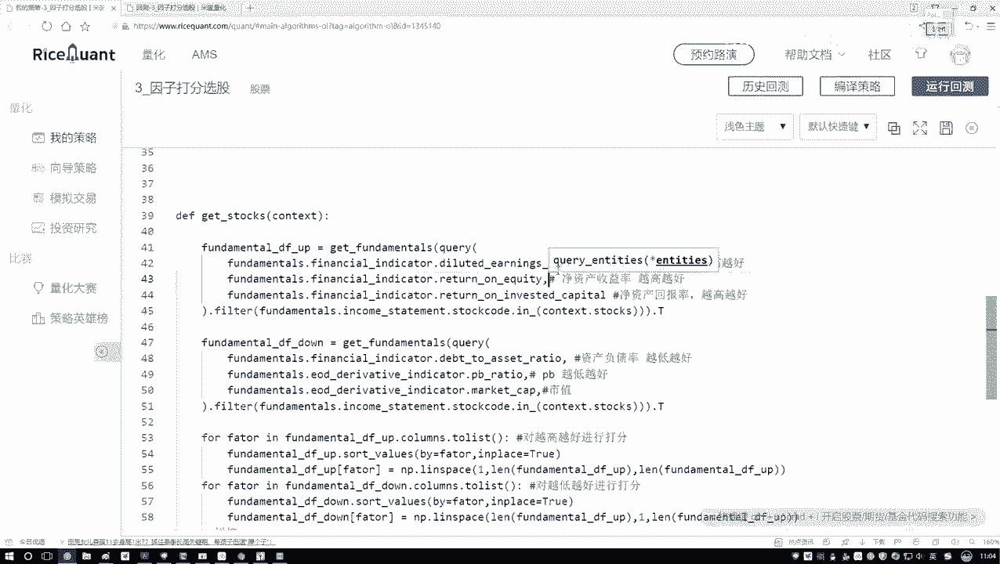

好了，这块都有一些逗号，然后再往看看啊，这都是在执行吧，看看有没有什么问题。

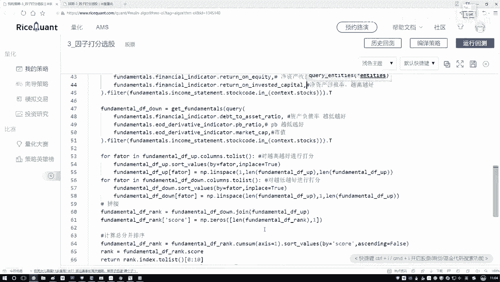

呃，他只想让我顺便先过一下，简单找一找有没有什么太大问题。然后这里看起来都没什么问题。行，看结果吧，看报不报错吧，看报错咱们来改。

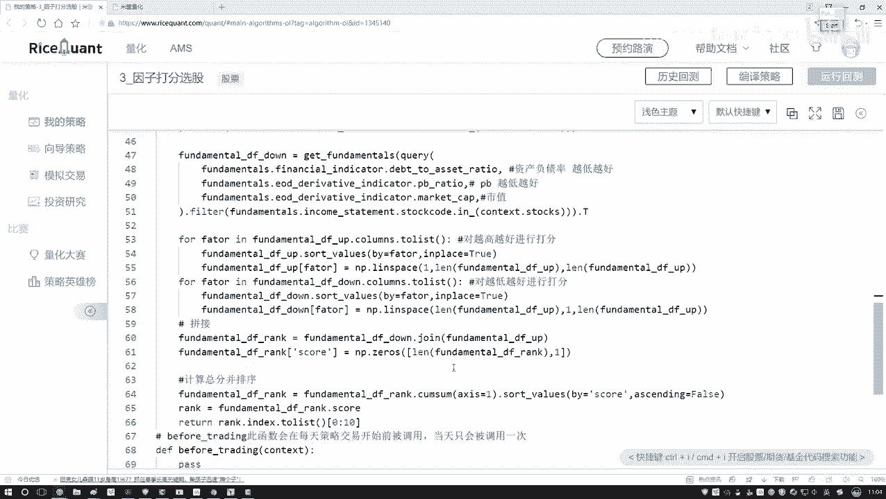

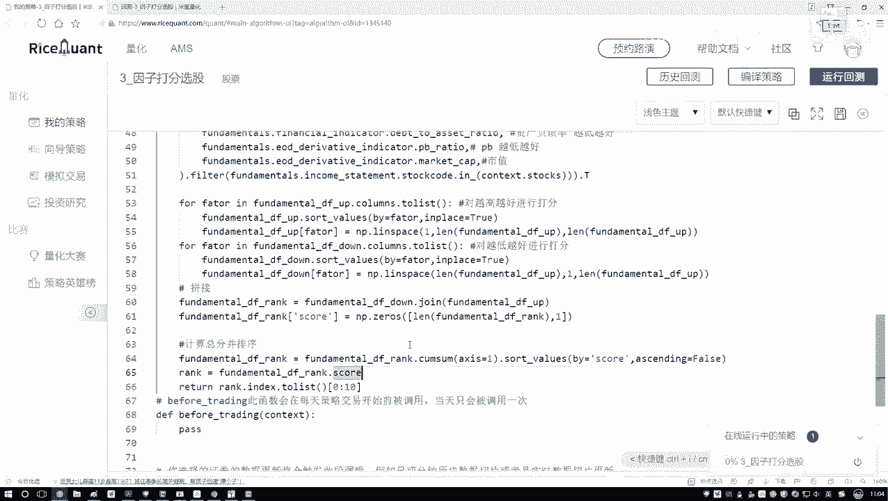

呃，他说不支持类型，然后list我看在哪儿啊，在这个to by当中啊，等于这样一个减法来看一下，我们现在啊设计了一个to by。我说现在啊我要去买什么，等于我的一个t减去我当前的一个hold顶啊。

这块不行，那我们得做这样一件事，我也给它做成一个s集合，这样吧，咱把它全部处理成一个s集合。

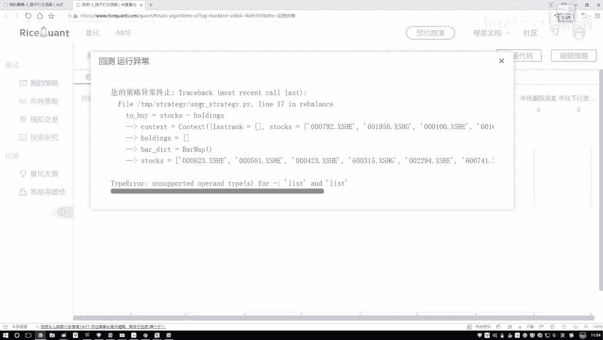

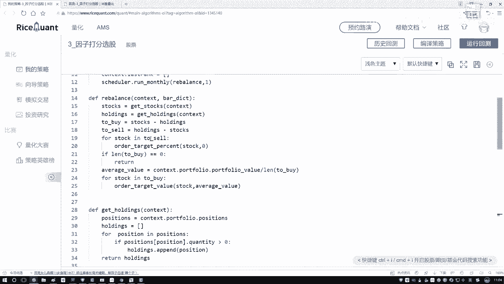

这一块我说也处理剩菜的集合，处理成菜的没问题吧。好了，这样咱来看一下，应该就能执行我们的一个差异的一个操作了。这个关掉看一看。哎呀，咱这块还有个东西忘设了，就是咱们的一个时间呃，时间先不管了。

就是从2016年1月4号吧，到2016年1月10号，这无所谓了，反正就是这些时间吧，咱不管了。然后一会儿我再改时一间，咱们来观察观察。

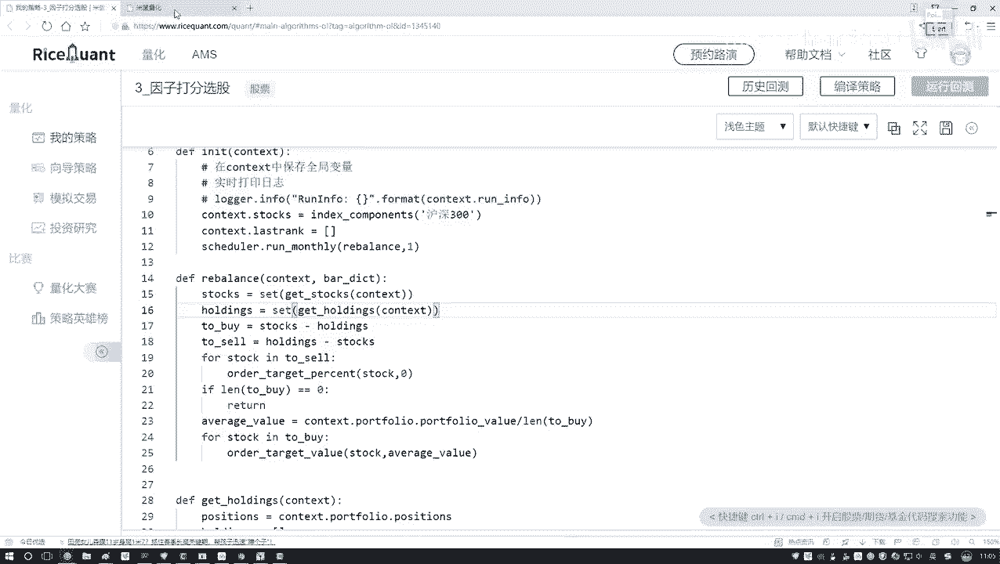

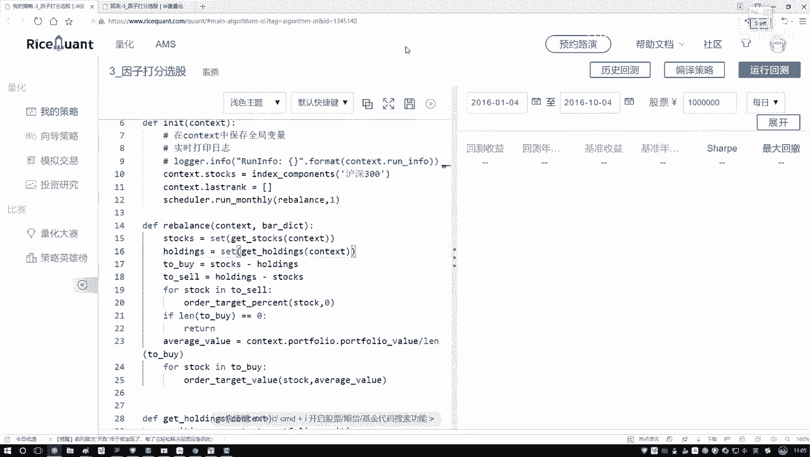