# 学完血赚！最强人工智能数据挖掘实战【Python金融量化分析】，非常适合新手！即练即会！！！ - P1：1-课程内容与大纲介绍 - 迪哥小助手 - BV1URsfeqEQ5

だけスタ。

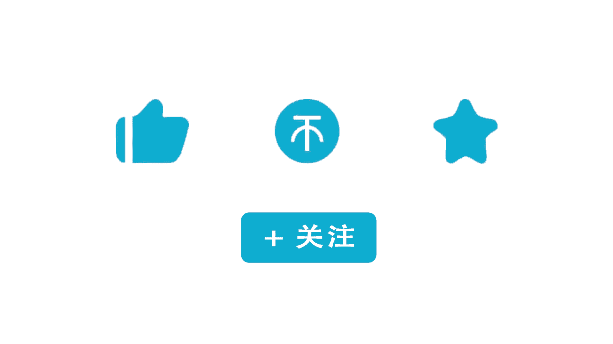

第一节课先大家从整体上来介绍一下咱们这门零基础python金融分析与量化交易实战课程。我们的内容安排。咱们课程当中啊主要涉及到了三大模块啊，分别是啊我们的python数据分析和处理。

在这个数据分析和数据当中啊，会给大家去讲啊，怎么样用python哎去玩咱们的数据，怎么样处理数据，怎么样分析数据。然后呢第二模块是涉及到我们的一个金融数据分析了。也就是说啊我会拿到一些股票数据。

对股票数据当中，哎，我们都能做哪些个操作做哪些个分析，以及呢对这些时间序列啊，咱们该怎么玩。哎，这个是我们第二部分，第三部分我们要选择哎一些量化交易的策略了。比如说咱们现在啊写一个策略。

那这个策略究竟能够挣多少钱呢？咱们要在啊这个历史数据当中哎做这样一个回测，通过回测，咱们来分析分析我们这个策略到底是好还是不好。好了，这个就是咱们的三大核心模块，先大家简单介绍一下。

一会儿呢会给大家来看我们的详细的大纲。😊。

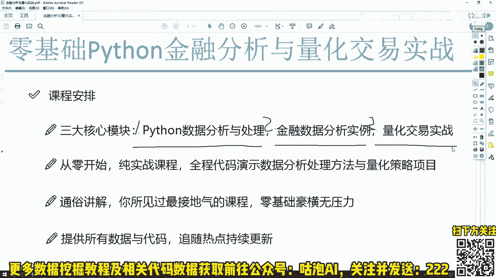

接下来给大家先来看一下，就是嗯咱们在讲解过程当中啊会用到的一些工具吧。现在啊就是我打开这个界面啊，就是我们课程当中啊讲解的一个界面了。咱们这个课程啊是没有PPT的啊，不会给大家去讲哎。

这个金融的知识也不会教你怎么去炒股，我们的重点啊是在python当中，怎么样实现出来这些任务，怎么样把我这个任务给它做出来，怎么样去分析哎，怎么样做回测，怎么样得到一个结果。所以说啊我们的重点是什么啊？

全部要放到代码当中，整个的课程来说啊，它是一个纯实战的一个内容啊。每一节课我们都给大家讲啊，在代码当中，我们会怎么去做。所以说最核心呢就是我们怎么样python处理数据去玩数据去做回测。

哎去完成我们的一个量化交易的策略。好了，这个就是我们课程界面啊，可能大家现在对这个界面还不太熟悉。没关系啊，等咱们正式课程当中啊，我会详细给大家去讲我们这些工具该怎么样去用啊。

咱们这个代码该怎么样使用起来。😊。

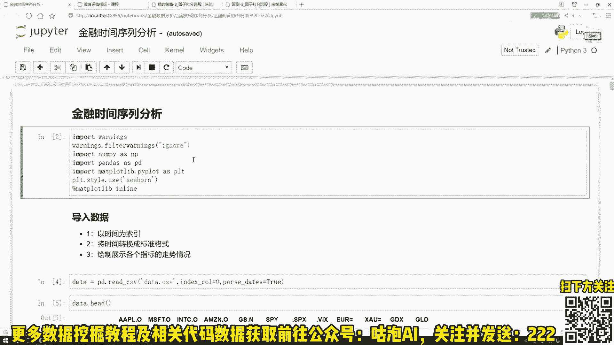

在交易过程当中啊，咱们全部的课程内容啊，都是以这个实践数据为例子给大家来做这个引入的。会给大家去讲啊，在这个数据分析当中以及金融数据，还有时间序要当中，一些常用的分期，还有统计方法。

咱们一步一步该怎么样去做啊。这个是我们的呃第一模块相当于啊我们要掌握唉这些python工具包的使用方法，以及呢对金融数据，咱们该怎么样去玩啊。这个是咱们的一个notebook啊。

主要给大家演示我们怎么样用python这些工具包，并且呢完成一些啊数据分析的案例的。然后呢我们再看下一个。

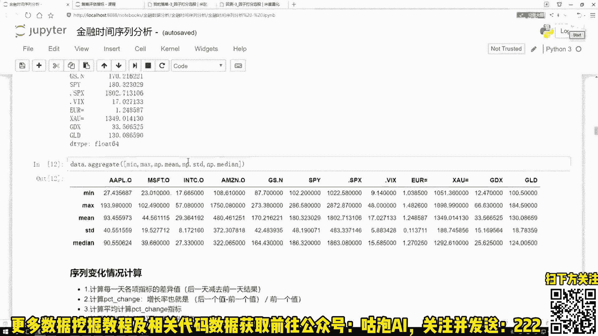

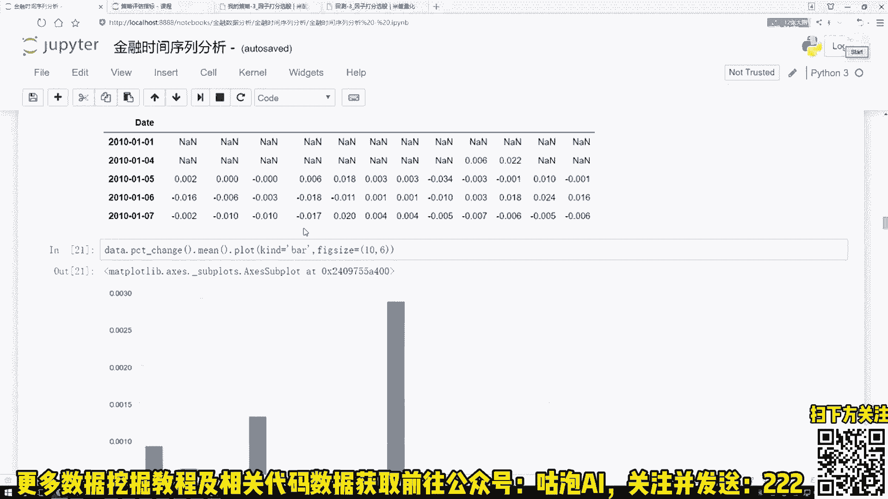

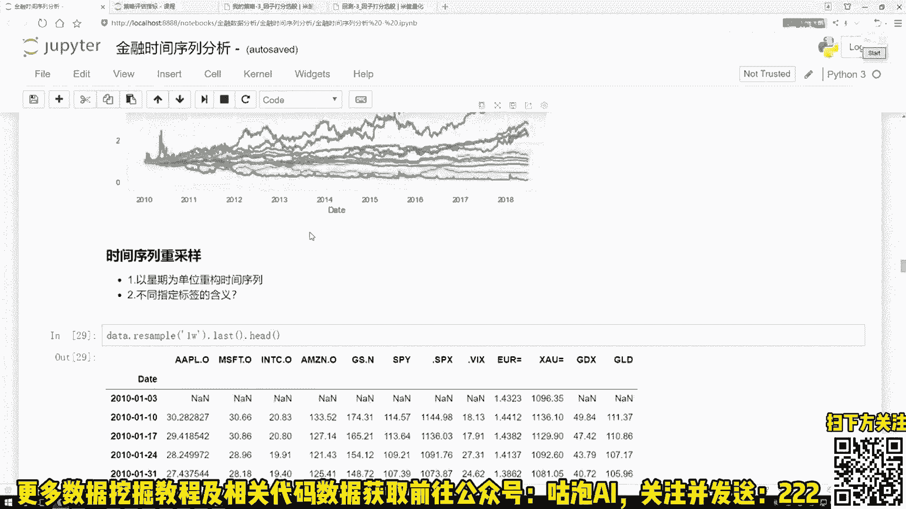

下一个当中啊这个也是类似的。这里就是我会给大家讲接下来我们要用到的一些回测的平台。比如说现在我有了一个量化交易的策略，我脑子有个好想法。我说我想把这个策略给它实现出来。

然后呢看一看啊这个策略在历史当中吧，比如说从这个19年到20年这么一年吧，如果说我用我的这个策略，咱能赚多少钱啊，咱要玩这样一件事，也就是一个量化交易，在量化交易当中啊我会给大家去讲啊，每一种指标，哎。

比如说一些回测收益啊，还有一些超额收益，咱们都该怎么样进行获取，以及呢各个指标啊，它都是什么样的一个含义。并且呢要把咱们的项目，还有我们任务用到哪啊，应用到啊我们的一个回测平台当中。

什么叫做一个回测平台啊，这个就是咱们实际啊写一些回测策略的时候啊，会用到的一款工具。我先不介绍等咱们这治过程当中会详细给大家去讲啊，这些工具。哎，这些平台我们怎么去做。这里这个意思啊，就是。😊。

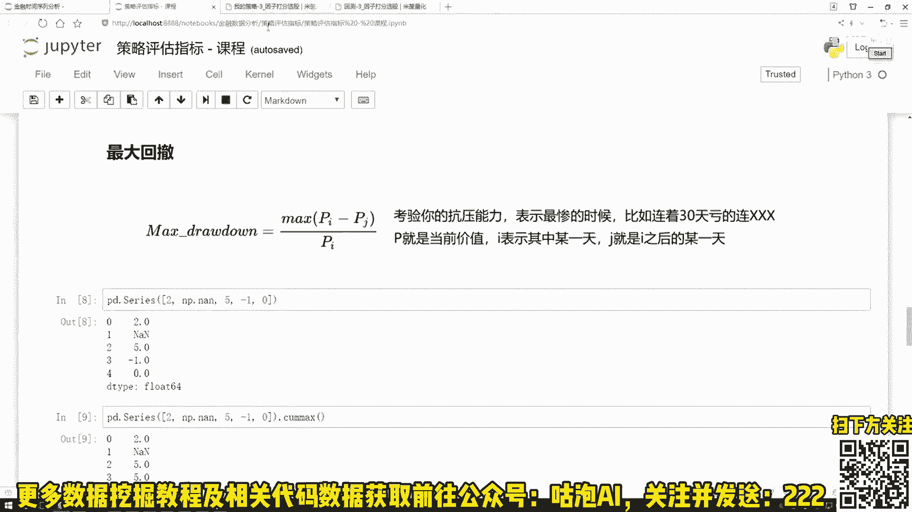

当我们现在有了一个策略之后，我想把这个策略啊，像我刚才说的用到历史数据当中，看一看呢咱的一个回测结果啊。你看这里我们写了好多策略啊，就是会有一些方法以及计算，还有一些筛选，然后呢写完策略之后。

我们要运行一下，运行完这个策略之后啊，我们可以看一看啊，在这个一年或者是3年5年当中啊，如果用咱们当前这个策略，我们得到的一个结果，或然后呢我们还会跟这个大盘啊做比较。

也就是咱们当前我们的一个回测收益跟一个基准收益来比，哎，咱们到底是赚了还是赔了，以及呢当前我的一个策略来说给我来能带到能给我带来的一个超额收益，哎是有多少的。这个就是我们的一个分析，还有展示的一个结果。

相当于啊这里哎我们去写策略。然后呢接下来我们会执行策略，得到咱的一个结果，在这个结果当中啊，它包括了。😊。

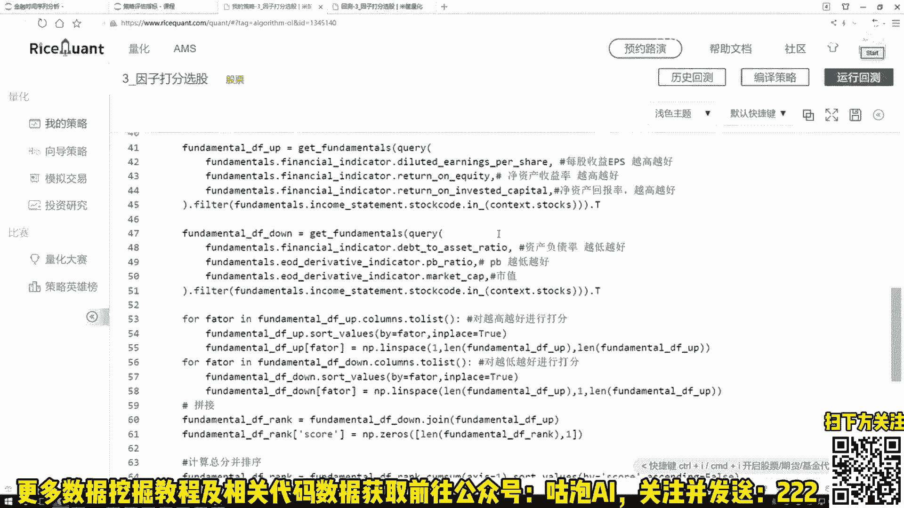

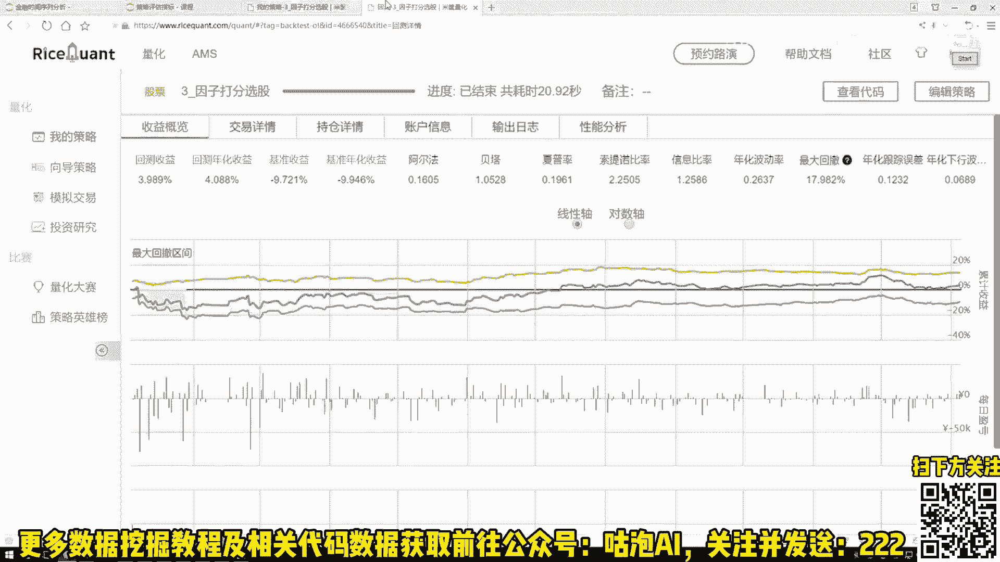

我们详细的一个就是交易的详情啊，在这里每一天你买了什么东西，买了什么东西，以及呢当前你的一个持仓情况啊，还有你的一个账户的信息。比如说啊我给你102块钱，然后呢，经过了一定的周期，哎。

比如说是个三年或者是5年之后，看一看这笔钱让你糟进的还剩多少钱了。到底最后啊咱们是一个赔了还是一个赚了。行了，这个就是在我们的一个啊回的票当中啊，我们可以观察到的哎一些个指标值。😊。

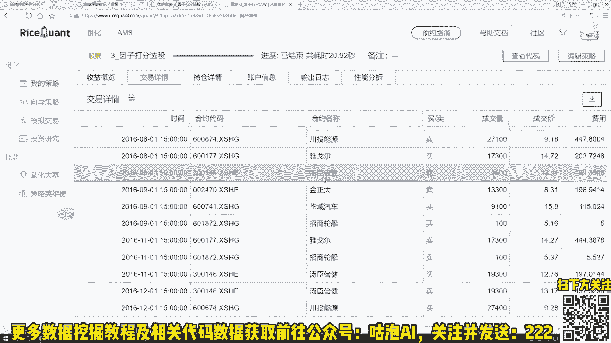

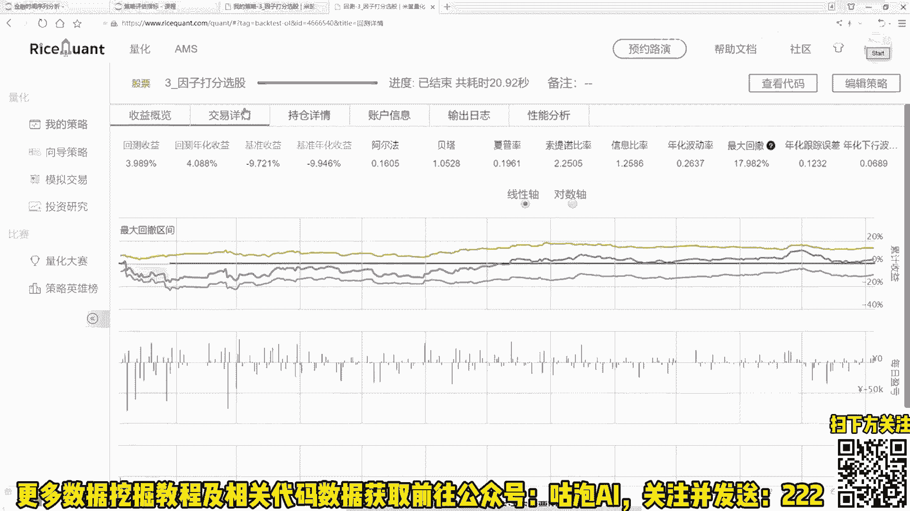

好了，这里啊跟大家简单的介绍了一下，就是我们的几个核心模块。刚才我也说了，就是我们的课人来说，哎，是从一个零基础开始的。大家如果觉着啊就是以前啊我对pyython不熟悉。没关系啊。

我们课程当中啊会先给你讲python怎么样去用python工具包怎么样去用，以及呢怎么样把python融入到啊这个金融数据，还有量化交易，哎，实际的项目当中的。

所以说啊咱们的哎是一个零基础开始纯实战的一个课程。我们的核心重点啊都是放到怎么样在代码当中实现哎，我们这些个功能，并且呢咱们在讲解过程当中啊，哎我的一个风格就是会比较通俗啊，用一种比较接地气儿的方式。

哎给你去讲这个东西哎这个工具包怎么样去用这个策略，哎，咱们怎么设计，怎么样在平I当中完成咱们这样一个项目。所以说咱们这个策略啊是一个零基础豪横无压力啊，这是咱们的一个风格。

然后呢并且啊在咱们的学习过程当中，为了方便啊大家自己做练习，哎，自己做一些小任务。😊，我我会给大家提供咱们课程当中啊所有我们但凡涉及到的这些个数据，还有代码啊，就是但凡用到的东西我们会全部提供的。行。

最后给大家看一下我们的一个课程大纲吧。大纲当中啊咱们也是分了三个模块，我一个一个给大家来说一下第一模块就是一个thon啊必备的工具包实战。咱们刚才啊既然说了，哎我们的课程它是一个零基础无压力的。

所以说第一模块我先议大家去讲啊python当中哎最基础最核心的一些知识点，以及呢咱们课程当中啊会用到这些工具，我们该怎么配置怎么安装啊，这是第一模块，我们要打基础的。

并且呢我们还会讲on当中两个非常重要的工具包，后续啊也是我们主要依赖的一个叫n啊，主要是做一些数值计算的。第二个呢叫s，主要是做一些数据分析，还有处理工作的。这个是我们第一模块当中啊。

主要是讲给thon相关的分析，还有处理的这些工具包，咱们该怎么样去。

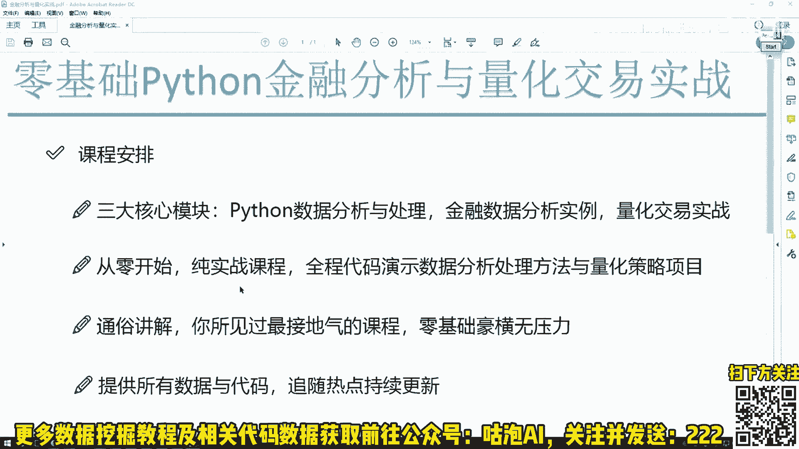

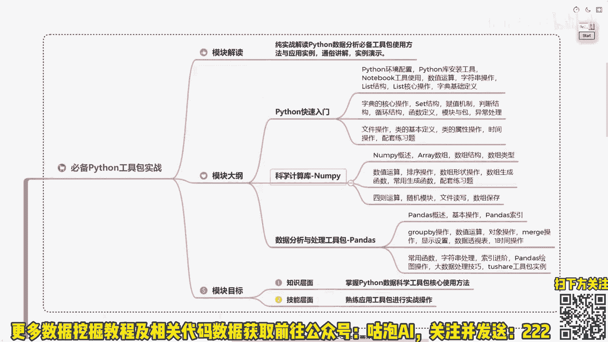

玩。然后呢第二模块第二模块，我们要过渡到这个python的金融数据分析当中。在这里啊，我们也是一个纯实战内容啊，会拿到我们实际股票数据跟大家去说一个股票数据来之后，我们该怎么样去分析怎么样去做建模，哎。

怎么样做统计。并且呢在这个量化平台当中啊，我们该怎么样去使用这个平台。哎，完成我们第一个回测的一个项目，看一看我们的策略在历史的数据当中啊，咱们到底是赔了还是赚了，以及我们各项指标是什么情况。

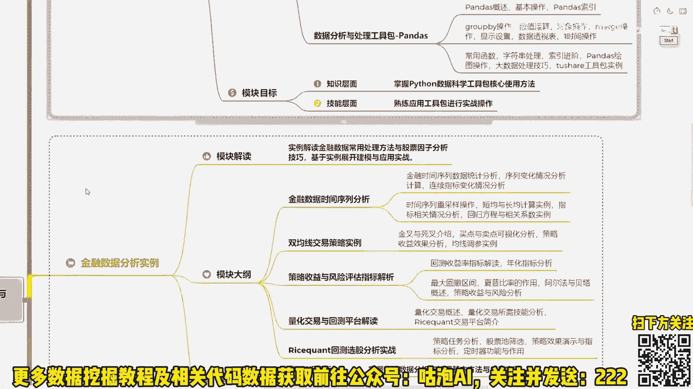

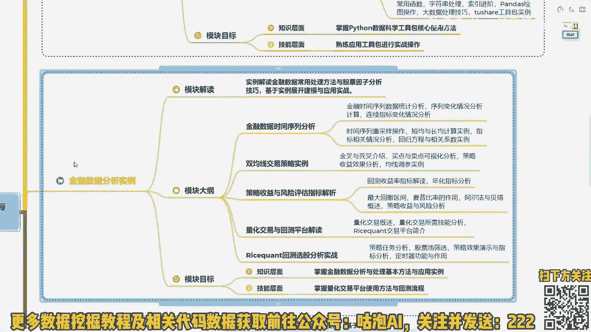

第三模块啊，我们就要是主要啊深入到这个量化交易当中了。会给大家去讲啊量化交易当中。哎，我们一些常用的经典策略，以及呢哎我们一些实际操作当中啊，数据我们该怎么处理。因此我们该怎么样去分析实际制定出来策略。

我们该怎么样进行改进，怎么样融入到这个历史数据当中，并且呢获得一个哎比较好的一个收益的结果。好了，这个就是我们课程大纲当中啊主要涉及到的三大模块，跟大家简单的做了一个介绍。行了。

这个就是咱们第一节课来说啊，我们的一个主要内容吧，跟大家简单概述一下咱们课程内容以及呢我上课的一个风格。还有啊就是我们会涉及到哎哪些个知识点。接下来我们就进入到咱们的正式课程当中。

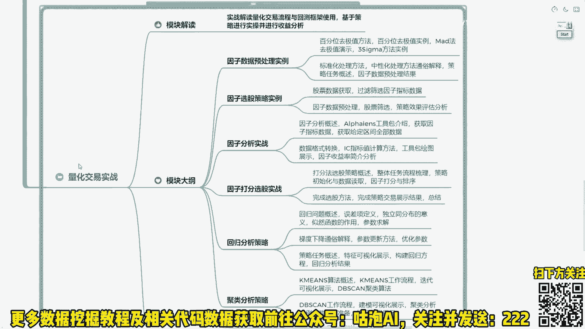

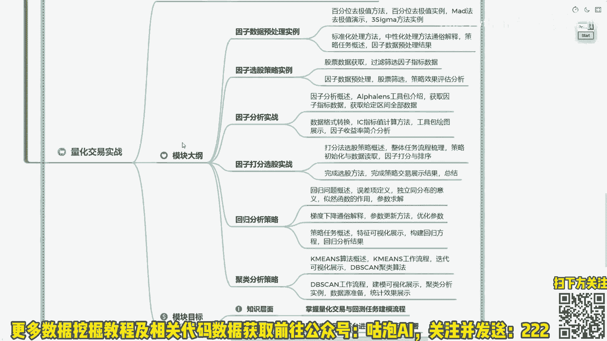

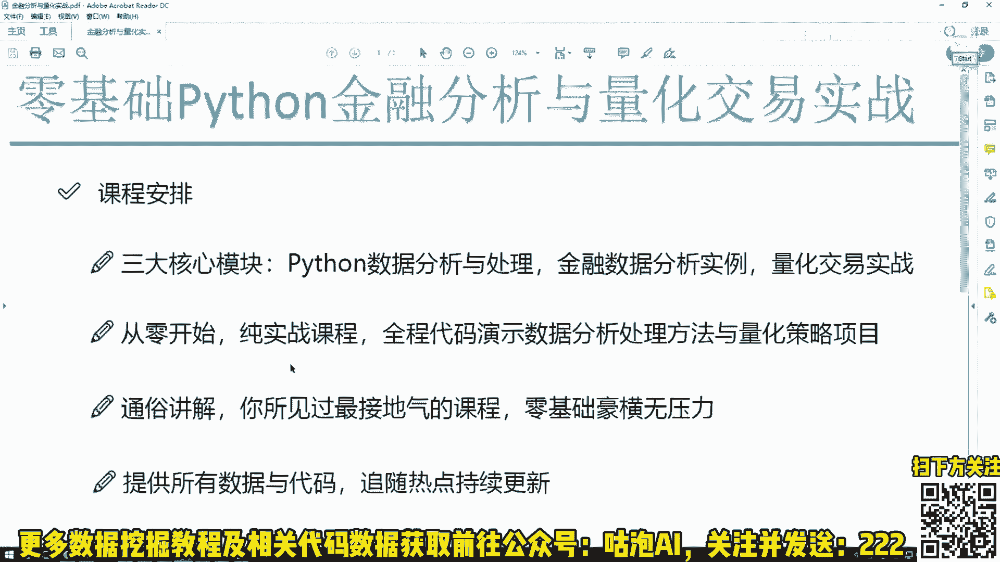